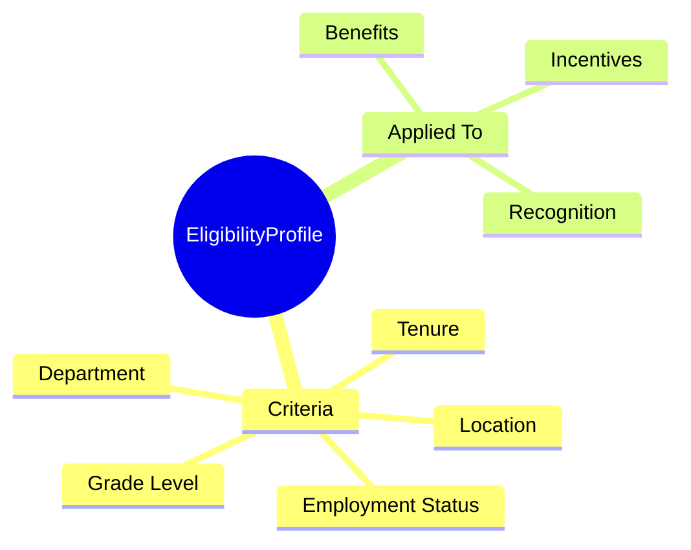

# EligibilityProfile

## Overview



**EligibilityProfile** định nghĩa điều kiện để nhân viên đủ điều kiện tham gia các chương trình benefits, incentives.

## Attributes Guide

### ruleJson Examples

**Tenure-based:**
```json
{
  "type": "AND",
  "conditions": [
    {"field": "employmentStatus", "op": "eq", "value": "ACTIVE"},
    {"field": "tenure", "op": "gte", "value": 90}
  ]
}
```

**Grade-based:**
```json
{
  "type": "AND", 
  "conditions": [
    {"field": "gradeCode", "op": "in", "value": ["G3", "G4", "G5"]},
    {"field": "employeeType", "op": "eq", "value": "FULLTIME"}
  ]
}
```

## Examples

### Example 1: Full-time 90 Days
- **code**: FT_90DAYS
- **name**: Full-time After 90 Days
- **rule**: Employment = ACTIVE AND Tenure >= 90 days

### Example 2: Manager Level
- **code**: MANAGER_LEVEL
- **name**: Manager Level and Above
- **rule**: Grade in (M1, M2, M3, M4)

## Related Entities

| Entity | Relationship | Description |
|--------|--------------|-------------|
| [[BenefitPlan]] | appliesTo | Plans using profile |
