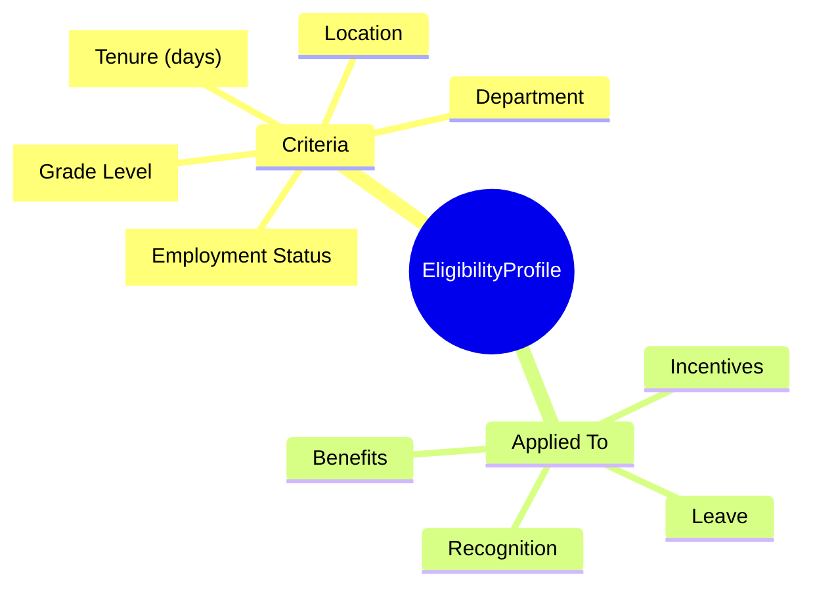
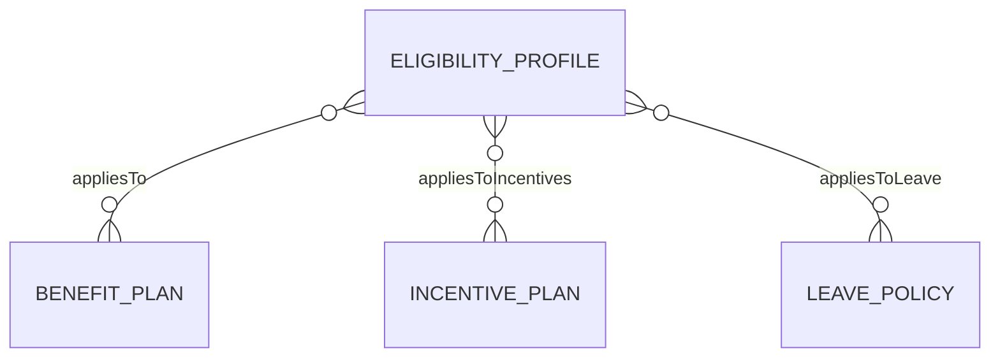
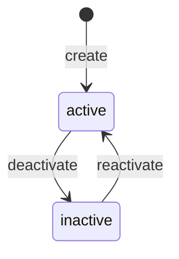
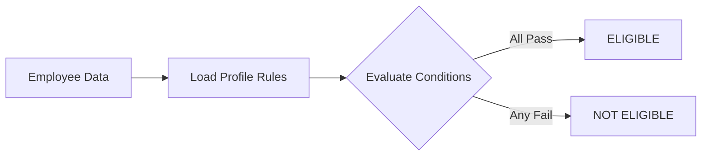

# EligibilityProfile

## Overview

**EligibilityProfile** định nghĩa điều kiện để nhân viên đủ điều kiện tham gia các chương trình benefits, incentives, recognition. Dùng chung cho nhiều programs.



## Business Context

### Key Stakeholders
- **Benefits Team**: Define eligibility for benefit plans
- **Compensation Team**: Define eligibility for incentives
- **HR Admin**: Check employee eligibility
- **System**: Auto-evaluate eligibility

### Eligibility Criteria Types

| Criteria | Description | Example |
|----------|-------------|---------|
| **Employment Status** | ACTIVE, PROBATION, etc. | = ACTIVE |
| **Tenure** | Days since hire | >= 90 days |
| **Grade Level** | Job grade | in (G3, G4, G5) |
| **Employment Type** | FULLTIME, PARTTIME | = FULLTIME |
| **Location** | Work location | = HCM |
| **Department** | Org unit | = Engineering |

### Business Value
EligibilityProfile cho phép define once, apply many - cùng một profile có thể dùng cho nhiều benefit plans, incentive plans.

## Attributes Guide

### Core Identity
- **code**: Mã duy nhất. Format: FT_90DAYS, MANAGER_LEVEL
- **name**: Tên hiển thị. VD: "Full-time After 90 Days"

### Rule Configuration (ruleJson)

**Rule Structure:**
```json
{
  "type": "AND|OR",
  "conditions": [
    {
      "field": "string",
      "op": "eq|neq|gt|gte|lt|lte|in|contains",
      "value": "any"
    }
  ]
}
```

**Available Fields:**
| Field | Type | Description |
|-------|------|-------------|
| `employmentStatus` | enum | ACTIVE, PROBATION, etc. |
| `employeeType` | enum | FULLTIME, PARTTIME, etc. |
| `tenure` | number | Days since hire |
| `gradeCode` | string | Job grade code |
| `locationCode` | string | Work location |
| `departmentCode` | string | Department code |
| `jobFamilyCode` | string | Job family |

## Relationships Explained



### Cross-Module Usage
EligibilityProfile is shared across:
- [[BenefitPlan]] - Benefit enrollment
- [[IncentivePlan]] - Bonus eligibility
- [[LeavePolicy]] - Leave entitlement

## Lifecycle & Workflows



### Eligibility Evaluation Flow



## Actions & Operations

### create
**Who**: HR Policy Team  
**Required**: code, name, ruleJson, effectiveStartDate

### updateRule
**Who**: HR Policy Team  
**Purpose**: Cập nhật điều kiện eligibility  
**Affects**: ruleJson

## Business Rules

#### Unique Code (uniqueCode)
**Rule**: Profile code phải duy nhất.

#### Valid Rule (validRule)
**Rule**: ruleJson phải có format hợp lệ.

## Examples

### Example 1: Full-time After 90 Days
```yaml
code: FT_90DAYS
name: "Full-time After 90 Days"
ruleJson:
  type: AND
  conditions:
    - field: employmentStatus
      op: eq
      value: ACTIVE
    - field: employeeType
      op: eq
      value: FULLTIME
    - field: tenure
      op: gte
      value: 90
```

### Example 2: Manager Level and Above
```yaml
code: MANAGER_LEVEL
name: "Manager Level and Above"
ruleJson:
  type: AND
  conditions:
    - field: gradeCode
      op: in
      value: ["M1", "M2", "M3", "M4"]
    - field: employmentStatus
      op: eq
      value: ACTIVE
```

### Example 3: HCM Office Only
```yaml
code: HCM_OFFICE
name: "HCM Office Employees"
ruleJson:
  type: AND
  conditions:
    - field: locationCode
      op: eq
      value: HCM
    - field: employeeType
      op: in
      value: ["FULLTIME", "PARTTIME"]
```

### Example 4: Complex OR Condition
```yaml
code: TECH_OR_SENIOR
name: "Tech Department or Senior Grade"
ruleJson:
  type: OR
  conditions:
    - field: departmentCode
      op: eq
      value: ENGINEERING
    - field: gradeCode
      op: in
      value: ["S1", "S2", "M1"]
```

## Related Entities

| Entity | Relationship | Description |
|--------|--------------|-------------|
| [[BenefitPlan]] | appliesTo | Benefit eligibility |
| [[IncentivePlan]] | appliesToIncentives | Incentive eligibility |
| [[LeavePolicy]] | appliesToLeave | Leave eligibility |
