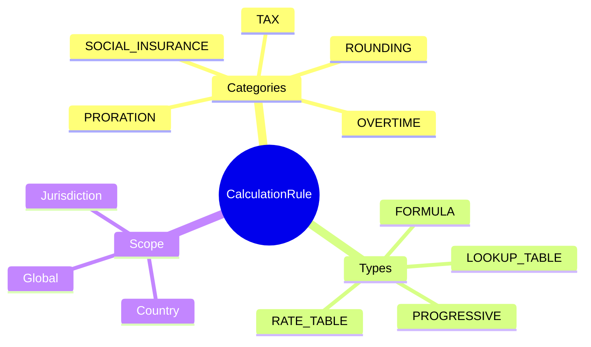
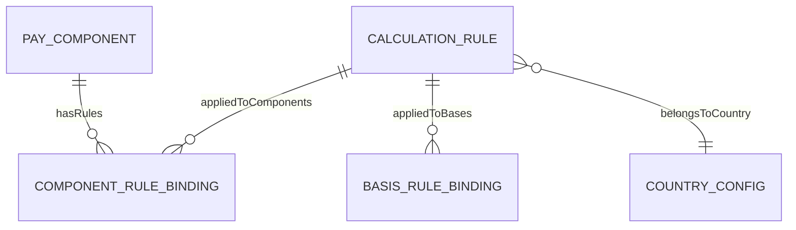
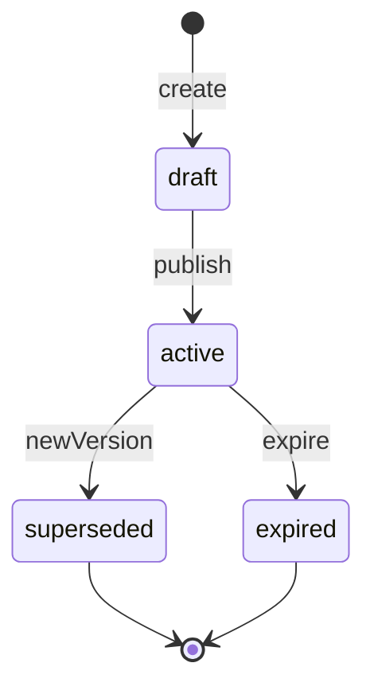

# CalculationRule

## Overview

**CalculationRule** định nghĩa các quy tắc tính toán - thuế TNCN, bảo hiểm xã hội, OT, proration. Là AGGREGATE_ROOT của calculation domain, versioned theo SCD-2 để track changes theo thời gian.



## Business Context

### Key Stakeholders
- **Compliance Team**: Define statutory rules
- **Payroll Team**: Apply rules in calculation
- **Legal**: Verify compliance
- **Finance**: Audit calculations

### Rule Categories Explained

| Category | Description | Update Frequency | Example |
|----------|-------------|------------------|---------|
| **TAX** | Income tax calculation | Annual/Law change | VN PIT brackets |
| **SOCIAL_INSURANCE** | SI/HI contribution rates | Annual | BHXH 8%/17.5% |
| **OVERTIME** | OT multipliers | Rare | 150%, 200%, 300% |
| **PRORATION** | Partial period calculation | Rare | Calendar days method |
| **ROUNDING** | Amount rounding | Rare | Round to 1000 VND |

### Business Value
CalculationRule cho phép centralize statutory compliance, track version history, và apply consistently across payroll.

## Attributes Guide

### Core Identity
- **code**: Mã duy nhất. Format: VN_PIT_2025, VN_BHXH_2025
- **name**: Tên hiển thị. VD: "Vietnam PIT Progressive Tax 2025"
- **ruleCategory**: Category (TAX, SOCIAL_INSURANCE, etc.)
- **ruleType**: Logic type (PROGRESSIVE, RATE_TABLE, etc.)

### Scope
- **countryCode**: ISO 3166-1 code (VN, SG, US)
- **jurisdiction**: State/Province nếu applicable
- **legalReference**: Citation. VD: "Điều 23, Luật TNCN 2007"

### Formula Definition (formulaJson)
JSON structure tùy thuộc vào ruleType:

**PROGRESSIVE (Tax Brackets):**
```json
{
  "brackets": [
    {"from": 0, "to": 5000000, "rate": 0.05},
    {"from": 5000000, "to": 10000000, "rate": 0.10}
  ],
  "personalDeduction": 11000000,
  "dependentDeduction": 4400000
}
```

**RATE_TABLE (SI Rates):**
```json
{
  "employee": {"bhxh": 0.08, "bhyt": 0.015, "bhtn": 0.01},
  "employer": {"bhxh": 0.175, "bhyt": 0.03, "bhtn": 0.01},
  "ceiling": 36000000
}
```

## Relationships Explained



### ComponentRuleBinding
- **appliedToComponents** → ComponentRuleBinding: Link rule to specific [[PayComponent]]

### CountryConfig
- **belongsToCountry** → [[CountryConfig]]: Country settings

## Lifecycle & Workflows



| State | Meaning |
|-------|---------|
| **draft** | Đang prepare |
| **active** | Đang sử dụng |
| **superseded** | Replaced by newer version |
| **expired** | No longer applicable |

### Version Update Flow


## Actions & Operations

### create
**Who**: Compliance Team  
**Required**: code, name, ruleCategory, ruleType, formulaJson, effectiveStartDate

### publish
**Who**: Compliance Team  
**When**: Ready for use in payroll

### createNewVersion
**Who**: Compliance Team  
**When**: Law change, rate update  
**Required**: formulaJson, effectiveStartDate

## Business Rules

#### Unique Current Code (uniqueCurrentCode)
**Rule**: Code unique among current versions.

#### Valid Formula (validFormula)
**Rule**: formulaJson must be valid calculation definition.

## Examples

### Example 1: Vietnam PIT 2025 (Progressive Tax)
```yaml
code: VN_PIT_2025
name: "Vietnam PIT Progressive Tax 2025"
ruleCategory: TAX
ruleType: PROGRESSIVE
countryCode: VN
legalReference: "Luật thuế TNCN 2007, sửa đổi 2012"
formulaJson:
  brackets:
    - { from: 0, to: 5000000, rate: 0.05 }
    - { from: 5000000, to: 10000000, rate: 0.10 }
    - { from: 10000000, to: 18000000, rate: 0.15 }
    - { from: 18000000, to: 32000000, rate: 0.20 }
    - { from: 32000000, to: 52000000, rate: 0.25 }
    - { from: 52000000, to: 80000000, rate: 0.30 }
    - { from: 80000000, to: null, rate: 0.35 }
  personalDeduction: 11000000
  dependentDeduction: 4400000
effectiveStartDate: "2025-01-01"
```

### Example 2: Vietnam Social Insurance 2025
```yaml
code: VN_BHXH_2025
name: "Vietnam Social Insurance 2025"
ruleCategory: SOCIAL_INSURANCE
ruleType: RATE_TABLE
countryCode: VN
legalReference: "Luật BHXH 2014"
formulaJson:
  employee:
    bhxh: 0.08
    bhyt: 0.015
    bhtn: 0.01
  employer:
    bhxh: 0.175
    bhyt: 0.03
    bhtn: 0.01
  ceiling: 36000000
effectiveStartDate: "2025-01-01"
```

### Example 3: Proration Rule (Calendar Days)
```yaml
code: PRORATE_CALENDAR_DAYS
name: "Proration by Calendar Days"
ruleCategory: PRORATION
ruleType: FORMULA
formulaJson:
  formula: "monthlyAmount * (workingDays / totalDaysInMonth)"
  description: "Pro-rate based on calendar days worked"
effectiveStartDate: "2020-01-01"
```

## Related Entities

| Entity | Relationship | Description |
|--------|--------------|-------------|
| [[PayComponent]] | via ComponentRuleBinding | Components using rule |
| [[SalaryBasis]] | via BasisRuleBinding | Bases using rule |
| [[CountryConfig]] | belongsToCountry | Country settings |
