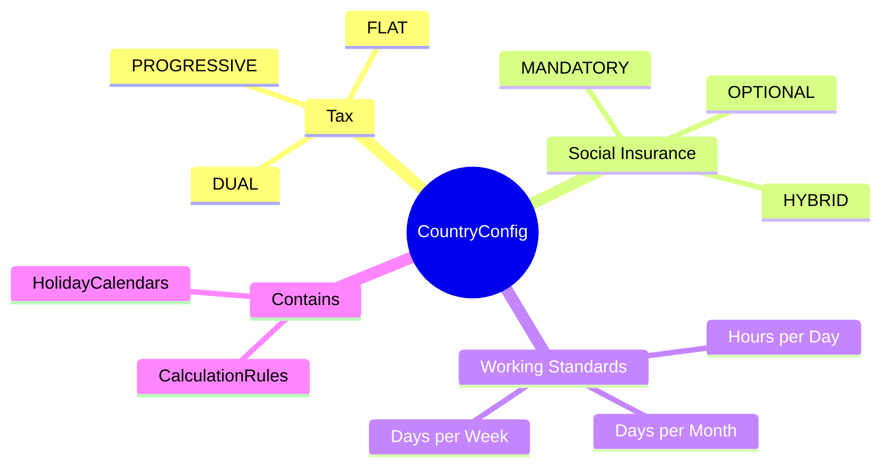
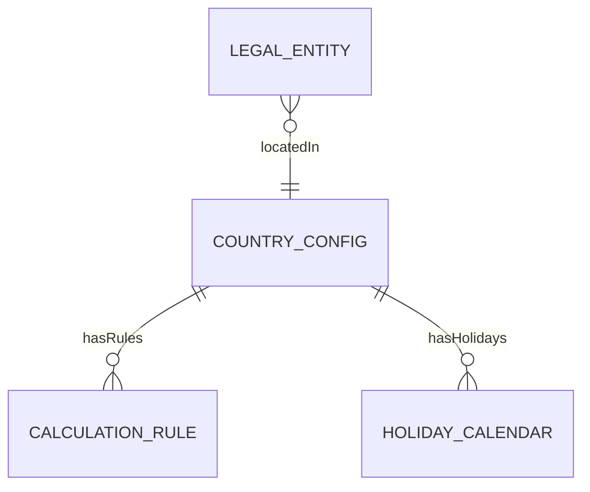
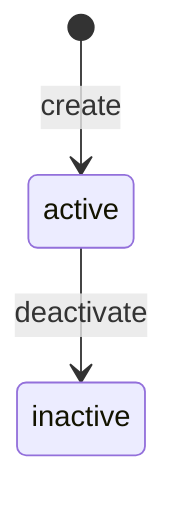

# CountryConfig

## Overview

**CountryConfig** định nghĩa cấu hình quốc gia cho tính lương - giờ làm việc chuẩn, hệ thống thuế, bảo hiểm xã hội. Là REFERENCE_DATA, shared giữa TR, TA, và Payroll modules.



## Business Context

### Key Stakeholders
- **Compliance Team**: Maintain country configurations
- **Payroll Team**: Use for calculations
- **HR Admin**: Reference for policies
- **Finance**: Multi-country reporting

### Supported Countries

| Country | Currency | Tax System | SI System |
|---------|----------|------------|-----------|
| **VN** | VND | PROGRESSIVE | MANDATORY |
| **SG** | SGD | PROGRESSIVE | MANDATORY (CPF) |
| **US** | USD | PROGRESSIVE | HYBRID |
| **TH** | THB | PROGRESSIVE | MANDATORY |

### Business Value
CountryConfig centralizes country-specific settings, ensures compliance với local regulations, và enables multi-country payroll.

## Attributes Guide

### Core Identity
- **countryCode**: ISO 3166-1 alpha-2. VD: VN, SG, US
- **countryName**: Tên quốc gia
- **currencyCode**: ISO 4217. VD: VND, SGD, USD

### Tax & SI System
- **taxSystem**: 
  - *PROGRESSIVE*: Tax brackets (VN, SG)
  - *FLAT*: Single rate
  - *DUAL*: Combination
- **siSystem**:
  - *MANDATORY*: Required contributions (VN, SG)
  - *OPTIONAL*: Employee choice
  - *HYBRID*: Some mandatory, some optional

### Working Standards
- **standardWorkingHoursPerDay**: Giờ làm/ngày (thường 8)
- **standardWorkingDaysPerWeek**: Ngày làm/tuần (thường 5)
- **standardWorkingDaysPerMonth**: Ngày làm/tháng (VN: 26 theo luật, thực tế ~22)

### Extended Configuration (configJson)
```json
{
  "minimumWage": {
    "region1": 4960000,
    "region2": 4410000,
    "region3": 3860000,
    "region4": 3250000
  },
  "publicHolidaysPerYear": 11,
  "annualLeaveMinDays": 12,
  "probationMaxMonths": 2,
  "noticePeriodDefault": 30
}
```

## Relationships Explained



### CalculationRule
- **hasRules** → [[CalculationRule]]: Country-specific calculation rules (tax, SI)

### HolidayCalendar
- **hasHolidays** → [[HolidayCalendar]]: Holiday calendars for this country

## Lifecycle & Workflows



| State | Meaning |
|-------|---------|
| **active** | Country supported |
| **inactive** | Country no longer supported |

## Actions & Operations

### create
**Who**: Compliance Team  
**Required**: countryCode, countryName, currencyCode

### updateConfig
**Who**: Compliance Team  
**When**: Law changes, minimum wage update

## Business Rules

#### Valid Country Code (validCountryCode)
**Rule**: Must be valid ISO 3166-1 alpha-2 code.

## Examples

### Example 1: Vietnam
```yaml
countryCode: VN
countryName: "Vietnam"
currencyCode: VND
taxSystem: PROGRESSIVE
siSystem: MANDATORY
standardWorkingHoursPerDay: 8
standardWorkingDaysPerWeek: 5
standardWorkingDaysPerMonth: 26  # Theo luật
configJson:
  minimumWage:
    region1: 4960000
    region2: 4410000
    region3: 3860000
    region4: 3250000
  publicHolidaysPerYear: 11
  annualLeaveMinDays: 12
  probationMaxMonths: 2
  noticePeriodDefault: 30
```

### Example 2: Singapore
```yaml
countryCode: SG
countryName: "Singapore"
currencyCode: SGD
taxSystem: PROGRESSIVE
siSystem: MANDATORY
standardWorkingHoursPerDay: 8
standardWorkingDaysPerWeek: 5
standardWorkingDaysPerMonth: 22
configJson:
  cpfCeilingMonthly: 6800
  cpfCeilingAnnual: 102000
  awsMonths: 1
  annualLeaveMinDays: 7
```

### Example 3: United States
```yaml
countryCode: US
countryName: "United States"
currencyCode: USD
taxSystem: PROGRESSIVE
siSystem: HYBRID
standardWorkingHoursPerDay: 8
standardWorkingDaysPerWeek: 5
standardWorkingDaysPerMonth: 22
configJson:
  federalMinimumWage: 7.25
  overtimeThresholdWeekly: 40
  fica:
    socialSecurity: 0.062
    medicare: 0.0145
```

## Related Entities

| Entity | Relationship | Description |
|--------|--------------|-------------|
| [[CalculationRule]] | hasRules | Country-specific rules |
| [[HolidayCalendar]] | hasHolidays | Holiday calendar |
| [[LegalEntity]] | indirect | Entities in country |
