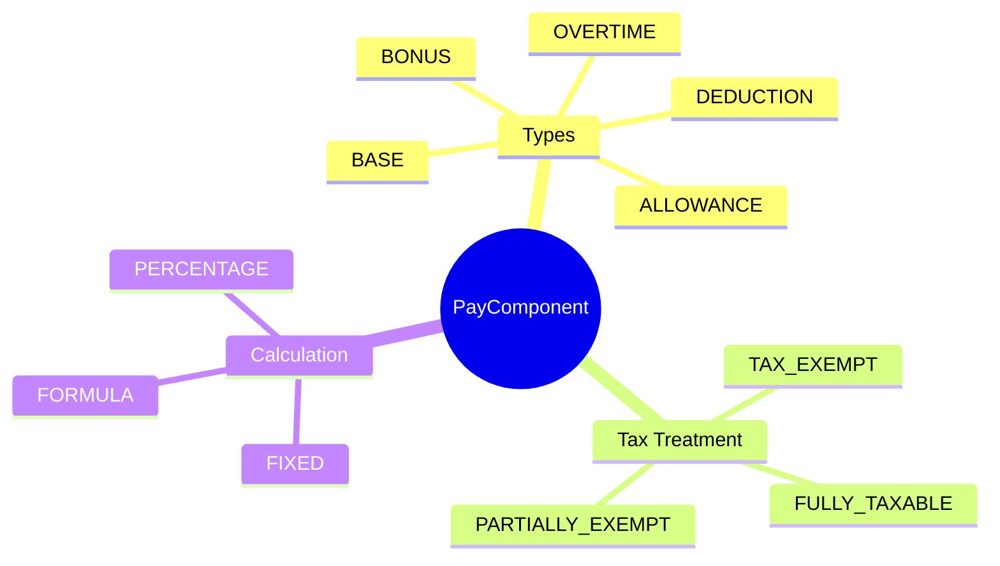
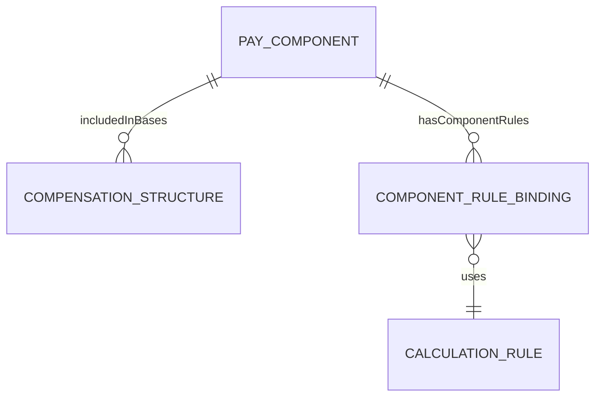
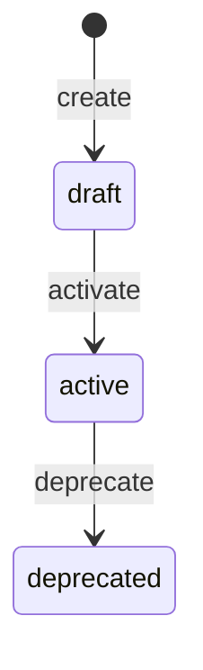

# PayComponent

## Overview

**PayComponent** định nghĩa các thành phần của gói lương - lương cơ bản, phụ cấp, thưởng, khấu trừ. Mỗi component có rules về thuế và bảo hiểm.

## Business Context

### Key Stakeholders
- **Compensation Team**: Define components
- **Payroll**: Use for calculation
- **Finance**: GL mapping

### Business Processes
- **Compensation Planning**: Design pay structures
- **Offer Management**: Include in offer packages
- **Payroll Processing**: Calculate amounts

## Attributes Guide

### Component Types
| Type | Description | Impact | Example |
|------|-------------|--------|---------|
| **BASE** | Base salary | + Gross | Basic Salary |
| **ALLOWANCE** | Additions | + Gross | Lunch, Transport |
| **BONUS** | Variable pay | + Gross | Performance Bonus |
| **OVERTIME** | OT payments | + Gross | OT 150%, OT 200% |
| **DEDUCTION** | Subtractions | - Net | BHXH, Loans |

### Tax Treatment
- **FULLY_TAXABLE**: Toàn bộ chịu thuế TNCN
- **TAX_EXEMPT**: Miễn thuế hoàn toàn (e.g., meal allowance ≤ 730,000đ)
- **PARTIALLY_EXEMPT**: Miễn thuế đến ngưỡng

## Relationships Explained

## Lifecycle & Workflows

## Examples

### Example 1: Basic Salary
- **code**: LUONG_CO_BAN
- **name**: Lương cơ bản
- **componentType**: BASE
- **frequency**: MONTHLY
- **taxable**: true
- **isSubjectToSI**: true

### Example 2: Lunch Allowance (Partially Exempt)
- **code**: PHU_CAP_AN_TRUA
- **name**: Phụ cấp ăn trưa
- **componentType**: ALLOWANCE
- **taxTreatment**: PARTIALLY_EXEMPT
- **taxExemptThreshold**: 730000

### Example 3: Overtime 150%
- **code**: LAM_THEM_150
- **name**: Làm thêm giờ 150%
- **componentType**: OVERTIME
- **calculationMethod**: FORMULA

## Related Entities

| Entity | Relationship | Description |
|--------|--------------|-------------|
| [[SalaryBasis]] | via CompensationStructure | Bases using this component |
| [[CalculationRule]] | via ComponentRuleBinding | Calculation formulas |
| [[OfferTemplate]] | includes | Used in offer packages |
