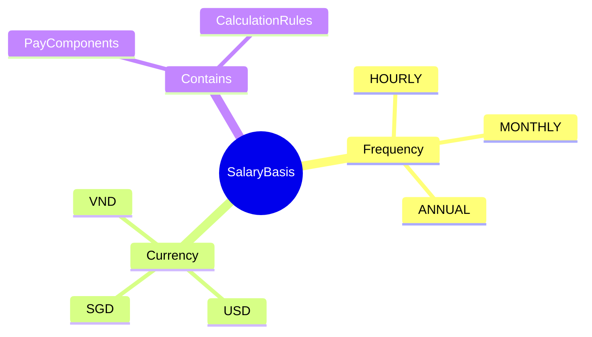
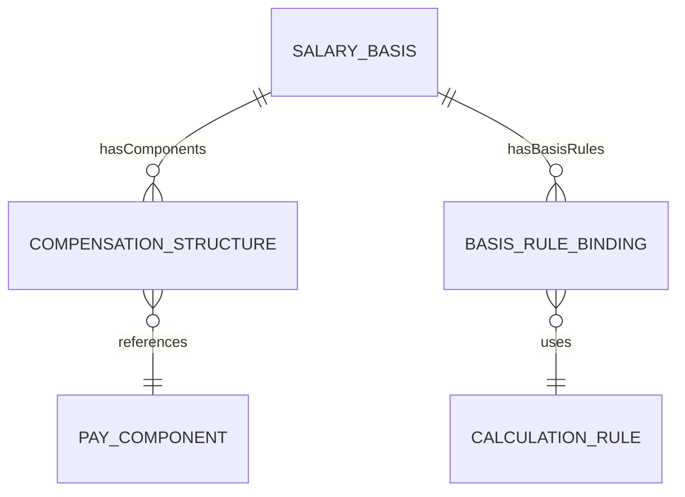
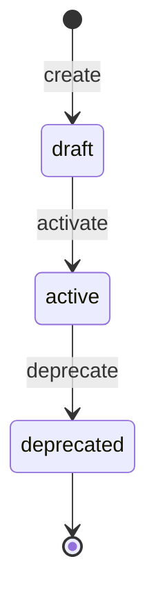
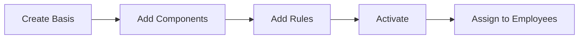

# SalaryBasis

## Overview

**SalaryBasis** định nghĩa cách tính lương cơ bản cho nhân viên - theo giờ, tháng, hoặc năm. Là AGGREGATE_ROOT của compensation structure, mỗi basis chứa các [[PayComponent]] và calculation rules.



## Business Context

### Key Stakeholders
- **Compensation Team**: Define và maintain salary structures
- **HR Admin**: Assign basis to employees
- **Payroll**: Use for calculation
- **Finance**: Budget planning

### Pay Frequency Explained

| Frequency | Description | Use Case |
|-----------|-------------|----------|
| **HOURLY** | Tính theo giờ | Factory workers, part-time |
| **DAILY** | Tính theo ngày | Contractors, seasonal |
| **WEEKLY** | Trả hàng tuần | Some US companies |
| **BIWEEKLY** | Trả 2 tuần/lần | US standard |
| **SEMIMONTHLY** | Trả 2 lần/tháng | 15th và 30th |
| **MONTHLY** | Trả hàng tháng | VN standard |
| **ANNUAL** | Lương năm | Executive packages |

### Business Value
SalaryBasis cho phép định nghĩa cấu trúc lương chuẩn, reuse cho nhiều employees, và maintain version history.

## Attributes Guide

### Core Identity
- **code**: Mã duy nhất. Format: LUONG_THANG_VN, HOURLY_US
- **name**: Tên hiển thị. VD: "Lương tháng chuẩn Việt Nam"

### Pay Configuration
- **frequency**: Chu kỳ trả lương
- **currency**: Mã tiền tệ (VND, USD, SGD)
- **allowComponents**: Có cho phép thêm components không?

### Metadata (JSON)
Extended configuration:
```json
{
  "prorationMethod": "CALENDAR_DAYS",
  "workingDaysPerMonth": 22,
  "standardHoursPerDay": 8,
  "overtimeEnabled": true
}
```

## Relationships Explained



### CompensationStructure
- **hasComponents** → CompensationStructure: Links to pay components. VD: Lương cơ bản + Phụ cấp

### BasisRuleBinding
- **hasBasisRules** → BasisRuleBinding: Calculation rules (tax, SI, proration)

## Lifecycle & Workflows



| State | Meaning |
|-------|---------|
| **draft** | Đang setup, chưa assign được |
| **active** | Có thể assign cho employees |
| **deprecated** | Không dùng cho new assignments |

### Assignment Flow



## Actions & Operations

### create
**Who**: Compensation Team  
**Required**: code, name, frequency, currency, effectiveStartDate

### activate
**Who**: Compensation Team  
**When**: Ready for use

### addComponent
**Who**: Compensation Team  
**Purpose**: Thêm pay component vào basis  
**Required**: componentId

## Business Rules

#### Unique Code (uniqueCode)
**Rule**: Salary basis code phải duy nhất.

#### Valid Currency (validCurrency)
**Rule**: Currency phải là ISO 4217 code hợp lệ.

#### Edit Access (editAccess)
**Rule**: Chỉ Compensation Admin được edit.

## Examples

### Example 1: Vietnam Monthly Salary
```yaml
code: LUONG_THANG_VN
name: "Lương tháng chuẩn Việt Nam"
frequency: MONTHLY
currency: VND
allowComponents: true
metadata:
  prorationMethod: WORKING_DAYS
  workingDaysPerMonth: 22
  standardHoursPerDay: 8
```

### Example 2: US Hourly Rate
```yaml
code: HOURLY_US
name: "US Hourly Rate"
frequency: HOURLY
currency: USD
allowComponents: false  # Simple hourly, no extras
metadata:
  overtimeEnabled: true
  overtimeThreshold: 40  # hours/week
```

### Example 3: Singapore Monthly
```yaml
code: MONTHLY_SG
name: "Singapore Monthly Salary"
frequency: MONTHLY
currency: SGD
allowComponents: true
```

## Related Entities

| Entity | Relationship | Description |
|--------|--------------|-------------|
| [[PayComponent]] | via CompensationStructure | Components in this basis |
| [[CalculationRule]] | via BasisRuleBinding | Global rules applied |
| [[Employee]] | indirect | Employees using this basis |
