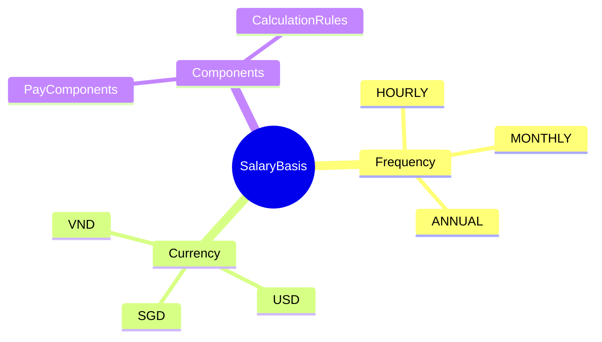
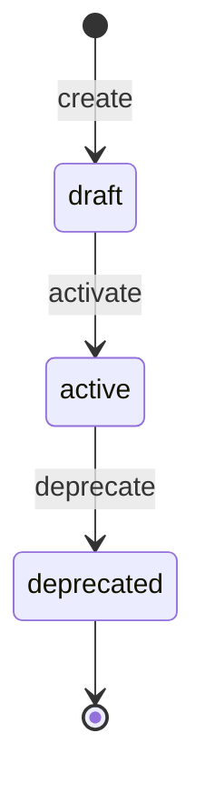

# SalaryBasis

## Overview

**SalaryBasis** định nghĩa cách tính lương cơ bản cho nhân viên - theo giờ, tháng, hoặc năm. Mỗi basis chứa các pay components và rules tính toán.

## Business Context

### Key Stakeholders
- **Compensation Team**: Define và maintain salary structures
- **HR Admin**: Assign basis to employees
- **Payroll**: Use for calculation

### Business Processes
- **New Hire Setup**: Assign salary basis
- **Compensation Planning**: Define structures
- **Payroll Processing**: Calculate based on basis

## Attributes Guide

### Frequency
- **HOURLY**: Tính lương theo giờ làm việc
- **MONTHLY**: Lương cố định hàng tháng (phổ biến tại VN)
- **ANNUAL**: Lương theo năm (thường chia 12)

## Relationships Explained

- **hasComponents** → [[CompensationStructure]]: Links to pay components included in this basis
- **hasBasisRules** → [[BasisRuleBinding]]: Calculation rules (tax, SI, proration)

## Lifecycle & Workflows

## Examples

### Example 1: Vietnam Monthly Salary
- **code**: LUONG_THANG_VN
- **name**: Lương tháng chuẩn Việt Nam
- **frequency**: MONTHLY
- **currency**: VND
- **allowComponents**: true

### Example 2: US Hourly
- **code**: HOURLY_US
- **name**: US Hourly Rate
- **frequency**: HOURLY
- **currency**: USD

## Related Entities

| Entity | Relationship | Description |
|--------|--------------|-------------|
| [[PayComponent]] | via CompensationStructure | Components in this basis |
| [[BasisRuleBinding]] | hasBasisRules | Calculation rules |
| [[CalculationRule]] | via BasisRuleBinding | Global rules applied |
