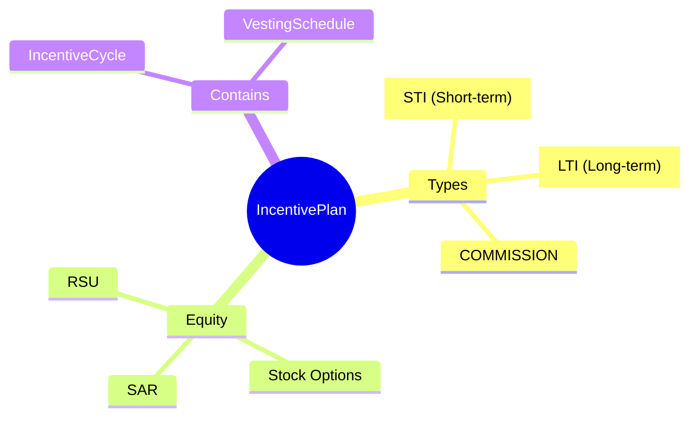

# IncentivePlan

## Overview

**IncentivePlan** định nghĩa chương trình thưởng - bonus hàng năm, commission, equity grants. Mỗi plan có formula tính và eligibility rules.

## Business Context

### Key Stakeholders
- **Compensation Team**: Design incentive structures
- **Managers**: Allocate bonuses
- **Employees**: Receive incentives

### Business Processes
- **Goal Setting**: Define targets
- **Performance Review**: Evaluate achievement
- **Payout Processing**: Calculate and pay

## Examples

### Example 1: Annual Performance Bonus
- **code**: ANNUAL_BONUS
- **name**: Annual Performance Bonus
- **bonusType**: STI
- **equityFlag**: false
- **formula**: `baseSalary * targetPct * performanceMultiplier`

### Example 2: RSU Grant Program
- **code**: RSU_PROGRAM
- **name**: RSU Grant Program
- **bonusType**: LTI
- **equityFlag**: true

## Related Entities

| Entity | Relationship | Description |
|--------|--------------|-------------|
| [[IncentiveCycle]] | hasCycles | Award cycles |
