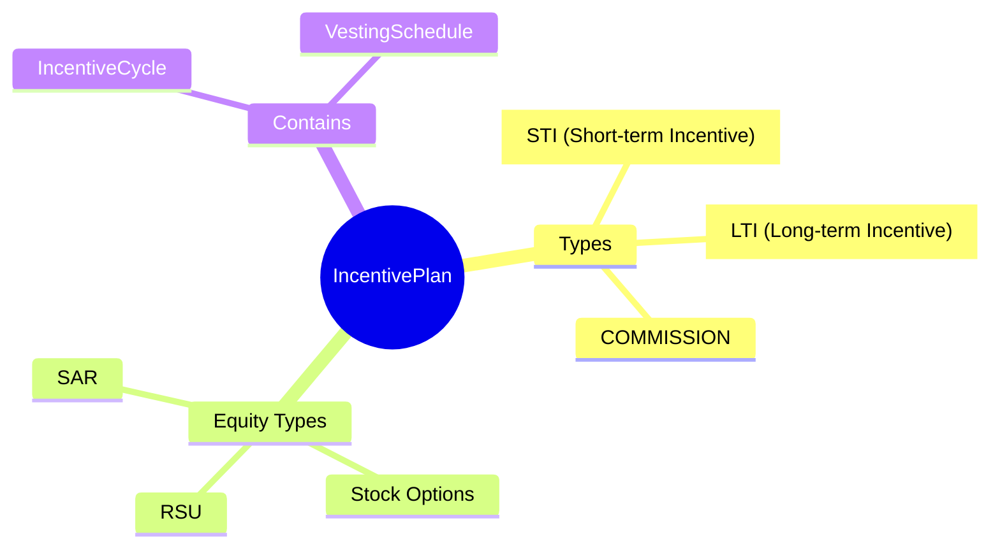
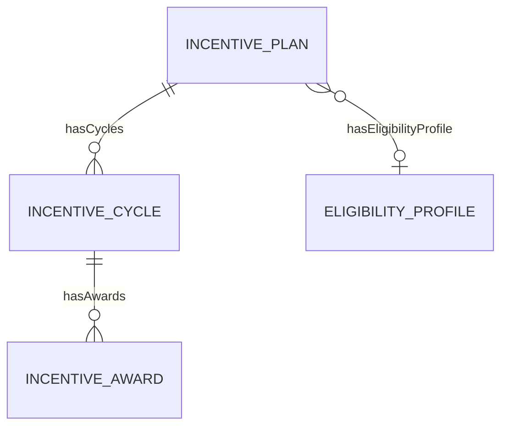
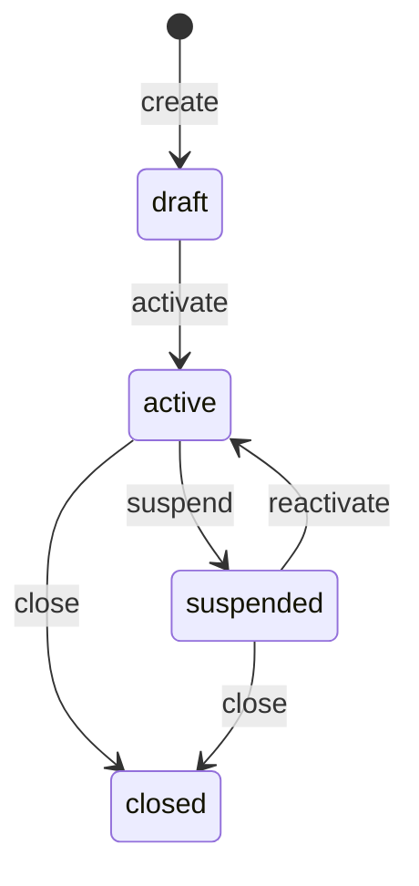
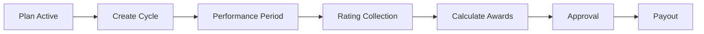

# IncentivePlan

## Overview

**IncentivePlan** định nghĩa chương trình thưởng - bonus hàng năm (STI), equity grants (LTI), commission. Mỗi plan có formula tính và eligibility rules.



## Business Context

### Key Stakeholders
- **Compensation Team**: Design incentive structures
- **Managers**: Allocate bonuses, recommend awards
- **Finance**: Budget and accruals
- **Employees**: Receive incentives

### Incentive Types Explained

| Type | Description | Frequency | Example |
|------|-------------|-----------|---------|
| **STI** | Short-term Incentive | Annual/Quarterly | Performance bonus |
| **LTI** | Long-term Incentive | Multi-year | RSU, Stock options |
| **COMMISSION** | Sales incentive | Per sale/Monthly | Sales commission |

### Equity Instruments (LTI)

| Instrument | Value | Vesting | Use Case |
|------------|-------|---------|----------|
| **RSU** | Actual shares | Time-based | Retention, key hires |
| **Stock Options** | Right to buy | Time + performance | Startups |
| **SAR** | Stock Appreciation Rights | Time-based | Cash alternative |

### Business Value
IncentivePlan cho phép design flexible variable pay programs, link pay to performance, và retain key talent.

## Attributes Guide

### Core Identity
- **code**: Mã duy nhất. Format: ANNUAL_BONUS, RSU_PROGRAM
- **name**: Tên hiển thị. VD: "Annual Performance Bonus"
- **description**: Mô tả chi tiết program

### Plan Type
- **bonusType**: STI, LTI, or COMMISSION
- **equityFlag**: true nếu là equity plan

### Formula Definition (formulaJson)

**Performance Bonus Formula:**
```json
{
  "type": "MULTIPLICATION",
  "factors": [
    {"source": "baseSalary"},
    {"source": "targetPct", "default": 0.15},
    {"source": "performanceMultiplier", "range": [0, 2]}
  ],
  "cap": {"basis": "target", "multiplier": 2}
}
```

**Commission Formula:**
```json
{
  "type": "TIERED",
  "tiers": [
    {"from": 0, "to": 100, "rate": 0.05},
    {"from": 100, "to": 150, "rate": 0.08},
    {"from": 150, "to": null, "rate": 0.12}
  ],
  "basis": "quota_achievement_pct"
}
```

## Relationships Explained



### IncentiveCycle
- **hasCycles** → IncentiveCycle: Award cycles (annual, quarterly)

### EligibilityProfile
- **hasEligibilityProfile** → [[EligibilityProfile]]: Who is eligible

## Lifecycle & Workflows



| State | Meaning |
|-------|---------|
| **draft** | Đang design |
| **active** | Đang chạy |
| **suspended** | Tạm ngưng (budget issues) |
| **closed** | Kết thúc program |

### Annual Bonus Flow



## Actions & Operations

### create
**Who**: Compensation Team  
**Required**: code, name, bonusType, effectiveStartDate

### createCycle
**Who**: Compensation Team  
**When**: Start new performance period  
**Creates**: IncentiveCycle

### setEligibility
**Who**: Compensation Team  
**Purpose**: Link eligibility profile

## Business Rules

#### Unique Code (uniqueCode)
**Rule**: Plan code phải duy nhất.

#### Valid Formula (validFormula)
**Rule**: Formula phải valid khi plan active.

## Examples

### Example 1: Annual Performance Bonus (STI)
```yaml
code: ANNUAL_BONUS
name: "Annual Performance Bonus"
bonusType: STI
equityFlag: false
formulaJson:
  type: MULTIPLICATION
  factors:
    - source: baseSalary
    - source: targetPct
      default: 0.15
    - source: performanceMultiplier
      range: [0, 2]
effectiveStartDate: "2026-01-01"
```

### Example 2: RSU Grant Program (LTI)
```yaml
code: RSU_PROGRAM
name: "RSU Grant Program"
bonusType: LTI
equityFlag: true
formulaJson:
  grantType: RSU
  vestingSchedule: "4Y_1Y_CLIFF"  # 4 years, 1 year cliff
  vestingPct:
    year1: 25
    year2: 25
    year3: 25
    year4: 25
effectiveStartDate: "2026-01-01"
```

### Example 3: Sales Commission
```yaml
code: SALES_COMMISSION
name: "Sales Commission Plan"
bonusType: COMMISSION
equityFlag: false
formulaJson:
  type: TIERED
  tiers:
    - { from: 0, to: 100, rate: 0.05 }
    - { from: 100, to: 150, rate: 0.08 }
    - { from: 150, to: null, rate: 0.12 }
  basis: quota_achievement_pct
effectiveStartDate: "2026-01-01"
```

## Related Entities

| Entity | Relationship | Description |
|--------|--------------|-------------|
| IncentiveCycle | hasCycles | Award cycles |
| [[EligibilityProfile]] | hasEligibilityProfile | Eligibility rules |
| IncentiveAward | indirect | Individual awards |
