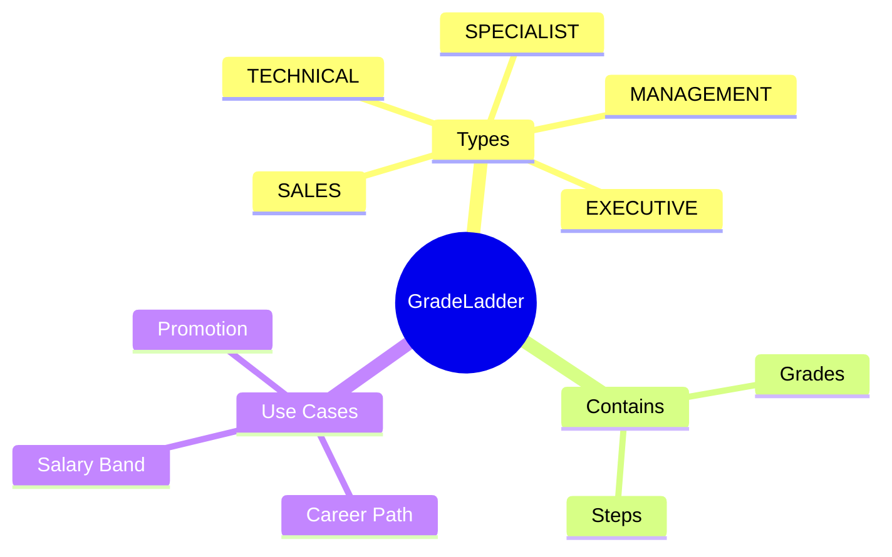
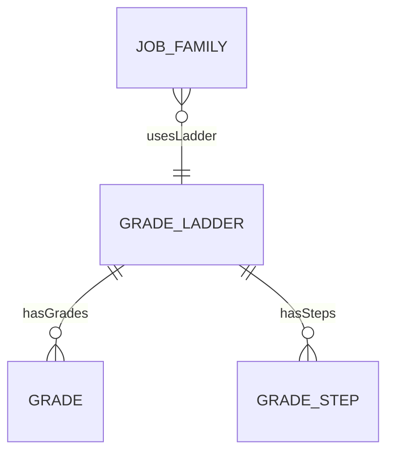
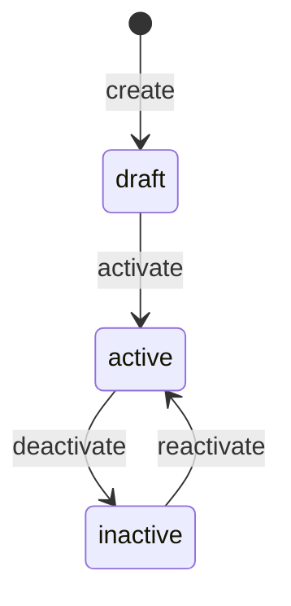
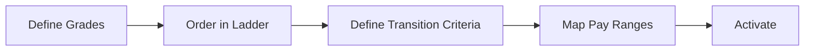

# GradeLadder

## Overview

**GradeLadder** định nghĩa lộ trình nghề nghiệp - chuỗi các [[Grade]]s mà nhân viên có thể tiến qua. Hỗ trợ nhiều tracks (management, technical, specialist).



## Business Context

### Key Stakeholders
- **HR Business Partner**: Design career paths
- **Compensation Team**: Map salary bands
- **Managers**: Promotion discussions
- **Employees**: Understand progression options

### Ladder Types

| Type | Description | Example |
|------|-------------|---------|
| **MANAGEMENT** | People management track | Team Lead → Manager → Director |
| **TECHNICAL** | Individual contributor | Engineer → Senior → Staff → Principal |
| **SPECIALIST** | Domain expert | Analyst → Senior → Principal |
| **SALES** | Sales track | AE → Senior AE → Account Director |
| **EXECUTIVE** | C-suite | VP → SVP → C-Level |

### Dual Career Track
Cho phép nhân viên chọn giữa management và technical track:

```
                    ┌─── M1 Team Lead
                    │
G3 Senior Engineer ─┼
                    │
                    └─── G4 Staff Engineer
```

### Business Value
GradeLadder cho phép visualize và communicate career paths, align compensation với progression, và support promotion planning.

## Attributes Guide

### Core Identity
- **code**: Mã duy nhất. Format: ENG_LADDER, MGT_LADDER
- **name**: Tên hiển thị. VD: "Engineering Career Ladder"
- **description**: Mô tả chi tiết progression criteria

### Ladder Type
- **ladderType**: Track category (MANAGEMENT, TECHNICAL, etc.)

## Relationships Explained



### Grade
- **hasGrades** → [[Grade]]: Ordered list of grades in the ladder

### GradeStep
- **hasSteps** → GradeStep: Salary steps within each grade (optional, for step-based progression)

## Lifecycle & Workflows



| State | Meaning |
|-------|---------|
| **draft** | Đang design |
| **active** | Đang sử dụng |
| **inactive** | Không dùng cho new assignments |

### Ladder Design Flow



## Actions & Operations

### create
**Who**: HR / Compensation Team  
**Required**: code, name, effectiveStartDate

### addGrade
**Who**: Compensation Team  
**Required**: gradeId, sortOrder

### defineSteps
**Who**: Compensation Team  
**Purpose**: Define salary steps within grades (optional)

## Business Rules

#### Unique Code (uniqueCode)
**Rule**: Ladder code phải duy nhất.

#### Has Grades (hasGrades)
**Rule**: Ladder phải có ít nhất 1 grade khi activate.

## Examples

### Example 1: Engineering Ladder (Technical)
```yaml
code: ENG_LADDER
name: "Engineering Career Ladder"
ladderType: TECHNICAL
grades:
  - gradeCode: G1
    sortOrder: 1
  - gradeCode: G2
    sortOrder: 2
  - gradeCode: G3
    sortOrder: 3
  - gradeCode: G4
    sortOrder: 4
  - gradeCode: G5
    sortOrder: 5
```

### Example 2: Management Ladder
```yaml
code: MGT_LADDER
name: "Management Career Ladder"
ladderType: MANAGEMENT
grades:
  - gradeCode: M1
    sortOrder: 1
  - gradeCode: M2
    sortOrder: 2
  - gradeCode: M3
    sortOrder: 3
  - gradeCode: M4
    sortOrder: 4
```

### Example 3: Dual Track Visualization
```
         Engineering Ladder           Management Ladder
              │                              │
G5 Principal ─┤                              │
              │                              │
G4 Staff ─────┤                              │
              ├─────── Crossover ────────────┤
G3 Senior ────┤                              ├── M1 Team Lead
              │                              │
G2 Engineer ──┤                              ├── M2 Manager
              │                              │
G1 Junior ────┤                              ├── M3 Sr Manager
```

## Related Entities

| Entity | Relationship | Description |
|--------|--------------|-------------|
| [[Grade]] | hasGrades | Levels in ladder |
| GradeStep | hasSteps | Salary steps |
| [[JobFamily]] | indirect | Job families using ladder |
