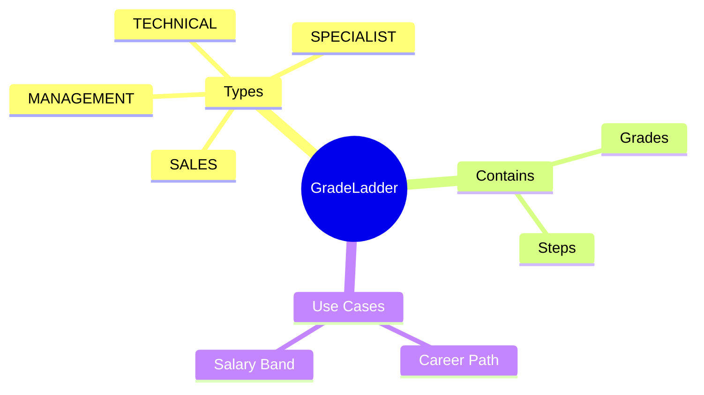
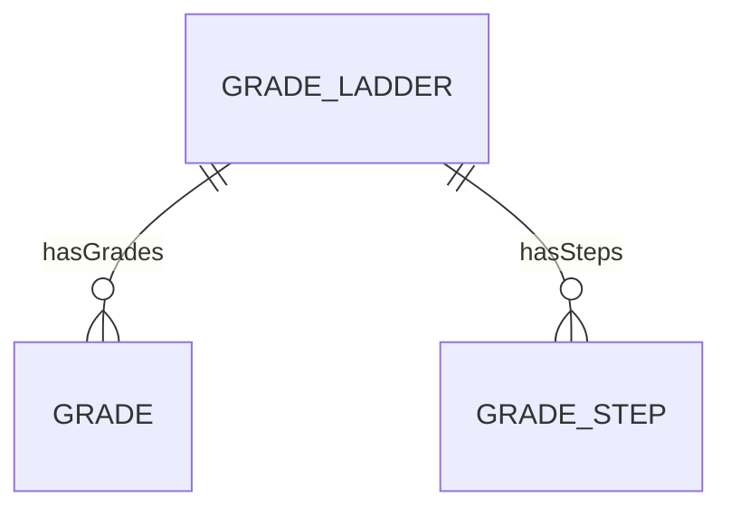

# GradeLadder

## Overview

**GradeLadder** định nghĩa lộ trình nghề nghiệp - chuỗi các grades mà nhân viên có thể tiến qua. Hỗ trợ nhiều track (management, technical).

## Business Context

### Key Stakeholders
- **HR Business Partner**: Design career paths
- **Compensation Team**: Map salary bands
- **Employees**: Understand progression

### Business Processes
- **Career Planning**: Define progression paths
- **Compensation Bands**: Align pay with levels
- **Performance Management**: Promotion decisions

## Relationships Explained

## Examples

### Example 1: Engineering Ladder
- **code**: ENG_LADDER
- **name**: Engineering Career Ladder
- **ladderType**: TECHNICAL
- **grades**: G1 → G2 → G3 → G4 → G5

### Example 2: Management Ladder
- **code**: MGT_LADDER
- **name**: Management Career Ladder
- **ladderType**: MANAGEMENT
- **grades**: M1 → M2 → M3 → M4 → M5

## Related Entities

| Entity | Relationship | Description |
|--------|--------------|-------------|
| [[Grade]] | hasGrades | Levels in ladder |
| [[GradeStep]] | hasSteps | Salary steps |
