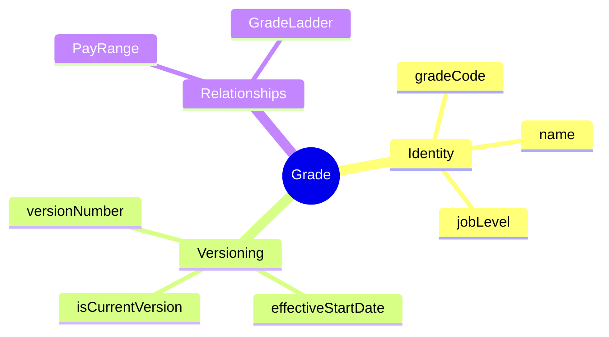
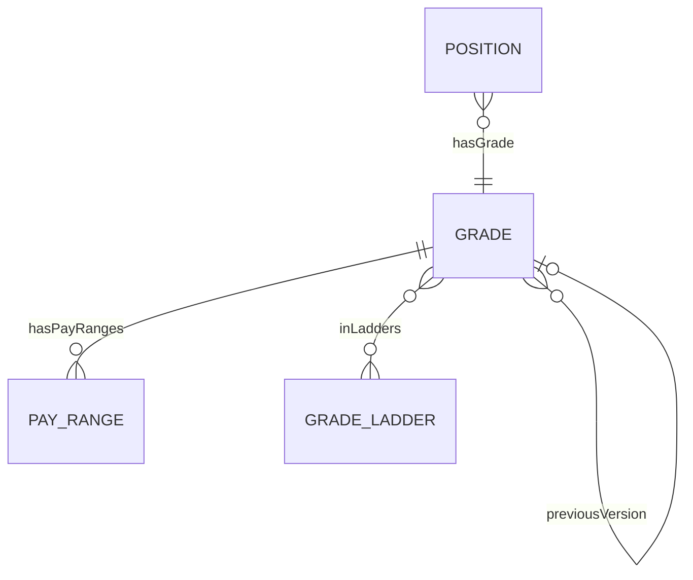
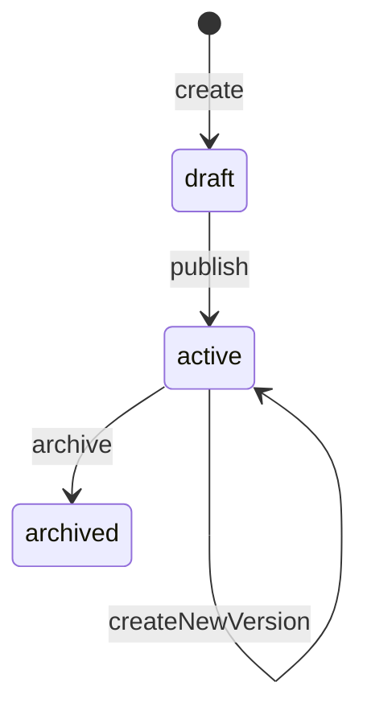
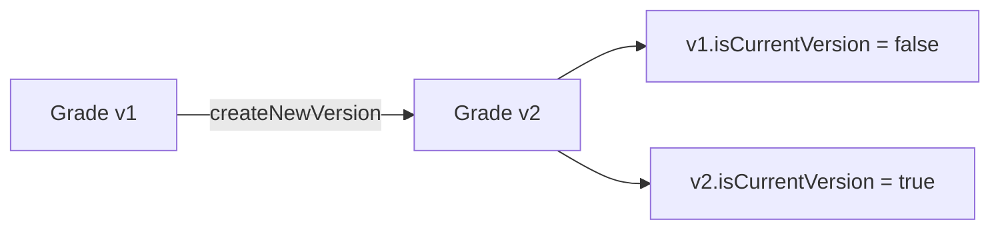

# Grade

## Overview

**Grade** đại diện cho cấp bậc trong tổ chức. Là AGGREGATE_ROOT của job architecture, mỗi grade có [[PayRange]] và có thể thuộc nhiều [[GradeLadder]]. Sử dụng SCD-2 để track history.



## Business Context

### Key Stakeholders
- **Compensation Team**: Define grade structure
- **HR Business Partner**: Job evaluation, grading decisions
- **Managers**: Understand team levels
- **Employees**: Career progression visibility

### Job Level Tiers

| Level | Tier | Description | Example Grades |
|-------|------|-------------|----------------|
| 1-3 | Entry/Junior | New hires, learning | G1, G2, G3 |
| 4-6 | Mid/Senior | Experienced, independent | G4, G5, G6 |
| 7-8 | Lead/Principal | Expert, leads work | G7, G8 |
| 9-10 | Director/Executive | Leadership, strategy | M4, M5, E1 |

### Business Value
Grade là foundation của compensation structure - định nghĩa level hierarchy, link với pay ranges, và enable career pathing.

## Attributes Guide

### Core Identity
- **gradeCode**: Mã duy nhất. Format: G1, G2, M1, M2
- **name**: Tên hiển thị. VD: "Senior Engineer"
- **description**: Mô tả chi tiết responsibilities
- **jobLevel**: Số thứ tự hierarchy (1-10)
- **sortOrder**: Thứ tự hiển thị

### SCD-2 Versioning
Grade sử dụng SCD-2 để track history:
- **versionNumber**: Tăng với mỗi version mới
- **effectiveStartDate / effectiveEndDate**: Khoảng thời gian hiệu lực
- **isCurrentVersion**: True cho version active
- **previousVersionId**: Link đến version trước

## Relationships Explained



### PayRange
- **hasPayRanges** → [[PayRange]]: Khung lương cho grade này, có thể có nhiều ranges theo scope (legal entity, location)

### GradeLadder
- **inLadders** → [[GradeLadder]]: Career ladders chứa grade này (technical, management, etc.)

### Version Chain
- **previousVersion** → Grade: Link đến version trước (SCD-2)

## Lifecycle & Workflows



| State | Meaning |
|-------|---------|
| **draft** | Đang setup, chưa sử dụng |
| **active** | Đang sử dụng |
| **archived** | Đã superseded bởi version mới |

### Version Flow



## Actions & Operations

### create
**Who**: Compensation Team  
**Required**: gradeCode, name, effectiveStartDate

### publish
**Who**: Compensation Team  
**When**: Ready for use

### createNewVersion
**Who**: Compensation Team  
**When**: Pay range changes, restructuring  
**Required**: effectiveStartDate  
**Effect**: Current version archived, new version active

## Business Rules

#### Unique Current Code (uniqueCurrentCode)
**Rule**: Grade code unique among current versions.

#### Version Chain (versionChain)
**Rule**: New version's effectiveStartDate must be after previous version.

## Examples

### Example 1: Software Engineering Grades
| Grade | Name | Job Level |
|-------|------|-----------|
| G1 | Junior Engineer | 1 |
| G2 | Engineer | 2 |
| G3 | Senior Engineer | 4 |
| G4 | Staff Engineer | 6 |
| G5 | Principal Engineer | 8 |

### Example 2: Management Grades
| Grade | Name | Job Level |
|-------|------|-----------|
| M1 | Team Lead | 5 |
| M2 | Manager | 7 |
| M3 | Senior Manager | 8 |
| M4 | Director | 9 |

### Example 3: Grade with Pay Range
```yaml
gradeCode: G3
name: "Senior Engineer"
jobLevel: 4
payRanges:
  - scope: VNG-VN
    currency: VND
    min: 25000000
    mid: 35000000
    max: 45000000
  - scope: VNG-SG
    currency: SGD
    min: 6000
    mid: 8000
    max: 10000
```

## Related Entities

| Entity | Relationship | Description |
|--------|--------------|-------------|
| [[PayRange]] | hasPayRanges | Salary ranges |
| [[GradeLadder]] | inLadders | Career paths |
| [[Position]] | indirect | Positions at this grade |
