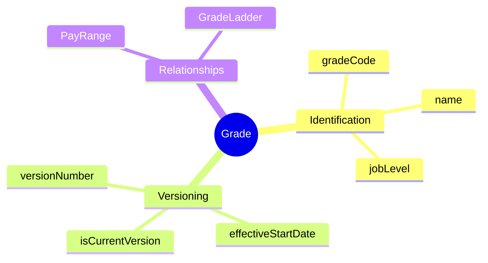
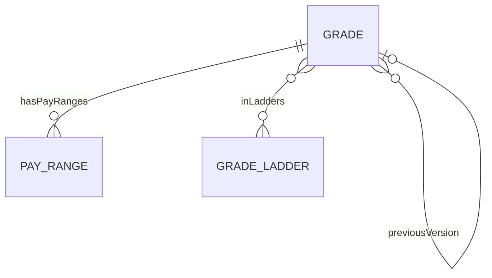
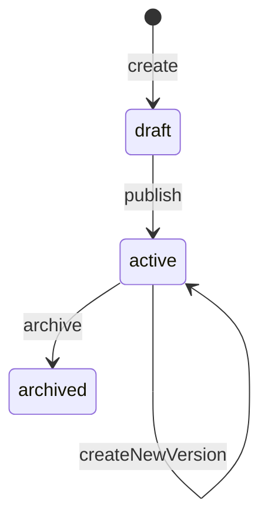

# Grade

## Overview

**Grade** đại diện cho cấp bậc trong tổ chức. Mỗi grade có pay range và có thể thuộc nhiều career ladders. Sử dụng SCD-2 để track history.

## Business Context

### Key Stakeholders
- **Compensation Team**: Define grade structure
- **HR Business Partner**: Job evaluation, grading decisions
- **Managers**: Understand team levels

### Business Processes
- **Job Evaluation**: Assign grade to positions
- **Compensation Planning**: Define pay ranges per grade
- **Career Pathing**: Map progression through grades

## Attributes Guide

### Job Level
- Level 1-3: Entry/Junior
- Level 4-6: Mid-level/Senior
- Level 7-8: Lead/Principal
- Level 9-10: Director/Executive

### SCD-2 Versioning
- **versionNumber**: Increments với mỗi version mới
- **previousVersionId**: Link đến version trước
- **isCurrentVersion**: True cho version active

## Relationships Explained

## Lifecycle & Workflows

## Examples

### Example 1: Software Engineer Grades
| Grade | Name | Job Level |
|-------|------|-----------|
| G1 | Junior Engineer | 1 |
| G2 | Engineer | 2 |
| G3 | Senior Engineer | 4 |
| G4 | Staff Engineer | 6 |
| G5 | Principal Engineer | 8 |

### Example 2: Management Grades
| Grade | Name | Job Level |
|-------|------|-----------|
| M1 | Team Lead | 5 |
| M2 | Manager | 7 |
| M3 | Senior Manager | 8 |
| M4 | Director | 9 |

## Related Entities

| Entity | Relationship | Description |
|--------|--------------|-------------|
| [[PayRange]] | hasPayRanges | Salary ranges |
| [[GradeLadder]] | inLadders | Career paths |
| [[GradeStep]] | via ladder | Steps within grade |
