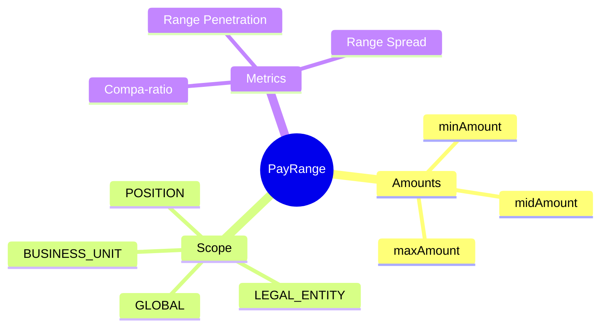
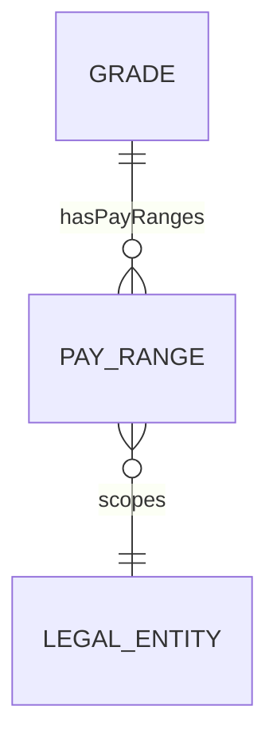
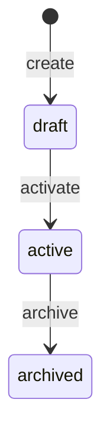
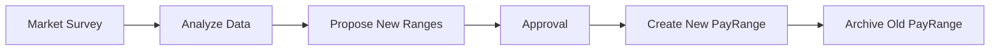

# PayRange

## Overview

**PayRange** định nghĩa khung lương (min/mid/max) cho mỗi [[Grade]]. Có thể scope theo global, legal entity, business unit, hoặc position cụ thể.



## Business Context

### Key Stakeholders
- **Compensation Team**: Define market rates
- **HR Business Partner**: Salary decisions
- **Finance**: Budget planning
- **Managers**: Offer/promotion decisions

### Salary Positions Explained

```
         ┌───────────────────────────────────────┐
Max ─────┤                                       │ 120%
         │          Above Range (Red Circle)     │
         ├───────────────────────────────────────┤ 110%
         │          Top Performer Zone           │
Mid ─────┼───────────────────────────────────────┤ 100% (Market Rate)
         │          Standard Zone                │
         ├───────────────────────────────────────┤ 90%
         │          Development Zone             │
Min ─────┤          New/Learning                 │ 80%
         └───────────────────────────────────────┘
```

### Compa-ratio Formula
```
Compa-ratio = (Actual Salary / Midpoint) × 100%
```

| Compa-ratio | Interpretation |
|-------------|----------------|
| < 80% | Below range (needs increase) |
| 80-90% | Approaching midpoint |
| 90-110% | At market (healthy) |
| 110-120% | Above midpoint (high performer) |
| > 120% | Above range (red circle) |

### Range Spread
```
Range Spread = (Max - Min) / Mid × 100%
```
- Typical: 40-60% for professional roles
- Narrower (30-40%): Entry-level, operational
- Wider (50-80%): Senior, executive

### Business Value
PayRange cho phép market-aligned compensation, consistent salary decisions, và visibility into position within range.

## Attributes Guide

### Core Identity
- **gradeVersionId**: Link đến Grade version (SCD-2 aware)

### Scope Configuration
- **scopeType**: Level áp dụng:
  - *GLOBAL*: All entities, default
  - *LEGAL_ENTITY*: Specific entity (VNG-VN, VNG-SG)
  - *BUSINESS_UNIT*: Specific BU
  - *POSITION*: Specific position override
- **scopeUuid**: ID của scope entity

### Salary Amounts
- **minAmount**: Mức lương tối thiểu (entry, learning)
- **midAmount**: Mức lương trung bình (market rate, target)
- **maxAmount**: Mức lương tối đa (top performer)
- **rangeSpreadPct**: Calculated spread

## Relationships Explained



### Grade
- **belongsToGrade** → [[Grade]]: Parent grade (links to specific version)

## Lifecycle & Workflows



### Annual Review Flow



## Actions & Operations

### create
**Who**: Compensation Team  
**Required**: gradeVersionId, scopeType, scopeUuid, currency, minAmount, midAmount, maxAmount, effectiveStartDate

### updateAmounts
**Who**: Compensation Team  
**When**: Annual market adjustment  
**Affects**: minAmount, midAmount, maxAmount, rangeSpreadPct

## Business Rules

#### Valid Amounts (validAmounts)
**Rule**: min < mid < max.  
**Reason**: Logical progression.

#### Valid Spread (validSpread)
**Rule**: Range spread typically 40-60%.  
**Warning**: Will flag if outside normal range.

## Examples

### Example 1: G3 Senior Engineer - Vietnam
```yaml
gradeVersionId: "grade-g3-v2"
scopeType: LEGAL_ENTITY
scopeUuid: "vng-vn"
currency: VND
minAmount: 25000000
midAmount: 35000000
maxAmount: 45000000
rangeSpreadPct: 57
effectiveStartDate: "2026-01-01"
```

### Example 2: G3 Senior Engineer - Singapore
```yaml
gradeVersionId: "grade-g3-v2"
scopeType: LEGAL_ENTITY
scopeUuid: "vng-sg"
currency: SGD
minAmount: 6000
midAmount: 8000
maxAmount: 10000
rangeSpreadPct: 50
effectiveStartDate: "2026-01-01"
```

### Example 3: Position-Specific Override
```yaml
gradeVersionId: "grade-g3-v2"
scopeType: POSITION
scopeUuid: "position-tech-lead-abc"
currency: VND
minAmount: 30000000  # Higher than standard
midAmount: 42000000
maxAmount: 54000000
effectiveStartDate: "2026-01-01"
```

## Related Entities

| Entity | Relationship | Description |
|--------|--------------|-------------|
| [[Grade]] | belongsToGrade | Parent grade |
| [[LegalEntity]] | scope | Scoping entity |
| [[Employee]] | indirect | Salary comparison |
