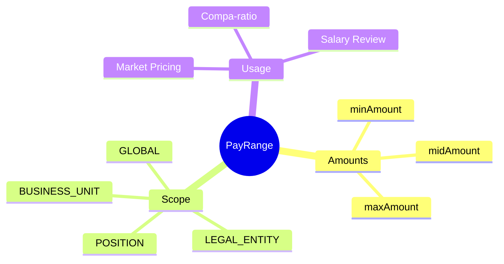

# PayRange

## Overview



**PayRange** định nghĩa khung lương (min/mid/max) cho mỗi grade. Có thể scope theo global, legal entity, hoặc position cụ thể.

## Business Context

### Key Stakeholders
- **Compensation Team**: Define market rates
- **HR Business Partner**: Salary decisions
- **Finance**: Budget planning

### Business Processes
- **Market Pricing**: Align với market data
- **Salary Review**: Determine increase amounts
- **Offer Management**: Set offer levels

## Attributes Guide

### Salary Positions
- **Min**: Entry-level or below market
- **Mid**: Market rate (target)
- **Max**: Top performer or above market

### Compa-ratio
```
Compa-ratio = Actual Salary / Midpoint × 100%
```
- < 80%: Below range
- 80-90%: Approaching midpoint
- 90-110%: At midpoint
- 110-120%: Above midpoint
- > 120%: Above range

## Examples

### Example 1: G3 Senior Engineer - Vietnam
- **grade**: G3
- **scopeType**: LEGAL_ENTITY
- **scope**: VNG Corporation
- **currency**: VND
- **minAmount**: 25,000,000
- **midAmount**: 35,000,000
- **maxAmount**: 45,000,000
- **rangeSpreadPct**: 57%

### Example 2: G3 Senior Engineer - Singapore
- **grade**: G3
- **scopeType**: LEGAL_ENTITY
- **scope**: VNG Singapore
- **currency**: SGD
- **minAmount**: 6,000
- **midAmount**: 8,000
- **maxAmount**: 10,000

## Related Entities

| Entity | Relationship | Description |
|--------|--------------|-------------|
| [[Grade]] | belongsToGrade | Parent grade |
