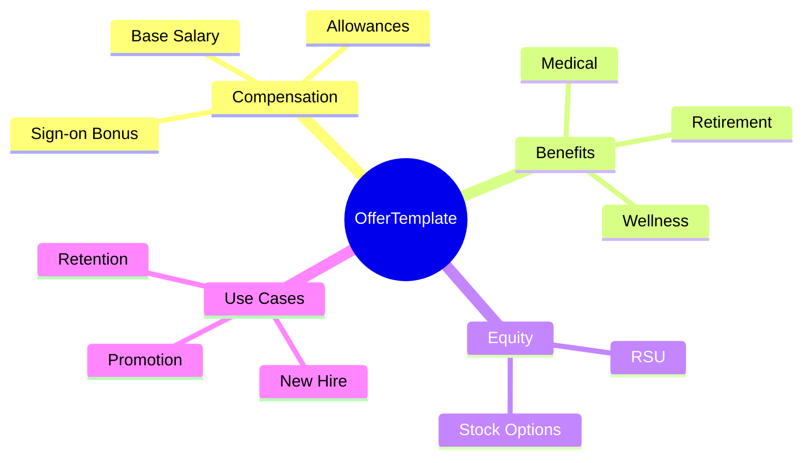
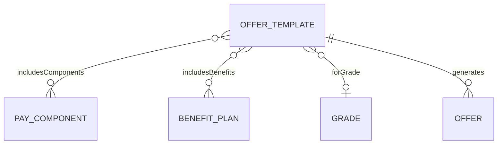
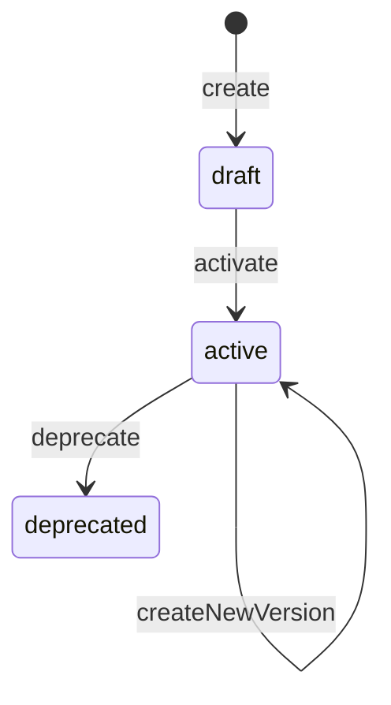
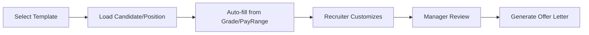

# OfferTemplate

## Overview

**OfferTemplate** định nghĩa khuôn mẫu cho offer letter - bao gồm salary components, benefits, equity. Dùng cho new hires, transfers, promotions, retention.



## Business Context

### Key Stakeholders
- **Recruiting Team**: Create offers from templates
- **Compensation Team**: Define and maintain templates
- **Hiring Managers**: Customize offers within guidelines
- **Finance**: Budget approval

### Offer Template Use Cases

| Use Case | Description | Customizable Fields |
|----------|-------------|---------------------|
| **New Hire** | External candidates | Salary, sign-on, start date |
| **Internal Transfer** | Same level move | Salary adjustment, relocation |
| **Promotion** | Level increase | New salary, bonus target |
| **Retention** | Counter offer | Sign-on, equity grant |

### Business Value
OfferTemplate ensures consistency in offers, guides salary decisions within pay ranges, và speeds up offer generation process.

## Attributes Guide

### Core Identity
- **code**: Mã duy nhất. Format: SR_ENGINEER_VN, DIRECTOR_SG
- **name**: Tên hiển thị. VD: "Senior Engineer Offer - Vietnam"
- **description**: Mô tả khi nào dùng template này
- **versionNo**: Version number

### componentsJson Structure

```json
{
  "compensation": [
    {
      "componentCode": "BASIC_SALARY",
      "amount": null,
      "minAmount": 25000000,
      "maxAmount": 45000000,
      "required": true
    },
    {
      "componentCode": "TRANSPORT_ALLOWANCE",
      "amount": 2000000,
      "required": false
    },
    {
      "componentCode": "SIGN_ON_BONUS",
      "amount": null,
      "maxAmount": 50000000,
      "required": false
    }
  ],
  "benefits": [
    {
      "planCode": "MED_PREMIUM",
      "optionCode": "EMPLOYEE_FAMILY",
      "required": true
    },
    {
      "planCode": "WELLNESS_VNG",
      "required": false
    }
  ],
  "equity": {
    "grantType": "RSU",
    "units": null,
    "maxUnits": 1000,
    "vestingSchedule": "4Y_1Y_CLIFF"
  },
  "bonusTarget": {
    "targetPct": 15,
    "planCode": "ANNUAL_BONUS"
  }
}
```

## Relationships Explained



### PayComponent
- **includesComponents** → [[PayComponent]]: Compensation elements in template

### BenefitPlan
- **includesBenefits** → [[BenefitPlan]]: Benefit packages

### Grade
- **forGrade** → [[Grade]]: Target grade (for pay range validation)

## Lifecycle & Workflows



| State | Meaning |
|-------|---------|
| **draft** | Đang design |
| **active** | Có thể generate offers |
| **deprecated** | Không dùng cho new offers |

### Offer Generation Flow



## Actions & Operations

### create
**Who**: Compensation Team  
**Required**: code, name, componentsJson, effectiveStartDate

### createNewVersion
**Who**: Compensation Team  
**When**: Policy changes, new components  
**Affects**: versionNo, componentsJson

### generateOffer
**Who**: Recruiter  
**Required**: candidateId, positionId  
**Output**: Draft Offer record

## Business Rules

#### Unique Code Version (uniqueCodeVersion)
**Rule**: Code + version unique.

#### Has Components (hasComponents)
**Rule**: Template phải có ít nhất 1 component.

## Examples

### Example 1: Senior Engineer - Vietnam
```yaml
code: SR_ENGINEER_VN
name: "Senior Engineer Offer - Vietnam"
forGrade: G3
componentsJson:
  compensation:
    - componentCode: BASIC_SALARY
      minAmount: 25000000
      maxAmount: 45000000
      required: true
    - componentCode: TRANSPORT_ALLOWANCE
      amount: 2000000
      required: false
    - componentCode: SIGN_ON_BONUS
      maxAmount: 30000000
      required: false
  benefits:
    - planCode: MED_PREMIUM
      optionCode: EMPLOYEE_PLUS_ONE
      required: true
  bonusTarget:
    targetPct: 15
```

### Example 2: Director - Vietnam
```yaml
code: DIRECTOR_VN
name: "Director Offer - Vietnam"
forGrade: M4
componentsJson:
  compensation:
    - componentCode: BASIC_SALARY
      minAmount: 80000000
      maxAmount: 120000000
      required: true
    - componentCode: CAR_ALLOWANCE
      amount: 15000000
      required: true
    - componentCode: SIGN_ON_BONUS
      maxAmount: 100000000
      required: false
  benefits:
    - planCode: MED_PREMIUM
      optionCode: FAMILY
      required: true
  equity:
    grantType: RSU
    maxUnits: 5000
    vestingSchedule: 4Y_1Y_CLIFF
  bonusTarget:
    targetPct: 30
```

### Example 3: Senior Engineer - Singapore
```yaml
code: SR_ENGINEER_SG
name: "Senior Engineer Offer - Singapore"
forGrade: G3
componentsJson:
  compensation:
    - componentCode: BASIC_SALARY
      minAmount: 6000
      maxAmount: 10000
      currency: SGD
      required: true
    - componentCode: AWS  # Annual Wage Supplement
      amount: 1  # 1 month
      required: true
  benefits:
    - planCode: MED_SG
      required: true
```

## Related Entities

| Entity | Relationship | Description |
|--------|--------------|-------------|
| [[PayComponent]] | includesComponents | Pay elements |
| [[BenefitPlan]] | includesBenefits | Benefit packages |
| [[Grade]] | forGrade | Target grade |
| Offer | generates | Generated offers |
