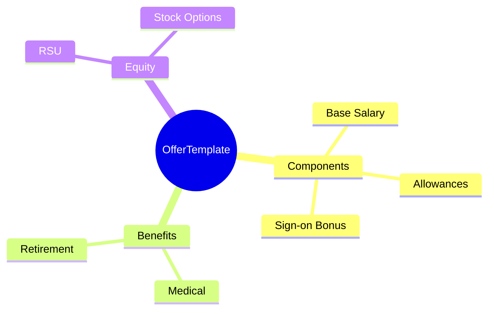

# OfferTemplate

## Overview



**OfferTemplate** định nghĩa khuôn mẫu cho offer letter - bao gồm salary components, benefits, equity. Dùng cho new hires, promotions, retention.

## Business Context

### Key Stakeholders
- **Recruiting Team**: Create offers
- **Compensation Team**: Define templates
- **Hiring Managers**: Customize offers

### Business Processes
- **Offer Creation**: Generate from template
- **Offer Approval**: Review and approve
- **Offer Acceptance**: Track decisions

## Attributes Guide

### componentsJson Structure
```json
{
  "compensation": [
    {"componentCode": "BASIC_SALARY", "amount": null},
    {"componentCode": "SIGN_ON_BONUS", "amount": 10000000}
  ],
  "benefits": [
    {"planCode": "MED_PREMIUM", "optionCode": "EMPLOYEE_FAMILY"}
  ],
  "equity": {
    "grantType": "RSU",
    "units": null,
    "vestingSchedule": "4Y_1Y_CLIFF"
  }
}
```

## Examples

### Example 1: Senior Engineer Template
- **code**: SR_ENGINEER_VN
- **name**: Senior Engineer Offer - Vietnam
- **components**: Basic, Transport Allowance, Sign-on
- **benefits**: Medical Premium, Wellness

### Example 2: Director Template
- **code**: DIRECTOR_VN
- **name**: Director Offer - Vietnam
- **components**: Basic, Car Allowance, Sign-on, Annual Bonus
- **equity**: RSU grant

## Related Entities

| Entity | Relationship | Description |
|--------|--------------|-------------|
| [[PayComponent]] | includesComponents | Pay elements |
| [[BenefitPlan]] | includesBenefits | Benefit packages |
