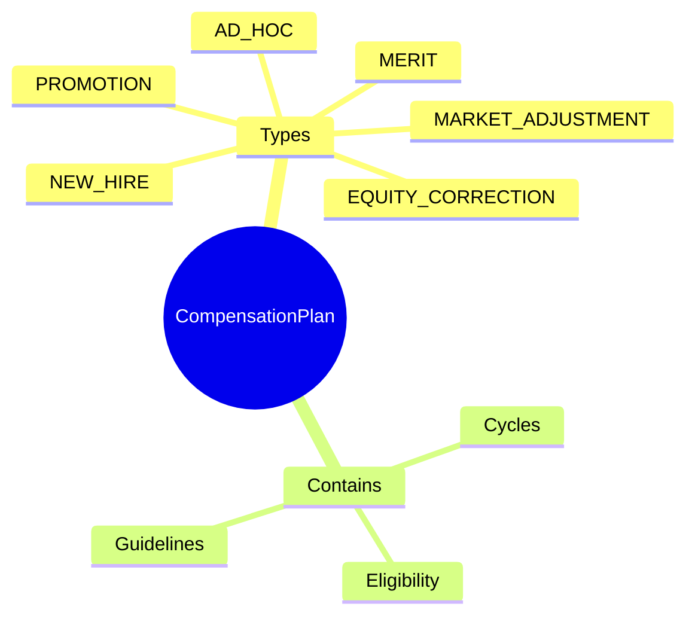

# CompensationPlan

## Overview

**CompensationPlan** định nghĩa chính sách điều chỉnh lương - merit review, promotion, market adjustment. Có guidelines và eligibility rules.

## Business Context

### Key Stakeholders
- **Compensation Team**: Design review policies
- **Managers**: Submit recommendations
- **HR Business Partners**: Approve adjustments

### Business Processes
- **Annual Review**: Yearly merit increases
- **Promotion Processing**: Salary adjustments for promotions
- **Market Correction**: Address pay gaps

## Attributes Guide

### Plan Types
| Type | Description | Frequency |
|------|-------------|-----------|
| **MERIT** | Performance-based increase | Annual |
| **PROMOTION** | Level/grade change | As needed |
| **MARKET_ADJUSTMENT** | Market alignment | Annual/Bi-annual |
| **NEW_HIRE** | New employee offer | On hire |
| **EQUITY_CORRECTION** | Fix pay inequities | As needed |
| **AD_HOC** | One-off adjustments | As needed |

## Examples

### Example 1: Annual Merit Review
- **code**: MERIT_REVIEW
- **name**: Annual Merit Review
- **planType**: MERIT
- **guidelineJson**: Merit matrix with performance ratings

### Example 2: Promotion Policy
- **code**: PROMOTION_POLICY
- **name**: Promotion Salary Adjustment
- **planType**: PROMOTION

## Related Entities

| Entity | Relationship | Description |
|--------|--------------|-------------|
| [[CompensationCycle]] | hasCycles | Review periods |
