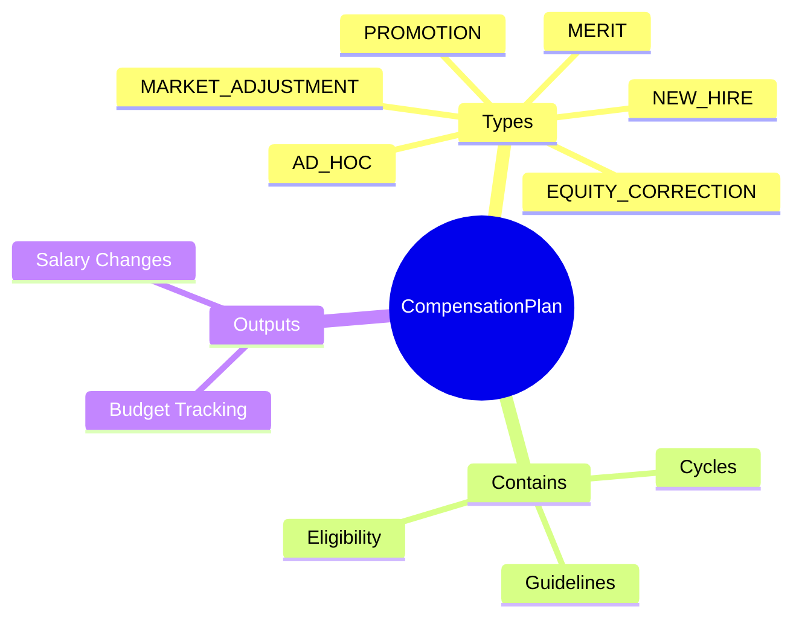
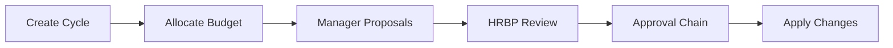
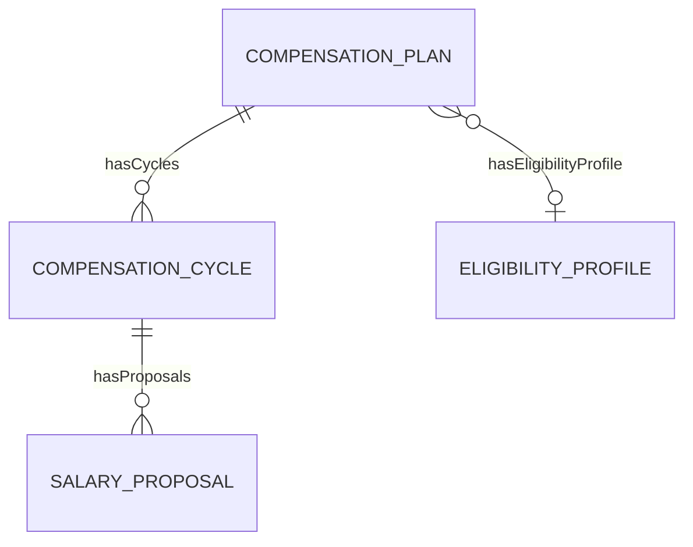
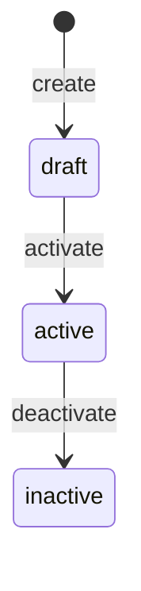
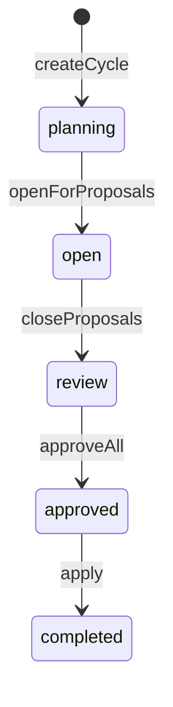

# CompensationPlan

## Overview

**CompensationPlan** định nghĩa chính sách điều chỉnh lương - merit review, promotion, market adjustment. Là AGGREGATE_ROOT của compensation policy, có guidelines và eligibility rules.



## Business Context

### Key Stakeholders
- **Compensation Team**: Design review policies
- **Managers**: Submit recommendations
- **HR Business Partners**: Review and approve
- **Finance**: Budget control

### Plan Types Explained

| Type | Description | Frequency | Trigger |
|------|-------------|-----------|---------|
| **MERIT** | Performance-based increase | Annual | Performance cycle |
| **PROMOTION** | Level/grade change | As needed | Promotion decision |
| **MARKET_ADJUSTMENT** | Market alignment | Annual/Bi-annual | Market survey |
| **NEW_HIRE** | New employee offer | Per hire | Offer creation |
| **EQUITY_CORRECTION** | Fix pay inequities | As needed | Pay equity audit |
| **AD_HOC** | One-off adjustments | As needed | Special circumstances |

### Merit Review Process



### Business Value
CompensationPlan ensures consistent review processes, guides salary decisions within budget, và provides audit trail.

## Attributes Guide

### Core Identity
- **code**: Mã duy nhất. Format: MERIT_REVIEW_2026, PROMOTION_POLICY
- **name**: Tên hiển thị. VD: "Annual Merit Review 2026"
- **planType**: Type of review (MERIT, PROMOTION, etc.)

### Guidelines (guidelineJson)

**Merit Matrix:**
```json
{
  "matrix": {
    "E": {"below": 0, "at": 2, "above": 4, "far_above": 6},
    "M": {"below": 0, "at": 4, "above": 6, "far_above": 8},
    "N": {"below": 0, "at": 6, "above": 8, "far_above": 10}
  },
  "budgetPct": 5.0,
  "maxIncreasePct": 15,
  "minRatingEligible": "M"
}
```

Legend:
- E = Exceeds compa-ratio (>110%)
- M = At midpoint (90-110%)
- N = Below midpoint (<90%)

**Promotion Guidelines:**
```json
{
  "minRange": 5,
  "maxRange": 15,
  "targetAtMid": true,
  "requiresApproval": "HRBP"
}
```

### Eligibility (eligibilityRuleJson)
```json
{
  "type": "AND",
  "conditions": [
    {"field": "employmentStatus", "op": "eq", "value": "ACTIVE"},
    {"field": "tenure", "op": "gte", "value": 90},
    {"field": "hasPerformanceRating", "op": "eq", "value": true}
  ]
}
```

## Relationships Explained



### CompensationCycle
- **hasCycles** → CompensationCycle: Specific review periods (2026 Q1, etc.)

### EligibilityProfile
- **hasEligibilityProfile** → [[EligibilityProfile]]: Who is eligible

## Lifecycle & Workflows



| State | Meaning |
|-------|---------|
| **draft** | Đang design |
| **active** | Có thể create cycles |
| **inactive** | Không dùng nữa |

### Cycle States



## Actions & Operations

### create
**Who**: Compensation Team  
**Required**: code, name, planType, effectiveStartDate

### createCycle
**Who**: Compensation Team  
**When**: Start new review period  
**Creates**: CompensationCycle

### updateGuidelines
**Who**: Compensation Team  
**When**: Policy changes  
**Affects**: guidelineJson

## Business Rules

#### Unique Code (uniqueCode)
**Rule**: Plan code phải duy nhất.

#### Has Guidelines (hasGuidelines)
**Rule**: MERIT và PROMOTION plans cần guidelines.  
**Reason**: Đảm bảo consistent decisions.

## Examples

### Example 1: Annual Merit Review 2026
```yaml
code: MERIT_REVIEW_2026
name: "Annual Merit Review 2026"
planType: MERIT
guidelineJson:
  matrix:
    E: { below: 0, at: 2, above: 4, far_above: 6 }
    M: { below: 0, at: 4, above: 6, far_above: 8 }
    N: { below: 0, at: 6, above: 8, far_above: 10 }
  budgetPct: 5.0
  maxIncreasePct: 15
  minRatingEligible: M
eligibilityRuleJson:
  type: AND
  conditions:
    - field: tenure
      op: gte
      value: 90
effectiveStartDate: "2026-01-01"
```

### Example 2: Promotion Policy
```yaml
code: PROMOTION_POLICY
name: "Promotion Salary Adjustment"
planType: PROMOTION
guidelineJson:
  oneGradeIncrease:
    minPct: 8
    maxPct: 15
    targetPosition: midpoint
  twoGradeIncrease:
    minPct: 15
    maxPct: 25
  requiresApproval: HRBP
effectiveStartDate: "2026-01-01"
```

### Example 3: Market Adjustment
```yaml
code: MARKET_ADJ_2026
name: "2026 Market Adjustment"
planType: MARKET_ADJUSTMENT
guidelineJson:
  targetCompaRatio: 100
  maxAdjustmentPct: 10
  priorityByGap: true
eligibilityRuleJson:
  conditions:
    - field: compaRatio
      op: lt
      value: 90
effectiveStartDate: "2026-04-01"
```

## Related Entities

| Entity | Relationship | Description |
|--------|--------------|-------------|
| CompensationCycle | hasCycles | Review periods |
| [[EligibilityProfile]] | hasEligibilityProfile | Eligibility rules |
| SalaryProposal | indirect | Manager proposals |
