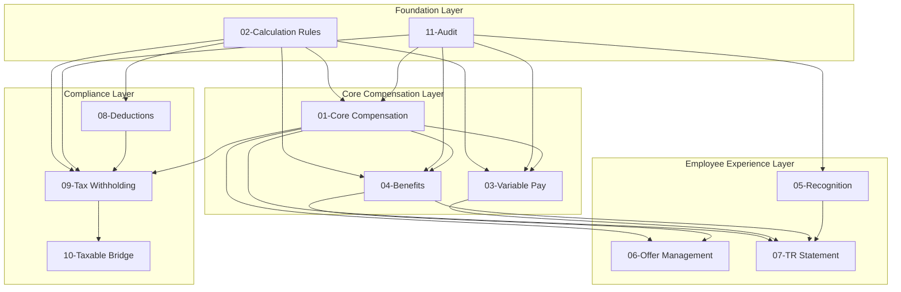
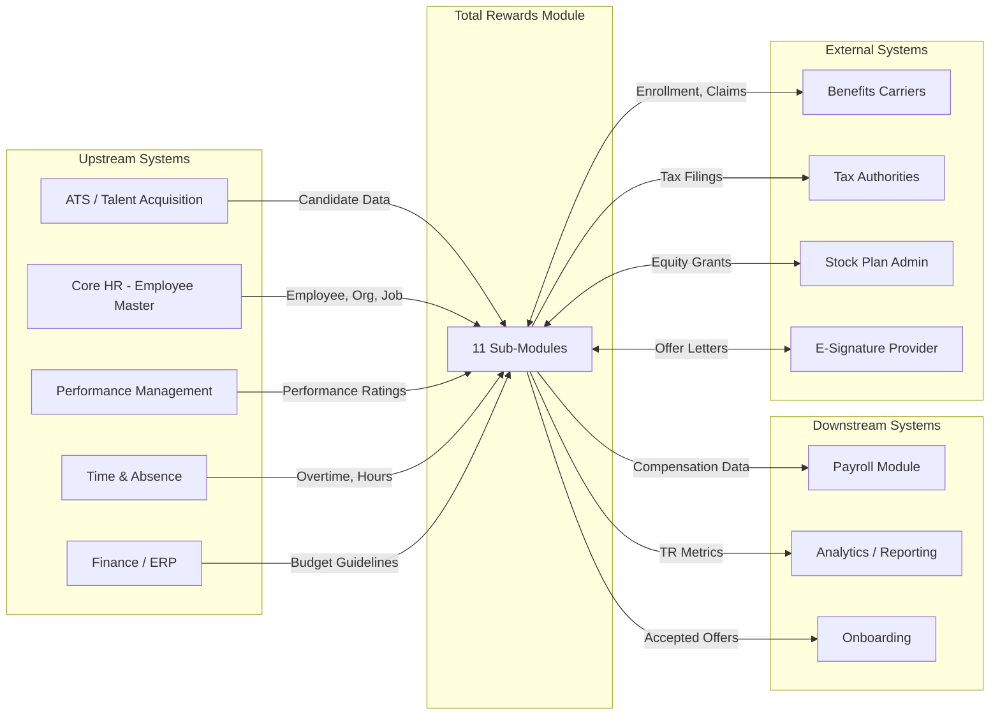
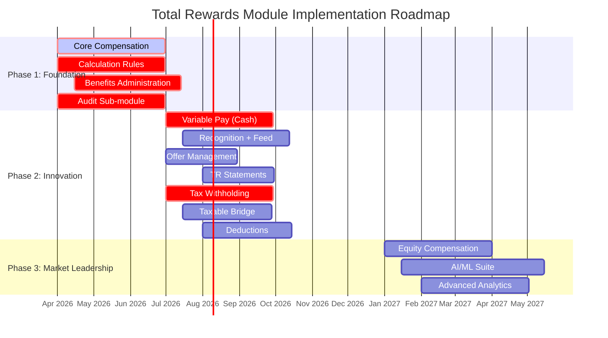
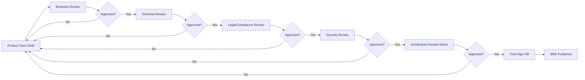

# MASTER Business Requirement Document: Total Rewards Module

> **ODSA Reality Layer — Specification-First Development**
>
> *"What do you truly know?" — Socrates*
>
> This MASTER BRD consolidates all 11 sub-module BRDs for the Total Rewards (TR) module,
> providing an executive summary, integration architecture, and cross-reference guide.

---

## 1. Executive Summary

### 1.1 Module Overview

The **Total Rewards (TR) Module** is a next-generation enterprise HCM solution designed for multi-national organizations operating across Southeast Asia. It provides comprehensive compensation, benefits, and recognition management aligned with WorldatWork's 5-pillar Total Rewards framework.

| Attribute | Value |
|-----------|-------|
| **Domain Classification** | CORE (Strategic Differentiator) |
| **Strategic Value** | CRITICAL |
| **Geographic Scope** | 6+ countries (VN, TH, ID, SG, MY, PH) |
| **Innovation Level** | Full Innovation Play |
| **Timeline** | Fast Track |
| **Total Sub-Modules** | 11 |

### 1.2 Business Value Proposition

The Total Rewards module delivers measurable business value across four dimensions:

| Value Dimension | Description | Quantified Impact |
|-----------------|-------------|-------------------|
| **Operational Efficiency** | Automation of manual compensation, benefits, and payroll processes | 70-80% reduction in administrative hours |
| **Compliance Assurance** | Multi-country regulatory compliance with automated validation | 100% audit pass rate, zero penalties |
| **Employee Experience** | Self-service access to compensation, benefits, and rewards information | 4.5/5 employee satisfaction target |
| **Strategic Decision Support** | Real-time analytics and AI-powered insights | Data-driven compensation decisions |

### 1.3 Total Investment Required

| Phase | Timeline | Investment Focus | Estimated Effort |
|-------|----------|------------------|------------------|
| **Phase 1: Foundation** | Months 1-6 | Core Compensation, Calculation Rules, Benefits, Audit | ~40% of total budget |
| **Phase 2: Innovation** | Months 7-12 | Variable Pay, Recognition, Offer Management, TR Statements, Tax (Withholding + Bridge), Deductions | ~40% of total budget |
| **Phase 3: Market Leadership** | Months 13-18 | AI/ML Suite, Advanced Analytics, Equity Compensation | ~20% of total budget |

### 1.4 Expected ROI

| ROI Driver | Annual Value | Realization Timeline |
|------------|--------------|---------------------|
| HR Efficiency Gain | $500,000+ | Year 1 |
| Compliance Risk Mitigation | $200,000+ (penalty avoidance) | Year 1 |
| Reduced Turnover (Compensation-related) | $300,000+ | Year 2 |
| External Audit Cost Reduction | $75,000+ | Year 2 |
| **Total Annual Value** | **$1,075,000+** | **Full by Year 3** |

---

## 2. Module Architecture

### 2.1 Sub-Modules Overview

The Total Rewards module comprises 11 integrated sub-modules:

| # | Sub-Module | BRD File | Priority | Type | Core Function |
|---|------------|----------|----------|------|---------------|
| 1 | Core Compensation | `01-BRD-Core-Compensation.md` | P0 | CORE | Salary structures, pay ranges, compensation cycles |
| 2 | Calculation Rules | `02-BRD-Calculation-Rules.md` | P0 | FOUNDATION | SI, tax, overtime calculation engine |
| 3 | Variable Pay | `03-BRD-Variable-Pay.md` | P0 | CORE | Bonuses, commissions, 13th month |
| 4 | Benefits | `04-BRD-Benefits.md` | P0 | CORE | Social insurance, health, retirement |
| 5 | Recognition | `05-BRD-Recognition.md` | P1 | DIFFERENTIATOR | Points-based recognition, social feed |
| 6 | Offer Management | `06-BRD-Offer-Management.md` | P1 | CORE | Employment offer creation and tracking |
| 7 | Total Rewards Statement | `07-BRD-Total-Rewards-Statement.md` | P1 | CORE | Consolidated compensation statements |
| 8 | Deductions | `08-BRD-Deductions.md` | P0 | COMPLIANCE | Loans, garnishments, voluntary deductions |
| 9 | Tax Withholding | `09-BRD-Tax-Withholding.md` | P0 | COMPLIANCE | Multi-country tax configuration |
| 10 | Taxable Bridge | `10-BRD-Taxable-Bridge.md` | P0 | COMPLIANCE | Taxable item tracking and reporting |
| 11 | Audit | `11-BRD-Audit.md` | P0 | FOUNDATION | Change tracking, compliance reporting |

### 2.2 Cross-Module Dependencies

### 2.3 Integration Architecture

---

## 3. Consolidated Business Context

### 3.1 Organization Context (6 SEA Countries)

The Total Rewards module serves enterprises operating across Southeast Asia with diverse regulatory environments:

| Country | Employees (Target) | Regulatory Body | Key Regulations |
|---------|-------------------|-----------------|-----------------|
| **Vietnam** | 5,000+ | Ministry of Labor, VNSI | Labor Code 2019, SI Law 2024 |
| **Thailand** | 2,000+ | Ministry of Labor | Labor Protection Act, Revenue Code |
| **Indonesia** | 3,000+ | Ministry of Manpower, BPJS | Manpower Act 13/2003, BPJS |
| **Singapore** | 1,500+ | MOM, IRAS, CPF | Employment Act, CPF Act, PDPA |
| **Malaysia** | 1,000+ | SOCSO, EPF, LHDN | Employment Act 1955, PCB |
| **Philippines** | 2,500+ | DOLE, BIR, SSS | Labor Code, PD 851 (13th Month) |

**Total Workforce:** 15,000+ employees across 6 countries

### 3.2 Current Problems (Aggregated)

| Problem Category | Sub-Modules Affected | Current State | Impact |
|------------------|---------------------|---------------|--------|
| **Fragmented Systems** | All | Multiple spreadsheets, legacy HRIS, manual processes | 40-60 HR hours per cycle, 25% error rate |
| **Compliance Risk** | Tax, Benefits, Deductions, Audit | Manual regulatory tracking | Potential penalties up to 100% of under-withheld amounts |
| **Lack of Visibility** | Core Comp, Variable Pay, TR Statement | No unified view of total compensation | Pay equity gaps undetected, employee distrust |
| **Manual Processes** | All | Email-based approvals, paper forms | 70-80% inefficiency vs. automated |
| **Data Quality Issues** | All | Inconsistent data entry, no validation | Calculation errors, reporting inaccuracies |
| **No Audit Trail** | Audit, Core Comp, Variable Pay | Changes not tracked | Cannot resolve disputes, compliance failures |

### 3.3 Business Impact (Quantified)

| Impact Area | Current State | Target State | Improvement | Annual Value |
|-------------|---------------|--------------|-------------|--------------|
| Compensation cycle duration | 6-8 weeks | 2 weeks | 75% reduction | $250,000 |
| Bonus cycle processing | 15-20 days | ≤5 days | 75% reduction | $150,000 |
| Tax administration effort | 40 hrs/country/month | <12 hrs | 70% reduction | $100,000 |
| Paycheck error rate | 10-15% | <0.5% | 95% reduction | $200,000 |
| Compliance report generation | 80 hours | <4 hours | 95% reduction | $75,000 |
| Employee turnover (comp-related) | 25-30% | <15% | 50% reduction | $300,000 |
| **Total Annual Impact** | | | | **$1,075,000** |

### 3.4 Why Now Drivers

| Driver | Urgency | Sub-Modules Impacted | Consequence of Delay |
|--------|---------|---------------------|---------------------|
| **Vietnam SI Law 2024** | CRITICAL (July 2025) | Benefits, Calculation Rules | VND 50-100M fines, non-compliance |
| **Regional Expansion** | HIGH (Q2 2026) | All | Cannot scale without TR foundation |
| **Competitive Pressure** | HIGH | All | Losing deals to Oracle, SAP, Workday |
| **IPO Preparation** | HIGH (2027) | Audit, Core Comp, Variable Pay | Audit-ready records required |
| **Pay Transparency Trend** | MEDIUM-HIGH | Core Comp, TR Statement | Employee trust and retention at risk |
| **AI/ML Opportunity** | MEDIUM | All | First-mover advantage in SEA market |

---

## 4. Consolidated Business Objectives

### Master Priority Matrix

| ID | Objective | Priority | Timeline | Success Metric | Owner |
|----|-----------|----------|----------|----------------|-------|
| **BO-TR-001** | Reduce compensation cycle duration from 6-8 weeks to 2 weeks | P0 | Q2 2026 | Avg. cycle completion time | HR Ops |
| **BO-TR-002** | Achieve 100% change capture for all TR transactions | P0 | Q2 2026 | % of TR entity changes logged | Compliance |
| **BO-TR-003** | Achieve 100% statutory compliance across 6 countries | P0 | Q3 2026 | Zero penalties, 100% on-time filings | Legal |
| **BO-TR-004** | Enable real-time budget visibility (≤3% variance) | P0 | Q2 2026 | Budget variance % | Finance |
| **BO-TR-005** | Achieve 80% manager self-service adoption | P1 | Q1 2027 | % managers using self-service | HR Ops |
| **BO-TR-006** | Provide pay equity analytics capability | P1 | Q3 2026 | 100% enterprises can run gap analysis | DEI |
| **BO-TR-007** | Achieve 70% employee participation in recognition | P1 | Q4 2026 | % active users in recognition | HR |
| **BO-TR-008** | Reduce tax administration effort by 70% | P0 | Q3 2026 | Hours/country/month | Tax |
| **BO-TR-009** | Enable 80% employee self-service for tax profile | P1 | Q3 2026 | % tax updates via ESS | Tax |
| **BO-TR-010** | Achieve commission calculation accuracy ≥99.5% | P0 | Q2 2026 | Dispute rate <0.5% | Sales Ops |
| **BO-TR-011** | Reduce offer cycle time from 5-7 days to 1-2 days | P0 | Q2 2026 | Avg. days to acceptance | Talent |
| **BO-TR-012** | Improve offer acceptance rate from 65% to 80% | P0 | Q3 2026 | Accepted / Total offers | Talent |
| **BO-TR-013** | Ensure 7-year data retention for all audit records | P0 | Q2 2026 | % records retained per policy | Compliance |
| **BO-TR-014** | Enable 100% on-demand TR statement generation | P1 | Q3 2026 | Statement availability | HR Ops |
| **BO-TR-015** | Achieve AI/ML tax optimization for 50% of employees | P2 | Q1 2027 | % with recommendations | Product |

---

## 5. Consolidated Business Actors

### Cross-Module Actor Matrix

| Actor | Sub-Modules | Key Responsibilities | Permissions Summary |
|-------|-------------|---------------------|---------------------|
| **HR Administrator** | All | System configuration, employee support, compliance | Full access to all TR functions |
| **Compensation Manager** | Core Comp, Variable Pay | Budget allocation, plan design, equity analysis | Plan config, budget mgmt, analytics |
| **Compensation Administrator** | Core Comp, Variable Pay | Salary structures, cycles, eligibility | CRUD on comp entities |
| **Benefits Administrator** | Benefits, TR Statement | Enrollment, carrier liaison, compliance | Benefits config, enrollment mgmt |
| **Payroll Administrator** | Calculation Rules, Tax, Deductions, Bridge | Payroll execution, reconciliation | Execute calculations, view withholdings |
| **Tax Administrator** | Tax Withholding, Taxable Bridge | Tax config, filings, compliance | Full tax config, filing mgmt |
| **Recognition Administrator** | Recognition | Program config, catalog mgmt | Recognition program setup |
| **Offer Administrator** | Offer Management | Template mgmt, offer tracking | Offer template config |
| **People Manager** | Core Comp, Variable Pay, Recognition | Team compensation proposals, recognition | View team data, propose adjustments |
| **Budget Approver** | Core Comp, Variable Pay | Approve allocations based on thresholds | Approve/reject per authority |
| **Finance Approver** | Variable Pay, Deductions | Budget oversight, high-value approval | View budget, approve exceptions |
| **Employee** | All (Self-Service) | View own data, manage profiles, recognition | Read own data, limited updates |
| **Compliance Officer** | Audit, Tax, Benefits | Generate reports, respond to audits | Read audit logs, export data |
| **External Auditor** | Audit | Compliance review, audit trail access | Read-only audit access |
| **System (Automated)** | All | Validation, notifications, milestone detection | Rule-based system actions |

### Detailed Actor Permissions by Sub-Module

| Actor | Core Comp | Variable Pay | Benefits | Recognition | Tax | Audit |
|-------|-----------|--------------|----------|-------------|-----|-------|
| HR Admin | CRUD | CRUD | CRUD | CRUD | CRUD | Read All |
| Comp Manager | Read/Update | Read/Update | Read | No | No | Read |
| Payroll Admin | Read | Read | Read | No | Read/Execute | Read |
| Tax Admin | No | No | No | No | CRUD | Read |
| Employee | Read (Own) | Read (Own) | Read/Update (Own) | Read/Write (Own) | Read/Update (Own) | No |
| Manager | Read (Team) | Read (Team) | No | Read (Team) | No | No |
| Auditor | No | No | No | No | No | Read All |

---

## 6. Consolidated Business Rules

### Rule Summary by Sub-Module

| BRD | Validation | Authorization | Calculation | Constraint | Compliance | Total |
|-----|------------|---------------|-------------|------------|------------|-------|
| **01-Core Compensation** | 5 | 4 | 4 | 4 | 8 | 25 |
| **02-Calculation Rules** | 6 | 4 | 8 | 5 | 6 | 29 |
| **03-Variable Pay** | 5 | 4 | 8 | 4 | 6 | 27 |
| **04-Benefits** | 6 | 5 | 6 | 5 | 7 | 29 |
| **05-Recognition** | 12 | 14 | 12 | 12 | 12 | 62 |
| **06-Offer Management** | 10 | 15 | 12 | 12 | 18 | 67 |
| **07-TR Statement** | 5 | 4 | 4 | 4 | 5 | 22 |
| **08-Deductions** | 8 | 6 | 6 | 6 | 7 | 33 |
| **09-Tax Withholding** | 10 | 10 | 10 | 10 | 15 | 55 |
| **10-Taxable Bridge** | 7 | 5 | 6 | 5 | 8 | 31 |
| **11-Audit** | 7 | 7 | 7 | 7 | 8 | 36 |
| **TOTAL** | **81** | **78** | **83** | **74** | **100** | **416** |

### Critical Cross-Module Rules

| Rule ID | Rule Name | Affected Sub-Modules | Enforcement |
|---------|-----------|---------------------|-------------|
| **CROSS-001** | 7-Year Retention | All | Audit stores all TR changes for 7 years |
| **CROSS-002** | SCD Type 2 Versioning | Core Comp, Benefits, Tax | All changes create new version |
| **CROSS-003** | Multi-Country Compliance | All | Country-specific rules enforced per legal entity |
| **CROSS-004** | Data Privacy (PDPA) | All | PII encrypted, access logged |
| **CROSS-005** | Audit Trail Immutability | All | Audit records cannot be modified |
| **CROSS-006** | Integration Data Contract | All | Upstream data validated before processing |

---

## 7. Integration Architecture

### 7.1 Upstream Dependencies

| Source System | Data Provided | Consuming Sub-Modules | Criticality |
|---------------|---------------|----------------------|-------------|
| **Core HR** | Employee master, job, grade, org hierarchy | All | CRITICAL |
| **Talent Acquisition** | Candidate data, requisitions | Offer Management | HIGH |
| **Performance Management** | Performance ratings, goals | Core Comp, Variable Pay, Recognition | HIGH |
| **Time & Absence** | Overtime hours, attendance | Calculation Rules, Variable Pay | MEDIUM |
| **Finance/ERP** | Budget guidelines, cost centers, FX rates | Core Comp, Variable Pay, Recognition | HIGH |

### 7.2 Downstream Dependencies

| Consumer System | Data Received | Providing Sub-Modules | Integration Pattern |
|-----------------|---------------|----------------------|---------------------|
| **Payroll Module** | Compensation adjustments, tax withholdings, deductions | All | Real-time API + Batch File |
| **Reporting/Analytics** | TR metrics, KPIs, trends | All | Event-driven + Batch |
| **Onboarding** | Accepted offer data | Offer Management | Real-time API |
| **General Ledger** | Cost allocations, liabilities | Core Comp, Tax, Deductions | Batch (Daily) |

### 7.3 External Integrations

| External System | Purpose | Sub-Modules | Integration Method |
|-----------------|---------|-------------|-------------------|
| **Benefits Carriers** | Enrollment, claims, eligibility | Benefits | API + File-based |
| **Tax Authorities** | e-Filing, compliance reporting | Tax Withholding | API / File Upload |
| **Stock Plan Administrator** | Equity grant data, vesting | Variable Pay (Phase 2) | API |
| **E-Signature Provider** | Offer letter signatures | Offer Management | OAuth + REST API |
| **Currency FX Provider** | Exchange rates | All | Daily Batch API |
| **Recognition Vendors** | Perk fulfillment | Recognition | API |

---

## 8. Implementation Roadmap

### Phase Details

#### Phase 1 (Months 1-6): Foundation

| Sub-Module | Key Features | Dependencies | Go-Live Target |
|------------|--------------|--------------|----------------|
| **Core Compensation** | Salary structures, pay ranges, cycles, budget allocation | Core HR | Month 3 |
| **Calculation Rules** | SI engine, overtime, calculation framework | Core HR | Month 3 |
| **Benefits** | Social insurance, health enrollment, carrier integration | Core HR, Calc Rules | Month 4 |
| **Audit** | Change tracking, tamper-proof storage, compliance reports | All TR modules | Month 3 |

**Phase 1 Exit Criteria**: Vietnam SI Law 2024 compliance certified, first enterprise customer live.

#### Phase 2 (Months 7-12): Innovation

| Sub-Module | Key Features | Dependencies | Go-Live Target |
|------------|--------------|--------------|----------------|
| **Variable Pay** | STI/LTI bonuses, sales commissions, 13th month | Core Comp, Performance | Month 9 |
| **Recognition** | Peer-to-peer, manager awards, points, social feed | Core HR | Month 10 |
| **Offer Management** | Templates, approvals, e-signature, tracking | Core HR, ATS | Month 9 |
| **TR Statements** | Annual/on-demand statements, PDF, multi-channel | All comp/benefits modules | Month 10 |
| **Tax Withholding** | Multi-country tax config, filings, employee profiles | Payroll | Month 9 |
| **Taxable Bridge** | Taxable item tracking, reporting | Tax Withholding | Month 10 |
| **Deductions** | Loans, garnishments, voluntary deductions | Payroll | Month 10 |

**Phase 2 Exit Criteria**: 6-country compliance, 70% employee self-service adoption.

#### Phase 3 (Months 13-18): Market Leadership

| Initiative | Key Features | Dependencies | Go-Live Target |
|------------|--------------|--------------|----------------|
| **Equity Compensation** | RSU/Options, vesting, exercise tracking | Stock plan admin, Legal | Month 15 |
| **AI/ML Suite** | Compensation recommendations, anomaly detection, optimization | All modules, ML platform | Month 16 |
| **Advanced Analytics** | Predictive analytics, scenario modeling, executive dashboards | All modules | Month 18 |

**Phase 3 Exit Criteria**: Market leadership position, 50% AI recommendation adoption.

---

## 9. Cross-Reference to Sub-BRDs

| BRD | File Path | Status | Key Features | Rules | Actors |
|-----|-----------|--------|--------------|-------|--------|
| **01** | [01-BRD-Core-Compensation.md](file:///Users/nguyenhuyvu/Library/CloudStorage/OneDrive-VNGCorporation/Apps/mygit/a4b-doc-gh-pages/xTalent/modules/total-rewards/01-Requirements/BRD/01-BRD-Core-Compensation.md) | DRAFT | Salary structures, pay ranges, comp cycles, budget allocation, pay equity | 25 | 8 |
| **02** | [02-BRD-Calculation-Rules.md](file:///Users/nguyenhuyvu/Library/CloudStorage/OneDrive-VNGCorporation/Apps/mygit/a4b-doc-gh-pages/xTalent/modules/total-rewards/01-Requirements/BRD/02-BRD-Calculation-Rules.md) | DRAFT | SI engine, overtime, calculation framework, versioning | 29 | 6 |
| **03** | [03-BRD-Variable-Pay.md](file:///Users/nguyenhuyvu/Library/CloudStorage/OneDrive-VNGCorporation/Apps/mygit/a4b-doc-gh-pages/xTalent/modules/total-rewards/01-Requirements/BRD/03-BRD-Variable-Pay.md) | DRAFT | STI/LTI bonuses, sales commissions, 13th month, budget pools | 27 | 5 |
| **04** | [04-BRD-Benefits.md](file:///Users/nguyenhuyvu/Library/CloudStorage/OneDrive-VNGCorporation/Apps/mygit/a4b-doc-gh-pages/xTalent/modules/total-rewards/01-Requirements/BRD/04-BRD-Benefits.md) | DRAFT | Social insurance, health insurance, retirement, carrier integration | 29 | 7 |
| **05** | [05-BRD-Recognition.md](file:///Users/nguyenhuyvu/Library/CloudStorage/OneDrive-VNGCorporation/Apps/mygit/a4b-doc-gh-pages/xTalent/modules/total-rewards/01-Requirements/BRD/05-BRD-Recognition.md) | DRAFT | Peer-to-peer, manager awards, points, social feed, perks | 62 | 6 |
| **06** | [06-BRD-Offer-Management.md](file:///Users/nguyenhuyvu/Library/CloudStorage/OneDrive-VNGCorporation/Apps/mygit/a4b-doc-gh-pages/xTalent/modules/total-rewards/01-Requirements/BRD/06-BRD-Offer-Management.md) | DRAFT | Offer templates, approvals, e-signature, counter-offer, analytics | 67 | 8 |
| **07** | [07-BRD-Total-Rewards-Statement.md](file:///Users/nguyenhuyvu/Library/CloudStorage/OneDrive-VNGCorporation/Apps/mygit/a4b-doc-gh-pages/xTalent/modules/total-rewards/01-Requirements/BRD/07-BRD-Total-Rewards-Statement.md) | DRAFT | Annual/on-demand statements, PDF, multi-channel, archival | 22 | 5 |
| **08** | [08-BRD-Deductions.md](file:///Users/nguyenhuyvu/Library/CloudStorage/OneDrive-VNGCorporation/Apps/mygit/a4b-doc-gh-pages/xTalent/modules/total-rewards/01-Requirements/BRD/08-BRD-Deductions.md) | DRAFT | Loans, garnishments, salary advances, voluntary deductions | 33 | 6 |
| **09** | [09-BRD-Tax-Withholding.md](file:///Users/nguyenhuyvu/Library/CloudStorage/OneDrive-VNGCorporation/Apps/mygit/a4b-doc-gh-pages/xTalent/modules/total-rewards/01-Requirements/BRD/09-BRD-Tax-Withholding.md) | DRAFT | Tax config, brackets, employee profiles, filings, AI optimization | 55 | 7 |
| **10** | [10-BRD-Taxable-Bridge.md](file:///Users/nguyenhuyvu/Library/CloudStorage/OneDrive-VNGCorporation/Apps/mygit/a4b-doc-gh-pages/xTalent/modules/total-rewards/01-Requirements/BRD/10-BRD-Taxable-Bridge.md) | DRAFT | Taxable item tracking, reporting, compliance | 31 | 5 |
| **11** | [11-BRD-Audit.md](file:///Users/nguyenhuyvu/Library/CloudStorage/OneDrive-VNGCorporation/Apps/mygit/a4b-doc-gh-pages/xTalent/modules/total-rewards/01-Requirements/BRD/11-BRD-Audit.md) | DRAFT | Change tracking, tamper-proof storage, 7-year retention, anomaly detection | 36 | 6 |

---

## 10. Governance & Approval

### 10.1 Approval Workflow

### 10.2 Sign-off Requirements

| Role | Name | Sub-Modules | Signature Required |
|------|------|-------------|-------------------|
| **Product Owner** | TBD | All | Required |
| **Architecture Review Board** | TBD | All | Required |
| **HR Business Partner** | TBD | Core Comp, Variable Pay, Benefits, Recognition | Required |
| **Compliance Officer** | TBD | Tax, Benefits, Deductions, Audit | Required |
| **Security Officer** | TBD | Audit, All (PII handling) | Required |
| **Legal Counsel** | TBD | Offer Management, Tax, Benefits | Required |
| **Finance Representative** | TBD | Core Comp, Variable Pay, Deductions | Required |
| **Engineering Lead** | TBD | All | Required |

### 10.3 Change Management Process

| Change Type | Description | Approval Required | BRD Version Impact |
|-------------|-------------|-------------------|-------------------|
| **Minor Edit** | Typo, formatting, clarification | Product Owner | Patch (1.0.0 → 1.0.1) |
| **Business Rule Change** | Add/modify/validation rule | Product Owner + HRBP | Minor (1.0.0 → 1.1.0) |
| **Feature Addition** | New feature within scope | ARB + Product Owner | Minor (1.0.0 → 1.1.0) |
| **Scope Change** | New sub-module or major capability | ARB + Legal + Finance | Major (1.0.0 → 2.0.0) |
| **Compliance Change** | Regulatory-driven change | Legal + Compliance + PO | Patch or Minor |

**Change Request Process**:
1. Submit change request to Product Owner
2. Impact analysis (technical, business, compliance, timeline)
3. Stakeholder review (based on change type)
4. Architecture Review Board approval (for major changes)
5. BRD update and version increment
6. Communicate changes to all stakeholders

---

## Appendix A: Glossary

| Term | Definition |
|------|------------|
| **SCD Type 2** | Slowly Changing Dimension Type 2 - versioning pattern for historical tracking |
| **Compa-Ratio** | Ratio of employee salary to pay range midpoint, expressed as percentage |
| **STI** | Short-Term Incentive - Annual bonus programs |
| **LTI** | Long-Term Incentive - Multi-year cash/equity incentives |
| **PDPA** | Personal Data Protection Act (Singapore, Malaysia) |
| **SI** | Social Insurance (Vietnam: BHXH, BHYT, BHTN) |
| **PCB** | Potongan Cukai Bulanan (Malaysia monthly tax withholding) |
| **PIT** | Personal Income Tax |
| **THR** | Tunjangan Hari Raya (Indonesia religious holiday allowance) |
| **CPF** | Central Provident Fund (Singapore) |
| **EPF/SOCSO** | Employees Provident Fund / Social Security (Malaysia) |
| **SSS/PhilHealth** | Social Security / Health Insurance (Philippines) |
| **BPJS** | Badan Penyelenggara Jaminan Sosial (Indonesia) |
| **FIFO** | First-In-First-Out (point expiration logic) |
| **ARB** | Architecture Review Board |

---

## Appendix B: Document History

| Version | Date | Author | Changes | Approver |
|---------|------|--------|---------|----------|
| 1.0.0 | 2026-03-20 | Product Team | Initial MASTER BRD consolidation | Pending ARB |

---

## Appendix C: Related Documents

| Document | File Path | Purpose |
|----------|-----------|---------|
| **Innovation Sprints** | `12-Innovation-Sprints.md` | AI/ML innovation roadmap |
| **Functional Requirements** | `../02-spec/01-functional-requirements.md` | Detailed feature specifications |
| **Entity Catalog** | `../00-new/_research/entity-catalog.md` | Data entity definitions |
| **Feature Catalog** | `../00-new/_research/feature-catalog.md` | Feature prioritization |
| **Research Report** | `../00-new/_research/_research-report.md` | Market analysis, competitive landscape |

---

**Document Control:**

- **Version:** 1.0.0
- **Status:** DRAFT
- **Created:** 2026-03-20
- **Next Review:** 2026-04-20
- **Owner:** Product Team

---

*This MASTER BRD is the authoritative reference for the Total Rewards module. All sub-module BRDs must align with this document. In case of conflicts, this document takes precedence.*
