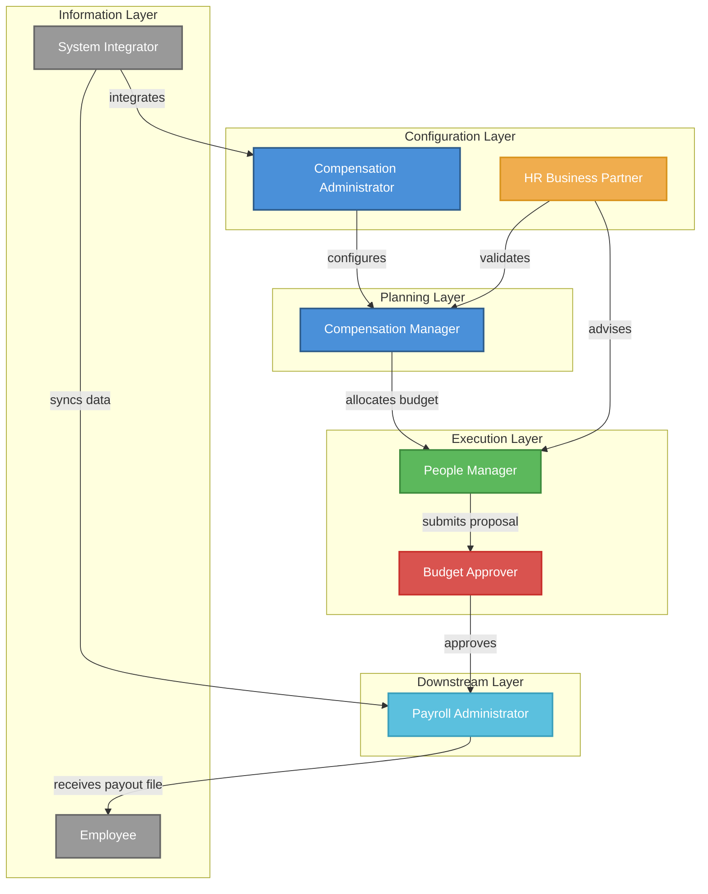
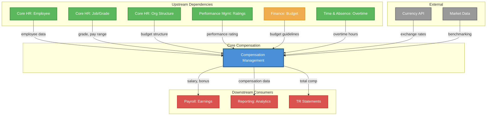

## 1. Business Context

### 1.1 Organization

xTalent is an enterprise HCM platform serving multi-national organizations across Southeast Asia. The Total Rewards module is classified as a **CORE domain** with **HIGH strategic value**, providing comprehensive compensation, benefits, and recognition capabilities.

**Geographic Scope**: 6+ countries in Southeast Asia
- Vietnam (VN) - Primary market
- Thailand (TH)
- Indonesia (ID)
- Singapore (SG)
- Malaysia (MY)
- Philippines (PH)

**Module Classification**:
| Attribute | Value |
|-----------|-------|
| Domain | Total Rewards (TR) |
| Sub-module | Core Compensation |
| Strategic Value | HIGH |
| Domain Type | CORE |
| Innovation Level | Full Innovation |
| Timeline | Fast Track |

---

### 1.2 Current Problem

Organizations across Southeast Asia face significant challenges in managing compensation effectively:

#### 1.2.1 Fragmented Compensation Management

**Problem**: Enterprises currently manage compensation across multiple disconnected systems:
- Salary data in legacy HRIS
- Bonus calculations in spreadsheets
- Budget tracking in finance systems
- No unified view of total compensation

**Impact from Research**:
> "Most AI coding fails at the input, not the output. Ouroboros fixes this by exposing hidden assumptions before any code is written."

**Hidden Assumptions Exposed**:
1. All countries have the same compensation cycles
2. Managers understand budget constraints
3. Pay ranges are always current
4. Currency conversion is straightforward

#### 1.2.2 Lack of Pay Equity Visibility

**Problem**: Organizations cannot identify pay gaps across demographics because:
- Compensation data is siloed
- No standardized job leveling across countries
- Market benchmarking data is manually sourced
- Historical salary decisions lack audit trail

#### 1.2.3 Manual Compensation Cycles

**Problem**: Annual merit cycles are executed manually:
- Budget allocation via email/spreadsheet
- Manager proposals lack guidelines
- Approval routing is ad-hoc
- Finalization requires manual payroll updates

#### 1.2.4 Vietnam Regulatory Complexity

**Problem**: Vietnam-specific requirements add complexity:
- 4 regional minimum wage levels (VND 3.25M - 4.68M)
- Social Insurance Law 2024 changes (effective July 2025)
- 7% premium for trained workers
- Complex SI calculation: BHXH 17.5%+8%, BHYT 3%+1.5%, BHTN 1%+1%

---

### 1.3 Business Impact

| Impact Area | Current State | Quantified Impact |
|-------------|---------------|-------------------|
| **Compensation Cycle Duration** | 6-8 weeks manual process | 40-60 HR hours per cycle |
| **Pay Equity Risk** | Unknown gaps | Potential legal exposure, employee turnover |
| **Budget Overruns** | 15-20% overspend common | Unplanned labor cost increases |
| **Employee Turnover** | Compensation-related exits | 25-30% of voluntary turnover |
| **Manager Satisfaction** | Low (manual, error-prone) | Poor employee experience |
| **Compliance Risk** | Vietnam Labor Code 2019 violations | Fines up to VND 100M |

---

### 1.4 Why Now

#### 1.4.1 Regulatory Deadline

**Vietnam Social Insurance Law 2024** takes effect **July 2025**:
- Pension eligibility changes from 20 years to 15 years
- New SI contribution rates
- Requires system capability for versioned rules

#### 1.4.2 Competitive Pressure

**Market Analysis** (from research report):
- Oracle, SAP, Workday all have mature compensation modules
- 3/4 vendors offer Total Compensation Statements
- AI-powered compensation insights emerging (SAP)
- Pay transparency regulations trending globally

#### 1.4.3 Business Growth

**xTalent Platform Expansion**:
- Multi-country enterprise customers demanding unified compensation
- Need for standardized processes across SEA region
- Integration requirements with Payroll, Core HR, Performance Management

#### 1.4.4 Technology Inflection

**AI/ML Foundation Opportunity**:
- Build data foundation now for future ML compensation recommendations
- SCD Type 2 versioning enables historical analysis
- Event-driven architecture supports real-time budget tracking

---

## 2. Business Objectives

### SMART Objectives Summary

| ID | Objective | Timeline | Success Metric |
|----|-----------|----------|----------------|
| BO-01 | Reduce compensation cycle duration | 6 months post-launch | From 6-8 weeks to 2 weeks |
| BO-02 | Achieve pay equity analytics capability | 3 months post-launch | 100% of enterprises can run gender pay gap analysis |
| BO-03 | Ensure Vietnam SI Law 2024 compliance | July 2025 deadline | Zero compliance violations |
| BO-04 | Enable multi-country compensation management | 6 countries by launch | VN, TH, ID, SG, MY, PH supported |
| BO-05 | Achieve manager self-service adoption | 12 months post-launch | 80% of managers use self-service for compensation proposals |

---

### BO-01: Reduce Compensation Cycle Duration

**Specific**: Reduce the end-to-end compensation cycle (merit, promotion, market adjustment) from manual 6-8 week process to 2 weeks through automation.

**Measurable**:
- Baseline: 6-8 weeks (42-56 days)
- Target: 2 weeks (14 days)
- Metric: Average cycle completion time

**Achievable**:
- Automated budget allocation
- Manager self-service proposals
- Automated approval routing
- Real-time budget tracking
- Automated payroll integration

**Relevant**:
- Directly addresses Current Problem 1.2.3 (Manual Compensation Cycles)
- Reduces HR workload by 40-60 hours per cycle
- Improves manager and employee experience

**Time-bound**:
- **Target**: 6 months post-launch
- **Milestone**: First enterprise customer completes Q2 merit cycle

---

### BO-02: Achieve Pay Equity Analytics Capability

**Specific**: Provide pay equity analysis tools enabling organizations to identify and address compensation gaps across protected groups (gender, ethnicity, age).

**Measurable**:
- 100% of enterprise customers can run gender pay gap analysis
- Statistical significance testing available
- Compa-ratio distribution by demographic group

**Achievable**:
- Build on FR-TR-032 (Pay Equity Analytics)
- Integrate with Core HR demographics
- Controlled analysis (job level, tenure, performance, location)

**Relevant**:
- Addresses Current Problem 1.2.2 (Lack of Pay Equity Visibility)
- Emerging regulatory trend (pay transparency laws)
- DEI (Diversity, Equity, Inclusion) strategic priority

**Time-bound**:
- **Target**: 3 months post-launch
- **Milestone**: Pay equity dashboard available in first enterprise release

---

### BO-03: Ensure Vietnam SI Law 2024 Compliance

**Specific**: Implement versioned Social Insurance calculation engine compliant with Vietnam SI Law 2024 effective July 2025.

**Measurable**:
- Zero compliance violations
- Correct SI calculation: BHXH 17.5%+8%, BHYT 3%+1.5%, BHTN 1%+1%
- Salary cap: 20x statutory minimum wage
- Pension eligibility: 15 years (down from 20)

**Achievable**:
- Build internal SI engine (ADR-TR-003)
- Versioned rule sets with effective dating
- Clear audit trail

**Relevant**:
- **P0 Legal Requirement** - non-negotiable
- Vietnam Labor Code 2019 compliance
- Regional minimum wage validation

**Time-bound**:
- **Target**: July 2025 (legal deadline)
- **Milestone**: SI calculation engine tested and certified by Q2 2025

---

### BO-04: Enable Multi-Country Compensation Management

**Specific**: Support compensation management across 6 Southeast Asian countries with multi-currency, multi-language, and local regulatory compliance.

**Measurable**:
- 6 countries supported: VN, TH, ID, SG, MY, PH
- Multi-currency support (VND, THB, IDR, SGD, MYR, PHP)
- Local wage floor validation per country
- Exchange rate handling for consolidated reporting

**Achievable**:
- FR-TR-008 (Global Compensation Support)
- Config-driven wage floor management
- Currency conversion at assignment and reporting levels

**Relevant**:
- Addresses enterprise customer needs
- Competitive parity with Oracle, SAP, Workday (3/4 have global support)
- Enables regional expansion strategy

**Time-bound**:
- **Target**: 6 countries by launch
- **Milestone**: All 6 countries configured and tested in UAT

---

### BO-05: Achieve Manager Self-Service Adoption

**Specific**: Drive adoption of manager self-service for compensation proposals, achieving 80% usage rate within 12 months.

**Measurable**:
- 80% of managers submit at least one compensation proposal via self-service
- Manager satisfaction score > 4.0/5.0
- Reduction in HR-assisted proposals (from 60% to <20%)

**Achievable**:
- Intuitive UX design (FR-TR-COMP-006)
- Real-time budget visibility
- Guideline recommendations (merit matrix)
- Compa-ratio visualization

**Relevant**:
- Reduces HR administrative burden
- Empowers managers with compensation ownership
- Improves employee-manager dialogue on compensation

**Time-bound**:
- **Target**: 12 months post-launch
- **Milestone**: Monthly adoption tracking begins Month 1

---

## 3. Business Actors

### Actor Summary

| ID | Actor | Role | Primary Responsibilities |
|----|-------|------|-------------------------|
| BA-01 | Compensation Administrator | System Configuration | Salary structures, pay components, cycles |
| BA-02 | Compensation Manager | Planning & Analysis | Budget allocation, plan design, equity analysis |
| BA-03 | People Manager | Proposal & Recommendation | Team compensation proposals, merit recommendations |
| BA-04 | Budget Approver (Director/VP) | Approval & Oversight | Approve/reject compensation changes |
| BA-05 | HR Business Partner | Advisory & Compliance | Eligibility validation, policy guidance |
| BA-06 | Payroll Administrator | Downstream Processing | Receive finalized compensation for payroll |
| BA-07 | Employee | Information Recipient | View compensation information (limited) |
| BA-08 | System Integrator | Technical Integration | API integrations, data sync |

---

### BA-01: Compensation Administrator

**Actor Type**: System Configuration

**Description**: HR professional responsible for configuring and maintaining compensation structures, pay components, and cycle parameters.

**Responsibilities**:
| Responsibility | Description | Frequency |
|----------------|-------------|-----------|
| Create/maintain salary structures | Define grade ladders, pay ranges | Quarterly |
| Configure pay components | Base salary, allowances, bonuses | As needed |
| Set up compensation plans | Merit, promotion, market adjustment plans | Annual |
| Manage compensation cycles | Create cycles, allocate budgets | Annual/Quarterly |
| Validate minimum wage compliance | Ensure salary assignments meet wage floors | Real-time |

**Permissions**:
| Entity | Create | Read | Update | Delete |
|--------|--------|------|--------|--------|
| SalaryStructure | Yes | Yes | Yes (Draft only) | Yes (Draft only) |
| SalaryGrade | Yes | Yes | Yes (Draft only) | Yes (Draft only) |
| PayComponentDefinition | Yes | Yes | Yes (Draft only) | No |
| CompensationPlan | Yes | Yes | Yes (Draft only) | Yes (Draft only) |
| CompensationCycle | Yes | Yes | Yes (DRAFT status) | No |
| PayRange | Yes | Yes | Yes (Draft only) | No |

**Inputs**:
- Legal Entity configuration from Core HR
- Job Profile data
- Market benchmarking data (external)

**Outputs**:
- Configured compensation structures
- Active compensation cycles
- Compliance reports

---

### BA-02: Compensation Manager

**Actor Type**: Planning & Analysis

**Description**: Senior HR professional responsible for compensation strategy, budget planning, and pay equity analysis.

**Responsibilities**:
| Responsibility | Description | Frequency |
|----------------|-------------|-----------|
| Design compensation plans | Define eligibility rules, guidelines | Annual |
| Allocate budgets | Distribute budgets by legal entity/BU | Annual |
| Analyze pay equity | Gender, ethnicity, age gap analysis | Quarterly |
| Monitor budget utilization | Track spend vs. allocated budget | Monthly |
| Generate compensation reports | Executive dashboards, analytics | Monthly |

**Permissions**:
| Entity | Create | Read | Update | Delete |
|--------|--------|------|--------|--------|
| CompensationPlan | Yes | Yes | Yes | No |
| CompensationCycle | Yes | Yes | Yes (DRAFT/OPEN) | No |
| BudgetAllocation | Yes | Yes | Yes | No |
| PayEquityAnalysis | Yes | Yes | N/A | Yes |
| CompensationAdjustment | No | Yes | No | No |

**Inputs**:
- Finance budget guidelines
- Workforce planning data
- Market benchmarking data

**Outputs**:
- Compensation plan templates
- Budget allocations
- Pay equity reports

---

### BA-03: People Manager

**Actor Type**: Proposal & Recommendation

**Description**: Front-line manager responsible for recommending compensation adjustments for direct reports.

**Responsibilities**:
| Responsibility | Description | Frequency |
|----------------|-------------|-----------|
| Propose compensation adjustments | Submit merit, promotion, market adjustments | Per cycle |
| Stay within budget | Monitor allocated budget | Per cycle |
| Follow guidelines | Adhere to merit matrix, approval thresholds | Per proposal |
| Provide rationale | Justify compensation recommendations | Per proposal |
| Track approval status | Monitor proposal workflow | Ongoing |

**Permissions**:
| Entity | Create | Read | Update | Delete |
|--------|--------|------|--------|--------|
| CompensationAdjustment (own team) | Yes | Yes | Yes (DRAFT/PENDING) | Yes (DRAFT only) |
| EmployeeCompensation (own team) | No | Yes | No | No |
| BudgetAllocation (own org) | No | Yes | No | No |

**Inputs**:
- Employee performance ratings
- Team compensation data
- Budget guidelines

**Outputs**:
- Compensation adjustment proposals
- Rationale justifications

---

### BA-04: Budget Approver (Director/VP/CFO)

**Actor Type**: Approval & Oversight

**Description**: Senior leader responsible for approving compensation changes based on authority thresholds.

**Responsibilities**:
| Responsibility | Description | Frequency |
|----------------|-------------|-----------|
| Review compensation proposals | Evaluate manager recommendations | As submitted |
| Approve/reject/request changes | Provide decision with comments | As submitted |
| Monitor organizational budget | Track budget utilization across teams | Monthly |
| Escalate exceptions | Handle out-of-guideline requests | As needed |

**Permissions**:
| Entity | Create | Read | Update | Delete |
|--------|--------|------|--------|--------|
| CompensationAdjustment | No | Yes (pending approval) | No | No |
| BudgetAllocation (own org) | No | Yes | No | No |
| ApprovalDecision | Yes | Yes | N/A | No |

**Approval Thresholds** (configurable):
| Increase % | Required Approver |
|------------|-------------------|
| 0-5% | Director |
| 5-10% | VP |
| 10-20% | SVP |
| >20% | CFO |

**Inputs**:
- Compensation adjustment proposals
- Budget utilization reports
- Pay equity analysis

**Outputs**:
- Approval decisions
- Budget reallocation requests

---

### BA-05: HR Business Partner

**Actor Type**: Advisory & Compliance

**Description**: HR professional providing guidance to managers on compensation policies and eligibility.

**Responsibilities**:
| Responsibility | Description | Frequency |
|----------------|-------------|-----------|
| Validate eligibility | Confirm employee eligibility for plans | As needed |
| Provide policy guidance | Interpret compensation policies | Ongoing |
| Review exceptions | Handle out-of-guideline requests | As needed |
| Audit compensation decisions | Ensure compliance with policies | Quarterly |

**Permissions**:
| Entity | Create | Read | Update | Delete |
|--------|--------|------|--------|--------|
| CompensationAdjustment | No | Yes (all) | No | No |
| EmployeeCompensation | No | Yes (all) | No | No |
| CompensationPlan | No | Yes | No | No |
| EligibilityRule | Yes | Yes | Yes | No |

**Inputs**:
- Employee inquiries
- Manager questions
- Policy documents

**Outputs**:
- Eligibility determinations
- Policy guidance

---

### BA-06: Payroll Administrator

**Actor Type**: Downstream Processing

**Description**: Payroll team member responsible for receiving finalized compensation data for payroll processing.

**Responsibilities**:
| Responsibility | Description | Frequency |
|----------------|-------------|-----------|
| Receive finalized adjustments | Import approved compensation changes | Per cycle |
| Validate payroll data | Reconcile compensation vs. payroll | Per pay period |
| Process adjustments | Update payroll earnings codes | Per pay period |
| Report discrepancies | Identify mismatches | As needed |

**Permissions**:
| Entity | Create | Read | Update | Delete |
|--------|--------|------|--------|--------|
| EmployeeCompensationSnapshot | No | Yes | No | No |
| CompensationCycle | No | Yes (CLOSED only) | No | No |
| PayoutFile | Yes | Yes | No | No |

**Inputs**:
- Finalized compensation cycles
- Payout files from TR module

**Outputs**:
- Payroll run results
- Discrepancy reports

---

### BA-07: Employee

**Actor Type**: Information Recipient

**Description**: Individual contributor viewing their own compensation information.

**Responsibilities**:
| Responsibility | Description | Frequency |
|----------------|-------------|-----------|
| View compensation statement | Review total compensation | On-demand |
| Understand pay components | Review salary breakdown | On-demand |
| Track compensation history | View salary progression | On-demand |

**Permissions**:
| Entity | Create | Read | Update | Delete |
|--------|--------|------|--------|--------|
| TotalRewardsStatement | No | Yes (own only) | No | No |
| EmployeeCompensation (own) | No | Yes | No | No |
| SalaryHistory (own) | No | Yes | No | No |

**Inputs**:
- Personal compensation data

**Outputs**:
- Compensation inquiries

---

### BA-08: System Integrator

**Actor Type**: Technical Integration

**Description**: Technical role responsible for API integrations and data synchronization with external systems.

**Responsibilities**:
| Responsibility | Description | Frequency |
|----------------|-------------|-----------|
| Configure API connections | Set up integrations with Core HR, Payroll | One-time |
| Monitor data sync | Ensure data consistency | Daily |
| Handle integration errors | Resolve sync failures | As needed |
| Map data fields | Configure field mappings | One-time |

**Permissions**:
| Entity | Create | Read | Update | Delete |
|--------|--------|------|--------|--------|
| IntegrationConfig | Yes | Yes | Yes | No |
| DataSyncLog | No | Yes | No | Yes |
| All TR entities | No | Yes (technical) | No | No |

**Inputs**:
- External system data
- API requests

**Outputs**:
- Data sync results
- Integration logs

---

### Actor Relationship Diagram

---

## 4. Business Rules

### Business Rules Summary

| Category | Count | Examples |
|----------|-------|----------|
| Validation Rules | 5 | Minimum wage, pay range, eligibility |
| Authorization Rules | 4 | Approval thresholds, access control |
| Calculation Rules | 4 | Compa-ratio, increase %, budget utilization |
| Constraint Rules | 4 | SCD Type 2 versioning, cycle status |
| Compliance Rules | 5 | Vietnam Labor Code, SI Law 2024 |
| **Total** | **22** | |

---

### 4.1 Validation Rules

| ID | Rule Name | Description | Formula/Condition | Error Message |
|----|-----------|-------------|-------------------|---------------|
| **VR-001** | Minimum Wage Validation | Salary assignment must meet or exceed regional minimum wage | `salary >= minimum_wage_region.amount * (1 + trained_worker_premium)` | "Salary [amount] is below minimum wage [min_amount] for region [region_name]" |
| **VR-002** | Pay Range Compliance | Proposed salary must be within grade pay range (min-max) | `pay_range.min <= proposed_salary <= pay_range.max` | "Proposed salary [amount] is outside pay range [min]-[max] for grade [grade_code]" |
| **VR-003** | Plan Eligibility Check | Employee must meet plan eligibility criteria before adjustment | `employee.tenure_months >= plan.min_tenure AND employee.performance_rating >= plan.min_rating AND (plan.exclude_probation = false OR employee.probation = false)` | "Employee is not eligible for plan [plan_name]: [reason]" |
| **VR-004** | Pay Range Integrity | Pay range must have min < mid < max | `pay_range.min < pay_range.mid < pay_range.max` | "Pay range must satisfy: min < mid < max" |
| **VR-005** | Budget Availability | Proposed adjustment must have sufficient budget | `budget_pool.remaining >= total_adjustment_cost` | "Insufficient budget. Required: [required], Available: [available]" |

**Source References**:
- VR-001: Vietnam Labor Code 2019, Regional Wage Decrees
- VR-002: FR-TR-COMP-003, FR-TR-COMP-006
- VR-003: FR-TR-COMP-004 (Compensation Plan Setup)
- VR-004: entity-catalog.md (E-TR-003 SalaryGrade)
- VR-005: FR-TR-COMP-005, FR-TR-COMP-009

---

### 4.2 Authorization Rules

| ID | Rule Name | Description | Condition | Action |
|----|-----------|-------------|-----------|--------|
| **AR-001** | Approval Routing by Increase % | Route compensation adjustments based on increase percentage | `increase_pct <= 5%` → Director `5% < increase_pct <= 10%` → VP `10% < increase_pct <= 20%` → SVP `increase_pct > 20%` → CFO | Auto-route to required approver |
| **AR-002** | Manager Hierarchy Validation | Approver must be in employee's management chain | `approver.employee_id IN (SELECT manager_id FROM employee_hierarchy WHERE subordinate_id = employee_id)` | Reject if not in hierarchy |
| **AR-003** | Role-Based Access Control | Restrict entity access based on actor role | See Business Actors permissions matrix | Grant/deny access |
| **AR-004** | Cycle Status Gating | Only allow modifications based on cycle status | `cycle.status = 'DRAFT'` → Full edit `cycle.status = 'OPEN'` → Proposals allowed `cycle.status = 'IN_REVIEW'` → No changes `cycle.status = 'APPROVED'` → Finalize only `cycle.status = 'CLOSED'` → Read-only | Block invalid operations |

**Source References**:
- AR-001: FR-TR-COMP-007, functional-requirements.md (Approval Thresholds)
- AR-002: FR-TR-COMP-007
- AR-003: Business Actors section
- AR-004: FR-TR-COMP-005, FR-TR-COMP-008

---

### 4.3 Calculation Rules

| ID | Rule Name | Description | Formula | Example |
|----|-----------|-------------|---------|---------|
| **CR-001** | Compa-Ratio Calculation | Calculate employee position in pay range | `compa_ratio = (current_salary / pay_range.mid) * 100` | Salary 15M, Mid 14M → Compa-ratio = 107% |
| **CR-002** | Increase Percentage | Calculate percentage increase from proposed adjustment | `increase_pct = ((proposed_amount - current_amount) / current_amount) * 100` | Current 10M, Proposed 11M → 10% increase |
| **CR-003** | Budget Utilization | Track real-time budget consumption | `utilization_pct = (sum(approved_adjustments) / allocated_budget) * 100` | Budget 1B, Approved 800M → 80% |
| **CR-004** | Pro-Rata Adjustment | Calculate pro-rated adjustment for partial period employees | `adjusted_amount = full_amount * (days_worked / days_in_period)` | 15 days worked / 30 days = 50% |

**Source References**:
- CR-001: FR-TR-COMP-014
- CR-002: FR-TR-COMP-006
- CR-003: FR-TR-COMP-009
- CR-004: FR-TR-COMP-011

---

### 4.4 Constraint Rules

| ID | Rule Name | Description | Constraint | Impact |
|----|-----------|-------------|------------|--------|
| **C-001** | SCD Type 2 Versioning | All grade/plan changes create new version, never modify current | `on_update: CREATE new_version, SET is_current_version = false on previous, LINK previous_version_id` | Enables historical analysis, audit trail |
| **C-002** | Single Current Version | Only one version of a grade/plan can be current at any time | `UNIQUE (grade_code, is_current_version) WHERE is_current_version = true` | Prevents conflicting active versions |
| **C-003** | Immutable Closed Cycle | Once cycle is CLOSED, no modifications allowed | `IF cycle.status = 'CLOSED' THEN DENY all UPDATE/DELETE` | Ensures data integrity after finalization |
| **C-004** | Unbroken Version Chain | Version history must be continuous with no gaps | `version_number = previous_version_number + 1 AND effective_start_date = previous_effective_end_date + 1 day` | Maintains complete audit history |

**Source References**:
- C-001: FR-TR-COMP-003, entity-catalog.md (SCD Type 2)
- C-002: BR-TR-COMP-007
- C-003: BR-TR-COMP-015, BR-TR-COMP-026
- C-004: BR-TR-COMP-008

---

### 4.5 Compliance Rules (Vietnam Labor Code 2019, SI Law 2024)

| ID | Rule Name | Description | Legal Source | Requirement |
|----|-----------|-------------|--------------|-------------|
| **COMP-001** | Regional Minimum Wage | Salary must meet or exceed regional minimum wage by region | Vietnam Labor Code 2019, Regional Wage Decrees | Region I: VND 4.68M Region II: VND 4.16M Region III: VND 3.64M Region IV: VND 3.25M |
| **COMP-002** | Trained Worker Premium | Trained workers receive minimum 7% premium over base minimum wage | Vietnam Labor Code 2019 | `minimum_wage = base_wage * 1.07` |
| **COMP-003** | Social Insurance Contribution | Calculate SI contributions per SI Law 2024 rates | Vietnam Social Insurance Law 2024 (effective July 2025) | BHXH: 17.5% employer + 8% employee BHYT: 3% employer + 1.5% employee BHTN: 1% employer + 1% employee |
| **COMP-004** | SI Salary Cap | Social Insurance calculated on maximum 20x statutory minimum wage | SI Law 2024 | `si_contribution_base = MIN(actual_salary, 20 * minimum_wage)` |
| **COMP-005** | Overtime Pay Rates | Overtime must be paid at statutory rates | Vietnam Labor Code 2019, Art. 98 | Normal day: 150% Weekly rest: 200% Holiday: 300% Night shift: +30% |
| **COMP-006** | Pension Eligibility | Employees eligible for pension after 15 years of SI contributions (changed from 20 years) | SI Law 2024, Art. 64 | `eligible = si_contribution_years >= 15` |
| **COMP-007** | Annual Leave Entitlement | Minimum 12 working days annual leave | Vietnam Labor Code 2019, Art. 113 | `annual_leave_days = MAX(12, tenure_based_days)` |
| **COMP-008** | Wage Payment Frequency | Wages must be paid at least monthly | Vietnam Labor Code 2019, Art. 90-96 | `payment_frequency <= MONTHLY` |

**Source References**:
- Research report (Regulatory & Compliance Matrix)
- FR-TR-036 to FR-TR-040 (Vietnam Compliance features)
- entity-catalog.md (E-TR-028 MinimumWageRegion, E-TR-029 SocialInsuranceRate)

---

### Business Rules Cross-Reference Matrix

| Rule ID | Related Entities | Related Features | Related Objectives |
|---------|------------------|------------------|-------------------|
| VR-001 | MinimumWageRegion, CompensationAssignment | FR-TR-036 | BO-03 |
| VR-002 | SalaryGrade, PayRange, CompensationAssignment | FR-TR-002, FR-TR-003 | BO-04 |
| VR-003 | CompensationPlan, Employee | FR-TR-004 | BO-01 |
| VR-004 | SalaryGrade, PayRange | FR-TR-002 | BO-04 |
| VR-005 | BudgetAllocation, CompensationAdjustment | FR-TR-001, FR-TR-005 | BO-01 |
| AR-001 | CompensationAdjustment | FR-TR-007 | BO-05 |
| AR-002 | Employee, CompensationAdjustment | FR-TR-007 | BO-05 |
| AR-003 | All entities | All | All |
| AR-004 | CompensationCycle | FR-TR-005, FR-TR-009 | BO-01 |
| CR-001 | PayRange, EmployeeCompensation | FR-TR-014 | BO-02 |
| CR-002 | CompensationAdjustment | FR-TR-006 | BO-01 |
| CR-003 | BudgetAllocation, CompensationAdjustment | FR-TR-009 | BO-01 |
| CR-004 | CompensationAdjustment | FR-TR-011 | BO-04 |
| C-001 | GradeVersion, CompensationPlan | FR-TR-003 | BO-04 |
| C-002 | GradeVersion | FR-TR-003 | BO-04 |
| C-003 | CompensationCycle | FR-TR-008 | BO-01 |
| C-004 | GradeVersion | FR-TR-003 | BO-04 |
| COMP-001 | MinimumWageRegion | FR-TR-036 | BO-03 |
| COMP-002 | MinimumWageRegion | FR-TR-036 | BO-03 |
| COMP-003 | SocialInsuranceRate | FR-TR-037 | BO-03 |
| COMP-004 | SocialInsuranceRate | FR-TR-037 | BO-03 |
| COMP-005 | CompensationComponent | FR-TR-038 | BO-03 |
| COMP-006 | Employee | FR-TR-037 | BO-03 |
| COMP-007 | BenefitEnrollment | FR-TR-040 | BO-03 |
| COMP-008 | CompensationPlan | FR-TR-036 | BO-03 |

---

## 5. Out of Scope

The following items are **explicitly excluded** from the Core Compensation sub-module:

| ID | Out of Scope Item | Rationale | Handled By |
|----|-------------------|-----------|------------|
| **OOS-001** | **Payroll Execution** | Complex tax calculations, actual payment processing are payroll functions | Payroll Module (PY) |
| **OOS-002** | **Tax Filing & Compliance** | Requires specialized tax engine, government submissions | Payroll/Tax Module |
| **OOS-003** | **Individual Tax Calculation** | Personal income tax (PIT) calculation is payroll responsibility | Payroll Module |
| **OOS-004** | **Stock Grant Administration** | Equity/stock compensation is in Variable Pay, not Core Compensation | Variable Pay sub-module |
| **OOS-005** | **Commission Calculation** | Sales commission is variable pay, not fixed compensation | Variable Pay sub-module |
| **OOS-006** | **Benefits Administration** | Health insurance, retirement plans are separate domain | Benefits sub-module |
| **OOS-007** | **Recognition Programs** | Peer recognition, awards, points system are separate domain | Recognition sub-module |
| **OOS-008** | **Performance Rating Calculation** | Performance scores are inputs to compensation, not calculated here | Performance Management (PM) |
| **OOS-009** | **Recruitment Offer Negotiation** | Pre-hire compensation is Talent Acquisition process | Talent Acquisition (TA) |
| **OOS-010** | **Learning & Development Tracking** | Training, certifications are separate domain | Learning (LM) |
| **OOS-011** | **Time & Attendance Tracking** | Working hours, overtime hours tracked in Time module | Time & Absence (TA) |
| **OOS-012** | **Financial Advisory Services** | Investment advice, financial planning require licensing | External financial partners |
| **OOS-013** | **Wellness Program Management** | Physical/mental wellness programs are separate domain | Well-being sub-module |
| **OOS-014** | **Carrier Integration** | Benefits carrier connectivity is Benefits responsibility | Benefits sub-module |
| **OOS-015** | **Total Rewards Statement Generation** | Consolidated TR statement spans all TR sub-modules | TR Statements sub-module |

**Scope Boundary Rule**: If a feature is not explicitly listed in Section 2 (Business Objectives) or Section 4 (Business Rules), it is **out of scope by default** for Core Compensation.

---

## 6. Assumptions & Dependencies

### 6.1 Assumptions

| ID | Assumption | Category | Impact if False | Mitigation |
|----|------------|----------|-----------------|------------|
| **A-001** | Core HR module provides accurate employee data (job, grade, employment type) | Data Quality | **HIGH** - Compensation cannot be assigned without employee context | Define data contract with Core HR, implement validation |
| **A-002** | Performance Management module provides performance ratings before compensation cycles | Data Dependency | **HIGH** - Merit increases require performance input | Establish cycle timeline dependency |
| **A-003** | Finance provides budget guidelines before compensation cycle kickoff | Process | **HIGH** - Cannot allocate budget without finance input | Define process SLA with Finance |
| **A-004** | Payroll module accepts compensation payout files in standard format | Integration | **MEDIUM** - Manual payroll updates required if integration fails | Define API contract, file fallback |
| **A-005** | Managers have basic compensation literacy to make recommendations | User Capability | **MEDIUM** - Poor quality proposals, increased HR workload | Provide manager training, guidelines |
| **A-006** | Exchange rates are available from reliable external source for multi-currency conversion | External Data | **MEDIUM** - Inaccurate consolidated reporting | Integrate with currency API (XE, OANDA) |
| **A-007** | Legal entity structure is stable during compensation cycle | Organizational | **LOW** - Budget allocation may need adjustment | Allow mid-cycle reallocation with approval |
| **A-008** | Market benchmarking data is available from external providers for pay range setting | External Data | **MEDIUM** - Pay ranges may not be market-competitive | Partner with Radford, Mercer, Willis Towers Watson |

---

### 6.2 Dependencies

| ID | Dependency | Type | Provider | Impact | Status |
|----|------------|------|----------|--------|--------|
| **D-001** | **Core HR: Employee Master Data** | Upstream | Core HR (CO) | **CRITICAL** - Compensation requires employee context | In Development |
| **D-002** | **Core HR: Job Profile & Grade** | Upstream | Core HR (CO) | **HIGH** - Grade determines pay range | In Development |
| **D-003** | **Core HR: Legal Entity** | Upstream | Core HR (CO) | **HIGH** - Compensation tied to legal entity | In Development |
| **D-004** | **Core HR: Employment Type** | Upstream | Core HR (CO) | **MEDIUM** - Eligibility rules depend on employment type | In Development |
| **D-005** | **Core HR: Manager Hierarchy** | Upstream | Core HR (CO) | **HIGH** - Approval routing requires org structure | In Development |
| **D-006** | **Performance: Rating & Goals** | Upstream | Performance Mgmt (PM) | **HIGH** - Merit increases tied to performance | In Development |
| **D-007** | **Finance: Budget Guidelines** | Upstream | Finance System | **HIGH** - Compensation budgets from finance | Manual Process |
| **D-008** | **Finance: Cost Center Structure** | Upstream | Finance System | **MEDIUM** - Budget allocation by cost center | Manual Process |
| **D-009** | **Payroll: Earnings Code Mapping** | Downstream | Payroll Module (PY) | **HIGH** - Compensation flows to payroll | Planned |
| **D-010** | **Payroll: Payment Processing** | Downstream | Payroll Module (PY) | **HIGH** - Actual salary payment | Planned |
| **D-011** | **Reporting: Analytics Platform** | Downstream | Reporting (RPT) | **MEDIUM** - Compensation dashboards | Planned |
| **D-012** | **External: Currency Exchange Rates** | External | Third-party API | **MEDIUM** - Multi-currency conversion | Available |
| **D-013** | **External: Market Benchmarking Data** | External | Survey Providers | **MEDIUM** - Pay range competitiveness | Available |
| **D-014** | **Organization: Department/Business Unit** | Upstream | Core HR (CO) | **MEDIUM** - Budget allocation structure | In Development |
| **D-015** | **Time & Absence: Overtime Hours** | Upstream | Time & Absence (TA) | **LOW** - Overtime pay calculation (if applicable) | Planned |

---

### Dependency Impact Analysis

#### Critical Dependencies (Must Have for MVP)

| Dependency | Risk | Mitigation Strategy |
|------------|------|---------------------|
| **D-001: Employee Master Data** | If Core HR is delayed, compensation cannot function | Define minimum viable employee schema, mock data for testing |
| **D-006: Performance Ratings** | Without ratings, merit matrix cannot apply | Allow manual override, default guideline for missing ratings |
| **D-009: Payroll Integration** | Without payroll, manual updates required | Implement file-based fallback (CSV export) |

#### High Priority Dependencies

| Dependency | Risk | Mitigation Strategy |
|------------|------|---------------------|
| **D-002: Job Profile & Grade** | Grade determines pay range validation | Allow temporary grade-agnostic assignments with warning |
| **D-005: Manager Hierarchy** | Approval routing blocked without org structure | Allow manual approver selection as fallback |
| **D-007: Finance Budget** | Cannot allocate budget without finance input | Manual budget entry process, spreadsheet import |

---

### Cross-Domain Dependency Diagram

---

## Appendix A: Document History

| Version | Date | Author | Changes |
|---------|------|--------|---------|
| 1.0.0 | 2026-03-20 | xTalent Product Team | Initial BRD draft |

---

## Appendix B: Glossary

| Term | Definition |
|------|------------|
| **SCD Type 2** | Slowly Changing Dimension Type 2 - versioning pattern for historical tracking |
| **Compa-Ratio** | Ratio of employee salary to pay range midpoint, expressed as percentage |
| **Merit Matrix** | Guideline table mapping performance × compa-ratio to recommended increase % |
| **Budget Utilization** | Percentage of allocated budget that has been committed/approved |
| **Grade Ladder** | Ordered sequence of grades representing career progression path |
| **Pay Range** | Min-mid-max salary bounds for a grade |

---

## Appendix C: Cross-Reference to Input Documents

| BRD Section | Research Report | Entity Catalog | Feature Catalog | Functional Requirements |
|-------------|-----------------|----------------|-----------------|------------------------|
| Business Context | Executive Summary, Domain Evolution | N/A | N/A | N/A |
| BO-01 | N/A | E-TR-008 CompensationReview | FR-TR-001, FR-TR-005 | FR-TR-COMP-005, FR-TR-COMP-009 |
| BO-02 | Strategic Insights (Pay Equity) | E-TR-022 PayEquityAnalysis | FR-TR-032 | FR-TR-COMP-013 |
| BO-03 | Regulatory Matrix, SI Law 2024 | E-TR-029 SocialInsuranceRate | FR-TR-037 | FR-TR-037 |
| BO-04 | Global Compensation | E-TR-001, E-TR-008 | FR-TR-008 | FR-TR-COMP-008 |
| BO-05 | Manager Self-Service | E-TR-006 | FR-TR-009 | FR-TR-COMP-006 |
| Business Actors | N/A | N/A | N/A | Actor definitions |
| Validation Rules | Regulatory Matrix | E-TR-028, E-TR-003 | FR-TR-036 | FR-TR-COMP-003 |
| Authorization Rules | N/A | N/A | FR-TR-009 | FR-TR-COMP-007 |
| Calculation Rules | N/A | N/A | N/A | FR-TR-COMP-014, FR-TR-COMP-009 |
| Constraint Rules | N/A | E-TR-003 (SCD Type 2) | N/A | FR-TR-COMP-003 |
| Compliance Rules | Regulatory Matrix | E-TR-028, E-TR-029 | FR-TR-036 to FR-TR-040 | Vietnam compliance |
| Out of Scope | Non-Goals Section | N/A | N/A | Module boundaries |
| Dependencies | Cross-Domain Map | Dependencies | N/A | FR-TR-COMP dependencies |

---

## Appendix D: Mermaid Diagrams Index

| Diagram | Section | Purpose |
|---------|---------|---------|
| Actor Relationship Diagram | Section 3 (Business Actors) | Shows how actors interact across configuration, planning, execution layers |
| Cross-Domain Dependency Diagram | Section 6 (Dependencies) | Shows upstream/downstream system relationships |

---

**End of Document**
