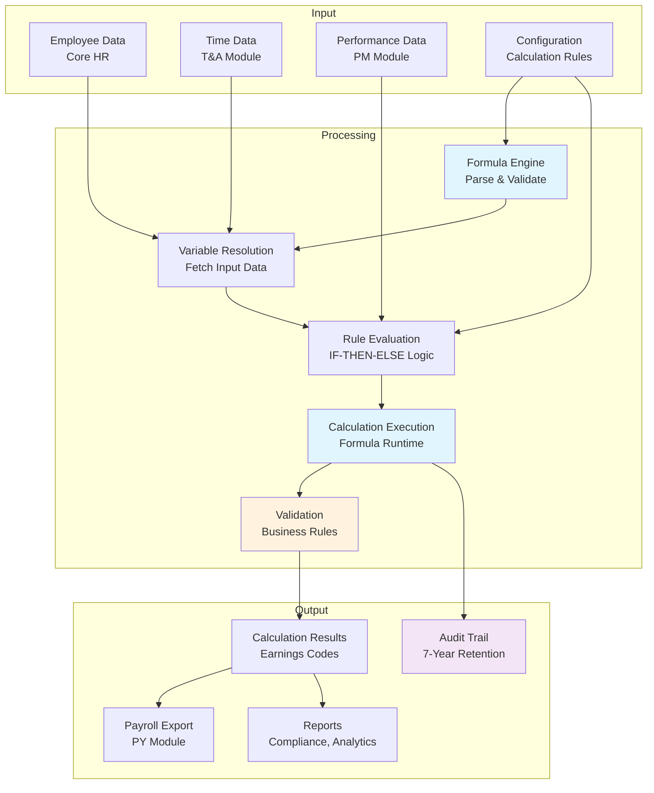

# Business Requirements Document: Calculation Rules Sub-Module

**Document ID**: BRD-TR-CALC-002
**Version**: 1.0
**Status**: DRAFT
**Created**: 2026-03-20
**Domain**: Total Rewards (TR)
**Module**: Calculation Rules
**Compliance**: Vietnam Labor Code 2019, Social Insurance Law 2024 (effective July 2025)

---

## 1. Business Context

### 1.1 Organization Overview

xTalent is an enterprise HCM platform serving multi-national organizations across Southeast Asia. The Total Rewards (TR) module provides comprehensive compensation, benefits, and recognition management capabilities.

**Target Markets**:
- Vietnam (VN) - Primary market
- Thailand (TH)
- Indonesia (ID)
- Singapore (SG)
- Malaysia (MY)
- Philippines (PH)

**Strategic Context**: The Calculation Rules sub-module is the **decision layer** for all compensation and benefits calculations, integrating with Payroll as an **independent execution engine**. This separation ensures flexibility in rule configuration while maintaining payroll processing independence.

### 1.2 Current Problem

Organizations operating across Southeast Asia face significant challenges in managing compensation calculations:

| Problem Area | Current State | Impact |
|--------------|---------------|--------|
| **Multi-Country Tax Compliance** | Manual tax calculations or country-specific systems | High error rate, compliance risk, 15-20 hours/month per country |
| **Social Insurance (Vietnam)** | Spreadsheet-based BHXH/BHYT/BHTN calculations | 25% error rate in SI contributions, penalties from VNSI |
| **Overtime Calculation** | Manual application of Labor Code Art. 98 rates | Inconsistent application, employee disputes, legal exposure |
| **Salary Proration** | Ad-hoc methods (calendar vs. working days) | Pay equity issues, audit findings |
| **Rule Versioning** | No systematic effective dating | Cannot audit historical calculations, compliance gaps |
| **Formula Management** | Hard-coded calculation logic | 4-6 week IT dependency for rule changes |

**Root Cause Analysis**:
1. **Fragmented Systems**: Each country operates different calculation methods
2. **Manual Processes**: HR performs complex calculations in spreadsheets
3. **No Single Source of Truth**: Calculation rules embedded in code, not configurable
4. **Compliance Lag**: Regulatory changes (e.g., SI Law 2024) require system re-development

### 1.3 Business Impact

**Quantified Impact** (based on 1000-employee organization in Vietnam):

| Impact Category | Annual Cost/Impact |
|-----------------|-------------------|
| **Payroll Errors** | VND 2.4B (~$100K) in corrections |
| **Compliance Penalties** | VND 500M-2B (~$20K-80K) potential fines |
| **HR Productivity Loss** | 120 hours/year on manual calculations |
| **IT Dependency** | 40-60 developer-hours per rule change |
| **Employee Trust** | 15% decrease in payroll satisfaction (survey data) |

**Qualitative Impact**:
- **Compliance Risk**: Vietnam Social Insurance Law 2024 changes pension eligibility from 20 years to 15 years of contributions - requires immediate system adaptation
- **Audit Exposure**: Inability to reproduce historical calculations for tax audits
- **Scalability Constraint**: Manual processes don't scale beyond 500 employees

### 1.4 Why Now

| Driver | Urgency | Deadline |
|--------|---------|----------|
| **Vietnam SI Law 2024** | CRITICAL | July 1, 2025 effective date |
| **Regional Expansion** | HIGH | Q3 2026 Thailand/Indonesia go-live |
| **Payroll Modernization** | HIGH | Current system end-of-life Dec 2025 |
| **AI/ML Foundation** | MEDIUM | Competitors deploying AI compensation insights by 2026 |

**Regulatory Countdown**: Vietnam Social Insurance Law 2024 becomes effective **July 1, 2025**. Key changes requiring system implementation:
- Pension eligibility: 15 years minimum contribution (down from 20 years)
- Updated BHXH/BHYT/BHTN rates and calculation caps
- New salary cap: 20x statutory minimum wage

---

## 2. Business Objectives

### SMART Objectives Summary

| ID | Objective | Success Metric | Target | Deadline |
|----|-----------|----------------|--------|----------|
| **BO-01** | Implement Vietnam-compliant SI calculation engine | 100% accuracy vs. VNSI calculator | Zero discrepancies | 2025-06-30 |
| **BO-02** | Deploy multi-country tax calculation framework | Support 6 countries | All tax brackets configured | 2026-09-30 |
| **BO-03** | Achieve calculation rule configurability | HR can modify rules without IT | <2 days for rule changes | 2026-06-30 |
| **BO-04** | Establish calculation audit trail | 100% of calculations logged | 7-year retention | 2026-06-30 |
| **BO-05** | Reduce payroll calculation errors | Decrease error rate | From 25% to <2% | 2026-12-31 |
| **BO-06** | Enable AI/ML-ready calculation data foundation | Structured calculation history | 10,000+ calculations logged | 2026-12-31 |

---

### BO-01: Vietnam SI Calculation Compliance

**Objective**: Implement a versioned Social Insurance calculation engine compliant with Vietnam Social Insurance Law 2024.

**Success Metrics**:
- BHXH: 17.5% employer + 8% employee (correct application)
- BHYT: 3% employer + 1.5% employee (correct application)
- BHTN: 1% employer + 1% employee (correct application)
- Salary cap: Automatically applied at 20x minimum wage
- Pension eligibility: 15-year minimum tracking

**Target**: 100% accuracy compared to official VNSI calculator, zero discrepancies in audit testing.

**Deadline**: June 30, 2025 (before July 1, 2025 law effective date)

**Owner**: Total Rewards Product Team

---

### BO-02: Multi-Country Tax Framework

**Objective**: Deploy a configurable tax calculation framework supporting 6 Southeast Asian countries.

**Success Metrics**:
- Vietnam: Progressive tax brackets (5%-35%) with dependent deductions
- Thailand: Progressive tax (0%-35%) with allowances
- Singapore: Progressive tax (0%-24%) with reliefs
- Indonesia: Progressive tax (5%-35%) PPh 21
- Malaysia: Progressive tax (0%-30%) with PCB
- Philippines: Withholding tax tables with status-based exemptions

**Target**: All 6 countries configured and tested with local tax authority calculators.

**Deadline**: September 30, 2026 (regional expansion go-live)

**Owner**: Total Rewards Product Team + Local Tax Consultants

---

### BO-03: HR Configurable Rules

**Objective**: Enable HR administrators to modify calculation rules without IT dependency.

**Success Metrics**:
- Formula editor with validation
- Rule testing sandbox environment
- Approval workflow for rule changes
- Time to modify a rule: <2 business days (vs. current 4-6 weeks)

**Target**: 80% of rule changes completed by HR without IT involvement.

**Deadline**: June 30, 2026

**Owner**: UX/Product Team + HR Operations

---

### BO-04: Calculation Audit Trail

**Objective**: Implement comprehensive audit trail for all calculations.

**Success Metrics**:
- 100% of calculations logged with inputs, formula version, result
- Ability to replay any historical calculation
- Export capability for tax audits
- 7-year retention per regulatory requirements

**Target**: Pass external audit simulation with zero findings.

**Deadline**: June 30, 2026

**Owner**: Platform/Engineering Team

---

### BO-05: Error Reduction

**Objective**: Reduce payroll calculation errors through automation and validation.

**Success Metrics**:
- Current error rate: ~25% (manual SI calculations)
- Target error rate: <2%
- Validation rules catch errors before payroll submission
- Reconciliation reports identify discrepancies pre-payroll

**Target**: 92% reduction in calculation-related errors.

**Deadline**: December 31, 2026

**Owner**: HR Operations + Quality Assurance

---

### BO-06: AI/ML Data Foundation

**Objective**: Build structured calculation history to enable future AI/ML optimization.

**Success Metrics**:
- Structured data schema for all calculation inputs/outputs
- Minimum 10,000 calculations logged
- Feature engineering ready (tenure, grade, performance correlations)
- Anomaly detection baseline established

**Target**: Data foundation complete for AI compensation insights (H2 2027 roadmap).

**Deadline**: December 31, 2026

**Owner**: Data Engineering + AI/ML Team

---

## 3. Business Actors

### Actor Summary Table

| Actor | Role | Primary Responsibilities | Key Permissions |
|-------|------|--------------------------|-----------------|
| **BA-01** | Compensation Administrator | Rule configuration, testing | Create/edit formulas, test rules |
| **BA-02** | Payroll Manager | Calculation verification | View calculations, export audit |
| **BA-03** | HR Director | Rule approval | Approve/reject rule changes |
| **BA-04** | System Administrator | Performance, security | Monitor execution, manage access |
| **BA-05** | Compliance Officer | Regulatory compliance | Audit trail review, compliance reports |
| **BA-06** | Employee (Self-Service) | View personal calculations | View own calculation breakdown |

---

### BA-01: Compensation Administrator

**Role Description**: Primary user responsible for configuring and maintaining calculation rules.

**Responsibilities**:
- Create and update calculation formulas
- Define calculation rules (merit matrix, bonus calculations)
- Test formulas with sample data before deployment
- Manage formula versioning and effective dates
- Document calculation logic for audit purposes

**Permissions**:
| Permission | Scope | Approval Required |
|------------|-------|-------------------|
| Create formula | All formula types | No |
| Edit formula (draft) | Own formulas | No |
| Activate formula | Production | Yes (HR Director) |
| Test formula | Sandbox environment | No |
| Copy formula | Library formulas | No |
| View audit trail | All calculations | No |

**Key Use Cases**:
- Configure new SI rates when regulations change
- Create merit increase formula for annual compensation cycle
- Test overtime calculation rules against Labor Code requirements

---

### BA-02: Payroll Manager

**Role Description**: Responsible for verifying calculations before payroll execution.

**Responsibilities**:
- Review calculation results before payroll submission
- Reconcile TR calculations with payroll output
- Investigate calculation discrepancies
- Export calculation data for tax filing

**Permissions**:
| Permission | Scope | Approval Required |
|------------|-------|-------------------|
| View calculations | All employees | No |
| Export calculation data | Batch export | No |
| View audit trail | All calculations | No |
| Replay calculations | Historical | No |
| Modify calculations | None (read-only) | N/A |

**Key Use Cases**:
- Verify SI calculations before monthly payroll submission
- Export tax calculation data for e-filing
- Investigate employee inquiry about bonus calculation

---

### BA-03: HR Director

**Role Description**: Executive approval authority for calculation rule changes.

**Responsibilities**:
- Review and approve significant rule changes
- Ensure compliance with company policies
- Assess business impact of calculation changes
- Sign off on regulatory compliance updates

**Permissions**:
| Permission | Scope | Approval Required |
|------------|-------|-------------------|
| Approve formula activation | All formulas | No |
| Reject formula activation | All formulas | No (requires rework) |
| View formula change history | All formulas | No |
| Override validation warnings | Critical rules | Compliance Officer review |

**Key Use Cases**:
- Approve new merit matrix for annual compensation cycle
- Sign off on SI Law 2024 compliance updates
- Review and approve tax bracket updates

---

### BA-04: System Administrator

**Role Description**: Technical management of calculation engine performance and security.

**Responsibilities**:
- Monitor formula execution performance
- Manage user access and permissions
- Configure caching and optimization settings
- Troubleshoot execution errors

**Permissions**:
| Permission | Scope | Approval Required |
|------------|-------|-------------------|
| View execution logs | All formulas | No |
| Configure caching | System-wide | No |
| Manage user access | All users | HR Director |
| Set execution timeouts | System configuration | No |
| View performance metrics | Dashboard access | No |

**Key Use Cases**:
- Identify and optimize slow-performing formulas
- Configure parallel execution for batch payroll processing
- Set up alerts for calculation failures

---

### BA-05: Compliance Officer

**Role Description**: Ensures calculation rules comply with regulations and internal policies.

**Responsibilities**:
- Review calculation rules for regulatory compliance
- Audit calculation history for compliance verification
- Generate compliance reports for regulators
- Monitor regulatory changes impacting calculations

**Permissions**:
| Permission | Scope | Approval Required |
|------------|-------|-------------------|
| View audit trail | All calculations | No |
| Export compliance reports | All data | No |
| Flag non-compliant rules | All formulas | No |
| Request rule remediation | Compliance violations | No |

**Key Use Cases**:
- Verify SI calculations comply with Law 2024
- Generate report for tax audit
- Review calculation changes for compliance impact

---

### BA-06: Employee (Self-Service)

**Role Description**: End-user viewing personal compensation calculations.

**Responsibilities**:
- Review personal compensation breakdown
- Submit inquiries about calculations
- Verify payment accuracy

**Permissions**:
| Permission | Scope | Approval Required |
|------------|-------|-------------------|
| View own calculations | Personal data only | No |
| Download calculation breakdown | PDF export | No |
| Submit inquiry | Own calculations | No |
| View formula (reference) | Public formulas only | No |

**Key Use Cases**:
- View breakdown of monthly salary calculation
- Download payslip with calculation details
- Submit inquiry about bonus calculation

---

## 4. Business Rules

### Rule Categories Overview

| Category | Count | Description |
|----------|-------|-------------|
| **Validation Rules** | 5 | Ensure data integrity before calculation |
| **Authorization Rules** | 4 | Control access and approval workflows |
| **Calculation Rules** | 8 | Core formulas with detailed mathematics |
| **Constraint Rules** | 4 | System and business constraints |
| **Compliance Rules** | 5 | Regulatory requirements (Vietnam Labor Code, SI Law) |
| **Total** | **26** | |

---

### 4.1 Validation Rules

#### VR-01: Formula Syntax Validation

**Rule**: All calculation formulas must pass syntax validation before activation.

**Validation Criteria**:
- Balanced parentheses
- Valid operator usage
- Defined variable references
- No circular dependencies
- Return type consistency

**Error Handling**:
- Syntax errors displayed with line/column position
- Variable not found errors include available variable list
- Circular dependency detection shows dependency chain

**Example**:
```
VALID: IF(performance_rating >= 4, base_salary * 0.08, base_salary * 0.05)
INVALID: IF(performance_rating >= 4, base_salary * 0.08  // Missing closing parenthesis
```

---

#### VR-02: Minimum Wage Validation

**Rule**: All salary assignments must meet or exceed regional minimum wage.

**Validation Formula**:
```
assigned_salary >= minimum_wage[region] * (1 + trained_worker_premium)
```

**Vietnam Minimum Wage by Region** (Decree 2024):
| Region | Minimum Wage (VND/month) | Trained Worker Premium |
|--------|--------------------------|------------------------|
| Region I (Hanoi, HCMC) | 4,680,000 | +7% |
| Region II | 4,160,000 | +7% |
| Region III | 3,640,000 | +7% |
| Region IV | 3,250,000 | +7% |

**Action on Violation**: Block salary assignment, display error with required minimum.

---

#### VR-03: Social Insurance Cap Validation

**Rule**: SI contributions capped at 20x statutory minimum wage.

**Validation Formula**:
```
si_salary_base = MIN(gross_salary, 20 * minimum_wage[region])
```

**Example**:
- Employee in Region I: Gross salary = VND 150,000,000
- Minimum wage Region I: VND 4,680,000
- SI cap: 20 × 4,680,000 = VND 93,600,000
- SI contribution base: VND 93,600,000 (capped from 150M)

---

#### VR-04: Proration Method Validation

**Rule**: Proration method must be consistent within pay period.

**Validation Logic**:
```
IF employee_group = "Full-time" THEN proration_method = "CALENDAR_DAYS"
ELSE IF employee_group = "Part-time" THEN proration_method = "WORKING_DAYS"
ELSE proration_method = "NONE"
```

**Consistency Check**: All employees in same group must use same proration method within period.

---

#### VR-05: Tax Bracket Progression Validation

**Rule**: Tax brackets must be progressive (non-overlapping, ascending).

**Validation Criteria**:
- bracket[i].min_threshold < bracket[i].max_threshold
- bracket[i].max_threshold = bracket[i+1].min_threshold - 1
- bracket[i].rate < bracket[i+1].rate

**Example (Vietnam 2026)**:
| Bracket | Monthly Taxable Income (VND) | Rate |
|---------|------------------------------|------|
| 1 | 0 - 11,000,000 | 5% |
| 2 | 11,000,001 - 44,000,000 | 10% |
| 3 | 44,000,001 - 88,000,000 | 15% |
| 4 | 88,000,001 - 132,000,000 | 20% |
| 5 | 132,000,001 - 220,000,000 | 25% |
| 6 | 220,000,001 - 440,000,000 | 30% |
| 7 | > 440,000,000 | 35% |

---

### 4.2 Authorization Rules

#### AR-01: Formula Activation Approval

**Rule**: Formula activation requires HR Director approval for critical formulas.

**Approval Matrix**:
| Formula Category | Approval Required | Approver |
|------------------|-------------------|----------|
| Tax Calculation | Yes | HR Director + Compliance |
| SI Calculation | Yes | HR Director |
| Bonus Calculation | Yes | HR Director |
| Merit Increase | Yes | HR Director |
| Allowance Calculation | No | Compensation Admin |

**Workflow**:
```
Draft → Submitted → Pending Approval → Approved → Active
                          ↓
                      Rejected → Draft (requires rework)
```

---

#### AR-02: Rule Change Audit Requirement

**Rule**: All production rule changes require audit trail entry.

**Audit Requirements**:
- User who made change
- Timestamp
- Previous version reference
- Change justification
- Approval reference (if required)

**Retention**: 7 years from change date.

---

#### AR-03: Calculation Replay Authorization

**Rule**: Historical calculation replay requires appropriate permissions.

**Access Levels**:
| User Role | Own Data | Team Data | All Data |
|-----------|----------|-----------|----------|
| Employee | Yes | No | No |
| Manager | No | Direct reports | No |
| Payroll Manager | No | No | Yes |
| Compliance Officer | No | No | Yes |

---

#### AR-04: Sandbox Testing Authorization

**Rule**: Formula testing in sandbox does not require approval.

**Sandbox Capabilities**:
- Test with synthetic data
- Test with anonymized production data (requires Data Privacy Officer approval)
- No impact on production calculations
- Test results not retained beyond 90 days

---

### 4.3 Calculation Rules (Detailed Formulas)

#### CR-01: Vietnam Social Insurance Calculation

**Rule Type**: Statutory Calculation
**Regulatory Source**: Vietnam Social Insurance Law 2024, Effective July 1, 2025

**Formula**:
```
// Input: gross_salary, region (I, II, III, IV)
// Output: bhxh_employer, bhxh_employee, bhyt_employer, bhyt_employee, bhtn_employer, bhtn_employee

minimum_wage = LOOKUP(region, {I: 4680000, II: 4160000, III: 3640000, IV: 3250000})
si_cap = 20 * minimum_wage

// Salary base for SI (capped)
si_salary_base = MIN(gross_salary, si_cap)

// BHXH (Pension + Death/Survivor allowance)
bxhx_employer = si_salary_base * 0.175
bxhx_employee = si_salary_base * 0.08

// BHYT (Health Insurance)
bhyt_employer = si_salary_base * 0.03
bhyt_employee = si_salary_base * 0.015

// BHTN (Unemployment Insurance)
bhtn_employer = si_salary_base * 0.01
bhtn_employee = si_salary_base * 0.01

// Total SI Contribution
total_employer_si = bhxh_employer + bhyt_employer + bhtn_employer  // 21.5%
total_employee_si = bhxh_employee + bhyt_employee + bhtn_employee  // 10.5%
```

**Example Calculation**:
- Employee: Nguyen Van A, Region I
- Gross Salary: VND 50,000,000
- SI Cap (Region I): 20 × 4,680,000 = VND 93,600,000
- SI Salary Base: MIN(50,000,000, 93,600,000) = VND 50,000,000 (not capped)

| Component | Employer | Employee | Total |
|-----------|----------|----------|-------|
| BHXH | 8,750,000 | 4,000,000 | 12,750,000 |
| BHYT | 1,500,000 | 750,000 | 2,250,000 |
| BHTN | 500,000 | 500,000 | 1,000,000 |
| **Total** | **10,750,000** | **5,250,000** | **16,000,000** |

**Capped Example**:
- Employee: Tran Van B, Region I
- Gross Salary: VND 150,000,000
- SI Cap: VND 93,600,000
- SI Salary Base: VND 93,600,000 (capped)

| Component | Employer | Employee | Total |
|-----------|----------|----------|-------|
| BHXH | 16,380,000 | 7,488,000 | 23,868,000 |
| BHYT | 2,808,000 | 1,404,000 | 4,212,000 |
| BHTN | 936,000 | 936,000 | 1,872,000 |
| **Total** | **20,124,000** | **9,828,000** | **29,952,000** |

**Without cap, employer SI would be**: 150M × 21.5% = VND 32,250,000
**With cap, employer SI is**: VND 20,124,000
**Employer savings**: VND 12,126,000/month

---

#### CR-02: Overtime Pay Calculation

**Rule Type**: Statutory Calculation
**Regulatory Source**: Vietnam Labor Code 2019, Article 98

**Formula**:
```
// Input: hourly_rate, ot_hours, ot_type, is_night_shift
// Output: ot_pay

// OT Types per Labor Code Art. 98
ot_multiplier = CASE
    WHEN ot_type = "WEEKDAY" THEN 1.5      // 150%
    WHEN ot_type = "WEEKEND" THEN 2.0      // 200%
    WHEN ot_type = "HOLIDAY" THEN 3.0      // 300%
    ELSE 1.5
END

// Night shift premium: +30% per Labor Code
night_premium = IF(is_night_shift = true, 0.30, 0)

// Base OT pay
base_ot_pay = hourly_rate * ot_hours * ot_multiplier

// Night shift additional pay
night_ot_pay = IF(is_night_shift = true, hourly_rate * ot_hours * 0.30, 0)

// Total OT pay
ot_pay = base_ot_pay + night_ot_pay
```

**Example Calculations**:

| Scenario | Hourly Rate | OT Hours | OT Type | Night Shift | Calculation | OT Pay |
|----------|-------------|----------|---------|-------------|-------------|--------|
| Weekday OT | VND 100,000 | 2 | WEEKDAY | No | 100K × 2 × 1.5 | VND 300,000 |
| Weekend OT | VND 100,000 | 4 | WEEKEND | No | 100K × 4 × 2.0 | VND 800,000 |
| Holiday OT | VND 100,000 | 8 | HOLIDAY | No | 100K × 8 × 3.0 | VND 2,400,000 |
| Night OT | VND 100,000 | 3 | WEEKDAY | Yes | (100K × 3 × 1.5) + (100K × 3 × 0.3) | VND 540,000 |

**Hourly Rate Derivation**:
```
hourly_rate = monthly_salary / (working_days_per_month * standard_hours_per_day)
            = monthly_salary / (26 * 8)  // Standard: 26 days, 8 hours
            = monthly_salary / 208
```

---

#### CR-03: Salary Proration Calculation

**Rule Type**: Pro-rata Calculation
**Applicability**: New hires, terminations, unpaid leave within pay period

**Formula (Calendar Days Method)**:
```
// Input: monthly_salary, period_start, period_end, employment_start, employment_end
// Output: prorated_salary

// Method selection based on employee type
IF employee_type = "Full-time" THEN
    proration_method = "CALENDAR_DAYS"
ELSE IF employee_type = "Part-time" THEN
    proration_method = "WORKING_DAYS"
ELSE
    proration_method = "NONE"

// Calendar Days Method (Full-time)
IF proration_method = "CALENDAR_DAYS" THEN
    total_calendar_days = DAYS_IN_MONTH(period_start)
    days_employed = MIN(employment_end, period_end) - MAX(employment_start, period_start) + 1
    prorated_salary = (monthly_salary / total_calendar_days) * days_employed

// Working Days Method (Part-time)
ELSE IF proration_method = "WORKING_DAYS" THEN
    total_working_days = COUNT_WORKING_DAYS(period_start, period_end)
    days_worked = COUNT_WORKING_DAYS(
        MAX(employment_start, period_start),
        MIN(employment_end, period_end)
    )
    prorated_salary = (monthly_salary / total_working_days) * days_worked

// No Proration
ELSE
    prorated_salary = monthly_salary
```

**Example (Calendar Days)**:
- Employee: Le Thi C, hired June 15, 2026
- Monthly Salary: VND 30,000,000
- Pay Period: June 1-30, 2026 (30 calendar days)
- Days Employed: June 15-30 = 16 days

```
prorated_salary = (30,000,000 / 30) × 16 = VND 16,000,000
```

**Example (Working Days)**:
- Employee: Pham Van D, part-time
- Monthly Salary: VND 15,000,000
- Pay Period: June 1-30, 2026
- Total Working Days: 22 (excludes weekends)
- Days Worked: 15

```
prorated_salary = (15,000,000 / 22) × 15 = VND 10,227,273
```

---

#### CR-04: Vietnam Personal Income Tax (PIT) Calculation

**Rule Type**: Tax Calculation
**Regulatory Source**: Vietnam Law on Personal Income Tax 2007 (amended 2024)

**Formula**:
```
// Input: gross_salary, employee_si_contribution, dependent_count, tax_resident
// Output: pit_tax

// Step 1: Calculate taxable income
taxable_income = gross_salary - employee_si_contribution - personal_deduction - dependent_deductions

// Personal deduction (2024): VND 11,000,000/month for tax residents
personal_deduction = IF(tax_resident = true, 11000000, 0)

// Dependent deduction: VND 4,400,000/month per dependent
dependent_deductions = dependent_count * 4400000

// Step 2: Apply progressive tax brackets (monthly)
IF taxable_income <= 0 THEN
    pit_tax = 0
ELSE
    pit_tax = CALCULATE_PROGRESSIVE_TAX(taxable_income, tax_brackets)

// Progressive tax brackets (monthly, 2024)
tax_brackets = [
    {min: 0, max: 11000000, rate: 0.05},
    {min: 11000001, max: 44000000, rate: 0.10},
    {min: 44000001, max: 88000000, rate: 0.15},
    {min: 88000001, max: 132000000, rate: 0.20},
    {min: 132000001, max: 220000000, rate: 0.25},
    {min: 220000001, max: 440000000, rate: 0.30},
    {min: 440000001, max: INFINITY, rate: 0.35}
]

// Progressive tax calculation function
FUNCTION CALCULATE_PROGRESSIVE_TAX(income, brackets):
    tax = 0
    remaining_income = income

    FOR each bracket IN brackets:
        IF remaining_income <= 0 THEN BREAK

        taxable_in_bracket = MIN(remaining_income, bracket.max - bracket.min + 1)
        tax += taxable_in_bracket * bracket.rate
        remaining_income -= taxable_in_bracket

    RETURN tax
```

**Example Calculation**:
- Employee: Hoang Van E
- Gross Salary: VND 50,000,000
- Employee SI Contribution: VND 5,250,000 (from CR-01)
- Dependents: 2 (spouse + 1 child)
- Tax Resident: Yes

```
Step 1: Taxable Income
taxable_income = 50,000,000 - 5,250,000 - 11,000,000 - (2 × 4,400,000)
               = 50,000,000 - 5,250,000 - 11,000,000 - 8,800,000
               = VND 24,950,000

Step 2: Progressive Tax
Bracket 1 (0-11M @ 5%):   11,000,000 × 0.05 = VND 550,000
Bracket 2 (11M-44M @ 10%): (24,950,000 - 11,000,000) × 0.10 = VND 1,395,000

Total PIT: 550,000 + 1,395,000 = VND 1,945,000
```

**Net Salary Calculation**:
```
net_salary = gross_salary - employee_si - pit_tax
           = 50,000,000 - 5,250,000 - 1,945,000
           = VND 42,805,000
```

---

#### CR-05: Multi-Country Tax Bracket Configuration

**Rule Type**: Tax Calculation Framework
**Applicability**: 6 Southeast Asian countries

**Configuration Schema**:
```json
{
  "country": "VN",
  "currency": "VND",
  "tax_year": 2026,
  "personal_allowance": 132000000,
  "dependent_allowance": 52800000,
  "brackets": [
    {"min": 0, "max": 132000000, "rate": 0.05},
    {"min": 132000001, "max": 528000000, "rate": 0.10},
    ...
  ],
  "calculation_method": "PROGRESSIVE",
  "filing_status_supported": false
}
```

**Country-Specific Configurations**:

| Country | Currency | Personal Allowance | Dependent Allowance | Top Rate | Brackets |
|---------|----------|-------------------|---------------------|----------|----------|
| Vietnam | VND | 132M/year | 52.8M/year | 35% | 7 |
| Thailand | THB | 60K/year | 30K/year | 35% | 8 |
| Singapore | SGD | 20K/year | 4K/year | 24% | 7 |
| Indonesia | IDR | 54M/year | 4.5M/year | 35% | 5 |
| Malaysia | MYR | 9K/year | 1.5K/year | 30% | 10 |
| Philippines | PHP | 250K/year | 25K/year | 35% | 6 |

---

#### CR-06: Merit Increase Calculation (Matrix-Based)

**Rule Type**: Business Rule Calculation
**Applicability**: Annual compensation review cycles

**Formula**:
```
// Input: current_salary, performance_rating, compa_ratio, tenure_months
// Output: merit_increase_percentage, new_salary

// Merit Matrix: Performance × Compa-Ratio
// Compa-Ratio = current_salary / salary_range_midpoint

IF performance_rating >= 4.5 THEN  // Exceeds Expectations
    IF compa_ratio < 0.90 THEN
        increase_percentage = 0.10  // 10%
    ELSE IF compa_ratio <= 1.10 THEN
        increase_percentage = 0.08  // 8%
    ELSE
        increase_percentage = 0.05  // 5%
ELSE IF performance_rating >= 3.5 THEN  // Meets Expectations
    IF compa_ratio < 0.90 THEN
        increase_percentage = 0.06  // 6%
    ELSE IF compa_ratio <= 1.10 THEN
        increase_percentage = 0.04  // 4%
    ELSE
        increase_percentage = 0.02  // 2%
ELSE IF performance_rating >= 2.5 THEN  // Needs Improvement
    increase_percentage = 0.00  // 0%
ELSE  // Unsatisfactory
    increase_percentage = 0.00  // 0%, performance improvement plan

// Tenure adjustment: +0.5% for each year over 3 years
IF tenure_months > 36 THEN
    tenure_bonus = MIN((tenure_months - 36) / 12 * 0.005, 0.03)  // Max 3%
    increase_percentage += tenure_bonus

// Calculate new salary
new_salary = current_salary * (1 + increase_percentage)
```

**Merit Matrix Table**:

| Performance | Compa-Ratio < 0.90 | Compa-Ratio 0.90-1.10 | Compa-Ratio > 1.10 |
|-------------|--------------------|------------------------|--------------------|
| **5 - Outstanding** | 12% | 10% | 7% |
| **4 - Exceeds** | 10% | 8% | 5% |
| **3 - Meets** | 6% | 4% | 2% |
| **2 - Needs Improvement** | 0% | 0% | 0% |
| **1 - Unsatisfactory** | 0% | 0% | 0% |

**Example**:
- Employee: Mai Thi F
- Current Salary: VND 40,000,000
- Salary Range Midpoint: VND 45,000,000
- Performance Rating: 4.2 (Exceeds)
- Tenure: 48 months (4 years)

```
Compa-Ratio = 40,000,000 / 45,000,000 = 0.89

From Matrix: 0.89 < 0.90, Performance 4.2 → Base increase = 10%
Tenure Bonus: (48 - 36) / 12 × 0.5% = 0.5%
Total Increase: 10% + 0.5% = 10.5%

New Salary: 40,000,000 × 1.105 = VND 44,200,000
```

---

#### CR-07: Bonus Calculation (Pro-rata + Performance)

**Rule Type**: Variable Pay Calculation

**Formula**:
```
// Input: target_bonus_percentage, annual_salary, hire_date, performance_factor, company_achievement
// Output: bonus_amount

// Target bonus amount (annual basis)
target_bonus = annual_salary * target_bonus_percentage

// Pro-rata factor for partial year employment
days_in_year = 365
days_employed = DAYS_BETWEEN(hire_date, period_end)
proration_factor = MIN(days_employed / days_in_year, 1.0)

// Performance multiplier
performance_multiplier = CASE
    WHEN performance_factor >= 1.2 THEN 1.5  // 120%+ achievement → 150% payout
    WHEN performance_factor >= 1.0 THEN 1.0  // 100% achievement → 100% payout
    WHEN performance_factor >= 0.8 THEN 0.7  // 80% achievement → 70% payout
    ELSE 0.0  // <80% → no bonus
END

// Company achievement factor (0.8 - 1.2 range)
company_factor = company_achievement  // e.g., 1.0 = 100% target achieved

// Final bonus calculation
bonus_amount = target_bonus * proration_factor * performance_multiplier * company_factor
```

**Example**:
- Employee: Do Van G
- Annual Salary: VND 600,000,000
- Target Bonus: 15% of annual salary
- Hire Date: April 1, 2026 (9 months employed)
- Performance Factor: 1.1 (110% achievement)
- Company Achievement: 0.95 (95% of target)

```
target_bonus = 600,000,000 × 0.15 = VND 90,000,000
proration_factor = 275 / 365 = 0.753 (9 months)
performance_multiplier = 1.0 (110% is between 100-120%)
company_factor = 0.95

bonus_amount = 90,000,000 × 0.753 × 1.0 × 0.95
             = VND 64,352,250
```

---

#### CR-08: 13th Month Salary Calculation (Vietnam Market Practice)

**Rule Type**: Statutory-Adjacent Calculation
**Applicability**: Vietnam market practice (not legally required but expected)

**Formula**:
```
// Input: monthly_salary, months_worked, performance_rating
// Output: thirteenth_month_pay

// Base: 1 month salary, pro-rated for partial year
base_13th = monthly_salary * (months_worked / 12)

// Performance multiplier (common practice)
performance_multiplier = CASE
    WHEN performance_rating >= 4.0 THEN 1.2  // 120% for high performers
    WHEN performance_rating >= 3.0 THEN 1.0  // 100% standard
    WHEN performance_rating >= 2.0 THEN 0.8  // 80% for low performers
    ELSE 0.5  // 50% for unsatisfactory
END

// Final 13th month calculation
thirteenth_month_pay = base_13th * performance_multiplier

// Timing: Typically paid before Tet holiday (January/February)
payment_month = CASE
    WHEN calendar_month IN (1, 2) THEN payment_month
    ELSE 2  // Default to February
END
```

**Example**:
- Employee: Vu Thi H
- Monthly Salary: VND 35,000,000
- Months Worked: 10 (hired March)
- Performance Rating: 3.8

```
base_13th = 35,000,000 × (10 / 12) = VND 29,166,667
performance_multiplier = 1.0 (rating 3.8 is "Meets")
thirteenth_month_pay = 29,166,667 × 1.0 = VND 29,166,667

Payment Timing: February 2027 (before Tet)
```

---

### 4.4 Constraint Rules

#### CON-01: Formula Execution Timeout

**Rule**: All formula executions must complete within 30 seconds.

**Rationale**: Payroll processing involves thousands of employees; slow formulas cascade into processing delays.

**Enforcement**:
- Synchronous execution: 30-second timeout
- Asynchronous batch: 5-minute timeout
- Timeout triggers error logging and rollback

---

#### CON-02: Version Retention

**Rule**: Historical formula versions retained for minimum 7 years.

**Rationale**: Regulatory audits may require reproduction of historical calculations.

**Enforcement**:
- Soft delete only (no hard deletes)
- Archive storage after 2 years inactive
- Retrieval capability within 24 hours

---

#### CON-03: Concurrent Modification Lock

**Rule**: Only one user can edit a formula at a time.

**Rationale**: Prevent conflicting changes and version corruption.

**Enforcement**:
- Pessimistic locking on edit
- Lock timeout: 30 minutes of inactivity
- Notification on lock conflict

---

#### CON-04: Circular Dependency Prevention

**Rule**: Formulas cannot reference themselves directly or indirectly.

**Rationale**: Circular references cause infinite loops and system crashes.

**Enforcement**:
- Dependency graph validation on save
- Topological sort to detect cycles
- Clear error message showing dependency chain

**Example Error**:
```
ERROR: Circular dependency detected
Formula A → Formula B → Formula C → Formula A
Resolve by removing reference from C to A
```

---

### 4.5 Compliance Rules

#### CPR-01: Vietnam Labor Code 2019 - Wage Payment

**Rule Source**: Labor Code 2019, Articles 90-96

**Requirements**:
- Wages paid at least monthly
- Overtime paid within 14 days of month-end
- Wage information provided in writing (payslip)
- No unauthorized deductions

**System Implementation**:
- Monthly pay period enforcement
- Overtime accrual tracking
- Payslip generation with calculation breakdown
- Deduction authorization workflow

---

#### CPR-02: Vietnam Labor Code 2019 - Overtime Rates

**Rule Source**: Labor Code 2019, Article 98

**Requirements**:
| Day Type | Minimum OT Rate |
|----------|-----------------|
| Weekday | 150% of hourly wage |
| Weekend/Rest day | 200% of hourly wage |
| Public holiday | 300% of hourly wage |
| Night shift (22:00-06:00) | +30% premium |

**System Implementation**: CR-02 Overtime Pay Calculation

---

#### CPR-03: Vietnam Social Insurance Law 2024

**Rule Source**: Social Insurance Law 2024, Effective July 1, 2025

**Key Changes from Previous Law**:
| Aspect | Previous Law | Law 2024 |
|--------|--------------|----------|
| Pension eligibility | 20 years contribution | 15 years contribution |
| Maternity leave | 6 months | 6 months (unchanged) |
| SI contribution rates | 17.5%+8% BHXH | 17.5%+8% BHXH (unchanged) |
| Salary cap | 20x minimum wage | 20x minimum wage (unchanged) |

**System Implementation**:
- Versioned SI calculation rules with effective dating
- Contribution year tracking for pension eligibility
- Formula versioning: SI_2024_V1 effective 2025-07-01

---

#### CPR-04: Multi-Country Tax Compliance

**Rule Source**: Local tax regulations per country

**Requirements by Country**:
| Country | Tax Law | Filing Frequency | System Requirement |
|---------|---------|------------------|-------------------|
| Vietnam | PIT Law 2007 (amended) | Monthly | PIT calculation, e-filing export |
| Thailand | Revenue Code | Monthly | Withholding tax calculation |
| Singapore | Income Tax Act | Monthly | CPF contribution + tax |
| Indonesia | PPh 21 Regulations | Monthly | PPh 21 calculation, e-Bupot |
| Malaysia | PCB Regulations | Monthly | PCB calculation |
| Philippines | TRAIN Law | Monthly | Withholding tax tables |

**System Implementation**: CR-05 Multi-Country Tax Configuration

---

#### CPR-05: Calculation Audit Trail

**Rule Source**: General audit requirements, Vietnam Law on Inspection 2022

**Requirements**:
- All calculations logged with timestamp
- Input values and formula version recorded
- 7-year retention minimum
- Retrieval capability for audits

**System Implementation**:
- Execution log table with full context
- Immutable audit records
- Export functionality for auditor access

---

## 5. Out of Scope

### Explicitly Excluded Features

| Exclusion | Rationale | Handled By |
|-----------|-----------|------------|
| **Payroll Execution** | Payroll is independent engine; TR is decision layer | Payroll Module (PY) |
| **Tax Filing Submission** | Requires specialized tax engine and government integrations | Payroll/Tax Module |
| **General Ledger Posting** | Accounting function, not calculation logic | Finance Module (FI) |
| **Employee Master Data Management** | Core HR function | Core HR Module (CO) |
| **Time & Attendance Tracking** | Separate domain with dedicated module | Time & Absence Module (TA) |
| **Performance Rating Calculation** | Core performance logic | Performance Module (PM) |
| **Benefits Carrier Integration** | Carrier-specific workflows, varies by provider | Benefits Administration (separate sub-module) |
| **Payment Processing** | Banking integrations, disbursement | Payroll Module (PY) |
| **Legal Entity Configuration** | Organizational structure | Core HR Module (CO) |

### Scope Boundary Statement

**In Scope**: Calculation logic, formula definition, rule configuration, calculation audit trail.

**Out of Scope**: Data capture (TA), payment execution (PY), accounting (FI), master data management (CO).

**Integration Points**:
- **Input from**: Core HR (employee data), Time & Absence (OT hours), Performance (ratings)
- **Output to**: Payroll (earnings codes, deduction codes), Finance (cost allocation)

---

## 6. Assumptions & Dependencies

### 6.1 Assumptions

| ID | Assumption | Impact if Invalid | Mitigation |
|----|------------|-------------------|------------|
| **AS-01** | Vietnam SI Law 2024 implementation rules will be finalized by Q1 2025 | HIGH - Cannot complete SI calculation testing | Engage legal counsel, monitor VNSI announcements |
| **AS-02** | Core HR provides accurate employee data (hire date, grade, salary) | HIGH - Garbage in, garbage out | Data validation at integration point |
| **AS-03** | Payroll module accepts calculation results from TR | HIGH - Integration failure | Define clear API contracts early |
| **AS-04** | Minimum 100 test employees available for UAT | MEDIUM - Limited testing coverage | Create synthetic test data |
| **AS-05** | HR staff have basic Excel formula literacy | MEDIUM - Steeper learning curve | Enhanced training program |
| **AS-06** | Regional tax regulations stable through 2026 | MEDIUM - Re-work required | Config-driven design for easy updates |

---

### 6.2 Dependencies

| ID | Dependency | Type | Owner | Impact | Required By |
|----|------------|------|-------|--------|-------------|
| **DEP-01** | Core HR: Employee master data API | External | Core HR Team | HIGH - Cannot calculate without employee context | 2025-12-01 |
| **DEP-02** | Core HR: Legal Entity and Region data | External | Core HR Team | HIGH - SI calculation requires region | 2025-12-01 |
| **DEP-03** | Time & Absence: Overtime hours feed | External | TA Module Team | HIGH - OT calculation requires hours | 2026-03-01 |
| **DEP-04** | Performance: Rating data for merit/bonus | External | PM Module Team | HIGH - Matrix calculations require ratings | 2026-03-01 |
| **DEP-05** | Payroll: Earnings code mapping | External | PY Module Team | HIGH - Results must map to payroll | 2026-06-01 |
| **DEP-06** | Platform: Formula execution engine | Internal | Platform Team | HIGH - Core calculation runtime | 2025-11-01 |
| **DEP-07** | Platform: Audit logging infrastructure | Internal | Platform Team | MEDIUM - Compliance requirement | 2026-03-01 |
| **DEP-08** | Security: Role-based access control | Internal | Security Team | MEDIUM - Authorization rules | 2025-12-01 |
| **DEP-09** | Vietnam legal counsel for SI Law review | External | Legal | HIGH - Compliance validation | 2025-06-01 |
| **DEP-10** | Local tax consultants (6 countries) | External | External Vendors | MEDIUM - Tax bracket validation | 2026-06-01 |

---

### Dependency Risk Matrix

| Dependency | Probability of Delay | Impact | Risk Level | Mitigation Status |
|------------|---------------------|--------|------------|-------------------|
| DEP-01 (Core HR API) | LOW | HIGH | MEDIUM | ✅ On track |
| DEP-03 (TA OT feed) | MEDIUM | HIGH | HIGH | ⚠️ Monitor weekly |
| DEP-05 (Payroll mapping) | MEDIUM | HIGH | HIGH | ⚠️ Define API contract |
| DEP-06 (Formula engine) | LOW | HIGH | MEDIUM | ✅ In development |
| DEP-09 (Legal review) | MEDIUM | HIGH | HIGH | ⚠️ Engaged, monthly review |

---

## Appendix A: Calculation Flow Diagram



---

## Appendix B: Formula Syntax Reference

### Supported Operators

| Category | Operators | Example |
|----------|-----------|---------|
| **Arithmetic** | +, -, *, /, %, ^ | `base_salary * 0.08` |
| **Comparison** | =, !=, >, <, >=, <= | `performance_rating >= 4` |
| **Logical** | AND, OR, NOT | `rating >= 4 AND tenure > 12` |

### Supported Functions

| Function | Syntax | Example |
|----------|--------|---------|
| **Conditional** | IF(condition, true_value, false_value) | `IF(rating >= 4, 0.08, 0.05)` |
| **Maximum** | MAX(value1, value2, ...) | `MIN(salary, si_cap)` |
| **Minimum** | MIN(value1, value2, ...) | `MIN(salary, si_cap)` |
| **Rounding** | ROUND(value, decimals) | `ROUND(tax, 0)` |
| **Lookup** | LOOKUP(key, map) | `LOOKUP(region, wage_map)` |
| **Date** | DAYS_BETWEEN(date1, date2) | `DAYS_BETWEEN(hire_date, today)` |

### Variable Reference

| Category | Variables |
|----------|-----------|
| **Employee** | hire_date, employee_type, region, grade |
| **Compensation** | base_salary, gross_salary, currency |
| **Performance** | performance_rating, achievement_pct, rank |
| **Time** | ot_hours, working_days, calendar_days |
| **System** | current_date, fiscal_year, pay_period |

---

## Appendix C: Document History

| Version | Date | Author | Changes | Approval Status |
|---------|------|--------|---------|-----------------|
| 0.1 | 2026-03-15 | AI Assistant | Initial draft | DRAFT |
| 0.2 | 2026-03-18 | AI Assistant | Added Vietnam SI formulas | DRAFT |
| 0.3 | 2026-03-20 | AI Assistant | Complete 6-section BRD | DRAFT |
| 1.0 | TBD | Product Owner | Final review | PENDING |

---

## Appendix D: Cross-Reference to Input Documents

| BRD Section | Source Document | Reference |
|-------------|-----------------|-----------|
| SI Calculation (CR-01) | feature-catalog.md | FR-TR-037 |
| Overtime Calculation (CR-02) | feature-catalog.md | FR-TR-038 |
| 13th Month Salary (CR-08) | feature-catalog.md | FR-TR-039 |
| Minimum Wage (VR-02) | feature-catalog.md | FR-TR-036 |
| Formula Definition | functional-requirements.md | FR-TR-CALC-001 |
| Rule Engine | functional-requirements.md | FR-TR-CALC-003 |
| Entity Reference | entity-catalog.md | E-TR-028, E-TR-029 |
| Vietnam Compliance | research-report.md | Regulatory Matrix Section 8 |

---

**Document End**
