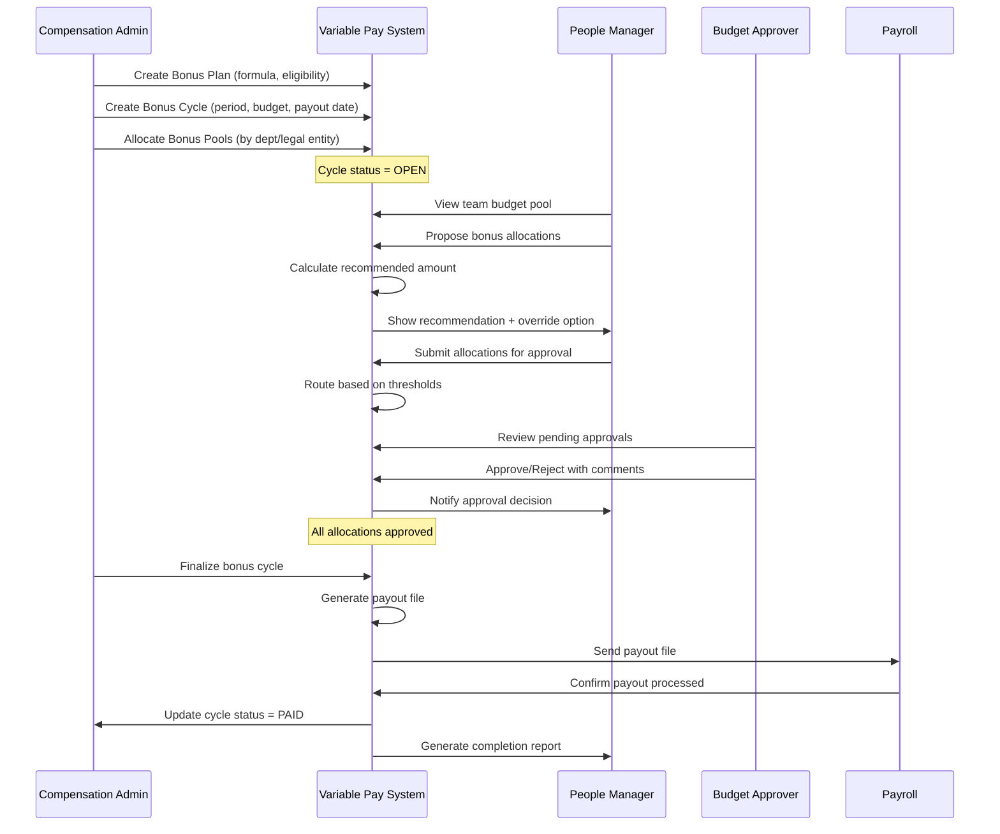
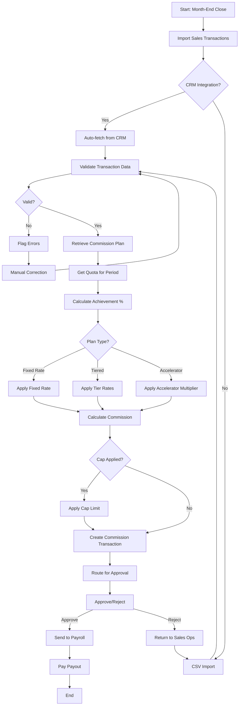

# Business Requirement Document (BRD)
# Variable Pay Sub-Module — Total Rewards

> **ODSA Reality Layer Specification**
> *"What do you truly know?" — Socrates*
> This BRD defines the business requirements for Variable Pay compensation including bonuses, commissions, and cash-based incentives. Equity compensation (RSU/Options) is explicitly Phase 2.

---

## 1. Business Context

### 1.1 Organization

xTalent is a next-generation HCM platform designed for multi-country enterprises in Southeast Asia. The Total Rewards (TR) module provides comprehensive compensation and benefits management aligned with WorldatWork's 5-pillar framework.

**Variable Pay Sub-Module** is a CORE capability within Total Rewards that manages performance-based cash compensation across:
- **Short-Term Incentives (STI)**: Annual bonus programs tied to individual and company performance
- **Long-Term Incentives (LTI)**: Multi-year cash-based retention and performance bonuses
- **Sales Commissions**: Real-time calculation and tracking for sales organizations
- **Bonus Pools & Allocation**: Department/legal entity budget management
- **13th Month Salary**: Vietnam and Philippines market practice support

**Geographic Scope**: Vietnam (VN), Thailand (TH), Indonesia (ID), Singapore (SG), Malaysia (MY), Philippines (PH)

### 1.2 Current Problem

Enterprises operating across Southeast Asia face significant challenges managing variable compensation:

| Problem Area | Current State | Impact |
|--------------|---------------|--------|
| **Fragmented Systems** | Multiple spreadsheets, legacy HRIS, manual calculations | High error rate, 2-3 weeks processing time per bonus cycle |
| **Inconsistent Rules** | Country-specific bonus practices managed ad-hoc | Compliance risk, employee dissatisfaction |
| **No Real-Time Visibility** | Commission calculations lag 30-60 days behind sales | Sales rep distrust, delayed motivation |
| **Manual Budget Tracking** | Finance uses separate Excel models | Budget overruns, reconciliation effort |
| **Missing Audit Trail** | Historical bonus decisions not documented | Pay equity analysis impossible |
| **13th Month Complexity** | Pro-rata calculations done manually | Errors in Vietnam/PH statutory-adjacent payments |

### 1.3 Business Impact

| Metric | Current State | Target State | Improvement |
|--------|---------------|--------------|-------------|
| Bonus cycle processing time | 15-20 business days | 3-5 business days | 75% reduction |
| Commission calculation accuracy | 85-90% (manual errors) | 99.5%+ | 10x error reduction |
| Budget variance | ±10-15% | ±2-3% | 5x improvement |
| Employee inquiries per cycle | 50-100 tickets | <10 tickets | 80-90% reduction |
| Audit finding resolution | 2-4 weeks | Real-time | Immediate visibility |
| Regulatory compliance | Manual tracking | Automated validation | Risk elimination |

### 1.4 Why Now

| Driver | Urgency | Business Consequence |
|--------|---------|---------------------|
| **Regional Expansion** | Q2 2026 target for TH, ID go-live | Cannot support variable pay without this module |
| **Sales Team Growth** | 200+ sales reps hired in 2025 | Commission disputes increasing 20% QoQ |
| **Pay Transparency Trend** | Employees demand bonus calculation visibility | Trust and retention at risk |
| **Vietnam 13th Month** | Expected before Tet 2026 (Jan 29, 2026) | Employee expectation, market standard |
| **IPO Preparation** | Audit-ready compensation records required | Equity story depends on accurate data |
| **Competitive Pressure** | Oracle, SAP, Workday all have mature variable pay | Talent acquisition at risk without parity |

---

## 2. Business Objectives

### SMART Objectives Summary

| ID | Objective | Metric | Target | Timeline |
|----|-----------|--------|--------|----------|
| **BO-001** | Reduce bonus cycle processing time | Cycle time (business days) | ≤5 days | Q2 2026 |
| **BO-002** | Achieve commission calculation accuracy | Accuracy rate | ≥99.5% | Q2 2026 |
| **BO-003** | Enable real-time budget visibility | Budget variance | ≤3% | Q2 2026 |
| **BO-004** | Support multi-country compliance | Countries live | 6 countries | Q3 2026 |
| **BO-005** | Provide AI-powered bonus optimization | Adoption rate | ≥80% of managers | Q4 2026 |

---

### BO-001: Reduce Bonus Cycle Processing Time

**Specific**: Reduce end-to-end bonus cycle processing from proposal to payout approval.

**Measurable**: Current state 15-20 business days → Target ≤5 business days.

**Achievable**: Automation of calculations, workflow routing, and approval chains eliminates manual handoffs.

**Relevant**: Faster bonus payout improves employee satisfaction and reduces HR administrative burden.

**Time-Bound**: Achieve by end of Q2 2026 (June 30, 2026).

| Milestone | Target Date | Success Criteria |
|-----------|-------------|------------------|
| MVP (VN only) | 2026-04-30 | STI bonus cycle completed in ≤7 days |
| Multi-country | 2026-06-30 | All 6 countries operational in ≤5 days |
| Optimization | 2026-09-30 | ≤3 days for standard bonus cycles |

---

### BO-002: Achieve Commission Calculation Accuracy

**Specific**: Eliminate manual errors in sales commission calculations through automated tiered plan processing.

**Measurable**: Current state 85-90% accuracy → Target ≥99.5% accuracy (≤0.5% dispute rate).

**Achievable**: System-enforced calculation rules, tier lookup, and quota validation eliminate arithmetic errors.

**Relevant**: Sales rep trust in commission system directly impacts motivation and retention.

**Time-Bound**: Achieve by end of Q2 2026 (June 30, 2026).

| Metric | Baseline | Target | Measurement Method |
|--------|----------|--------|-------------------|
| Calculation accuracy | 87% | ≥99.5% | (Total - Disputed) / Total |
| Dispute resolution time | 5-7 days | ≤24 hours | Average resolution SLA |
| Rep satisfaction score | 3.2/5 | ≥4.5/5 | Quarterly pulse survey |

---

### BO-003: Enable Real-Time Budget Visibility

**Specific**: Provide finance and HR leaders with real-time bonus budget utilization tracking by legal entity, department, and team.

**Measurable**: Reduce budget variance from ±10-15% to ≤3%.

**Achievable**: Real-time budget pool tracking with each allocation, automatic reserve calculation.

**Relevant**: Budget overruns require CFO approval and damage credibility; underruns indicate poor retention planning.

**Time-Bound**: Achieve by end of Q2 2026 (June 30, 2026).

| Capability | Requirement | Business Value |
|------------|-------------|----------------|
| Pool hierarchy | Company → Legal Entity → Department → Team | Granular control |
| Real-time utilization | Update on every allocation | No surprises |
| Reserve tracking | Committed but not yet allocated | Accurate available budget |
| Variance alerts | Notify at 80%, 95%, 100% thresholds | Proactive management |

---

### BO-004: Support Multi-Country Compliance

**Specific**: Configure variable pay rules to comply with local labor regulations across 6 Southeast Asian countries.

**Measurable**: 100% of countries (6/6) operational with validated compliance rules.

**Achievable**: Rule-based engine with country-specific configurations, effective dating for regulatory changes.

**Relevant**: Non-compliance creates legal liability and employee relations risk.

**Time-Bound**: Vietnam first (Q2 2026), all 6 countries by Q3 2026 (September 30, 2026).

| Country | Key Regulation | System Capability |
|---------|---------------|-------------------|
| Vietnam | 13th month salary (Tet bonus) | Pro-rata calculation, timing rule |
| Thailand | Bonus taxation (progressive) | Tax integration with payroll |
| Indonesia | THR (religious holiday allowance) | Mandatory bonus rule |
| Singapore | No statutory bonus, market practice | Flexible plan configuration |
| Malaysia | Contractual bonus enforcement | Terms validation |
| Philippines | 13th month pay (PD 851) | Statutory calculation |

---

### BO-005: Provide AI-Powered Bonus Optimization

**Specific**: Deploy AI/ML foundation to recommend optimal bonus allocations based on performance, retention risk, and pay equity.

**Measurable**: ≥80% of managers accept AI recommendations or provide documented override rationale.

**Achievable**: Phase 1 provides recommendation engine; Phase 2 adds predictive retention modeling.

**Relevant**: Managers struggle with fair distribution; AI reduces bias and improves retention outcomes.

**Time-Bound**: MVP recommendations by Q3 2026, full AI optimization by Q4 2026 (December 31, 2026).

| AI Capability | Phase | Description |
|---------------|-------|-------------|
| Performance-based recommendation | Phase 1 | Suggest allocation based on rating × target |
| Compa-ratio adjustment | Phase 1 | Adjust for pay equity within team |
| Retention risk flag | Phase 2 | Highlight high-risk employees for retention bonus |
| Market benchmark | Phase 2 | Compare to industry bonus practices |

---

## 3. Business Actors

### Actor Summary

| Actor | Role | Primary Responsibilities |
|-------|------|-------------------------|
| **Compensation Administrator** | HR Operations | Plan configuration, cycle management, compliance |
| **People Manager** | Line Management | Bonus proposals, commission oversight |
| **Budget Approver** | Finance/Director | Budget allocation, approval routing |
| **Sales Operations Manager** | Sales Operations | Commission plan setup, quota management |
| **Employee** | Individual Contributor | View allocations, dispute commissions |

---

### ACT-001: Compensation Administrator

**Actor Type**: HR Operations
**System Access**: Variable Pay Administration Console

| Responsibility | Permission | Business Rule |
|----------------|------------|---------------|
| Create bonus plans | CREATE BonusPlan | Must define formula, eligibility, multipliers |
| Configure bonus cycles | CREATE/UPDATE BonusCycle | Must link to valid plan, set dates |
| Allocate bonus pools | CREATE/UPDATE BonusPool | Must not exceed cycle budget |
| Manage plan eligibility | UPDATE EligibilityRule | Changes require approval if cycle active |
| Run compliance reports | READ all bonus data | Audit trail mandatory |
| Export payroll file | READ payout data | File format per payroll integration spec |

**Key Performance Indicators**:
- Bonus cycle setup completeness (100%)
- Compliance validation pass rate (100%)
- Payroll file accuracy (≥99.5%)

---

### ACT-002: People Manager

**Actor Type**: Line Management
**System Access**: Manager Self-Service → Variable Pay

| Responsibility | Permission | Business Rule |
|----------------|------------|---------------|
| Propose bonuses for direct reports | CREATE BonusAllocation | Must stay within team budget pool |
| Override calculated amounts | UPDATE own allocations | Overrides >10% require Director approval |
| View team budget utilization | READ BonusPool (own team) | Real-time visibility |
| Submit bonus proposals | SUBMIT BonusAllocation | Cannot submit without rationale |
| Track approval status | READ ApprovalWorkflow | Notification on status change |

**Key Performance Indicators**:
- On-time proposal submission (≥95%)
- Budget compliance (≤5% variance)
- Employee satisfaction with bonus communication (≥4.0/5)

---

### ACT-003: Budget Approver

**Actor Type**: Finance / Director Level
**System Access**: Approval Console → Variable Pay

| Responsibility | Permission | Business Rule |
|----------------|------------|---------------|
| Review bonus allocations | READ all pending approvals | Must include rationale and budget impact |
| Approve/reject allocations | UPDATE ApprovalWorkflow | Rejections require documented reason |
| Reallocate budget pools | UPDATE BonusPool | Requires Finance Director approval |
| View budget analytics | READ BudgetAnalytics | Drill-down by department, legal entity |
| Escalate exceptions | CREATE EscalationRequest | For policy violations requiring override |

**Approval Thresholds**:

| Allocation Amount (vs Target) | Approver Required |
|-------------------------------|-------------------|
| ≤100% of target | People Manager → HRBP |
| 101-125% of target | People Manager → Director → HRBP |
| 126-150% of target | People Manager → VP → CFO |
| >150% of target | CFO approval required |

---

### ACT-004: Sales Operations Manager

**Actor Type**: Sales Operations
**System Access**: Commission Administration Console

| Responsibility | Permission | Business Rule |
|----------------|------------|---------------|
| Create commission plans | CREATE CommissionPlan | Must define tiers, quotas, rates |
| Set sales quotas | CREATE/UPDATE QuotaAssignment | Must align with fiscal year targets |
| Import sales transactions | CREATE CommissionTransaction | CSV/CRM integration |
| Approve commission disputes | UPDATE CommissionDispute | Must resolve within 5 business days |
| Adjust commission rates | UPDATE CommissionTier | Changes require Finance approval |

**Key Performance Indicators**:
- Commission calculation timeliness (100% by 5th of month)
- Dispute resolution rate (≥95% within SLA)
- Sales rep satisfaction (≥4.5/5)

---

### ACT-005: Employee

**Actor Type**: Individual Contributor
**System Access**: Employee Self-Service → My Rewards

| Responsibility | Permission | Business Rule |
|----------------|------------|---------------|
| View bonus allocations | READ own BonusAllocation | Read-only after approval |
| View commission history | READ own CommissionTransaction | 24-month rolling history |
| Dispute commission | CREATE CommissionDispute | Must provide supporting documentation |
| Download bonus statement | READ/EXPORT payout statement | PDF format with company letterhead |
| Simulate bonus scenarios | READ BonusCalculator | What-if analysis (not binding) |

**Key Performance Indicators**:
- Statement view rate (≥80% within 30 days of payout)
- Dispute rate (≤5% of transactions)
- Self-service adoption (≥90% vs HR inquiries)

---

## 4. Business Rules

### Rule Summary by Category

| Category | Rule Count | Examples |
|----------|------------|----------|
| **Validation Rules** | 5 | Eligibility, data completeness, date ranges |
| **Authorization Rules** | 4 | Approval thresholds, delegation, escalation |
| **Calculation Rules** | 8 | Bonus formulas, commission tiers, pro-rata |
| **Constraint Rules** | 4 | Budget caps, duplicate prevention, timing |
| **Compliance Rules** | 4 | Country-specific, audit, tax, data retention |
| **TOTAL** | **25** | |

---

### 4.1 Validation Rules

| Rule ID | Rule Name | Description | Error Message |
|---------|-----------|-------------|---------------|
| **VR-001** | Bonus Eligibility Validation | Employee must meet all eligibility criteria before bonus allocation | "Employee [ID] is not eligible for bonus plan [PLAN_CODE]: [REASON]" |
| **VR-002** | Performance Period Completeness | Bonus cycle must have valid start and end dates with end > start | "Performance period end date must be after start date" |
| **VR-003** | Budget Pool Sufficiency | Total allocations cannot exceed available budget pool | "Allocation exceeds available budget. Available: [AMOUNT], Requested: [AMOUNT]" |
| **VR-004** | Commission Plan Assignment | Sales rep must have active commission plan before transaction processing | "No active commission plan found for employee [ID] in period [PERIOD]" |
| **VR-005** | Quota Achievement Threshold | Commission calculation requires valid quota assignment | "Quota not assigned for employee [ID] in period [PERIOD]" |

---

### 4.2 Authorization Rules

| Rule ID | Rule Name | Description | Approval Routing |
|---------|-----------|-------------|------------------|
| **AR-001** | Bonus Allocation Approval | All bonus allocations require approval based on amount thresholds | See Approval Threshold Matrix below |
| **AR-002** | Budget Reallocation Authority | Moving budget between pools requires Finance approval | Finance Director for >5% of cycle budget |
| **AR-003** | Commission Rate Change | Changes to commission tiers/rates require Finance + Legal review | CFO + Legal Counsel |
| **AR-004** | Off-Cycle Bonus Authorization | Bonuses outside defined cycles require VP+ approval | VP of Business Unit + CHRO |

**Approval Threshold Matrix**:

| Allocation Type | Threshold | Primary Approver | Secondary Approver | Final Approver |
|-----------------|-----------|------------------|--------------------|----------------|
| STI Bonus ≤100% target | Manager | HRBP | - |
| STI Bonus 101-125% target | Manager | Director | HRBP |
| STI Bonus 126-150% target | Manager | VP | CFO |
| STI Bonus >150% target | Manager | VP | CFO + CHRO |
| Commission (standard) | Auto-approved | - | - |
| Commission (manual override) | Sales Ops Manager | Finance | - |
| Sign-on bonus ≤50M VND | Hiring Manager | HRBP | - |
| Sign-on bonus >50M VND | Hiring Manager | Director | CHRO |

---

### 4.3 Calculation Rules

| Rule ID | Rule Name | Formula/Logic | Example |
|---------|-----------|---------------|---------|
| **CR-001** | STI Bonus Formula | `Bonus = Base × Target% × PerformanceMultiplier × CompanyMultiplier` | Salary 20M × 10% × 1.2 (Exceeds) × 1.0 = 2.4M |
| **CR-002** | LTI Cash Bonus Formula | `Bonus = FixedAmount × VestingPercentage × PerformanceFactor` | 100M × 33.3% (Year 1) × 1.0 = 33.3M |
| **CR-003** | 13th Month Pro-rata | `Bonus = MonthlySalary × (MonthsWorked / 12)` | 20M × (6/12) = 10M for mid-year hire |
| **CR-004** | Commission - Fixed Rate | `Commission = Revenue × FixedRate` | 1B revenue × 2% = 20M |
| **CR-005** | Commission - Tiered | `Commission = Σ(TierRevenue × TierRate)` | First 80% at 1%, next 20% at 2%, over 100% at 3% |
| **CR-006** | Commission - Accelerator | `If Achievement>100% Then Rate = BaseRate × AcceleratorMultiplier` | 120% achievement → 2% × 1.5 = 3% rate |
| **CR-007** | Commission - Cap | `Payout = Min(CalculatedCommission, CapAmount)` | Calculated 50M, Cap 40M → Payout 40M |
| **CR-008** | Pro-rata for Partial Period | `Allocation = FullAmount × (DaysEmployed / DaysInPeriod)` | 30 days employed / 90 days period = 33.3% |

**Commission Tier Structure Example**:

| Tier | Achievement % | Commission Rate | Calculation Basis |
|------|---------------|-----------------|-------------------|
| Tier 1 | 0-80% | 1.0% | Revenue × 1.0% |
| Tier 2 | 81-100% | 2.0% | Revenue × 2.0% |
| Tier 3 | 101-120% | 3.0% | Revenue × 3.0% |
| Tier 4 | >120% | 4.0% | Revenue × 4.0% |

**Performance Multiplier Table**:

| Performance Rating | Multiplier | Description |
|--------------------|------------|-------------|
| S - Outstanding | 1.5 | 150% of target bonus |
| A - Exceeds | 1.2 | 120% of target bonus |
| B - Meets | 1.0 | 100% of target bonus |
| C - Partially Meets | 0.5 | 50% of target bonus |
| D - Does Not Meet | 0.0 | No bonus |

---

### 4.4 Constraint Rules

| Rule ID | Rule Name | Constraint | Enforcement |
|---------|-----------|------------|-------------|
| **CON-001** | Budget Cap Enforcement | Total allocations ≤ Approved budget pool | Hard stop - cannot submit |
| **CR-002** | Single Active Bonus Plan | Employee can only have one active STI plan per period | System validation |
| **CR-003** | Commission Timing | Commissions calculated after month-end close (T+3 days) | Scheduled job |
| **CR-004** | Bonus Payment Timing | STI payouts only on scheduled payout dates | Date validation |

**Budget Hierarchy Constraints**:

```
Company Budget (100%)
├── Legal Entity Pools (VN, TH, ID, SG, MY, PH)
│   ├── Department Pools (Sales, Engineering, Operations, etc.)
│   │   └── Team Pools (if applicable)
│   └── Department Pools...
└── Executive Pool (C-level, VP)
```

**Constraint Logic**:
- Child pool total ≤ Parent pool allocation
- Reallocation requires available balance in source pool
- Cannot reallocate from pools with committed (pending approval) allocations

---

### 4.5 Compliance Rules

| Rule ID | Rule Name | Regulation | Requirement |
|---------|-----------|------------|-------------|
| **COMP-001** | Vietnam 13th Month | Market Practice | Pro-rata calculation, payment before Tet |
| **COMP-002** | Philippines 13th Month | PD 851 | Mandatory 13th month, formula: BasicSalary/12 |
| **COMP-003** | Indonesia THR | Law No. 13/2003 | Religious holiday allowance, 1 month salary |
| **COMP-004** | Audit Trail | All jurisdictions | 7-year retention for all bonus/commission records |
| **COMP-005** | Tax Withholding | Country-specific | Integrate with payroll for tax calculation |
| **COMP-006** | Data Privacy | PDPA (SG, MY), PIPEDA | Encrypt PII, access logging, consent tracking |

**Country-Specific Bonus Requirements**:

| Country | Requirement | System Implementation |
|---------|-------------|----------------------|
| Vietnam | 13th month expected before Tet | Configurable timing rule, pro-rata engine |
| Thailand | Bonus taxed at progressive rates | Tax integration, gross-to-net calculation |
| Indonesia | THR mandatory for all employees | Eligibility rule, automatic calculation |
| Singapore | No statutory, market-driven | Flexible plan configuration |
| Malaysia | Contractual bonus legally binding | Terms validation, enforcement |
| Philippines | 13th month by Dec 24 (PD 851) | Statutory rule, penalty calculation |

---

## 5. Out of Scope

### Phase 1 Exclusions (MVP - Q2 2026)

| Item | Description | Rationale | Phase 2 Target |
|------|-------------|-----------|----------------|
| **Equity Compensation - RSU** | Restricted Stock Unit grants, vesting, exercise tracking | Requires securities law compliance, cap table integration | Q4 2026 |
| **Equity Compensation - Options** | Stock option grants, Black-Scholes valuation, exercise window | Complex valuation, legal requirements by country | Q4 2026 |
| **Equity Compensation - ESPP** | Employee Stock Purchase Plan administration | Requires brokerage integration, Section 423 compliance (US) | Q1 2027 |
| **Deferred Compensation** | Non-qualified deferred comp (409A in US context) | Requires specialized tax treatment, trust administration | Q1 2027 |
| **Phantom Stock** | Cash-settled equity-like awards | Complex accounting, valuation requirements | Q1 2027 |
| **Profit Sharing** | Company-wide profit distribution | Requires financial close integration, complex formulas | Q1 2027 |
| **Gainsharing** | Team/department performance pools | Requires operational metrics integration | Q1 2027 |
| **Sales SPIFFs** | Short-term sales contests | Requires real-time leaderboard, contest management | Q3 2026 |
| **Channel Commissions** | Partner/reseller commission tracking | B2B partner management complexity | Q1 2027 |
| **Royalty-Based Compensation** | Revenue share with creators/inventors | Specialized legal agreements, tracking | Future |

### Equity Compensation - Phase 2 Overview

While equity compensation is **out of scope for Phase 1**, the following capabilities are planned for Phase 2:

| Capability | Description | Dependencies |
|------------|-------------|--------------|
| **Grant Management** | Create and track RSU/Option grants | Board approval workflow, cap table system |
| **Vesting Schedules** | Time-based and performance-based vesting | Equity plan document, legal compliance |
| **Exercise Processing** | Option exercise, settlement, tax withholding | Brokerage integration, tax calculation |
| **Equity Analytics** | Dilution analysis, burn rate tracking | Cap table data, scenario modeling |
| **409A Valuation** | Fair market value determination (US context) | Third-party valuation service |

**Entity Catalog Reference**: See `entity-catalog.md` section E-TR-005 (BonusPlan) and FR-TR-006 (Equity & Stock Compensation - SHOULD priority, Phase 2).

---

## 6. Assumptions & Dependencies

### 6.1 Assumptions

| ID | Assumption | Impact if Invalid | Mitigation |
|----|------------|-------------------|------------|
| **ASM-001** | Performance Management module delivers ratings by bonus cycle start | Bonus calculations cannot proceed without ratings | Manual rating import workaround, grace period |
| **ASM-002** | Payroll module accepts bonus payout files in standard format | Payout processing delayed | Define file spec early, parallel testing |
| **ASM-003** | Finance provides approved budget pools before cycle launch | Cycle cannot open for allocations | Pre-cycle budget planning workflow |
| **ASM-004** | CRM system can export sales transaction data | Commission automation blocked | CSV import fallback, manual entry |
| **ASM-005** | Exchange rates available for multi-currency calculations | Cross-border reporting inaccurate | Daily rate feed from finance system |
| **ASM-006** | Legal approves bonus plan templates before employee communication | Compliance risk, employee relations issue | Legal review workflow, version control |
| **ASM-007** | HRIS employee data (hire date, position) is accurate | Eligibility errors, incorrect calculations | Data validation before cycle launch |

### 6.2 Dependencies

| ID | Dependency | Source System | Required By | Risk Level |
|----|------------|---------------|-------------|------------|
| **DEP-001** | Employee master data | Core HR Module | MVP | HIGH |
| **DEP-002** | Performance ratings | Performance Management Module | MVP | HIGH |
| **DEP-003** | Salary data for bonus base | Core Compensation Module | MVP | HIGH |
| **DEP-004** | Budget allocation approval | Finance/ERP System | MVP | MEDIUM |
| **DEP-005** | Payout file processing | Payroll Module | MVP | HIGH |
| **DEP-006** | Sales transaction import | CRM (Salesforce, HubSpot) | MVP | MEDIUM |
| **DEP-007** | Tax calculation | Payroll/Tax Module | MVP | MEDIUM |
| **DEP-008** | Approval workflow routing | Workflow Engine | MVP | HIGH |
| **DEP-009** | Exchange rates | Finance/ERP System | Phase 2 | LOW |
| **DEP-010** | Organizational hierarchy | Core HR Module | MVP | HIGH |
| **DEP-011** | Audit logging | Audit Module | MVP | MEDIUM |
| **DEP-012** | AI/ML recommendation engine | Analytics/ML Platform | Q4 2026 | MEDIUM |

### Dependency Risk Matrix

| Risk | Probability | Impact | Mitigation Strategy |
|------|-------------|--------|---------------------|
| **Performance ratings delayed** | MEDIUM | HIGH | Buffer timeline, manual override process |
| **Payroll integration fails** | LOW | HIGH | Parallel file-based fallback, test early |
| **CRM data quality issues** | MEDIUM | MEDIUM | Data validation rules, reconciliation reports |
| **Budget changes mid-cycle** | HIGH | MEDIUM | Version control, reallocation workflow |
| **Multi-country tax complexity** | HIGH | HIGH | Country-by-country validation, local expert review |

---

## Appendix A: Bonus Workflow Diagram



---

## Appendix B: Commission Calculation Flow



---

## Appendix C: Cross-Reference Matrix

### Input Documents

| Document | Section | Relevance to BRD |
|----------|---------|------------------|
| `_research-report.md` | Section 9 (Strategic Insights) | Industry best practices, competitor analysis |
| `entity-catalog.md` | E-TR-005 (BonusPlan), E-TR-006 to E-TR-008 | Entity definitions for bonus/commission |
| `feature-catalog.md` | FR-TR-004 (Variable Pay), FR-TR-006 (Equity) | Feature requirements, priority |
| `01-functional-requirements.md` | Feature Area 2: Variable Pay | Detailed FR-TR-VAR-001 to FR-TR-VAR-015 |

### Output Traceability

| BRD Section | Maps to Feature | Maps to Entity | Maps to FR |
|-------------|-----------------|----------------|------------|
| Section 2 (Objectives) | FR-TR-004, FR-TR-006 | - | All Variable Pay FRs |
| Section 3 (Actors) | All | - | Workflow FRs |
| Section 4 (Rules) | FR-TR-004, FR-TR-010, FR-TR-011 | BonusPlan, CommissionPlan | Calculation FRs |
| Section 5 (Out of Scope) | FR-TR-006 (Equity) | - | Phase 2 features |
| Section 6 (Dependencies) | All | All | Integration FRs |

---

## Document Control

| Version | Date | Author | Change Description |
|---------|------|--------|--------------------|
| 1.0.0 | 2026-03-20 | BRD Author | Initial draft following ODSA Reality layer standard |

### Review & Approval

| Role | Name | Status | Date |
|------|------|--------|------|
| Product Owner | TBD | Pending | - |
| Architecture Review Board | TBD | Pending | - |
| HR Business Partner | TBD | Pending | - |
| Finance Representative | TBD | Pending | - |
| Legal/Compliance | TBD | Pending | - |

---

*End of Business Requirement Document - Variable Pay Sub-Module*