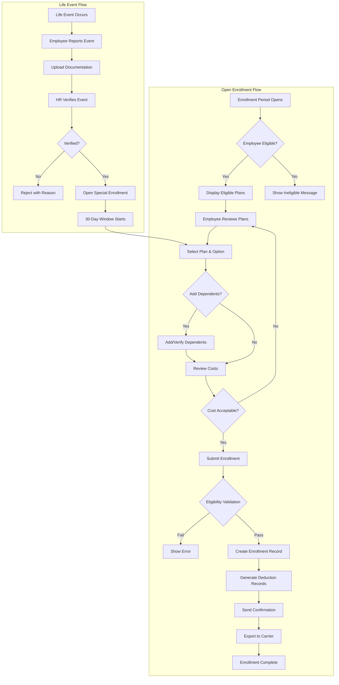

# Business Requirements Document: Benefits Sub-Module

**Document Owner**: Product Owner / HR Director
**Approval Body**: Architecture Review Board
**Strategic Value**: HIGH
**Domain Type**: CORE

---

## Table of Contents

1. [Business Context](#1-business-context)
2. [Business Objectives](#2-business-objectives)
3. [Business Actors](#3-business-actors)
4. [Business Rules](#4-business-rules)
5. [Out of Scope](#5-out-of-scope)
6. [Assumptions & Dependencies](#6-assumptions--dependencies)

---

## 1. Business Context

### 1.1 Organization Context

The Benefits sub-module is part of the Total Rewards (TR) module within the xTalent HCM platform. It serves as the central system for managing employee benefits across a multi-country Southeast Asian organization operating in 6+ countries:

| Country | Code | Primary Benefits Focus |
|---------|------|----------------------|
| Vietnam | VN | Social Insurance (BHXH/BHYT/BHTN), Health Insurance |
| Thailand | TH | Provident Fund, Health Insurance |
| Indonesia | ID | BPJS Health & Employment, Private Insurance |
| Singapore | SG | CPF, MediShield, Private Plans |
| Malaysia | MY | EPF, SOCSO, Private Insurance |
| Philippines | PH | SSS, PhilHealth, Pag-IBIG |

**Innovation Level**: Full Innovation Play
**Timeline**: Fast Track
**Key Architectural Decision**: Hybrid carrier integration (file-based for statutory, API for commercial)

### 1.2 Current Problem

Organizations across Southeast Asia face significant challenges in benefits administration:

| Problem Area | Current State | Impact |
|--------------|---------------|--------|
| **Fragmented Systems** | Benefits managed via spreadsheets, emails, and manual processes across 6+ countries | HR teams spend 40-60 hours per enrollment cycle on manual data entry and reconciliation |
| **Statutory Compliance Risk** | Each country has unique social insurance rules (BHXH in Vietnam, CPF in Singapore, EPF in Malaysia) requiring precise calculations and timely filings | Non-compliance penalties range from 5-50M VND per violation; potential criminal liability for repeated offenses |
| **Carrier Integration Gap** | Statutory carriers require file-based submissions; commercial carriers offer APIs but with no standardization | Dual integration approach needed; current manual processes create 2-4 week delays in coverage activation |
| **Employee Experience** | Employees lack visibility into benefits options, costs, and enrollment status; life events (marriage, birth) require paper forms and HR visits | 60% employee dissatisfaction with benefits transparency; 30% miss enrollment deadlines |
| **Cost Management** | No real-time visibility into employer benefit costs; premium reconciliation is manual and error-prone | 10-15% overpayment due to unreconciled terminations; inability to negotiate with carriers due to lack of data |
| **Life Events Processing** | Qualifying events (marriage, birth, adoption, divorce, death) tracked manually; enrollment windows missed | Coverage gaps for employees; compliance exposure for unprocessed qualifying events |

### 1.3 Business Impact

| Impact Category | Current State | Target State | Measurable Improvement |
|-----------------|---------------|--------------|----------------------|
| **HR Efficiency** | 40-60 hours per enrollment cycle | <10 hours per cycle | 75% reduction in manual effort |
| **Compliance** | Manual tracking, high error rate | Automated validation, audit trail | Zero compliance penalties |
| **Employee Satisfaction** | 60% dissatisfaction | >85% satisfaction | 25-point improvement |
| **Cost Accuracy** | 10-15% overpayment | <2% variance | 10%+ cost savings |
| **Coverage Activation** | 2-4 week delays | Same-day for API carriers | 95% faster activation |

### 1.4 Why Now

| Driver | Urgency | Consequence of Delay |
|--------|---------|---------------------|
| **Vietnam Social Insurance Law 2024** | Effective July 2025; pension eligibility changes to 15 years | Non-compliance risk; inability to process pensions correctly |
| **Regional Expansion** | Adding 2-3 new SEA countries in next 18 months | Manual processes don't scale; compliance risk multiplies |
| **Employee Expectations** | Modern workforce expects self-service, mobile-first experience | Talent attraction and retention impacted |
| **Cost Pressure** | Benefits represent 25-35% of total compensation cost | CFO mandate for better cost visibility and control |
| **Competitive Parity** | Oracle, SAP, Workday all offer modern benefits administration | Market positioning at risk without modern capabilities |

---

## 2. Business Objectives

### SMART Objectives Summary

| ID | Objective | Metric | Baseline | Target | Deadline |
|----|-----------|--------|----------|--------|----------|
| BO-01 | Reduce enrollment cycle time | Hours per cycle | 50 hours | <10 hours | Q3 2026 |
| BO-02 | Achieve statutory compliance | Compliance rate | 85% | 100% | Q2 2026 |
| BO-03 | Improve employee satisfaction | NPS score | -20 | +50 | Q4 2026 |
| BO-04 | Reduce premium overpayment | Variance rate | 12% | <2% | Q3 2026 |
| BO-05 | Enable multi-country operations | Countries supported | 1 (VN) | 6 | Q4 2026 |
| BO-06 | Automate life events processing | Auto-detection rate | 0% | 80% | Q3 2026 |

### Detailed SMART Objectives

#### BO-01: Enrollment Cycle Efficiency
**Objective**: Reduce benefits enrollment processing time by 80% through self-service automation.

| Aspect | Definition |
|--------|-----------|
| **Specific** | Reduce manual effort from 50 hours to <10 hours per enrollment cycle |
| **Measurable** | Track hours spent by HR on enrollment activities; system logs enrollment completion time |
| **Achievable** | Self-service portal, automated eligibility validation, carrier file auto-generation |
| **Relevant** | Directly impacts HR operational efficiency and employee experience |
| **Time-bound** | Achieve by Q3 2026 (end of fiscal year) |

#### BO-02: Statutory Compliance
**Objective**: Achieve 100% statutory benefits compliance across all 6 SEA countries.

| Aspect | Definition |
|--------|-----------|
| **Specific** | Automated validation for Vietnam BHXH/BHYT/BHTN, Singapore CPF, Malaysia EPF/SOCSO, Indonesia BPJS, Philippines SSS/PhilHealth |
| **Measurable** | Zero compliance penalties; 100% on-time filings; complete audit trail |
| **Achievable** | Rule engine with versioned country-specific regulations; effective dating |
| **Relevant** | Legal requirement; non-compliance carries financial and criminal penalties |
| **Time-bound** | Vietnam SI Law 2024 compliance by July 2025; full 6-country by Q2 2026 |

#### BO-03: Employee Experience
**Objective**: Achieve Net Promoter Score of +50 for benefits experience (from baseline of -20).

| Aspect | Definition |
|--------|-----------|
| **Specific** | Improve employee satisfaction with benefits enrollment, visibility, and life events processing |
| **Measurable** | Quarterly employee pulse surveys; system usage analytics; support ticket volume |
| **Achievable** | Mobile-first self-service, real-time cost calculator, 24/7 benefits visibility |
| **Relevant** | Employee benefits experience directly impacts talent attraction and retention |
| **Time-bound** | Baseline survey Q1 2026; +50 NPS by Q4 2026 |

#### BO-04: Cost Accuracy
**Objective**: Reduce premium overpayment from 12% to <2% through automated reconciliation.

| Aspect | Definition |
|--------|-----------|
| **Specific** | Monthly automated reconciliation of system enrollments vs. carrier invoices |
| **Measurable** | Track variance between system premiums and carrier invoices; identify unreconciled terminations |
| **Achievable** | Automated discrepancy detection, carrier integration, termination alerts |
| **Relevant** | Direct financial impact; benefits represent 25-35% of total compensation |
| **Time-bound** | Reconciliation process live Q2 2026; <2% variance by Q3 2026 |

#### BO-05: Multi-Country Enablement
**Objective**: Support benefits administration across 6 SEA countries with country-specific configurations.

| Aspect | Definition |
|--------|-----------|
| **Specific** | Vietnam, Thailand, Indonesia, Singapore, Malaysia, Philippines with localized rules |
| **Measurable** | All 6 countries configured and operational; country-specific statutory filings supported |
| **Achievable** | Configurable rule engine, country-specific eligibility profiles, localized UI |
| **Relevant** | Business expansion requires scalable benefits infrastructure |
| **Time-bound** | Vietnam Q1 2026; Singapore/Malaysia Q2 2026; Thailand/Indonesia/Philippines Q4 2026 |

#### BO-06: Life Events Automation
**Objective**: Achieve 80% auto-detection and processing of qualifying life events.

| Aspect | Definition |
|--------|-----------|
| **Specific** | Auto-detect marriage, birth, adoption from Core HR data; trigger enrollment windows automatically |
| **Measurable** | Percentage of life events detected automatically vs. manually reported; enrollment window compliance rate |
| **Achievable** | Integration with Core HR for marital status, dependent additions; event-triggered workflows |
| **Relevant** | Ensures compliance with qualifying event regulations; improves employee experience |
| **Time-bound** | Auto-detection live Q2 2026; 80% rate by Q3 2026 |

---

## 3. Business Actors

### Actor Summary

| Actor | Role | Key Responsibilities | Primary Permissions |
|-------|------|---------------------|---------------------|
| BA-01: Benefits Administrator | HR Operations | Plan configuration, enrollment management, carrier relations | Full CRUD on plans, enrollments, carrier integrations |
| BA-02: Employee | End User | Self-service enrollment, life event reporting, dependent management | Read plans; Create/Update own enrollments, dependents, life events |
| BA-03: Benefits Manager | HR Leadership | Strategy, budget oversight, compliance approval | Approve plans, budgets, exceptions; View all analytics |
| BA-04: Finance Analyst | Finance | Premium reconciliation, cost allocation, GL posting | View costs; Reconcile invoices; Export to Finance |
| BA-05: Carrier | External Partner | Receive enrollments, provide coverage, process claims | Receive EDI/file feeds; Submit claim responses (API carriers) |
| BA-06: Auditor | Compliance/External | Audit trail review, compliance verification | Read-only audit access; Generate compliance reports |
| BA-07: Manager | People Manager | Team benefits oversight, approval workflows | View team enrollment status; Approve reimbursements |
| BA-08: HRIS Integration | System | Core HR data sync, event propagation | Read/write via APIs; Event subscriptions |

### Detailed Actor Definitions

#### BA-01: Benefits Administrator

| Attribute | Description |
|-----------|-------------|
| **Role** | HR Operations Specialist responsible for day-to-day benefits administration |
| **Typical Title** | Benefits Administrator, HR Coordinator, Compensation & Benefits Specialist |
| **Goals** | Accurate plan configuration, timely enrollments, compliant filings, smooth carrier relations |
| **Pain Points** | Manual data entry, carrier reconciliation, eligibility errors, missed deadlines |

**Responsibilities**:
- Configure and maintain benefit plans, options, and eligibility rules
- Manage enrollment periods (open enrollment, new hire, qualifying events)
- Process benefit enrollments and changes
- Verify life events and dependent documentation
- Generate carrier files and manage carrier relationships
- Reconcile monthly premium invoices
- Run enrollment reports and analytics

**Permissions**:
| Resource | Create | Read | Update | Delete | Approve |
|----------|--------|------|--------|--------|---------|
| Benefit Plans | ✅ | ✅ | ✅ | ❌ | N/A |
| Benefit Options | ✅ | ✅ | ✅ | ❌ | N/A |
| Eligibility Rules | ✅ | ✅ | ✅ | ❌ | N/A |
| Enrollment Periods | ✅ | ✅ | ✅ | ✅ | N/A |
| Enrollments (all) | ✅ | ✅ | ✅ | ❌ | ✅ |
| Dependents (all) | ✅ | ✅ | ✅ | ❌ | ✅ |
| Life Events | ❌ | ✅ | ✅ | ❌ | ✅ |
| Carrier Files | ✅ | ✅ | ❌ | ❌ | N/A |
| Reimbursements | ❌ | ✅ | ✅ | ❌ | ✅ |
| Reports | ✅ | ✅ | N/A | N/A | N/A |

**Interfaces Used**:
- Benefits Administration Console
- Plan Configuration UI
- Enrollment Management Dashboard
- Carrier File Generator
- Premium Reconciliation Tool
- Compliance Reports

---

#### BA-02: Employee

| Attribute | Description |
|-----------|-------------|
| **Role** | End user who enrolls in and uses benefits |
| **Typical Title** | All employees (full-time, part-time, contract based on eligibility) |
| **Goals** | Easy enrollment, clear benefits information, quick life event processing |
| **Pain Points** | Complex forms, unclear costs, slow processing, lack of visibility |

**Responsibilities**:
- Review available benefit plans during enrollment periods
- Select coverage options and enroll in benefits
- Add and maintain dependent information
- Report qualifying life events within required timeframes
- Designate beneficiaries for life insurance and retirement plans
- Submit reimbursement requests for eligible expenses
- Review and understand total benefits value

**Permissions**:
| Resource | Create | Read | Update | Delete |
|----------|--------|------|--------|--------|
| Own Enrollments | ✅ | ✅ | ✅ (during valid periods) | ❌ |
| Own Dependents | ✅ | ✅ | ✅ | ✅ (with restrictions) |
| Own Life Events | ✅ | ✅ | ❌ | ❌ |
| Own Beneficiaries | ✅ | ✅ | ✅ | ✅ |
| Reimbursement Requests | ✅ | ✅ | ❌ | ❌ (after submission) |
| Benefits Statement | ❌ | ✅ | N/A | N/A |
| Plan Information | ❌ | ✅ | N/A | N/A |

**Interfaces Used**:
- Employee Self-Service Portal (web and mobile)
- Benefits Shopping Cart
- Life Event Wizard
- Dependent Management
- Reimbursement Submission
- Total Rewards Statement

---

#### BA-03: Benefits Manager

| Attribute | Description |
|-----------|-------------|
| **Role** | HR Leadership responsible for benefits strategy and oversight |
| **Typical Title** | Benefits Manager, Total Rewards Manager, HR Director |
| **Goals** | Strategic benefits design, cost management, compliance assurance |
| **Pain Points** | Lack of data for decision-making, compliance risks, budget overruns |

**Responsibilities**:
- Define benefits strategy aligned with total rewards philosophy
- Approve benefit plan designs and eligibility rules
- Set benefits budgets and monitor cost trends
- Approve exceptions and policy deviations
- Review compliance reports and audit findings
- Negotiate with insurance carriers and brokers
- Oversee open enrollment planning and execution

**Permissions**:
| Resource | Create | Read | Update | Delete | Approve |
|----------|--------|------|--------|--------|---------|
| Benefit Plans | ❌ | ✅ | ❌ | ❌ | ✅ |
| Benefit Programs | ✅ | ✅ | ✅ | ❌ | ✅ |
| Eligibility Rules | ❌ | ✅ | ❌ | ❌ | ✅ |
| Budgets | ✅ | ✅ | ✅ | ❌ | ✅ |
| Exceptions | ❌ | ✅ | ❌ | ❌ | ✅ |
| All Enrollments | ❌ | ✅ | ❌ | ❌ | N/A |
| Analytics Dashboards | ✅ | ✅ | N/A | N/A | N/A |
| Compliance Reports | ✅ | ✅ | N/A | N/A | N/A |

**Interfaces Used**:
- Benefits Strategy Dashboard
- Cost Analytics
- Compliance Dashboard
- Exception Approval Queue
- Carrier Management

---

#### BA-04: Finance Analyst

| Attribute | Description |
|-----------|-------------|
| **Role** | Finance team member responsible for benefits cost reconciliation |
| **Typical Title** | Finance Analyst, GL Accountant, Payroll Finance Specialist |
| **Goals** | Accurate cost allocation, timely reconciliation, clean audit |
| **Pain Points** | Manual reconciliation, cost variances, missing accruals |

**Responsibilities**:
- Reconcile monthly carrier invoices against system enrollments
- Investigate and resolve premium discrepancies
- Allocate benefit costs to cost centers and GL accounts
- Monitor benefits budget vs. actual spending
- Export financial data to ERP/Finance systems
- Support annual audit of benefit liabilities

**Permissions**:
| Resource | Create | Read | Update | Delete |
|----------|--------|------|--------|--------|
| Carrier Invoices | ✅ | ✅ | ✅ | ❌ |
| Reconciliation Records | ✅ | ✅ | ✅ | ❌ |
| Cost Reports | ✅ | ✅ | N/A | N/A |
| GL Export | ✅ | ✅ | N/A | N/A |
| All Enrollments | ❌ | ✅ | ❌ | ❌ |
| Premium Rates | ❌ | ✅ | ❌ | ❌ |

**Interfaces Used**:
- Premium Reconciliation Tool
- Cost Analytics Dashboard
- Invoice Management
- GL Export Utility

---

#### BA-05: Carrier (External Partner)

| Attribute | Description |
|-----------|-------------|
| **Role** | Insurance carrier or third-party administrator providing benefits coverage |
| **Type** | External system integration (API or file-based) |
| **Integration Pattern** | Hybrid: File-based (statutory) / API (commercial) |

**Responsibilities** (System-to-System):
- Receive enrollment data via EDI 834 or custom CSV
- Acknowledge receipt and validate enrollment data
- Return coverage confirmation and member IDs
- Provide claim adjudication data (for integrated carriers)
- Support eligibility verification queries

**Permissions** (System Access):
| Resource | Receive | Send | Query |
|----------|---------|------|-------|
| Enrollment Files | ✅ | ✅ (acknowledgment) | ❌ |
| Eligibility Queries | ❌ | ✅ (response) | ✅ |
| Claim Data | ❌ | ✅ (adjudication) | ❌ |

**Integration Methods**:
| Carrier Type | Integration | Frequency | Format |
|--------------|-------------|-----------|--------|
| **Statutory (VN BHXH, SG CPF, MY EPF)** | File Upload | Monthly | Government-specified format |
| **Commercial (Health, Life, Disability)** | API | Real-time/Daily | REST API, JSON |
| **Regional Partners** | SFTP | Daily | EDI 834 or CSV |

---

#### BA-06: Auditor

| Attribute | Description |
|-----------|-------------|
| **Role** | Internal or external auditor verifying compliance |
| **Typical Title** | Internal Auditor, External Auditor, Compliance Officer |
| **Goals** | Verify regulatory compliance, validate internal controls |
| **Needs** | Complete audit trail, immutable records, compliance reports |

**Responsibilities**:
- Review enrollment audit trails for compliance
- Verify statutory filing accuracy and timeliness
- Assess internal controls over benefits administration
- Report findings and recommend remediation
- Validate dependent eligibility verification processes

**Permissions**:
| Resource | Read | Export | Modify |
|----------|------|--------|--------|
| Audit Logs | ✅ | ✅ | ❌ |
| Enrollment History | ✅ | ✅ | ❌ |
| Compliance Reports | ✅ | ✅ | ❌ |
| Plan Configurations | ✅ | ✅ | ❌ |
| User Access Logs | ✅ | ✅ | ❌ |

**Interfaces Used**:
- Audit Trail Viewer
- Compliance Report Generator
- Access Log Reports

---

#### BA-07: Manager (People Manager)

| Attribute | Description |
|-----------|-------------|
| **Role** | People manager with oversight of team benefits |
| **Typical Title** | Manager, Director, Team Lead |
| **Goals** | Support team with benefits questions, approve reimbursements timely |
| **Needs** | Team enrollment visibility, approval queue, benefit guides |

**Responsibilities**:
- Guide team members on benefits questions
- Approve reimbursement requests within delegated authority
- Review team benefits utilization (aggregate, no PII)
- Escalate benefits issues to HR

**Permissions**:
| Resource | Create | Read | Update | Approve |
|----------|--------|------|--------|---------|
| Team Enrollments (aggregate) | ❌ | ✅ (summary only) | ❌ | N/A |
| Reimbursement Requests | ❌ | ✅ (direct reports) | ❌ | ✅ (within limits) |
| Team Benefits Reports | ❌ | ✅ | N/A | N/A |

**Interfaces Used**:
- Manager Dashboard
- Reimbursement Approval Queue
- Team Benefits Summary

---

#### BA-08: HRIS Integration (System Actor)

| Attribute | Description |
|-----------|-------------|
| **Role** | System-to-system integration for HR data |
| **Type** | Automated system integration |
| **Goals** | Maintain data consistency, propagate events |

**Responsibilities**:
- Sync employee master data (Core HR → Benefits)
- Propagate life events (marriage, birth, termination)
- Update eligibility based on job changes
- Send deduction data to Payroll

**Permissions**:
| Resource | Read | Write | Trigger |
|----------|------|-------|---------|
| Employee Data | ✅ | ❌ | N/A |
| Employment Changes | ✅ | ❌ | ✅ |
| Life Events | ✅ | ✅ | ✅ |
| Deduction Data | ✅ | ✅ | N/A |
| Eligibility Cache | ✅ | ✅ | N/A |

**Integration Points**:
| Source System | Data | Frequency |
|---------------|------|-----------|
| Core HR | Employee, Job, Employment | Real-time |
| Payroll | Deductions, Earnings | Per pay period |
| Time & Absence | Leave events | Daily |

---

## 4. Business Rules

### Business Rules Summary

| Category | Count | Rule IDs |
|----------|-------|----------|
| Validation Rules | 5 | BR-BEN-V-001 to BR-BEN-V-005 |
| Authorization Rules | 4 | BR-BEN-A-001 to BR-BEN-A-004 |
| Calculation Rules | 6 | BR-BEN-C-001 to BR-BEN-C-006 |
| Constraint Rules | 3 | BR-BEN-CT-001 to BR-BEN-CT-003 |
| Compliance Rules | 5 | BR-BEN-CO-001 to BR-BEN-CO-005 |
| **Total** | **23** | |

---

### 4.1 Validation Rules

| ID | Rule | Description | Trigger | Error Message | Source FR |
|----|------|-------------|---------|---------------|-----------|
| **BR-BEN-V-001** | Plan Code Uniqueness | Benefit plan code must be unique within legal entity | Plan creation/update | "Plan code {code} already exists for this legal entity" | FR-TR-BEN-001 |
| **BR-BEN-V-002** | Effective Date Validity | Effective start date must be <= effective end date | Plan/Option/Period save | "Effective start date must be before or equal to end date" | FR-TR-BEN-001 |
| **BR-BEN-V-003** | Pay Range Validation | Min salary < Mid salary < Max salary | Pay range creation | "Salary range must follow: Min < Mid < Max" | FR-TR-BEN-002 |
| **BR-BEN-V-004** | Dependent Age Eligibility | Child dependents must be under age limit (21 VN, 26 US/SG) | Dependent add/update | "Dependent exceeds maximum age ({age} > {limit}) for relationship type {type}" | FR-TR-BEN-006 |
| **BR-BEN-V-005** | Enrollment Period Conflict | Employee cannot have overlapping enrollments in same plan | Enrollment submission | "You already have an active enrollment in this plan for period {period}" | FR-TR-BEN-004 |

**Detailed Specifications**:

#### BR-BEN-V-001: Plan Code Uniqueness
```yaml
Rule: "Benefit plan code must be unique within legal entity"
Trigger: On create or update of BenefitPlan
Validation:
  - Query: SELECT COUNT(*) FROM BenefitPlan WHERE plan_code = {code} AND legal_entity_id = {entity_id} AND id != {current_id}
  - Condition: Result must be 0
  - Scope: Unique within legal entity, not global
Error: "Plan code '{code}' already exists for legal entity {entity_name}"
Severity: ERROR (block save)
Reference: FR-TR-BEN-001
```

#### BR-BEN-V-002: Effective Date Validity
```yaml
Rule: "Effective start date must be <= effective end date"
Trigger: On save of BenefitPlan, BenefitOption, EnrollmentPeriod
Validation:
  - Condition: effective_start_date <= effective_end_date OR effective_end_date IS NULL
  - Exception: End date can be NULL for ongoing plans
Error: "Effective start date ({start}) must be before or equal to end date ({end})"
Severity: ERROR (block save)
Reference: FR-TR-BEN-001, FR-TR-BEN-002, FR-TR-BEN-003
```

#### BR-BEN-V-003: Pay Range Validation
```yaml
Rule: "Salary range must follow: Min < Mid < Max"
Trigger: On create or update of PayRange (for benefit premium tiers)
Validation:
  - Condition: min_amount < mid_amount AND mid_amount < max_amount
  - All amounts must be positive
Error: "Salary range must satisfy: Min ({min}) < Mid ({mid}) < Max ({max})"
Severity: ERROR (block save)
Reference: FR-TR-BEN-002
```

#### BR-BEN-V-004: Dependent Age Eligibility
```yaml
Rule: "Child dependents must be under maximum age for relationship type"
Trigger: On add or update of EmployeeDependent
Validation:
  - Calculate age from date_of_birth
  - Apply country-specific limits:
    - Vietnam: CHILD < 21 years
    - Singapore/US: CHILD < 26 years
    - Student extension: Up to 26 with proof of enrollment
    - Disabled: No age limit with medical certification
Error: "Dependent exceeds maximum age ({calculated_age} > {limit}) for relationship type {relationship}"
Severity: ERROR (block save)
Warning: "Student status verification required for dependents age 18-26"
Reference: FR-TR-BEN-006, FR-TR-BEN-007
```

#### BR-BEN-V-005: Enrollment Period Conflict
```yaml
Rule: "Employee cannot have overlapping active enrollments in the same plan"
Trigger: On enrollment submission
Validation:
  - Query existing enrollments for employee + plan
  - Check for status IN ('ACTIVE', 'PENDING')
  - Check for date overlap: new.effective_date BETWEEN existing.effective_start AND existing.effective_end
Error: "You already have an active enrollment in {plan_name} for period {period}. Current enrollment ends {end_date}."
Severity: ERROR (block save)
Reference: FR-TR-BEN-004
```

---

### 4.2 Authorization Rules

| ID | Rule | Description | Actor | Permission | Source FR |
|----|------|-------------|-------|------------|-----------|
| **BR-BEN-A-001** | Plan Modification Authorization | Only Benefits Administrators and Benefits Managers can create/modify benefit plans | BA-01, BA-03 | Create, Update, Delete (soft) | FR-TR-BEN-001 |
| **BR-BEN-A-002** | Self-Service Enrollment | Employees can only enroll themselves during valid enrollment periods | BA-02 | Create (own enrollments only, time-restricted) | FR-TR-BEN-004 |
| **BR-BEN-A-003** | Dependent Data Access | Employees can only view/edit their own dependents; HR can view all | BA-02, BA-01 | CRUD (own) / Read (all for HR) | FR-TR-BEN-006 |
| **BR-BEN-A-004** | Reimbursement Approval | Managers can approve reimbursements up to delegated limit; above requires HR | BA-07, BA-01 | Approve (within limits) | FR-TR-BEN-011 |

**Detailed Specifications**:

#### BR-BEN-A-001: Plan Modification Authorization
```yaml
Rule: "Only Benefits Administrators and Benefits Managers can create/modify benefit plans"
Trigger: On attempt to create, update, or delete BenefitPlan
Authorization:
  - Allowed Roles: [Benefits Administrator, Benefits Manager]
  - Required Permission: benefits.plans.manage
  - Check: User has role in context of plan's legal entity
Error: "You do not have permission to modify benefit plans. Contact your Benefits Administrator."
Severity: ERROR (block action)
Audit: Log all plan modification attempts
Reference: FR-TR-BEN-001
```

#### BR-BEN-A-002: Self-Service Enrollment
```yaml
Rule: "Employees can only enroll themselves during valid enrollment periods"
Trigger: On enrollment submission by employee
Authorization:
  - Allowed Actor: Employee (self only)
  - Time Restriction: Enrollment period status must be 'OPEN'
  - Scope: Employee's own enrollments only
  - Exception: Life event-triggered enrollments allowed within 30 days of event
Error: "Enrollment is not currently open. Next open enrollment: {date}. If you have a qualifying life event, please report it first."
Severity: ERROR (block action)
Reference: FR-TR-BEN-003, FR-TR-BEN-004, FR-TR-BEN-008
```

#### BR-BEN-A-003: Dependent Data Access
```yaml
Rule: "Employees can only view/edit their own dependents; HR has full access"
Trigger: On any access to EmployeeDependent records
Authorization:
  - Employee (BA-02): CRUD on dependents where employee_id = current_user_id
  - Benefits Admin (BA-01): Full CRUD on all dependents
  - Manager (BA-07): No access to dependent PII
  - Audit: All access logged
Error: "You can only access your own dependent information."
Severity: ERROR (block access)
Data Classification: HIGH PII (requires encryption at rest)
Reference: FR-TR-BEN-006
```

#### BR-BEN-A-004: Reimbursement Approval
```yaml
Rule: "Managers can approve reimbursements up to delegated limit; above requires HR approval"
Trigger: On reimbursement approval action
Authorization:
  - Manager (BA-07): Approve if amount <= manager.delegation_limit (default: 5M VND)
  - Benefits Admin (BA-01): Approve any amount
  - Hierarchy: Route to next level if exceeds current approver's limit
  - Conflict: Manager cannot approve own reimbursement
Error: "This amount exceeds your approval limit ({limit}). The request will be routed to {next_approver}."
Severity: WARNING (reroute)
Reference: FR-TR-BEN-011
```

---

### 4.3 Calculation Rules

| ID | Rule | Description | Formula | Country | Source FR |
|----|------|-------------|---------|---------|-----------|
| **BR-BEN-C-001** | Premium Total Calculation | Total premium = employee cost + employer cost | `total = employee_cost + employer_cost` | All | FR-TR-BEN-002 |
| **BR-BEN-C-002** | Vietnam Social Insurance | BHXH/BHYT/BHTN calculation with salary cap | See detailed spec below | VN | FR-TR-037 |
| **BR-BEN-C-003** | Pro-Rata Premium | Premiums prorated for mid-period enrollment | `premium = full_premium * (remaining_days / period_days)` | All | FR-TR-BEN-003 |
| **BR-BEN-C-004** | Flex Credit Allocation | Flex credits allocated based on grade and employment type | `credits = base_credits + grade_multiplier + status_bonus` | All | FR-TR-017 |
| **BR-BEN-C-005** | Reimbursement Limit | Annual reimbursement cannot exceed configured limit | `YTD + current <= annual_limit` | All | FR-TR-BEN-010 |
| **BR-BEN-C-006** | Beneficiary Percentage | Primary and contingent beneficiaries must each sum to 100% | `SUM(primary_pct) = 100; SUM(contingent_pct) = 100` | All | FR-TR-BEN-009 |

**Detailed Specifications**:

#### BR-BEN-C-001: Premium Total Calculation
```yaml
Rule: "Total premium = employee cost + employer cost"
Trigger: On benefit option save and premium display
Formula:
  total_premium_per_period = employee_cost_per_period + employer_cost_per_period
  employee_annual = employee_cost_per_period * periods_per_year
  employer_annual = employer_cost_per_period * periods_per_year
Application:
  - Display in shopping cart: Show both employee and employer portions
  - Total Rewards Statement: Show employer portion as benefit value
Validation: Both costs must be non-negative
Reference: FR-TR-BEN-002
```

#### BR-BEN-C-002: Vietnam Social Insurance Calculation
```yaml
Rule: "Vietnam SI contributions calculated per statutory rates with salary cap"
Trigger: On payroll processing and SI filing
Country: Vietnam
Effective: July 2025 (SI Law 2024)

Rates:
  BHXH (Pension):
    Employer: 17.5%
    Employee: 8%
  BHYT (Health):
    Employer: 3%
    Employee: 1.5%
  BHTN (Unemployment):
    Employer: 1%
    Employee: 1%

Salary Cap:
  Maximum contributory salary: 20 x statutory minimum wage
  Minimum contributory salary: Regional minimum wage (4 regions)

Formula:
  contributory_salary = MIN(gross_salary, minimum_wage_region_cap * 20)
  bhxh_employer = contributory_salary * 0.175
  bhxh_employee = contributory_salary * 0.08
  bhyt_employer = contributory_salary * 0.03
  bhyt_employee = contributory_salary * 0.015
  bhtn_employer = contributory_salary * 0.01
  bhtn_employee = contributory_salary * 0.01

  total_employer = bhxh_employer + bhyt_employer + bhtn_employer
  total_employee = bhxh_employee + bhyt_employee + bhtn_employee

Pension Eligibility (SI Law 2024):
  Minimum contribution period: 15 years (changed from 20 years)
  Effective date: July 1, 2025

Versioning:
  - Rules are versioned with effective dates
  - Historical calculations use rules in effect at time of calculation
Reference: FR-TR-037, Research Report (Regulatory Matrix)
```

#### BR-BEN-C-003: Pro-Rata Premium Calculation
```yaml
Rule: "Premiums are prorated for mid-period enrollments"
Trigger: On enrollment with effective date mid-period
Formula:
  remaining_days = coverage_end_date - enrollment_effective_date + 1
  period_days = coverage_end_date - coverage_start_date + 1
  pro_rata_factor = remaining_days / period_days
  employee_premium = base_employee_premium * pro_rata_factor
  employer_premium = base_employer_premium * pro_rata_factor

Application:
  - New hire enrollments mid-month
  - Life event enrollments with retroactive effective date
  - Termination mid-period
Rounding: Round to 2 decimal places (currency)
Reference: FR-TR-BEN-003
```

#### BR-BEN-C-004: Flex Credit Allocation
```yaml
Rule: "Flex credits allocated based on grade, employment type, and tenure"
Trigger: On employee eligibility determination for flex benefit programs
Formula:
  base_credits = configuration.by_country[country_code].base_amount
  grade_multiplier = configuration.by_grade[grade_code].multiplier
  tenure_bonus = MIN(years_of_service, 20) * annual_increment
  employment_factor = configuration.by_employment_type[emp_type].factor

  total_flex_credits = (base_credits + tenure_bonus) * grade_multiplier * employment_factor

Tiers:
  - Executive (G10+): 3.0x multiplier
  - Senior Management (G7-G9): 2.0x multiplier
  - Management (G4-G6): 1.5x multiplier
  - Individual Contributor (G1-G3): 1.0x multiplier
  - Full-time: 1.0x factor
  - Part-time: 0.5x factor
  - Contract: 0.0x (not eligible)

Tenure Bonus:
  - 100 credits per year of service
  - Maximum 20 years counted
Reference: FR-TR-017
```

#### BR-BEN-C-005: Reimbursement Limit Enforcement
```yaml
Rule: "Annual reimbursement cannot exceed configured annual limit"
Trigger: On reimbursement request submission and approval
Formula:
  ytd_approved = SUM(all approved reimbursements in plan year)
  remaining_limit = annual_limit - ytd_approved
  available = MAX(0, remaining_limit)

  IF request_amount <= available:
    Allow submission
  ELSE:
    Error: "Request amount ({amount}) exceeds remaining annual limit ({available})"

Limit Configuration:
  - By reimbursement type (Medical, Wellness, Education)
  - By employee grade/level
  - By employment type
Reset: Annual limits reset on plan year start date (Jan 1 or custom)
Reference: FR-TR-BEN-010, FR-TR-BEN-011
```

#### BR-BEN-C-006: Beneficiary Percentage Validation
```yaml
Rule: "Primary and contingent beneficiaries must each sum to 100%"
Trigger: On beneficiary designation save
Formula:
  primary_total = SUM(beneficiary.allocation_pct WHERE type = 'PRIMARY')
  contingent_total = SUM(beneficiary.allocation_pct WHERE type = 'CONTINGENT')

Validation:
  - IF primary_total EXISTS: primary_total MUST EQUAL 100
  - IF contingent_total EXISTS: contingent_total MUST EQUAL 100
  - Each beneficiary: 0 < allocation_pct <= 100
  - Minimum 1 PRIMARY beneficiary required

Error:
  - "Primary beneficiaries must total 100%. Current total: {primary_total}%"
  - "Contingent beneficiaries must total 100%. Current total: {contingent_total}%"
Reference: FR-TR-BEN-009
```

---

### 4.4 Constraint Rules

| ID | Rule | Description | Constraint | Violation Handling | Source FR |
|----|------|-------------|------------|-------------------|-----------|
| **BR-BEN-CT-001** | One Active Enrollment Per Plan | Employee cannot have multiple active enrollments in same plan | One-to-one per plan | Block new enrollment; require termination of existing | FR-TR-BEN-004 |
| **BR-BEN-CT-002** | Life Event Reporting Window | Life events must be reported within 30 days of event | Time-based constraint | Reject late submissions; require manager escalation | FR-TR-BEN-008 |
| **BR-BEN-CT-003** | Waiver Renewal Requirement | Waived benefits must be renewed annually | Annual requirement | Auto-enroll in default plan if waiver not renewed | FR-TR-BEN-005 |

**Detailed Specifications**:

#### BR-BEN-CT-001: One Active Enrollment Per Plan
```yaml
Rule: "Employee can have only one active enrollment per benefit plan"
Constraint:
  - For each plan: MAX(1) active enrollment where status IN ('ACTIVE', 'PENDING')
  - Exception: Employee can have historical (terminated) enrollments
Enforcement:
  - On new enrollment: Check for existing active enrollment
  - If exists: Require employee to terminate existing OR block new enrollment
  - Change scenario: Use amendment/change process, not new enrollment
Error: "You already have an active enrollment in {plan_name}. To make changes, please modify your existing enrollment or wait for the next enrollment period."
Reference: FR-TR-BEN-004
```

#### BR-BEN-CT-002: Life Event Reporting Window
```yaml
Rule: "Qualifying life events must be reported within 30 days of occurrence"
Constraint:
  - Trigger: Life event occurs (event_date)
  - Deadline: event_date + 30 days
  - Report date: Must be <= deadline
Enforcement:
  - System calculates deadline on event creation
  - Notification sent at day 20, day 25, day 28
  - After day 30: Event status = 'EXPIRED'
  - Late submission: Requires Benefits Manager approval
Violation Handling:
  - Status: REJECTED (expired)
  - Escalation: "This life event was reported after the 30-day deadline. Approval from Benefits Manager required."
  - Audit: Log all late submissions and approvals
Reference: FR-TR-BEN-008
```

#### BR-BEN-CT-003: Waiver Renewal Requirement
```yaml
Rule: "Waived benefits must be renewed annually during open enrollment"
Constraint:
  - Waiver status: WAIVED
  - Validity: Current plan year only
  - Renewal deadline: End of open enrollment period
Enforcement:
  - Reminder at open enrollment start: "You have waived {plan_name}. Renew your waiver or enroll."
  - Deadline: If no action by enrollment end, auto-enroll in default plan
  - Auto-enrollment: Default = Employee Only tier, lowest cost option
Notification:
  - Email at open enrollment start
  - Email 7 days before deadline
  - In-app notification throughout
Rationale: Ensures intentional waiver; prevents accidental loss of coverage
Reference: FR-TR-BEN-005
```

---

### 4.5 Compliance Rules

| ID | Rule | Description | Country | Regulatory Source | Penalty | Source FR |
|----|------|-------------|---------|-------------------|---------|-----------|
| **BR-BEN-CO-001** | Vietnam SI Law 2024 | Pension eligibility at 15 years; updated SI rates | VN | Social Insurance Law 2024 (effective Jul 2025) | Criminal liability for willful non-compliance | FR-TR-037 |
| **BR-BEN-CO-002** | Vietnam Regional Minimum Wage | Salary validation against 4-region minimum wage | VN | Labor Code 2019, Annual Decree | 5-50M VND per violation | FR-TR-036 |
| **BR-BEN-CO-003** | Singapore CPF Contribution | Mandatory CPF for citizens/PR; tiered rates by age | SG | CPF Act | Penalty + interest on arrears | Local config |
| **BR-BEN-CO-004** | Malaysia EPF/SOCSO | Employer and employee contributions; salary thresholds | MY | EPF Act 1991, SOCSO Act 1969 | Fine up to 10K MYR, imprisonment | Local config |
| **BR-BEN-CO-005** | Dependent Eligibility Verification | Annual verification required; ineligible dependents must be removed | All | Carrier contracts, fraud prevention | Coverage denial, fraud investigation | FR-TR-BEN-007 |

**Detailed Specifications**:

#### BR-BEN-CO-001: Vietnam Social Insurance Law 2024
```yaml
Rule: "Compliance with Vietnam Social Insurance Law 2024, effective July 1, 2025"
Country: Vietnam
Regulatory Source: Socialist Republic of Vietnam Social Insurance Law 2024
Effective Date: July 1, 2025

Key Changes:
  1. Pension Eligibility: Minimum 15 years contribution (changed from 20 years)
  2. SI Rates (unchanged but codified):
     - BHXH: 17.5% employer + 8% employee
     - BHYT: 3% employer + 1.5% employee
     - BHTN: 1% employer + 1% employee
  3. Salary Cap: 20x statutory minimum wage

Compliance Requirements:
  - System must calculate SI using rates in effect on calculation date
  - System must track contribution years for pension eligibility
  - System must generate monthly SI filing reports
  - System must maintain audit trail of all SI calculations

Versioning:
  - Rule version: 2024.1 (effective 2025-07-01)
  - Historical calculations: Use version active on calculation date

Penalties:
  - Non-compliance: 5-50M VND per occurrence
  - Willful evasion: Criminal investigation

Implementation:
  - Effective dating on all SI rate tables
  - Contribution year tracking per employee
  - Pension eligibility calculator
Reference: FR-TR-037, Research Report (Regulatory Matrix)
```

#### BR-BEN-CO-002: Vietnam Regional Minimum Wage
```yaml
Rule: "Salary must meet or exceed regional minimum wage"
Country: Vietnam
Regulatory Source: Labor Code 2019, Government Decree on Minimum Wage
Regions:
  - Region I (Urban Hanoi/HCMC): 4,680,000 VND
  - Region II (Suburban Hanoi/HCMC): 4,160,000 VND
  - Region III (Provincial cities): 3,640,000 VND
  - Region IV (Rural areas): 3,250,000 VND

Additional Requirements:
  - Trained worker premium: +7% minimum for certified skills
  - Annual adjustment: Government issues new rates each year

Validation:
  - On salary assignment: gross_salary >= regional_minimum[location]
  - If has_skill_certificate: gross_salary >= regional_minimum[location] * 1.07

Penalty:
  - Per violation: 5-50M VND
  - Per affected employee: Separate violation

Implementation:
  - Configurable minimum wage table by region
  - Effective dating for annual updates
  - Validation on CompensationAssignment
Reference: FR-TR-036, Research Report (Regulatory Matrix)
```

#### BR-BEN-CO-003: Singapore CPF Contribution
```yaml
Rule: "Mandatory CPF contributions for Singapore citizens and Permanent Residents"
Country: Singapore
Regulatory Source: Central Provident Fund Act

Applicability:
  - Singapore Citizens: Mandatory
  - Permanent Residents (PR): Mandatory (different rates)
  - Employment Pass/Work Permit: Not applicable

Rate Structure (by employee age):
  Age <= 55:
    Employer: 17%
    Employee: 20%
  Age 55-60:
    Employer: 15%
    Employee: 15%
  Age 60-65:
    Employer: 11.5%
    Employee: 7.5%
  Age >= 65:
    Employer: 9%
    Employee: 5%

Salary Ceiling:
  - Ordinary Wage: SGD 6,800/month (subject to CPF)
  - Additional Wage: SGD 102,000/year

Implementation:
  - Citizenship/PR status tracking
  - Age-banded rate tables
  - Monthly CPF submission file generation
Reference: Local configuration (SEA expansion)
```

#### BR-BEN-CO-004: Malaysia EPF/SOCSO
```yaml
Rule: "Mandatory EPF and SOCSO contributions for Malaysian employees"
Country: Malaysia
Regulatory Source: Employees Provident Fund Act 1991, SOCSO Act 1969

EPF (Employees Provident Fund):
  - Employee (Age < 60): 11% of salary (can opt for 9%)
  - Employer (Age < 60): 12-13% of salary (based on salary threshold)
  - Employee (Age >= 60): 0% (optional)
  - Employer (Age >= 60): 6.5%

SOCSO (Social Security):
  - Employee: 0.5% of salary (capped at RM59.80/month)
  - Employer: 1.25% of salary (capped at RM149.50/month)
  - Salary ceiling: RM5,000/month

EIS (Employment Insurance System):
  - Employee: 0.2% of salary
  - Employer: 0.2% of salary
  - Salary ceiling: RM5,000/month

Implementation:
  - Age-banded EPF rates
  - Monthly submission file (CP39, SOCSO)
  - Annual EPF reconciliation (EA form)
Reference: Local configuration (SEA expansion)
```

#### BR-BEN-CO-005: Dependent Eligibility Verification
```yaml
Rule: "Annual verification of dependent eligibility required"
Country: All (carrier contract requirement)
Regulatory Source: Insurance carrier contracts, fraud prevention regulations

Requirements:
  - Annual verification cycle for all covered dependents
  - Documentation required:
    - Spouse: Marriage certificate
    - Children: Birth certificate, student status (if 18-26)
    - Disabled dependents: Medical certification
  - Verification deadline: 60 days from notification
  - Consequence of non-verification: Coverage termination

Process:
  1. HR initiates annual verification
  2. System notifies all employees with dependents (60-day notice)
  3. Employee uploads documents
  4. HR reviews and approves/rejects
  5. Unverified dependents: Coverage ends, premiums adjusted

Fraud Prevention:
  - Audit trail of all verifications
  - Flag suspicious patterns (same document for multiple employees)
  - Annual attestation: "All dependent information is accurate"

Penalty:
  - Coverage denial for claims on ineligible dependents
  - Potential fraud investigation for intentional misrepresentation
Reference: FR-TR-BEN-007, FR-TR-BEN-016
```

---

## 5. Out of Scope

### Explicit Exclusions

| ID | Exclusion | Rationale | Handled By |
|----|-----------|-----------|------------|
| **OOS-01** | **Insurance Claims Adjudication** | Complex carrier-specific workflows requiring specialized claims engine | Insurance carrier systems |
| **OOS-02** | **Payroll Tax Calculation** | Requires specialized tax engine with real-time regulatory updates | Payroll Module (PY) |
| **OOS-03** | **Government Tax Filing** | Legal requirement for specialized tax filing software; varies by country | External tax filing partners |
| **OOS-04** | **Full Wellness Platform** | Specialized health technology beyond HCM core competency | Third-party wellness integrations (e.g., Virgin Pulse, Fitbit) |
| **OOS-05** | **Financial Advisory Services** | Requires financial advisory licensing; regulated activity | External financial partners |
| **OOS-06** | **Healthcare Provider Network Management** | Carrier-specific provider networks; requires specialized credentialing | Insurance carriers |
| **OOS-07** | **Prescription Drug Management** | Specialized pharmacy benefit management (PBM) systems | PBM vendors (e.g., Express Scripts) |
| **OOS-08** | **Flexible Spending Account (FSA) Administration** | Complex IRS compliance rules (US-specific); requires specialized FSA platform | Third-party FSA administrators |
| **OOS-09** | **Health Savings Account (HSA) Management** | Requires banking partnerships; regulated financial product | HSA custodians (e.g., HSA Bank) |
| **OOS-10** | **Retirement Plan Investment Management** | Requires investment advisory licensing; regulated financial product | 401(k) providers, fund managers |
| **OOS-11** | **Employee Assistance Program (EAP) Counseling** | Requires licensed counselors; confidential mental health services | EAP providers (e.g., ComPsych) |
| **OOS-12** | **International Benefits (outside SEA 6)** | Initial scope limited to Vietnam, Thailand, Indonesia, Singapore, Malaysia, Philippines | Future phase expansion |

### Scope Boundary Statement

> **Rule**: If a feature is not explicitly listed in the Feature Catalog (FR-TR-010 through FR-TR-018) or is listed in this Out of Scope section, it is **out of scope** for the Benefits sub-module MVP.

### Deferred to Future Phases

| Feature | Current Phase | Future Phase | Reason for Deferral |
|---------|---------------|--------------|---------------------|
| **COBRA Administration** | Out (US-specific) | Not planned | Not applicable to SEA focus |
| **HIPAA Compliance** | Out (US-specific) | Not planned | Not applicable to SEA focus |
| **FSA/HSA Integration** | Out | Phase 2 (if US expansion) | Requires US market entry |
| **Advanced Carrier API Network** | Basic API only | Phase 3 | Requires carrier partnerships |
| **AI-Powered Benefits Recommendations** | Basic rules engine | Phase 2 | ML model development needed |
| **Benefits Marketplace** | Not included | Phase 3 | Requires vendor ecosystem |

---

## 6. Assumptions & Dependencies

### 6.1 Assumptions

| ID | Assumption | Impact if Invalid | Mitigation |
|----|------------|-------------------|------------|
| **A-01** | **Carrier Integration Feasibility**: At least 50% of commercial carriers in target countries offer API integration capabilities | If <50%: Higher reliance on file-based integration; increased manual reconciliation effort | Early carrier technical assessment; fallback to file-based for all |
| **A-02** | **Core HR Data Quality**: Employee master data (employment type, job grade, location) is accurate and kept current | If invalid: Eligibility errors; compliance violations | Data quality dashboard; automated validation on Core HR updates |
| **A-03** | **Regulatory Stability**: No major benefits law changes in target countries during implementation (Q1-Q4 2026) | If invalid: Re-work required; timeline impact | Modular rule engine; regulatory monitoring; buffer in timeline |
| **A-04** | **Employee Digital Adoption**: 80%+ employees will adopt self-service portal within first enrollment cycle | If <80%: Increased HR support workload; reduced ROI | Change management program; training; mobile-first UX |
| **A-05** | **Single Sign-On (SSO) Availability**: Corporate SSO available for seamless employee authentication | If invalid: Additional authentication development needed | Early integration planning; fallback to local auth |
| **A-06** | **Payroll Integration**: Payroll module can consume benefit deduction data and apply to payroll runs | If invalid: Manual payroll entry required; reconciliation burden | Early API contract definition; integration testing |
| **A-07** | **Statutory File Format Stability**: Government file formats for statutory filings remain stable | If invalid: File generator rework required | Configurable file templates; early validation with authorities |

### 6.2 Dependencies

| ID | Dependency | Type | Criticality | Owner | Status |
|----|------------|------|-------------|-------|--------|
| **D-01** | **Core HR Module: Employee Master Data** | Upstream System | CRITICAL | Core HR Team | In Development |
| **D-02** | **Core HR Module: Employment Changes** | Upstream System | CRITICAL | Core HR Team | In Development |
| **D-03** | **Payroll Module: Deduction Processing** | Downstream System | CRITICAL | Payroll Team | Planned Q2 2026 |
| **D-04** | **Organization Module: Legal Entity, Department, Cost Center** | Upstream System | HIGH | Core HR Team | Available |
| **D-05** | **Time & Absence Module: Leave Events** | Upstream System | MEDIUM | T&A Team | Planned Q3 2026 |
| **D-06** | **Finance Module: GL Posting, Invoice Reconciliation** | Downstream System | HIGH | Finance Team | Available |
| **D-07** | **SSO/Identity Provider: Employee Authentication** | Infrastructure | HIGH | IT Infrastructure | Available |
| **D-08** | **Document Management: Dependent Document Storage** | Infrastructure | HIGH | IT Infrastructure | Available |
| **D-09** | **Email/SMS Gateway: Notifications** | Infrastructure | MEDIUM | IT Infrastructure | Available |
| **D-10** | **Carrier API Integration: Commercial Insurance APIs** | External Partner | HIGH | Benefits Team | In Negotiation |
| **D-11** | **Statutory Filing Portals: Government submission systems** | External Partner | CRITICAL | Compliance Team | Available (country-specific) |
| **D-12** | **Data Warehouse: Benefits Analytics** | Downstream System | LOW | Analytics Team | Planned Q4 2026 |

### Dependency Details

#### D-01: Core HR Module - Employee Master Data
```yaml
Type: Upstream System Dependency
Criticality: CRITICAL
Provider: Core HR Module
Consumer: Benefits Module

Data Elements:
  - Employee ID (unique identifier)
  - Legal Entity
  - Employment Type (Full-time, Part-time, Contract)
  - Job Grade/Level
  - Department
  - Location (for regional minimum wage)
  - Hire Date
  - Termination Date (if applicable)
  - Citizenship/PR Status (for CPF, etc.)

Integration Pattern:
  - Real-time sync via event bus
  - Employee create/update events trigger Benefits eligibility cache refresh
  - Termination event triggers benefits termination workflow

Risk:
  - If Core HR data is inaccurate, Benefits eligibility will be incorrect
  - Mitigation: Validation on both systems; reconciliation reports

Status: In Development (Core HR Team)
Target Availability: Q1 2026
```

#### D-02: Core HR Module - Employment Changes
```yaml
Type: Upstream System Dependency
Criticality: CRITICAL
Provider: Core HR Module
Consumer: Benefits Module

Events:
  - Job Change (promotion, transfer, demotion)
  - Location Change (affects regional minimum wage)
  - Employment Type Change (FT to PT, etc.)
  - Termination (voluntary, involuntary, retirement)
  - Leave of Absence (affects benefits eligibility)

Integration Pattern:
  - Event-driven: Core HR publishes employment change events
  - Benefits subscribes and processes:
    - Eligibility re-evaluation
    - Qualifying life event creation (if applicable)
    - Enrollment change window triggering

Risk:
  - Missed events lead to eligibility errors
  - Mitigation: Event audit trail; daily reconciliation

Status: In Development (Core HR Team)
Target Availability: Q1 2026
```

#### D-03: Payroll Module - Deduction Processing
```yaml
Type: Downstream System Dependency
Criticality: CRITICAL
Provider: Benefits Module
Consumer: Payroll Module

Data Elements:
  - Employee ID
  - Deduction Code (benefit type)
  - Deduction Amount (employee portion)
  - Employer Contribution Amount
  - Pre-tax/Post-tax Flag
  - Effective Date
  - End Date (if applicable)

Integration Pattern:
  - Per pay period: Benefits exports active deductions
  - Payroll imports and applies to payroll calculation
  - Reconciliation: Payroll confirms deductions applied

Risk:
  - If integration fails, employees may not receive correct deductions
  - Mitigation: Manual export/import fallback; reconciliation reports

Status: Planned Q2 2026 (Payroll Team)
Target Availability: Q2 2026
```

#### D-10: Carrier API Integration
```yaml
Type: External Partner Dependency
Criticality: HIGH
Provider: Commercial Insurance Carriers
Consumer: Benefits Module

Integration Requirements:
  - API Capabilities:
    - Eligibility verification
    - Enrollment submission
    - Coverage confirmation
    - Member ID retrieval
    - Claim status (optional)
  - Security: OAuth 2.0, mutual TLS
  - Data Format: JSON, HL7 FHIR (preferred)

Carrier Status:
  - Vietnam: 2/5 carriers have production APIs (Bao Viet, PJICO)
  - Singapore: 3/4 carriers have APIs (Great Eastern, AIA, Prudential)
  - Malaysia: 2/3 carriers have APIs (AIA, Great Eastern)

Risk:
  - If carriers don't provide APIs, must fall back to file-based
  - Mitigation: File-based integration framework; manual upload capability

Status: In Negotiation (Benefits Team)
Target: 50% API coverage by Q2 2026
```

### Impact Analysis Summary

| Scenario | Impact | Mitigation |
|----------|--------|------------|
| **Core HR delayed** | Benefits cannot determine eligibility; blocked | Parallel development with mock data; integration testing delayed |
| **Payroll delayed** | Manual deduction entry required; reconciliation burden | Manual export process; temporary payroll admin role |
| **Carrier APIs unavailable** | File-based for all carriers; increased manual work | Configurable file templates; SFTP automation |
| **SSO unavailable** | Separate login for benefits; reduced adoption | Local authentication with email verification |
| **Regulatory change** | Re-work of calculation rules | Modular rule engine; regulatory monitoring |

---

## Appendix A: Cross-References

### Input Documents

| Document | Location | Sections Referenced |
|----------|----------|---------------------|
| Research Report | `/product/xTalent/docs/01-modules/TR/00-new/_research/_research-report.md` | Executive Summary, Domain Evolution, Regulatory Matrix, Best Practices |
| Entity Catalog | `/product/xTalent/docs/01-modules/TR/00-new/_research/entity-catalog.md` | E-TR-009 to E-TR-016 (Benefits Entities) |
| Feature Catalog | `/product/xTalent/docs/01-modules/TR/00-new/_research/feature-catalog.md` | FR-TR-010 to FR-TR-018 (Benefits Features) |
| Functional Requirements | `/product/xTalent/docs/01-modules/TR/02-spec/01-functional-requirements.md` | FR-TR-BEN-001 to FR-TR-BEN-020 |

### Related Documents

| Document | Purpose |
|----------|---------|
| Benefits Administration Concept Guide | Detailed process flows and UX wireframes |
| Eligibility Rules Guide | Rule syntax and configuration examples |
| Carrier Integration Specification | Technical API and file format specifications |
| Data Migration Plan | Legacy data migration strategy |
| Security & Privacy Impact Assessment | PII handling, encryption, access control |

### Output Documents (Derived)

| Document | Description |
|----------|-------------|
| Benefits Functional Specification (FRS) | Detailed system behavior based on this BRD |
| Benefits Ontology | Domain model and relationships |
| Benefits API Specification | REST API endpoints and schemas |
| Benefits Test Plan | Test scenarios and acceptance criteria |

---

## Appendix B: Enrollment Workflow



---

## Appendix C: Approval

| Role | Name | Signature | Date |
|------|------|-----------|------|
| Product Owner | | | |
| Architecture Review Board | | | |
| HR Director | | | |
| Compliance Officer | | | |
| Development Lead | | | |

---

**Document History**:

| Version | Date | Author | Changes |
|---------|------|--------|---------|
| 1.0.0 | 2026-03-20 | AI Assistant | Initial BRD draft |
| | | | |
