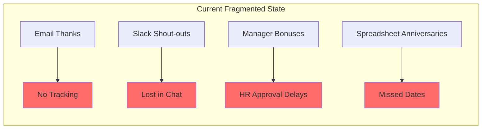
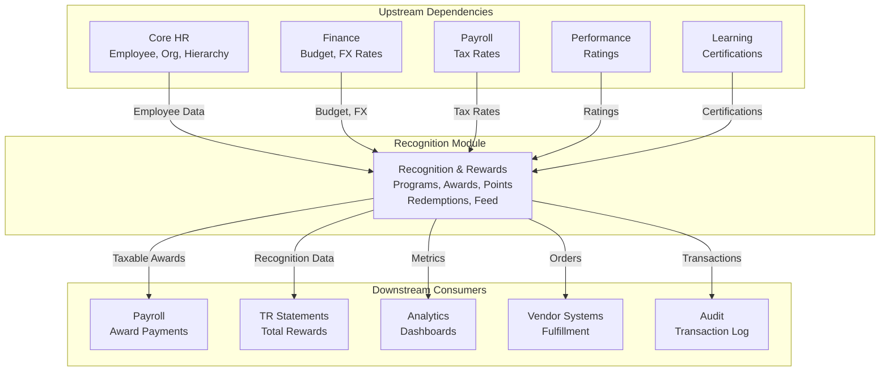
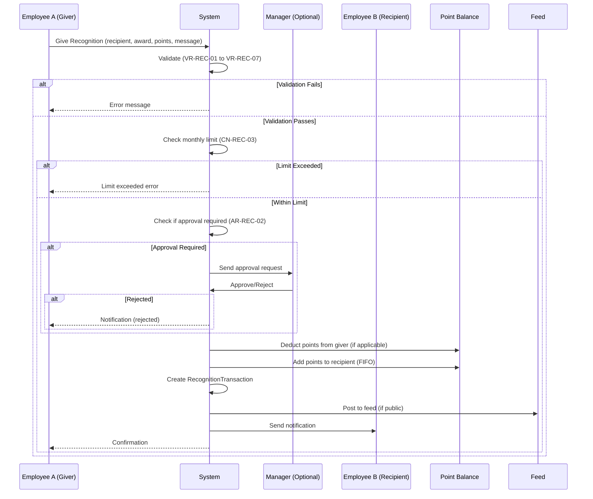
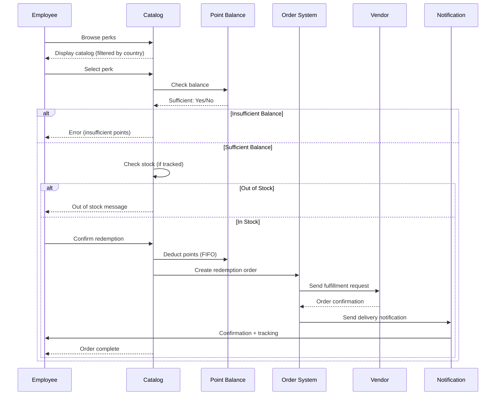
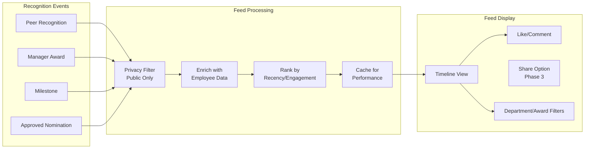

# Business Requirements Document: Recognition Sub-Module

**Module**: Total Rewards (TR)
**Sub-Module**: Recognition & Rewards
**Version**: 1.0.0
**Status**: DRAFT
**Created**: March 20, 2026

---

## Executive Summary

The Recognition sub-module is a **KEY DIFFERENTIATOR** for xTalent's Total Rewards platform. This greenfield build enables organizations to create a culture of appreciation through point-based recognition, peer-to-peer kudos, manager awards, milestone celebrations, and a social recognition feed.

**Strategic Importance:**
- Only 1/4 competitors (Oracle Celebrate) offer social recognition feed
- Peer-to-peer recognition is a top employee engagement driver
- Points-based system with redemption catalog increases tangible value perception
- Manager-allocated budgets empower decentralized recognition

**Innovation Highlights (Phase 2 USP):**
- **Social Recognition Feed**: LinkedIn-style feed for company-wide recognition visibility
- **AI-Powered Suggestions**: ML-driven recognition prompts based on achievements
- **Gamification**: Badges, leaderboards, and streak tracking for engagement
- **Real-Time Analytics**: Dashboard showing recognition trends and participation

---

## 1. Business Context

### 1.1 Organization

**Target Market**: Mid-to-large enterprises (500+ employees) across Southeast Asia
**Primary Users**: All employees (recognition givers/receivers), Managers, HR Administrators
**Geographic Scope**: Multi-country deployment (Vietnam, Thailand, Indonesia, Singapore, Malaysia, Philippines)

**Strategic Alignment:**
| Business Goal | Recognition Contribution |
|---------------|-------------------------|
| Employee Engagement | Recognition increases engagement by 25-40% (Gallup) |
| Retention | Recognized employees 5x less likely to leave |
| Culture Building | Reinforces company values through peer acknowledgment |
| Performance | Recognition linked to 14% productivity increase |

### 1.2 Current Problem

**Problem Statement:**
Organizations across Southeast Asia struggle with employee recognition due to:

1. **Fragmented Recognition Tools**: Companies use multiple disconnected systems (email, Slack, spreadsheets) for recognition with no centralized tracking or reward fulfillment.

2. **Lack of Visibility**: Recognition happens in silos—employees don't see peer achievements, reducing motivational impact and cultural reinforcement.

3. **No Tangible Rewards**: Most recognition is purely verbal with no points-based system for tangible rewards, limiting perceived value.

4. **Manager Budget Constraints**: Managers lack dedicated, trackable budgets for spontaneous recognition, requiring tedious approval processes.

5. **Milestone Tracking Gaps**: Work anniversaries and achievements are tracked manually, leading to missed celebrations and employee disappointment.

6. **Limited Analytics**: HR has no visibility into recognition patterns, participation rates, or program ROI.

**Current State (As-Is):**


### 1.3 Business Impact

**Quantified Impact of Inaction:**
| Metric | Current State | Industry Benchmark | Gap |
|--------|---------------|-------------------|-----|
| Employee Recognition Rate | ~30% | 60-70% | -40% |
| Recognition Frequency | 1x/month | 2-3x/month | -60% |
| Program Awareness | ~40% | 80%+ | -50% |
| Manager Participation | ~25% | 60%+ | -60% |
| Employee Satisfaction (Recognition) | 3.2/5 | 4.2/5 | -24% |

**Cost of Inaction:**
- **Turnover Cost**: Employees who feel undervalued are 5x more likely to leave
- **Engagement Loss**: Low recognition correlates with 10-15% lower productivity
- **Employer Brand**: Poor recognition culture impacts recruitment and retention

### 1.4 Why Now

**Market Timing Factors:**

| Factor | Urgency Driver | Timeline Impact |
|--------|----------------|-----------------|
| **Post-Pandemic Culture** | Remote/hybrid work requires digital recognition | Competitors launching 2025-2026 |
| **Gen Z Expectations** | Younger workforce expects instant, visible recognition | Employee experience differentiator |
| **Regional Competition** | Oracle Celebrate gaining SE Asia traction | First-mover advantage closing |
| **AI/ML Maturity** | Recommendation engines now viable for recognition suggestions | Technology inflection point |
| **Budget Availability** | Fast-track funding approved for innovation features | Q2 2026 development start |

**Competitive Landscape:**
| Vendor | Recognition Features | Social Feed | Points System | Peer-to-Peer |
|--------|---------------------|-------------|---------------|--------------|
| Oracle HCM | Celebrate (Full) | Yes | Yes | Yes |
| SAP SuccessFactors | Spot Awards (Basic) | No | Limited | Yes |
| Workday | Recognition (Basic) | No | No | Yes |
| Microsoft Dynamics | Limited | No | No | No |
| **xTalent (Planned)** | **Full Suite** | **Yes** | **Yes** | **Yes** |

---

## 2. Business Objectives

### SMART Objectives Summary

| ID | Objective | Metric | Target | Timeline |
|----|-----------|--------|--------|----------|
| BO-REC-01 | Achieve 70% employee participation in recognition program | % active users | 70% within 6 months of launch | Q4 2026 |
| BO-REC-02 | Enable manager-allocated budgets for 100% of people managers | Budget coverage | 100% manager coverage | Q3 2026 |
| BO-REC-03 | Process 5+ recognitions per employee per month | Recognition frequency | 5/month average | Q4 2026 |
| BO-REC-04 | Achieve 80% perk redemption rate (points redeemed / earned) | Redemption rate | 80% within 12 months | Q1 2027 |
| BO-REC-05 | Reduce recognition-to-reward fulfillment time | Fulfillment SLA | <48 hours for digital perks | Q3 2026 |
| BO-REC-06 | Achieve 4.5/5 employee satisfaction with recognition experience | NPS/CSAT score | 4.5/5 average rating | Q4 2026 |

### Detailed SMART Objectives

**BO-REC-01: Employee Participation**
- **Specific**: Achieve 70% of employees actively giving or receiving recognition
- **Measurable**: Track via monthly active users (MAU) in recognition module
- **Achievable**: Based on Oracle Celebrate benchmarks (65-75% in similar markets)
- **Relevant**: High participation indicates program adoption and cultural integration
- **Time-bound**: Within 6 months of production launch

**BO-REC-02: Manager Budget Enablement**
- **Specific**: All people managers have allocated monthly recognition budgets
- **Measurable**: Count of managers with active budget vs total managers
- **Achievable**: Budget allocation is configuration-driven feature
- **Relevant**: Manager budgets are critical for decentralized recognition
- **Time-bound**: By end of Phase 1 (Q3 2026)

**BO-REC-03: Recognition Frequency**
- **Specific**: Average 5+ recognitions per employee per month
- **Measurable**: Total recognitions / total employees / month
- **Achievable**: Industry leaders achieve 8-10/month with mature programs
- **Relevant**: Frequency correlates with engagement impact
- **Time-bound**: Within 9 months of launch (Q4 2026)

**BO-REC-04: Perk Redemption Rate**
- **Specific**: 80% of earned points redeemed before expiration
- **Measurable**: (Points redeemed / Points earned) * 100
- **Achievable**: FIFO expiration logic and reminders drive redemption
- **Relevant**: Unredeemed points indicate poor catalog or engagement
- **Time-bound**: Within 12 months of launch (Q1 2027)

**BO-REC-05: Fulfillment SLA**
- **Specific**: Digital perks delivered within 48 hours
- **Measurable**: Average time from redemption to delivery
- **Achievable**: API integrations enable instant/next-day fulfillment
- **Relevant**: Fast fulfillment increases perceived value and trust
- **Time-bound**: By Phase 2 launch (Q3 2026)

**BO-REC-06: Employee Satisfaction**
- **Specific**: 4.5/5 average rating for recognition experience
- **Measurable**: In-app CSAT surveys after recognition/redemption
- **Achievable**: Modern UX and fast fulfillment drive satisfaction
- **Relevant**: Satisfaction predicts continued program usage
- **Time-bound**: Measured quarterly, target by Q4 2026

---

## 3. Business Actors

### Actor Summary Table

| Actor | Role | Key Responsibilities | Read Permissions | Write Permissions | Delete Permissions |
|-------|------|---------------------|------------------|-------------------|-------------------|
| BA-REC-01: Employee | Recognition Participant | Give/receive recognition, redeem points | Own balance, feed, catalog | Own recognitions, redemptions | Draft recognitions only |
| BA-REC-02: Manager | Team Recognition Leader | Allocate budget, approve awards, recognize team | Team analytics, budget status | Team recognitions, budget allocation | Draft nominations |
| BA-REC-03: HR Administrator | Program Administrator | Configure programs, manage catalog, monitor analytics | All recognition data | Program config, catalog, awards | Inactive items |
| BA-REC-04: Finance Approver | Budget Oversight | Approve high-value awards, monitor spend | Budget utilization reports | Approval/rejection | None |
| BA-REC-05: HR Director | Strategic Owner | Set recognition strategy, budget policy | Executive dashboards | Policy configuration | None |
| BA-REC-06: System | Automated Processing | Milestone detection, point expiration, notifications | Employee data (hire date, birthday) | Auto-recognition, expiration | Expired points |

### Detailed Actor Definitions

**BA-REC-01: Employee**
- **Description**: Any employee (individual contributor, individual contributor with giving rights)
- **Primary Goals**:
  - Recognize colleagues for help and achievements
  - Receive recognition from peers and managers
  - Redeem points for meaningful perks
  - View company recognition feed
- **Key Permissions**:
  - ✅ Give peer recognition (up to monthly limit)
  - ✅ View own point balance and history
  - ✅ Browse and redeem from perk catalog
  - ✅ View public recognition feed
  - ✅ Like and comment on public recognitions
- **Constraints**:
  - ❌ Cannot recognize self
  - ❌ Cannot exceed monthly giving limit
  - ❌ Cannot view private recognitions (not addressed to)
  - ❌ Cannot modify approved awards

**BA-REC-02: Manager**
- **Description**: People managers with direct reports
- **Primary Goals**:
  - Recognize team members for performance
  - Allocate and manage recognition budget
  - Approve team nominations
  - Monitor team participation
- **Key Permissions**:
  - ✅ All Employee permissions
  - ✅ Manager-specific awards (higher point values)
  - ✅ Monthly budget allocation and tracking
  - ✅ Approve/reject team nominations
  - ✅ View team recognition analytics
- **Constraints**:
  - ❌ Cannot exceed allocated budget without approval
  - ❌ Cannot approve own nominations
  - ❌ Cannot modify program configuration

**BA-REC-03: HR Administrator**
- **Description**: HR staff responsible for recognition program administration
- **Primary Goals**:
  - Configure and maintain recognition programs
  - Manage perk catalog and vendor relationships
  - Monitor program health and engagement
  - Generate reports for leadership
- **Key Permissions**:
  - ✅ All Employee permissions
  - ✅ Create/modify recognition programs
  - ✅ Define award types and point values
  - ✅ Manage perk catalog (add, update, deactivate)
  - ✅ View all analytics and export reports
  - ✅ Override limits (with approval)
- **Constraints**:
  - ❌ Cannot approve own awards (conflict of interest)
  - ❌ Cannot delete transaction history (audit requirement)

**BA-REC-04: Finance Approver**
- **Description**: Finance team member responsible for budget oversight
- **Primary Goals**:
  - Approve high-value awards exceeding manager limits
  - Monitor budget utilization across departments
  - Ensure tax compliance for monetary awards
- **Key Permissions**:
  - ✅ View budget utilization by department
  - ✅ Approve/reject awards above threshold
  - ✅ View tax implications of awards
  - ✅ Generate cost reports
- **Constraints**:
  - ❌ Cannot initiate recognition
  - ❌ Cannot modify program rules

**BA-REC-05: HR Director**
- **Description**: Senior HR leader owning recognition strategy
- **Primary Goals**:
  - Define recognition program strategy
  - Approve annual recognition budget
  - Monitor program ROI and impact
- **Key Permissions**:
  - ✅ View executive dashboards
  - ✅ Configure program policies
  - ✅ Set budget guidelines
  - ✅ Approve program changes
- **Constraints**:
  - ❌ Cannot bypass approval workflows
  - ❌ Cannot delete audit records

**BA-REC-06: System (Automated)**
- **Description**: Automated background processes
- **Primary Goals**:
  - Detect and celebrate milestones (anniversaries, birthdays)
  - Expire points according to FIFO policy
  - Send notifications and reminders
- **Key Permissions**:
  - ✅ Read employee data (hire date, birthday)
  - ✅ Create milestone recognition transactions
  - ✅ Expire points (FIFO logic)
  - ✅ Send automated notifications
- **Constraints**:
  - ❌ Cannot override manual approvals
  - ❌ Cannot modify point values

### Actor Interaction Matrix

```mermaid
matrix
  axis[""]
    Employee["BA-REC-01<br/>Employee"]
    Manager["BA-REC-02<br/>Manager"]
    HR_Admin["BA-REC-03<br/>HR Admin"]
    Finance["BA-REC-04<br/>Finance"]
    HR_Director["BA-REC-05<br/>HR Director"]
    System["BA-REC-06<br/>System"]

  Employee["BA-REC-01<br/>Employee"]
    -->|Give Recognition| Employee
    -->|Recognize| Manager
    -->|Redeem| HR_Admin
    -->|View Feed| Employee
    -->|View Feed| Manager
    -->|View Feed| HR_Admin

  Manager["BA-REC-02<br/>Manager"]
    -->|Allocate Budget| HR_Admin
    -->|Recognize Team| Employee
    -->|Approve| Employee
    -->|Request Budget Increase| Finance

  HR_Admin["BA-REC-03<br/>HR Admin"]
    -->|Configure Program| Employee
    -->|Manage Catalog| Employee
    -->|Monitor Analytics| HR_Director
    -->|Generate Reports| Finance

  System["BA-REC-06<br/>System"]
    -->|Detect Milestone| Employee
    -->|Detect Milestone| Manager
    -->|Expire Points| Employee
    -->|Send Reminder| Employee
```

---

## 4. Business Rules

### 4.1 Validation Rules

| ID | Rule | Category | Enforcement | Error Message |
|----|------|----------|-------------|---------------|
| VR-REC-01 | Employee cannot recognize themselves | Validation | Hard Block | "You cannot recognize yourself. Please select a different recipient." |
| VR-REC-02 | Recognition message must be minimum 50 characters | Validation | Hard Block | "Please provide more details. Recognition message must be at least 50 characters." |
| VR-REC-03 | Points given must be within award type range | Validation | Hard Block | "Point value must be between {min} and {max} points for this award type." |
| VR-REC-04 | Giver must have sufficient monthly giving limit remaining | Validation | Hard Block | "You have exceeded your monthly giving limit of {limit} points. Limit resets on {date}." |
| VR-REC-05 | Recipient must be active employee (not terminated) | Validation | Hard Block | "The selected recipient is no longer an active employee." |
| VR-REC-06 | Award type must be active and available | Validation | Hard Block | "This award type is no longer available." |
| VR-REC-07 | Public recognition must comply with content policy (no profanity) | Validation | Soft Warning → Hard Block on Override | "Your message may contain inappropriate content. Please review and revise." |
| VR-REC-08 | Redemption requires sufficient point balance | Validation | Hard Block | "Insufficient points. You need {required} points but have {available} points." |
| VR-REC-09 | Perk must be in stock (if inventory tracked) | Validation | Hard Block | "This item is currently out of stock. Expected availability: {date}." |
| VR-REC-10 | Employee must not exceed perk redemption limit | Validation | Hard Block | "You have reached the monthly limit for this perk. Next available: {date}." |
| VR-REC-11 | Delivery address required for physical items | Validation | Hard Block | "Please provide a delivery address for this item." |
| VR-REC-12 | Milestone award must match milestone type configuration | Validation | Hard Block | "Milestone award configuration not found for this milestone type." |

### 4.2 Authorization Rules

| ID | Rule | Category | Required Role | Approval Required |
|----|------|----------|---------------|-------------------|
| AR-REC-01 | Give peer recognition | Authorization | Employee | No |
| AR-REC-02 | Give manager recognition | Authorization | Manager | No (within limit) / Yes (above limit) |
| AR-REC-03 | Approve nomination | Authorization | Manager, HR Admin | N/A (this IS approval) |
| AR-REC-04 | Configure recognition program | Authorization | HR Admin, HR Director | No |
| AR-REC-05 | Add/edit perk catalog items | Authorization | HR Admin | No |
| AR-REC-06 | Deactivate perk items | Authorization | HR Admin | No |
| AR-REC-07 | Delete recognition transaction | Authorization | None | Not Permitted (audit requirement) |
| AR-REC-08 | Override giving limit | Authorization | HR Admin | Yes (HR Director) |
| AR-REC-09 | Approve high-value award (>5000 points) | Authorization | Finance Approver | Yes |
| AR-REC-10 | View team recognition analytics | Authorization | Manager | N/A |
| AR-REC-11 | View company-wide analytics | Authorization | HR Admin, HR Director | N/A |
| AR-REC-12 | Export recognition data | Authorization | HR Admin | Yes (HR Director) |
| AR-REC-13 | Modify milestone configuration | Authorization | HR Admin | No |
| AR-REC-14 | Set annual recognition budget | Authorization | HR Director | Yes (Finance/CFO) |

### 4.3 Calculation Rules

| ID | Rule | Formula/Logic | Example |
|----|------|---------------|---------|
| CR-REC-01 | Point balance calculation | Balance = Total Earned - Total Redeemed - Total Expired | Earned: 5000, Redeemed: 2000, Expired: 500 → Balance: 2500 |
| CR-REC-02 | FIFO point expiration | Oldest points expire first; redemptions deduct from oldest batch | Jan points expire before Mar points |
| CR-REC-03 | Monthly giving limit reset | Limit resets on the 1st of each month | 500 points/month resets Jan 1, Feb 1, etc. |
| CR-REC-04 | Point value conversion | Monetary Value = Points * Point Conversion Rate | 1000 points * 1000 VND/point = 1,000,000 VND |
| CR-REC-05 | Budget utilization tracking | Utilization = (Spent / Allocated) * 100 | Allocated: 10000, Spent: 7500 → 75% utilized |
| CR-REC-06 | Prorated budget for mid-period managers | Budget = (Full Monthly Budget * Remaining Days) / Total Days | Manager starts Jan 15 → (1000 * 17) / 31 = 548 points |
| CR-REC-07 | Milestone point calculation | Points = Base Points * Multiplier (by milestone type) | 5-year anniversary: 1000 * 2 = 2000 points |
| CR-REC-08 | Redemption tax calculation | Taxable Amount = Monetary Value * Tax Rate (if taxable) | 1,000,000 VND * 10% = 100,000 VND tax |
| CR-REC-09 | Team recognition split | Points per Member = Total Points / Team Size | 1000 points / 5 members = 200 points each |
| CR-REC-10 | Engagement score calculation | Score = (Recognitions Given * 1) + (Recognitions Received * 2) + (Redemptions * 0.5) | Given: 10, Received: 5, Redeemed: 2 → Score: 21 |
| CR-REC-11 | Participation rate | Rate = (Active Employees / Total Employees) * 100 | Active: 350, Total: 500 → 70% participation |
| CR-REC-12 | Redemption rate | Rate = (Points Redeemed / Points Earned) * 100 | Redeemed: 8000, Earned: 10000 → 80% |

### 4.4 Constraint Rules

| ID | Rule | Constraint Type | Consequence |
|----|------|-----------------|-------------|
| CN-REC-01 | Maximum points per peer recognition | Upper Limit: 100 points | Transaction rejected if exceeded |
| CN-REC-02 | Maximum points per manager recognition | Upper Limit: 500 points (1000 with approval) | Requires Finance approval above 500 |
| CN-REC-03 | Maximum points per employee per month (giving) | Upper Limit: 500 points/month | Giving disabled until reset |
| CN-REC-04 | Maximum points per employee per month (receiving) | Upper Limit: 2000 points/month | Excess points not awarded |
| CN-REC-05 | Minimum redemption amount | Lower Limit: 100 points | Cannot redeem < 100 points |
| CN-REC-06 | Maximum single redemption | Upper Limit: 10,000 points | Split into multiple transactions |
| CN-REC-07 | Points expiration period | Time Limit: 12 months from earning | Automatic expiration via FIFO |
| CN-REC-08 | Manager budget carryover | Policy: No carryover to next month | Unused budget expires monthly |
| CN-REC-09 | Perk redemption per employee per month | Variable: Set per perk (e.g., 2 gift cards/month) | Blocked until next period |
| CN-REC-10 | Recognition frequency per employee pair | Soft Limit: 5 per month (same giver → same recipient) | Warning shown, can override |
| CN-REC-11 | Minimum employee tenure for milestone awards | Time Limit: 90 days employed | Milestone award skipped if < 90 days |
| CN-REC-12 | Geographic catalog variation | Constraint: Catalog items vary by country | Employee sees country-specific catalog |

### 4.5 Compliance Rules (Multi-Country)

| ID | Rule | Country | Regulatory Requirement | System Implementation |
|----|------|---------|----------------------|----------------------|
| CP-REC-01 | Monetary awards taxed as income | Vietnam, Thailand, Indonesia | Tax law: Cash-equivalent rewards are taxable | Flag taxable awards, report to payroll |
| CP-REC-02 | Non-monetary awards tax exemption threshold | Vietnam | Gifts < 1,000,000 VND non-taxable | Track cumulative gift value per employee |
| CP-REC-03 | Non-monetary awards tax exemption threshold | Singapore | Gifts < SGD 100 non-taxable | Track cumulative gift value per employee |
| CP-REC-04 | Non-monetary awards tax exemption threshold | Malaysia | Gifts < RM 500 non-taxable | Track cumulative gift value per employee |
| CP-REC-05 | Mandatory bonus (13th month) treatment | Vietnam | 13th month salary is customary, not mandatory | Milestone awards separate from 13th month |
| CP-REC-06 | Data privacy for public recognition | All (PDPA compliance) | Employee consent for public display | Opt-in/opt-out for public recognition |
| CP-REC-07 | Cross-border point transfer | All countries | Points cannot be transferred across legal entities | Points tied to employing entity |
| CP-REC-08 | Currency conversion for multi-country catalogs | All countries | Local currency display required | Real-time FX conversion for catalog |
| CP-REC-09 | Escheatment of unused points | Philippines | Unused points may be considered unclaimed property | Report unredeemed points > 3 years |
| CP-REC-10 | Sharia compliance for rewards | Indonesia, Malaysia | No alcohol, gambling, pork-related rewards | Filter catalog items by country |
| CP-REC-11 | Minimum wage compliance | All countries | Recognition points cannot substitute minimum wage | Validation: points ≠ salary component |
| CP-REC-12 | Social insurance treatment | Vietnam | Recognition awards not subject to SI | Flag non-SI eligible in payroll integration |

### 4.6 Business Rule Summary by Category

| Category | Rule Count | Critical Rules |
|----------|------------|----------------|
| Validation Rules | 12 | VR-REC-01, VR-REC-04, VR-REC-08 |
| Authorization Rules | 14 | AR-REC-03, AR-REC-09, AR-REC-14 |
| Calculation Rules | 12 | CR-REC-01, CR-REC-02, CR-REC-04 |
| Constraint Rules | 12 | CN-REC-01, CN-REC-02, CN-REC-07 |
| Compliance Rules | 12 | CP-REC-01, CP-REC-02, CP-REC-10 |
| **Total** | **62** | **15 critical** |

---

## 5. Out of Scope

The following features and capabilities are **explicitly excluded** from the Recognition sub-module:

### 5.1 Excluded Features

| ID | Feature | Rationale | Handled By |
|----|---------|-----------|------------|
| OOS-REC-01 | **Payroll Processing** | Payroll integration is for data handoff only; actual payment processing is Payroll module scope | Payroll (PY) Module |
| OOS-REC-02 | **Tax Filing & Remittance** | Tax calculation for awards is informational only; actual tax filing is Payroll/Tax module | Payroll (PY) Module |
| OOS-REC-03 | **Physical Inventory Warehousing** | xTalent does not store physical perks; fulfillment is via third-party vendors | Vendor Systems |
| OOS-REC-04 | **Performance Rating Calculation** | Recognition may be linked to performance, but rating logic is Performance Management scope | Performance (PM) Module |
| OOS-REC-05 | **Learning & Development Tracking** | Certification milestones reference external learning data; LMS integration only | Learning (LM) Module |
| OOS-REC-06 | **Recruitment Referral Bonus Processing** | Referral bonuses are hiring process, not recognition; handled by Talent Acquisition | Talent Acquisition (TA) Module |
| OOS-REC-07 | **Full Wellness Platform** | Wellness challenges may earn points, but wellness tracking is separate | Third-party Wellness |
| OOS-REC-08 | **Insurance Claims Processing** | Health/wellness perks are catalog items only; claims are benefits carrier scope | Benefits Carriers |
| OOS-REC-09 | **Financial Advisory Services** | Financial wellness perks are informational only; no licensed advisory | External Partners |
| OOS-REC-10 | **Social Media Integration (External)** | Sharing to LinkedIn/Facebook is Phase 3; initial scope is internal feed only | Future Phase |
| OOS-REC-11 | **Cryptocurrency Redemptions** | Crypto rewards are emerging; excluded from MVP/Phase 2 | Future Phase |
| OOS-REC-12 | **Gamified Leaderboards (External)** | Public leaderboards outside company are excluded; internal leaderboards included | Future Phase |

### 5.2 Scope Boundary Rule

**Rule**: Any feature not explicitly documented in this BRD, the related Entity Catalog (E-TR-017 through E-TR-020), or Feature Catalog (FR-TR-019 through FR-TR-026) is **out of scope by default**.

**Scope Change Process**:
1. Submit change request to Product Owner
2. Impact analysis (technical, business, compliance)
3. Architecture Review Board approval
4. BRD update and version increment

### 5.3 Phase Boundaries

| Feature | Phase 1 (MVP) | Phase 2 (USP) | Phase 3 (Future) |
|---------|---------------|---------------|------------------|
| Program Setup | Included | N/A | N/A |
| Peer-to-Peer Recognition | Included | Enhanced (gamification) | N/A |
| Manager Awards | Included | N/A | N/A |
| Milestone Celebrations | Limited (anniversaries only) | Full (birthdays, certifications) | Custom milestones |
| Points System | Included | N/A | N/A |
| Redemption Catalog | Basic (gift cards) | Full (experiences, merchandise) | Vendor marketplace |
| Social Recognition Feed | **Excluded** | **Included** | External sharing |
| AI Recommendations | **Excluded** | **Included** | Enhanced ML |
| Analytics Dashboard | Basic | Real-time | Predictive |
| Mobile App | Web-responsive | Native iOS/Android | N/A |

---

## 6. Assumptions & Dependencies

### 6.1 Assumptions

| ID | Assumption | Category | Impact if Invalid | Mitigation |
|----|------------|----------|-------------------|------------|
| AS-REC-01 | **All employees have access to email** | Infrastructure | Cannot deliver digital perks or notifications | Provide SMS alternative |
| AS-REC-02 | **Employees have internet access** | Infrastructure | Cannot access recognition features | Mobile app with offline mode |
| AS-REC-03 | **Core HR module provides accurate employee data** | Data Quality | Milestone detection fails, wrong recipients | Data validation, manual override |
| AS-REC-04 | **Managers will actively participate in recognition** | Adoption | Low recognition frequency, poor culture impact | Training, incentives, executive sponsorship |
| AS-REC-05 | **Third-party vendors can fulfill digital perks within 48 hours** | Vendor | Missed SLA, employee dissatisfaction | Multiple vendor backup |
| AS-REC-06 | **Point conversion rate (points to currency) remains stable** | Financial | Budget variance, employee confusion | Quarterly review, hedge for large programs |
| AS-REC-07 | **Employees will redeem points before expiration** | Behavioral | High expiration = negative experience | Proactive reminders, auto-redeem options |
| AS-REC-08 | **Legal/Compliance will approve perk catalog items** | Compliance | Catalog delays, limited variety | Pre-approved vendor list, legal review SLA |
| AS-REC-09 | **Finance will allocate sufficient budget for recognition** | Budget | Program underfunded, low participation | Executive sponsorship, ROI tracking |
| AS-REC-10 | **IT infrastructure can support real-time feed updates** | Technical | Feed latency, poor UX | Caching, async processing |
| AS-REC-11 | **Employees will opt-in to public recognition** | Privacy | Limited social feed content | Default opt-in with easy opt-out |
| AS-REC-12 | **Mobile responsiveness is sufficient for initial launch** | UX | Lower engagement from mobile-only users | Fast-track native app (Phase 2) |

### 6.2 Dependencies

#### 6.2.1 Upstream Dependencies (Inputs)

| ID | Dependency | Provider | Data Consumed | Impact if Unavailable |
|----|------------|----------|---------------|----------------------|
| UD-REC-01 | **Employee Master Data** | Core HR (CO) | Employee ID, name, email, manager, hire date, birthday | Cannot send recognition, detect milestones |
| UD-REC-02 | **Organizational Hierarchy** | Core HR (CO) | Department, team, reporting structure | Cannot route approvals, show team analytics |
| UD-REC-03 | **Employment Status** | Core HR (CO) | Active/terminated status | May recognize terminated employees |
| UD-REC-04 | **Job Level/Grade** | Core HR (CO) | Job level for eligibility | Cannot enforce level-based rules |
| UD-REC-05 | **Manager-employee Relationships** | Core HR (CO) | Direct reports, manager chain | Cannot validate manager awards |
| UD-REC-06 | **Legal Entity Data** | Core HR (CO) | Country, legal entity | Cannot apply country-specific rules |
| UD-REC-07 | **Budget Allocation** | Finance (FI) | Manager budget limits | Cannot enforce budget constraints |
| UD-REC-08 | **Currency Exchange Rates** | Finance (FI) | FX rates for multi-country | Cannot display local currency |
| UD-REC-09 | **Tax Rates** | Payroll (PY) | Tax rates for award taxation | Cannot calculate tax implications |
| UD-REC-10 | **Performance Ratings** | Performance (PM) | Rating for eligibility/nomination | Cannot link recognition to performance |
| UD-REC-11 | **Learning Records** | Learning (LM) | Certifications for milestones | Cannot auto-recognize certifications |
| UD-REC-12 | **SSO/Authentication** | Platform | User authentication | Cannot access recognition features |

#### 6.2.2 Downstream Dependencies (Consumers)

| ID | Dependency | Consumer | Data Provided | Integration Pattern |
|----|------------|----------|---------------|---------------------|
| DD-REC-01 | **Payroll Integration** | Payroll (PY) | Taxable award amounts, cash award payments | Real-time API per award |
| DD-REC-02 | **Total Rewards Statement** | TR Statements | Recognition awards, point values | Event-based (on award) |
| DD-REC-03 | **Reporting & Analytics** | Analytics | Recognition transactions, participation metrics | Batch (daily) + Real-time |
| DD-REC-04 | **Vendor Fulfillment** | Third-party Vendors | Redemption orders, delivery details | API or File-based |
| DD-REC-05 | **Notification Service** | Platform | Email, push, in-app notifications | Event-based |
| DD-REC-06 | **Audit Log** | Audit (TR) | All recognition transactions | Real-time |
| DD-REC-07 | **Cost Allocation** | Finance (FI) | Department-level recognition costs | Batch (weekly) |
| DD-REC-08 | **Employee Profile** | Core HR (CO) | Recognition badges, service awards | Event-based |

#### 6.2.3 Dependency Diagram



### 6.3 Dependency Risk Analysis

| Risk | Probability | Impact | Mitigation Strategy | Owner |
|------|-------------|--------|---------------------|-------|
| **Core HR data quality issues** | Medium | High | Data validation layer, manual correction workflow | HRIS Team |
| **Vendor fulfillment delays** | Medium | Medium | Multiple vendor backup, SLA monitoring | Procurement |
| **Budget allocation delays** | Low | High | Executive sponsorship, pre-approved budgets | Finance |
| **Payroll integration complexity** | Medium | High | Early integration testing, fallback manual process | Engineering |
| **Tax compliance across countries** | High | High | Legal review per country, configurable rules | Compliance |
| **Low manager adoption** | Medium | High | Training program, executive modeling, incentives | HR |
| **Mobile UX limitations** | Low | Medium | Responsive design, fast-track native app | Product |

---

## Appendix A: Recognition Workflow

### A.1 Peer-to-Peer Recognition Workflow



### A.2 Point Redemption Workflow



### A.3 Milestone Detection Workflow

```mermaid
flowchart TD
    START([Daily Job]) --> DETECT[Scan Employee Database]
    DETECT --> CHECK{Milestone Today?}

    CHECK -->|Work Anniversary| ANNIV[Calculate Years of Service]
    CHECK -->|Birthday| BDAY[Verify Opt-in Status]
    CHECK -->|Certification| CERT[Check Learning Records]

    ANNIV --> CONFIG[Get Milestone Configuration]
    BDAY --> CONFIG
    CERT --> CONFIG

    CONFIG --> AWARD{Award Type Defined?}
    AWARD -->|Yes| CREATE[Create RecognitionTransaction]
    AWARD -->|No| SKIP[Skip (log for HR)]

    CREATE --> POINTS[Calculate Points<br/>Base * Multiplier]
    POINTS --> NOTIFY[Send Notification to Employee]
    NOTIFY --> MANAGER[Notify Manager<br/>Prompt to Congratulate]
    MANAGER --> FEED[Post to Recognition Feed<br/>if Public]
    FEED --> END([End])

    SKIP --> END
```

### A.4 Social Feed Architecture



---

## Appendix B: Cross-Reference to Input Documents

### B.1 Entity Cross-Reference

| BRD Section | Related Entity | Entity ID | Source Document |
|-------------|----------------|-----------|-----------------|
| Business Actors | RecognitionProgram | E-TR-017 | Entity Catalog |
| Business Rules | AwardType | E-TR-018 | Entity Catalog |
| Business Rules | RecognitionAward | E-TR-019 | Entity Catalog |
| Workflows | MilestoneEvent | E-TR-020 | Entity Catalog |
| Out of Scope | SocialFeed | (Implied) | Entity Catalog |

### B.2 Feature Cross-Reference

| BRD Section | Related Feature | Feature ID | Source Document |
|-------------|-----------------|-------------|-----------------|
| Business Objectives | Recognition Program Setup | FR-TR-019 | Feature Catalog |
| Business Rules | Peer-to-Peer Recognition | FR-TR-020 | Feature Catalog |
| Business Rules | Manager Recognition Awards | FR-TR-021 | Feature Catalog |
| Out of Scope | Milestone Celebrations | FR-TR-022 | Feature Catalog |
| Business Rules | Points-Based Rewards | FR-TR-024 | Feature Catalog |
| Workflows | Rewards Catalog & Redemption | FR-TR-025 | Feature Catalog |
| USP Highlights | Social Recognition Feed | FR-TR-026 | Feature Catalog |

### B.3 Functional Requirements Cross-Reference

| BRD Section | Related FR | FR Code | Source Document |
|-------------|------------|---------|-----------------|
| Validation Rules | Recognition Program Setup | FR-TR-REC-001 | Functional Requirements |
| Authorization Rules | Award Definition | FR-TR-REC-002 | Functional Requirements |
| Business Rules | Peer Recognition | FR-TR-REC-003 | Functional Requirements |
| Workflows | Recognition Nomination | FR-TR-REC-004 | Functional Requirements |
| Calculation Rules | Point Balance Management | FR-TR-REC-005 | Functional Requirements |
| Workflows | Point Redemption | FR-TR-REC-007 | Functional Requirements |
| USP Highlights | Recognition Feed and Wall | FR-TR-REC-008 | Functional Requirements |
| Business Objectives | Recognition Analytics | FR-TR-REC-009 | Functional Requirements |
| Workflows | Milestone Recognition | FR-TR-REC-010 | Functional Requirements |

---

## Appendix C: Glossary

| Term | Definition |
|------|------------|
| **Recognition Program** | Configurable framework defining types of awards, eligibility, and rules |
| **Award Type** | Specific category of recognition (e.g., Teamwork, Innovation) with defined point value |
| **Point Balance** | Employee's available points (earned - redeemed - expired) |
| **FIFO Expiration** | First-In-First-Out: oldest points expire first |
| **Monthly Giving Limit** | Maximum points an employee can give per month |
| **Manager Budget** | Monthly points allocated to managers for team recognition |
| **Perk Catalog** | Collection of items/experiences redeemable with points |
| **Social Recognition Feed** | Company-wide timeline showing public recognitions (USP feature) |
| **Milestone Event** | Automated recognition for work anniversaries, birthdays, certifications |
| **Redemption Rate** | Percentage of earned points that are redeemed (target: 80%) |
| **Participation Rate** | Percentage of employees actively giving/receiving recognition |

---

## Document Approval

| Role | Name | Signature | Date |
|------|------|-----------|------|
| Business Owner (VP People & Culture) | _Pending_ | | |
| Product Owner (HR Technology Director) | _Pending_ | | |
| Technical Lead (Engineering Manager) | _Pending_ | | |
| Compliance Reviewer (Legal) | _Pending_ | | |
| Architecture Review Board | _Pending_ | | |

---

**Document Version**: 1.0.0
**Status**: DRAFT
**Created**: March 20, 2026
**Next Review**: April 2026

---

**END OF DOCUMENT**
