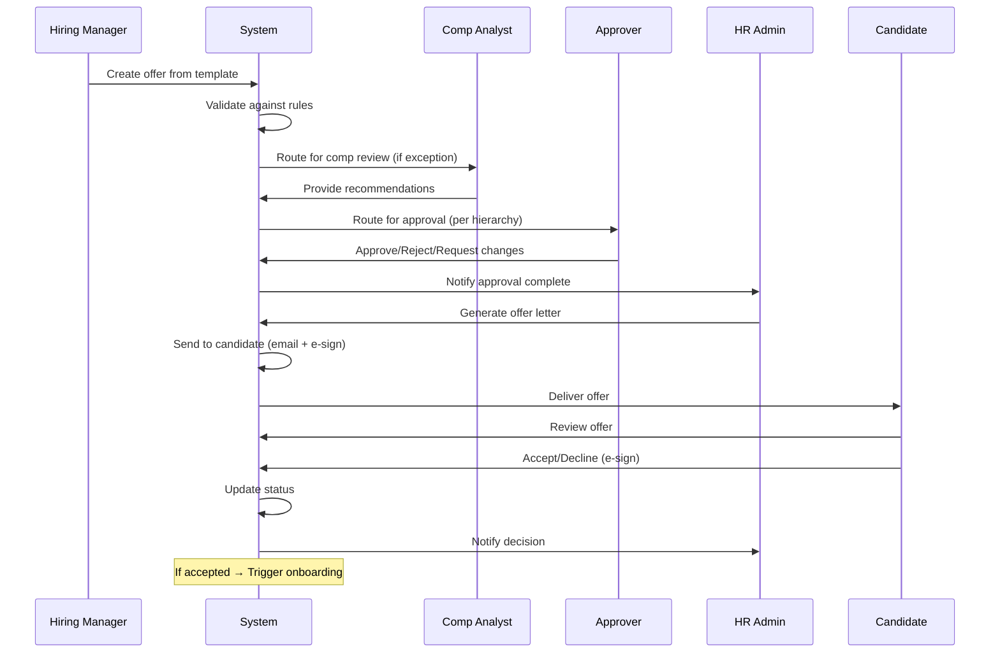
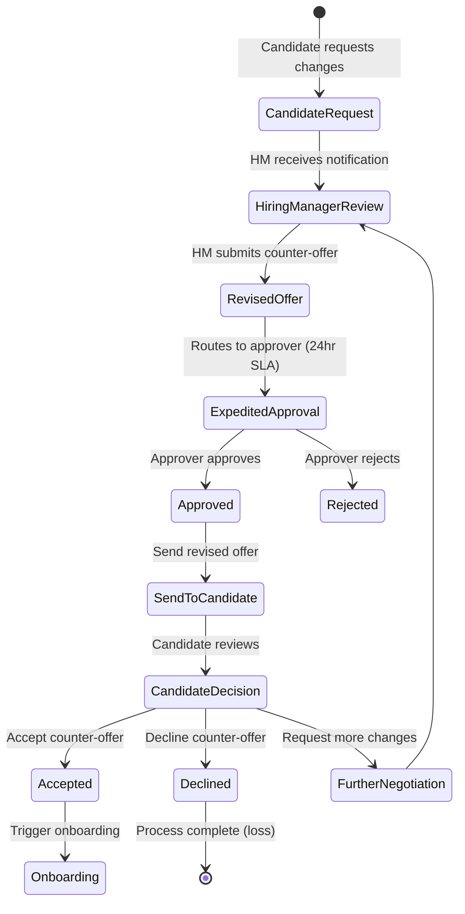
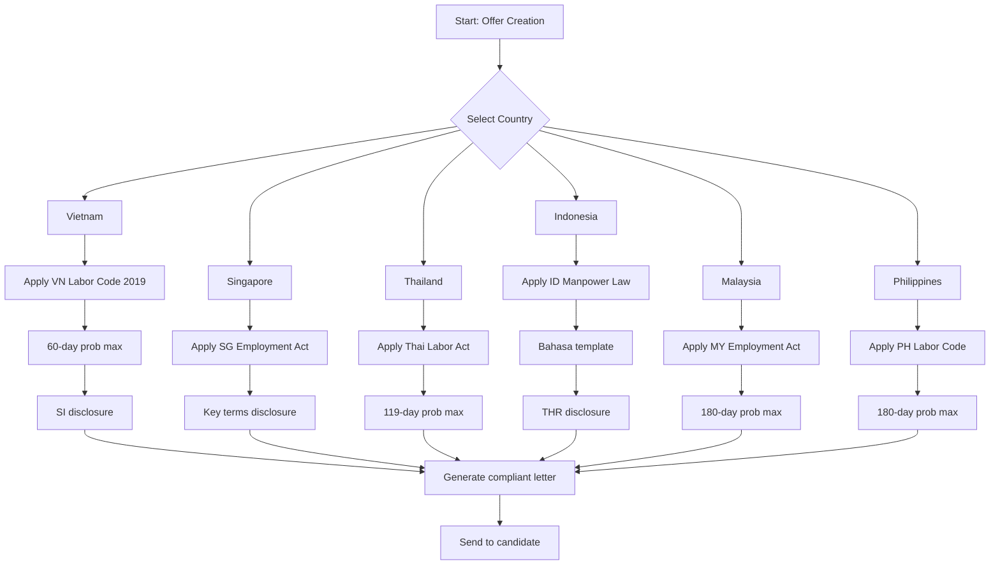

# Business Requirements Document: Offer Management

> **ODSA Reality Layer Specification** - Offer Management Sub-module of Total Rewards

---

## Executive Summary

**Document Purpose**: This BRD defines the business requirements for the Offer Management sub-module, enabling organizations to create, approve, send, track, and analyze employment offers with competitive total rewards packages across Southeast Asian markets.

**Strategic Classification**: CORE Domain - Critical Differentiator

| Attribute | Value |
|-----------|-------|
| **Domain Type** | CORE (Innovation Play) |
| **Strategic Value** | HIGH - First impression candidate experience |
| **Build Strategy** | Build Core + Integrate E-Signature |
| **Timeline** | Fast Track (MVP in 12 weeks) |
| **Geographic Scope** | 6+ countries: VN, TH, ID, SG, MY, PH |

**Key Innovations**:
- AI-powered offer competitiveness scoring
- Counter-offer negotiation workflow
- Real-time total rewards package visualization
- Multi-currency offer display with FX conversion
- Predictive offer acceptance analytics

---

## 1. Business Context

### 1.1 Organization Context

**Target Users**:
- HR Administrators and Coordinators
- Hiring Managers and Department Heads
- Compensation Analysts
- Recruiters and Talent Acquisition
- Directors/VPs (Approvers)
- Job Candidates (External Users)

**System Integration**:
- **Upstream**: Talent Acquisition/ATS (Candidate data, Job Requisitions)
- **Lateral**: Core HR (Job Profiles, Salary Structures, Grades)
- **Downstream**: Onboarding (Employee creation, Benefits enrollment)
- **External**: E-Signature providers (DocuSign, Adobe Sign), Email services

### 1.2 Current Problem

Organizations face significant challenges in employment offer management:

| Problem | Impact | Root Cause |
|---------|--------|------------|
| **Manual offer creation** | 4-6 hours per offer, inconsistent packages | No standardized templates |
| **Approval bottlenecks** | 5-10 day approval cycles | Email-based routing, no visibility |
| **Counter-offer vulnerability** | 15-30% acceptance rate decline | No negotiation workflow, slow response |
| **Offer tracking blind spots** | Unknown candidate engagement | No visibility into offer status |
| **Compliance risks** | Legal exposure across 6 countries | Country-specific offer requirements |
| **Competitive disadvantage** | Losing top talent to faster competitors | Slow offer process, no analytics |
| **Data silos** | Cannot analyze offer effectiveness | Disconnected systems |

**Current State Workflow**:
```
Hiring Manager → Email HR → Manual Calculation → Email Approvals →
PDF Creation → Email Candidate → Wait (Black Hole) → Candidate Responds
```

### 1.3 Business Impact

**Quantified Impact** (Based on 1000 hires/year organization):

| Metric | Current State | Target State | Improvement |
|--------|---------------|--------------|-------------|
| Time to extend offer | 5-7 days | 1-2 days | 70% faster |
| Offer acceptance rate | 65% | 80% | +15 points |
| Counter-offer loss rate | 25% | 10% | -60% |
| HR administrative time | 4 hours/offer | 30 min/offer | 87% reduction |
| Compliance audit failures | 12% | <1% | 92% reduction |
| Candidate satisfaction (NPS) | 35 | 70 | +35 points |

**Financial Impact**:
- Reduced time-to-hire: **$250,000/year** (faster productivity)
- Improved acceptance rate: **$500,000/year** (reduced re-recruiting)
- HR efficiency gain: **$150,000/year** (4 hours → 30 min per offer)
- **Total Annual Value: $900,000**

### 1.4 Why Now

| Driver | Urgency | Consequence of Delay |
|--------|---------|---------------------|
| **Regional Expansion** | HIGH | Cannot scale hiring across 6 countries without standardized offer process |
| **Talent War** | CRITICAL | Losing candidates to competitors with faster, more professional offer experience |
| **Compliance Pressure** | HIGH | Increasing labor law scrutiny across SE Asia (Vietnam, Thailand, Indonesia) |
| **Digital Transformation** | MEDIUM | Legacy email-based process incompatible with modern HR tech stack |
| **Candidate Expectations** | HIGH | Top talent expects seamless, mobile-friendly offer experience |
| **AI/ML Opportunity** | MEDIUM | Falling behind competitors using predictive analytics for offer optimization |

**Market Timing**:
- Vietnam: Labor Code 2019 enforcement increasing
- Singapore: Employment Act amendments (2024)
- Thailand: Labor Protection Act updates
- Regional trend: Pay transparency requirements emerging

---

## 2. Business Objectives

### SMART Objectives Matrix

| ID | Objective | Baseline | Target | Timeline | Measurement |
|----|-----------|----------|--------|----------|-------------|
| **OBJ-001** | Reduce offer cycle time | 5-7 days | 1-2 days | Q2 2026 | Avg. days from offer creation to acceptance |
| **OBJ-002** | Improve offer acceptance rate | 65% | 80% | Q3 2026 | (Accepted Offers / Total Offers) × 100 |
| **OBJ-003** | Achieve 100% offer template coverage | 0% | 100% | Q2 2026 | % of roles with pre-approved templates |
| **OBJ-004** | Reduce counter-offer losses | 25% | 10% | Q3 2026 | % of accepted offers with counter-offer negotiation |
| **OBJ-005** | Ensure 100% multi-country compliance | ~88% | 100% | Q2 2026 | % offers passing compliance validation |
| **OBJ-006** | Enable real-time offer tracking visibility | 0% | 100% | Q2 2026 | % offers with tracked status (sent, viewed, accepted) |
| **OBJ-007** | Deploy AI-powered offer recommendations | N/A | 80% adoption | Q3 2026 | % offers using AI competitiveness scoring |

### Objective Priority Matrix

| Priority | Objective | Strategic Alignment | Effort | ROI |
|----------|-----------|---------------------|--------|-----|
| **P0** | OBJ-001: Cycle Time | Candidate Experience | MEDIUM | HIGH |
| **P0** | OBJ-002: Acceptance Rate | Business Growth | HIGH | CRITICAL |
| **P0** | OBJ-005: Compliance | Risk Management | HIGH | CRITICAL |
| **P1** | OBJ-003: Template Coverage | Operational Efficiency | MEDIUM | HIGH |
| **P1** | OBJ-004: Counter-Offer | Talent Retention | HIGH | HIGH |
| **P1** | OBJ-006: Tracking | Operational Visibility | LOW | MEDIUM |
| **P2** | OBJ-007: AI/ML | Innovation Differentiator | HIGH | MEDIUM |

---

## 3. Business Actors

### Actor Matrix

| Actor | Role Type | Key Responsibilities | Permissions |
|-------|-----------|---------------------|-------------|
| **HR Administrator** | Primary User | Create templates, manage offers, ensure compliance | Full access to all offer functions |
| **Hiring Manager** | Requester | Initiate offers, customize packages, track status | Create/edit own offers, view analytics |
| **Compensation Analyst** | Specialist | Validate offers, provide market data, ensure equity | Review all offers, adjust comp recommendations |
| **Approver (Director/VP)** | Decision Maker | Review and approve/reject offers within authority | Approve/reject based on delegation matrix |
| **Candidate** | External User | Review and respond to offers | View own offer, accept/decline, e-sign |
| **Recruiter** | Coordinator | Coordinate offer process, communicate with candidates | View offers, send reminders, track status |
| **System** | Automated | Validation, notifications, expiry processing | System-level actions per business rules |
| **HRIS Integration** | External System | Sync employee data post-acceptance | Read offers, create employee records |

### Detailed Actor Definitions

#### ACTOR-001: HR Administrator

| Attribute | Description |
|-----------|-------------|
| **User Type** | Internal Power User |
| **Primary Goals** | Efficient offer processing, compliance assurance, template management |
| **Key Tasks** | Create templates, review offers, ensure compliance, generate reports |
| **Access Level** | FULL - All offer management functions |
| **Permissions** | CREATE, READ, UPDATE, DELETE templates; CREATE, READ, UPDATE offers; SEND offers; VIEW all analytics; CONFIGURE settings |
| **Delegation** | Can delegate template management to HR Coordinators |
| **Accountability** | Compliance violations, template accuracy |

#### ACTOR-002: Hiring Manager

| Attribute | Description |
|-----------|-------------|
| **User Type** | Internal Business User |
| **Primary Goals** | Extend competitive offers, hire top talent quickly |
| **Key Tasks** | Create offers from templates, customize packages, submit for approval |
| **Access Level** | LIMITED - Own offers and team analytics |
| **Permissions** | CREATE offers (from templates); READ own offers; UPDATE own draft offers; SUBMIT for approval; VIEW team analytics |
| **Restrictions** | Cannot bypass approval workflow, cannot edit approved offers |
| **Accountability** | Offer quality, hiring decisions |

#### ACTOR-003: Compensation Analyst

| Attribute | Description |
|-----------|-------------|
| **User Type** | Internal Specialist |
| **Primary Goals** | Ensure pay equity, market competitiveness, internal consistency |
| **Key Tasks** | Review offers, provide market benchmarks, validate compa-ratios |
| **Access Level** | READ ALL - Advisory role |
| **Permissions** | READ all offers; PROVIDE recommendations; FLAG equity concerns; ACCESS market data |
| **Restrictions** | Cannot approve offers, cannot modify final numbers |
| **Accountability** | Pay equity compliance, market positioning accuracy |

#### ACTOR-004: Approver (Director/VP)

| Attribute | Description |
|-----------|-------------|
| **User Type** | Internal Decision Maker |
| **Primary Goals** | Ensure offers align with budget and compensation philosophy |
| **Key Tasks** | Review offer details, approve/reject based on authority matrix |
| **Access Level** | APPROVAL - Based on delegation hierarchy |
| **Permissions** | READ offers routed to self; APPROVE/REJECT/REQUEST CHANGES; VIEW budget impact |
| **Authority Levels** | Director: Up to $150K; VP: Up to $300K; SVP+: Unlimited |
| **Accountability** | Budget adherence, compensation decisions |

#### ACTOR-005: Candidate

| Attribute | Description |
|-----------|-------------|
| **User Type** | External User |
| **Primary Goals** | Understand offer, make informed decision |
| **Key Tasks** | Review offer letter, ask questions, accept/decline |
| **Access Level** | CANDIDATE - Tokenized access to own offer only |
| **Permissions** | VIEW own offer letter; DOWNLOAD PDF; E-SIGN; ACCEPT/DECLINE; REQUEST clarification |
| **Restrictions** | Cannot modify offer terms, access expires after deadline |
| **Accountability** | Timely response, accurate information provided |

#### ACTOR-006: System (Automated)

| Attribute | Description |
|-----------|-------------|
| **User Type** | Automated Agent |
| **Primary Goals** | Enforce business rules, trigger notifications, maintain data integrity |
| **Key Tasks** | Validate offers, route approvals, send reminders, expire offers, sync to HRIS |
| **Access Level** | SYSTEM - Rule-based actions |
| **Permissions** | VALIDATE against rules; ROUTE per workflow; NOTIFY per triggers; EXPIRE per deadline; SYNC to downstream |
| **Restrictions** | Must operate within defined business rules only |
| **Accountability** | System reliability, audit trail accuracy |

---

## 4. Business Rules

### 4.1 Validation Rules

| Rule ID | Rule Name | Condition | Validation Logic | Error Message |
|---------|-----------|-----------|------------------|---------------|
| **VR-001** | Template Code Uniqueness | On template creation/update | Template code must be unique across all templates | "Template code must be unique. Code '[CODE]' already exists." |
| **VR-002** | Salary Range Validity | On template/offer creation | Min salary < Max salary | "Salary range invalid: Minimum must be less than Maximum." |
| **VR-003** | Grade Pay Range Compliance | On offer creation | Proposed salary must be within grade pay range (±10% with approval) | "Salary outside grade range. Exception approval required." |
| **VR-004** | Mandatory Start Date | On offer creation | Start date must be provided and in the future | "Proposed start date is required and must be a future date." |
| **VR-005** | Component Active Status | On offer creation | All compensation components must be active | "Component '[NAME]' is inactive. Please select an active component." |
| **VR-006** | Country-Specific Compliance | On offer generation | Offer must include all country-mandated clauses | "Missing required clauses for [COUNTRY]: [CLAUSES]" |
| **VR-007** | Currency Consistency | On offer creation | All components must use same currency or have valid FX rate | "Mixed currencies require valid exchange rate configuration." |
| **VR-008** | Bonus Target Percentage | On offer creation | Bonus target % must be between 0-200% of base salary | "Bonus target must be between 0% and 200% of base salary." |
| **VR-009** | Probation Period Validity | On offer creation | Probation period must comply with country labor law | "Probation period exceeds legal maximum for [COUNTRY]." |
| **VR-010** | Notice Period Validity | On offer creation | Notice period must be within legal bounds | "Notice period must be between [MIN] and [MAX] days for [COUNTRY]." |

### 4.2 Authorization Rules

| Rule ID | Rule Name | Actor | Permission | Condition | Escalation |
|---------|-----------|-------|------------|-----------|------------|
| **AR-001** | Template Management | HR Administrator | CREATE, UPDATE, DELETE | Must have HR Admin role | None |
| **AR-002** | Template Activation | HR Director | ACTIVATE, DEACTIVATE | Review required before activation | None |
| **AR-003** | Offer Creation | Hiring Manager | CREATE | Must have open requisition | HR Admin can create on behalf |
| **AR-004** | Salary Range Exception | Hiring Manager | CREATE (Exception) | Salary >110% of grade max | Requires Compensation + Director approval |
| **AR-005** | Offer Submission | Hiring Manager | SUBMIT | All required fields complete | Cannot submit incomplete offers |
| **AR-006** | Tier 1 Approval | Director | APPROVE | Total comp ≤ $150,000 | Escalate to VP if exceeded |
| **AR-007** | Tier 2 Approval | VP | APPROVE | Total comp ≤ $300,000 | Escalate to SVP if exceeded |
| **AR-008** | Tier 3 Approval | SVP/CPO | APPROVE | Total comp > $300,000 | Final authority |
| **AR-009** | Offer Send | HR Administrator | SEND | Status = APPROVED | Cannot send unapproved offers |
| **AR-010** | Offer Withdrawal | HR Director | WITHDRAW | Status = SENT (not accepted) | Requires documented reason |
| **AR-011** | Deadline Extension | HR Administrator | EXTEND | Max 2 extensions, +14 days each | Third extension requires Director |
| **AR-012** | Counter-Offer Response | Hiring Manager | SUBMIT | Within 24 hours of candidate request | Expedited approval path |
| **AR-013** | Offer Analytics Access | Hiring Manager | VIEW | Own team only | HR Admin: All access |
| **AR-014** | Market Data Access | Compensation Analyst | VIEW, UPDATE | Must have Comp Analyst role | None |
| **AR-015** | Employee Record Creation | HR Administrator | CREATE | Status = ACCEPTED | Cannot create before acceptance |

### 4.3 Calculation Rules (Total Offer Value)

| Rule ID | Rule Name | Formula | Components | Frequency |
|---------|-----------|---------|------------|-----------|
| **CR-001** | Base Salary Annualization | `Base Salary × Pay Frequency` | Monthly: ×12, Bi-weekly: ×26, Weekly: ×52 | Per offer |
| **CR-002** | Total Cash Compensation (TCC) | `Base + Guaranteed Allowances + Target Bonus` | Sum of all cash components | Per offer |
| **CR-003** | Total Compensation (TC) | `TCC + Equity Value + Benefits Value` | TCC + Annual equity grant value + Annual benefits cost | Per offer |
| **CR-004** | Signing Bonus Proration | `Signing Bonus × (Months Remaining / 12)` | Based on start date in fiscal year | Per offer |
| **CR-005** | Bonus Target Proration | `Target Bonus % × Base × (Months in Year / 12)` | For mid-year starts | Per offer |
| **CR-006** | Equity Annual Value | `Grant Units × Fair Market Value / Vesting Years` | RSU/Options annualized | Per offer |
| **CR-007** | Allowance Annualization | `Allowance Amount × Pay Frequency` | Housing, Transport, Meal, etc. | Per offer |
| **CR-008** | Benefits Annual Value | `Sum of (Employee Premium + Employer Premium)` | Health, Dental, Vision, Life, Disability | Per offer |
| **CR-009** | Compa-Ratio | `(Offer Salary / Grade Midpoint) × 100` | Measures position in range | Per offer |
| **CR-010** | Offer Competitiveness Score | `Weighted Sum: Market Position (40%) + Internal Equity (30%) + Budget Fit (20%) + Urgency (10%)` | AI/ML model output | Per offer |
| **CR-011** | Currency Conversion | `Amount × FX Rate (as of offer date)` | For multi-currency display | Real-time |
| **CR-012** | Counter-Offer Adjustment | `Original Offer + Negotiated Increase` | Track revision history | Per counter-offer |

### 4.4 Constraint Rules

| Rule ID | Rule Name | Constraint | Enforcement | Override Path |
|---------|-----------|------------|-------------|---------------|
| **CSR-001** | Budget Limit | Offer total must not exceed approved budget | HARD - Cannot submit over budget | Budget increase approval required |
| **CSR-002** | Grade Range | Salary must be within grade range (±10%) | SOFT - Warning with justification | Compensation + Director approval |
| **CSR-003** | Offer Expiry | Offers expire after acceptance deadline | HARD - Cannot accept after expiry | HR Admin can extend (max 2×) |
| **CSR-004** | Approval Completeness | All required approvers must approve | HARD - Cannot send without approval | None |
| **CSR-005** | Template Compliance | Offers must use active templates | SOFT - Custom offers allowed with justification | HR Admin approval |
| **CSR-006** | Country Legal Minimum | Salary ≥ Country/Region minimum wage | HARD - Validation blocks submission | None (legal requirement) |
| **CSR-007** | Pay Equity | Offer must not create equity gap >5% | SOFT - Flag for Comp Analyst review | Comp Analyst + HR Director |
| **CSR-008** | Benefit Eligibility | Candidate must meet benefit eligibility | HARD - System validates eligibility | HR Admin exception |
| **CSR-009** | Probation Maximum | Probation ≤ Country legal maximum | HARD - Validation blocks | None (legal requirement) |
| **CSR-010** | Notice Period Bounds | Notice period within legal bounds | HARD - Validation blocks | None (legal requirement) |
| **CSR-011** | Offer Revision Limit | Maximum 3 counter-offer revisions | SOFT - Warning on 3rd | HR Director approval for more |
| **CSR-012** | Simultaneous Offers | Cannot have multiple active offers for same candidate | HARD - System blocks | Must withdraw previous offer |

### 4.5 Compliance Rules (Multi-Country Offer Regulations)

| Rule ID | Country | Regulation | Requirement | Implementation |
|---------|---------|------------|-------------|----------------|
| **CPL-001** | Vietnam | Labor Code 2019, Art. 90 | Written offer with job description, salary, work location | Mandatory offer letter sections |
| **CPL-002** | Vietnam | Labor Code 2019, Art. 96 | Salary payment terms (frequency, method, currency) | Explicit payment terms in letter |
| **CPL-003** | Vietnam | Labor Code 2019, Art. 113 | Annual leave entitlement disclosure | Minimum 12 days stated in offer |
| **CPL-004** | Vietnam | SI Law 2024 | Social insurance contribution breakdown | BHXH/BHYT/BHTN rates disclosed |
| **CPL-005** | Vietnam | Labor Code 2019 | Probation period ≤ 60 days for professional roles | System validation per job level |
| **CPL-006** | Singapore | Employment Act | Key employment terms in writing | Mandatory: hours, salary, benefits |
| **CPL-007** | Singapore | Employment Act | Notice period disclosure | Explicit notice period stated |
| **CPL-008** | Thailand | Labor Protection Act | Wage payment terms | Frequency and method required |
| **CPL-009** | Thailand | Labor Protection Act | Probation ≤ 119 days (or deemed permanent) | System validation: max 119 days |
| **CPL-010** | Indonesia | Manpower Law 13/2003 | Offer in Bahasa Indonesia or bilingual | Dual-language template support |
| **CPL-011** | Indonesia | Manpower Law | THR (religious holiday allowance) disclosure | Mandatory THR mention in offer |
| **CPL-012** | Malaysia | Employment Act 1955 | Written statement of terms | Mandatory terms per Section 10 |
| **CPL-013** | Malaysia | Employment Act | Probation reasonable (typically ≤6 months) | System guidance: max 180 days |
| **CPL-014** | Philippines | Labor Code | Offer with essential terms | Required: role, pay, hours, location |
| **CPL-015** | Philippines | Labor Code | Probationary ≤ 6 months | System validation: max 180 days |
| **CPL-016** | All | GDPR/PDPA-style | Candidate data privacy | Explicit consent for data processing |
| **CPL-017** | All | E-Signature Law | Valid electronic signature | DocuSign/Adobe Sign compliance |
| **CPL-018** | All | Record Retention | Offer records retained 3-7 years | Audit trail with retention policy |

---

## 5. Out of Scope

### Explicitly Excluded Features

| Exclusion | Rationale | Handled By |
|-----------|-----------|------------|
| **Recruitment/ATS Functions** | Job posting, candidate sourcing, interview scheduling | Talent Acquisition Module |
| **Background Check Processing** | Reference checks, credential verification, criminal background | Third-party background check providers |
| **Visa/Work Permit Processing** | Immigration documentation and sponsorship | External immigration services / Legal |
| **Relocation Management** | Physical relocation logistics, housing search | Third-party relocation vendors |
| **Onboarding Execution** | Day-1 orientation, training, equipment setup | Onboarding Module |
| **Contractor/Consultant Agreements** | Non-employee engagement contracts | Vendor Management / Legal |
| **Executive Severance Agreements** | Post-employment compensation | Legal / Executive Compensation |
| **Union/Collective Bargaining Agreements** | Negotiated employment terms | Labor Relations |
| **Internal Transfer Offers** | Existing employee role changes | Internal Mobility / Core HR |
| **Promotion Letters** | Current employee promotions | Core HR / Performance Management |
| **Salary Adjustment Letters** | Existing employee comp changes | Core HR / Compensation |
| **Internship/Volunteer Offers** | Non-standard employment relationships | University Relations / Volunteer Programs |

### Boundary Clarification

**Offer Management Ends At**:
- Candidate acceptance → Handoff to Onboarding
- Candidate rejection/decline → Process complete
- Offer withdrawal → Process complete
- Offer expiry → Process complete (may re-issue)

**Data Handoff to Onboarding**:
- Employee personal information
- Job title, department, manager
- Compensation package (salary, allowances, bonus)
- Start date, work location
- Benefits eligibility

**NOT Transferred** (Offer-only data):
- Rejected offer scenarios
- Counter-offer negotiation history
- Decline reasons (for analytics only)
- Competitive intelligence

---

## 6. Assumptions & Dependencies

### 6.1 Assumptions

| ID | Assumption | Impact if Invalid | Mitigation |
|----|------------|-------------------|------------|
| **ASM-001** | ATS/Talent Acquisition module provides candidate data | Cannot create offers without candidate information | API integration fallback; Manual candidate entry |
| **ASM-002** | Core HR maintains salary structures and grades | No validation baseline for offers | Import from external comp data sources |
| **ASM-003** | E-signature provider (DocuSign/Adobe Sign) available | Cannot send legally binding offers | Build basic e-signature; Support wet signature |
| **ASM-004** | Email service available for candidate communication | Cannot deliver offers electronically | Manual email process; SMS notifications |
| **ASM-005** | Country-specific offer templates can be standardized | Legal complexity may require customization | Legal review per country; Template variants |
| **ASM-006** | Hiring managers have comp benchmarking access | May make non-competitive offers | Embedded market data; Comp analyst support |
| **ASM-007** | Approval hierarchy defined in organization | Cannot route approvals correctly | Manual routing; Default escalation path |
| **ASM-008** | Budget allocation exists for open positions | Offers may exceed available budget | Budget check integration; Exception workflow |
| **ASM-009** | Candidates have internet access for e-signature | Cannot complete digital acceptance | Phone acceptance + mail documents |
| **ASM-010** | FX rates available for multi-currency conversion | Cannot show accurate local currency values | Manual rate updates; Base currency only |

### 6.2 Dependencies

#### Technical Dependencies

| Dependency | Type | Provider | Criticality | Integration Pattern |
|------------|------|----------|-------------|---------------------|
| **Talent Acquisition/ATS** | Upstream | Internal/External | CRITICAL | REST API (Candidate, Requisition) |
| **Core HRIS** | Upstream | Internal | CRITICAL | REST API (Employee, Job, Grade) |
| **E-Signature Service** | External | DocuSign/Adobe Sign | CRITICAL | OAuth + REST API |
| **Email Service** | External | SendGrid/AWS SES | HIGH | SMTP/API |
| **FX Rate Provider** | External | OpenFX/OANDA | MEDIUM | Daily batch API |
| **Document Storage** | Internal | AWS S3/Azure Blob | HIGH | REST API |
| **Notification Service** | Internal | Internal | HIGH | Event-driven (Kafka/SQS) |
| **Onboarding Module** | Downstream | Internal | HIGH | REST API (Employee creation) |

#### Business Dependencies

| Dependency | Owner | Impact | Readiness |
|------------|-------|--------|-----------|
| **Approved salary structures** | Compensation Team | Cannot validate offers | Q1 2026 |
| **Delegation of authority matrix** | HR Operations | Cannot route approvals | Q1 2026 |
| **Country-specific legal templates** | Legal Team | Cannot ensure compliance | Q1 2026 |
| **Budget allocation per position** | Finance | Cannot validate budget fit | Ongoing |
| **E-signature vendor contract** | Procurement | Cannot send binding offers | Q1 2026 |
| **HRIS employee data standards** | HRIS Team | Cannot sync accepted offers | Q1 2026 |

#### Cross-Module Dependencies

| Module | Dependency | Direction | Data Exchange |
|--------|------------|-----------|---------------|
| **Talent Acquisition** | Candidate data, Job Requisition | Upstream | Candidate ID, Requisition ID, Interview feedback |
| **Core HR** | Salary structures, Grades, Job profiles | Upstream | Grade ranges, Job levels, Pay policies |
| **Compensation** | Market data, Budget guidelines | Upstream | Benchmark data, Budget limits |
| **Onboarding** | Employee creation | Downstream | New hire data, Compensation snapshot |
| **Payroll** | New hire setup | Downstream | Salary setup, Tax information |
| **Analytics** | Offer metrics | Downstream | Offer status, Acceptance data |

### 6.3 Dependency Risk Analysis

| Risk | Probability | Impact | Mitigation Strategy |
|------|-------------|--------|---------------------|
| **ATS integration delay** | MEDIUM | HIGH | Manual candidate entry MVP; API Phase 2 |
| **E-signature contract negotiation** | LOW | HIGH | Pre-negotiated enterprise agreement; Backup provider |
| **Country legal template delays** | MEDIUM | HIGH | Prioritize VN/SG first; Rolling country rollout |
| **Core HR data quality issues** | MEDIUM | MEDIUM | Data cleansing sprint; Validation rules |
| **FX rate volatility** | LOW | MEDIUM | Daily snapshots; Manual override capability |
| **Email deliverability issues** | LOW | MEDIUM | Multiple sender domains; SMS fallback |

---

## Appendix A: Offer Workflow Diagrams

### A.1 Standard Offer Flow



### A.2 Counter-Offer Negotiation Flow



### A.3 Multi-Country Compliance Flow



---

## Appendix B: Offer Status Reference

| Status | Description | Allowed Actions |
|--------|-------------|-----------------|
| **DRAFT** | Offer being prepared | Edit, Submit, Delete |
| **PENDING_REVIEW** | Under compensation review | View, Recall |
| **PENDING_APPROVAL** | Awaiting approver decision | View, Recall |
| **APPROVED** | Approved and ready to send | Send, Recall |
| **SENT** | Delivered to candidate | View, Resend, Extend, Withdraw |
| **VIEWED** | Candidate opened offer | View, Send reminder |
| **ACCEPTED** | Candidate accepted | Create employee, Notify |
| **DECLINED** | Candidate declined | View reason, Analyze |
| **EXPIRED** | Past acceptance deadline | Extend, Re-issue |
| **WITHDRAWN** | Withdrawn by company | View, Re-issue |

---

## Appendix C: API Endpoints Reference

### Template Management

| Method | Endpoint | Description |
|--------|----------|-------------|
| POST | `/api/v1/offers/templates` | Create new template |
| GET | `/api/v1/offers/templates` | List all templates |
| GET | `/api/v1/offers/templates/{id}` | Get template details |
| PUT | `/api/v1/offers/templates/{id}` | Update template |
| POST | `/api/v1/offers/templates/{id}/clone` | Clone template |
| POST | `/api/v1/offers/templates/{id}/activate` | Activate template |
| POST | `/api/v1/offers/templates/{id}/deactivate` | Deactivate template |

### Offer Package Management

| Method | Endpoint | Description |
|--------|----------|-------------|
| POST | `/api/v1/offers/packages` | Create new offer |
| GET | `/api/v1/offers/packages` | List offers (filtered) |
| GET | `/api/v1/offers/packages/{id}` | Get offer details |
| PUT | `/api/v1/offers/packages/{id}` | Update offer |
| POST | `/api/v1/offers/packages/{id}/submit` | Submit for approval |
| POST | `/api/v1/offers/packages/{id}/approve` | Approve offer |
| POST | `/api/v1/offers/packages/{id}/reject` | Reject offer |
| POST | `/api/v1/offers/packages/{id}/generate-letter` | Generate offer letter |
| POST | `/api/v1/offers/packages/{id}/send` | Send to candidate |
| POST | `/api/v1/offers/packages/{id}/withdraw` | Withdraw offer |
| POST | `/api/v1/offers/packages/{id}/extend` | Extend deadline |

### Candidate Actions (Tokenized)

| Method | Endpoint | Description |
|--------|----------|-------------|
| GET | `/api/v1/offers/candidate/{token}` | View offer (public) |
| POST | `/api/v1/offers/candidate/{token}/accept` | Accept offer |
| POST | `/api/v1/offers/candidate/{token}/decline` | Decline offer |
| POST | `/api/v1/offers/candidate/{token}/request-info` | Request clarification |

### Analytics

| Method | Endpoint | Description |
|--------|----------|-------------|
| GET | `/api/v1/offers/analytics/overview` | Dashboard overview |
| GET | `/api/v1/offers/analytics/acceptance-rate` | Acceptance trends |
| GET | `/api/v1/offers/analytics/decline-reasons` | Decline analysis |
| GET | `/api/v1/offers/analytics/competitiveness` | Competitiveness scores |
| GET | `/api/v1/offers/analytics/export` | Export data |

---

## Appendix D: Cross-Reference to Input Documents

| Source Document | Related Content |
|-----------------|-----------------|
| **_research-report.md** | Total Rewards domain strategy, Vietnam compliance requirements |
| **entity-catalog.md** | OfferPackage, OfferTemplate, OfferComponent, OfferApproval, OfferAcceptance entities |
| **feature-catalog.md** | FR-TR-OFFER-001 through FR-TR-OFFER-012 features |
| **01-functional-requirements.md** | Detailed acceptance criteria for each offer feature |

---

## Document History

| Version | Date | Author | Changes |
|---------|------|--------|---------|
| 1.0.0 | 2026-03-20 | Product Team | Initial BRD creation |

---

**Next Steps**:
1. Review with HR stakeholders for requirement validation
2. Legal review of compliance rules per country
3. Technical feasibility assessment with engineering
4. Prioritization workshop for MVP scope
5. Transition to Functional Requirements Specification (FRS)

---

*This BRD is part of the Total Rewards Module specification. Related BRDs:*
- *01-BRD-Core-Compensation.md*
- *02-BRD-Calculation-Rules.md*
- *03-BRD-Variable-Pay.md*
- *04-BRD-Benefits.md*
- *05-BRD-Recognition.md*
