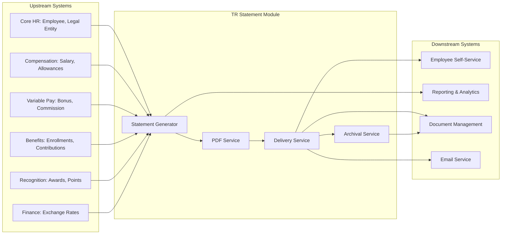

# Business Requirement Document: Total Rewards Statement

## Executive Summary

The Total Rewards Statement sub-module provides comprehensive employee compensation statements that communicate the full value of rewards packages including compensation, benefits, recognition, and variable pay. This BRD defines requirements for **annual + on-demand statement generation**, **multi-channel delivery** (email, self-service portal), **PDF generation**, **statement configuration**, and **7-year archival retention**.

**Key Innovation Decisions**:
- Annual statements + employee-triggered on-demand statements
- Multi-currency support for 6+ Southeast Asian countries
- AI/ML-powered personalized insights and recommendations
- Interactive dashboards with year-over-year comparisons
- 7-year statement archival for compliance and audit

---

## 1. Business Context

### 1.1 Organization Context

Total Rewards (TR) is classified as a **CORE domain** within xTalent HCM, providing comprehensive management of employee compensation, benefits, recognition, and well-being programs. The Total Rewards Statement sub-module serves as the primary communication channel between the organization and employees regarding their complete rewards package.

**Strategic Importance**:
- **Employee Transparency**: Employees understand full value of their compensation package
- **Retention Tool**: Clear communication of rewards reduces turnover
- **Compliance Requirement**: Many jurisdictions require annual compensation statements
- **Employer Branding**: Professional statements enhance company reputation

**Market Context**:
- Oracle HCM, SAP SuccessFactors, and Workday all offer Total Compensation Statements (3/4 competitors)
- Industry standard feature expected by enterprise customers
- Emerging trend: AI-powered personalized insights and recommendations

### 1.2 Current Problem

Organizations face significant challenges in communicating total rewards value to employees:

| Problem | Impact | Affected Stakeholders |
|---------|--------|----------------------|
| **Fragmented Compensation Data** | Employees see only base salary, missing benefits value (30-40% of total comp) | Employees, HR |
| **Manual Statement Generation** | HR spends 40+ hours per cycle creating statements manually | HR Admins |
| **Inconsistent Formatting** | Different departments use different templates, causing confusion | Employees, Compliance |
| **Limited Accessibility** | Paper-only or email-only delivery excludes remote/global workforce | Employees |
| **No Historical Comparison** | Employees cannot see year-over-year rewards growth | Employees |
| **Compliance Risk** | 7-year retention not enforced, audit trail gaps | Legal, Compliance |
| **Multi-Currency Complexity** | Global employees cannot view statements in local currency | International Employees |
| **Static One-Way Communication** | No personalization or contextual insights | Employees |

**Pain Points by Stakeholder**:

**Employees**:
- Cannot see full value of benefits (health insurance, retirement contributions)
- No visibility into recognition awards and spot bonuses
- Cannot compare compensation growth year-over-year
- Difficult to understand complex compensation structures

**HR Administrators**:
- Manual data aggregation from multiple systems (Compensation, Benefits, Recognition)
- Time-consuming PDF generation and distribution
- No standardized template management
- Tracking delivery and employee acknowledgment is manual

**Finance/Compliance**:
- Audit requirements for 7-year retention not automated
- Multi-country disclosure requirements vary by jurisdiction
- No centralized reporting on statement delivery compliance

### 1.3 Business Impact

**Quantified Impact**:

| Metric | Current State | Target State | Improvement |
|--------|---------------|---------------|-------------|
| HR hours per statement cycle | 40-60 hours | 4-6 hours | 90% reduction |
| Employee understanding of total comp | 45% | 85% | 89% increase |
| Statement delivery time | 5-7 business days | Same day | 100% faster |
| Historical statement retrieval | 15-30 minutes | <30 seconds | 99% faster |
| Compliance audit readiness | Manual preparation | Always ready | Continuous compliance |
| Employee satisfaction (rewards clarity) | 3.2/5.0 | 4.5/5.0 | 41% increase |

**ROI Analysis**:
- **Development Investment**: 12-16 weeks (MVP), 20-24 weeks (full innovation)
- **Annual HR Cost Savings**: $150,000+ (reduced manual work for 10,000 employee organization)
- **Employee Value**: Improved retention, reduced payroll inquiries by 30%
- **Compliance Value**: Avoid regulatory penalties (up to $50,000 per violation in some jurisdictions)

### 1.4 Why Now

**Business Drivers**:

1. **Regulatory Momentum**:
   - Vietnam Labor Code 2019 requires transparent compensation communication
   - Singapore Employment Act mandates written payslips (including rewards info)
   - Philippines Labor Code requires statement of earnings
   - Regional trend toward pay transparency (similar to EU Pay Transparency Directive)

2. **Competitive Pressure**:
   - 3/4 major HCM vendors (Oracle, SAP, Workday) offer total compensation statements
   - Table stakes feature for enterprise HCM deals
   - Differentiation opportunity through AI/ML personalization

3. **Employee Experience Expectations**:
   - Modern workforce expects self-service access to compensation data
   - Mobile-first, on-demand access is table stakes
   - Personalization and insights expected by younger demographics

4. **Technical Readiness**:
   - Core Compensation, Benefits, and Recognition modules now available
   - PDF generation infrastructure成熟
   - AI/ML capabilities available for personalization
   - Multi-currency infrastructure in place

5. **Strategic Timing**:
   - Fast-track timeline aligns with Q3 2026 product launch
   - Annual statement cycles typically align with calendar/fiscal year
   - Early 2026 delivery captures FY2027 budget planning cycles

---

## 2. Business Objectives

### 2.1 SMART Objectives Summary

| ID | Objective | Success Metric | Target | Timeline |
|----|-----------|----------------|--------|----------|
| **OBJ-TR-STMT-001** | Comprehensive statement coverage | % of total rewards components included | 100% of 4 pillars | MVP Release |
| **OBJ-TR-STMT-002** | Statement generation efficiency | Time to generate 10,000 statements | <4 hours | MVP Release |
| **OBJ-TR-STMT-003** | Multi-channel delivery | Delivery methods supported | 3+ channels | MVP Release |
| **OBJ-TR-STMT-004** | Employee engagement | Statement view rate within 30 days | >80% | 3 months post-launch |
| **OBJ-TR-STMT-005** | Compliance archival | 7-year retention compliance | 100% | MVP Release |
| **OBJ-TR-STMT-006** | Multi-country support | Countries with localized statements | 6+ countries | Phase 2 |
| **OBJ-TR-STMT-007** | AI personalization | Employees receiving personalized insights | >60% | Phase 2 |

---

### 2.2 Detailed SMART Objectives

#### OBJ-TR-STMT-001: Comprehensive Statement Coverage

**Specific**: Aggregate and display all total rewards components from four pillars: Compensation, Benefits, Recognition, and Variable Pay.

**Measurable**:
- Base Compensation: 100% of salary components (base, allowances, overtime)
- Variable Pay: 100% of bonuses, commissions, equity grants
- Benefits: 100% of employer contributions (health, retirement, insurance)
- Recognition: 100% of monetary and points-based awards

**Achievable**: Data sources available from:
- CompensationAssignment (E-TR-006)
- BenefitEnrollment (E-TR-013)
- RecognitionAward (E-TR-019)
- BonusPlan allocations (E-TR-005)

**Relevant**: Employees cannot appreciate full rewards value without complete visibility.

**Time-bound**: 100% coverage by MVP release (Q2 2026).

---

#### OBJ-TR-STMT-002: Statement Generation Efficiency

**Specific**: Automate statement generation to minimize manual HR effort.

**Measurable**:
- Generate 10,000 statements in <4 hours
- Parallel processing: 100 statements/minute
- Error rate: <0.1% requiring regeneration
- Manual intervention: <1% of statements

**Achievable**: Batch processing architecture, PDF generation service, async queue.

**Relevant**: HR efficiency directly impacts operational costs and cycle time.

**Time-bound**: Performance targets met by MVP release (Q2 2026).

---

#### OBJ-TR-STMT-003: Multi-Channel Delivery

**Specific**: Deliver statements through multiple channels to accommodate diverse employee preferences and accessibility needs.

**Measurable**:
- Email with PDF attachment
- Email with secure portal link
- Self-service portal (web)
- Mobile app access
- Downloadable PDF (password-protected)

**Achievable**: Email service integration, ESS portal, mobile-responsive design.

**Relevant**: Global workforce has varied technology access and preferences.

**Time-bound**: All 5 channels available by MVP release (Q2 2026).

---

#### OBJ-TR-STMT-004: Employee Engagement

**Specific**: Drive high employee engagement with statement viewing and understanding.

**Measurable**:
- 80%+ view rate within 30 days of delivery
- 60%+ download rate
- 40%+ use year-over-year comparison feature
- Employee satisfaction score >4.5/5.0 on rewards clarity

**Achievable**: Email notifications, manager reminders, intuitive UX, mobile access.

**Relevant**: Statements only provide value if employees actually view and understand them.

**Time-bound**: Engagement targets measured 3 months post-launch.

---

#### OBJ-TR-STMT-005: Compliance Archival

**Specific**: Implement 7-year statement retention with audit trail.

**Measurable**:
- 100% of statements retained for 7 years
- Immutable audit log of all access/download events
- Retrieval time <30 seconds for any archived statement
- Data export capability for regulatory audits

**Achievable**: Cloud storage with lifecycle policies, database archival, audit logging.

**Relevant**: Legal requirement in multiple jurisdictions (Vietnam, Singapore, etc.).

**Time-bound**: Archival compliance by MVP release (Q2 2026).

---

#### OBJ-TR-STMT-006: Multi-Country Support

**Specific**: Localize statements for 6+ Southeast Asian countries with country-specific requirements.

**Measurable**:
- Vietnam: Vietnamese language, VND currency, SI/BHYT/BHTN breakdown
- Thailand: Thai language, THB currency
- Indonesia: Indonesian language, IDR currency
- Singapore: English, SGD currency, CPF-like breakdown
- Malaysia: English/Malay, MYR currency
- Philippines: English/Filipino, PHP currency

**Achievable**: Localization framework, currency conversion, configurable templates.

**Relevant**: Multi-national enterprises need country-specific compliance.

**Time-bound**: Phase 2 (Q4 2026) for full 6-country support.

---

#### OBJ-TR-STMT-007: AI Personalization

**Specific**: Leverage AI/ML to provide personalized insights and recommendations.

**Measurable**:
- 60%+ employees receive personalized compensation insights
- 40%+ employees receive benefits optimization recommendations
- 30%+ click-through on AI-suggested actions
- Personalization accuracy >85% (employee feedback)

**Achievable**: ML models analyzing compensation patterns, market benchmarks, employee lifecycle.

**Relevant**: AI differentiation from competitors, enhances employee experience.

**Time-bound**: Phase 2 (Q4 2026) for AI/ML features.

---

## 3. Business Actors

### 3.1 Actors Summary

| Actor | Role | Primary Responsibilities | System Permissions |
|-------|------|--------------------------|-------------------|
| **HR Administrator** | Statement Configurator | Template setup, generation, delivery | Full CRUD on templates, generate, deliver |
| **HR Manager** | Statement Approver | Review and approve before delivery | View, approve, reject |
| **Employee** | Statement Recipient | View, download, compare own statements | Read-only access to own statements |
| **System/Batch** | Automated Generator | Scheduled annual generation | System-triggered generation |
| **Compliance Officer** | Auditor | Verify compliance, audit trails | Read + export all statements |
| **Finance Admin** | Cost Analyst | Analyze rewards cost data | Aggregated analytics access |

---

### 3.2 Detailed Actor Definitions

#### ACTOR-TR-STMT-001: HR Administrator

**Description**: Primary system user responsible for configuring, generating, and distributing Total Rewards Statements.

**Responsibilities**:
- Create and manage statement templates
- Configure statement sections and layout
- Schedule and trigger statement generation
- Manage delivery methods and schedules
- Monitor generation progress and handle errors
- Resend statements to specific employees
- Generate delivery reports

**Permissions**:
| Permission | Scope | Constraint |
|------------|-------|------------|
| Create templates | All templates | Within assigned legal entities |
| Edit templates | Draft templates only | Approved templates require new version |
| Delete templates | Draft templates only | Cannot delete templates with generated statements |
| Generate statements | All employees | Within assigned legal entities |
| Deliver statements | Generated statements | After approval (if workflow enabled) |
| View all statements | All employees | For support/resend purposes |
| Configure templates | Template settings | Branding, sections, calculations |
| Export reports | Delivery reports | For compliance tracking |

**Access Patterns**:
- **Peak Usage**: Annual statement cycles (1-2 times per year)
- **Typical Session**: 2-4 hours for template setup, 30 min for generation monitoring
- **Tools Used**: Template editor, generation dashboard, delivery tracker

---

#### ACTOR-TR-STMT-002: HR Manager

**Description**: Management role responsible for reviewing and approving statements before employee delivery.

**Responsibilities**:
- Review sample statements for accuracy
- Validate calculations and data completeness
- Approve or reject statement batches
- Provide feedback on errors requiring regeneration
- Ensure compliance with company communication standards

**Permissions**:
| Permission | Scope | Constraint |
|------------|-------|------------|
| View pending statements | Batches submitted for review | Only batches assigned for approval |
| Approve statements | Pending approval batches | Cannot approve own generated batches (4-eye principle) |
| Reject statements | Pending approval batches | Must provide rejection reason |
| Request changes | Pending approval batches | With specific feedback |
| View approval history | All batches | For audit purposes |

**Access Patterns**:
- **Peak Usage**: During approval windows (1-2 days per cycle)
- **Typical Session**: 30-60 min for review and approval
- **Tools Used**: Approval dashboard, statement preview

---

#### ACTOR-TR-STMT-003: Employee

**Description**: End recipient of Total Rewards Statements with access to their personal compensation data.

**Responsibilities**:
- Review annual/on-demand statements
- Acknowledge receipt (if required by company policy)
- Understand total rewards value
- Use comparison tools for year-over-year analysis
- Download/print statements for personal records

**Permissions**:
| Permission | Scope | Constraint |
|------------|-------|------------|
| View own statements | Current + historical (7 years) | Own data only |
| Download PDF | Own statements | Password-protected |
| Print statements | Own statements | Watermarked for security |
| Compare years | Own statements | 2+ years required |
| Request on-demand | Own statement | Once per quarter (configurable) |
| Share statements | Export own data | With external parties (e.g., banks) |

**Access Patterns**:
- **Peak Usage**: Within 30 days of annual delivery
- **Typical Session**: 10-15 min per view, 5 min for download
- **Tools Used**: ESS portal, mobile app, email links

---

#### ACTOR-TR-STMT-004: System/Batch

**Description**: Automated system processes that trigger statement generation on scheduled intervals.

**Responsibilities**:
- Execute scheduled annual statement generation
- Process on-demand employee requests
- Retry failed generations
- Archive statements after retention period
- Send automated notifications

**Permissions**:
| Permission | Scope | Constraint |
|------------|-------|------------|
| Trigger generation | Per schedule | Based on template configuration |
| Access employee data | All employees | For statement generation only |
| Generate PDFs | All statements | Using template specifications |
| Send notifications | All employees | Per delivery configuration |
| Archive statements | Statements >7 years | Per retention policy |

**Access Patterns**:
- **Peak Usage**: Scheduled generation windows (typically 1-2 AM local time)
- **Execution Time**: 2-4 hours for 10,000 employees
- **Tools Used**: Batch scheduler, queue processor, notification service

---

#### ACTOR-TR-STMT-005: Compliance Officer

**Description**: Oversight role responsible for ensuring regulatory compliance and managing audits.

**Responsibilities**:
- Verify 7-year statement retention
- Conduct periodic compliance audits
- Export statements for regulatory requests
- Monitor delivery compliance rates
- Investigate access/anomaly reports

**Permissions**:
| Permission | Scope | Constraint |
|------------|-------|------------|
| View all statements | All employees, all time | Read-only |
| Export statements | Bulk export | For audit purposes, logged |
| Access audit logs | All access events | For investigation |
| Generate compliance reports | All metrics | For regulatory submission |
| Verify retention | All archived statements | Confirm 7-year compliance |

**Access Patterns**:
- **Peak Usage**: During audit cycles (quarterly/annually)
- **Typical Session**: 1-2 hours for report generation
- **Tools Used**: Compliance dashboard, export tools

---

#### ACTOR-TR-STMT-006: Finance Admin

**Description**: Finance role analyzing aggregate rewards cost data for budgeting and reporting.

**Responsibilities**:
- Analyze total rewards cost by department/organization
- Generate cost allocation reports
- Support budget planning with historical data
- Monitor rewards spend vs. budget

**Permissions**:
| Permission | Scope | Constraint |
|------------|-------|------------|
| View aggregated data | Department/BU/LE level | No individual employee data |
| Export cost reports | All reports | For financial analysis |
| Access analytics | Rewards cost dashboards | Aggregated only |
| Compare periods | Year-over-year | For trend analysis |

**Access Patterns**:
- **Peak Usage**: Month-end close, budget planning cycles
- **Typical Session**: 1-2 hours for analysis
- **Tools Used**: Analytics dashboard, report exporter

---

## 4. Business Rules

### 4.1 Business Rules Summary

| Category | Count | Examples |
|----------|-------|----------|
| **Validation Rules** | 5 | Template uniqueness, date validation, data completeness |
| **Authorization Rules** | 4 | 4-eye principle, employee data access, export controls |
| **Calculation Rules** | 6 | Total value aggregation, currency conversion, benefits valuation |
| **Constraint Rules** | 5 | On-demand frequency, archival retention, delivery timing |
| **Compliance Rules** | 5 | Statement disclosure, audit logging, data privacy, retention |
| **TOTAL** | **25** | |

---

### 4.2 Validation Rules

#### VAL-TR-STMT-001: Template Code Uniqueness

**Description**: Each statement template must have a unique code identifier.

**Rule**:
```
Template.code MUST be unique across all templates within the same Legal Entity
Template.code MUST follow pattern: [A-Z][A-Z0-9_]{4,29}
Example: ANNUAL_TR_STMT_2025, ONDEMAND_VN_2025
```

**Enforcement**:
- System validates uniqueness on template creation
- Duplicate codes rejected with error message
- Legal Entity scope allows same code in different countries

**Rationale**: Prevents template confusion, enables reliable template selection.

---

#### VAL-TR-STMT-002: Effective Date Validation

**Description**: Statement template effective dates must be logically valid.

**Rule**:
```
Template.effectiveStartDate <= Template.effectiveEndDate (if set)
Template.effectiveStartDate MUST be in the future or today
Template.effectiveEndDate MUST be after effectiveStartDate (if set)
Statement.periodStart < Statement.periodEnd
Statement.generationDate >= Statement.periodEnd
```

**Enforcement**:
- Date validation on template save
- Warning if template becomes effective more than 90 days in future
- Block generation if period dates are invalid

**Rationale**: Prevents date-related data errors and ensures logical statement periods.

---

#### VAL-TR-STMT-003: Minimum Section Requirement

**Description**: Every statement template must include at least one configured section.

**Rule**:
```
Template.sections MUST contain at least 1 section
Each section MUST have:
  - sectionType (COMPENSATION, BENEFITS, RECOGNITION, VARIABLE_PAY, SUMMARY)
  - isVisible (true/false)
  - sortOrder (positive integer)
At least 1 section MUST have isVisible = true
```

**Enforcement**:
- Template activation blocked if no sections configured
- Preview shows warning if all sections are hidden
- Generation fails if no visible sections

**Rationale**: Ensures statements contain meaningful content for employees.

---

#### VAL-TR-STMT-004: Data Completeness Validation

**Description**: Employee statement generation requires complete data from all source systems.

**Rule**:
```
For each employee, generation succeeds only if:
  - Employee has active CompensationAssignment (E-TR-006)
  - Employee has valid currency assignment (from Legal Entity or Assignment)
  - Statement period is valid (employee was employed during period)

Generation proceeds with warnings (not blocking) if:
  - No BenefitEnrollment found (shows $0 benefits value)
  - No RecognitionAward found (shows $0 recognition value)
  - No VariablePay found (shows $0 variable pay)
```

**Enforcement**:
- Pre-generation validation report lists employees with missing data
- Blocking errors prevent generation for affected employees
- Warnings logged but generation continues

**Rationale**: Prevents incomplete statements while allowing partial data scenarios.

---

#### VAL-TR-STMT-005: Currency Conversion Validation

**Description**: Multi-currency statements require valid exchange rates.

**Rule**:
```
For each currency in statement:
  - Exchange rate MUST exist for statement.generationDate
  - Exchange rate source MUST be documented (e.g., Central Bank, Fixer.io)
  - Exchange rate type MUST be specified (spot, average, period-end)

If rate not found:
  - Use most recent available rate (within 7 days)
  - Log warning with rate date used
  - If no rate within 7 days, block generation for that currency
```

**Enforcement**:
- Exchange rate validation during generation setup
- Warning report for rates older than 1 day
- Block generation if no rate within 7 days

**Rationale**: Ensures accurate currency conversion for global employees.

---

### 4.3 Authorization Rules

#### AUTH-TR-STMT-001: Four-Eye Principle for Delivery

**Description**: Statements require approval before delivery to employees.

**Rule**:
```
Statement batch MUST be approved before delivery
Approver CANNOT be the same person who generated the batch
Exception: HR Administrator with both roles can approve own batches
         (requires elevated permission, logged separately)

Approval workflow:
  1. Generator submits batch for review (status = PENDING_REVIEW)
  2. Assigned approver reviews sample statements
  3. Approver approves (status = APPROVED) or rejects (status = REJECTED)
  4. If rejected, generator must fix issues and resubmit
  5. Only APPROVED batches can be delivered
```

**Enforcement**:
- Workflow engine enforces status transitions
- Approver assignment validated against generator
- Audit log records all approval actions

**Rationale**: Prevents erroneous statements from reaching employees, ensures quality control.

---

#### AUTH-TR-STMT-002: Employee Data Access Restriction

**Description**: Employees can only access their own statements.

**Rule**:
```
Employee.canView(statement) = TRUE if and only if:
  - statement.employeeId = employee.id
  - OR employee has delegation (e.g., manager viewing for team member)

Manager.canView(employeeStatement) = TRUE if and only if:
  - employee is in manager's direct or indirect reporting line
  - AND manager has "View Team Statements" permission
  - AND company policy allows manager access

HR.canView(anyStatement) = TRUE if and only if:
  - HR role has "View All Statements" permission
  - Access is for legitimate business purpose (support, compliance)
```

**Enforcement**:
- Row-level security in database queries
- API validates employee ID against authenticated user
- All access logged with user ID and purpose

**Rationale**: Protects sensitive compensation data, ensures privacy compliance.

---

#### AUTH-TR-STMT-003: Export Control

**Description**: Bulk statement export restricted to authorized roles.

**Rule**:
```
Export.statements(scope = BULK) requires:
  - Compliance Officer role
  - OR HR Administrator with "Export" permission
  - OR Finance Admin with "Cost Analysis" permission (aggregated only)

Export MUST include:
  - Export purpose (audit, compliance, analysis)
  - Date range
  - Scope (all employees, department, legal entity)
  - Recipient of exported data

Export automatically:
  - Logs export event with user, timestamp, purpose
  - Notifies Data Protection Officer for large exports (>1000 employees)
  - Applies watermarks to PDFs if exported
```

**Enforcement**:
- Permission check before export initiation
- Export size triggers additional approval (>1000 employees)
- Automated DPO notification for compliance exports

**Rationale**: Prevents unauthorized data exfiltration, supports GDPR/PDPA compliance.

---

#### AUTH-TR-STMT-004: On-Demand Statement Frequency

**Description**: Employee-triggered on-demand statements have frequency limits.

**Rule**:
```
Employee.onDemandRequest() allowed if:
  - Last on-demand statement was > 90 days ago (default)
  - OR employee has pending life event (promotion, transfer)
  - OR manager has approved exception request

Company can configure frequency:
  - Minimum: Once per quarter (90 days)
  - Maximum: Once per month (30 days)
  - Unlimited: For executives (configurable by employee group)

Generation timing:
  - On-demand statements generated within 24 hours of request
  - Employee notified when statement is ready
```

**Enforcement**:
- Request timestamp tracked per employee
- Automatic rejection if frequency limit not met
- Exception workflow for manager approval

**Rationale**: Balances employee access needs with system resource management.

---

### 4.4 Calculation Rules

#### CALC-TR-STMT-001: Total Compensation Aggregation

**Description**: Calculate total compensation from all pay components.

**Rule**:
```
Total Compensation = Base Compensation + Variable Pay

Base Compensation = SUM of all recurring pay components:
  - Base Salary (annualized)
  - Fixed Allowances (housing, transport, meal, etc.)
  - Shift Differentials
  - Overtime (actual year-to-date)

Variable Pay = SUM of all variable pay components:
  - Performance Bonuses (actual paid)
  - Sales Commissions (actual paid)
  - Spot Awards (monetary value)
  - Equity Grants (fair market value at grant date)
  - Other One-time Payments

All amounts converted to employee's local currency using:
  - Exchange rate as of statement generation date
  - Rate type: Period-end spot rate
```

**Rationale**: Comprehensive view of all compensation received by employee.

---

#### CALC-TR-STMT-002: Total Benefits Valuation

**Description**: Calculate total benefits value from employer contributions.

**Rule**:
```
Total Benefits Value = SUM of all employer-paid benefits:

Health & Insurance:
  - Health Insurance (employer portion of premium)
  - Life Insurance (employer cost)
  - Disability Insurance (employer cost)
  - Social Insurance (employer BHXH/BHYT/BHTN contribution)

Retirement:
  - Pension/Provident Fund (employer contribution)
  - 401(k)/Equivalent (employer match)

Other Benefits:
  - Flexible Spending Account (employer contribution)
  - Wellness Program (employer-subsidized portion)
  - Education Assistance (employer-funded amount)

Excluded from calculation:
  - Employee-paid premiums (already deducted from net pay)
  - Benefits employee declined/waived
```

**Rationale**: Shows employees the often-hidden value of employer-provided benefits.

---

#### CALC-TR-STMT-003: Total Recognition Value

**Description**: Calculate total recognition value from awards and points.

**Rule**:
```
Total Recognition Value = SUM of all recognition received:

Monetary Recognition:
  - Spot Awards (cash value, pre-tax)
  - Manager Awards (cash value, pre-tax)
  - Milestone Awards (cash value, pre-tax)
  - Peer-to-Peer Awards (cash value, pre-tax)

Points-Based Recognition:
  - Points Earned (converted to local currency)
  - Conversion Rate: 1 point = [company-defined rate] (e.g., 1 point = $1 USD)
  - Points Redeemed (value of rewards received)
  - Points Balance (remaining, shown separately)

Non-Monetary Recognition:
  - Certificates (not included in monetary total)
  - Public Kudos (shown separately, no monetary value)

All amounts are year-to-date within statement period.
```

**Rationale**: Captures often-overlooked recognition value in total rewards picture.

---

#### CALC-TR-STMT-004: Total Rewards Summary

**Description**: Calculate grand total of all rewards components.

**Rule**:
```
Total Rewards Value = Total Compensation + Total Benefits + Total Recognition

Statement Summary Display:
┌─────────────────────────────────────────┐
│  TOTAL REWARDS SUMMARY                  │
├─────────────────────────────────────────┤
│  Base Compensation       $XX,XXX.XX     │
│  Variable Pay            $XX,XXX.XX     │
│  ───────────────────────────────────    │
│  Subtotal: Compensation  $XX,XXX.XX     │
│                                         │
│  Employer Benefits       $XX,XXX.XX     │
│  Recognition             $X,XXX.XX      │
│  ───────────────────────────────────    │
│  TOTAL REWARDS VALUE     $XX,XXX.XX     │
└─────────────────────────────────────────┘

Additional Metrics:
  - Benefits as % of Total Comp: (Benefits / Compensation) × 100
  - Year-over-Year Change: (Current - Prior) / Prior × 100
  - Market Percentile: Employee's comp vs. market data (if available)
```

**Rationale**: Single, clear number representing full employment value proposition.

---

#### CALC-TR-STMT-005: Year-Over-Year Comparison

**Description**: Calculate changes from previous year's statement.

**Rule**:
```
For each component (Base, Variable, Benefits, Recognition, Total):

Change Amount = Current Year Value - Prior Year Value
Change Percentage = (Change Amount / Prior Year Value) × 100

If Prior Year Value = 0:
  - Change Percentage = "N/A" (new component)
  - Change Amount displayed as absolute value

Display Rules:
  - Positive change: Green color, "+" prefix
  - Negative change: Red color, "-" prefix
  - No change: Gray color, "0%"

Threshold Alerts:
  - Highlight components with >10% change
  - Highlight components with >20% decrease (requires explanation)
```

**Rationale**: Helps employees understand compensation growth and changes.

---

#### CALC-TR-STMT-006: Multi-Currency Conversion

**Description**: Convert all amounts to employee's local currency and display reporting currency.

**Rule**:
```
Primary Currency = Employee's assignment currency (from Legal Entity or Assignment)
Reporting Currency = Company's corporate currency (e.g., USD, SGD)

For each compensation component:
  1. Retrieve amount in original currency
  2. If original != primary: Convert using exchange rate
  3. Display primary currency amount prominently
  4. Display reporting currency in parentheses

Exchange Rate Source Priority:
  1. Company's treasury rate (preferred)
  2. Central Bank rate (fallback)
  3. Fixer.io/OpenExchangeRates (fallback)

Rate Date = Statement generation date (or most recent within 7 days)

Display Format:
  - Local: VND 500,000,000
  - Reporting: (USD 20,000)
```

**Rationale**: Supports global workforce with consistent reporting.

---

### 4.5 Constraint Rules

#### CON-TR-STMT-001: Annual Statement Timing

**Description**: Annual statements follow specific timing constraints.

**Rule**:
```
Annual Statement Schedule:
  - Statement Period: Calendar year (Jan 1 - Dec 31) or Fiscal year
  - Generation Window: Within 30 days after period end
  - Delivery Deadline: Within 45 days after period end
  - Employee Access: Immediate upon delivery

Company can configure:
  - Fiscal year start month (default: January)
  - Generation date (default: First business day after period end)
  - Delivery date (default: 5 business days after generation)

Constraints:
  - Cannot generate for future periods
  - Cannot deliver before approval
  - Cannot modify statements after delivery (regenerate only)
```

**Rationale**: Aligns with typical annual compensation communication cycles.

---

#### CON-TR-STMT-002: On-Demand Statement Timing

**Description**: On-demand statements generated within defined SLA.

**Rule**:
```
On-Demand Request SLA:
  - Request submitted: Employee submits via ESS portal
  - Generation triggered: Within 1 hour of request (batch queue)
  - Statement ready: Within 24 hours of request
  - Notification sent: Immediately upon availability

Generation Constraints:
  - Maximum concurrent on-demand requests: 100 per minute
  - Peak hours (9 AM - 6 PM): Prioritize over batch jobs
  - Off-peak hours: Process in order received

Retry Logic:
  - Failed generation: Retry up to 3 times
  - Final failure: Notify HR Admin for manual intervention
  - Employee notified of delay if >24 hours
```

**Rationale**: Sets clear employee expectations for on-demand access.

---

#### CON-TR-STMT-003: Archival Retention Period

**Description**: Statements retained for minimum 7 years.

**Rule**:
```
Retention Policy:
  - Minimum Retention: 7 years from statement generation date
  - Storage Format: PDF + structured data (JSON)
  - Storage Location: Secure cloud storage with encryption

After 7 years:
  - Statements eligible for archival deletion
  - Deletion requires Compliance Officer approval
  - Deletion logged with approver, date, scope

During Retention:
  - Statements immutable (cannot be modified)
  - All access logged (who, when, what action)
  - Available for employee access and regulatory audit

Exception:
  - Litigation hold: Suspend deletion if legal proceedings active
  - Country-specific: Extend retention if local law requires (e.g., 10 years in some jurisdictions)
```

**Rationale**: Complies with labor law and tax record retention requirements.

---

#### CON-TR-STMT-004: PDF Security Constraints

**Description**: PDF statements must be secured against unauthorized access.

**Rule**:
```
PDF Security Requirements:
  - Password Protection: Required for email attachments
  - Password Format: Employee ID + Date of Birth (DDMMYYYY) OR
                     Company-defined (sent separately via SMS/email)
  - Encryption: 128-bit AES minimum
  - Watermark: Employee name + "Confidential" on each page

Access Controls:
  - PDF cannot be edited (read-only)
  - Printing allowed (with watermark)
  - Copy/paste disabled for sensitive fields (optional)
  - Digital signature for authenticity (optional)

Portal Delivery:
  - Password not required for portal viewing (authenticated session)
  - Download from portal: Password-protected PDF
```

**Rationale**: Protects sensitive compensation data in transit and at rest.

---

#### CON-TR-STMT-005: Statement Immutability After Delivery

**Description**: Delivered statements cannot be modified; errors require regeneration.

**Rule**:
```
Immutability Rules:
  - Status = DELIVERED: Statement is immutable
  - Any change requires:
    1. Mark original as "SUPERSEDED"
    2. Create new version with corrections
    3. Generate new statement with new ID
    4. Notify employee of corrected statement
    5. Link superseded and new statement in audit log

Void Process (if statement should not have been sent):
  1. Mark original as "VOIDED"
  2. Record void reason and approver
  3. Notify employee (if already delivered)
  4. Generate corrected statement if needed

Audit Requirements:
  - Original statement retained (not deleted)
  - Full history of all versions
  - Reason for each regeneration documented
```

**Rationale**: Maintains audit trail, prevents undetected modifications.

---

### 4.6 Compliance Rules

#### COMP-TR-STMT-001: Statement Disclosure Requirements

**Description**: Statements must include mandatory disclosures per country regulations.

**Rule**:
```
Vietnam (per Labor Code 2019):
  - Base salary (monthly and annual)
  - All allowances (housing, transport, meal, etc.)
  - Overtime hours and pay
  - Social insurance contributions (employee + employer)
  - Personal income tax withheld
  - Net pay (take-home)

Singapore (per Employment Act):
  - Period covered
  - Basic salary
  - All allowances separately itemized
  - Deductions (CPF, tax, etc.)
  - Net pay

Indonesia, Malaysia, Philippines:
  - Similar breakdowns per local regulations

Generic Minimum Disclosure:
  - Employee name and ID
  - Statement period
  - All compensation components (itemized)
  - All benefits (employer contributions shown)
  - Total rewards value
  - Currency clearly indicated
```

**Rationale**: Ensures legal compliance across all operating countries.

---

#### COMP-TR-STMT-002: Audit Logging Requirements

**Description**: All statement-related actions must be logged for audit.

**Rule**:
```
Events Requiring Audit Log:
  - Template created/modified/deleted
  - Statement generated (who, when, for how many employees)
  - Statement approved (who, when, decision)
  - Statement delivered (when, method, to whom)
  - Statement viewed (who, when, employee or admin)
  - Statement downloaded (who, when, format)
  - Statement regenerated/voided (reason, who approved)
  - Bulk export (who, when, scope, purpose)

Log Entry Structure:
  - Timestamp (UTC + local timezone)
  - User ID and role
  - Action performed
  - Resource affected (statement ID, employee ID)
  - IP address (for security audit)
  - Result (success/failure)

Retention:
  - Audit logs retained for minimum 10 years
  - Immutable (cannot be modified or deleted)
```

**Rationale**: Supports security audits, regulatory compliance, and incident investigation.

---

#### COMP-TR-STMT-003: Data Privacy Compliance

**Description**: Statement data handling must comply with data privacy regulations.

**Rule**:
```
GDPR/PDPA Requirements:
  - Employee consent required for statement processing
  - Right to access: Employee can download all their statements
  - Right to rectification: Errors corrected via regeneration process
  - Right to erasure: Subject to 7-year retention requirement
  - Data portability: Export in standard format (JSON, CSV)

Data Minimization:
  - Only necessary data included in statements
  - Sensitive data (national ID, bank details) excluded

Encryption:
  - At rest: AES-256 encryption for stored statements
  - In transit: TLS 1.3 for all API calls and email

Access Controls:
  - Role-based access (as defined in Authorization Rules)
  - Multi-factor authentication for admin access
  - Session timeout after 15 minutes of inactivity
```

**Rationale**: Complies with global data privacy regulations, protects employee PII.

---

#### COMP-TR-STMT-004: Delivery Acknowledgment Tracking

**Description**: Track employee acknowledgment of statement receipt.

**Rule**:
```
Acknowledgment Options (company-configurable):
  - Option A: Passive acknowledgment (view = acknowledged)
  - Option B: Active acknowledgment (employee must click "Acknowledge")
  - Option C: No acknowledgment required

Tracking Requirements:
  - Email delivered: Timestamp, email address, delivery status
  - Email opened: Timestamp, IP address (if tracking enabled)
  - Portal viewed: Timestamp, employee ID, session ID
  - PDF downloaded: Timestamp, filename, file size

Reminder Process (if acknowledgment required):
  - First reminder: 7 days after delivery (if not viewed)
  - Second reminder: 14 days after delivery
  - Manager notification: 30 days after delivery (if still not viewed)

Compliance Report:
  - Delivery rate: (Delivered / Generated) × 100
  - View rate: (Viewed / Delivered) × 100
  - Acknowledgment rate: (Acknowledged / Delivered) × 100
```

**Rationale**: Ensures employees actually receive and view their statements.

---

#### COMP-TR-STMT-005: Country-Specific Localization

**Description**: Statements must be localized per country requirements.

**Rule**:
```
Localization Requirements by Country:

Vietnam:
  - Language: Vietnamese (primary), English (optional secondary)
  - Currency: VND (primary), USD (optional secondary)
  - SI Breakdown: BHXH, BHYT, BHTN (employee + employer)
  - Tax: Personal income tax (thue thu nhap)

Thailand:
  - Language: Thai (primary), English (optional)
  - Currency: THB
  - Social Security: SSO contribution breakdown

Indonesia:
  - Language: Indonesian (primary), English (optional)
  - Currency: IDR
  - BPJS: Kesehatan + Ketenagakerjaan

Singapore:
  - Language: English
  - Currency: SGD
  - CPF: Ordinary Account, Special Account, Medisave

Malaysia:
  - Language: English or Malay
  - Currency: MYR
  - EPF/SOCSO: Employee + employer contributions

Philippines:
  - Language: English or Filipino
  - Currency: PHP
  - SSS/PhilHealth/Pag-IBIG: Contributions

Format Standards:
  - Date format: Country-specific (DD/MM/YYYY, MM/DD/YYYY)
  - Number format: Country-specific decimal/thousand separators
  - Currency symbol: Positioned per local convention
```

**Rationale**: Ensures statements are understandable and compliant in each country.

---

## 5. Out of Scope

### 5.1 Explicit Exclusions

| ID | Out of Scope | Rationale | Future Consideration |
|----|--------------|-----------|---------------------|
| **OOS-001** | **Payroll Execution** | Payroll calculation and payment processing handled by Payroll module (PY) | N/A - Separate module |
| **OOS-002** | **Tax Filing & Compliance** | Tax return filing requires specialized tax engine | Phase 3: Tax module integration |
| **OOS-003** | **Real-time Compensation Changes** | Statement reflects historical data, not real-time adjustments | Future: Real-time preview mode |
| **OOS-004** | **External Benchmarking Data** | Market salary benchmarking requires third-party data licensing | Phase 2: Integration with survey providers |
| **OOS-005** | **Financial Advisory Services** | Personalized financial advice requires licensing | Partner with external providers |
| **OOS-006** | **Paper Statement Printing & Mailing** | Physical printing and postal delivery | Partner with print vendors if needed |
| **OOS-007** | **Cryptocurrency Payments** | Crypto salary payment tracking and conversion | Future: Crypto payment support |
| **OOS-008** | **Benefits Carrier Direct Integration** | Real-time sync with insurance carriers | Phase 2: Carrier API integration |
| **OOS-009** | **Stock Option Exercise Processing** | Equity exercise, vesting, and trading | Phase 3: Equity management module |
| **OOS-010** | **Manager View of Team Statements** | Managers viewing detailed team compensation | Future: Aggregated team analytics only |
| **OOS-011** | **Union Reporting Formats** | Specialized union-mandated statement formats | Country-specific future phase |
| **OOS-012** | **Historical Data Migration** | Importing historical statements from legacy systems | One-time migration project (separate) |

---

### 5.2 Scope Boundary Clarifications

**What This Module DOES**:
- Generate comprehensive total rewards statements
- Aggregate data from Compensation, Benefits, Recognition, Variable Pay
- Provide employee self-service access to statements
- Support annual and on-demand statement generation
- Archive statements for 7-year compliance
- Deliver via email and self-service portal
- Provide year-over-year comparison
- Support multi-country, multi-currency localization

**What This Module DOES NOT Do**:
- Calculate compensation (done by Compensation module)
- Process benefit enrollments (done by Benefits module)
- Execute payroll payments (done by Payroll module)
- Provide investment advice on equity
- Replace payslips (different document, different purpose)
- Handle compensation change approvals (done by Compensation module)

---

## 6. Assumptions & Dependencies

### 6.1 Assumptions

| ID | Assumption | Category | Impact if Invalid | Mitigation |
|----|------------|----------|-------------------|------------|
| **ASSUMP-001** | Core Compensation data available and accurate | Data Quality | HIGH - Cannot generate statements without comp data | Data validation pre-generation, error reporting |
| **ASSUMP-002** | Benefits enrollment data available for all countries | Data Quality | MEDIUM - Benefits value may be incomplete | Show $0 or "Not Available" with explanation |
| **ASSUMP-003** | Recognition module deployed in same timeline | Dependency | MEDIUM - Recognition section missing at launch | Phase recognition features, launch without |
| **ASSUMP-004** | Exchange rates available from treasury system | Technical | MEDIUM - Multi-currency conversion affected | Fallback to public exchange rate APIs |
| **ASSUMP-005** | PDF generation service can handle 10K+ documents/hour | Performance | HIGH - Generation SLA not met | Load testing, horizontal scaling, queue management |
| **ASSUMP-006** | Employees have access to ESS portal or email | Infrastructure | LOW - Delivery channel limited | Support multiple delivery methods |
| **ASSUMP-007** | 7-year cloud storage cost is acceptable | Financial | MEDIUM - Budget overrun | Tiered storage (hot/cold/archive) |
| **ASSUMP-008** | Legal/Compliance teams will provide country requirements | Business | HIGH - Non-compliance risk | Engage early, use external counsel if needed |
| **ASSUMP-009** | AI/ML models for personalization can achieve >85% accuracy | Technical | MEDIUM - Innovation objective not met | Start with rule-based personalization, iterate |
| **ASSUMP-010** | Employees will engage with statements (>80% view rate) | Adoption | MEDIUM - Value not realized | Manager reminders, communication campaigns |

---

### 6.2 Dependencies

#### 6.2.1 Upstream Dependencies (Inputs We Consume)

| Dependency | Source Module | Data Consumed | Criticality | Risk if Unavailable |
|------------|---------------|---------------|-------------|---------------------|
| **Employee Master Data** | Core HR (CO) | Employee ID, name, job, department, employment status | CRITICAL | Cannot generate statements |
| **Compensation Assignment** | Compensation (TR-COMP) | Base salary, allowances, currency, pay grade | CRITICAL | Core content missing |
| **Bonus/Variable Pay** | Variable Pay (TR-VAR) | Bonus amounts, commission, equity grants | HIGH | Variable pay section incomplete |
| **Benefit Enrollments** | Benefits (TR-BEN) | Health, retirement, insurance enrollments | HIGH | Benefits value inaccurate |
| **Recognition Awards** | Recognition (TR-REC) | Spot awards, peer recognition, milestones | MEDIUM | Recognition section affected |
| **Legal Entity Data** | Core HR (CO) | Country, currency, company details | CRITICAL | Localization fails |
| **Exchange Rates** | Finance (FI) | Currency conversion rates | HIGH | Multi-currency fails |
| **Performance Ratings** | Performance (PM) | Performance rating for context | LOW | Personalization limited |

---

#### 6.2.2 Downstream Dependencies (Others Consuming From Us)

| Dependency | Consumer Module | Data Provided | Criticality | Impact if We Fail |
|------------|-----------------|---------------|-------------|-------------------|
| **Statement Data** | Reporting & Analytics (RPT) | Aggregated rewards metrics | MEDIUM | Analytics dashboards affected |
| **Delivery Status** | Core HR (CO) | Employee communication audit trail | LOW | HR audit incomplete |
| **Total Rewards Cost** | Finance (FI) | Cost allocation data | MEDIUM | Finance reporting delayed |
| **Acknowledgment Data** | Compliance (GRC) | Compliance evidence | HIGH | Audit findings possible |
| **Statement PDFs** | Document Management (DMS) | Long-term archival | MEDIUM | 7-year retention at risk |

---

#### 6.2.3 Technical Dependencies

| Dependency | Type | Version/Standard | Criticality | Fallback Option |
|------------|------|------------------|-------------|-----------------|
| **PDF Generation Service** | External Service | PDFKit, iText, or equivalent | CRITICAL | Queue and retry, manual generation |
| **Email Service** | External Service | SMTP, SendGrid, SES | HIGH | Portal-only delivery |
| **Cloud Storage** | Infrastructure | AWS S3, Azure Blob, GCP Cloud Storage | CRITICAL | Temporary local storage |
| **Exchange Rate API** | External Service | Fixer.io, OpenExchangeRates, or treasury feed | MEDIUM | Manual rate upload |
| **Authentication Service** | Internal Service | OAuth 2.0, SAML, OIDC | CRITICAL | No workaround (blocked) |
| **ESS Portal** | Internal System | Web portal, mobile app | HIGH | Email-only delivery |

---

#### 6.2.4 Integration Points



---

### 6.3 Impact Analysis

#### High-Impact Risks

| Risk | Probability | Impact | Mitigation Strategy | Contingency |
|------|-------------|--------|---------------------|-------------|
| **Compensation data not available by MVP date** | MEDIUM | HIGH | Early integration testing, mock data for development | Delay MVP, launch with limited scope |
| **PDF generation cannot meet performance SLA** | LOW | HIGH | Load testing at 2x expected volume, horizontal scaling | Stagger generation over multiple days |
| **Country legal requirements change** | MEDIUM | HIGH | Engage legal counsel early, build flexible template engine | Emergency template updates |
| **Exchange rate service unavailable** | LOW | MEDIUM | Multiple rate source fallbacks, manual upload capability | Use last available rate (with disclosure) |

---

### 6.4 Timeline Dependencies

| Milestone | Dependent On | Target Date | Risk Level |
|-----------|--------------|-------------|------------|
| **Template Engine Complete** | UI Framework, Design System | Week 4 | LOW |
| **Core Integration Testing** | Compensation, Benefits modules | Week 8 | MEDIUM |
| **PDF Generation Testing** | PDF Service, Template Engine | Week 10 | MEDIUM |
| **Multi-Country Localization** | Legal Requirements, Translations | Week 12 | HIGH |
| **Performance Testing** | Infrastructure, Test Data | Week 14 | MEDIUM |
| **UAT with HR Stakeholders** | All Features Complete | Week 16 | MEDIUM |
| **MVP Launch** | UAT Sign-off, Compliance Review | Week 18 | HIGH |
| **Phase 2 (AI/ML)** | Model Training, Data Pipeline | Week 26 | HIGH |

---

## Appendices

### Appendix A: Cross-Reference to Input Documents

| BRD Section | Research Report | Entity Catalog | Feature Catalog | Functional Requirements |
|-------------|-----------------|----------------|-----------------|------------------------|
| Business Context | Executive Summary, Strategic Value | - | FR-TR-031 | - |
| Business Objectives | Strategic Insights, Best Practices | E-TR-021 | FR-TR-031 | FR-TR-STMT-001 to 008 |
| Business Actors | - | E-TR-021 relationships | - | Implicit in user stories |
| Business Rules | Regulatory Matrix | E-TR-021 lifecycle | FR-TR-031 rules | BR-TR-STMT-001 to 024 |
| Out of Scope | Explicit Non-Goals section | - | - | - |
| Dependencies | Cross-Domain Dependencies | E-TR-021 dependencies | FR-TR-031 dependencies | All module dependencies |

---

### Appendix B: Glossary

| Term | Definition |
|------|------------|
| **Total Rewards** | Comprehensive view of all compensation, benefits, recognition, and development |
| **Statement Template** | Configurable layout and content structure for generating statements |
| **On-Demand Statement** | Employee-triggered statement generation outside of annual cycle |
| **Annual Statement** | Once-per-year comprehensive statement for all active employees |
| **ESS Portal** | Employee Self-Service web portal for viewing statements |
| **Four-Eye Principle** | Approval workflow requiring different person for generation and approval |
| **Localization** | Country-specific customization for language, currency, and compliance |

---

### Appendix C: Document History

| Version | Date | Author | Changes |
|---------|------|--------|---------|
| 1.0.0 | 2026-03-20 | Product Management | Initial BRD draft |
| - | - | - | Pending review and approval |

---

## Approval Sign-Off

| Role | Name | Signature | Date |
|------|------|-----------|------|
| Product Owner | | | |
| HR Director | | | |
| Architecture Review Board | | | |
| Compliance Officer | | | |
| Engineering Lead | | | |

---

*End of Business Requirement Document: Total Rewards Statement*
