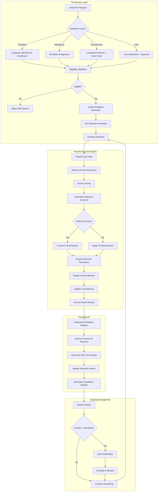

# Business Requirements Document: Deductions Sub-Module

## Executive Summary

The Deductions sub-module is a **CRITICAL compliance and operational component** of the Total Rewards module, responsible for managing all payroll deductions including:
- **Employee Loans**: Company-provided loans with amortization schedules
- **Garnishments**: Court-ordered deductions (child support, tax levies, creditor claims)
- **Salary Advances**: Short-term advances recovered through payroll
- **Voluntary Deductions**: Union dues, charity contributions, benefit premiums
- **Mandatory Deductions**: Social insurance, union dues (where applicable)

**Key Architecture Decision**: Total Rewards = **Decision Layer** (deduction rules, eligibility, authorization) | Payroll = **Execution Engine** (calculation, payment, remittance)

This BRD follows the **ODSA Reality Layer** standard, capturing business context, objectives, actors, rules, scope boundaries, and assumptions for a multi-country Southeast Asia deployment (6+ countries: Vietnam, Thailand, Indonesia, Singapore, Malaysia, Philippines).

---

## 1. Business Context

### 1.1 Organization Context

**xTalent Total Rewards Platform** serves multi-national enterprises operating across Southeast Asia with employees in 6+ countries. The Deductions sub-module is essential for:
- Managing employee financial relationships with the company (loans, advances)
- Complying with legal obligations (garnishments, statutory deductions)
- Supporting employee benefits (insurance premiums, union dues)
- Enabling voluntary programs (charity, savings plans)

**Current Architecture Position**:
- **Upstream**: Core HR (employee data), TR Decision Layer (deduction rules, authorization)
- **Downstream**: Payroll (execution), Finance (GL posting), Third Parties (remittance)
- **Lateral**: Legal/Compliance (garnishment orders), Benefits (premium deductions)

### 1.2 Current Problem

| Problem Area | Current State (Legacy/Manual) | Pain Points |
|--------------|-------------------------------|-------------|
| **Loan Management** | Spreadsheet-based tracking, manual payroll coordination | Errors in amortization, missed payments, no visibility into outstanding balances |
| **Garnishments** | Paper-based court orders, manual calculation | Compliance risk, calculation errors, missed deadlines, legal penalties |
| **Salary Advances** | Ad-hoc approvals, inconsistent recovery | Cash flow issues, employee disputes, reconciliation problems |
| **Deduction Priority** | Hardcoded in payroll, no configuration | Cannot handle country-specific priority rules, compliance violations |
| **Insufficient Funds** | Manual handling, inconsistent approach | Employee relations issues, arrears tracking gaps, audit failures |
| **Multi-Country Compliance** | Country-specific workarounds | High maintenance, inconsistent employee experience, regulatory risk |
| **Third-Party Remittance** | Manual reconciliation, separate payments | Late payments, penalties, vendor disputes, audit complexity |
| **Reporting & Analytics** | Manual data aggregation | No real-time visibility, compliance reporting burden, audit preparation delays |

### 1.3 Business Impact

**Quantified Impact** (based on enterprise customer benchmarks):

| Impact Category | Current State | Target State | Improvement |
|-----------------|---------------|--------------|-------------|
| Deduction Processing Errors | 3-5% error rate | <0.5% error rate | 90% reduction |
| Garnishment Compliance Risk | High (manual tracking) | Low (automated enforcement) | Risk eliminated |
| Loan Arrears Visibility | 30-60 days lag | Real-time | Immediate action |
| Payroll Processing Time | 4-6 hours per cycle | 1-2 hours per cycle | 60% reduction |
| Reconciliation Effort | 8-16 hours per month | 2-4 hours per month | 75% reduction |
| Audit Preparation | 40-80 hours per audit | 8-16 hours per audit | 80% reduction |
| Third-Party Disputes | 5-10 per quarter | <2 per quarter | 80% reduction |

**Strategic Impact**:
- **Compliance Risk**: Garnishment errors can result in legal penalties (up to 10% of deduction amount in some jurisdictions)
- **Employee Trust**: Deduction errors directly impact employee take-home pay, affecting trust and engagement
- **Operational Efficiency**: Manual deduction management consumes 15-20% of payroll team capacity
- **Cash Flow**: Untracked loan arrears can represent significant outstanding amounts (typical range: 0.5-2% of annual payroll)

### 1.4 Why Now

**Regulatory Drivers**:
| Country | Regulation | Timeline | Impact |
|---------|------------|----------|--------|
| **Vietnam** | Labor Code 2019, SI Law 2024 | Effective Jul 2025 | Mandatory SI deduction changes |
| **Thailand** | Social Security Act amendments | 2026 | Updated contribution rates |
| **Singapore** | CPF contribution changes | Annual | Configurable rate updates required |
| **Philippines** | Tax Reform Act (TRAIN) | Ongoing | Tax withholding integration |
| **Indonesia** | BPJS Health/Employment | Ongoing | Mandatory benefit deductions |
| **Malaysia** | EPF/SOCSO updates | Annual | Rate and threshold changes |

**Business Drivers**:
1. **Multi-Country Expansion**: Customers expanding across SEA need unified deduction management
2. **Payroll Modernization**: Legacy payroll systems cannot handle complex deduction scenarios
3. **Employee Experience**: Self-service deduction enrollment expected by modern workforce
4. **AI/ML Opportunity**: Loan risk assessment, default prediction, optimization of deduction sequencing
5. **Competitive Parity**: Oracle HCM, Workday, SAP SuccessFactors all have advanced deduction management

**Technology Drivers**:
1. **Microservices Architecture**: Deductions as independent service enables flexible deployment
2. **Event-Driven Processing**: Real-time deduction triggers (loan approval, garnishment order received)
3. **Configurable Rule Engine**: Country-specific rules without code changes
4. **API-First Integration**: Seamless payroll, finance, third-party connections

---

## 2. Business Objectives

### SMART Objectives Summary

| ID | Objective | Success Metric | Target | Timeline |
|----|-----------|----------------|--------|----------|
| **BO-DED-001** | Automate garnishment processing with 100% compliance enforcement | Garnishment calculation accuracy, on-time remittance rate | 100% compliance, <1% error rate | Q2 2026 |
| **BO-DED-002** | Enable self-service loan applications with AI-powered risk assessment | Loan application turnaround, default rate prediction accuracy | <24 hr approval, >85% prediction accuracy | Q3 2026 |
| **BO-DED-003** | Support 6+ country deduction rules with configurable priority sequencing | Country coverage, configuration time for new rules | 6 countries, <1 day per new rule | Q2 2026 |
| **BO-DED-004** | Reduce deduction processing errors by 90% through automation | Error rate per payroll cycle | <0.5% error rate | Q2 2026 |
| **BO-DED-005** | Achieve 75% reduction in reconciliation effort through automated third-party reporting | Reconciliation hours per month | <4 hours per month | Q3 2026 |
| **BO-DED-006** | Enable real-time loan arrears visibility with proactive notifications | Arrears tracking lag, collection rate improvement | Real-time, +20% collection rate | Q2 2026 |
| **BO-DED-007** | Support 5+ deduction schedule types (one-time, recurring, installment, conditional, arrears) | Schedule type coverage | 5 types supported | Q2 2026 |
| **BO-DED-008** | Achieve 95% employee satisfaction with deduction self-service experience | Employee satisfaction score (NPS) | NPS >50 | Q3 2026 |

### Detailed Objectives

#### BO-DED-001: Automate Garnishment Processing

**Specific**: Implement automated garnishment management for court-ordered deductions including child support, tax levies, creditor garnishments, and student loans.

**Measurable**:
- 100% of garnishments processed with correct priority order
- <1% calculation errors
- 100% on-time remittance to agencies
- Federal/state garnishment limits automatically enforced

**Achievable**: Based on Workday, Oracle HCM capabilities (market parity)

**Relevant**: Garnishment compliance is legally mandatory with penalties for errors

**Time-Bound**: Q2 2026 (6 months from requirements sign-off)

#### BO-DED-002: Enable Self-Service Loan Applications

**Specific**: Provide employee self-service for loan requests with AI/ML-powered risk assessment and automated amortization schedule generation.

**Measurable**:
- Loan application turnaround <24 hours
- AI default prediction accuracy >85%
- 80% of loans processed without manual intervention
- Employee satisfaction >4.5/5.0

**Achievable**: Leverages existing ML models from fintech partners

**Relevant**: Employee financial wellness is strategic priority, reduces administrative burden

**Time-Bound**: Q3 2026 (9 months, includes ML model training)

#### BO-DED-003: Support 6+ Country Deduction Rules

**Specific**: Configure country-specific deduction rules for Vietnam, Thailand, Indonesia, Singapore, Malaysia, Philippines with local compliance requirements.

**Measurable**:
- 6 countries live with local rules
- <1 day to configure new deduction rule
- 100% of statutory deductions automated
- Country-specific priority order configurable

**Achievable**: Rule engine architecture supports configuration over customization

**Relevant**: Multi-country support is key differentiator for regional enterprises

**Time-Bound**: Q2 2026 (concurrent with garnishment processing)

#### BO-DED-004: Reduce Deduction Errors by 90%

**Specific**: Automate deduction calculation, validation, and processing to eliminate manual errors.

**Measurable**:
- Error rate reduced from 3-5% to <0.5%
- Deduction validation catches 100% of invalid amounts
- Zero duplicate deductions
- 100% audit trail for all deduction changes

**Achievable**: Automation eliminates common error sources (data entry, calculation, missed deductions)

**Relevant**: Deduction errors directly impact employee trust and compliance

**Time-Bound**: Q2 2026 (measured 3 months after go-live)

#### BO-DED-005: Reduce Reconciliation Effort by 75%

**Specific**: Automate third-party reconciliation with remittance reports, payment vouchers, and reconciliation status tracking.

**Measurable**:
- Reconciliation time reduced from 8-16 hours to <4 hours per month
- 100% of deductions reconciled monthly
- <2 vendor disputes per quarter
- Automated export to payment systems

**Achievable**: Based on Workday, Oracle HCM benchmarks

**Relevant**: Reconciliation is high-effort, low-value activity

**Time-Bound**: Q3 2026 (after core processing is stable)

#### BO-DED-006: Real-Time Loan Arrears Visibility

**Specific**: Track loan arrears in real-time with automated notifications, collection workflows, and escalation management.

**Measurable**:
- Arrears visibility in real-time (no lag)
- 20% improvement in collection rate
- 100% of overdue payments notified within 24 hours
- Arrears reports available on-demand

**Achievable**: Event-driven architecture enables real-time tracking

**Relevant**: Untracked arrears represent financial risk

**Time-Bound**: Q2 2026 (core processing requirement)

#### BO-DED-007: Support 5+ Deduction Schedule Types

**Specific**: Configure flexible deduction schedules including one-time, recurring, installment-based, conditional, and arrears-driven deductions.

**Measurable**:
- 5 schedule types supported: One-time, Recurring, Installment, Conditional, Arrears
- 100% of deduction scenarios covered
- Schedule changes processed within 1 pay period
- Pro-rated deductions calculated accurately

**Achievable**: Schedule engine is standard payroll capability

**Relevant**: Different deduction types require different timing

**Time-Bound**: Q2 2026 (core processing requirement)

#### BO-DED-008: Achieve 95% Employee Satisfaction

**Specific**: Provide intuitive self-service experience for deduction enrollment, modification, and tracking.

**Measurable**:
- Employee NPS >50 for deduction self-service
- <5% of deductions require HR assistance
- Mobile-friendly enrollment completion rate >90%
- Average enrollment time <5 minutes

**Achievable**: Modern UX patterns from consumer fintech

**Relevant**: Employee experience is strategic differentiator

**Time-Bound**: Q3 2026 (measured after 3 months of usage)

---

## 3. Business Actors

### Actor Summary

| Actor | Role | Key Responsibilities | Access Level |
|-------|------|---------------------|--------------|
| **HR Administrator** | Deduction configuration, rule management | Define deduction types, configure rules, assign mandatory deductions | Full admin |
| **Payroll Administrator** | Deduction processing, reconciliation | Process deductions, handle exceptions, reconcile third parties | Processing admin |
| **Employee** | Self-service enrollment, loan applications | Enroll in voluntary deductions, apply for loans, view deduction history | Self-service |
| **Manager** | Loan approval, team deduction oversight | Approve/deny loan requests, view team deduction summary | Approval authority |
| **Finance Administrator** | Remittance, GL reconciliation | Generate payment vouchers, post to GL, reconcile payments | Finance access |
| **Compliance Officer** | Garnishment compliance, audit | Review garnishment compliance, generate audit reports | Read-only + audit |
| **System Integrator** | Third-party API management | Configure API connections, monitor integration health | Technical admin |

### Detailed Actor Definitions

#### ACT-DED-001: HR Administrator

**Description**: HR professionals responsible for configuring and managing deduction rules, types, and employee assignments.

**Permissions**:
| Permission | Scope | Restrictions |
|------------|-------|--------------|
| Create/Modify Deduction Types | All types | Cannot override statutory limits |
| Configure Deduction Rules | All rules | Must comply with legal requirements |
| Assign Mandatory Deductions | All employees | Requires documented authorization |
| View All Employee Deductions | All employees | PII access logged for audit |
| Activate/Deactivate Deductions | All deductions | Cannot deactivate active garnishments |
| Generate Deduction Reports | All reports | Export requires additional approval |

**Responsibilities**:
- Define deduction types (voluntary, mandatory, garnishment, loan)
- Configure eligibility rules and calculation methods
- Assign mandatory deductions to eligible employees
- Review and approve deduction exceptions
- Maintain deduction compliance across countries

**Use Cases**:
- UC-DED-001: Create new deduction type (e.g., charity contribution)
- UC-DED-002: Configure garnishment priority rules per country
- UC-DED-003: Assign social insurance to new hire
- UC-DED-004: Bulk update deduction rates for annual changes

#### ACT-DED-002: Payroll Administrator

**Description**: Payroll professionals responsible for processing deductions during payroll cycles and reconciling third-party payments.

**Permissions**:
| Permission | Scope | Restrictions |
|------------|-------|--------------|
| Process Deductions | Current payroll cycle | Cannot process prior periods without approval |
| Preview Deductions | All employees | Preview only, no modifications |
| Override Deduction Amounts | Individual deductions | Requires reason code, manager approval |
| Exclude Deductions | Specific deductions | Temporary only, auto-reinstate next cycle |
| Generate Remittance Reports | All deduction types | Export to finance systems |
| Mark Reconciled | Third-party payments | Cannot unmark without reversal |
| View Arrears | All employees | Collection workflow access |

**Responsibilities**:
- Execute deduction processing during payroll cycles
- Review deduction preview for anomalies
- Handle insufficient funds scenarios
- Generate and submit remittance reports
- Reconcile third-party payments
- Manage arrears collection workflows

**Use Cases**:
- UC-DED-005: Process monthly deductions for payroll
- UC-DED-006: Handle insufficient funds for loan repayment
- UC-DED-007: Generate garnishment remittance report
- UC-DED-008: Reconcile insurance premium deductions

#### ACT-DED-003: Employee

**Description**: Individual contributors who are subject to deductions and can enroll in voluntary programs.

**Permissions**:
| Permission | Scope | Restrictions |
|------------|-------|--------------|
| View Own Deductions | Personal only | Cannot view others' deductions |
| Enroll in Voluntary Deductions | Eligible deductions only | Subject to eligibility rules |
| Modify Deduction Amount | Voluntary deductions only | Changes effective next period |
| Cancel Voluntary Deductions | Personal enrollments | Notice period may apply |
| Apply for Loans | Company loan programs | Subject to approval workflow |
| View Loan Balance | Personal loans only | Read-only access |
| Download Deduction History | Personal records | PDF export available |

**Responsibilities**:
- Review deduction assignments for accuracy
- Enroll in voluntary deductions as desired
- Maintain accurate beneficiary information
- Repay loans per agreed schedule
- Report changes affecting deduction eligibility

**Use Cases**:
- UC-DED-009: Enroll in charity contribution program
- UC-DED-010: Apply for emergency salary advance
- UC-DED-011: View current loan balance and payment history
- UC-DED-012: Modify union dues deduction amount

#### ACT-DED-004: Manager

**Description**: People managers who approve loan requests and have visibility into team deduction summaries.

**Permissions**:
| Permission | Scope | Restrictions |
|------------|-------|--------------|
| View Team Deduction Summary | Direct reports only | Aggregate data, no individual details |
| Approve/Deny Loan Requests | Direct reports only | Within delegated authority limit |
| Escalate Loan Requests | Higher amount loans | Route to senior management |
| View Team Arrears Summary | Direct reports only | For collection follow-up |
| Receive Arrears Notifications | Direct reports only | For management action |

**Responsibilities**:
- Review and approve loan requests within authority
- Escalate high-value loans appropriately
- Follow up on team member arrears when notified
- Ensure team members understand deduction options

**Use Cases**:
- UC-DED-013: Approve employee salary advance request
- UC-DED-014: Escalate large loan request to senior management
- UC-DED-015: Review team arrears summary for follow-up

#### ACT-DED-005: Finance Administrator

**Description**: Finance team members responsible for remittance payments, GL posting, and reconciliation.

**Permissions**:
| Permission | Scope | Restrictions |
|------------|-------|--------------|
| Generate Payment Vouchers | All deduction types | For payment processing |
| Post to GL | Deduction transactions | Mapped GL accounts only |
| Reconcile Payments | Third-party payments | Mark as reconciled |
| Export Remittance Files | All types | For external payment systems |
| View Outstanding Balances | All types | For cash flow planning |
| Generate Finance Reports | All reports | Audit trail included |

**Responsibilities**:
- Generate payment vouchers for third-party remittance
- Post deduction transactions to general ledger
- Reconcile payments with third-party confirmations
- Monitor outstanding deduction liabilities
- Ensure timely payment to avoid penalties

**Use Cases**:
- UC-DED-016: Generate monthly garnishment payment vouchers
- UC-DED-017: Post deduction transactions to GL
- UC-DED-018: Reconcile insurance premium payments with carrier statements

#### ACT-DED-006: Compliance Officer

**Description**: Legal/compliance professionals responsible for garnishment compliance and audit preparation.

**Permissions**:
| Permission | Scope | Restrictions |
|------------|-------|--------------|
| View Garnishment Compliance | All garnishments | Read-only access |
| Generate Audit Reports | All deductions | Full audit trail |
| Review Deduction Limits | Statutory deductions | Compliance verification |
| Access Court Order Documents | Garnishment records | Document management |
| Generate Regulatory Reports | Required filings | Export for submission |

**Responsibilities**:
- Monitor garnishment compliance across jurisdictions
- Prepare for and support deduction audits
- Ensure statutory deduction limits are enforced
- Maintain court order documentation
- Generate regulatory compliance reports

**Use Cases**:
- UC-DED-019: Review garnishment compliance dashboard
- UC-DED-020: Generate audit trail for labor department audit
- UC-DED-021: Verify garnishment limits are enforced

#### ACT-DED-007: System Integrator

**Description**: Technical administrators responsible for third-party API integrations and system connectivity.

**Permissions**:
| Permission | Scope | Restrictions |
|------------|-------|--------------|
| Configure API Connections | All integrations | Requires credentials approval |
| Monitor Integration Health | All endpoints | Alert configuration |
| View API Logs | Transaction logs | Debug and troubleshooting |
| Manage Webhooks | Event subscriptions | For real-time integrations |
| Test Integration Endpoints | Sandbox environment | Production access restricted |

**Responsibilities**:
- Configure and maintain third-party API connections
- Monitor integration health and resolve issues
- Manage webhook subscriptions for real-time events
- Support troubleshooting for integration failures
- Document integration configurations

**Use Cases**:
- UC-DED-022: Configure payroll system API connection
- UC-DED-023: Set up webhook for loan approval events
- UC-DED-024: Troubleshoot failed remittance file export

---

## 4. Business Rules

### Business Rules Summary

| Category | Count | Rule IDs |
|----------|-------|----------|
| **Validation Rules** | 5 | BR-DED-V001 to BR-DED-V005 |
| **Authorization Rules** | 3 | BR-DED-A001 to BR-DED-A003 |
| **Calculation Rules** | 5 | BR-DED-C001 to BR-DED-C005 |
| **Constraint Rules** | 3 | BR-DED-K001 to BR-DED-K003 |
| **Compliance Rules** | 4 | BR-DED-L001 to BR-DED-L004 |
| **Total** | **20** | |

---

### 4.1 Validation Rules

| ID | Rule Name | Description | Condition | Action |
|----|-----------|-------------|-----------|--------|
| **BR-DED-V001** | Deduction Code Uniqueness | Deduction type codes must be unique across the system | When creating/updating deduction type, code already exists | Reject with error: "Deduction code must be unique" |
| **BR-DED-V002** | Amount Range Validation | Minimum deduction amount must be less than or equal to maximum | min_amount > max_amount | Reject with error: "Minimum amount cannot exceed maximum" |
| **BR-DED-V003** | Percentage Range Validation | Deduction percentage must be between 0 and 100 | percentage < 0 OR percentage > 100 | Reject with error: "Percentage must be between 0 and 100" |
| **BR-DED-V004** | Employee Deduction Limit | Total deductions cannot exceed employee's available pay | sum(deductions) > available_pay | Flag for review, allow override with approval |
| **BR-DED-V005** | Garnishment Document Required | Court order documentation required for garnishment creation | garnishment.type IN (CHILD_SUPPORT, TAX_LEVY, CREDITOR) AND document IS NULL | Reject with error: "Court order document is required" |

**Detailed Specifications**:

#### BR-DED-V001: Deduction Code Uniqueness

**Purpose**: Ensure each deduction type can be uniquely identified for reporting, integration, and audit purposes.

**Scope**: All deduction types (voluntary, mandatory, garnishment, loan)

**Implementation**:
```
ON CREATE DeductionType:
  IF EXISTS (SELECT 1 FROM DeductionType WHERE code = NEW.code):
    RAISE ERROR "Deduction code '{code}' already exists"

ON UPDATE DeductionType:
  IF EXISTS (SELECT 1 FROM DeductionType WHERE code = NEW.code AND id != NEW.id):
    RAISE ERROR "Deduction code '{code}' already exists"
```

**Example**:
- Valid: `UNION_DUES_VN`, `UNION_DUES_TH` (different codes)
- Invalid: Attempting to create duplicate `SSS_PH` for Philippines

**Related Requirements**: FR-TR-DED-001 (Deduction Type Setup)

---

#### BR-DED-V002: Amount Range Validation

**Purpose**: Prevent illogical deduction configurations that would cause processing errors.

**Scope**: All deduction types with min/max amount configuration

**Implementation**:
```
ON CREATE/UPDATE DeductionType:
  IF NEW.min_amount IS NOT NULL AND NEW.max_amount IS NOT NULL:
    IF NEW.min_amount > NEW.max_amount:
      RAISE ERROR "Minimum amount ({min}) cannot exceed maximum amount ({max})"
```

**Example**:
- Valid: min=100, max=5000
- Invalid: min=5000, max=1000

**Related Requirements**: FR-TR-DED-001 (Deduction Type Setup)

---

#### BR-DED-V003: Percentage Range Validation

**Purpose**: Ensure percentage-based deductions are mathematically valid.

**Scope**: Deduction types using PERCENTAGE calculation method

**Implementation**:
```
ON CREATE/UPDATE DeductionRule:
  IF NEW.calculation_method = 'PERCENTAGE':
    IF NEW.percentage < 0 OR NEW.percentage > 100:
      RAISE ERROR "Percentage must be between 0 and 100, got {percentage}%"
```

**Example**:
- Valid: 5%, 25%, 100%
- Invalid: -5%, 150%

**Related Requirements**: FR-TR-DED-002 (Deduction Rule Configuration)

---

#### BR-DED-V004: Employee Deduction Limit

**Purpose**: Prevent total deductions from exceeding employee's available pay, which would result in negative net pay.

**Scope**: All employee deductions processed in a payroll cycle

**Implementation**:
```
ON PROCESS Deductions:
  available_pay = gross_pay - statutory_deductions
  total_deductions = SUM(active_deductions)

  IF total_deductions > available_pay:
    FLAG_FOR_REVIEW "Total deductions exceed available pay"
    ALLOW_OVERRIDE_WITH_APPROVAL()
```

**Example**:
- Gross Pay: 10,000,000 VND
- Statutory Deductions (SI, HI, UI): 1,050,000 VND
- Available Pay: 8,950,000 VND
- Requested Deductions: 9,500,000 VND
- **Result**: Flag for review, requires payroll manager approval

**Related Requirements**: FR-TR-DED-005 (Deduction Processing)

---

#### BR-DED-V005: Garnishment Document Required

**Purpose**: Ensure legal documentation is maintained for all garnishments to support compliance audits.

**Scope**: All garnishment deductions (child support, tax levy, creditor, student loan, bankruptcy)

**Implementation**:
```
ON CREATE Garnishment:
  REQUIRED_DOCUMENTS = {
    'CHILD_SUPPORT': ['court_order'],
    'TAX_LEVY': ['tax_notice'],
    'CREDITOR': ['court_order', 'judgment'],
    'STUDENT_LOAN': ['garnishment_order'],
    'BANKRUPTCY': ['bankruptcy_order']
  }

  IF garnishment.type IN REQUIRED_DOCUMENTS:
    FOR doc_type IN REQUIRED_DOCUMENTS[garnishment.type]:
      IF NOT HAS_DOCUMENT(doc_type):
        RAISE ERROR "Document {doc_type} is required for {garnishment.type}"
```

**Example**:
- Creating child support garnishment without uploading court order → Rejected
- Creating tax levy garnishment with tax notice document → Accepted

**Related Requirements**: FR-TR-DED-006 (Garnishment Management)

---

### 4.2 Authorization Rules

| ID | Rule Name | Description | Condition | Action |
|----|-----------|-------------|-----------|--------|
| **BR-DED-A001** | Voluntary Deduction Consent | Voluntary deductions require explicit employee consent | deduction.category = VOLUNTARY AND employee_consent IS NULL | Reject enrollment, require employee signature |
| **BR-DED-A002** | Mandatory Deduction Assignment | Only HR Administrators can assign mandatory deductions | deduction.category = MANDATORY AND user.role NOT IN (HR_ADMIN, SYSTEM) | Reject assignment, log unauthorized attempt |
| **BR-DED-A003** | Garnishment Termination Authority | Only Compliance Officers can terminate garnishments | action = TERMINATE_GARNISHMENT AND user.role NOT IN (COMPLIANCE_OFFICER, HR_ADMIN) | Reject termination, require compliance review |

**Detailed Specifications**:

#### BR-DED-A001: Voluntary Deduction Consent

**Purpose**: Protect employee rights by ensuring voluntary deductions are explicitly authorized by the employee.

**Scope**: All voluntary deduction enrollments (charity, union dues, savings plans, additional insurance)

**Implementation**:
```
ON ENROLL EmployeeDeduction:
  IF deduction.category = 'VOLUNTARY':
    IF NOT employee_has_signed_consent():
      RAISE ERROR "Employee consent required for voluntary deduction"
      REQUIRE_SIGNATURE(employee_id, deduction_id, consent_text)
```

**Example**:
- Employee enrolling in charity contribution → Must sign consent form
- HR attempting to enroll employee in union dues without consent → Rejected
- Employee modifying their own voluntary deduction → Consent implied by self-service action

**Legal Reference**: Vietnam Labor Code 2019, Art. 96 (wage payment regulations)

**Related Requirements**: FR-TR-DED-003 (Employee Deduction Enrollment)

---

#### BR-DED-A002: Mandatory Deduction Assignment

**Purpose**: Ensure only authorized personnel can assign mandatory deductions that employees cannot cancel.

**Scope**: All mandatory deductions (social insurance, tax withholding, statutory levies)

**Implementation**:
```
ON ASSIGN MandatoryDeduction:
  authorized_roles = ['HR_ADMIN', 'SYSTEM_AUTO_ASSIGN']

  IF user.role NOT IN authorized_roles:
    LOG_SECURITY_EVENT('unauthorized_mandatory_assignment', user_id, employee_id)
    RAISE ERROR "Only HR Administrators can assign mandatory deductions"
```

**Example**:
- HR Admin assigning social insurance to new hire → Allowed
- Manager attempting to assign mandatory deduction → Rejected
- System auto-assigning based on eligibility rules → Allowed (SYSTEM role)

**Related Requirements**: FR-TR-DED-004 (Mandatory Deduction Assignment)

---

#### BR-DED-A003: Garnishment Termination Authority

**Purpose**: Ensure garnishments are only terminated when legally appropriate, with compliance oversight.

**Scope**: All garnishment deductions

**Implementation**:
```
ON TERMINATE Garnishment:
  authorized_roles = ['COMPLIANCE_OFFICER', 'HR_ADMIN']

  IF user.role NOT IN authorized_roles:
    RAISE ERROR "Only Compliance Officers can terminate garnishments"

  REQUIRE_DOCUMENT('termination_authorization')
  REQUIRE_REASON('garnishment_paid', 'court_order', 'error_correction')
```

**Example**:
- Compliance Officer terminating garnishment after receiving satisfaction of judgment → Allowed
- Employee requesting garnishment termination → Rejected, must go through Compliance
- HR Admin terminating garnishment with court order document → Allowed

**Related Requirements**: FR-TR-DED-006 (Garnishment Management)

---

### 4.3 Calculation Rules

| ID | Rule Name | Description | Formula | Example |
|----|-----------|-------------|---------|---------|
| **BR-DED-C001** | Garnishment Disposable Income | Calculate disposable income for garnishment limits | disposable_income = gross_pay - statutory_deductions | Gross 20M, SI 2.1M → Disposable 17.9M |
| **BR-DED-C002** | Garnishment Federal Limit | Enforce maximum garnishment percentage of disposable income | garnishment_amount <= MIN(flat_limit, disposable_income × 0.25) | Max 25% of 17.9M = 4.475M VND |
| **BR-DED-C003** | Loan Amortization | Calculate equal monthly installment for loan repayment | EMI = P × r × (1+r)^n / ((1+r)^n - 1) | 50M, 10%/yr, 12mo → 4.396M/mo |
| **BR-DED-C004** | Priority-Based Deduction Order | Process deductions in priority order (statutory first, then voluntary) | Sort by priority ASC, process sequentially | SI → Garnishment → Loan → Union Dues → Charity |
| **BR-DED-C005** | Insufficient Funds Proration | Prorate deductions when insufficient funds for all deductions | prorated_amount = (deduction / total_requested) × available_funds | 10M available, 15M requested → 66.67% |

**Detailed Specifications**:

#### BR-DED-C001: Garnishment Disposable Income

**Purpose**: Calculate the correct base for garnishment limits per legal requirements.

**Scope**: All garnishment calculations

**Formula**:
```
disposable_income = gross_pay - mandatory_deductions

Where mandatory_deductions include:
  - Social Insurance (employee portion)
  - Health Insurance (employee portion)
  - Unemployment Insurance (employee portion)
  - Tax Withholding
  - Other legally-required deductions

Excluded from mandatory_deductions:
  - Voluntary 401(k)/retirement contributions
  - Union dues
  - Charity contributions
  - Loan repayments
```

**Example** (Vietnam):
- Gross Salary: 20,000,000 VND
- BHXH (8%): 1,600,000 VND
- BHYT (1.5%): 300,000 VND
- BHTN (1%): 200,000 VND
- Tax Withholding: 500,000 VND
- **Disposable Income**: 20,000,000 - 2,600,000 = 17,400,000 VND

**Legal Reference**: Vietnam Labor Code 2019; US Consumer Credit Protection Act (for reference)

**Related Requirements**: FR-TR-DED-006 (Garnishment Management)

---

#### BR-DED-C002: Garnishment Federal Limit

**Purpose**: Enforce legal maximum for garnishment amounts to protect employee income.

**Scope**: All garnishment types

**Formula**:
```
garnishment_limit = MIN(
  flat_weekly_limit × pay_periods_per_month,
  disposable_income × 0.25  -- 25% federal limit
)

Note: Some garnishment types have different limits:
  - Child Support: Up to 50-65% depending on circumstances
  - Tax Levy: Per IRS tables based on filing status and dependents
  - Student Loan: 15% of disposable income
  - Bankruptcy: Per court order
```

**Example** (Vietnam - reference to local limits):
- Disposable Income: 17,400,000 VND
- Standard Garnishment Limit: 17,400,000 × 25% = 4,350,000 VND
- Child Support (50%): 17,400,000 × 50% = 8,700,000 VND

**Country-Specific Variations**:
| Country | Standard Limit | Child Support | Tax Levy |
|---------|---------------|---------------|----------|
| Vietnam | Per court order | Per court order | Full amount |
| Thailand | 30% of wages | 30% of wages | Full amount |
| Singapore | Per court order | Per court order | Per IRAS |
| Philippines | 20% of disposable | 50% of disposable | Full amount |

**Related Requirements**: FR-TR-DED-006 (Garnishment Management)

---

#### BR-DED-C003: Loan Amortization

**Purpose**: Calculate equal monthly installments for loan repayment with optional interest.

**Scope**: All employee loans with installment repayment

**Formula** (Equal Monthly Installment):
```
EMI = P × r × (1+r)^n / ((1+r)^n - 1)

Where:
  P = Principal (loan amount)
  r = Monthly interest rate (annual_rate / 12 / 100)
  n = Number of installments (months)

For interest-free loans (r = 0):
  EMI = P / n
```

**Example**:
- Loan Amount: 50,000,000 VND
- Annual Interest Rate: 10%
- Term: 12 months
- Monthly Rate: 10% / 12 = 0.833%
- EMI = 50,000,000 × 0.00833 × (1.00833)^12 / ((1.00833)^12 - 1)
- EMI = 50,000,000 × 0.00833 × 1.1047 / 0.1047
- **EMI = 4,396,000 VND per month**
- Total Repayment: 4,396,000 × 12 = 52,752,000 VND
- Total Interest: 2,752,000 VND

**Interest-Free Example**:
- Loan Amount: 10,000,000 VND
- Interest Rate: 0%
- Term: 5 months
- **EMI = 10,000,000 / 5 = 2,000,000 VND per month**

**Related Requirements**: FR-TR-DED-007 (Loan Repayment Management)

---

#### BR-DED-C004: Priority-Based Deduction Order

**Purpose**: Ensure deductions are processed in legally-compliant priority order.

**Scope**: All payroll deduction processing

**Priority Sequence**:
```
1. STATUTORY (Priority 1-10)
   1.1 Social Insurance (employee portion)
   1.2 Health Insurance (employee portion)
   1.3 Unemployment Insurance (employee portion)
   1.4 Tax Withholding

2. GARNISHMENTS (Priority 11-20)
   2.1 Child Support (highest priority garnishment)
   2.2 Tax Levy
   2.3 Student Loan
   2.4 Creditor Garnishment
   2.5 Bankruptcy Order

3. LOAN_REPAYMENT (Priority 21-30)
   3.1 Salary Advance Recovery
   3.2 Emergency Loan
   3.3 Relocation Loan
   3.4 Education Loan

4. VOLUNTARY (Priority 31-50)
   4.1 Union Dues
   4.2 Benefit Premiums
   4.3 Charity Contributions
   4.4 Savings Plan Contributions
```

**Processing Logic**:
```
available_pay = gross_pay - statutory_deductions

FOR each priority_level IN ASCENDING_ORDER:
  deductions_at_level = GET_DEDUCTIONS(priority_level)

  FOR each deduction IN deductions_at_level:
    IF available_pay >= deduction.amount:
      PROCESS(deduction)
      available_pay -= deduction.amount
    ELSE:
      HANDLE_INSUFFICIENT_FUNDS(deduction)
```

**Example**:
1. Gross Pay: 20,000,000 VND
2. Statutory (SI, HI, UI, Tax): 3,000,000 VND → Remaining: 17,000,000 VND
3. Child Support: 5,000,000 VND → Remaining: 12,000,000 VND
4. Loan Repayment: 2,000,000 VND → Remaining: 10,000,000 VND
5. Union Dues: 500,000 VND → Remaining: 9,500,000 VND
6. Charity: 200,000 VND → Remaining: 9,300,000 VND (Net Pay)

**Related Requirements**: FR-TR-DED-005 (Deduction Processing)

---

#### BR-DED-C005: Insufficient Funds Proration

**Purpose**: Fairly distribute available funds when total deductions exceed available pay.

**Scope**: Deduction processing with insufficient funds

**Formula**:
```
IF total_requested_deductions > available_funds:
  proration_factor = available_funds / total_requested_deductions

  FOR each deduction IN deductions:
    prorated_amount = deduction.amount × proration_factor
    arrears_amount = deduction.amount - prorated_amount

    PROCESS(prorated_amount)
    RECORD_ARREARS(arrears_amount)
```

**Alternative Methods** (configurable per deduction type):
```
Method 1: PRO_RATA (default)
  - All deductions reduced proportionally

Method 2: PRIORITY_BASED
  - Higher priority deductions paid in full
  - Lower priority deductions reduced or skipped

Method 3: SKIP_LOWEST_PRIORITY
  - Lowest priority deductions skipped entirely
  - Higher priority deductions paid in full
```

**Example** (Pro Rata):
- Available Funds: 10,000,000 VND
- Requested Deductions:
  - Loan Repayment: 3,000,000 VND (30%)
  - Union Dues: 500,000 VND (5%)
  - Charity: 500,000 VND (5%)
  - Additional Insurance: 6,000,000 VND (60%)
- Total Requested: 10,000,000 VND → Proration Factor: 1.0 (fully funded)

**Example** (Insufficient):
- Available Funds: 7,000,000 VND
- Total Requested: 10,000,000 VND
- Proration Factor: 7,000,000 / 10,000,000 = 0.7 (70%)
- Processed Amounts:
  - Loan Repayment: 3,000,000 × 0.7 = 2,100,000 VND (Arrears: 900,000)
  - Union Dues: 500,000 × 0.7 = 350,000 VND (Arrears: 150,000)
  - Charity: 500,000 × 0.7 = 350,000 VND (Arrears: 150,000)
  - Additional Insurance: 6,000,000 × 0.7 = 4,200,000 VND (Arrears: 1,800,000)

**Related Requirements**: FR-TR-DED-009 (Deduction Arrears Management)

---

### 4.4 Constraint Rules

| ID | Rule Name | Description | Constraint | Enforcement |
|----|-----------|-------------|------------|-------------|
| **BR-DED-K001** | Single Active Enrollment | Employee can have only one active enrollment per deduction type | COUNT(active_enrollments) <= 1 per deduction type | Prevent duplicate enrollment |
| **BR-DED-K002** | Deduction Cannot Create Negative Net Pay | Net pay after all deductions must be >= 0 | net_pay = gross - all_deductions >= 0 | Block processing, flag for review |
| **BR-DED-K003** | Maximum Loan Outstanding Limit | Total outstanding loans per employee cannot exceed salary multiple | SUM(outstanding_loans) <= max_months × monthly_salary (default: 3 months) | Reject new loan application |

**Detailed Specifications**:

#### BR-DED-K001: Single Active Enrollment

**Purpose**: Prevent duplicate deductions for the same deduction type.

**Scope**: All employee deduction enrollments

**Implementation**:
```
ON ENROLL EmployeeDeduction:
  existing = SELECT COUNT(*) FROM EmployeeDeduction
             WHERE employee_id = NEW.employee_id
               AND deduction_type_id = NEW.deduction_type_id
               AND status = 'ACTIVE'
               AND NEW.effective_date OVERLAPS (start_date, end_date)

  IF existing > 0:
    RAISE ERROR "Employee already has active enrollment for this deduction type"
```

**Example**:
- Employee enrolled in Union Dues (active) → Cannot enroll again
- Employee's Union Dues ended last month → Can re-enroll
- Employee enrolled in Charity A → Can still enroll in Charity B (different types)

**Related Requirements**: FR-TR-DED-003 (Employee Deduction Enrollment)

---

#### BR-DED-K002: Deduction Cannot Create Negative Net Pay

**Purpose**: Legally required to ensure employee receives positive net pay.

**Scope**: All deduction processing

**Implementation**:
```
ON PROCESS Deductions:
  net_pay = gross_pay - SUM(all_deductions)

  IF net_pay < 0:
    FLAG_FOR_REVIEW("Negative net pay: {net_pay}")
    APPLY_CONSTRAINT_RULE(constraint_config)

  constraint_config options:
    - BLOCK: Prevent processing entirely
    - PRORATE: Apply pro-rata reduction (BR-DED-C005)
    - SKIP_LOW_PRIORITY: Skip lowest priority deductions until net_pay >= 0
```

**Example**:
- Gross Pay: 5,000,000 VND
- Statutory Deductions: 525,000 VND
- Garnishment: 3,000,000 VND
- Loan Repayment: 2,000,000 VND
- Net Pay: 5,000,000 - 525,000 - 3,000,000 - 2,000,000 = -525,000 VND
- **Result**: Constraint triggered → Skip loan repayment, garnishment reduced to max allowable

**Legal Reference**: Vietnam Labor Code 2019, Art. 96 (wage payment protection)

**Related Requirements**: FR-TR-DED-005 (Deduction Processing)

---

#### BR-DED-K003: Maximum Loan Outstanding Limit

**Purpose**: Manage company risk by limiting total outstanding loan exposure per employee.

**Scope**: All employee loan applications

**Implementation**:
```
ON APPLY Loan:
  outstanding = SELECT SUM(remaining_balance) FROM LoanRepayment
                WHERE employee_id = applicant_id
                  AND status IN ('ACTIVE', 'ARREARS')

  max_loan = monthly_salary × config.max_loan_months  -- Default: 3

  IF outstanding + loan_amount > max_loan:
    RAISE ERROR "Total outstanding loans ({outstanding}) + new loan ({loan_amount}) exceeds maximum ({max_loan})"
```

**Example**:
- Employee Monthly Salary: 15,000,000 VND
- Max Loan Multiple: 3 months
- Maximum Allowed: 45,000,000 VND
- Current Outstanding Loans: 20,000,000 VND
- **Available for New Loan**: 45,000,000 - 20,000,000 = 25,000,000 VND

**Country Variations**:
| Country | Default Max Multiple | Notes |
|---------|---------------------|-------|
| Vietnam | 3 months | Standard practice |
| Thailand | 2 months | More conservative |
| Singapore | 4 months | Higher salary levels |
| Philippines | 3 months | Standard practice |

**Related Requirements**: FR-TR-DED-007 (Loan Repayment Management)

---

### 4.5 Compliance Rules

| ID | Rule Name | Description | Legal Reference | Jurisdiction |
|----|-----------|-------------|-----------------|--------------|
| **BR-DED-L001** | Vietnam Social Insurance Deduction | Mandatory SI deduction at statutory rates | Vietnam SI Law 2024, Labor Code 2019 | Vietnam |
| **BR-DED-L002** | Garnishment Priority by Type | Child support has priority over other garnishments | Country-specific garnishment laws | All countries |
| **BR-DED-L003** | Deduction Remittance Deadlines | Deductions must be remitted to third parties by legal deadlines | Country-specific regulations | All countries |
| **BR-DED-L004** | Deduction Audit Trail Retention | All deduction changes must be auditable for 7 years | Labor audit requirements | All countries |

**Detailed Specifications**:

#### BR-DED-L001: Vietnam Social Insurance Deduction

**Purpose**: Ensure compliance with Vietnam's mandatory social insurance contribution requirements.

**Scope**: All Vietnam-based employees

**Requirements**:
```
Social Insurance Rates (2024-2025):
  BHXH (Pension):
    - Employer: 14%
    - Employee: 8%

  BHYT (Health Insurance):
    - Employer: 3%
    - Employee: 1.5%

  BHTN (Unemployment Insurance):
    - Employer: 1%
    - Employee: 1%

  Total Employee Portion: 10.5%
  Total Employer Portion: 18%

Salary Cap: 20 × Statutory Minimum Wage (regional)
```

**Implementation**:
```
ON CALCULATE Vietnam_SI:
  salary_cap = 20 × regional_minimum_wage
  contribution_base = MIN(employee.salary, salary_cap)

  bxhx = contribution_base × 0.08
  bhyt = contribution_base × 0.015
  bhtn = contribution_base × 0.01

  total_employee_si = bxhx + bhyt + bhtn
```

**Example** (Region I, 2025):
- Regional Minimum Wage: 4,960,000 VND
- Salary Cap: 20 × 4,960,000 = 99,200,000 VND
- Employee Salary: 25,000,000 VND
- Contribution Base: 25,000,000 VND (below cap)
- BHXH: 25,000,000 × 8% = 2,000,000 VND
- BHYT: 25,000,000 × 1.5% = 375,000 VND
- BHTN: 25,000,000 × 1% = 250,000 VND
- **Total SI Deduction**: 2,625,000 VND

**Legal Reference**:
- Vietnam Labor Code 2019, Articles 166-168
- Social Insurance Law 2024 (effective July 2025)
- Decree 143/2018/ND-CP (SI implementation)

**Related Requirements**: FR-TR-DED-004 (Mandatory Deduction Assignment)

---

#### BR-DED-L002: Garnishment Priority by Type

**Purpose**: Ensure correct priority order when multiple garnishments apply to same employee.

**Scope**: All garnishment processing

**Priority Order**:
```
1. Child Support (highest priority)
2. Federal Tax Levy
3. Student Loan Garnishment
4. State Tax Levy
5. Creditor Garnishment
6. Bankruptcy Order (lowest garnishment priority)
```

**Implementation**:
```
ON PROCESS Multiple_Garnishments:
  SORT garnishments BY priority ASC

  FOR each garnishment IN sorted_garnishments:
    IF remaining_disposable_income >= garnishment.amount:
      PROCESS(garnishment.full_amount)
    ELSE:
      PROCESS(remaining_disposable_income)
      RECORD_SHORTFALL(garnishment, remaining_disposable_income)
```

**Example**:
- Disposable Income: 17,400,000 VND
- Child Support: 5,000,000 VND → Processed: 5,000,000 VND (Remaining: 12,400,000)
- Creditor Garnishment: 8,000,000 VND → Processed: 8,000,000 VND (Remaining: 4,400,000)
- Student Loan: 3,000,000 VND → Processed: 3,000,000 VND (Remaining: 1,400,000)

**Note**: Child support always processed first, even if other garnishments were received earlier.

**Legal Reference**:
- Vietnam: Civil Procedure Code 2015 (judgment enforcement)
- US: Consumer Credit Protection Act 15 USC §1673 (reference)

**Related Requirements**: FR-TR-DED-006 (Garnishment Management)

---

#### BR-DED-L003: Deduction Remittance Deadlines

**Purpose**: Ensure timely remittance of deducted amounts to third parties to avoid penalties.

**Scope**: All third-party deduction remittances

**Remittance Schedule**:
```
Deduction Type          | Deadline                    | Penalty for Late Payment
------------------------|-----------------------------|--------------------------
Social Insurance        | By 20th of following month  | 0.03% per day (Vietnam)
Tax Withholding         | By 20th of following month  | Interest + penalties
Health Insurance        | By 20th of following month  | Coverage suspension
Union Dues              | Per union agreement         | Per agreement
Charity                 | Monthly/Quarterly           | Reputation risk
Loan Repayment (internal)| N/A (company internal)     | N/A
Garnishment             | Per court order (7 days)    | Legal penalties
```

**Implementation**:
```
ON COMPLETE Payroll:
  FOR each deduction_type IN processed_deductions:
    due_date = CALCULATE_DUE_DATE(deduction_type, payroll_period_end)
    CREATE_PAYMENT_OBLIGATION(
      deduction_type,
      amount,
      due_date,
      beneficiary
    )

ON APPROACH due_date (3 days prior):
  SEND_REMINDER(finance_team, payment_obligation)

ON PASS due_date:
  LOG_COMPLIANCE_EVENT('late_remittance', deduction_type, days_late)
  CALCULATE_PENALTY(deduction_type, days_late)
```

**Example**:
- Payroll Period: January 2026
- Payroll Processing Date: January 31, 2026
- SI Remittance Due: February 20, 2026
- If paid February 25, 2026 (5 days late):
  - Penalty: 5 × 0.03% = 0.15% of outstanding amount
  - On 100M VND: 150,000 VND penalty

**Legal Reference**:
- Vietnam: Social Insurance Law 2024, Art. 17
- Tax Law: Late payment penalties

**Related Requirements**: FR-TR-DED-008 (Deduction Reconciliation)

---

#### BR-DED-L004: Deduction Audit Trail Retention

**Purpose**: Maintain comprehensive audit trail for regulatory compliance and dispute resolution.

**Scope**: All deduction-related changes and transactions

**Audit Requirements**:
```
Events to Audit:
  - Deduction type creation/modification
  - Deduction rule changes
  - Employee deduction enrollment/cancellation
  - Deduction amount changes
  - Manual overrides
  - Arrears adjustments
  - Garnishment termination
  - Loan balance adjustments

Audit Data to Retain:
  - Timestamp (UTC)
  - User ID (who made change)
  - Change type (CREATE, UPDATE, DELETE, OVERRIDE)
  - Before/after values
  - Reason code (if required)
  - Supporting document references

Retention Period: 7 years (minimum)
```

**Implementation**:
```
ON ANY Deduction_Event:
  AUDIT_LOG(
    event_type,
    entity_id,
    user_id,
    timestamp,
    before_values,
    after_values,
    reason_code,
    document_refs
  )

ON RETENTION_CHECK (annual):
  records = FIND_RECORDS_OlderThan(7 years)
  ARCHIVE_OR_DELETE(records, per_retention_policy)
```

**Example**:
- Event: HR Admin overrides loan deduction amount
- Audit Record:
  - Timestamp: 2026-03-20T14:30:00Z
  - User: hr_admin_123
  - Event: DEDUCTION_OVERRIDE
  - Entity: EmployeeDeduction/456
  - Before: 2,000,000 VND
  - After: 1,000,000 VND
  - Reason: INSUFFICIENT_FUNDS_AGREEMENT
  - Approved By: manager_789

**Legal Reference**:
- Vietnam: Labor Code 2019, Art. 19 (record retention)
- Tax Law: 7-year audit requirement
- SOX (for US public companies): 7-year retention

**Related Requirements**: FR-TR-DED-010 (Deduction Reporting)

---

## 5. Out of Scope

The following items are **explicitly excluded** from the Deductions sub-module scope:

| Out of Scope Item | Rationale | Handled By |
|-------------------|-----------|------------|
| **Payroll Calculation Engine** | Complex tax calculations, gross-to-net processing require specialized payroll engine | Payroll Module (PY) |
| **Bank Payment Processing** | Actual fund transfers to third parties require banking integrations | Finance/Treasury Systems |
| **Tax Filing & Submission** | Government tax filings require specialized tax compliance software | Tax Compliance Module |
| **Loan Origination Workflow** | Full loan approval workflow with credit checks is separate from deduction processing | HR Workflow Engine |
| **Debt Collection Activities** | External debt collection, legal action for loan defaults is post-employment process | Legal/Collections (external) |
| **Employee Credit Scoring** | Credit assessment requires external credit bureau integration | Third-party Credit Services |
| **Benefits Eligibility Determination** | Complex eligibility rules based on employment status, waiting periods | Benefits Module |
| **Court Order Legal Review** | Legal interpretation of garnishment orders requires attorney review | Legal Department (manual) |
| **Employee Financial Counseling** | Financial wellness, debt counseling services are separate programs | Well-being Module / Third-party |
| **Accounts Receivable Management** | Company loan principal tracking in GL is finance function | Finance/ERP System |
| **Cryptocurrency Deductions** | Crypto-based deduction processing is experimental, not production-ready | Future consideration |
| **Gig Worker Deductions** | Contractor payment deductions have different legal treatment | Contractor Management |

### Scope Boundary Clarification

**Deductions Module Responsibilities**:
- Define deduction types and rules
- Authorize and assign deductions to employees
- Calculate deduction amounts per payroll cycle
- Track deduction arrears and loan balances
- Generate remittance reports for third parties

**NOT Deductions Module Responsibilities**:
- Execute actual payments to third parties (Finance)
- Calculate gross-to-net payroll (Payroll)
- Approve loan applications (HR Workflow)
- File tax returns (Tax Compliance)
- Collect defaulted loans post-employment (Legal)

---

## 6. Assumptions & Dependencies

### 6.1 Assumptions

| ID | Assumption | Impact if Invalid | Mitigation |
|----|------------|-------------------|------------|
| **ASM-DED-001** | Payroll module provides accurate gross pay and statutory deduction data | Deduction calculations would be incorrect | Validate payroll integration thoroughly; implement reconciliation checks |
| **ASM-DED-002** | Core HR provides accurate, up-to-date employee data (salary, employment status, location) | Deduction eligibility and amounts may be wrong | Implement data validation at integration layer; regular data audits |
| **ASM-DED-003** | Finance system accepts remittance files in standard format (CSV, XML) | Payment delays to third parties | Define file format requirements early; build format converter if needed |
| **ASM-DED-004** | Legal team will review and validate garnishment limit configurations per country | Compliance risk if limits are incorrect | Engage legal early; document all limit sources; regular compliance reviews |
| **ASM-DED-005** | Employees have access to self-service portal for voluntary deduction enrollment | Low adoption, increased HR workload | Provide alternative enrollment methods (paper, HR-assisted); mobile app |
| **ASM-DED-006** | Interest rates on employee loans comply with local usury laws | Legal risk, loan unenforceability | Legal review of loan terms per country; config-driven interest rate caps |
| **ASM-DED-007** | Third-party beneficiaries (insurance carriers, unions) accept electronic remittance | Manual payment processes required | Fallback to check payment; escalate carrier to adopt electronic |
| **ASM-DED-008** | AI/ML loan risk assessment models can be trained on historical loan data | Default rates may be higher than expected | Start with rule-based assessment; gradually introduce ML as data accumulates |

### 6.2 Dependencies

| ID | Dependency | Type | Impact | Mitigation |
|----|------------|------|--------|------------|
| **DEP-DED-001** | **Core HR Module**: Employee master data, employment status, salary data | Critical | High - Cannot process deductions without employee context | Define API contract early; implement data caching for resilience |
| **DEP-DED-002** | **Payroll Module**: Gross pay, statutory deductions, net pay calculation | Critical | High - Deductions processed during payroll cycle | Align payroll cycle timing; implement preview/review workflow |
| **DEP-DED-003** | **Finance/ERP**: GL posting, payment processing, remittance execution | High | Medium - Delayed third-party payments | Build file export capability; manual payment fallback |
| **DEP-DED-004** | **Benefits Module**: Benefit premium deductions, eligibility data | Medium | Medium - Duplicate premium deductions if not synchronized | Define integration events; regular reconciliation |
| **DEP-DED-005** | **Document Management**: Court order storage, deduction document retention | Medium | Medium - Compliance audit failures | Integrate with existing DMS; ensure document linking |
| **DEP-DED-006** | **Workflow Engine**: Loan approval workflows, deduction authorization | Medium | Medium - Manual approval tracking | Use standard workflow patterns; simple approval API |
| **DEP-DED-007** | **Email/SMS Service**: Deduction notifications, arrears reminders | Low | Low - Communication delays | Implement notification queue; retry failed notifications |
| **DEP-DED-008** | **Analytics/BI Platform**: Deduction reporting, compliance dashboards | Low | Low - Manual reporting | Build basic reports in-module; advanced analytics later |
| **DEP-DED-009** | **Third-Party APIs**: Credit bureau (loan assessment), insurance carrier integration | Medium | Medium - Manual underwriting | Support manual override; batch file integration fallback |
| **DEP-DED-010** | **Identity & Access Management**: User authentication, role-based access | Critical | High - Security vulnerability if weak | Use enterprise SSO; regular access reviews |

### 6.3 Cross-Reference to Input Documents

| BRD Section | Input Document | Reference |
|-------------|----------------|-----------|
| Business Rules (Calculation) | Functional Requirements | FR-TR-DED-005, FR-TR-DED-006, FR-TR-DED-007 |
| Garnishment Management | Feature Catalog | Not explicitly covered - innovation opportunity |
| Loan Management | Feature Catalog | Not explicitly covered - innovation opportunity |
| Deduction Priority | Functional Requirements | BR-TR-DED-014, BR-TR-DED-015 |
| Insufficient Funds Handling | Functional Requirements | BR-TR-DED-016, BR-TR-DED-017 |
| Compliance Rules | Research Report | Vietnam Labor Code 2019, SI Law 2024 |
| Entity Model | Entity Catalog | DeductionType, DeductionRule, EmployeeDeduction, Garnishment, LoanRepayment |

---

## Appendix A: Deduction Workflow Diagram



---

## Appendix B: Deduction Priority by Country

| Priority | Vietnam | Thailand | Indonesia | Singapore | Malaysia | Philippines |
|----------|---------|----------|-----------|-----------|----------|-------------|
| 1 | BHXH (SI) | SSO | BPJS | CPF | EPF | SSS |
| 2 | BHYT (HI) | SSO HI | BPJS Health | CPF HI | SOCSO | PhilHealth |
| 3 | BHTN (UI) | - | JHT | - | EPF | Pag-IBIG |
| 4 | Tax (PIT) | Tax (WHT) | Tax (PPh 21) | Tax (IR8A) | Tax (PCB) | Tax (BIR) |
| 5 | Garnishment | Garnishment | Garnishment | Garnishment | Garnishment | Garnishment |
| 6 | Loan Repayment | Loan Repayment | Loan Repayment | Loan Repayment | Loan Repayment | Loan Repayment |
| 7 | Union Dues | Union Dues | Union Dues | Union Dues | Union Dues | Union Dues |
| 8 | Benefit Premium | Benefit Premium | Benefit Premium | Benefit Premium | Benefit Premium | Benefit Premium |
| 9 | Charity | Charity | Charity | Charity | Charity | Charity |

---

## Appendix C: Document History

| Version | Date | Author | Changes | Status |
|---------|------|--------|---------|--------|
| 1.0.0 | 2026-03-20 | Business Architecture Team | Initial BRD creation | DRAFT |

---

## Appendix D: Glossary

| Term | Definition |
|------|------------|
| **Arrears** | Unpaid deduction amount carried forward to future pay periods due to insufficient funds |
| **Disposable Income** | Gross pay minus legally-mandated deductions (used for garnishment calculations) |
| **Garnishment** | Court-ordered deduction from employee wages to satisfy a debt |
| **Amortization** | Process of paying off a loan through scheduled periodic payments |
| **Remittance** | Payment sent to third party (insurance carrier, court, charity) for deducted amounts |
| **Statutory Deduction** | Legally-required deduction (social insurance, tax withholding) |
| **Voluntary Deduction** | Employee-elected deduction (charity, additional insurance, savings) |
| **Priority Order** | Sequence in which deductions are processed when multiple deductions apply |
| **Pro-Rata** | Proportional reduction of deductions when insufficient funds exist |

---

**End of BRD Document**
