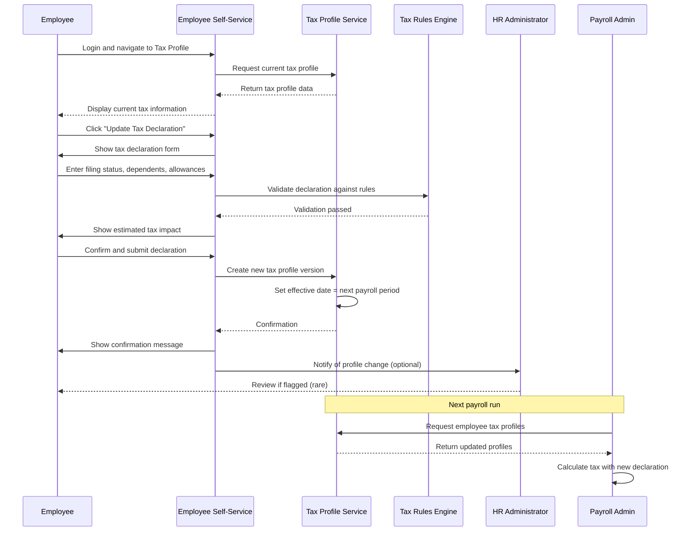
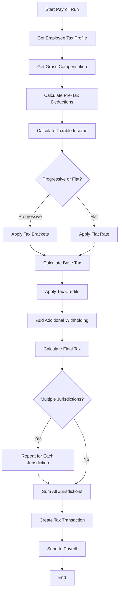

## Executive Summary

| Attribute | Value |
|-----------|-------|
| **Domain Classification** | CORE (Compliance-Critical) |
| **Business Value** | Statutory compliance, employee tax accuracy |
| **Regulatory Impact** | HIGH - Multi-country tax law compliance |
| **Innovation Level** | Full Innovation Play |
| **Timeline** | Fast Track |
| **Key Architectural Decision** | TR = Decision Layer (Config), Payroll = Execution Engine |

**Business Problem**: Organizations operating across Southeast Asia face complex, constantly changing tax regulations in 6+ countries. Manual tax calculations lead to compliance risks, employee dissatisfaction from incorrect withholdings, and potential penalties from tax authorities.

**Solution**: A centralized Tax Withholding sub-module that configures, calculates, and reports tax withholdings across Vietnam, Thailand, Indonesia, Singapore, Malaysia, and the Philippines with AI/ML-powered optimization recommendations.

---

## 1. Business Context

### 1.1 Organization

The Total Rewards module serves multinational enterprises operating across Southeast Asia with:
- **Geographic Scope**: 6+ countries (VN, TH, ID, SG, MY, PH)
- **User Base**: HR Administrators, Tax Administrators, Payroll Administrators, Employees
- **Transaction Volume**: Monthly payroll runs, annual tax filings, continuous employee self-service

### 1.2 Current Problem

| Problem Area | Current State | Pain Points |
|--------------|---------------|-------------|
| **Tax Configuration** | Manual spreadsheet management | Version control issues, error-prone, no audit trail |
| **Tax Calculation** | Manual or legacy system calculations | Inconsistent results, compliance gaps, no transparency |
| **Employee Tax Profiles** | Paper forms or disconnected systems | Lost documents, data entry errors, outdated information |
| **Tax Reporting** | Manual report assembly | Time-consuming, error-prone, filing delays |
| **Multi-Country Compliance** | Country-specific siloed processes | Inconsistent employee experience, high administrative overhead |
| **Tax Optimization** | Reactive, ad-hoc analysis | Missed optimization opportunities, employee tax overpayment |

### 1.3 Business Impact

| Impact Category | Current Cost/Risk | quantification |
|-----------------|-------------------|----------------|
| **Compliance Risk** | HIGH | Potential penalties up to 100% of under-withheld tax |
| **Administrative Burden** | HIGH | 40+ hours/month per country for tax administration |
| **Employee Trust** | MEDIUM-HIGH | Paycheck errors = #1 driver of employee dissatisfaction |
| **Audit Readiness** | MEDIUM | 20+ hours per audit response |
| **Tax Overpayment** | MEDIUM | Employees miss optimization opportunities |

### 1.4 Why Now

| Driver | Urgency | Impact |
|--------|---------|--------|
| **Regional Expansion** | HIGH | New country entries require tax capability from Day 1 |
| **Digital Transformation** | HIGH | Manual processes don't scale with growth |
| **Employee Experience** | MEDIUM | Modern employees expect self-service tax management |
| **AI/ML Opportunity** | MEDIUM | First-mover advantage with tax optimization recommendations |
| **Regulatory Changes** | HIGH | Vietnam SI Law 2024, regional tax reforms |

---

## 2. Business Objectives

### SMART Objectives Summary

| ID | Objective | Success Metric | Target | Timeline |
|----|-----------|----------------|--------|----------|
| **BO-TAX-001** | Achieve 100% statutory tax compliance across all 6 countries | Compliance audit pass rate | 100% | Go-live + 6 months |
| **BO-TAX-002** | Reduce tax administration effort by 70% | Hours spent on tax admin per month | <12 hours/country | Go-live + 3 months |
| **BO-TAX-003** | Eliminate tax calculation errors in employee paychecks | Paycheck error rate related to tax | <0.5% | Go-live + 3 months |
| **BO-TAX-004** | Enable 80% employee self-service for tax profile management | % of tax updates via self-service | 80% | Go-live + 6 months |
| **BO-TAX-005** | Reduce tax filing preparation time by 60% | Hours to prepare filings | 40% of baseline | Go-live + 6 months |
| **BO-TAX-006** | Achieve AI/ML tax optimization recommendations for 50% of eligible employees | % employees with optimization recommendations | 50% | Go-live + 12 months |

### Detailed Objectives

#### BO-TAX-001: Statutory Tax Compliance

| Aspect | Definition |
|--------|------------|
| **Specific** | Achieve and maintain 100% compliance with tax withholding regulations in all 6 operating countries |
| **Measurable** | Zero penalties from tax authorities; 100% on-time filings; 100% audit pass rate |
| **Achievable** | Based on Oracle HCM, SAP SuccessFactors compliance rates in similar markets |
| **Relevant** | Legal requirement; non-compliance results in financial penalties and reputational damage |
| **Time-bound** | Full compliance within 6 months of go-live (allowing for stabilization period) |

#### BO-TAX-002: Administrative Efficiency

| Aspect | Definition |
|--------|------------|
| **Specific** | Reduce manual tax administration effort through automation and self-service |
| **Measurable** | From 40+ hours/month/country to <12 hours/month/country |
| **Achievable** | Automation of calculations, filings, and employee self-service profile updates |
| **Relevant** | Frees HR team for strategic work; reduces operational costs |
| **Time-bound** | Efficiency gains realized within 3 months of go-live |

#### BO-TAX-003: Calculation Accuracy

| Aspect | Definition |
|--------|------------|
| **Specific** | Eliminate tax-related paycheck errors through automated calculations |
| **Measurable** | Tax-related paycheck errors <0.5% of total paychecks |
| **Achievable** | Automated calculation engine with validation rules |
| **Relevant** | Paycheck accuracy is critical for employee trust and retention |
| **Time-bound** | Accuracy target achieved within 3 months of go-live |

#### BO-TAX-004: Employee Self-Service Adoption

| Aspect | Definition |
|--------|------------|
| **Specific** | Enable employees to manage their own tax profiles, declarations, and forms |
| **Measurable** | 80% of tax profile updates completed via employee self-service |
| **Achievable** | Intuitive UI, mobile-friendly, guided workflows |
| **Relevant** | Reduces HR workload; empowers employees; improves data accuracy |
| **Time-bound** | 80% adoption within 6 months of go-live |

#### BO-TAX-005: Filing Efficiency

| Aspect | Definition |
|--------|------------|
| **Specific** | Reduce time required to prepare tax filings and reports |
| **Measurable** | 60% reduction in filing preparation time |
| **Achievable** | Pre-built filing templates, automated data aggregation |
| **Relevant** | Faster filings = reduced late filing risk; lower admin costs |
| **Time-bound** | Efficiency gains within 6 months of go-live |

#### BO-TAX-006: AI/ML Tax Optimization

| Aspect | Definition |
|--------|------------|
| **Specific** | Deploy AI/ML models to provide tax optimization recommendations to employees |
| **Measurable** | 50% of eligible employees receive actionable tax optimization recommendations |
| **Achievable** | Pattern recognition on historical tax data; optimization algorithms |
| **Relevant** | Differentiator for employee value proposition; demonstrates innovation |
| **Time-bound** | ML recommendations available within 12 months of go-live |

---

## 3. Business Actors

### Actor Summary

| Actor | Role | Primary Responsibilities | Access Level |
|-------|------|-------------------------|--------------|
| **Tax Administrator** | Central/Regional Tax Manager | Tax configuration, compliance, filings | Full admin |
| **HR Administrator** | HR Operations | Employee support, overrides, reporting | Elevated |
| **Payroll Administrator** | Payroll Operations | Payroll execution, tax calculation triggers | Operational |
| **Employee** | Tax Profile Owner | Self-service tax profile, declarations | Personal data |
| **Manager** | People Manager | Team tax summary (aggregated only) | Limited/None |
| **Auditor** | Internal/External Audit | Compliance review, audit trail access | Read-only audit |
| **System Integrator** | Technical Integration | API integration, data sync | Technical |

### Detailed Actor Definitions

#### ACTOR-TAX-001: Tax Administrator

| Attribute | Definition |
|-----------|------------|
| **Description** | Central or regional tax manager responsible for tax configuration and compliance |
| **Organizational Role** | Tax Director, Tax Manager, Regional Tax Lead |
| **Primary Goals** | Ensure 100% compliance; optimize tax processes; manage tax filings |
| **Key Responsibilities** | Configure tax jurisdictions, brackets, rules; approve overrides; generate filings; respond to audits |
| **Permissions** | Full CRUD on tax configuration; approve overrides; access all tax reports; manage tax users |
| **Accountability** | Compliance penalties; filing deadlines; audit outcomes |
| **Pain Points** | Constant regulatory changes; manual calculations; tight filing deadlines |

#### ACTOR-TAX-002: HR Administrator

| Attribute | Definition |
|-----------|------------|
| **Description** | HR operations staff supporting employee tax inquiries and exceptions |
| **Organizational Role** | HR Manager, HR Coordinator, People Operations |
| **Primary Goals** | Support employees with tax issues; ensure accurate tax data |
| **Key Responsibilities** | Assist employees with profile setup; process tax adjustments; escalate compliance issues |
| **Permissions** | View employee tax profiles; request overrides; generate employee tax reports |
| **Accountability** | Employee satisfaction; data accuracy |
| **Pain Points** | Employee questions; manual data entry; tracking paper forms |

#### ACTOR-TAX-003: Payroll Administrator

| Attribute | Definition |
|-----------|------------|
| **Description** | Payroll operations staff who execute payroll runs and trigger tax calculations |
| **Organizational Role** | Payroll Manager, Payroll Specialist |
| **Primary Goals** | Accurate and timely payroll execution with correct tax withholdings |
| **Key Responsibilities** | Run payroll; trigger tax calculations; reconcile tax withholdings; submit remittances |
| **Permissions** | Execute tax calculations; view withholding reports; reconcile discrepancies |
| **Accountability** | Paycheck accuracy; timely remittance; reconciliation |
| **Pain Points** | Calculation errors; reconciliation variances; tight payroll deadlines |

#### ACTOR-TAX-004: Employee

| Attribute | Definition |
|-----------|------------|
| **Description** | Individual contributor who owns their tax profile and declarations |
| **Organizational Role** | All employees with taxable compensation |
| **Primary Goals** | Accurate tax withholding; minimize tax burden legally; easy compliance |
| **Key Responsibilities** | Maintain accurate tax profile; submit tax declarations; review paychecks |
| **Permissions** | View/edit personal tax profile; submit declarations; download tax forms; view estimates |
| **Accountability** | Accuracy of personal tax information |
| **Pain Points** | Complex tax forms; uncertainty about correct withholding; mid-year changes |

#### ACTOR-TAX-005: Auditor

| Attribute | Definition |
|-----------|------------|
| **Description** | Internal or external auditor reviewing tax compliance |
| **Organizational Role** | Internal Audit, External Auditor, Tax Authority Inspector |
| **Primary Goals** | Verify compliance; ensure accurate reporting; identify gaps |
| **Key Responsibilities** | Review tax calculations; examine audit trail; verify filings |
| **Permissions** | Read-only access to all tax data; export audit reports |
| **Accountability** | Audit quality; regulatory compliance |
| **Pain Points** | Incomplete records; lack of audit trail; inconsistent data |

#### ACTOR-TAX-006: System Integrator

| Attribute | Definition |
|-----------|------------|
| **Description** | Technical role responsible for integrating tax module with external systems |
| **Organizational Role** | Integration Developer, IT Specialist |
| **Primary Goals** | Seamless data flow between tax module and payroll/finance systems |
| **Key Responsibilities** | Configure integrations; monitor data sync; troubleshoot integration issues |
| **Permissions** | API access; technical configuration; data mapping |
| **Accountability** | Integration reliability; data integrity |
| **Pain Points** | API changes; data mapping complexity; sync failures |

---

## 4. Business Rules

### 4.1 Validation Rules

| Rule ID | Rule Name | Condition | Action | Error Message |
|---------|-----------|-----------|--------|---------------|
| **VR-TAX-001** | Tax ID Format Validation | Tax ID must match country-specific format | Reject invalid format | "Tax ID format invalid for [Country]" |
| **VR-TAX-002** | Jurisdiction Code Uniqueness | Jurisdiction code must be unique per country | Reject duplicate | "Jurisdiction code already exists" |
| **VR-TAX-003** | Bracket Continuity | Tax brackets must have no gaps between min/max | Reject discontinuous brackets | "Tax brackets must be contiguous" |
| **VR-TAX-004** | Bracket Sequence | Tax bracket sequence numbers must be sequential (1, 2, 3...) | Reject non-sequential | "Bracket sequence must be consecutive" |
| **VR-TAX-005** | Tax Rate Range | Tax rate must be between 0% and 100% | Reject out-of-range | "Tax rate must be 0-100%" |
| **VR-TAX-006** | Top Bracket Maximum | Only top bracket can have NULL max value | Reject NULL in non-top | "Only highest bracket can have unlimited max" |
| **VR-TAX-007** | Filing Status Validity | Filing status must be valid for jurisdiction | Reject invalid status | "Filing status not valid for this jurisdiction" |
| **VR-TAX-008** | Dependent Count Limit | Number of dependents must not exceed legal maximum | Reject excess | "Dependent count exceeds maximum allowed" |
| **VR-TAX-009** | Effective Date Validity | Effective date cannot be in past for new configurations | Reject past dates | "Effective date cannot be in the past" |
| **VR-TAX-010** | Allowance Eligibility | Tax allowances require eligibility criteria met | Reject ineligible claims | "Employee not eligible for this allowance" |

### 4.2 Authorization Rules

| Rule ID | Rule Name | Actor | Resource | Action | Condition |
|---------|-----------|-------|----------|--------|-----------|
| **AR-TAX-001** | Tax Configuration Access | Tax Administrator | Tax Jurisdictions, Brackets, Rules | CRUD | Always |
| **AR-TAX-002** | Tax Override Approval | Tax Administrator | Tax Withholding Overrides | Approve/Reject | Override > threshold |
| **AR-TAX-003** | Employee Tax Profile Edit | Employee | Own Tax Profile | Read/Update | Own profile only |
| **AR-TAX-004** | HR Tax Profile Support | HR Administrator | Any Employee Tax Profile | Read | Employee support request |
| **AR-TAX-005** | Payroll Tax Calculation | Payroll Administrator | Tax Calculation Engine | Execute | During payroll run |
| **AR-TAX-006** | Tax Report Access | Tax Administrator | All Tax Reports | Read/Export | Always |
| **AR-TAX-007** | Audit Trail Access | Auditor | Tax Audit Trail | Read | Audit engagement active |
| **AR-TAX-008** | Tax Year Close | Tax Administrator | Tax Year | Close | All validations pass |
| **AR-TAX-009** | Tax Year Reopen | Tax Administrator + Approver | Closed Tax Year | Reopen | Dual approval required |
| **AR-TAX-010** | Multi-Jurisdiction Config | Regional Tax Admin | Multiple Country Config | CRUD | Assigned countries only |

### 4.3 Calculation Rules (Tax Withholding Formulas)

| Rule ID | Rule Name | Formula | Jurisdiction | Example |
|---------|-----------|---------|--------------|---------|
| **CR-TAX-001** | Vietnam PIT Progressive | Sum of (bracket_amount × bracket_rate) - tax_credits | Vietnam | See detailed formula below |
| **CR-TAX-002** | Singapore PIT Progressive | Graduated rates from 0% to 22% | Singapore | See detailed formula below |
| **CR-TAX-003** | Malaysia PCB Formula | (Chargeable_income × rate) / 12 - rebates | Malaysia | See detailed formula below |
| **CR-TAX-004** | Thailand PIT Progressive | Progressive rates 5%-35% on net income | Thailand | See detailed formula below |
| **CR-TAX-005** | Philippines CIT Withholding | Based on compensation level tables | Philippines | See detailed formula below |
| **CR-TAX-006** | Indonesia PPh 21 Progressive | Progressive rates 5%-35% on taxable income | Indonesia | See detailed formula below |
| **CR-TAX-007** | Vietnam SI Deduction | (BHXH 8% + BHYT 1.5% + BHTN 1%) × Salary (capped at 20x min wage) | Vietnam | Salary 50M VND → SI = 5.25M |
| **CR-TAX-008** | Taxable Income Calculation | Gross Income - Pre-tax Deductions - Allowances - Exemptions | All | See detailed formula below |
| **CR-TAX-009** | Annualization for Monthly Pay | Monthly Taxable Income × 12 → Apply annual brackets → Divide by 12 | All progressive | Prevents bracket manipulation |
| **CR-TAX-010** | Supplemental Income Flat Tax | Supplemental Amount × Flat Rate (varies by country) | All | Bonus 10M × 10% = 1M VND |

#### Detailed Calculation Formulas

**CR-TAX-001: Vietnam PIT Progressive Calculation**

```
Step 1: Calculate Gross Income
  Gross = Base Salary + Allowances + Bonuses + Other Income

Step 2: Calculate Deductions
  SI_Deduction = MIN(Salary, 20 × Minimum_Wage) × 10.5%
  PI_Deduction = MIN(Salary, 20 × Minimum_Wage) × 1%  (if applicable)
  Dependent_Deduction = Number_of_Dependents × 4.4M VND

Step 3: Calculate Taxable Income
  Taxable_Income = Gross - SI_Deduction - PI_Deduction - Dependent_Deduction - Personal_Deduction(11M VND)

Step 4: Apply Progressive Rates
  Bracket 1: First 5M × 5%
  Bracket 2: Next 5M (5-10M) × 10%
  Bracket 3: Next 8M (10-18M) × 15%
  Bracket 4: Next 12M (18-30M) × 20%
  Bracket 5: Next 22M (30-52M) × 25%
  Bracket 6: Next 30M (52-80M) × 30%
  Bracket 7: Above 80M × 35%

Step 5: Apply Tax Credits (if any)
  Final_Tax = Calculated_Tax - Tax_Credits
```

**CR-TAX-002: Singapore PIT Progressive Calculation**

```
Step 1: Calculate Chargeable Income
  Chargeable_Income = Annual_Gross_Employment_Income
                    - CPF Contributions (employee portion)
                    - Donations (if applicable)
                    - Personal Rebates

Step 2: Apply Progressive Rates (Resident)
  First 20,000 SGD: 0%
  Next 10,000 SGD (20K-30K): 2%
  Next 10,000 SGD (30K-40K): 3.5%
  Next 40,000 SGD (40K-80K): 7%
  Next 40,000 SGD (80K-120K): 11.5%
  Next 40,000 SGD (120K-160K): 15%
  Next 40,000 SGD (160K-200K): 18%
  Next 40,000 SGD (200K-240K): 19%
  Next 40,000 SGD (240K-280K): 19.5%
  Next 40,000 SGD (280K-320K): 20%
  Above 320,000 SGD: 22%

Step 3: Apply Tax Rebates (if applicable)
  Final_Tax = Calculated_Tax - Rebates
```

**CR-TAX-008: Universal Taxable Income Calculation**

```
Taxable_Income =
  Gross_Compensation
  - Pre_Tax_Deductions (retirement, health insurance, etc.)
  - Personal_Allowances (standard deduction)
  - Dependent_Allowances (per dependent)
  - Special_Allowances (disability, age, etc.)
  - Tax_Exempt_Items (per local law)
  = Net_Taxable_Income
```

### 4.4 Constraint Rules

| Rule ID | Rule Name | Constraint | Rationale |
|---------|-----------|------------|-----------|
| **CSTR-TAX-001** | Tax Year Closure | Cannot modify transactions in closed tax year | Audit integrity |
| **CSTR-TAX-002** | Profile Change Timing | Tax profile changes effective next payroll period | Payroll stability |
| **CSTR-TAX-003** | Override Documentation | All tax overrides require documented reason | Audit trail |
| **CSTR-TAX-004** | Filing Deadline Buffer | System alerts 30, 14, 7 days before filing deadline | Compliance |
| **CSTR-TAX-005** | Calculation Lock | Tax calculations locked after payroll submission | Data integrity |
| **CSTR-TAX-006** | Dual Approval for Year Reopen | Closed tax year requires 2 approvers to reopen | Control |
| **CSTR-TAX-007** | Maximum Override Limit | Override cannot exceed 50% of calculated tax | Risk control |
| **CSTR-TAX-008** | Retroactive Change Limit | Retroactive tax changes limited to 90 days | Practicality |
| **CSTR-TAX-009** | Concurrent Configuration Lock | Only one user can edit tax configuration at a time | Data integrity |
| **CSTR-TAX-010** | Audit Trail Immutability | Audit records cannot be modified or deleted | Compliance |

### 4.5 Compliance Rules (Multi-Country Tax Regulations)

| Rule ID | Rule Name | Country | Regulation | Requirement |
|---------|-----------|---------|------------|-------------|
| **COMP-TAX-001** | Vietnam PIT Monthly Filing | Vietnam | Vietnam Tax Law | Monthly PIT filing by 20th of following month |
| **COMP-TAX-002** | Vietnam PIT Annual Reconciliation | Vietnam | Vietnam Tax Law | Annual reconciliation by March 31 |
| **COMP-TAX-003** | Singapore PCB Monthly | Singapore | IRAS Requirements | Monthly PCB remittance by 15th |
| **COMP-TAX-004** | Singapore IR8A Annual | Singapore | IRAS Requirements | IR8A forms by March 1 |
| **COMP-TAX-005** | Malaysia PCB Monthly | Malaysia | LHDN Requirements | Monthly PCB remittance by 15th |
| **COMP-TAX-006** | Malaysia EA Form Annual | Malaysia | LHDN Requirements | EA forms by end of February |
| **COMP-TAX-007** | Thailand PND1 Monthly | Thailand | Revenue Department | PND1 filing by 7th of following month |
| **COMP-TAX-008** | Thailand PND94 Annual | Thailand | Revenue Department | PND94 by end of February |
| **COMP-TAX-009** | Philippines 1601C Monthly | Philippines | BIR Requirements | BIR 1601C by 10th of following month |
| **COMP-TAX-010** | Philippines 1604CF Annual | Philippines | BIR Requirements | BIR 1604CF by January 31 |
| **COMP-TAX-011** | Indonesia PPh 21 Monthly | Indonesia | DJP Requirements | Monthly PPh 21 by 10th of following month |
| **COMP-TAX-012** | Indonesia 1721-A Annual | Indonesia | DJP Requirements | Form 1721-A by end of March |
| **COMP-TAX-013** | Record Retention | All | All jurisdictions | Tax records retained minimum 7 years |
| **COMP-TAX-014** | Tax ID Validation | All | All jurisdictions | Valid Tax ID required before first payroll |
| **COMP-TAX-015** | Expatriate Tax Treatment | All | Tax treaties | Apply tax treaty benefits where applicable |

### 4.6 AI/ML Foundation Rules

| Rule ID | Rule Name | ML Function | Data Sources | Output |
|---------|-----------|-------------|--------------|--------|
| **ML-TAX-001** | Tax Optimization Recommendations | Pattern recognition on optimal allowances | Historical tax data, employee profiles | Recommended allowance adjustments |
| **ML-TAX-002** | Withholding Anomaly Detection | Outlier detection on tax calculations | Payroll history, peer comparisons | Anomaly alerts |
| **ML-TAX-003** | Filing Deadline Prediction | Time series prediction | Historical filing patterns | Optimal filing date recommendation |
| **ML-TAX-004** | Tax Bracket Optimization | Simulation modeling | Income projections, bracket structures | Optimal income timing recommendations |
| **ML-TAX-005** | Dependent Claim Optimization | Comparative analysis | Family composition, tax outcomes | Recommended dependent allocation |

---

## 5. Out of Scope

### Explicitly Excluded Features

| Exclusion ID | Excluded Feature | Rationale | Handled By |
|--------------|------------------|-----------|------------|
| **OOS-TAX-001** | Tax Return Filing (Direct Submission) | Requires specialized tax filing licenses; varies by individual circumstances | External tax filing partners / Employee self-filing |
| **OOS-TAX-002** | Tax Payment Processing | Payment processing requires banking licenses and regulatory approvals | Payroll module (remittance tracking only) |
| **OOS-TAX-003** | Tax Audit Defense Services | Requires licensed tax professionals | External tax advisors |
| **OOS-TAX-004** | Individual Tax Return Preparation | Personal tax returns involve non-employment income | External tax software (TurboTax, etc.) |
| **OOS-TAX-005** | Corporate Tax Calculation | Corporate income tax is fundamentally different from withholding | Finance/Accounting systems |
| **OOS-TAX-006** | Sales Tax / VAT | Different tax domain entirely | Finance/Accounting systems |
| **OOS-TAX-007** | Property Tax | Not employment-related | External systems |
| **OOS-TAX-008** | Inheritance / Estate Tax | Not employment-related | External systems |
| **OOS-TAX-009** | Tax-Loss Harvesting | Investment-related, not employment-related | Investment platforms |
| **OOS-TAX-010** | Cross-Border Tax Advisory | Requires licensed tax advisors; complex individual circumstances | External tax advisors |
| **OOS-TAX-011** | Tax Amnesty Program Management | Special programs outside normal withholding | Manual HR administration |
| **OOS-TAX-012** | Religious Tax (Zakat, etc.) | Religious obligations, not government tax | Dedicated Zakat systems |

### Scope Boundary Statement

> **Rule**: If a feature is not explicitly listed in this BRD or the referenced functional requirements, it is OUT OF SCOPE by default.

### Future Phase Considerations

| Feature | Current Status | Potential Future Phase |
|---------|----------------|------------------------|
| Direct tax filing integration | Out of scope | Phase 3 (if regulatory approval obtained) |
| AI tax advisory chatbot | Out of scope | Phase 2 (with licensed partner) |
| Tax planning simulator | Out of scope | Phase 2 |
| Integration with national tax systems | Varies by country | Phase 2-3 (country by country) |

---

## 6. Assumptions & Dependencies

### 6.1 Assumptions

| ID | Assumption | Impact if Invalid | Mitigation |
|----|------------|-------------------|------------|
| **ASSUMP-TAX-001** | Payroll module provides accurate gross pay data | HIGH - Tax calculations would be incorrect | Validation rules; reconciliation reports |
| **ASSUMP-TAX-002** | Core HR provides accurate employee data (hire date, termination, dependents) | HIGH - Tax profiles would be incomplete | Data validation; HR data quality audits |
| **ASSUMP-TAX-003** | Tax rates and brackets change annually in most jurisdictions | MEDIUM - Requires annual config updates | Automated alerts; regulatory monitoring |
| **ASSUMP-TAX-004** | Employees will provide accurate tax information | HIGH - Incorrect withholding | Employee attestation; audit rights |
| **ASSUMP-TAX-005** | Internet connectivity available for all users | LOW - Self-service affected | Offline-capable mobile app consideration |
| **ASSUMP-TAX-006** | Tax administrators have basic tax knowledge | MEDIUM - Configuration errors possible | Training; validation rules; approval workflows |
| **ASSUMP-TAX-007** | Countries will continue to support electronic filing | LOW - Would require manual filing fallback | Maintain paper filing capability |
| **ASSUMP-TAX-008** | Historical tax data available for ML training | MEDIUM - ML recommendations delayed | Synthetic data; phased ML rollout |
| **ASSUMP-TAX-009** | Single source of truth for employee tax ID | HIGH - Duplicate records | Master data management |
| **ASSUMP-TAX-010** | Exchange rates available for multi-currency scenarios | MEDIUM - Calculation delays | Integration with FX rate providers |

### 6.2 Dependencies

#### 6.2.1 Internal Dependencies (Within xTalent)

| ID | Dependency | Type | Criticality | Impact if Delayed |
|----|------------|------|-------------|-------------------|
| **DEP-TAX-001** | Core HR Module - Employee Master Data | Upstream | CRITICAL | Cannot process tax without employee data |
| **DEP-TAX-002** | Core HR Module - Dependent Management | Upstream | HIGH | Cannot calculate dependent allowances |
| **DEP-TAX-003** | Payroll Module - Gross Pay Calculation | Upstream | CRITICAL | Tax calculation requires gross pay |
| **DEP-TAX-004** | Payroll Module - Deduction Processing | Upstream | HIGH | Pre-tax deductions affect taxable income |
| **DEP-TAX-005** | Payroll Module - Payment Processing | Downstream | MEDIUM - Tax withholding must integrate with net pay |
| **DEP-TAX-006** | Finance Module - GL Integration | Downstream | MEDIUM - Tax liabilities post to GL |
| **DEP-TAX-007** | Finance Module - Cost Center Mapping | Downstream | LOW - Tax cost allocation |
| **DEP-TAX-008** | Reporting Module - Analytics Platform | Downstream | MEDIUM - Tax dashboards |
| **DEP-TAX-009** | Security Module - Role-Based Access Control | Foundation | CRITICAL - Tax data access control |
| **DEP-TAX-010** | Audit Module - Audit Trail | Foundation | CRITICAL - Tax audit requirements |
| **DEP-TAX-011** | Calculation Rules Engine | Foundation | CRITICAL - Tax formulas |
| **DEP-TAX-012** | Notification Service | Foundation | LOW - Tax alerts and reminders |

#### 6.2.2 External Dependencies

| ID | Dependency | Provider | Criticality | Integration Method |
|----|------------|----------|-------------|-------------------|
| **EXT-DEP-TAX-001** | Vietnam Tax Authority e-Filing | Vietnam General Department of Taxation | HIGH | API (if available) / File upload |
| **EXT-DEP-TAX-002** | Singapore IRAS Auto-Inclusion Scheme | IRAS Singapore | HIGH | API |
| **EXT-DEP-TAX-003** | Malaysia LHDN e-CP39 | LHDN Malaysia | MEDIUM | File upload |
| **EXT-DEP-TAX-004** | Thailand RD e-Service | Revenue Department Thailand | MEDIUM | API / File upload |
| **EXT-DEP-TAX-005** | Philippines BIR eBIRForms | BIR Philippines | MEDIUM | File upload |
| **EXT-DEP-TAX-006** | Indonesia DJP Online | Direktorat Jenderal Pajak | MEDIUM | API / File upload |
| **EXT-DEP-TAX-007** | Currency Exchange Rates | External FX provider | MEDIUM | API |
| **EXT-DEP-TAX-008** | Email/SMS Notification | Third-party provider | LOW | API |
| **EXT-DEP-TAX-009** | Digital Signature | Certificate Authority | MEDIUM | API integration |
| **EXT-DEP-TAX-010** | Cloud Infrastructure | Cloud provider | CRITICAL | Infrastructure |

#### 6.2.3 Cross-Module Dependencies

| Source Module | Dependency Type | Data/Service | Impact on Tax Withholding |
|---------------|-----------------|--------------|---------------------------|
| **Core HR** | Provides | Employee master, hire/term dates, job data | Foundation for tax profiles |
| **Core HR** | Provides | Dependent data | Dependent allowance calculations |
| **Compensation** | Provides | Salary, allowances, bonus data | Gross income for tax calculation |
| **Benefits** | Provides | Pre-tax deduction data (retirement, health) | Reduces taxable income |
| **Payroll** | Provides | Pay period data, payment dates | Tax calculation timing |
| **Payroll** | Receives | Tax withholding amounts | Net pay calculation |
| **Finance** | Receives | Tax liability postings | GL reconciliation |
| **Reporting** | Receives | Tax metrics and KPIs | Dashboards and analytics |

### 6.3 Risk Analysis

| Risk ID | Risk Description | Probability | Impact | Mitigation Strategy |
|---------|------------------|-------------|--------|---------------------|
| **RISK-TAX-001** | Tax regulation changes mid-development | MEDIUM | HIGH | Modular design; config-driven rules |
| **RISK-TAX-002** | e-Filing API unavailable in some countries | HIGH | MEDIUM | File-based fallback; manual process |
| **RISK-TAX-003** | Employee data quality issues | MEDIUM | HIGH | Data validation; HR training |
| **RISK-TAX-004** | Integration delays with Payroll module | MEDIUM | HIGH | Parallel development; mock services |
| **RISK-TAX-005** | ML model accuracy below threshold | MEDIUM | LOW | Human-in-the-loop; phased rollout |
| **RISK-TAX-006** | Tax administrator resistance to automation | LOW | MEDIUM | Change management; training |
| **RISK-TAX-007** | Country-specific edge cases discovered late | MEDIUM | MEDIUM | Early country expert engagement |
| **RISK-TAX-008** | Performance issues with large employee populations | LOW | MEDIUM | Load testing; optimization |

---

## Appendix A: Tax Election Workflow



---

## Appendix B: Tax Calculation Flow



---

## Appendix C: Country-Specific Tax Forms

| Country | Form Code | Form Name | Frequency | Due Date |
|---------|-----------|-----------|-----------|----------|
| **Vietnam** | 05/KK-TNCN | Personal Income Tax Declaration | Monthly/Annual | 20th of month / March 31 |
| **Vietnam** | 02/KK-TNCN | Tax Profile Registration | One-time | Upon hire |
| **Singapore** | IR8A | Employee Income Report | Annual | March 1 |
| **Singapore** | IR8S | Additional Information | Annual | March 1 |
| **Malaysia** | EA | Remuneration Statement | Annual | End of February |
| **Malaysia** | CP39 | PCB Remittance | Monthly | 15th of month |
| **Thailand** | PND1 | Withholding Tax Return | Monthly | 7th of month |
| **Thailand** | PND94 | Annual Reconciliation | Annual | End of February |
| **Philippines** | BIR 1601C | Monthly Remittance | Monthly | 10th of month |
| **Philippines** | BIR 1604CF | Annual Information | Annual | January 31 |
| **Indonesia** | Bukti Potong 21 | Withholding Evidence | Monthly | 10th of month |
| **Indonesia** | 1721-A | Annual Tax Report | Annual | End of March |

---

## Appendix D: Cross-Reference to Input Documents

| BRD Section | Source Document | Reference |
|-------------|-----------------|-----------|
| Tax Jurisdiction Configuration | Functional Requirements | FR-TR-TAX-001 |
| Tax Bracket Management | Functional Requirements | FR-TR-TAX-002 |
| Tax Rule Configuration | Functional Requirements | FR-TR-TAX-003 |
| Employee Tax Profile | Functional Requirements | FR-TR-TAX-004 |
| Tax Withholding Calculation | Functional Requirements | FR-TR-TAX-005 |
| Tax Reporting | Functional Requirements | FR-TR-TAX-006 |
| Tax Form Generation | Functional Requirements | FR-TR-TAX-007 |
| Tax Reconciliation | Functional Requirements | FR-TR-TAX-008 |
| Compliance Monitoring | Functional Requirements | FR-TR-TAX-009 |
| Year-End Processing | Functional Requirements | FR-TR-TAX-010 |
| Multi-Country Support | Functional Requirements | FR-TR-TAX-011 |
| Tax Audit Trail | Functional Requirements | FR-TR-TAX-012 |
| Tax Entities | Entity Catalog | E-TR-030 through E-TR-036 (implied) |
| Domain Context | Research Report | Total Rewards Domain Research |
| Calculation Rules | Calculation Rules BRD | Cross-reference pending |

---

## Document History

| Version | Date | Author | Changes | Approver |
|---------|------|--------|---------|----------|
| 1.0.0 | 2026-03-20 | AI Assistant | Initial BRD draft | Pending ARB Review |

---

## Approval Signatures

| Role | Name | Signature | Date |
|------|------|-----------|------|
| Product Owner | | | |
| Architecture Review Board | | | |
| Tax Subject Matter Expert | | | |
| HR Business Partner | | | |
| Engineering Lead | | | |

---

*End of Document*
