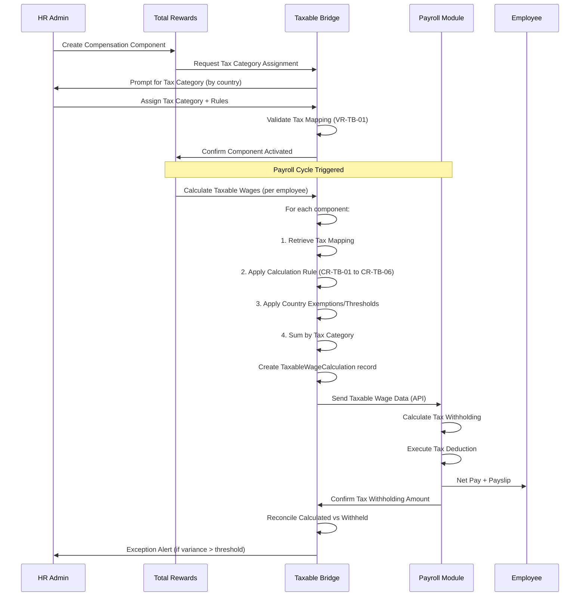
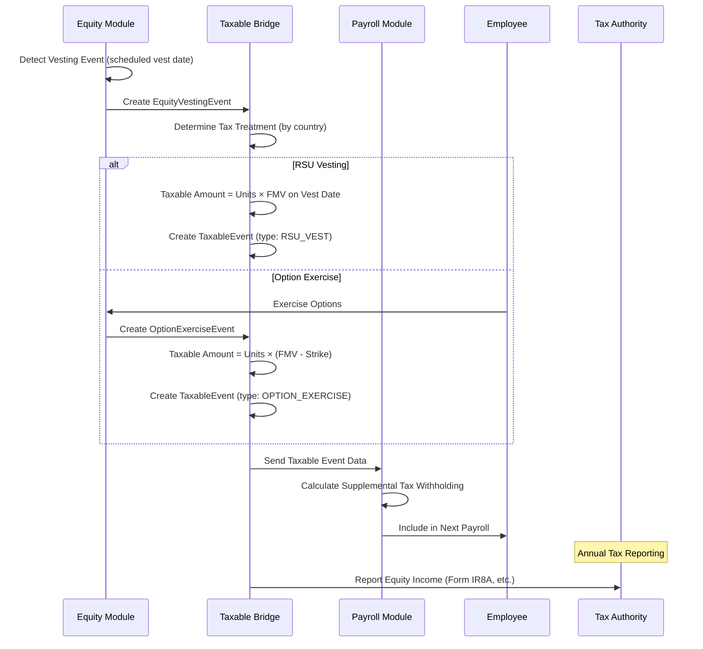
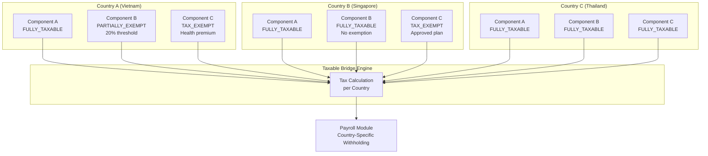
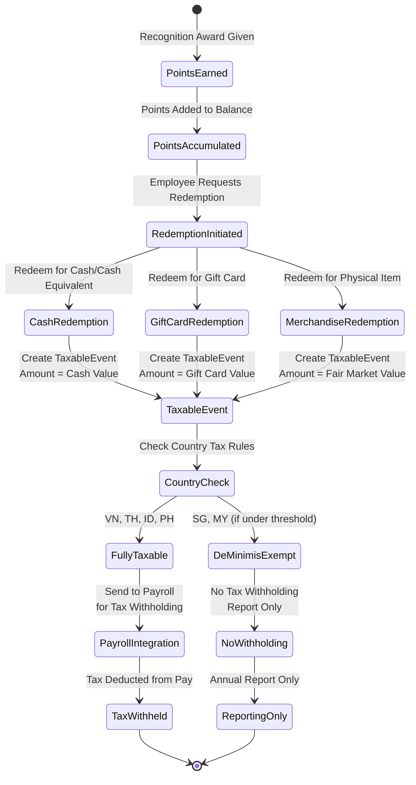

# Business Requirement Document: Taxable Bridge

> **ODSA Reality Layer — Specification-First Approach**
>
> This BRD defines the CURRENT STATE of taxable item management across Southeast Asian countries.
> It answers: **What taxable items exist? Who manages them? What rules govern them?**

---

## Executive Summary

**Domain Classification:** COMPLIANCE (Mandatory) + INNOVATION (Differentiator)

| Attribute | Value |
|-----------|-------|
| **Business Priority** | CRITICAL (P0) |
| **Regulatory Impact** | HIGH - Tax compliance across 6 countries |
| **Innovation Opportunity** | AI/ML-powered taxable optimization |
| **Build Decision** | Build core engine + Integrate tax data providers |

**Value Proposition:**
The Taxable Bridge sub-module provides the critical link between Total Rewards decisions and Payroll execution by:
- **Mapping** compensation components to correct tax treatments
- **Calculating** taxable amounts for equity vesting, perk redemptions, and benefit premiums
- **Ensuring** multi-country tax compliance through configurable rules
- **Enabling** seamless payroll integration for tax withholding

**Strategic Decision Point:**
> Total Rewards = **Decision Layer** (determines WHAT is taxable)
> Payroll = **Execution Engine** (calculates HOW MUCH tax to withhold)

---

## 1. Business Context

### 1.1 Organization

**Stakeholder Map:**

| Role | Responsibility | Decision Authority |
|------|----------------|-------------------|
| **Tax Administrator** | Configure tax categories, mappings, validation | Tax treatment configuration |
| **Payroll Administrator** | Execute tax withholding, file returns | Payroll processing |
| **HR Administrator** | Create compensation, equity, benefits events | Reward program design |
| **Employee** | View taxable items, personal tax impact | Personal tax elections |
| **Finance/Tax Manager** | Approve overrides, review compliance reports | Override approval |
| **Legal/Compliance** | Ensure regulatory adherence | Compliance sign-off |
| **Country HR Lead** | Country-specific tax rule validation | Local rule approval |

**Geographic Scope:**
- **Primary:** Vietnam (VN)
- **Phase 1:** Thailand (TH), Indonesia (ID), Singapore (SG)
- **Phase 2:** Malaysia (MY), Philippines (PH)

### 1.2 Current Problem

**Pain Points Without Taxable Bridge:**

| Pain Point | Impact | Frequency |
|------------|--------|-----------|
| **Manual tax mapping** | HR manually calculates taxable amounts per pay period | HIGH - Every payroll cycle |
| **Inconsistent tax treatment** | Same compensation item taxed differently across countries | HIGH - Ongoing |
| **No equity tax tracking** | RSU vesting taxable events tracked in spreadsheets | MEDIUM - Per vesting event |
| **Perk redemption tax gaps** | Recognition points redeemed for cash without tax withholding | MEDIUM - Per redemption |
| **Employer premium tax ambiguity** | Company-paid premiums not consistently treated as taxable income | LOW - Annual enrollment |
| **Payroll integration delays** | Taxable data sent to payroll manually, causing processing delays | HIGH - Every payroll cycle |
| **Compliance risk** | Tax authority audits find inconsistencies in reported taxable wages | CRITICAL - Annual filing |

**Root Cause Analysis:**
- Total Rewards module makes decisions about rewards (compensation, equity, recognition, benefits)
- Payroll module executes tax withholding
- **Missing link:** No systematic bridge to communicate WHAT is taxable from TR to PY

**Quote from Tax Administrator:**
> "We have compensation components, equity grants, recognition awards, and benefits all creating taxable events. But payroll needs to know exactly what's taxable, in what amount, and under which tax category. Right now, we're doing this manually in spreadsheets every payroll cycle. One mistake and we're non-compliant."

### 1.3 Business Impact

**Quantified Impact (Annual):**

| Impact Category | Current State | With Taxable Bridge | Improvement |
|-----------------|---------------|---------------------|-------------|
| **Payroll processing time** | 8 hours per cycle | 2 hours per cycle | 75% reduction |
| **Tax mapping errors** | 5-10 per cycle | <1 per cycle | 90% reduction |
| **Compliance audit findings** | 3-5 per year | 0-1 per year | 80% reduction |
| **Manual reconciliation effort** | 16 hours per month | 4 hours per month | 75% reduction |
| **Tax penalty risk** | $50,000-100,000/year | $5,000-10,000/year | 90% reduction |

**Qualitative Impact:**
- **Employee Trust:** Accurate tax withholding prevents year-end tax surprises
- **Audit Readiness:** Complete audit trail for tax authority inquiries
- **Scalability:** Support 6+ countries without linear increase in tax administration effort
- **Strategic Agility:** Rapid deployment of new rewards programs with known tax implications

### 1.4 Why Now

**Regulatory Drivers:**

| Country | Regulation | Effective Date | Penalty for Non-Compliance |
|---------|------------|----------------|---------------------------|
| **Vietnam** | Personal Income Tax Law (amended 2025) | 2025-07-01 | 10-25% of underpaid tax + penalties |
| **Singapore** | IRAS Tax Reporting Requirements | Ongoing | SGD 10,000 fine + prosecution |
| **Indonesia** | Directorate General of Taxes Regulation | Ongoing | IDR 500M - 2B fine |
| **Thailand** | Revenue Department Code | Ongoing | 2x tax due + criminal charges |
| **Malaysia** | LHDN e-Filing Requirements | 2025-01-01 | RM 1,000 - 20,000 fine |
| **Philippines** | BIR Tax Compliance Rules | Ongoing | 25% surcharge + interest |

**Business Drivers:**
1. **Equity Program Expansion (Phase 2):** RSU vesting creates taxable events in all 6 countries
2. **Recognition Program Launch:** Points-based rewards redeemed for cash/gift cards have tax implications
3. **Benefits Harmonization:** Employer-paid premiums treated differently across countries
4. **Payroll Modernization:** New payroll engine requires clean taxable wage data

**Risk of Delay:**
- **Q2 2026:** Equity program launch without tax tracking = compliance exposure
- **Q3 2026:** Recognition program expansion = taxable redemptions without withholding
- **Q4 2026:** Annual tax filing season = manual reconciliation at scale

---

## 2. Business Objectives

### SMART Objectives Summary

| ID | Objective | Success Metric | Target | Timeline |
|----|-----------|----------------|--------|----------|
| **BO-TB-01** | Automate taxable wage calculation | % reduction in manual calculation time | 75% | Q2 2026 |
| **BO-TB-02** | Achieve multi-country tax coverage | # countries with configured tax rules | 6 countries | Q3 2026 |
| **BO-TB-03** | Reduce tax mapping errors | # errors per payroll cycle | <1 | Q2 2026 |
| **BO-TB-04** | Enable equity tax event tracking | % equity events with automated tax | 100% | Q4 2026 (Phase 2) |
| **BO-TB-05** | Integrate with payroll tax withholding | % payroll runs without manual intervention | 95% | Q3 2026 |
| **BO-TB-06** | Establish AI/ML foundation for taxable optimization | AI recommendations accuracy | 85%+ | Q1 2027 |

---

### BO-TB-01: Automate Taxable Wage Calculation

**Objective Statement:**
Automate the calculation of taxable wages by mapping compensation components to tax categories and applying country-specific tax rules.

**Success Metric:**
- **Baseline:** 8 hours manual calculation per payroll cycle
- **Target:** 2 hours automated calculation per payroll cycle
- **Improvement:** 75% reduction

**Key Results:**
- KR1: 100% of compensation components mapped to tax categories by Q2 2026
- KR2: Taxable wage calculation completed within 5 seconds per employee
- KR3: Zero manual adjustments required for standard compensation scenarios

**Alignment:**
- Supports **Regulatory Compliance** (tax calculation accuracy)
- Enables **Operational Efficiency** (reduced manual effort)

---

### BO-TB-02: Achieve Multi-Country Tax Coverage

**Objective Statement:**
Configure and validate tax rules for all 6 Southeast Asian countries to ensure compliant taxable wage calculation.

**Success Metric:**
- **Count:** 6 countries (VN, TH, ID, SG, MY, PH)
- **Validation:** Tax authority rules documented and implemented

**Key Results:**
- KR1: Vietnam tax rules complete by Q2 2026 (P0 compliance)
- KR2: Thailand, Singapore, Indonesia rules complete by Q3 2026
- KR3: Malaysia, Philippines rules complete by Q4 2026
- KR4: Country-specific tax exemptions configured (e.g., Vietnam 13th month salary treatment)

**Country Tax Treatment Matrix:**

| Taxable Item | VN | TH | ID | SG | MY | PH |
|--------------|----|----|----|----|----|----|
| **Base Salary** | TAXABLE | TAXABLE | TAXABLE | TAXABLE | TAXABLE | TAXABLE |
| **Housing Allowance** | TAXABLE | TAXABLE | TAXABLE | TAXABLE | TAXABLE | TAXABLE |
| **Meal Allowance** | EXEMPT (<=20% base) | TAXABLE | TAXABLE | EXEMPT (reasonable) | EXEMPT (reasonable) | TAXABLE |
| **13th Month Salary** | TAXABLE | TAXABLE | TAXABLE | N/A | N/A | TAXABLE |
| **RSU Vesting** | TAXABLE (employment income) | TAXABLE | TAXABLE | TAXABLE (employment income) | TAXABLE | TAXABLE |
| **Option Exercise** | TAXABLE (gain) | TAXABLE | TAXABLE | TAXABLE (gain) | TAXABLE (gain) | TAXABLE (gain) |
| **Recognition Cash** | TAXABLE | TAXABLE | TAXABLE | TAXABLE | TAXABLE | TAXABLE |
| **Recognition Points** | TAXABLE (on redemption) | TAXABLE | TAXABLE | EXEMPT (de minimis) | EXEMPT (de minimis) | TAXABLE |
| **Employer Health Premium** | EXEMPT | TAXABLE | TAXABLE | EXEMPT | EXEMPT | EXEMPT |
| **Employer Life Premium** | TAXABLE | TAXABLE | TAXABLE | TAXABLE | TAXABLE | TAXABLE |

**Alignment:**
- Supports **Market Expansion** (country readiness)
- Ensures **Regulatory Compliance** (local tax laws)

---

### BO-TB-03: Reduce Tax Mapping Errors

**Objective Statement:**
Eliminate manual tax mapping errors through systematic component-to-tax-category mapping with validation rules.

**Success Metric:**
- **Baseline:** 5-10 tax mapping errors per payroll cycle
- **Target:** <1 error per payroll cycle

**Key Results:**
- KR1: 100% validation coverage for component-tax mappings
- KR2: Automated alerts for unmapped components before payroll processing
- KR3: Zero payroll delays due to tax mapping issues by Q3 2026

**Alignment:**
- Supports **Operational Excellence** (error reduction)
- Enables **Compliance Assurance** (accurate tax reporting)

---

### BO-TB-04: Enable Equity Tax Event Tracking (Phase 2)

**Objective Statement:**
Track and calculate taxable events from equity vesting (RSUs) and option exercises with full integration to payroll withholding.

**Success Metric:**
- **Coverage:** 100% of equity vesting events tracked for tax purposes

**Key Results:**
- KR1: RSU vesting creates automatic taxable event record (Q4 2026)
- KR2: Option exercise calculates taxable gain (FMV - strike price)
- KR3: Country-specific equity tax treatment configured (e.g., Vietnam employment income vs. capital gains)
- KR4: Equity tax events flow to payroll for withholding in same pay period

**Alignment:**
- Supports **Executive Compensation** (equity program enablement)
- Ensures **Tax Compliance** (equity taxation requirements)

---

### BO-TB-05: Integrate with Payroll Tax Withholding

**Objective Statement:**
Seamlessly integrate taxable wage calculations with payroll module for automated tax withholding execution.

**Success Metric:**
- **Target:** 95% of payroll runs without manual tax intervention

**Key Results:**
- KR1: Real-time taxable wage API available to payroll module
- KR2: Tax withholding transactions created automatically per pay period
- KR3: Reconciliation dashboard shows TR-decided vs PY-withheld amounts
- KR4: Exception handling workflow for tax discrepancies

**Integration Architecture:**
```
Total Rewards (Decision Layer)          Payroll (Execution Layer)
┌─────────────────────────────┐         ┌─────────────────────────────┐
│  Compensation Component     │         │  Tax Withholding Engine     │
│  Equity Vesting Event       │ ──────► │  Tax Calculation Engine     │
│  Recognition Award          │         │  Tax Filing Generator       │
│  Benefit Premium            │         │  Statutory Deductions       │
└─────────────────────────────┘         └─────────────────────────────┘
         │                                         │
         │  TaxableWageCalculation                 │  TaxWithholdingTransaction
         │  - Component breakdown                  │  - Tax amount per jurisdiction
         │  - Tax category per item                │  - Employee net pay impact
         │  - Jurisdiction assignment              │  - Employer liability
         ▼                                         ▼
```

**Alignment:**
- Supports **End-to-End Automation** (TR to PY integration)
- Enables **Accurate Tax Filing** (correct withholding amounts)

---

### BO-TB-06: Establish AI/ML Foundation for Taxable Optimization

**Objective Statement:**
Build data foundation and ML capabilities for AI-powered tax optimization recommendations and anomaly detection.

**Success Metric:**
- **Target:** 85%+ accuracy on AI tax treatment recommendations by Q1 2027

**Key Results:**
- KR1: Historical tax mapping data captured for ML training (Q3 2026)
- KR2: Anomaly detection for unusual tax treatment patterns (Q4 2026)
- KR3: AI-powered tax category suggestions for new components (Q1 2027)
- KR4: Predictive tax liability forecasting for budgeting (Q2 2027)

**AI/ML Use Cases:**
1. **Tax Category Recommendation:** Suggest tax category based on component name, description, country
2. **Anomaly Detection:** Flag unusual tax treatment compared to similar components
3. **Tax Optimization:** Recommend legal tax-efficient compensation structures per country
4. **Predictive Liability:** Forecast tax liabilities based on compensation plans

**Alignment:**
- Supports **Innovation Differentiation** (AI-powered features)
- Enables **Proactive Tax Planning** (predictive analytics)

---

## 3. Business Actors

### Actor Summary Table

| Actor | Role Type | Primary Responsibilities | System Permissions |
|-------|-----------|-------------------------|-------------------|
| **Tax Administrator** | Power User | Configure tax categories, mappings, rules | Full tax configuration |
| **Payroll Administrator** | Power User | Execute payroll, review taxable wages | Read taxable data, execute withholding |
| **HR Administrator** | Business User | Create rewards, manage compensation | Create taxable events |
| **Finance/Tax Manager** | Approver | Approve overrides, review compliance | Approval workflow |
| **Employee** | End User | View personal taxable items | Read-only self-service |
| **Country HR Lead** | Reviewer | Validate country-specific tax rules | Review and certify |
| **Auditor/Compliance** | External | Audit tax compliance, generate reports | Read-only audit access |

---

### Actor 1: Tax Administrator

**Description:**
Primary owner of tax configuration within the Total Rewards module. Ensures all compensation components, equity events, and rewards have correct tax treatment mappings.

**Key Responsibilities:**
- Define and maintain tax categories per country
- Map compensation components to tax categories
- Configure tax exemptions and thresholds per country
- Run tax treatment validation before payroll processing
- Review and resolve tax mapping exceptions
- Generate tax compliance reports

**System Permissions:**
| Permission | Scope | Restriction |
|------------|-------|-------------|
| CREATE tax category | All countries | None |
| EDIT tax category | Own configurations | Cannot edit locked system categories |
| CREATE component-tax mapping | All components | Must have valid tax category |
| EDIT component-tax mapping | Own mappings | Cannot modify historical mappings |
| RUN taxable wage calculation | All employees | None |
| VIEW tax compliance dashboard | All countries | None |
| OVERRIDE tax treatment | Requires approval | Two-person rule for overrides |
| EXPORT tax data | All data | Audit logged |

**Decision Authority:**
- Approve new tax categories (standard categories)
- Approve component-tax mappings (within policy)
- Escalate unusual tax treatments to Finance/Tax Manager

**Accountability:**
- Tax mapping accuracy (>99%)
- Payroll cycle on-time completion (100%)
- Audit finding resolution (<30 days)

---

### Actor 2: Payroll Administrator

**Description:**
Executes payroll processing using taxable wage data provided by Total Rewards. Responsible for accurate tax withholding and filing.

**Key Responsibilities:**
- Review taxable wage calculations before payroll run
- Execute tax withholding per calculated amounts
- Reconcile TR-provided taxable wages with PY-withheld taxes
- File tax returns with authorities
- Resolve tax withholding discrepancies

**System Permissions:**
| Permission | Scope | Restriction |
|------------|-------|-------------|
| VIEW taxable wage calculation | All employees | Read-only |
| VIEW component breakdown | All employees | Read-only |
| EXECUTE tax withholding | Per payroll run | Requires approval |
| CREATE tax withholding transaction | Per payroll run | None |
| VIEW tax compliance reports | All countries | None |
| REPORT tax discrepancy | Per employee | Creates ticket |

**Decision Authority:**
- Approve payroll run execution (tax components)
- Escalate tax discrepancies to Tax Administrator
- Adjust withholding for corrections (with audit trail)

**Accountability:**
- Accurate tax withholding (>99.5%)
- On-time tax filing (100%)
- Tax payment accuracy (100%)

---

### Actor 3: HR Administrator

**Description:**
Creates and manages compensation, benefits, recognition, and equity programs. Generates taxable events through reward decisions.

**Key Responsibilities:**
- Create compensation components with tax implications
- Process equity vesting events (Phase 2)
- Approve recognition award redemptions
- Manage benefit enrollment changes
- Ensure taxable events are properly documented

**System Permissions:**
| Permission | Scope | Restriction |
|------------|-------|-------------|
| CREATE compensation component | All types | Must assign tax category |
| EDIT compensation component | Own creations | Cannot change historical tax treatment |
| PROCESS equity vesting event | Phase 2 only | Requires approval |
| APPROVE recognition redemption | All awards | Within budget limits |
| VIEW employee taxable summary | Direct reports only | Privacy restrictions |

**Decision Authority:**
- Create new compensation components (standard types)
- Approve standard recognition awards
- Escalate unusual tax situations to Tax Administrator

**Accountability:**
- Complete taxable event documentation (100%)
- Timely event processing (<2 business days)
- Tax category assignment accuracy (>95%)

---

### Actor 4: Finance/Tax Manager

**Description:**
Senior approver for tax-related decisions. Reviews compliance reports and approves overrides to standard tax treatment.

**Key Responsibilities:**
- Approve tax treatment overrides
- Review quarterly tax compliance reports
- Escalate regulatory changes to Tax Administrator
- Sign off on annual tax filings
- Manage tax audit responses

**System Permissions:**
| Permission | Scope | Restriction |
|------------|-------|-------------|
| APPROVE tax override | All requests | Two-person rule required |
| VIEW compliance dashboard | All countries | None |
| EXPORT tax reports | All data | Audit logged |
| CERTIFY tax filing | Per country | Legal sign-off authority |
| ACCESS audit trail | All records | None |

**Decision Authority:**
- Final approval on non-standard tax treatments
- Escalation to Legal/External Tax Advisors
- Tax filing certification

**Accountability:**
- Tax compliance certification (100%)
- Override justification documentation (100%)
- Audit readiness (continuous)

---

### Actor 5: Employee

**Description:**
Recipient of taxable rewards. Views personal tax impact and provides necessary tax profile information.

**Key Responsibilities:**
- Maintain accurate tax profile (filing status, dependents)
- Review taxable compensation statements
- Report tax-related life events (marriage, relocation)

**System Permissions:**
| Permission | Scope | Restriction |
|------------|-------|-------------|
| VIEW personal taxable items | Self only | None |
| VIEW tax withholding history | Self only | None |
| EDIT personal tax profile | Self only | Limited fields |
| DOWNLOAD tax statement | Self only | PDF format |
| REPORT tax discrepancy | Self only | Creates ticket |

**Decision Authority:**
- Personal tax elections (where legally allowed)
- Benefit coverage tier selection (affects taxable premiums)

**Accountability:**
- Accurate tax profile information
- Timely life event reporting (<30 days)

---

### Actor 6: Country HR Lead

**Description:**
Local HR leader responsible for validating country-specific tax rules and ensuring local compliance.

**Key Responsibilities:**
- Review and certify country tax rules
- Validate new components against local regulations
- Escalate regulatory changes
- Support local tax audits

**System Permissions:**
| Permission | Scope | Restriction |
|------------|-------|-------------|
| REVIEW tax rules | Assigned country | Read-only |
| CERTIFY tax rules | Assigned country | Annual certification |
| COMMENT on mappings | Assigned country | Advisory only |
| VIEW country reports | Assigned country | None |

**Decision Authority:**
- Certify country tax rule accuracy
- Request tax rule updates for regulatory changes

**Accountability:**
- Annual country tax rule certification (100%)
- Regulatory change notification (<7 days from announcement)

---

### Actor 7: Auditor/Compliance Officer

**Description:**
Internal or external auditor reviewing tax compliance and controls.

**Key Responsibilities:**
- Audit tax mapping accuracy
- Review override history
- Validate reconciliation between TR and PY
- Generate compliance reports

**System Permissions:**
| Permission | Scope | Restriction |
|------------|-------|-------------|
| READ-ONLY all tax data | All countries | No modifications |
| EXPORT audit trail | All records | Watermarked, logged |
| RUN compliance reports | All countries | Standard reports only |
| ACCESS historical data | All periods | None |

**Decision Authority:**
- None (advisory and reporting only)

**Accountability:**
- Audit completion per schedule (100%)
- Finding documentation accuracy (100%)

---

## 4. Business Rules

### Business Rules Summary

| Category | Count | Rules |
|----------|-------|-------|
| **Validation Rules** | 4 | VR-TB-01 through VR-TB-04 |
| **Authorization Rules** | 3 | AR-TB-01 through AR-TB-03 |
| **Calculation Rules** | 6 | CR-TB-01 through CR-TB-06 |
| **Constraint Rules** | 3 | CON-TB-01 through CON-TB-03 |
| **Compliance Rules** | 4 | COM-TB-01 through COM-TB-04 |
| **TOTAL** | **20** | |

---

### 4.1 Validation Rules

Validation rules ensure data integrity and correctness of taxable item configurations.

| Rule ID | Rule Name | Description | Enforcement | Error Message |
|---------|-----------|-------------|-------------|---------------|
| **VR-TB-01** | Tax Category Required | Every compensation component must have a tax category mapping before activation | BLOCKING | "Component cannot be activated without tax category assignment" |
| **VR-TB-02** | Country-Specific Mapping | Tax mappings must specify the country/jurisdiction they apply to | BLOCKING | "Tax mapping must include country/jurisdiction" |
| **VR-TB-03** | Effective Date Validation | Tax mapping effective date cannot be in the past for new components | WARNING | "Tax mapping effective date is in the past. Review required." |
| **VR-TB-04** | Completeness Check | All components in a compensation plan must have tax mappings before payroll processing | BLOCKING | "Payroll cannot process: X components without tax mappings" |

**VR-TB-01 Detail:**
- **Trigger:** Component status change to ACTIVE
- **Validation:** EXISTS(tax_mapping) WHERE component_id = NEW.component_id
- **Action:** Prevent activation until tax category assigned
- **Exception:** None (mandatory for all compensation components)

**VR-TB-04 Detail:**
- **Trigger:** Payroll run initiation
- **Validation:** COUNT(components WITHOUT tax_mapping) = 0
- **Action:** Block payroll processing until resolved
- **Exception:** Emergency payroll with Finance/Tax Manager approval (audit logged)

---

### 4.2 Authorization Rules

Authorization rules define who can perform tax-related actions and under what conditions.

| Rule ID | Rule Name | Description | Authorized Roles | Conditions |
|---------|-----------|-------------|------------------|------------|
| **AR-TB-01** | Tax Category Creation | Who can create new tax categories | Tax Administrator | Must specify country, tax treatment type |
| **AR-TB-02** | Tax Treatment Override | Who can override system-recommended tax treatment | Finance/Tax Manager | Two-person rule, audit logged, justification required |
| **AR-TB-03** | Historical Tax Mapping Change | Who can modify historical tax mappings | Tax Administrator | Future effective dates only, cannot change past |

**AR-TB-02 Detail (Two-Person Rule):**
- **Requirement:** Tax treatment override requires approval from 2 authorized individuals
- **Approvers:** Finance/Tax Manager + Tax Administrator (or delegate)
- **Audit Trail:** Both approvers logged with timestamp and reason
- **Notification:** Compliance team notified of all overrides

**AR-TB-03 Detail (Historical Integrity):**
- **Constraint:** Historical tax mappings CANNOT be modified
- **Allowed:** Create new mapping with FUTURE effective date
- **Rationale:** Preserve audit trail for tax authority inquiries
- **Exception:** Correction of data entry error within 24 hours (audit logged)

---

### 4.3 Calculation Rules (Taxable Amount Calculations)

Calculation rules define how taxable amounts are determined for different types of taxable items.

| Rule ID | Rule Name | Formula | Applicable Items | Country Variations |
|---------|-----------|---------|------------------|-------------------|
| **CR-TB-01** | Standard Compensation Taxable Amount | Taxable Amount = Component Amount × Taxable Percentage | Base salary, allowances, bonuses | All countries |
| **CR-TB-02** | Partially Exempt Allowance | Taxable Amount = MAX(0, Amount - Exemption Threshold) | Meal allowance, transport allowance | VN (20% exemption for meal) |
| **CR-TB-03** | RSU Vesting Taxable Amount | Taxable Amount = Vested Units × FMV on Vest Date | RSU vesting events | All countries (employment income) |
| **CR-TB-04** | Option Exercise Taxable Gain | Taxable Amount = Units × (FMV at Exercise - Strike Price) | Stock option exercises | All countries |
| **CR-TB-05** | Recognition Points Redemption | Taxable Amount = Points Redeemed × Conversion Rate to Cash | Points-to-cash redemptions | SG/MY (de minimis exemption possible) |
| **CR-TB-06** | Employer-Paid Premium Taxable Value | Taxable Amount = Premium Paid by Employer × Taxability Factor | Health, life, disability premiums | VN (health exempt), TH/ID/SG (varies) |

**CR-TB-01 Detail (Standard Compensation):**
- **Formula:** Taxable Amount = Component Amount × Taxable Percentage
- **Default:** Taxable Percentage = 100% for FULLY_TAXABLE category
- **Example:** Base salary VND 50,000,000 → Taxable Amount = 50,000,000 × 100% = 50,000,000
- **Country Variation:** None (standard treatment)

**CR-TB-02 Detail (Partially Exempt Allowance):**
- **Formula:** Taxable Amount = MAX(0, Amount - Exemption Threshold)
- **Vietnam Example:** Meal allowance VND 10,000,000, exemption threshold 20% of base salary (VND 20,000,000)
  - Taxable Amount = MAX(0, 10,000,000 - 20,000,000) = 0 (fully exempt)
- **Thailand Example:** No meal allowance exemption
  - Taxable Amount = 10,000,000 - 0 = 10,000,000 (fully taxable)

**CR-TB-03 Detail (RSU Vesting):**
- **Formula:** Taxable Amount = Vested Units × FMV on Vest Date
- **Example:** 1,000 RSU units vest, FMV on vest date = $50/unit
  - Taxable Amount = 1,000 × $50 = $50,000
- **Country Variation:** All 6 countries treat RSU vesting as employment income
- **Phase:** Phase 2 (Equity module integration)

**CR-TB-04 Detail (Option Exercise):**
- **Formula:** Taxable Amount = Units × (FMV at Exercise - Strike Price)
- **Example:** Exercise 1,000 options, FMV = $50, Strike = $30
  - Taxable Amount = 1,000 × ($50 - $30) = $20,000
- **Country Variation:** All 6 countries tax option gain at exercise
- **Phase:** Phase 2 (Equity module integration)

**CR-TB-05 Detail (Recognition Points):**
- **Formula:** Taxable Amount = Points Redeemed × Conversion Rate
- **Example:** 10,000 points redeemed for VND 1,000,000 cash equivalent
  - Taxable Amount = 10,000 × (1,000,000 / 10,000) = 1,000,000
- **Country Variation:**
  - Singapore: De minimis exemption if annual redemption < SGD 500
  - Malaysia: Exemption if under RM 1,000 annually
- **Integration:** Recognition module → Taxable Bridge

**CR-TB-06 Detail (Employer-Paid Premiums):**
- **Formula:** Taxable Amount = Premium × Taxability Factor
- **Vietnam:** Health premiums EXEMPT, Life premiums TAXABLE
- **Thailand:** All employer-paid premiums TAXABLE
- **Singapore:** Health premiums EXEMPT (approved plans), Life premiums TAXABLE
- **Example:** Employer pays VND 10,000,000 health premium + VND 5,000,000 life premium
  - Vietnam Taxable = 0 (health) + 5,000,000 (life) = VND 5,000,000

---

### 4.4 Constraint Rules

Constraint rules define limits and boundaries for taxable item management.

| Rule ID | Rule Name | Constraint | Rationale | Exception Process |
|---------|-----------|------------|-----------|-------------------|
| **CON-TB-01** | Tax Mapping Immutability | Historical tax mappings cannot be deleted, only superseded | Audit trail preservation | None |
| **CON-TB-02** | Single Active Mapping | Only one tax mapping can be active per component per country at any time | Prevents calculation conflicts | Supersede with new effective date |
| **CON-TB-03** | Payroll Lock Window | Tax mappings cannot be changed within 48 hours of scheduled payroll run | Prevents payroll disruption | Emergency change with Finance approval |

**CON-TB-01 Detail:**
- **Constraint:** DELETE tax_mapping WHERE effective_date < CURRENT_DATE is NOT ALLOWED
- **Allowed:** CREATE new mapping with effective_date > CURRENT_DATE
- **Audit Trail:** All historical mappings preserved indefinitely
- **Query:** SELECT * FROM tax_mappings WHERE component_id = X ORDER BY effective_date

**CON-TB-03 Detail:**
- **Window:** 48 hours before payroll run start
- **Notification:** Tax Administrator alerted if attempting change during lock window
- **Exception:** Finance/Tax Manager approval required
- **Audit:** All emergency changes logged with reason and approver

---

### 4.5 Compliance Rules (Multi-Country Taxable Item Regulations)

Compliance rules encode country-specific tax regulations that must be followed.

| Rule ID | Rule Name | Country | Regulation | Requirement | Penalty for Violation |
|---------|-----------|---------|------------|-------------|----------------------|
| **COM-TB-01** | Vietnam PIT Law 2025 | VN | Personal Income Tax Law (amended) | All employment income taxable unless specifically exempt | 10-25% of underpaid tax + penalties |
| **COM-TB-02** | Singapore IRAS Employment Income | SG | Income Tax Act | Equity vesting taxable as employment income at vest date | SGD 10,000 fine + prosecution |
| **COM-TB-03** | Indonesia THR Tax Treatment | ID | Directorate General of Taxes | Religious holiday allowance (THR) has specific exemption threshold | IDR 500M - 2B fine |
| **COM-TB-04** | Philippines 13th Month Exemption | PH | BIR Tax Code | 13th month pay exempt up to PHP 90,000 | 25% surcharge + interest |

**COM-TB-01 Detail (Vietnam):**
- **Regulation:** Personal Income Tax Law, amended effective 2025-07-01
- **Key Requirements:**
  - All employment income taxable unless specifically exempt
  - Exemptions: Meal allowance (up to 20% of base), phone allowance (reasonable amounts)
  - RSU vesting: Taxable as employment income at vest date FMV
  - Stock options: Taxable at exercise (FMV - strike)
- **System Implementation:**
  - Tax category FULLY_TAXABLE for base salary, bonuses, allowances (unless exempt)
  - Tax category PARTIALLY_EXEMPT for meal allowance (exempt portion up to 20%)
  - Tax category DEFERRED for RSU (taxable on vest, not grant)

**COM-TB-02 Detail (Singapore):**
- **Regulation:** IRAS Tax Treatment of Employee Share-Based Remuneration
- **Key Requirements:**
  - RSU vesting: Taxable as employment income at vest date FMV
  - Stock options: Taxable at exercise (FMV - strike price)
  - Reporting required on Form IR8A
  - Singapore employees: Tax withholding at source
  - Foreign employees: Tax clearance before departure
- **System Implementation:**
  - EquityVestingEvent creates TaxableEvent with Singapore tax category
  - Integration with IR8A form generation
  - Tax clearance workflow for departing employees

**COM-TB-03 Detail (Indonesia):**
- **Regulation:** Directorate General of Taxes Regulation on THR (Tunjangan Hari Raya)
- **Key Requirements:**
  - THR is religious holiday allowance (mandatory for employers)
  - Exemption threshold: Up to IDR 6,000,000 fully exempt
  - Amount above threshold: Fully taxable
  - Timing: Must be paid before religious holiday
- **System Implementation:**
  - Tax category THR_EXEMPT for amounts up to IDR 6,000,000
  - Tax category THR_TAXABLE for amounts above threshold
  - Automatic threshold calculation per employee per year

**COM-TB-04 Detail (Philippines):**
- **Regulation:** BIR Tax Code Section 32(B) on 13th Month Pay
- **Key Requirements:**
  - 13th month pay exempt up to PHP 90,000
  - Amount above PHP 90,000: Fully taxable
  - Applies to: 13th month pay, Christmas bonus, productivity incentives
  - Combined ceiling: PHP 90,000 total exemption
- **System Implementation:**
  - Track cumulative 13th month payments per employee per year
  - Tax category THIRTEENTH_EXEMPT for amounts within ceiling
  - Tax category THIRTEENTH_TAXABLE for amounts above ceiling

---

### Compliance Rule Cross-Reference Matrix

| Taxable Item | VN | TH | ID | SG | MY | PH |
|--------------|----|----|----|----|----|----|
| **Base Salary** | COM-TB-01 (Fully Taxable) | Fully Taxable | Fully Taxable | COM-TB-02 (Fully Taxable) | Fully Taxable | Fully Taxable |
| **Meal Allowance** | COM-TB-01 (Partial Exempt 20%) | Fully Taxable | Fully Taxable | Exempt (Reasonable) | Exempt (Reasonable) | Fully Taxable |
| **RSU Vesting** | COM-TB-01 (Employment Income) | Employment Income | Employment Income | COM-TB-02 (Employment Income) | Employment Income | Employment Income |
| **Option Exercise** | COM-TB-01 (Gain at Exercise) | Gain at Exercise | Gain at Exercise | COM-TB-02 (Gain at Exercise) | Gain at Exercise | Gain at Exercise |
| **13th Month Pay** | Fully Taxable | N/A | N/A | N/A | N/A | COM-TB-04 (Exempt <=90K PHP) |
| **THR (Indonesia)** | N/A | N/A | COM-TB-03 (Exempt <=6M IDR) | N/A | N/A | N/A |
| **Recognition Points** | Taxable on Redemption | Taxable | Taxable | De Minimis Exemption | De Minimis Exemption | Taxable |
| **Employer Health Premium** | Exempt | Taxable | Taxable | Exempt (Approved) | Exempt | Exempt |

---

## 5. Out of Scope

**Explicitly Excluded from Taxable Bridge:**

| Out of Scope Item | Rationale | Handled By |
|-------------------|-----------|------------|
| **Tax Calculation Engine** | Complex tax bracket calculations, progressive tax computation | Payroll Module (PY) |
| **Tax Filing & Remittance** | Actual submission to tax authorities, payment processing | Payroll Module (PY) |
| **Tax Form Generation (W-2, IR8A, etc.)** | Country-specific tax form population | Payroll/Compliance Module |
| **International Tax Treaty Analysis** | Cross-border tax treaty application, permanent establishment | External Tax Advisors |
| **Personal Tax Return Preparation** | Employee personal income tax filing | Third-party tax services |
| **Tax Audit Defense** | Legal representation during tax audits | Legal/External Advisors |
| **Tax Law Monitoring** | Ongoing tracking of regulatory changes | Legal/Compliance Team |
| **Transfer Pricing** | Inter-company tax optimization | Finance/Tax Team |
| **Expatriate Tax Equalization** | Tax equalization for expat employees | External Tax Services |
| **VAT/GST Treatment** | Indirect tax calculations | Finance Module |

**Boundary Clarification:**

```
┌─────────────────────────────────────────────────────────────────┐
│                    TAXABLE BRIDGE (IN SCOPE)                     │
│  ┌─────────────────┐  ┌─────────────────┐  ┌─────────────────┐  │
│  │ Component → Tax │  │ Taxable Event   │  │ Multi-Country   │  │
│  │ Category Mapping│  │ Detection       │  │ Tax Rules       │  │
│  └─────────────────┘  └─────────────────┘  └─────────────────┘  │
│  ┌─────────────────┐  ┌─────────────────┐  ┌─────────────────┐  │
│  │ Taxable Wage    │  │ TR to PY        │  │ Tax Treatment   │  │
│  │ Calculation     │  │ Integration     │  │ Validation      │  │
│  └─────────────────┘  └─────────────────┘  └─────────────────┘  │
└─────────────────────────────────────────────────────────────────┘
                              │
                              ▼
┌─────────────────────────────────────────────────────────────────┐
│                      PAYROLL MODULE (OUT OF SCOPE)               │
│  ┌─────────────────┐  ┌─────────────────┐  ┌─────────────────┐  │
│  │ Tax Bracket     │  │ Tax Withholding │  │ Tax Form        │  │
│  │ Calculation     │  │ Execution       │  │ Generation      │  │
│  └─────────────────┘  └─────────────────┘  └─────────────────┘  │
│  ┌─────────────────┐  ┌─────────────────┐  ┌─────────────────┐  │
│  │ Tax Filing      │  │ Tax Payment     │  │ Tax Audit       │  │
│  │ Submission      │  │ Processing      │  │ Response        │  │
│  └─────────────────┘  └─────────────────┘  └─────────────────┘  │
└─────────────────────────────────────────────────────────────────┘
```

**Phase 2 Items (Not in Initial Scope):**
- Equity vesting tax event tracking (RSU, Options)
- Employer-paid premium taxable value calculation
- AI/ML tax optimization recommendations

**Decision Rationale:**
- Phase 1 focuses on core compensation taxable wage calculation
- Phase 2 adds complexity (equity, benefits) with separate implementation
- AI/ML requires historical data foundation (Phase 3)

---

## 6. Assumptions & Dependencies

### 6.1 Assumptions

**Business Assumptions:**

| ID | Assumption | Impact if Invalid | Mitigation |
|----|------------|-------------------|------------|
| **ASM-TB-01** | Tax authorities will not introduce radical tax treatment changes before Q4 2026 | HIGH - Reconfiguration required | Monitor regulatory changes monthly |
| **ASM-TB-02** | Equity program launch (Phase 2) will proceed as scheduled | MEDIUM - Taxable Bridge underutilized | Prepare manual equity tax tracking workaround |
| **ASM-TB-03** | Country HR Leads will validate tax rules within 2 weeks of request | MEDIUM - Delay in country rollout | Escalation path to Country Managing Director |
| **ASM-TB-04** | Payroll module will provide API for taxable wage integration by Q2 2026 | CRITICAL - Integration blocked | Fallback: File-based integration |
| **ASM-TB-05** | Current tax treatment interpretations by external advisors remain valid | MEDIUM - Recalculation required | Annual review with external tax advisors |

**Technical Assumptions:**

| ID | Assumption | Impact if Invalid | Mitigation |
|----|------------|-------------------|------------|
| **ASM-TB-06** | Compensation component master data will be complete before Taxable Bridge configuration | HIGH - Mapping cannot proceed | Parallel data cleanup initiative |
| **ASM-TB-07** | Tax category structure is stable across 6 countries | MEDIUM - Schema changes required | Flexible category schema design |
| **ASM-TB-08** | Historical compensation data (2+ years) available for AI/ML training | LOW - AI features delayed | Use synthetic data for initial ML models |

**Resource Assumptions:**

| ID | Assumption | Impact if Invalid | Mitigation |
|----|------------|-------------------|------------|
| **ASM-TB-09** | Tax Administrator role will be filled by Q1 2026 | HIGH - Configuration delayed | Cross-train HR Admin as backup |
| **ASM-TB-10** | External tax advisors available for country rule validation | MEDIUM - Compliance risk | Engage secondary tax advisory firm |

---

### 6.2 Dependencies

**Upstream Dependencies (Inputs):**

| ID | Dependency | Provider | Criticality | Integration Type |
|----|------------|----------|-------------|------------------|
| **DEP-TB-01** | Compensation Component Master Data | TR Core Compensation | CRITICAL | Data dependency |
| **DEP-TB-02** | Equity Grant & Vesting Data | TR Equity Module (Phase 2) | HIGH | Event-driven |
| **DEP-TB-03** | Recognition Award Redemption Data | TR Recognition Module | HIGH | Event-driven |
| **DEP-TB-04** | Benefit Enrollment & Premium Data | TR Benefits Module | MEDIUM | Data dependency |
| **DEP-TB-05** | Employee Tax Profile (filing status, dependents) | Core HR Module | CRITICAL | API integration |
| **DEP-TB-06** | Country/Jurisdiction Master Data | Core HR Module | CRITICAL | Reference data |
| **DEP-TB-07** | Currency Exchange Rates | Finance Module | MEDIUM | API integration |

**Dependency Detail - DEP-TB-01 (Compensation Components):**
- **Required Data:** Component ID, component type, amount, frequency, country
- **Quality Requirement:** 100% of active components must have valid data
- **Failure Impact:** Cannot calculate taxable wages without component data
- **Validation:** COUNT(components WITH valid data) = COUNT(all active components)

**Dependency Detail - DEP-TB-05 (Employee Tax Profile):**
- **Required Data:** Tax filing status, number of dependents, tax residency country
- **Quality Requirement:** >95% employee profile completeness
- **Failure Impact:** Tax calculation may be inaccurate
- **Validation:** Profile completeness check before payroll run

---

**Downstream Dependencies (Consumers):**

| ID | Dependency | Consumer | Criticality | Integration Type |
|----|------------|----------|-------------|------------------|
| **DEP-TB-08** | Taxable Wage Data | Payroll Module | CRITICAL | API integration |
| **DEP-TB-09** | Tax Withholding Execution Data | Payroll Module | HIGH | Event-driven |
| **DEP-TB-10** | Tax Compliance Reports | Reporting/Analytics Module | HIGH | Data export |
| **DEP-TB-11** | Tax Liability Accrual Data | Finance Module | MEDIUM | Batch integration |
| **DEP-TB-12** | Employee Taxable Summary | Employee Self-Service | MEDIUM | API integration |
| **DEP-TB-13** | Audit Trail Data | Audit/Compliance Module | HIGH | Event streaming |

**Dependency Detail - DEP-TB-08 (Payroll Integration):**
- **Data Provided:** TaxableWageCalculation per employee per pay period
- **Required Latency:** Real-time (API) or batch (within 4 hours of payroll start)
- **Quality Requirement:** 100% accuracy in taxable wage amounts
- **Failure Impact:** Payroll cannot execute tax withholding
- **Fallback:** Manual taxable wage file upload

**Dependency Detail - DEP-TB-09 (Tax Withholding):**
- **Data Consumed:** TaxWithholdingTransaction with actual withheld amounts
- **Purpose:** Reconciliation of TR-calculated vs PY-withheld amounts
- **Quality Requirement:** Variance <1% between calculated and withheld
- **Failure Impact:** Cannot detect withholding errors

---

### 6.3 Impact Analysis

**High-Impact Dependency Risks:**

| Risk | Probability | Impact | Mitigation | Owner |
|------|-------------|--------|------------|-------|
| **Payroll API delayed** | MEDIUM | CRITICAL | Implement file-based fallback integration | Tech Lead |
| **Equity module Phase 2 delayed** | HIGH | HIGH | Manual equity tax tracking until automation ready | Product Owner |
| **Country tax rule changes mid-implementation** | MEDIUM | HIGH | Versioning support in tax rule schema | Architect |
| **Tax Administrator role unfilled** | LOW | HIGH | Cross-train existing HR team | HR Director |

**Dependency Timeline:**

```
Q1 2026                    Q2 2026                    Q3 2026
├──────────────────────────┼──────────────────────────┼──────────────────────────┤
│                          │                          │
│  DEP-TB-01               │  DEP-TB-08               │  DEP-TB-09               │
│  Compensation Data       │  Payroll Integration     │  Withholding Feedback    │
│  [COMPLETE]              │  [IN PROGRESS]           │  [PENDING]               │
│                          │                          │
│  DEP-TB-05               │  DEP-TB-10               │  DEP-TB-12               │
│  Employee Tax Profile    │  Compliance Reports      │  Self-Service            │
│  [IN PROGRESS]           │  [PENDING]               │  [PENDING]               │
│                          │                          │
├──────────────────────────┴──────────────────────────┴──────────────────────────┤
│ Key Milestones:                                                                │
│ - Q1: Complete component master data cleanup                                   │
│ - Q2: Payroll API integration live for VN                                      │
│ - Q3: All 6 countries operational                                              │
└─────────────────────────────────────────────────────────────────────────────────┘
```

---

## Appendix A: Taxable Bridge Flow Diagrams

### A.1 Taxable Wage Calculation Flow



---

### A.2 Equity Vesting Tax Event Flow (Phase 2)



---

### A.3 Multi-Country Tax Mapping Flow



---

### A.4 Recognition Points Redemption Tax Flow



---

## Appendix B: Entity Reference

**Core Entities (from Entity Catalog):**

| Entity | Description | Related to Taxable Bridge |
|--------|-------------|--------------------------|
| **TaxCategory** | Tax treatment category (FULLY_TAXABLE, PARTIALLY_EXEMPT, TAX_EXEMPT) | Core configuration entity |
| **TaxableComponent** | Compensation component with tax attributes | Extended via ComponentTaxMapping |
| **ComponentTaxMapping** | Links PayComponentDefinition to TaxCategory | Core mapping entity |
| **TaxableWageCalculation** | Calculated taxable wages per employee per period | Output entity |
| **TaxableEvent** | Event that triggers taxable income (vesting, redemption, premium) | Phase 2 entity |

**New Entities for Taxable Bridge:**

| Entity | Description | Key Attributes |
|--------|-------------|----------------|
| **TaxableItem** | Represents a taxable event or compensation item | item_type, taxable_amount, country, tax_category_id |
| **TaxExemption** | Country-specific exemption rules | country, exemption_type, threshold_amount, conditions |
| **TaxableWageBreakdown** | Detailed breakdown of taxable wages by component | employee_id, period_id, component_id, taxable_amount |
| **TaxReconciliation** | Reconciliation between TR and PY tax amounts | tr_calculated, py_withheld, variance, resolution |

---

## Appendix C: Glossary

| Term | Definition |
|------|------------|
| **Taxable Bridge** | Sub-module that maps Total Rewards decisions to Payroll tax execution |
| **Tax Category** | Classification of tax treatment (FULLY_TAXABLE, PARTIALLY_EXEMPT, TAX_EXEMPT) |
| **Taxable Event** | Transaction that creates taxable income (e.g., RSU vesting, option exercise) |
| **Taxable Wage** | Amount of compensation subject to income tax after exemptions |
| **Tax Withholding** | Amount deducted from pay for tax obligations |
| **Component-Tax Mapping** | Configuration linking compensation component to tax category |
| **De Minimis Exemption** | Small-value exemption from taxation (e.g., Singapore recognition awards under SGD 500) |
| **Two-Person Rule** | Control requiring two approvers for tax treatment overrides |
| **Decision Layer** | Total Rewards role - determines WHAT is taxable |
| **Execution Engine** | Payroll role - calculates HOW MUCH tax to withhold |

---

## Appendix D: Document History

| Version | Date | Author | Change Description |
|---------|------|--------|-------------------|
| 1.0.0 | 2026-03-20 | Product Management | Initial BRD creation |
| | | | |

---

## Appendix E: Approval Sign-Off

| Role | Name | Signature | Date |
|------|------|-----------|------|
| Product Owner | | | |
| Tax Compliance Lead | | | |
| Architecture Review Board | | | |
| Engineering Lead | | | |
| HR Director | | | |

---

**Document Classification:** INTERNAL USE ONLY

**Next Review Date:** 2026-06-20 (Quarterly review)

**Related Documents:**
- [Functional Requirements](../02-spec/01-functional-requirements.md)
- [Tax Compliance Guide](../02-spec/09-tax-compliance-guide.md)
- [Entity Catalog](../00-new/_research/entity-catalog.md)
- [Feature Catalog](../00-new/_research/feature-catalog.md)
