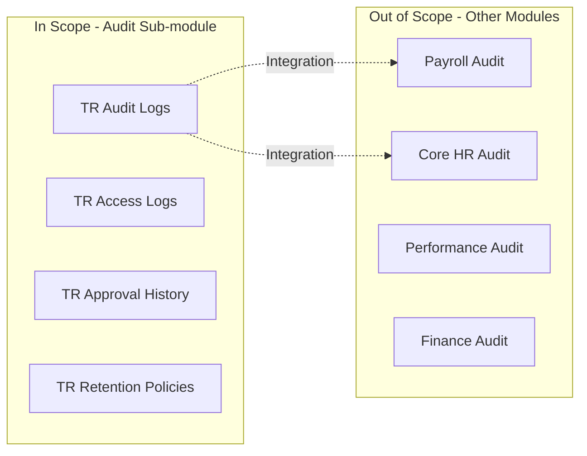
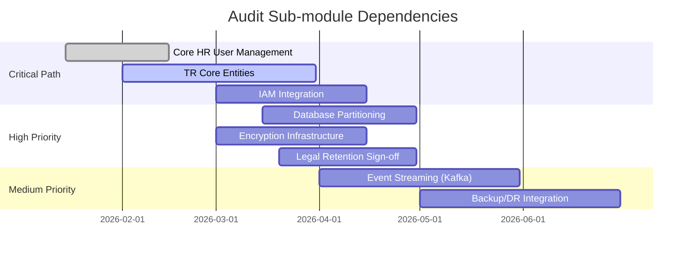
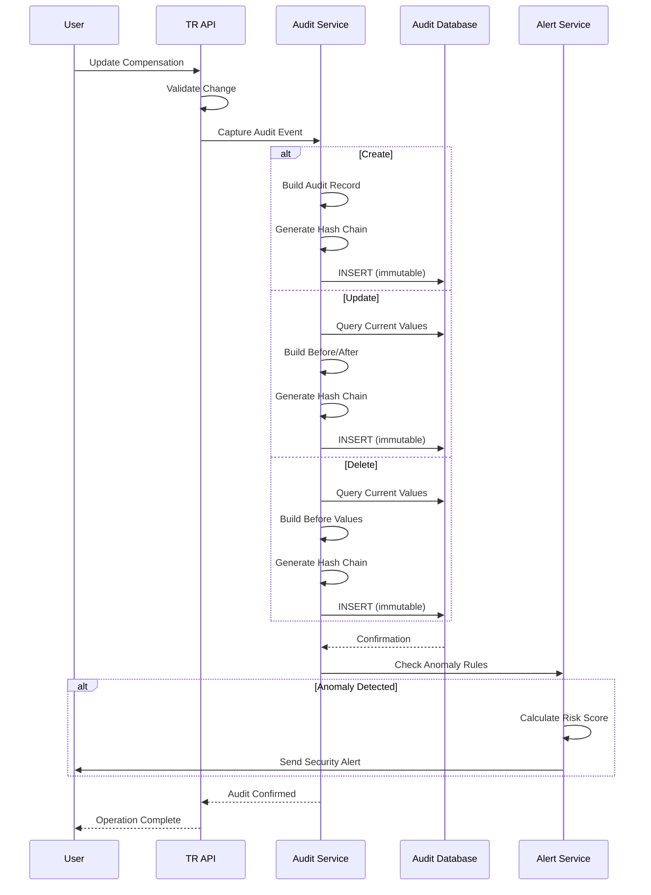

# Business Requirement Document: Audit Sub-module

## Executive Summary

The Audit sub-module provides comprehensive change tracking, compliance reporting, and data governance capabilities for the Total Rewards (TR) module. This is a **regulatory-critical** component that ensures all TR transactions are immutably recorded with complete before/after values, user attribution, and timestamp tracking.

**Key Differentiators:**
- **7-year retention** mandated by Southeast Asian labor and tax regulations
- **Monthly partitioning** for query performance at enterprise scale
- **Tamper-proof storage** using write-once, append-only architecture
- **AI/ML foundation** for anomaly detection in compensation patterns
- **Multi-country compliance** supporting 6+ Southeast Asian jurisdictions

---

## 1. Business Context

### 1.1 Organization Context

The Total Rewards module operates across a multi-country Southeast Asian organization with presence in:

| Country | Employees | Regulatory Body | Key Regulations |
|---------|-----------|-----------------|-----------------|
| Vietnam | 5,000+ | Ministry of Labor | Labor Code 2019, SI Law 2024 |
| Thailand | 2,000+ | Ministry of Labor | Labor Protection Act |
| Indonesia | 3,000+ | Ministry of Manpower | Manpower Act No. 13/2003 |
| Singapore | 1,500+ | Ministry of Manpower | Employment Act, PDPA |
| Malaysia | 1,000+ | SOCSO, EPF | Employment Act 1955 |
| Philippines | 2,500+ | DOLE | Labor Code, Data Privacy Act |

**Total Workforce:** 15,000+ employees across 6 countries

### 1.2 Current Problem

The organization currently faces significant audit and compliance challenges:

| Problem | Impact | Severity |
|---------|--------|----------|
| **Fragmented audit trails** | Compensation changes tracked in spreadsheets, emails, and disparate systems | CRITICAL |
| **No standardized retention** | Data deleted inconsistently; legal holds not enforced | HIGH |
| **Manual compliance reporting** | 2-3 weeks to compile audit evidence for regulatory examinations | HIGH |
| **No anomaly detection** | Unauthorized salary changes discovered months after occurrence | CRITICAL |
| **Inadequate access logging** | Cannot determine who viewed sensitive salary data | HIGH |
| **No tamper-proof storage** | Audit records can be modified without detection | CRITICAL |
| **Multi-country complexity** | Different retention requirements per jurisdiction not tracked | MEDIUM |

### 1.3 Business Impact

**Quantified Impact (Annual):**

| Impact Area | Current State | Target State | Improvement |
|-------------|---------------|--------------|-------------|
| Compliance report generation | 80 hours/report | 4 hours/report | 95% reduction |
| Audit evidence retrieval | 2-3 weeks | Real-time | 99% reduction |
| Unauthorized change detection | 6+ months | <24 hours | 99% faster |
| Regulatory penalty exposure | HIGH | MINIMAL | Risk mitigation |
| External audit costs | $150,000/year | $75,000/year | 50% reduction |

**Qualitative Impact:**
- **Reputational Risk:** Audit failures damage employer brand and investor confidence
- **Legal Liability:** Inadequate audit trails violate labor and tax regulations
- **Operational Inefficiency:** Manual tracking consumes HR resources
- **Data Privacy:** PDPA/GDPR violations from inadequate access controls

### 1.4 Why Now

| Driver | Urgency | Consequence of Delay |
|--------|---------|---------------------|
| **Vietnam SI Law 2024** | Effective July 2025 | Non-compliance penalties up to VND 100M |
| **Regional expansion** | 3 new countries in 2026 | Cannot scale without audit foundation |
| **External audit findings** | Q4 2025 audit identified gaps | Remediation required by Q2 2026 |
| **Data privacy regulations** | PDPA enforcement increasing | Fines up to 4% of revenue |
| **IPO preparation** | Planned 2027 | SOX-like controls required |

---

## 2. Business Objectives

The Audit sub-module shall achieve the following SMART objectives:

| ID | Objective | Metric | Baseline | Target | Timeline |
|----|-----------|--------|----------|--------|----------|
| **OBJ-AUD-001** | **Achieve 100% change capture** for all TR transactions | % of TR entity changes logged | ~60% (estimated) | 100% | Q2 2026 |
| **OBJ-AUD-002** | **Ensure 7-year data retention** for all audit records | % of records retained per policy | Inconsistent | 100% compliance | Q2 2026 |
| **OBJ-AUD-003** | **Enable real-time compliance reporting** | Report generation time | 80 hours | <4 hours | Q3 2026 |
| **OBJ-AUD-004** | **Detect anomalous transactions** within 24 hours | Time to detection | 6+ months | <24 hours | Q4 2026 |
| **OBJ-AUD-005** | **Achieve tamper-proof audit storage** | Audit modification incidents | Unknown | 0 | Q2 2026 |
| **OBJ-AUD-006** | **Support multi-country compliance** | Countries covered | 0 | 6+ | Q3 2026 |
| **OBJ-AUD-007** | **Reduce external audit costs** by 50% | Annual audit spend | $150,000 | $75,000 | Q4 2026 |

**Success Criteria Validation:**

| Objective | Validation Method |
|-----------|-------------------|
| OBJ-AUD-001 | Audit log coverage analysis across all TR entities |
| OBJ-AUD-002 | Retention policy audit with legal counsel sign-off |
| OBJ-AUD-003 | Time-motion study for compliance report generation |
| OBJ-AUD-004 | Anomaly detection accuracy testing with simulated scenarios |
| OBJ-AUD-005 | Penetration testing for audit record immutability |
| OBJ-AUD-006 | Country-specific compliance certification |
| OBJ-AUD-007 | Pre/post audit cost comparison |

---

## 3. Business Actors

The Audit sub-module involves the following actors with distinct permissions and responsibilities:

| Actor | Role Type | Key Responsibilities | Permissions | Constraints |
|-------|-----------|---------------------|-------------|-------------|
| **System Administrator** | Technical Admin | - Configure audit settings<br>- Manage retention policies<br>- Monitor system health | - Full audit log access<br>- Policy configuration<br>- Legal hold management | - Cannot modify audit records<br>- Requires 2FA for sensitive actions |
| **Compliance Officer** | Business User | - Generate compliance reports<br>- Respond to regulatory inquiries<br>- Manage external auditor access | - Report generation<br>- Export audit data<br>- Grant auditor access | - Cannot modify source data<br>- Export requires approval |
| **Security Administrator** | Technical Admin | - Monitor access patterns<br>- Investigate suspicious activity<br>- Configure alert rules | - Access log analysis<br>- Alert configuration<br>- Security incident response | - Cannot disable audit logging<br>- Alert changes require approval |
| **HR Administrator** | Business User | - View compensation history<br>- Track approval workflows<br>- Generate operational reports | - Entity version history<br>- Approval chain visibility<br>- Operational reporting | - Cannot view other HR admins' changes<br>- No export capability |
| **External Auditor** | Read-Only User | - Conduct compliance audits<br>- Verify control effectiveness<br>- Extract audit evidence | - Read-only audit access<br>- Report export<br>- Workpaper documentation | - Time-limited access<br>- Cannot modify any data<br>- All actions logged |
| **Department Manager** | Business User | - View team compensation changes<br>- Track approval status | - Team-level audit visibility<br>- Approval history | - Cannot view other departments<br>- No export capability |

**Actor Permission Matrix:**

| Capability | Sys Admin | Compliance | Security | HR Admin | External Auditor | Manager |
|------------|-----------|------------|----------|----------|------------------|---------|
| View audit logs | Yes | Yes | Yes | Limited | Yes (RO) | Team only |
| Export audit data | Yes | Yes | Yes | No | Yes (RO) | No |
| Configure retention | Yes | No | No | No | No | No |
| Place legal hold | Yes | Yes | No | No | No | No |
| Configure alerts | Yes | No | Yes | No | No | No |
| View access logs | Yes | Yes | Yes | No | Yes (RO) | No |
| Modify audit records | No | No | No | No | No | No |

---

## 4. Business Rules

### 4.1 Validation Rules

| ID | Rule | Description | Error Message |
|----|------|-------------|---------------|
| **VR-AUD-001** | Audit record completeness | Every audit record MUST contain: entity type, entity ID, action, user ID, timestamp, before/after values | "Audit record incomplete: missing [{field}]" |
| **VR-AUD-002** | Timestamp precision | All timestamps MUST be recorded with millisecond precision in UTC | "Timestamp precision invalid" |
| **VR-AUD-003** | User attribution | Every change MUST be attributable to a specific user or system account | "Change attribution required" |
| **VR-AUD-004** | Before/after values | UPDATE actions MUST include both before and after values; CREATE must include after; DELETE must include before | "Before/after values required for {action}" |
| **VR-AUD-005** | Data type validation | Audit field data types MUST match source entity schema | "Data type mismatch in audit record" |
| **VR-AUD-006** | Sensitive data handling | PII fields (salary, tax ID, bank account) MUST be encrypted in audit storage | "Sensitive data encryption required" |
| **VR-AUD-007** | Referential integrity | Audit records MUST reference valid entity IDs that exist or existed | "Invalid entity reference in audit record" |

### 4.2 Authorization Rules

| ID | Rule | Description | Enforcement |
|----|------|-------------|-------------|
| **AR-AUD-001** | Audit log access control | Audit logs accessible ONLY to authorized roles per permission matrix | RBAC enforcement at API and database level |
| **AR-AUD-002** | Segregation of duties | Users who CREATE/UPDATE TR data CANNOT modify corresponding audit records | Database-level write protection |
| **AR-AUD-003** | External auditor access | External auditors granted time-limited, read-only access with explicit expiration | Access expiration enforced automatically |
| **AR-AUD-004** | Export approval | Audit data exports >1000 records require Compliance Officer approval | Workflow approval before export |
| **AR-AUD-005** | After-hours access alerting | Access to sensitive salary data outside 6AM-10PM triggers security alert | Real-time alert generation |
| **AR-AUD-006** | Bulk access monitoring | >50 salary records accessed in 1 hour triggers investigation | Automatic flagging and review |
| **AR-AUD-007** | Legal hold override | Legal hold prevents ANY deletion regardless of user permissions | Database-level constraint |

### 4.3 Calculation Rules (Audit Log Structure)

| ID | Rule | Description | Formula/Logic |
|----|------|-------------|---------------|
| **CR-AUD-001** | Audit record ID generation | Audit record IDs follow format: `AUD-{entity_type}-{YYYYMMDD}-{sequence}` | `AUD-COMPADJ-20260320-00001` |
| **CR-AUD-002** | Retention deadline calculation | Retention deadline = creation_date + retention_period_years | `DATEADD(year, 7, created_at)` |
| **CR-AUD-003** | Partition key calculation | Monthly partition key derived from timestamp | `PARTITION_KEY = YEAR(timestamp) * 100 + MONTH(timestamp)` |
| **CR-AUD-004** | Hash chain calculation | Each audit record includes hash of previous record for tamper detection | `current_hash = SHA256(current_data + previous_hash)` |
| **CR-AUD-005** | Anomaly score calculation | Compensation change anomaly score based on deviation from peer group | `z_score = (change_pct - peer_avg) / peer_stddev` |
| **CR-AUD-006** | Risk threshold calculation | High-risk flag when anomaly score > 3.0 (3 standard deviations) | `is_high_risk = ABS(z_score) > 3.0` |
| **CR-AUD-007** | Compression ratio calculation | Storage compression ratio for cost optimization | `compression_ratio = uncompressed_size / compressed_size` |

**Audit Log Data Structure:**

```json
{
  "audit_id": "AUD-COMPADJ-20260320-00001",
  "entity_type": "CompensationAdjustment",
  "entity_id": "ca_123456789",
  "action": "UPDATE",
  "user_id": "usr_987654321",
  "user_name": "Nguyen Van A",
  "user_role": "HR_ADMINISTRATOR",
  "timestamp_utc": "2026-03-20T14:30:45.123Z",
  "ip_address": "10.0.1.100",
  "session_id": "sess_abcdef123456",
  "before": {
    "base_salary": 50000000,
    "effective_date": "2026-01-01",
    "reason": "ANNUAL_REVIEW"
  },
  "after": {
    "base_salary": 55000000,
    "effective_date": "2026-01-01",
    "reason": "ANNUAL_REVIEW"
  },
  "change_summary": {
    "fields_changed": ["base_salary"],
    "change_percentage": 10.0,
    "change_amount": 5000000
  },
  "hash_chain": {
    "previous_hash": "abc123...",
    "current_hash": "def456..."
  },
  "metadata": {
    "country": "VN",
    "legal_entity": "VN_ENTITY_001",
    "department": "Engineering",
    "cost_center": "CC_ENG_001"
  }
}
```

### 4.4 Constraint Rules

| ID | Rule | Description | Violation Handling |
|----|------|-------------|-------------------|
| **CE-AUD-001** | Immutability constraint | Audit records CANNOT be modified after creation | Database: write-once tables; Application: immutable entities |
| **CE-AUD-002** | Retention minimum | Audit records MUST be retained minimum 7 years from creation | Legal hold extends retention indefinitely |
| **CE-AUD-003** | Partition constraint | Audit data MUST be partitioned monthly for performance | Automatic partition creation; max 84 partitions (7 years) |
| **CE-AUD-004** | Storage constraint | Audit storage MUST be separate from operational data | Separate database/schema; different backup cycles |
| **CE-AUD-005** | Index constraint | Audit tables MUST have indexes on: entity_type, entity_id, user_id, timestamp | Automated index creation; monitored for fragmentation |
| **CE-AUD-006** | Capacity constraint | System MUST handle 1M+ audit records/day without degradation | Auto-scaling; partition pruning for queries |
| **CE-AUD-007** | Availability constraint | Audit system MUST maintain 99.9% uptime | Multi-region replication; failover capability |

### 4.5 Compliance Rules

| ID | Rule | Regulation | Jurisdiction | Penalty for Violation |
|----|------|------------|--------------|----------------------|
| **CP-AUD-001** | 7-year audit retention | Labor Code Art. 96, Tax Law Art. 52 | Vietnam | VND 50-100M fine |
| **CP-AUD-002** | 7-year tax record retention | Corporate Income Tax Law | All countries | 2-5% of underpaid tax |
| **CP-AUD-003** | Personal data protection | PDPA, GDPR-like regulations | Singapore, Malaysia | Up to 4% annual revenue |
| **CP-AUD-004** | Audit trail integrity | SOX Section 404 (pre-IPO) | All (investor requirement) | Audit failure, delisting |
| **CP-AUD-005** | Employee data access logging | PDPA Section 20 | Singapore | SGD 1M fine |
| **CP-AUD-006** | Cross-border data transfer | Data localization requirements | Indonesia | IDR 5B fine |
| **CP-AUD-007** | Right to audit access | Labor inspection rights | All countries | Operational shutdown |
| **CP-AUD-008** | Legal hold compliance | Litigation hold requirements | All countries | Contempt of court |

**Compliance Mapping Matrix:**

| Requirement | Vietnam | Thailand | Indonesia | Singapore | Malaysia | Philippines |
|-------------|---------|----------|-----------|-----------|----------|-------------|
| 7-year retention | Required | Required | Required | Required | Required | Required |
| Salary audit trail | Required | Required | Required | Required | Required | Required |
| Access logging | Required | Partial | Required | Required | Required | Required |
| Data encryption | Required | Recommended | Required | Required | Required | Required |
| PDPA compliance | Pending | Partial | Partial | Full | Partial | Full |
| Tamper-proof storage | Required | Required | Required | Required | Required | Required |

---

## 5. Out of Scope

The following items are explicitly **OUT OF SCOPE** for the Audit sub-module:

| Out of Scope Item | Rationale | Handled By |
|-------------------|-----------|------------|
| **Payroll audit trails** | Payroll is a separate module with its own audit requirements | Payroll Module (PY) |
| **Core HR employee data audit** | Employee master data has separate audit implementation | Core HR Module (CO) |
| **Performance Management audit** | Different domain with specialized requirements | Performance Module (PM) |
| **Time & Attendance audit** | High-volume time data requires specialized handling | Time & Absence Module (TA) |
| **Financial/GL audit trails** | Financial audit has different compliance requirements | Finance Module (FIN) |
| **Real-time fraud prevention** | Fraud prevention is proactive; Audit is reactive | Future ML/ Fraud module |
| **Document/evidence management** | Document retention is separate capability | Document Management |
| **Blockchain-based audit** | Emerging technology not ready for enterprise deployment | Future consideration |
| **Audio/video recording of user actions** | Privacy concerns; excessive for compliance needs | N/A |
| **Keylogger/screen capture** | Privacy violations; not appropriate for enterprise | N/A |

**Boundary Clarification:**



---

## 6. Assumptions & Dependencies

### 6.1 Assumptions

| ID | Assumption | Category | Impact if Invalid |
|----|------------|----------|-------------------|
| **ASM-AUD-001** | All TR entities have unique, immutable IDs | Technical | HIGH - Audit trail integrity compromised |
| **ASM-AUD-002** | System clock synchronized via NTP across all servers | Technical | HIGH - Timestamp consistency critical for forensics |
| **ASM-AUD-003** | Database supports write-once/append-only table types | Technical | MEDIUM - Alternative immutability controls needed |
| **ASM-AUD-004** | Storage costs remain stable (~$0.02/GB/month) | Financial | LOW - Budget adjustment required |
| **ASM-AUD-005** | Legal counsel will provide country-specific retention requirements | Legal | HIGH - Compliance gaps if not provided |
| **ASM-AUD-006** | User authentication is enforced for all system access | Security | CRITICAL - Audit attribution fails without auth |
| **ASM-AUD-007** | Network infrastructure supports real-time log shipping | Technical | MEDIUM - Audit latency increases |
| **ASM-AUD-008** | External auditors accept digital audit evidence | Business | MEDIUM - May require print capabilities |

### 6.2 Dependencies

| ID | Dependency | Type | Dependency Owner | Impact if Delayed |
|----|------------|------|------------------|-------------------|
| **DEP-AUD-001** | Core HR User Management module | External | Core HR Team | CRITICAL - No user attribution |
| **DEP-AUD-002** | Database partitioning capability | Technical | Platform Team | HIGH - Performance degradation |
| **DEP-AUD-003** | Encryption at rest infrastructure | Technical | Security Team | HIGH - Compliance violation |
| **DEP-AUD-004** | Total Rewards Core entities | External | TR Module Team | CRITICAL - Nothing to audit |
| **DEP-AUD-005** | Event streaming platform (Kafka) | Technical | Platform Team | MEDIUM - Real-time features delayed |
| **DEP-AUD-006** | Identity and Access Management (IAM) | External | Security Team | HIGH - Authorization enforcement |
| **DEP-AUD-007** | Backup and disaster recovery | Technical | Infrastructure Team | MEDIUM - Audit availability risk |
| **DEP-AUD-008** | Legal counsel retention policy sign-off | Business | Legal Department | HIGH - Compliance uncertainty |

**Dependency Timeline:**



---

## Appendix A: Audit Flow Diagram



---

## Appendix B: Entity Lifecycle States

| Entity State | Audit Action | Retention Period | Access Level |
|--------------|--------------|------------------|--------------|
| DRAFT | Log creation, changes | Until superseded | Creator only |
| PENDING_APPROVAL | Log submissions, approvals | 7 years after decision | Approvers + stakeholders |
| ACTIVE | Log all modifications | 7 years from effective date | Authorized roles |
| SUPERSEDED | Log supersession event | 7 years from supersession | Authorized roles |
| ARCHIVED | Log archive action | Until retention expiry | Read-only |
| LEGAL_HOLD | Prevent deletion | Indefinite | Legal + Compliance |
| EXPIRED | Log deletion event | Deletion confirmation only | System only |

---

## Appendix C: Cross-Reference Matrix

| Input Document | Section Reference | Output BRD Section |
|----------------|-------------------|-------------------|
| _research-report.md | Section 10: Regulatory Matrix | Section 4.5: Compliance Rules |
| entity-catalog.md | E-TR-007: SalaryHistory | Section 4.3: Calculation Rules |
| feature-catalog.md | FR-TR-075: Audit features | Section 2: Business Objectives |
| 01-functional-requirements.md | FR-TR-AUDIT-001 to 008 | Section 4: Business Rules |

---

## Appendix D: Glossary

| Term | Definition |
|------|------------|
| **Audit Trail** | Chronological record of all system changes with attribution |
| **Hash Chain** | Cryptographic linking of audit records for tamper detection |
| **Immutable** | Cannot be modified after creation; write-once property |
| **Legal Hold** | Suspension of normal deletion policies for litigation |
| **Partition Pruning** | Query optimization that skips irrelevant partitions |
| **SCD Type 2** | Slowly Changing Dimension Type 2 - full history tracking |
| **Tamper-Proof** | Resistant to unauthorized modification; detectable if changed |
| **Write-Once** | Storage that allows single write, multiple reads (WORM) |

---

## Document Control

| Version | Date | Author | Changes | Approver |
|---------|------|--------|---------|----------|
| 1.0.0 | 2026-03-20 | AI Assistant | Initial BRD creation | Pending |

**Review Cycle:**
- Business Review: Pending
- Technical Review: Pending
- Legal Review: Pending
- Security Review: Pending

**Approval Sign-off:**

| Role | Name | Signature | Date |
|------|------|-----------|------|
| Product Owner | | | |
| Architecture Lead | | | |
| Compliance Officer | | | |
| Security Officer | | | |
