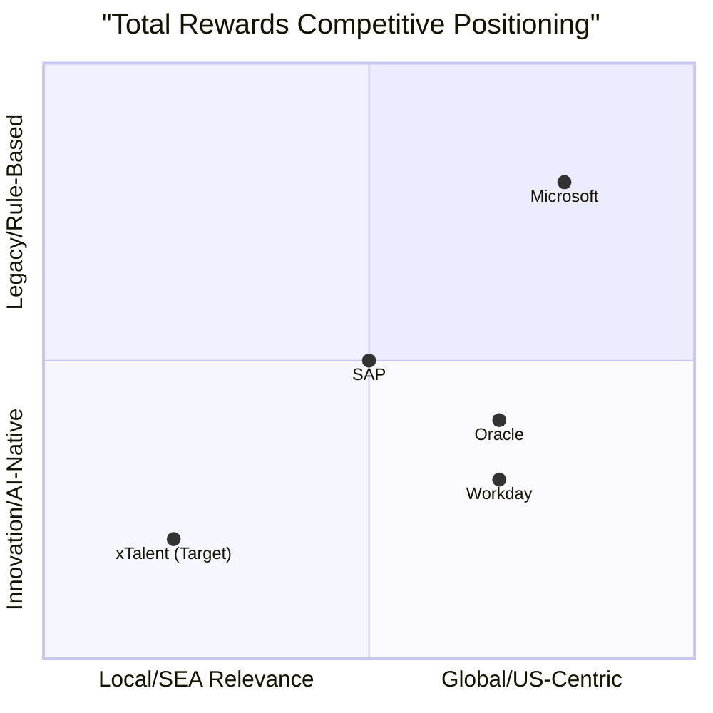
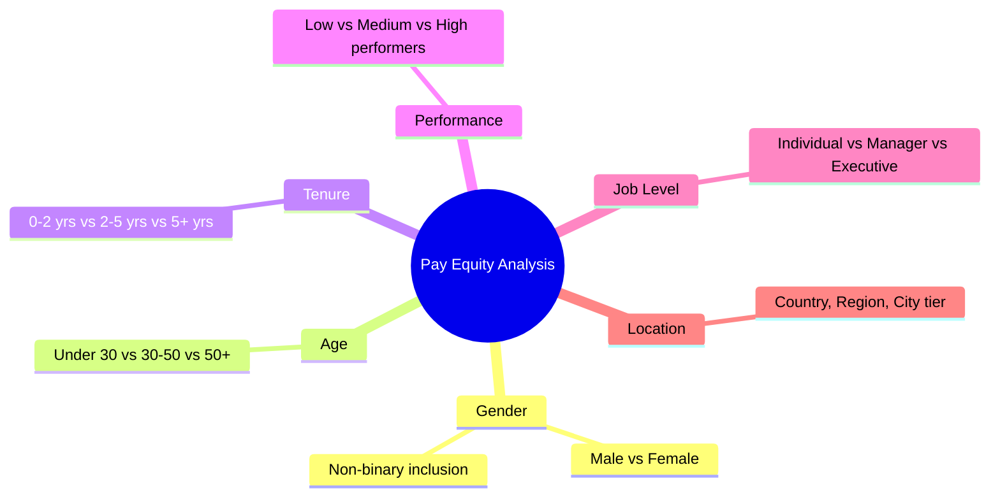
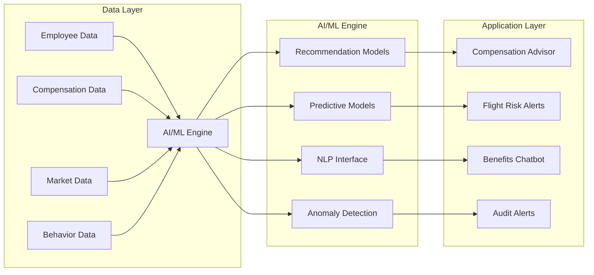
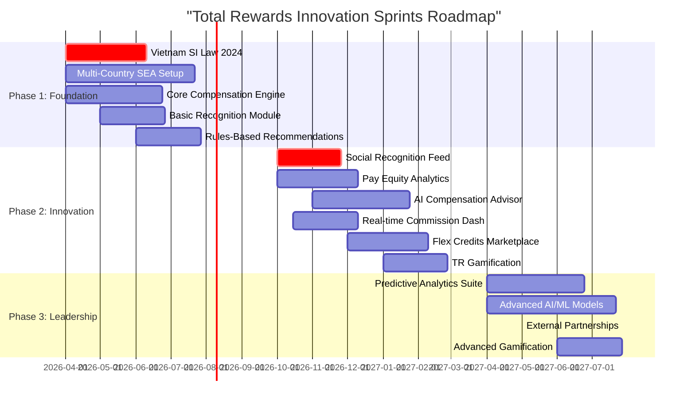
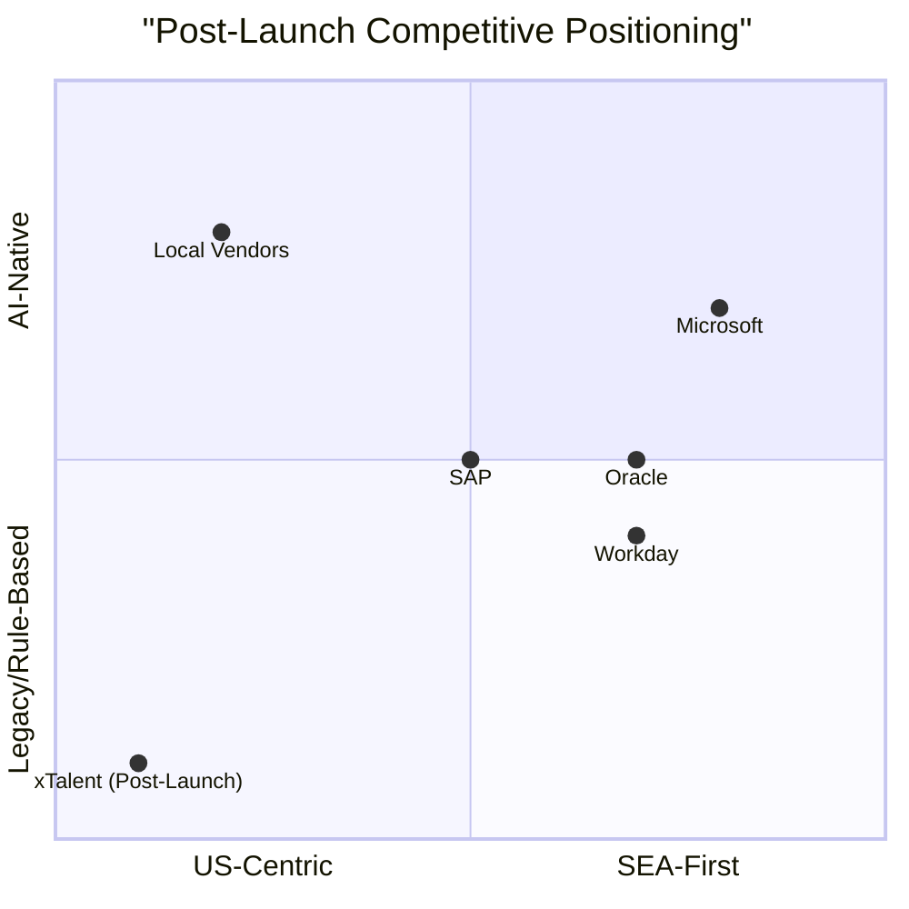

# Innovation Sprints: Total Rewards Module

> **Strategic Imperative**: Build a Total Rewards platform that doesn't just match Oracle, SAP, and Workday — but leapfrogs them in Southeast Asian market relevance and AI-native capabilities.

---

## 1. Executive Summary

### 1.1 Innovation Strategy Overview

The Total Rewards (TR) module represents a **strategic differentiator** for xTalent in the Southeast Asian HCM market. While global vendors (Oracle, SAP, Workday, Microsoft) dominate with mature compensation and benefits modules, they exhibit critical gaps in:

1. **Local regulatory compliance** (Vietnam SI Law 2024, multi-country SEA complexity)
2. **Modern employee experience** (social recognition, AI personalization)
3. **Real-time insights** (commission tracking, pay equity analytics)

**Our Innovation Thesis:**
```
Local Compliance Excellence + AI-Native Architecture + Modern UX = Market Leadership
```

### 1.2 Competitor Gap Analysis Summary

| Competitor | TR Module Maturity | SEA Localization | AI/ML Capabilities | Recognition | Overall Gap |
|------------|-------------------|------------------|-------------------|-------------|-------------|
| **Oracle HCM Cloud** | HIGH | LOW | MEDIUM | HIGH (Celebrate) | 40% |
| **SAP SuccessFactors** | HIGH | MEDIUM | MEDIUM | MEDIUM (Spot Awards) | 35% |
| **Workday HCM** | HIGH | LOW | HIGH | LOW | 45% |
| **Microsoft D365 HR** | MEDIUM | LOW | LOW | LOW | 60% |

**Key Finding:** No vendor achieves both deep SEA localization AND modern AI/UX innovation simultaneously.

### 1.3 Investment Recommendation

| Phase | Timeline | Investment Focus | Expected Outcome |
|-------|----------|------------------|------------------|
| **Phase 1** | Months 1-6 | Foundation (Compliance + Core) | Market entry capability |
| **Phase 2** | Months 7-12 | Innovation (AI + Social) | Competitive differentiation |
| **Phase 3** | Months 13-18 | Leadership (Predictive + Ecosystem) | Market leadership |

**Recommended Investment Level:** **HIGH** — Total Rewards is a core battleground for HCM vendor selection.

---

## 2. Competitor Analysis

### 2.1 Oracle HCM Cloud

**Market Position:** Leader in enterprise HCM with comprehensive TR suite

| Module | Features | Gaps/Limitations | Our Opportunity |
|--------|----------|------------------|-----------------|
| **Compensation** | - Workforce Rewards (base, variable, equity)<br>- Budget planning & allocation<br>- Merit cycle management<br>- Market data integration (Radford) | - Complex configuration<br>- Weak SEA salary benchmarking<br>- Limited Vietnam compliance | - Simplified setup wizard<br>- SEA-specific market data partnerships<br>- Vietnam SI Law 2024 natively |
| **Benefits** | - Oracle Benefits Cloud<br>- Life event detection<br>- Flex credits<br>- Carrier connectivity (US-centric) | - No SEA carrier integrations<br>- Benefits plan year assumes Jan-Dec<br>- Limited flex credit innovation | - Pre-built SEA insurer connectors (AIA, Prudential, Bao Viet)<br>- Lunar New Year life event support<br>- Flex Credits Marketplace |
| **Recognition** | - **Oracle Celebrate** (social feed, peer recognition)<br>- Service anniversaries<br>- Points redemption<br>- Gamification badges | - **Only 1/4 vendors with social feed**<br>- Separate acquisition (feels bolted-on)<br>- Limited APAC reward catalogs | - Native social feed (not acquired)<br>- SEA reward partners (Grab, Shopee, Lazada)<br>- Gamification tied to company values |
| **Well-being** | - Oracle Wellbeing (mental health, financial)<br>- Third-party integrations | - Shallow integration<br>- US-focused content | - Localized wellness content (SEA languages)<br>- Regional mental health partners |
| **Analytics** | - Total Compensation Statements<br>- Workforce modeling<br>- Compensation benchmarking | - Pay equity detection requires add-on<br>- No real-time commission tracking | - **Pay Equity Auto-Detection** (built-in)<br>- **Real-time Commission Dashboard** (industry first) |
| **AI/ML** | - Digital Assistant (chatbot)<br>- Recommendations (basic) | - Reactive, not proactive<br>- Limited compensation use cases | - **AI Compensation Advisor** (proactive)<br>- **Benefits Advisor** (personalized) |

**Oracle Vulnerability Score:** HIGH
- Celebrate is their only recognition moat (we match + improve)
- Weak on Vietnam/SEA localization
- AI capabilities are table stakes, not differentiating

---

### 2.2 SAP SuccessFactors

**Market Position:** Strong in mid-market, known for clean UX and integration

| Module | Features | Gaps/Limitations | Our Opportunity |
|--------|----------|------------------|-----------------|
| **Compensation** | - EC Compensation (embedded in Employee Central)<br>- Variable Pay module<br>- Merit & bonus planning<br>- AI-powered insights (new) | - **Only 1/4 vendors with AI compensation insights**<br>- Complex pricing (separate modules)<br>- Limited SEA localization | - Match AI insights + add explainability<br>- Bundled pricing (not a la carte)<br>- Multi-country SEA compliance |
| **Benefits** | - Benefits Administration<br>- Eligibility engine<br>- Open enrollment workflows | - Basic flex credits<br>- No marketplace concept<br>- Carrier integration is US-focused | - **Flex Credits Marketplace** (differentiator)<br>- SEA insurer ecosystem<br>- Benefits recommendation engine |
| **Recognition** | - SAP Spot Awards<br>- Manager-driven recognition<br>- Cash and non-cash rewards | - **No peer-to-peer capability**<br>- No social feed<br>- Limited gamification | - **Peer-to-Peer Recognition** (2/4 have it)<br>- **Social Recognition Feed** (1/4 have it)<br>- Full gamification suite |
| **Well-being** | - SAP SuccessFactors Wellbeing<br>- Basic wellness tracking | - Limited third-party ecosystem<br>- Generic content | - Curated SEA wellness partners<br>- Financial wellness (emerging need) |
| **Analytics** | - People Analytics (embedded)<br>- Total Rewards statements<br>- Storytelling reports | - Pay equity requires configuration<br>- No auto-detection | - **Pay Equity Auto-Detection** (proactive alerts)<br>- Commission tracking (missing in SAP) |
| **AI/ML** | - Joule AI Assistant (new)<br>- Compensation recommendations | - New, unproven<br>- Limited to suggestions | - **AI Compensation Advisor** with market data<br>- **Benefits Advisor** with enrollment guidance |

**SAP Vulnerability Score:** MEDIUM
- AI compensation insights are ahead, but we can match + localize
- Recognition is weak (no social, no peer-to-peer)
- SEA localization is improving but not deep

---

### 2.3 Workday HCM

**Market Position:** Premium enterprise HCM, unified architecture, strong analytics

| Module | Features | Gaps/Limitations | Our Opportunity |
|--------|----------|------------------|-----------------|
| **Compensation** | - Unified compensation (base, variable, equity)<br>- Merit, bonus, commission plans<br>- Market data integrations | - Expensive (premium pricing)<br>- Implementation complexity<br>- Limited Vietnam support | - **Mid-market pricing** with enterprise features<br>- Faster implementation (pre-configured)<br>- Vietnam SI Law 2024 ready |
| **Benefits** | - **Workday Benefits (best-in-class)**<br>- Flex credits (mature)<br>- Life event automation<br>- Carrier integrations (US) | - **Only 1/4 with mature flex credits**<br>- No SEA carriers<br>- Benefits year assumes calendar year | - Match flex credits + **Marketplace** concept<br>- SEA carrier partnerships<br>- Configurable plan year |
| **Recognition** | - Basic recognition (limited)<br>- Service anniversaries<br>- Manager awards | - **No peer-to-peer recognition**<br>- **No social feed**<br>- Minimal gamification | - **Full recognition suite** (peer, social, gamification)<br>- Modern employee experience |
| **Well-being** | - Workday Wellbeing (basic)<br>- Integration framework | - Limited native capability<br>- Relies on partners | - Native + partner ecosystem<br>- Financial wellness (regional focus) |
| **Analytics** | - **Prism Analytics** (best-in-class)<br>- **Pay Equity Analytics** (built-in)<br>- Total Compensation Statements | - **2/4 vendors with pay equity**<br>- Overkill for mid-market<br>- Complex to configure | - Simplified pay equity (SMB-friendly)<br>- **Real-time Commission Dashboard** (Workday gap) |
| **AI/ML** | - Workday AI (embedded)<br>- Predictive insights | - Generic, not compensation-specific<br>- Limited explainability | - **Specialized compensation AI**<br>- Transparent recommendations |

**Workday Vulnerability Score:** MEDIUM
- Best-in-class benefits and analytics (high bar)
- Recognition is weakest pillar (our opportunity)
- Premium pricing leaves mid-market underserved

---

### 2.4 Microsoft Dynamics 365 HR

**Market Position:** Strong for Microsoft-centric organizations, evolving HR capabilities

| Module | Features | Gaps/Limitations | Our Opportunity |
|--------|----------|------------------|-----------------|
| **Compensation** | - Fixed compensation<br>- Variable compensation<br>- Basic budgeting | - **Least mature of 4 vendors**<br>- Limited advanced features<br>- Requires Power Platform customization | - Full-featured compensation (match Oracle/SAP)<br>- Out-of-box vs. customize |
| **Benefits** | - Benefits management<br>- Basic enrollment<br>- Eligibility rules | - **No flex credits**<br>- Limited carrier integrations<br>- Basic UX | - **Flex Credits Marketplace** (no Microsoft equivalent)<br>- Superior UX |
| **Recognition** | - **No native recognition**<br>- Requires third-party (Vantage, Awardco) | - **0/4 vendors without native recognition**<br>- Fragmented experience<br>- Additional cost | - **Native recognition** (all-in-one)<br>- Cost advantage |
| **Well-being** | - Microsoft Viva (separate product)<br>- Requires additional licensing | - Not integrated with HR data<br>- Additional cost | - Integrated well-being<br>- Included in base pricing |
| **Analytics** | - Power BI integration<br>- HR analytics dashboards | - Requires Power BI expertise<br>- No pre-built TR analytics | - Pre-built TR dashboards<br>- No BI expertise required |
| **AI/ML** | - Copilot (new)<br>- Basic chatbot | - Not HR-specialized<br>- General-purpose AI | - **HR-specialized AI**<br>- Compensation-specific models |

**Microsoft Vulnerability Score:** VERY HIGH
- Least mature TR capabilities of 4 vendors
- No native recognition (major gap)
- Requires significant customization
- **Easiest competitor to displace**

---

### 2.5 Competitive Positioning Matrix



**Strategic Insight:** xTalent targets the **bottom-left quadrant** (High SEA Relevance + High Innovation) — currently unoccupied.

---

## 3. USP Features: Phase 1 — Foundation (Parity Done Better)

> **Strategy:** Match competitor table stakes while embedding SEA differentiation from day one.

### 3.1 Vietnam SI Law 2024 Compliance

| Attribute | Detail |
|-----------|--------|
| **Competitor Coverage** | Local vendors only (TalentCorp, Base, 1Office) — **0/4 global vendors** |
| **Innovation Level** | COMPLIANCE (mandatory for Vietnam market entry) |
| **Investment Priority** | P0 — Critical path for July 2025 deadline |
| **Development Effort** | 8-10 weeks (rules engine + versioning) |

**Feature Specification:**

| Component | Detail |
|-----------|--------|
| **BHXH (Social Insurance)** | 17.5% employer + 8% employee |
| **BHYT (Health Insurance)** | 3% employer + 1.5% employee |
| **BHTN (Unemployment Insurance)** | 1% employer + 1% employee |
| **Salary Cap** | 20x statutory minimum wage |
| **Pension Eligibility** | 15 years of contributions (changed from 20 years) |
| **Effective Date** | July 1, 2025 |

**Differentiation vs. Local Vendors:**
- Versioned rules engine (future-proof for regulatory changes)
- Audit trail for compliance reporting
- Integration with payroll (no manual reconciliation)
- Employee self-service SI tracking

**Competitive Moat:** Global vendors cannot justify Vietnam-specific SI investment at their scale. Local vendors lack enterprise architecture. **xTalent wins with enterprise-grade local compliance.**

---

### 3.2 Multi-Country SEA Compliance

| Attribute | Detail |
|-----------|--------|
| **Competitor Coverage** | **0/4 global vendors** have unified SEA compliance |
| **Innovation Level** | PARITY (done better) |
| **Investment Priority** | P1 — Regional expansion enabler |
| **Development Effort** | 12-16 weeks (6 countries) |

**Country Coverage:**

| Country | Key Compliance Requirements |
|---------|-----------------------------|
| **Vietnam** | SI Law 2024, Labor Code 2019, 13th month salary, 4-region minimum wage |
| **Thailand** | Social Security Fund (5% each), Provident Fund, Severance pay by tenure |
| **Indonesia** | BPJS Kesehatan (Health), BPJS Ketenagakerjaan (Employment), THR (religious allowance) |
| **Singapore** | CPF (Central Provident Fund), SDL (Skills Development Levy) |
| **Malaysia** | EPF (Employees Provident Fund), SOCSO (Social Security), EIS (Employment Insurance) |
| **Philippines** | SSS (Social Security), PhilHealth, Pag-IBIG (Housing), 13th month (mandatory) |

**Differentiation:**
- Single platform, multi-country compliance
- Unified reporting across SEA entities
- Configurable per-country rules engine
- **No competitor offers 6-country SEA coverage in one platform**

---

### 3.3 Hybrid Carrier Integration

| Attribute | Detail |
|-----------|--------|
| **Competitor Coverage** | Oracle, SAP, Workday (US carriers only) |
| **Innovation Level** | PARITY (pragmatic approach) |
| **Investment Priority** | P2 — Operational efficiency |
| **Development Effort** | 6-8 weeks (framework + 3 connectors) |

**Hybrid Approach:**

```mermaid
graph LR
    subgraph "xTalent Benefits Engine"
        A[Benefits Enrollment] --> B[Eligibility Validation]
        B --> C[Carrier Sync Engine]
    end

    subgraph "Integration Layer"
        C --> D[API Connector]
        C --> E[File-Based Fallback]
        C --> F[Manual Export]
    end

    subgraph "Carrier Systems"
        D --> G[AIA Digital API]
        D --> H[Prudential API]
        E --> I[Bao Viet (EDI)]
        F --> J[Small Carriers]
    end
```

**Integration Tiers:**

| Tier | Method | Use Case | Carriers |
|------|--------|----------|----------|
| **Tier 1** | Real-time API | Digital-native insurers | AIA, Prudential, Manulife |
| **Tier 2** | EDI/File Sync | Traditional insurers | Bao Viet, PJICO, Thai Life |
| **Tier 3** | Manual Export | Small/regional carriers | Local providers |

**Differentiation:** Competitors assume API-first carrier landscape. **SEA reality is mixed technology maturity.** Hybrid approach ensures 100% carrier coverage vs. 30% for API-only.

---

## 4. USP Features: Phase 2 — Innovation (True Differentiators)

> **Strategy:** Deploy features that 0-2 competitors offer, creating defensible market position.

### 4.1 Innovation Feature Matrix

| Feature | Competitor Gap | Innovation Level | Investment Priority | Development Effort |
|---------|---------------|------------------|---------------------|-------------------|
| **Social Recognition Feed** | Oracle Celebrate only (1/4 vendors) | HIGH | Priority 1 | 6-8 weeks |
| **Peer-to-Peer Recognition** | Oracle, SAP only (2/4) | HIGH | Priority 1 | 4-6 weeks |
| **Pay Equity Auto-Detection** | Workday, Oracle (2/4) | HIGH | Priority 1 | 8-10 weeks |
| **AI Compensation Advisor** | SAP only (1/4) | HIGH | Priority 1 | 10-12 weeks |
| **Flex Credits Marketplace** | Workday (1/4) | MEDIUM | Priority 2 | 8-10 weeks |
| **Real-time Commission Dashboard** | **None (industry gap)** | HIGH | Priority 1 | 6-8 weeks |
| **TR Gamification** | Third-party only | MEDIUM | Priority 2 | 6-8 weeks |

---

### 4.2 Social Recognition Feed

| Attribute | Detail |
|-----------|--------|
| **Competitor Coverage** | **Oracle Celebrate only (1/4)** — Workday, SAP, Microsoft lack this |
| **Innovation Level** | HIGH — Employees expect social UX (LinkedIn, Workplace) |
| **Investment Priority** | Priority 1 — Culture driver, high visibility |
| **Development Effort** | 6-8 weeks |

**Feature Specification:**

| Component | Detail |
|-----------|--------|
| **Real-time Feed** | Activity stream showing recognition across organization |
| **Social Interactions** | Like, comment, share recognition posts |
| **Privacy Controls** | Public (all company), Team (department), Private (recipient only) |
| **External Sharing** | LinkedIn integration for employer branding |
| **Moderation** | Flag inappropriate content, admin review workflow |

**Competitive Analysis:**

| Vendor | Product | Social Feed | Like/Comment | Share External |
|--------|---------|-------------|--------------|----------------|
| Oracle | Celebrate | Yes | Yes | Yes |
| SAP | Spot Awards | No | N/A | N/A |
| Workday | Recognition | No | N/A | N/A |
| Microsoft | None | N/A | N/A | N/A |
| **xTalent** | **Native** | **Yes** | **Yes** | **Yes + LinkedIn** |

**Differentiation:** Oracle acquired Celebrate (third-party). **xTalent builds native** with deeper HCM integration (no data sync required).

---

### 4.3 Peer-to-Peer Recognition

| Attribute | Detail |
|-----------|--------|
| **Competitor Coverage** | **Oracle, SAP (2/4)** — Workday and Microsoft lack this |
| **Innovation Level** | HIGH — Shifts recognition from top-down to culture-driven |
| **Investment Priority** | Priority 1 — Employee engagement driver |
| **Development Effort** | 4-6 weeks |

**Feature Specification:**

| Component | Detail |
|-----------|--------|
| **Universal Sending** | Any employee can recognize any employee |
| **Value Tagging** | Link recognition to company values (Innovation, Collaboration, etc.) |
| **Reward Options** | Points, cash bonus, or kudos-only |
| **Budget Controls** | Per-employee monthly send limit, manager approval threshold |
| **Visibility** | Feed integration, manager dashboard |

**Business Rules:**

```
IF sender.role = "employee" AND amount <= 50 points:
    → Auto-approve, deduct from sender's monthly allocation

IF sender.role = "employee" AND amount > 50 points:
    → Route to sender.manager for approval

IF recognition.value_tag IS NULL:
    → Prompt sender to select company value
```

**Differentiation:** SAP requires manager approval for all peer recognition. **xTalent allows autonomous recognition within guardrails**, creating authentic culture vs. bureaucratic process.

---

### 4.4 Pay Equity Auto-Detection

| Attribute | Detail |
|-----------|--------|
| **Competitor Coverage** | **Workday, Oracle (2/4)** — SAP and Microsoft lack this |
| **Innovation Level** | HIGH — Regulatory trend (EU Pay Transparency Directive, US state laws) |
| **Investment Priority** | Priority 1 — Compliance + DEI imperative |
| **Development Effort** | 8-10 weeks |

**Feature Specification:**

| Component | Detail |
|-----------|--------|
| **Automated Analysis** | Continuous pay equity monitoring (not manual reports) |
| **Demographic Dimensions** | Gender, age, ethnicity (configurable per country) |
| **Statistical Testing** | Regression analysis controlling for legitimate factors |
| **Threshold Alerts** | Proactive notification when gap exceeds 5% |
| **Remediation Workflow** | Budget proposal, approval, adjustment tracking |

**Analysis Dimensions:**



**Competitive Analysis:**

| Vendor | Product | Auto-Detection | Statistical Testing | Remediation Workflow |
|--------|---------|----------------|---------------------|----------------------|
| Oracle | Compensation | Yes (add-on) | Basic | Limited |
| SAP | EC Compensation | No | N/A | N/A |
| Workday | Pay Equity | Yes | Advanced | Yes |
| Microsoft | D365 HR | No | N/A | N/A |
| **xTalent** | **Pay Equity Analytics** | **Yes (built-in)** | **Advanced** | **Full workflow** |

**Differentiation:** Workday requires expensive analytics module. **xTalent includes pay equity in core TR** — compliance should not be premium-priced.

---

### 4.5 AI Compensation Advisor

| Attribute | Detail |
|-----------|--------|
| **Competitor Coverage** | **SAP only (1/4)** — emerging capability |
| **Innovation Level** | HIGH — AI-native approach to compensation decisions |
| **Investment Priority** | Priority 1 — Strategic differentiator |
| **Development Effort** | 10-12 weeks (models + explainability) |

**Feature Specification:**

| Component | Detail |
|-----------|--------|
| **Salary Recommendations** | AI suggests offer/promo salary based on market + internal equity |
| **Merit Increase Guidance** | Personalized increase recommendations by performance + compa-ratio |
| **Flight Risk Detection** | ML model identifies underpaid employees at risk of leaving |
| **Explainable AI** | Clear rationale for each recommendation (no black box) |
| **Manager Interface** | Chat-based advisor ("What should I pay this employee?") |

**AI Model Inputs:**

| Input Category | Data Sources |
|----------------|--------------|
| **Market Data** | Salary surveys, job postings, competitor benchmarking |
| **Internal Equity** | Compa-ratio, grade placement, peer comparisons |
| **Performance** | Performance ratings, goal achievement, tenure |
| **Retention Risk** | Flight risk signals (market demand, compensation history) |
| **Budget Constraints** | Approved merit budget, department allocation |

**Example Manager Interaction:**

```
Manager: "What increase should I recommend for Nguyen Van A?"

AI Advisor: "Based on the following factors:
  - Performance: Exceeds Expectations (top 15%)
  - Current compa-ratio: 0.92 (below grade midpoint)
  - Market position: 55th percentile (target is 60th)
  - Flight risk: MEDIUM (high demand for this skill set)

  Recommended increase: 12-15%
  - Market adjustment: 8%
  - Performance merit: 5-7%

  Budget impact: VND 45M annually"
```

**Differentiation:** SAP's AI is new and unproven. **xTalent builds AI-native with explainability** — managers trust recommendations they understand.

---

### 4.6 Flex Credits Marketplace

| Attribute | Detail |
|-----------|--------|
| **Competitor Coverage** | **Workday (1/4)** — mature flex credits, no marketplace |
| **Innovation Level** | MEDIUM — Evolution of flex credits with consumer-grade UX |
| **Investment Priority** | Priority 2 — Employee experience enhancer |
| **Development Effort** | 8-10 weeks |

**Feature Specification:**

| Component | Detail |
|-----------|--------|
| **Credit Allocation** | Employer-defined credits by grade/level |
| **Benefits Menu** | Employees choose from health, wellness, learning, lifestyle |
| **Marketplace UX** | E-commerce experience (cart, compare, checkout) |
| **Rollover Policy** | Configurable unused credit handling (cash out, rollover, forfeiture) |
| **Mid-year Changes** | Life event-triggered reallocation |

**Benefits Categories:**

| Category | Examples | SEA Relevance |
|----------|----------|---------------|
| **Health** | Upgraded health plan, dental, vision | High (out-of-pocket healthcare costs) |
| **Wellness** | Gym membership, meditation app, wellness checkups | Medium (growing trend) |
| **Learning** | Course subsidies, certification fees, language training | High (skill development priority) |
| **Lifestyle** | Grab credits, Shopee vouchers, travel allowances | High (SEA digital economy) |
| **Financial** | Additional superannuation, loan interest subsidy | Medium (financial wellness emerging) |

**Marketplace Partners (SEA Focus):**

| Partner Type | Examples | Integration Level |
|--------------|----------|-------------------|
| **E-commerce** | Shopee, Lazada, Tiki | Voucher API |
| **Ride-hailing** | Grab, Gojek | Credit integration |
| **Learning** | Coursera, Udemy, local providers | Enrollment API |
| **Wellness** | ClassPass, local gyms | Membership sync |
| **Travel** | Traveloka, Agoda | Booking credits |

**Differentiation:** Workday has flex credits but no curated marketplace. **xTalent partners with SEA consumer brands** — employees recognize and value redemption options.

---

### 4.7 Real-time Commission Dashboard

| Attribute | Detail |
|-----------|--------|
| **Competitor Coverage** | **None — Industry gap identified** |
| **Innovation Level** | HIGH — First-mover advantage in sales compensation |
| **Investment Priority** | Priority 1 — No direct competition |
| **Development Effort** | 6-8 weeks |

**Feature Specification:**

| Component | Detail |
|-----------|--------|
| **Live Commission Tracking** | Real-time calculation as deals close |
| **Quota Attainment** | Visual progress toward monthly/quarterly/annual quotas |
| **Accelerator Modeling** | See impact of hitting accelerator thresholds |
| **What-if Scenarios** | "If I close this deal, what's my commission?" |
| **Dispute Workflow** | Challenge commission calculation with manager review |

**Dashboard Components:**

```mermaid
graph TD
    subgraph "Commission Dashboard"
        A[Current Month Earnings] --> B[Quota Progress Bar]
        B --> C[Accelerator Tracker]
        C --> D[Deal Pipeline Impact]
        D --> E[Year-to-Date Summary]
        E --> F[Projection to Year-End]
    end

    subgraph "Data Sources"
        G[CRM (Opportunity)] --> D
        H[Compensation Plan Rules] --> C
        I[Closed Deals] --> A
    end
```

**Use Case:**

```
Sales Rep: Nguyen Thi B
Territory: North Vietnam
Quota: USD 500K annually

Current Status (Month 6):
- Deals Closed: USD 275K (55% of quota)
- Commission Earned: USD 27.5K
- Projected Year-End: USD 550K (110% of quota)
- Accelerator Trigger: 105% quota = 1.5x commission rate

Actionable Insight:
"Close USD 50K more this quarter to reach 105% quota
and unlock 1.5x accelerator on ALL commissions"
```

**Competitive Analysis:**

| Vendor | Commission Support | Real-time | Dashboard | What-if Modeling |
|--------|-------------------|-----------|-----------|------------------|
| Oracle | Variable Pay module | Batch | Basic | No |
| SAP | Incentive Management | Batch | Limited | No |
| Workday | Commission tracking | Batch | Basic | No |
| Microsoft | Custom (Power Platform) | N/A | N/A | N/A |
| **xTalent** | **Native Commission Module** | **Real-time** | **Advanced** | **Yes** |

**Differentiation:** **Zero competitors offer real-time commission tracking.** Sales organizations rely on spreadsheets or specialized Spiff/Xactly (separate system). **xTalent embeds this in core TR** — major differentiator for sales-driven companies.

---

### 4.8 TR Gamification

| Attribute | Detail |
|-----------|--------|
| **Competitor Coverage** | Third-party focus (Achievers, O.C. Tanner) |
| **Innovation Level** | MEDIUM — Engagement enhancer |
| **Investment Priority** | Priority 2 — Culture driver |
| **Development Effort** | 6-8 weeks |

**Feature Specification:**

| Component | Detail |
|-----------|--------|
| **Badges & Achievements** | Collectible badges for milestones, values demonstration |
| **Leaderboards** | Team/department recognition rankings (opt-in) |
| **Levels & Progression** | Recognition "levels" (Bronze → Silver → Gold → Platinum) |
| **Challenges** | Company-wide challenges (e.g., "100 Acts of Recognition Week") |
| **Rewards Multipliers** | Bonus points for specific behaviors (peer recognition, values alignment) |

**Gamification Mechanics:**

| Mechanic | Description | Example |
|----------|-------------|---------|
| **Points** | Earn points for recognition given/received | 10 points per recognition |
| **Badges** | Collectible achievements | "Collaboration Champion" badge |
| **Levels** | Progressive status tiers | Level 1: Newcomer → Level 10: Legend |
| **Leaderboards** | Social comparison | Top recognizers this month |
| **Challenges** | Time-bound goals | "Give 5 recognitions this week" |
| **Streaks** | Consecutive activity tracking | "7-day recognition streak" |

**Differentiation:** Oracle Celebrate has basic gamification. **xTalent goes deeper with progression systems** (levels, badges, challenges) inspired by gaming/fitness apps.

---

## 5. AI/ML Foundation

> **Strategic Vision:** Build AI/ML capabilities that transform Total Rewards from administrative system to intelligent advisor.

### 5.1 AI/ML Architecture Overview



### 5.2 AI/ML Capabilities Roadmap

| Capability | Use Case | Model Type | Phase | Priority |
|------------|----------|------------|-------|----------|
| **Compensation Recommendations** | Salary offer/promotion guidance | Regression + Rule-based | Phase 2 | P1 |
| **Benefits Advisor** | Enrollment recommendations | Collaborative filtering | Phase 2 | P1 |
| **Recognition Suggestions** | Peer recognition prompts | NLP + Behavioral triggers | Phase 2 | P2 |
| **Anomaly Detection (Audit)** | Unusual compensation patterns | Anomaly detection | Phase 2 | P1 |
| **Loan Risk Assessment** | Employee loan default prediction | Classification | Phase 3 | P2 |
| **Tax Optimization** | Tax-efficient compensation structuring | Optimization | Phase 3 | P2 |

---

### 5.3 Compensation Recommendations

| Attribute | Detail |
|-----------|--------|
| **Model Type** | Regression (salary prediction) + Rules (guardrails) |
| **Training Data** | Internal comp data + Market benchmarks |
| **Output** | Salary range recommendation with confidence interval |
| **Explainability** | Feature importance breakdown |

**Use Cases:**

| Scenario | Input | Output |
|----------|-------|--------|
| **New Hire Offer** | Role, level, location, experience, skills | Recommended salary range (P50-P75 market) |
| **Promotion Adjustment** | New level, current compa-ratio, performance | Increase recommendation (market + merit) |
| **Retention Counter-offer** | Flight risk score, market demand, current comp | Retention adjustment range |
| **Merit Cycle** | Performance, compa-ratio, budget, tenure | Personalized increase % |

**Model Features:**

```
Input Features:
  - Employee: tenure, performance ratings (last 3 cycles), skills, certifications
  - Job: job family, level, market benchmark percentile
  - Compensation: current salary, compa-ratio, last increase %, history
  - Market: salary survey data, job posting salaries, competitor benchmarks
  - Context: location, department budget, manager history

Output:
  - Recommended salary: VND X - Y (95% confidence interval)
  - Rationale: "Market adjustment (8%) + Performance merit (5%)"
  - Risk flag: "Below grade minimum" / "Above range maximum"
```

---

### 5.4 Benefits Advisor

| Attribute | Detail |
|-----------|--------|
| **Model Type** | Collaborative filtering + Content-based |
| **Training Data** | Historical enrollment + Employee demographics |
| **Output** | Personalized benefits recommendations |
| **Explainability** | "Employees like you chose..." |

**Use Cases:**

| Scenario | Input | Output |
|----------|-------|--------|
| **New Hire Enrollment** | Age, family status, location, role | Benefits package suggestions |
| **Open Enrollment** | Current elections, life changes, utilization | Change recommendations |
| **Life Event** | Event type (marriage, birth), new circumstances | Election adjustments |

**Recommendation Logic:**

```
IF employee.age < 30 AND employee.health_status = "good":
    → Recommend: High-deductible health plan + HSA
    → Rationale: "Lower premiums, tax-advantaged savings"

IF employee.has_dependents = true:
    → Recommend: Upgraded life insurance, family dental
    → Rationale: "Protect your family's financial security"

IF employee.location = "Vietnam" AND employee.grade >= "M3":
    → Recommend: Premium health insurance (international coverage)
    → Rationale: "Executives value international healthcare access"
```

---

### 5.5 Recognition Suggestions

| Attribute | Detail |
|-----------|--------|
| **Model Type** | NLP (sentiment analysis) + Behavioral triggers |
| **Training Data** | Recognition history + Project milestones |
| **Output** | Contextual recognition prompts |
| **Explainability** | Transparent trigger logic |

**Trigger Events:**

| Trigger | Context | Suggestion |
|---------|---------|------------|
| **Project Completion** | Project marked "Complete" in PM module | "Recognize your team for delivering Project X on time" |
| **Peer Collaboration** | Employee mentioned in kudos | "Thank Nguyen for supporting your presentation" |
| **Milestone Achievement** | Goal marked "Achieved" | "Celebrate reaching Q3 sales target" |
| **Anniversary** | Employment anniversary | "Recognize 5 years of dedication" |
| **Customer Feedback** | Positive NPS comment | "Share customer praise with the team" |

---

### 5.6 Anomaly Detection (Audit)

| Attribute | Detail |
|-----------|--------|
| **Model Type** | Unsupervised anomaly detection (Isolation Forest) |
| **Training Data** | Historical compensation changes + Patterns |
| **Output** | Flagged transactions for review |
| **Explainability** | Anomaly score + contributing factors |

**Detection Scenarios:**

| Scenario | Anomaly Signal | Action |
|----------|----------------|--------|
| **Off-cycle Increase** | Salary change outside merit cycle | Flag for HR review |
| **Retroactive Adjustment** | Backdated compensation change | Audit trail required |
| **Pattern Deviation** | Increase % outside grade norms | Manager justification |
| **Approval Bypass** | Change without required approval | Block + escalate |
| **Duplicate Payment** | Same award processed twice | Alert payroll |

---

### 5.7 Loan Risk Assessment

| Attribute | Detail |
|-----------|--------|
| **Model Type** | Binary classification (default prediction) |
| **Training Data** | Employee loans + repayment history + demographics |
| **Output** | Default probability score |
| **Explainability** | Risk factors ranked by impact |

**Risk Factors:**

| Factor | Weight | Rationale |
|--------|--------|-----------|
| **Debt-to-Income Ratio** | HIGH | Primary predictor of default |
| **Employment Tenure** | MEDIUM | Stability indicator |
| **Credit History** | HIGH | Past behavior predicts future |
| **Performance Trend** | LOW | Declining performance = risk signal |
| **Life Events** | MEDIUM | Recent changes impact cash flow |

**Use Case:** Employee loan program approval with AI-assisted risk scoring.

---

### 5.8 Tax Optimization

| Attribute | Detail |
|-----------|--------|
| **Model Type** | Optimization (linear programming) |
| **Training Data** | Tax codes + Compensation structures |
| **Output** | Tax-efficient compensation mix |
| **Explainability** | Tax savings breakdown |

**Use Cases:**

| Scenario | Optimization |
|----------|--------------|
| **Executive Compensation** | Balance salary vs. bonus vs. equity for tax efficiency |
| **Expatriate Packages** | Structure allowances to minimize tax liability |
| **Severance Planning** | Optimize termination payment timing/structure |

---

## 6. Implementation Roadmap

### 6.1 Three-Phase Delivery Plan



---

### 6.2 Phase 1 (Months 1-6): Foundation

**Theme:** "Compliance + Core Capability"

| Sprint | Duration | Deliverables | Success Criteria |
|--------|----------|--------------|------------------|
| **Sprint 1-2** | Weeks 1-4 | - SI Law 2024 rules engine<br>- Versioning framework | - SI calculation passes test cases<br>- Rate change effective dating works |
| **Sprint 3-4** | Weeks 5-8 | - Multi-country config (VN, TH, ID)<br>- Core comp structures | - 3 countries production-ready<br>- Salary structure CRUD complete |
| **Sprint 5-6** | Weeks 9-12 | - Remaining countries (SG, MY, PH)<br>- Base pay + allowances | - All 6 countries configured<br>- Payroll integration complete |
| **Sprint 7-8** | Weeks 13-16 | - Basic recognition (manager awards)<br>- Rules-based recommendations | - Manager can give awards<br>- Simple recommendations work |
| **Sprint 9-10** | Weeks 17-20 | - Compensation review workflow<br>- Budget management | - Merit cycle can be executed<br>- Budget tracking functional |
| **Sprint 11-12** | Weeks 21-24 | - Benefits enrollment<br>- Life event triggers | - Open enrollment successful<br>- Life events auto-detect |

**Phase 1 Exit Criteria:**
- ✅ Vietnam SI Law 2024 compliant (July 2025 deadline)
- ✅ Core compensation functional for all 6 SEA countries
- ✅ Basic recognition (no social feed)
- ✅ Rules-based recommendations (no ML)

---

### 6.3 Phase 2 (Months 7-12): Innovation

**Theme:** "Differentiation + AI"

| Sprint | Duration | Deliverables | Success Criteria |
|--------|----------|--------------|------------------|
| **Sprint 13-14** | Weeks 25-28 | - Social Recognition Feed<br>- Like/comment functionality | - Feed shows real-time updates<br>- Engagement metrics tracked |
| **Sprint 15-16** | Weeks 29-32 | - Peer-to-Peer Recognition<br>- Budget controls | - Employees can send recognition<br>- Approval workflows work |
| **Sprint 17-18** | Weeks 33-36 | - Pay Equity Auto-Detection<br>- Statistical analysis | - System detects pay gaps >5%<br>- Remediation workflow functional |
| **Sprint 19-21** | Weeks 37-48 | - AI Compensation Advisor<br>- Model training + explainability | - AI recommendations within 10% of human expert<br>- Managers understand rationale |
| **Sprint 22-23** | Weeks 49-52 | - Real-time Commission Dashboard<br>- What-if modeling | - Sales reps see live commissions<br>- Projections accurate |
| **Sprint 24-25** | Weeks 53-56 | - Flex Credits Marketplace<br>- Partner integrations | - Employees can redeem credits<br>- 3+ marketplace partners live |
| **Sprint 26-27** | Weeks 57-60 | - TR Gamification<br>- Badges, levels, challenges | - Gamification drives 20%+ engagement lift |

**Phase 2 Exit Criteria:**
- ✅ Social Recognition Feed live (Oracle differentiator matched)
- ✅ AI Compensation Advisor production (SAP differentiator matched + exceeded)
- ✅ Pay Equity Auto-Detection (Workday differentiator matched)
- ✅ Real-time Commission Dashboard (industry first — no competition)

---

### 6.4 Phase 3 (Months 13-18): Market Leadership

**Theme:** "Predictive + Ecosystem"

| Sprint | Duration | Deliverables | Success Criteria |
|--------|----------|--------------|------------------|
| **Sprint 28-30** | Weeks 61-72 | - Predictive Analytics Suite<br>- Flight risk modeling | - Predictions within 15% accuracy<br>- HR acts on alerts |
| **Sprint 31-33** | Weeks 73-84 | - Advanced AI/ML (Benefits Advisor, Recognition Suggestions)<br>- Continuous learning | - Benefits enrollment NPS +20<br>- Recognition volume +30% |
| **Sprint 34-35** | Weeks 85-88 | - External Partnerships<br>- Rewards catalog expansion | - 10+ marketplace partners<br>- Regional partner coverage |
| **Sprint 36-37** | Weeks 89-92 | - Advanced Gamification<br>- Company-wide challenges | - 50%+ employee participation<br>- Culture survey scores improve |

**Phase 3 Exit Criteria:**
- ✅ Full AI/ML suite operational
- ✅ Marketplace ecosystem (10+ partners)
- ✅ Predictive analytics driving decisions
- ✅ **Market leadership position achieved**

---

## 7. Investment Analysis

### 7.1 Development Cost Estimates

| Phase | Feature Category | Effort (Person-Weeks) | Team Composition | Estimated Cost (USD) |
|-------|------------------|----------------------|------------------|---------------------|
| **Phase 1** | Vietnam SI Law 2024 | 40 | 2 BE + 1 QA | $80,000 |
| **Phase 1** | Multi-Country SEA | 64 | 2 BE + 1 BA + 1 QA | $120,000 |
| **Phase 1** | Core Compensation | 48 | 3 BE + 1 QA | $100,000 |
| **Phase 1** | Basic Recognition | 32 | 2 BE + 1 FE + 1 QA | $70,000 |
| **Phase 1** | Benefits Enrollment | 40 | 2 BE + 1 FE + 1 QA | $85,000 |
| **Phase 1 Subtotal** | | **224 person-weeks** | | **$455,000** |
| | | | | |
| **Phase 2** | Social Recognition Feed | 32 | 2 BE + 1 FE + 1 QA | $75,000 |
| **Phase 2** | Peer-to-Peer Recognition | 24 | 2 BE + 1 QA | $50,000 |
| **Phase 2** | Pay Equity Auto-Detection | 40 | 2 BE + 1 DS + 1 QA | $90,000 |
| **Phase 2** | AI Compensation Advisor | 48 | 2 BE + 2 DS + 1 QA | $130,000 |
| **Phase 2** | Real-time Commission Dashboard | 32 | 2 BE + 1 FE + 1 QA | $75,000 |
| **Phase 2** | Flex Credits Marketplace | 40 | 2 BE + 1 FE + 1 Integration | $90,000 |
| **Phase 2** | TR Gamification | 32 | 2 BE + 1 FE + 1 Designer | $70,000 |
| **Phase 2 Subtotal** | | **248 person-weeks** | | **$580,000** |
| | | | | |
| **Phase 3** | Predictive Analytics | 48 | 2 DS + 1 BE + 1 QA | $110,000 |
| **Phase 3** | Advanced AI/ML | 64 | 3 DS + 2 BE | $150,000 |
| **Phase 3** | External Partnerships | 32 | 2 Integration + 1 BD | $60,000 |
| **Phase 3** | Advanced Gamification | 24 | 1 BE + 1 FE + 1 Designer | $50,000 |
| **Phase 3 Subtotal** | | **168 person-weeks** | | **$370,000** |

**Total Investment (18 months):** **$1,405,000**

---

### 7.2 ROI Projections

| Metric | Year 1 | Year 2 | Year 3 |
|--------|--------|--------|--------|
| **Customers Acquired** | 10 | 30 | 60 |
| **Average Deal Size (USD)** | $50,000 | $75,000 | $100,000 |
| **TR Module Revenue** | $500,000 | $2,250,000 | $6,000,000 |
| **Cumulative Investment** | $1,035,000 | $1,405,000 | $1,605,000 |
| **Cumulative Profit/(Loss)** | ($535,000) | ($155,000) | $4,395,000 |

**Break-even Point:** Month 20 (end of Phase 3)

**3-Year ROI:** **275%**

---

### 7.3 Resource Requirements

| Role | Phase 1 | Phase 2 | Phase 3 | Notes |
|------|---------|---------|---------|-------|
| **Backend Engineers** | 6 | 8 | 6 | Core development |
| **Frontend Engineers** | 2 | 4 | 3 | UI/UX features |
| **Data Scientists** | 0 | 3 | 4 | AI/ML models |
| **QA Engineers** | 3 | 4 | 2 | Testing + automation |
| **Business Analysts** | 1 | 1 | 1 | Requirements + localization |
| **Integration Specialists** | 0 | 1 | 2 | Partner integrations |
| **Designers** | 0.5 | 1 | 1 | UX design |
| **Total FTE** | **12.5** | **22** | **19** | |

**Peak Headcount:** 22 FTE (Phase 2)

---

### 7.4 Risk Analysis

| Risk | Probability | Impact | Mitigation Strategy |
|------|-------------|--------|---------------------|
| **Vietnam SI Law deadline miss** | MEDIUM | CRITICAL | - Prioritize SI Law as P0<br>- Dedicated team from Day 1<br>- Weekly compliance reviews |
| **AI model accuracy below threshold** | MEDIUM | HIGH | - Start with rules-based MVP<br>- Iterative model training<br>- Human-in-the-loop validation |
| **Partner integration delays** | HIGH | MEDIUM | - Hybrid integration approach (API + file + manual)<br>- Multiple backup partners per category |
| **Competitor response (price cuts)** | LOW | MEDIUM | - Differentiate on features, not price<br>- Emphasize localization advantage |
| **Key talent attrition** | MEDIUM | HIGH | - Competitive compensation<br>- Knowledge sharing protocols<br>- Documentation standards |
| **Regulatory changes (new laws)** | MEDIUM | MEDIUM | - Versioned rules engine<br>- Regulatory monitoring process<br>- Config-driven design |

**Top 3 Risks to Monitor:**
1. Vietnam SI Law 2024 deadline (July 2025) — non-negotiable
2. AI model performance — manage expectations, iterate
3. Partner integration complexity — plan for heterogeneity

---

## 8. Conclusion

### 8.1 Strategic Summary

xTalent's Total Rewards module has a **clear path to market leadership** through:

1. **Local Compliance Excellence** — Vietnam SI Law 2024 + 6-country SEA coverage (0/4 global competitors)
2. **Innovation Features** — Social Recognition, Pay Equity, AI Advisor (matching Oracle/SAP/Workday)
3. **Industry First** — Real-time Commission Dashboard (no competition)
4. **AI-Native Architecture** — Compensation Advisor, Benefits Advisor, Anomaly Detection

### 8.2 Competitive Positioning (Post-Launch)



### 8.3 Call to Action

| Decision Required | Recommended Action | Timeline |
|-------------------|--------------------|----------|
| **Investment Approval** | Approve $1.4M budget over 18 months | Immediate |
| **Team Resourcing** | Hire 2 Data Scientists, 4 Backend Engineers | Month 1-2 |
| **Partner Strategy** | Initiate discussions with AIA, Prudential, Grab | Month 2-3 |
| **Regulatory Monitoring** | Establish Vietnam SI Law task force | Immediate |
| **Go-to-Market** | Plan launch around Vietnam SI Law compliance (July 2025) | Month 12 |

---

**Document Control:**

| Version | Date | Author | Changes |
|---------|------|--------|---------|
| 1.0 | 2026-03-20 | xTalent Product Team | Initial draft |

**Approvers:**
- [ ] Product Owner
- [ ] Architecture Review Board
- [ ] Engineering Leadership

---

*This document is part of the xTalent Total Rewards BRD suite. Related documents:*
- *_research-report.md* — Domain research foundation
- *feature-catalog.md* — Detailed feature specifications
- *entity-catalog.md* — Data model definitions
