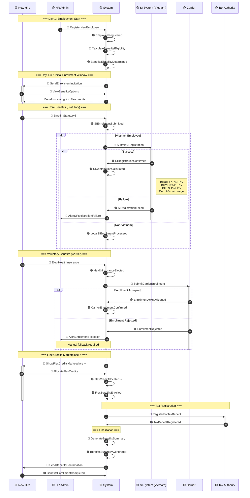
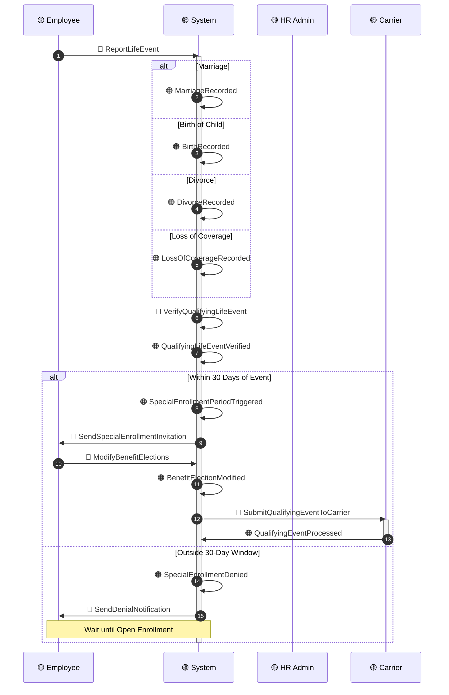
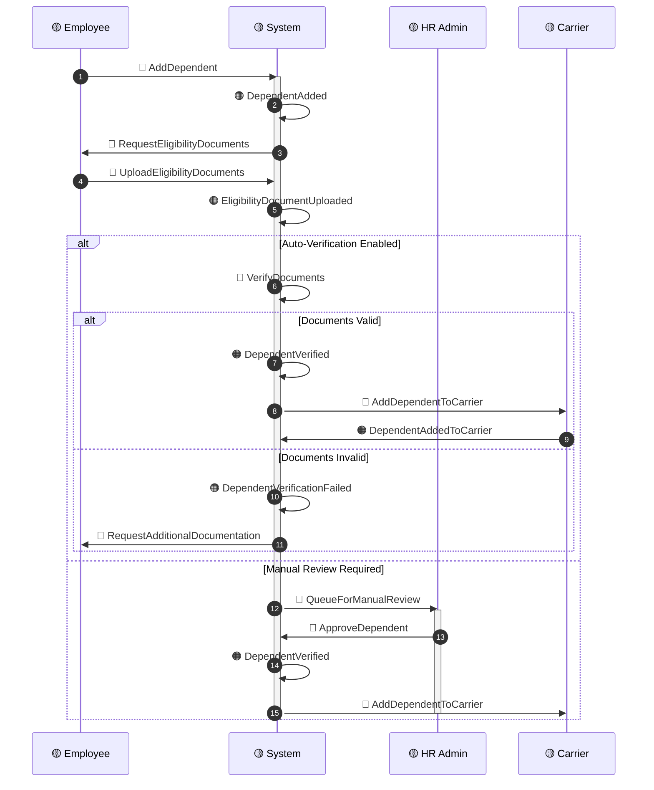

# Timeline: Benefits Enrollment

**Domain**: Total Rewards (TR)
**Flow Type**: New Hire + Open Enrollment + Life Events
**Related Events**: Benefits Cluster events from `00-session-brief.md`
**USP Events**: ⭐ `FlexCreditAllocated`, ⭐ `WellnessProgramEnrolled`
**Hot Spots Addressed**: H01, H03, H10, H11, H18
**Created**: 2026-03-20
**Status**: DRAFT

---

## Sequence Diagram: New Hire Benefits Enrollment



---

## Sequence Diagram: Open Enrollment (Annual)

```mermaid
sequenceDiagram
    autonumber
    participant E as 🟡 Employee
    participant M as 🟡 Manager
    participant S as 🟡 System
    participant C as 🟡 Carrier
    participant HR as 🟡 HR Admin

    Note over E,HR: === Pre-Enrollment Period ===

    HR->>S: 🔵 OpenEnrollmentPeriod
    activate S
    S->>S: 🟠 OpenEnrollmentStarted
    S->>E: 🔵 SendOpenEnrollmentNotification
    deactivate S

    Note over E,S: === Enrollment Window (4 weeks) ===

    E->>S: 🔵 ViewCurrentCoverage
    activate S
    S-->>E: Current benefits + dependents
    deactivate S

    E->>S: 🔵 ComparePlans
    activate S
    S-->>E: Plan comparison + cost impact
    S->>C: 🔵 GetUpdatedPlanRates
    activate C
    C-->>S: 🟠 PlanRatesUpdated
    deactivate C
    deactivate S

    opt Change Benefits
        E->>S: 🔵 ModifyBenefitElections
        activate S
        S->>S: 🟠 BenefitElectionModified
        S->>C: 🔵 SubmitChangesToCarrier
        activate C
        C->>S: 🟠 ChangesAcknowledged
        deactivate C
        S->>S: 🟠 BenefitsUpdated
        deactivate S
    else Keep Current
        E->>S: 🔵 ConfirmCurrentElections
        activate S
        S->>S: 🟠 BenefitElectionConfirmed
        S->>S: 🟠 BenefitsAutoRenewed
        deactivate S
    end

    Note over S,HR: === Post-Enrollment Processing ===

    S->>HR: 🔵 GenerateEnrollmentReport
    activate HR
    HR->>S: 🟠 EnrollmentReportGenerated
    S->>C: 🔵 SendFinalEnrollmentFile
    activate C
    C->>S: 🟠 CarrierFileAccepted
    deactivate C
    deactivate HR

    S->>S: 🟠 OpenEnrollmentCompleted
    S->>E: 🔵 SendUpdatedBenefitsCard
```

---

## Alternative Path A: Life Event Triggered Enrollment



---

## Alternative Path B: Dependent Verification



---

## Alternative Path C: Carrier Sync Failure (H11)

```mermaid
sequenceDiagram
    autonumber
    participant S as 🟡 System
    participant C as 🟡 Carrier
    participant HR as 🟡 HR Admin
    participant E as 🟡 Employee

    S->>C: 🔵 SendEnrollmentFile
    activate C
    alt Format Error
        C->>S: 🟠 EnrollmentFileRejected
        Note over C: Reason: Invalid format
        deactivate C

        S->>S: 🟠 CarrierSyncFailed
        S->>HR: 🔵 AlertCarrierSyncFailure

        alt Retry Possible
            S->>C: 🔵 RetryEnrollmentFile
            activate C
            C->>S: 🟠 EnrollmentAcknowledged
            deactivate C
        else Manual Fallback Required
            S->>HR: 🔵 GenerateManualEnrollmentFile
            activate HR
            HR->>C: 🔵 SendManualFile
            C->>HR: 🟠 ManualFileAccepted
            deactivate HR
        end
    else Duplicate Member
        C->>S: 🟠 EnrollmentRejected
        Note over C: Reason: Duplicate enrollment
        deactivate C

        S->>S: 🟠 DuplicateEnrollmentDetected
        S->>HR: 🔵 AlertDuplicateEnrollment
        HR->>S: 🔵 ResolveDuplicate
        S->>S: 🟠 DuplicateResolved
    else Invalid Member Data
        C->>S: 🟠 EnrollmentRejected
        Note over C: Reason: Invalid member info
        deactivate C

        S->>E: 🔵 RequestDataCorrection
        activate E
        E->>S: 🔵 CorrectMemberData
        S->>C: 🔵 ResendCorrectedEnrollment
        activate C
        C->>S: 🟠 EnrollmentAcknowledged
        deactivate C
        deactivate E
    end
```

---

## Error Scenarios

| Scenario | Detection | Fallback | Owner |
|----------|-----------|----------|-------|
| **SI Registration Failed** | SI system rejection | Manual filing at SI office | HR Admin |
| **Carrier Enrollment rejected** | Carrier API rejection | Manual file submission | Benefits Admin |
| **Duplicate enrollment** | Carrier duplicate check | Resolve in system, resync | HR Admin |
| **Dependent verification failed** | Document validation | Request additional docs | Benefits Admin |
| **Life event outside window** | 30-day check | Defer to Open Enrollment | System |
| **Carrier sync timeout** | No ACK within SLA | Retry 3×, then manual file | Tech Lead |

---

## Multi-Country Benefits Variations

| Country | Statutory SI | Health Insurance | Retirement | Provident Fund |
|---------|--------------|------------------|------------|----------------|
| **Vietnam** | BHXH 17.5%+8%, BHYT 3%+1.5%, BHTN 1%+1% | Mandatory via SI | Social pension via BHXH | Voluntary |
| **Singapore** | CPF (varies 5-20%) | MediSave via CPF | CPF Ordinary + Special | N/A |
| **Malaysia** | EPF 12%+11%, SOCSO, EIS | Mandatory via SOCSO | EPF retirement | N/A |
| **Thailand** | SSF 5%+5% | Mandatory via SSF | Social security pension | N/A |
| **Indonesia** | BPJS TK 3.7%+2%, BPJS 4%+1% | Mandatory via BPJS | Pension via BPJS | Voluntary |
| **Philippines** | SSS 9.5%, PhilHealth 4.5%, Pag-IBIG 2% | Mandatory via PhilHealth | SSS pension | Pag-IBIG MP2 |

---

## Event Checklist

### Events in Happy Path
- [ ] 🟠 `EmployeeRegistered`
- [ ] 🟠 `BenefitsEligibilityDetermined`
- [ ] 🟠 `EnrollmentInvitationSent`
- [ ] 🟠 `SIEnrollmentSubmitted`
- [ ] 🟠 `SIRegistrationConfirmed`
- [ ] 🟠 `SIContributionCalculated`
- [ ] 🟠 `HealthInsuranceElected`
- [ ] 🟠 `EnrollmentAcknowledged`
- [ ] 🟠 `CarrierEnrollmentConfirmed`
- [ ] 🟠 ⭐ `FlexCreditAllocated`
- [ ] 🟠 `FlexBenefitsEnrolled`
- [ ] 🟠 `TaxBenefitRegistered`
- [ ] 🟠 `BenefitsSummaryGenerated`
- [ ] 🟠 `BenefitsEnrollmentCompleted`

### Commands in Flow
- [ ] 🔵 `RegisterNewEmployee`
- [ ] 🔵 `CalculateBenefitsEligibility`
- [ ] 🔵 `SendEnrollmentInvitation`
- [ ] 🔵 `ViewBenefitsOptions`
- [ ] 🔵 `EnrollInStatutorySI`
- [ ] 🔵 `SubmitSIRegistration`
- [ ] 🔵 `ElectHealthInsurance`
- [ ] 🔵 `SubmitCarrierEnrollment`
- [ ] 🔵 `ShowFlexCreditsMarketplace`
- [ ] 🔵 `AllocateFlexCredits`
- [ ] 🔵 `RegisterForTaxBenefit`
- [ ] 🔵 `GenerateBenefitsSummary`
- [ ] 🔵 `SendBenefitsConfirmation`

---

## Related Documents

| Document | Purpose |
|----------|---------|
| `00-session-brief.md` | Domain Events catalog |
| `01-commands-actors.md` | Commands and Actors mapping |
| `02-hot-spots.md` | Hot Spots (H01, H03, H10, H11, H18) |
| `../BRD/04-BRD-Benefits.md` | Benefits business rules |
| `../BRD/02-BRD-Calculation-Rules.md` | SI calculation rules |

---

**Next Timeline**: [`timeline-variable-pay.md`](./timeline-variable-pay.md) — Variable Pay Calculation Flow
