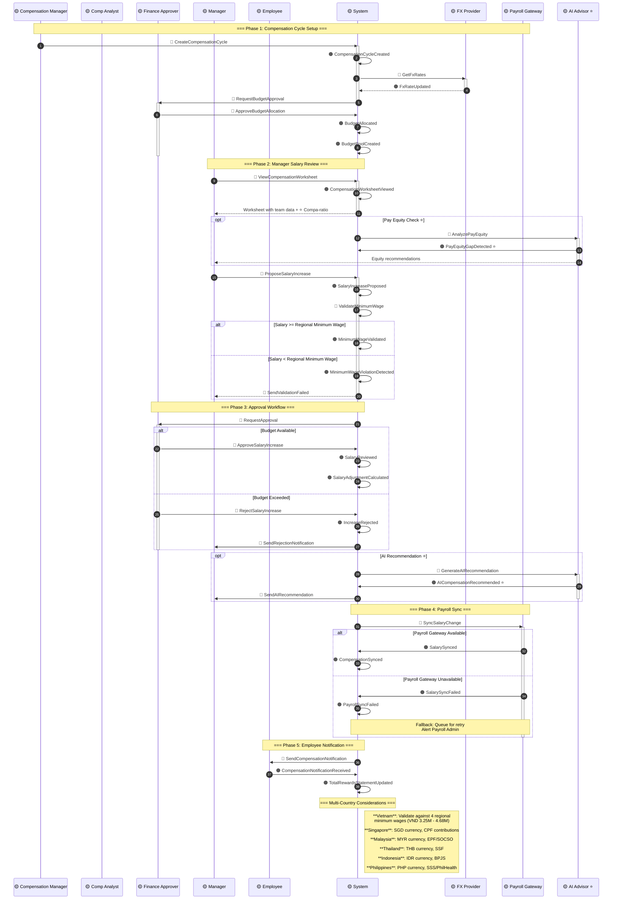
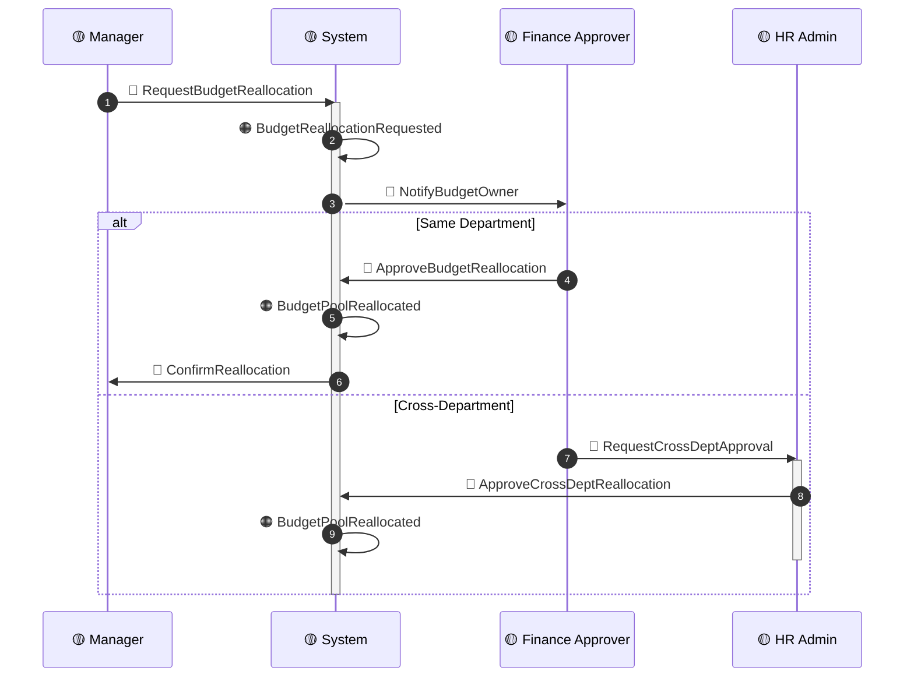
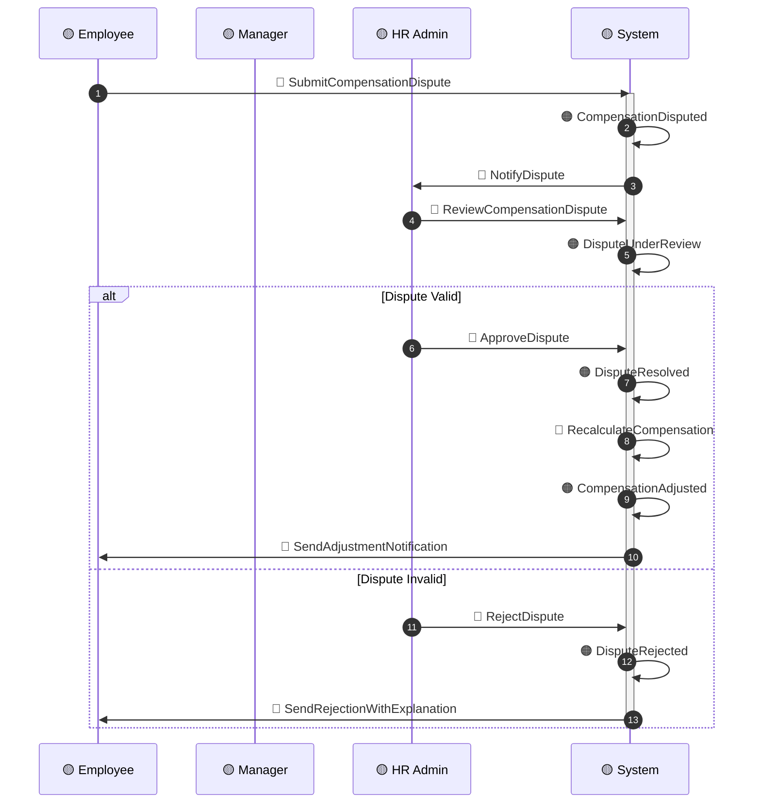
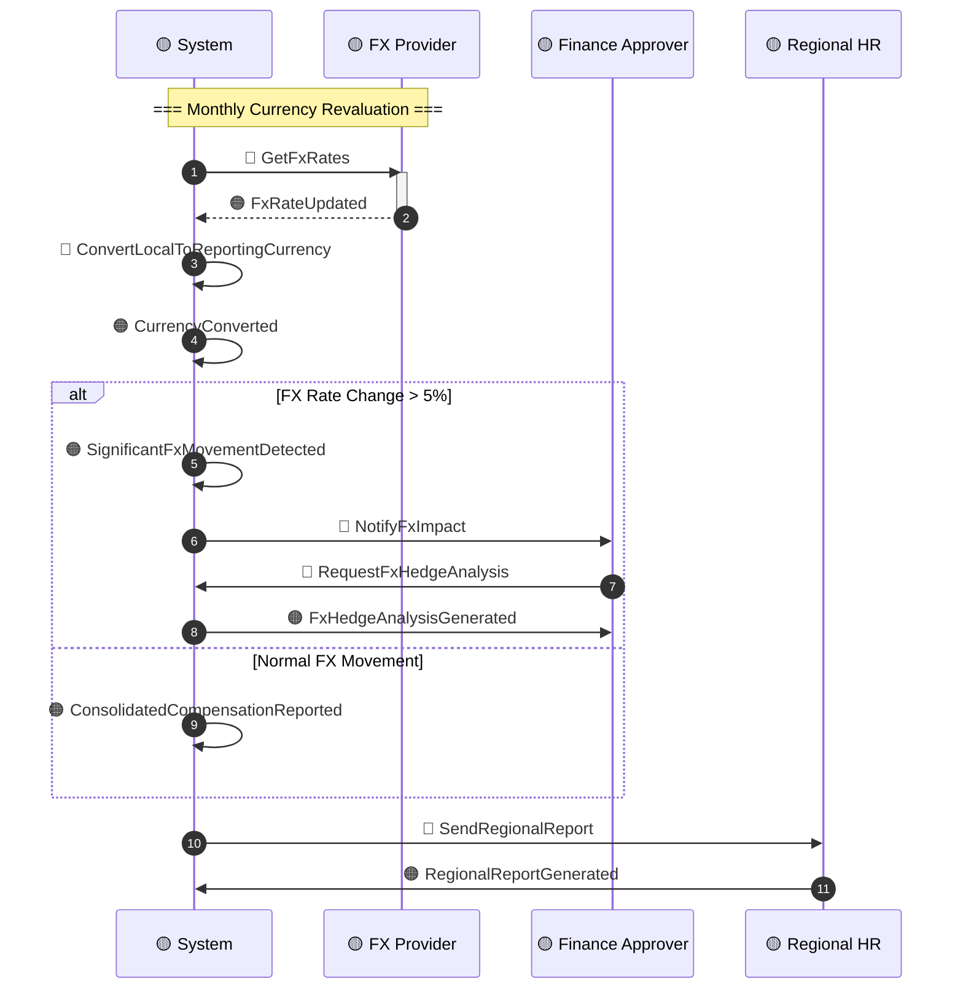

# Timeline: Compensation Cycle

**Domain**: Total Rewards (TR)
**Flow Type**: Annual/Semi-Annual Compensation Review Cycle
**Related Events**: 150 Domain Events from `00-session-brief.md`
**USP Events**: ⭐ `PayEquityGapDetected`, ⭐ `AICompensationRecommended`
**Hot Spots Addressed**: H01, H02, H06, H08, H14, H15
**Created**: 2026-03-20
**Status**: DRAFT

---

## Sequence Diagram: Annual Compensation Review Cycle

---

## Alternative Path A: Budget Reallocation

---

## Alternative Path B: Compensation Dispute

---

## Alternative Path C: Multi-Currency Consolidation

---

## Error Scenarios

| Scenario | Detection | Fallback | Owner |
|----------|-----------|----------|-------|
| **Budget Exceeded** | Real-time validation during proposal | Request budget reallocation (Path A) | Finance Approver |
| **Minimum Wage Violation** | Pre-submission validation | Block submission, show error | System |
| **Payroll Gateway Failure** | Async callback timeout | Queue for retry, alert admin | Tech Lead |
| **FX Rate Unavailable** | Rate staleness > 24 hours | Use last known rate, flag for review | Finance |
| **AI Recommendation Failure** | Model confidence < threshold | Fall back to rule-based recommendations | Product |
| **Data Residency Violation** | Cross-border data check | Block export, log compliance event | Legal |

---

## Multi-Country Variations

| Country | Currency | Minimum Wage | SI Components | Tax Authority | Cycle Timing |
|---------|----------|--------------|---------------|---------------|--------------|
| **Vietnam** | VND | 4 regions (3.25M-4.68M) | BHXH 17.5%+8%, BHYT 3%+1.5%, BHTN 1%+1% | GDT | Annual (Q4) |
| **Singapore** | SGD | No statutory | CPF (varies by age) | IRAS | Annual (Q1) |
| **Malaysia** | MYR | No statutory | EPF 12%+11%, SOCSO, EIS | LHDN | Annual (Q1) |
| **Thailand** | THB | ฿354/day | SSF 5%+5% | Revenue Dept | Annual (Q1) |
| **Indonesia** | IDR | Provincial | BPJS TK 3.7%+2%, BPJS 4%+1% | DGT | Annual (Q4) |
| **Philippines** | PHP | ₱481-₱610/day | SSS 9.5%, PhilHealth 4.5%, Pag-IBIG 2% | BIR | Annual (Q4) |

---

## Event Checklist

### Events in Happy Path
- [ ] 🟠 `CompensationCycleCreated`
- [ ] 🟠 `FxRateUpdated`
- [ ] 🟠 `BudgetAllocated`
- [ ] 🟠 `BudgetPoolCreated`
- [ ] 🟠 `CompensationWorksheetViewed`
- [ ] 🟠 ⭐ `PayEquityGapDetected`
- [ ] 🟠 `SalaryIncreaseProposed`
- [ ] 🟠 `MinimumWageValidated`
- [ ] 🟠 `SalaryReviewed`
- [ ] 🟠 `SalaryAdjustmentCalculated`
- [ ] 🟠 ⭐ `AICompensationRecommended`
- [ ] 🟠 `SalarySynced`
- [ ] 🟠 `CompensationSynced`
- [ ] 🟠 `CompensationNotificationReceived`
- [ ] 🟠 `TotalRewardsStatementUpdated`

### Commands in Flow
- [ ] 🔵 `CreateCompensationCycle`
- [ ] 🔵 `GetFxRates`
- [ ] 🔵 `RequestBudgetApproval`
- [ ] 🔵 `ApproveBudgetAllocation`
- [ ] 🔵 `ViewCompensationWorksheet`
- [ ] 🔵 `ProposeSalaryIncrease`
- [ ] 🔵 `ValidateMinimumWage`
- [ ] 🔵 `RequestApproval`
- [ ] 🔵 `ApproveSalaryIncrease`
- [ ] 🔵 `GenerateAIRecommendation`
- [ ] 🔵 `SyncSalaryChange`
- [ ] 🔵 `SendCompensationNotification`

---

## Related Documents

| Document | Purpose |
|----------|---------|
| `00-session-brief.md` | Domain Events catalog |
| `01-commands-actors.md` | Commands and Actors mapping |
| `02-hot-spots.md` | Hot Spots (H01, H02, H06, H08, H14, H15) |
| `../BRD/01-BRD-Core-Compensation.md` | Compensation business rules |
| `../BRD/02-BRD-Calculation-Rules.md` | SI and tax calculation rules |

---

**Next Timeline**: [`timeline-benefits.md`](./timeline-benefits.md) — Benefits Enrollment Flow
