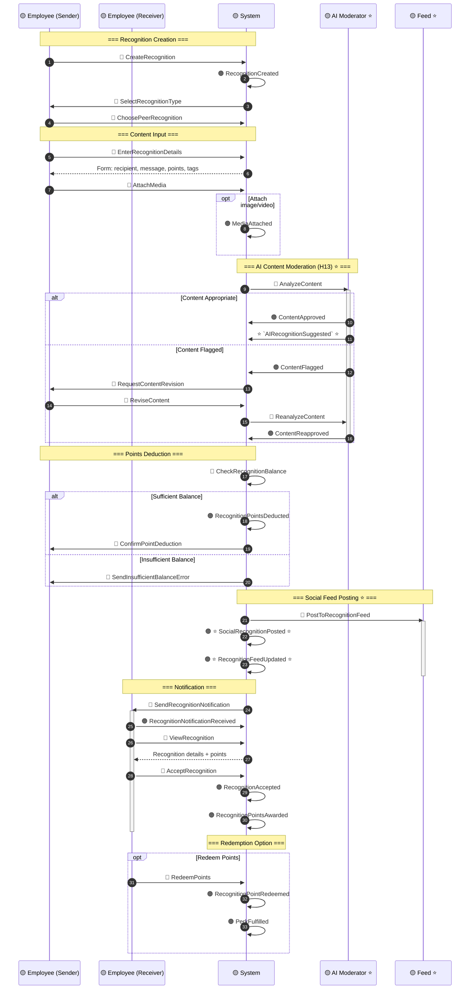
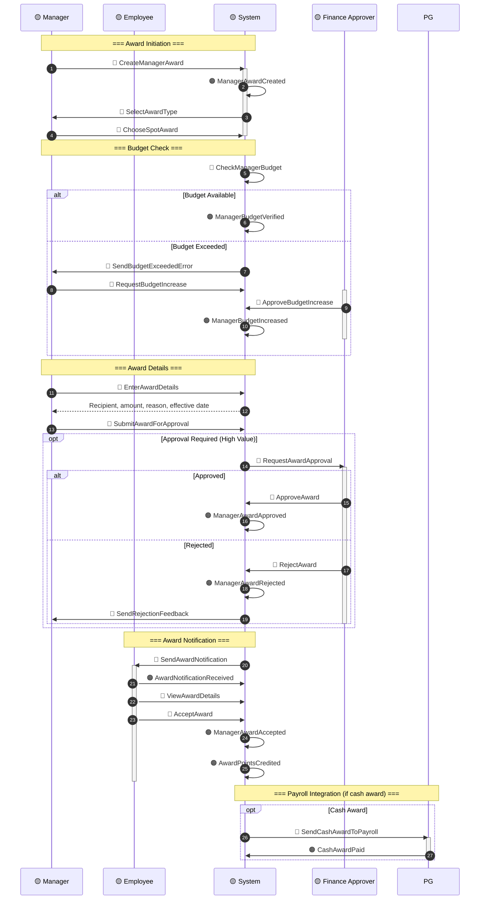
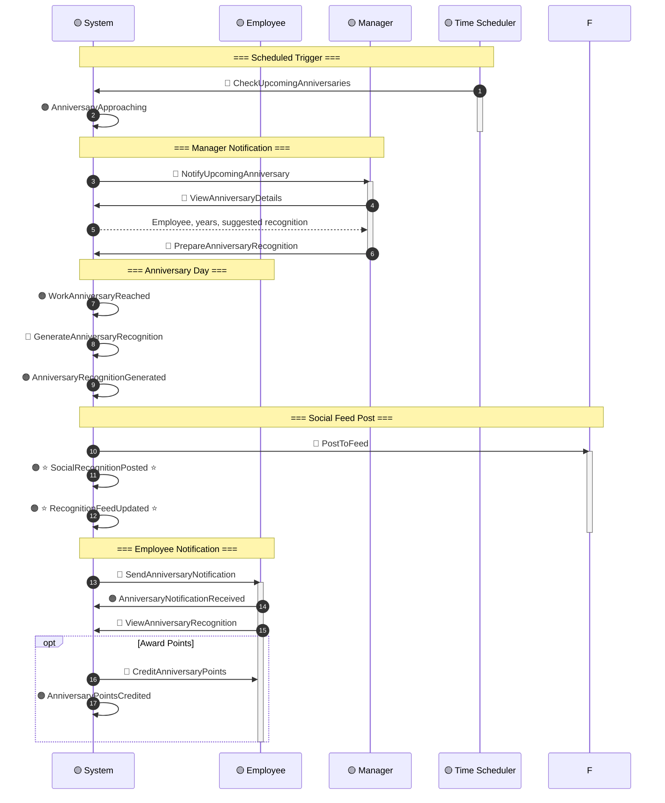
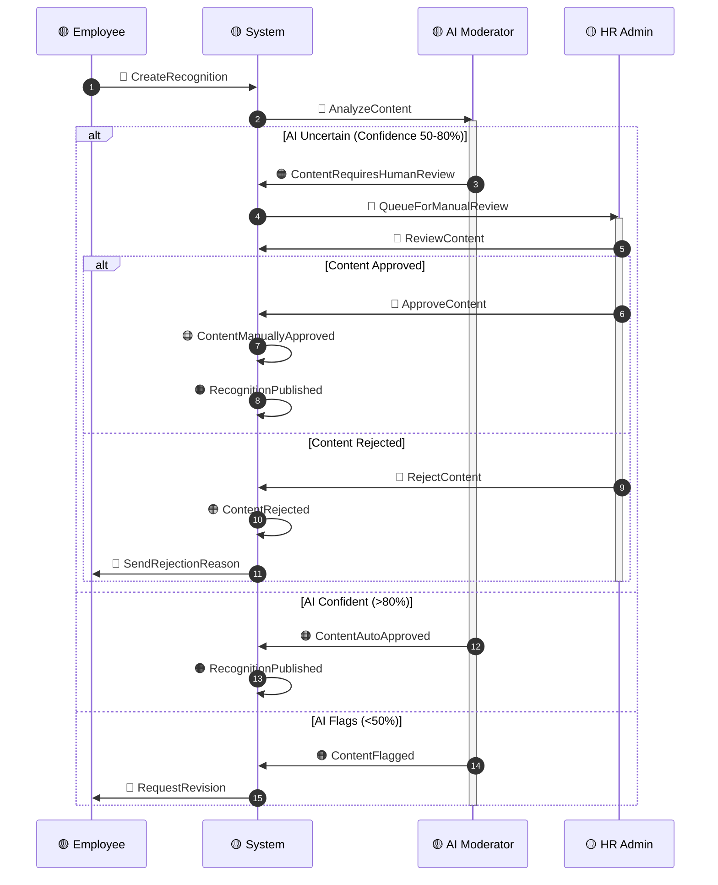
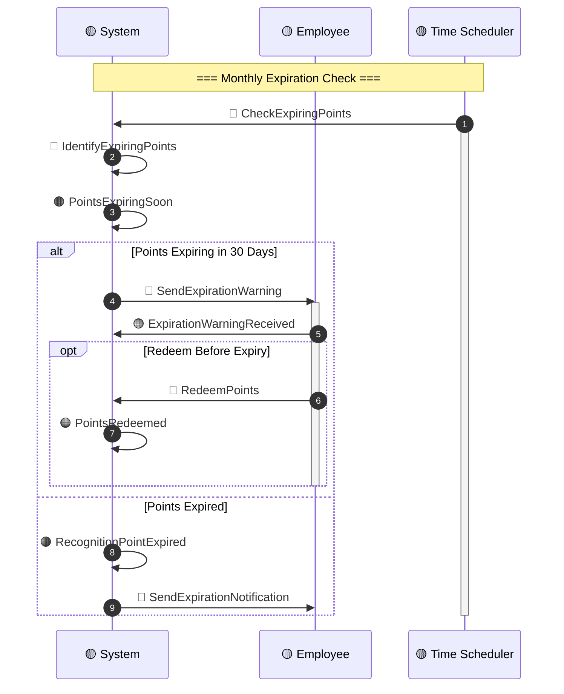
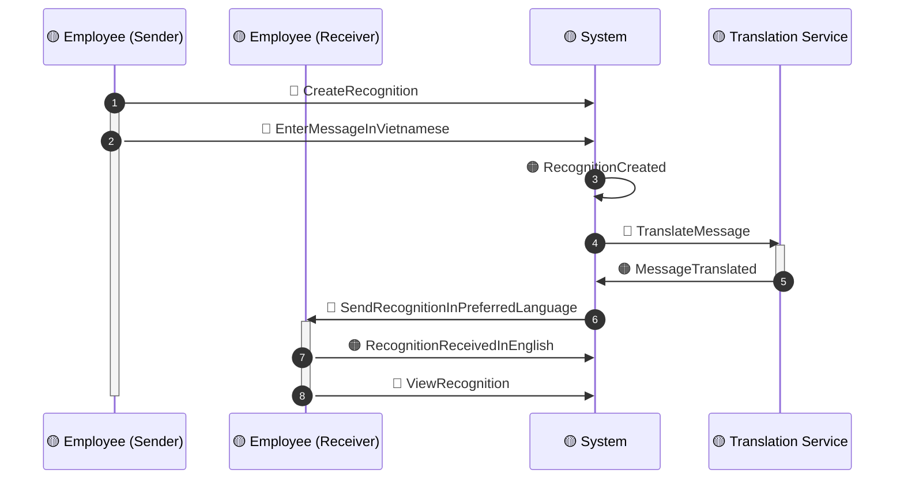

# Timeline: Recognition Flow

**Domain**: Total Rewards (TR)
**Flow Type**: Real-Time Recognition Events
**Related Events**: Recognition Cluster events from `00-session-brief.md`
**USP Events**: ⭐ `SocialRecognitionPosted`, ⭐ `AIRecognitionSuggested`, ⭐ `RecognitionFeedUpdated`
**Hot Spots Addressed**: H13, H19, H21, H24
**Created**: 2026-03-20
**Status**: DRAFT

---

## Sequence Diagram: Peer-to-Peer Recognition

---

## Sequence Diagram: Manager Award

---

## Sequence Diagram: Milestone Recognition (Work Anniversary)

---

## Alternative Path A: Content Moderation Escalation (H13)

---

## Alternative Path B: Point Expiration (H21)

---

## Alternative Path C: Multi-Language Recognition

---

## Error Scenarios

| Scenario | Detection | Fallback | Owner |
|----------|-----------|----------|-------|
| **Insufficient points** | Balance check | Prompt to earn more points | System |
| **Content flagged** | AI moderation | Request revision or escalate to HR | Product |
| **Manager budget exceeded** | Pre-submission validation | Request budget increase approval | Finance |
| **Feed posting failed** | Async callback error | Retry, log event | Tech Lead |
| **Notification bounced** | Email/SMS delivery failure | Retry via alternate channel | System |
| **Point expiration dispute** | Employee flag | HR manual adjustment | HR Admin |

---

## Recognition Point Economics

| Action | Points Cost | Notes |
|--------|-------------|-------|
| **Peer-to-Peer (Standard)** | 10-50 pts | Daily limit: 200 pts |
| **Peer-to-Peer (With Media)** | 25-75 pts | Higher engagement |
| **Manager Spot Award** | 100-500 pts | Monthly budget: varies |
| **Milestone (1 year)** | 100 pts | Auto-awarded |
| **Milestone (5+ years)** | 500-1000 pts | Escalating by tenure |
| **Redemption (Gift Card $10)** | 100 pts | Varies by vendor |
| **Redemption (Extra PTO Day)** | 500 pts | Subject to manager approval |

---

## Event Checklist

### Events in Happy Path
- [ ] 🟠 `RecognitionCreated`
- [ ] 🟠 `MediaAttached`
- [ ] 🟠 `ContentApproved`
- [ ] 🟠 `RecognitionPointsDeducted`
- [ ] 🟠 ⭐ `SocialRecognitionPosted` ⭐
- [ ] 🟠 ⭐ `RecognitionFeedUpdated` ⭐
- [ ] 🟠 `RecognitionNotificationReceived`
- [ ] 🟠 `RecognitionAccepted`
- [ ] 🟠 `RecognitionPointsAwarded`
- [ ] 🟠 `ManagerAwardCreated`
- [ ] 🟠 `ManagerAwardApproved`
- [ ] 🟠 `ManagerAwardAccepted`
- [ ] 🟠 `WorkAnniversaryReached`
- [ ] 🟠 `AnniversaryRecognitionGenerated`

### Commands in Flow
- [ ] 🔵 `CreateRecognition`
- [ ] 🔵 `SelectRecognitionType`
- [ ] 🔵 `EnterRecognitionDetails`
- [ ] 🔵 `AttachMedia`
- [ ] 🔵 `AnalyzeContent` (AI)
- [ ] 🔵 `CheckRecognitionBalance`
- [ ] 🔵 `PostToRecognitionFeed`
- [ ] 🔵 `SendRecognitionNotification`
- [ ] 🔵 `AcceptRecognition`
- [ ] 🔵 `RedeemPoints`
- [ ] 🔵 `CreateManagerAward`
- [ ] 🔵 `CheckManagerBudget`
- [ ] 🔵 `SubmitAwardForApproval`
- [ ] 🔵 `CheckUpcomingAnniversaries`

---

## Related Documents

| Document | Purpose |
|----------|---------|
| `00-session-brief.md` | Domain Events catalog |
| `01-commands-actors.md` | Commands and Actors mapping |
| `02-hot-spots.md` | Hot Spots (H13, H19, H21, H24) |
| `../BRD/05-BRD-Recognition.md` | Recognition business rules |
| `../BRD/12-Innovation-Sprints.md` | USP innovation features |

---

**Next Timeline**: [`timeline-statement.md`](./timeline-statement.md) — Total Rewards Statement Generation
