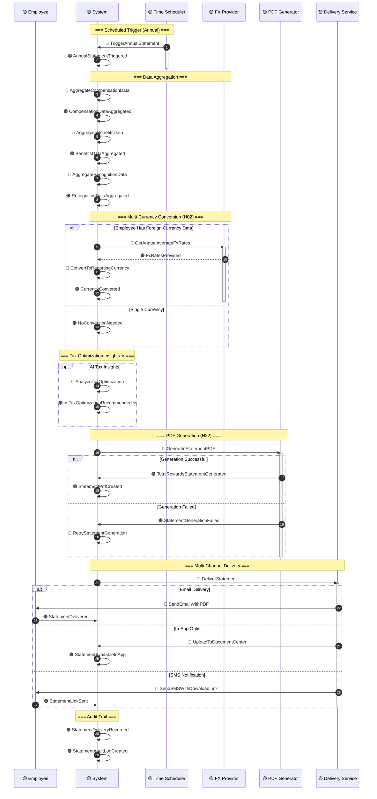
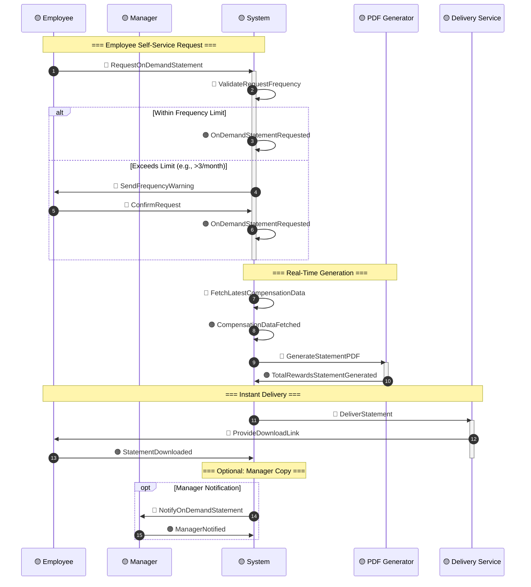
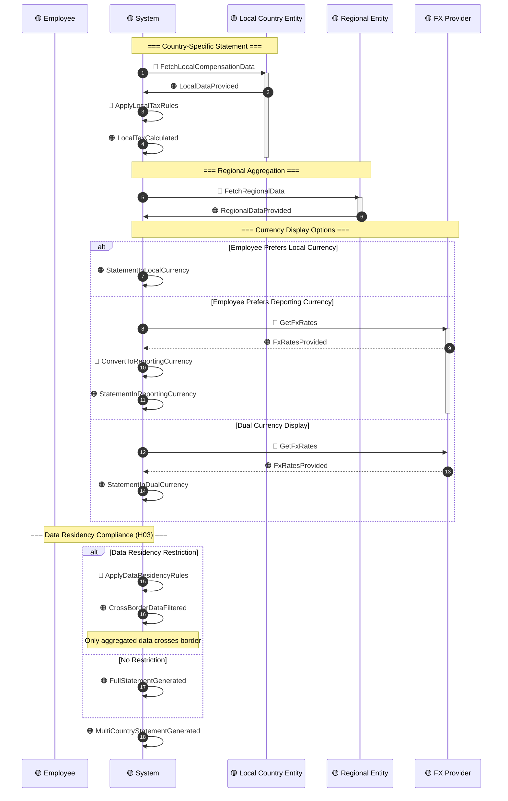
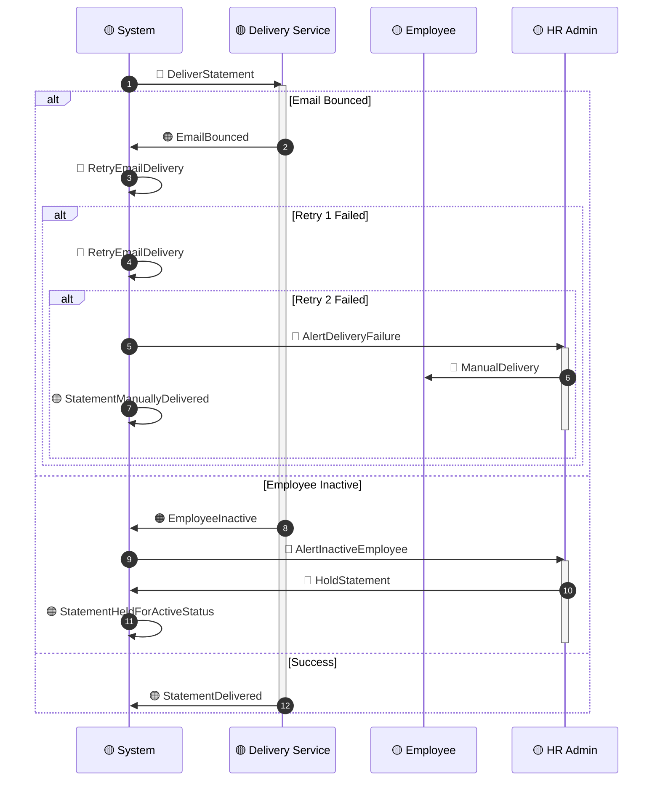
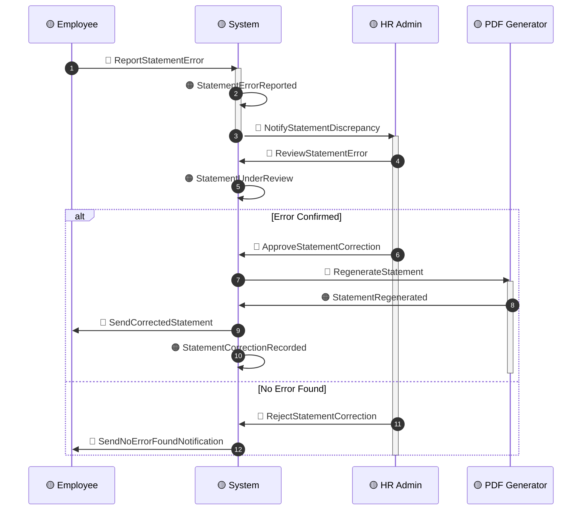

# Timeline: Statement Generation

**Domain**: Total Rewards (TR)
**Flow Type**: Total Rewards Statement (Monthly/Quarterly/Annual + On-Demand)
**Related Events**: Analytics Cluster events from `00-session-brief.md`
**USP Events**: ⭐ `TotalRewardsStatementGenerated`, ⭐ `TaxOptimizationRecommended`
**Hot Spots Addressed**: H02, H03, H22, H37
**Created**: 2026-03-20
**Status**: DRAFT

---

## Sequence Diagram: Annual Total Rewards Statement

---

## Sequence Diagram: On-Demand Statement Request

---

## Alternative Path A: Multi-Country Statement (H02, H03)

---

## Alternative Path B: Delivery Failure Handling

---

## Alternative Path C: Statement Correction

---

## Error Scenarios

| Scenario | Detection | Fallback | Owner |
|----------|-----------|----------|-------|
| **PDF generation failed** | Generation timeout/error | Retry 3×, then alert admin | Tech Lead |
| **Email delivery bounced** | SMTP bounce notification | Retry, then manual delivery | System |
| **FX rate unavailable** | Rate staleness > 24 hours | Use last known rate, flag | Finance |
| **Data residency violation** | Cross-border check failed | Filter data, generate local-only | Legal |
| **Employee inactive** | Employment status check | Hold statement, alert HR | HR Admin |
| **Frequency limit exceeded** | Request count validation | Warn user, allow with confirmation | System |

---

## Statement Delivery Configuration

| Channel | Frequency | Opt-In Required | Fallback |
|---------|-----------|-----------------|----------|
| **Email PDF** | Annual + On-Demand | No | SMS + Download Link |
| **In-App Document Center** | Always Available | No | N/A |
| **SMS Notification** | Optional | Yes | Email |
| **Mobile Push** | Optional | Yes | In-App |
| **Manager Copy** | Annual Only | Configurable | N/A |

---

## Statement Content Sections

| Section | Data Sources | Multi-Country Considerations |
|---------|--------------|------------------------------|
| **Compensation Summary** | Core Compensation, Variable Pay | Currency conversion, FX rates |
| **Benefits Summary** | Benefits enrollment, Carrier data | Country-specific statutory benefits |
| **Recognition Summary** | Recognition points, Redemptions | Point valuation by country |
| **Employer Contributions** | SI, Health, Retirement | BHXH (VN), CPF (SG), EPF (MY), etc. |
| **Tax Summary** | Tax withholding, Taxable bridge | PIT (VN), IRAS (SG), LHDN (MY), etc. |
| **Total Rewards Value** | All of the above | Reporting currency option |

---

## Event Checklist

### Events in Happy Path
- [ ] 🟠 `AnnualStatementTriggered`
- [ ] 🟠 `CompensationDataAggregated`
- [ ] 🟠 `BenefitsDataAggregated`
- [ ] 🟠 `RecognitionDataAggregated`
- [ ] 🟠 `CurrencyConverted`
- [ ] 🟠 ⭐ `TaxOptimizationRecommended` ⭐
- [ ] 🟠 `TotalRewardsStatementGenerated`
- [ ] 🟠 `StatementPdfCreated`
- [ ] 🟠 `StatementDelivered`
- [ ] 🟠 `StatementDeliveryRecorded`
- [ ] 🟠 `OnDemandStatementRequested`
- [ ] 🟠 `StatementDownloaded`

### Commands in Flow
- [ ] 🔵 `TriggerAnnualStatement`
- [ ] 🔵 `AggregateCompensationData`
- [ ] 🔵 `AggregateBenefitsData`
- [ ] 🔵 `AggregateRecognitionData`
- [ ] 🔵 `GetAnnualAverageFxRates`
- [ ] 🔵 `ConvertToReportingCurrency`
- [ ] 🔵 `AnalyzeTaxOptimization`
- [ ] 🔵 `GenerateStatementPDF`
- [ ] 🔵 `DeliverStatement`
- [ ] 🔵 `SendEmailWithPDF`
- [ ] 🔵 `RequestOnDemandStatement`
- [ ] 🔵 `FetchLatestCompensationData`
- [ ] 🔵 `ProvideDownloadLink`

---

## Related Documents

| Document | Purpose |
|----------|---------|
| `00-session-brief.md` | Domain Events catalog |
| `01-commands-actors.md` | Commands and Actors mapping |
| `02-hot-spots.md` | Hot Spots (H02, H03, H22, H37) |
| `../BRD/07-BRD-Total-Rewards-Statement.md` | Statement business rules |
| `../BRD/02-BRD-Calculation-Rules.md` | FX and tax calculation rules |

---

## Event Storming Phase 6: Complete ✅

All 5 timeline diagrams have been created:

1. ✅ [`timeline-compensation.md`](./timeline-compensation.md) — Compensation Cycle
2. ✅ [`timeline-benefits.md`](./timeline-benefits.md) — Benefits Enrollment
3. ✅ [`timeline-variable-pay.md`](./timeline-variable-pay.md) — Variable Pay Calculation
4. ✅ [`timeline-recognition.md`](./timeline-recognition.md) — Recognition Flow
5. ✅ [`timeline-statement.md`](./timeline-statement.md) — Statement Generation

**Next Phase**: Phase 7 — Domain Discovery Questions → See [`discovery-questions.md`](./discovery-questions.md)
