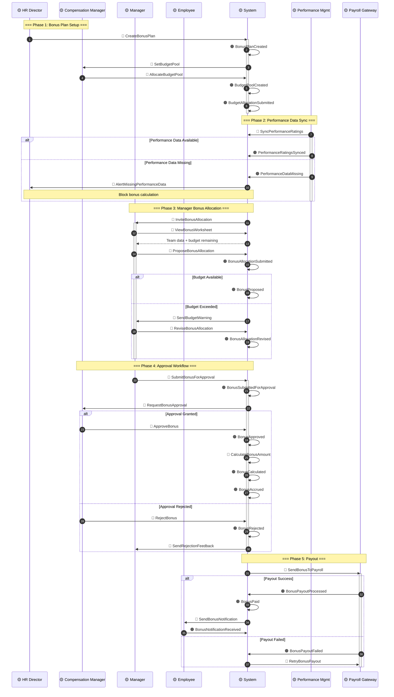
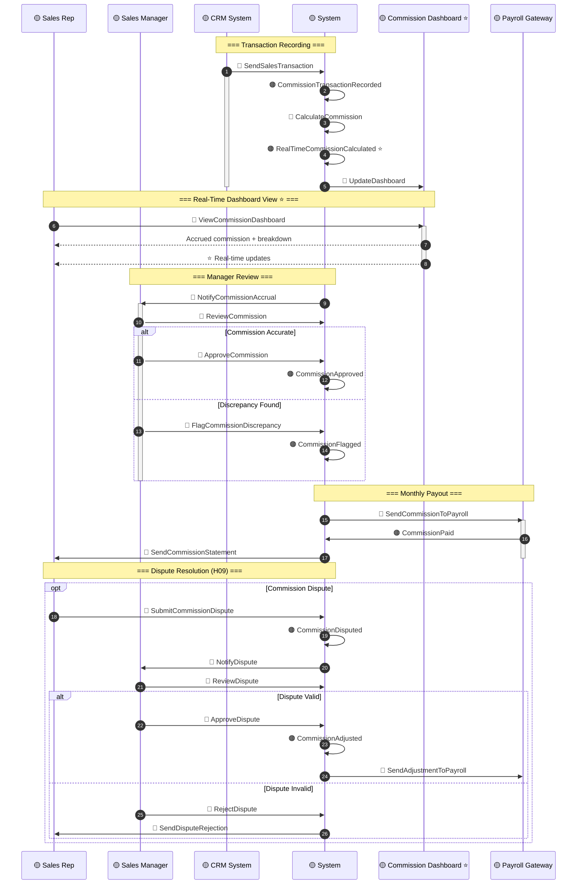
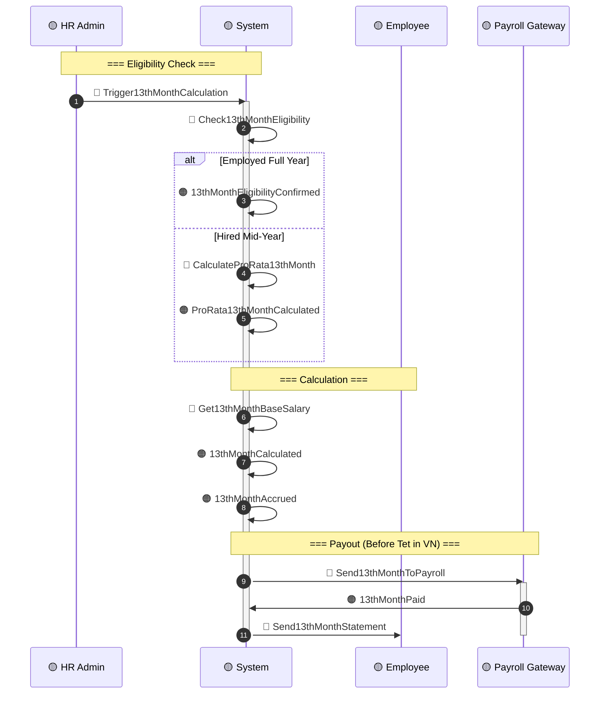
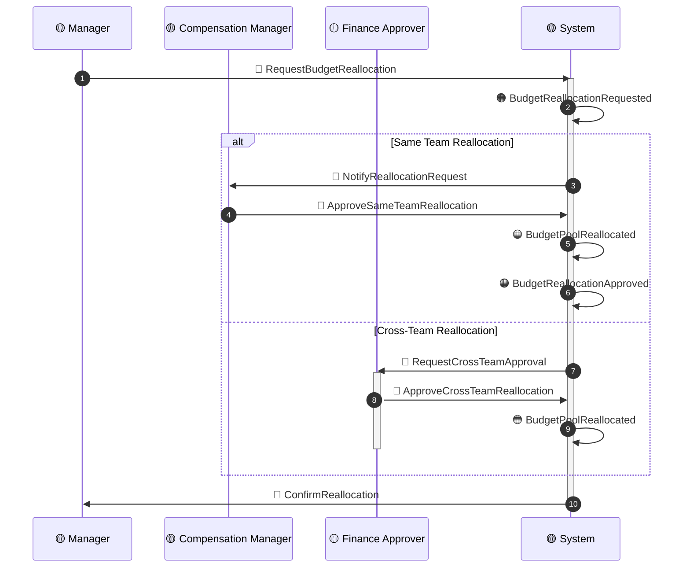
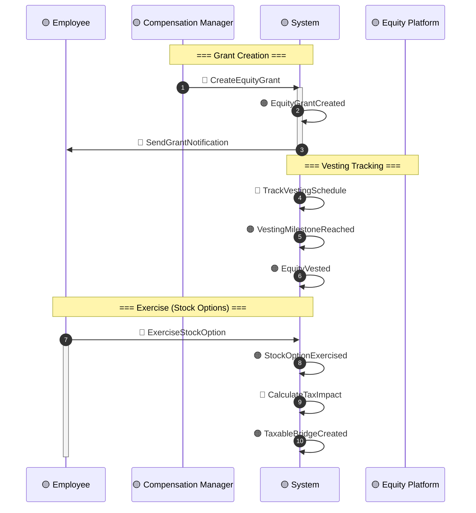

# Timeline: Variable Pay Calculation

**Domain**: Total Rewards (TR)
**Flow Type**: Bonus + Commission + 13th Month Calculation
**Related Events**: Variable Pay Cluster events from `00-session-brief.md`
**USP Events**: ⭐ `RealTimeCommissionCalculated`, ⭐ `CommissionDashboardViewed`
**Hot Spots Addressed**: H07, H08, H09, H10, H16, H26
**Created**: 2026-03-20
**Status**: DRAFT

---

## Sequence Diagram: STI Bonus Calculation (Annual)

---

## Sequence Diagram: Real-Time Commission Calculation ⭐

---

## Alternative Path A: 13th Month Calculation (Vietnam + Philippines)

---

## Alternative Path B: Budget Reallocation (H08)

---

## Alternative Path C: LTI Equity Compensation (Phase 2)

---

## Error Scenarios

| Scenario | Detection | Fallback | Owner |
|----------|-----------|----------|-------|
| **Performance data missing** | Pre-calculation validation | Block bonus calc, alert HR | HR Admin |
| **Budget exceeded** | Real-time validation | Require reallocation approval | Finance |
| **Commission dispute** | Sales rep flag | Freeze disputed amount, pay rest | Sales Ops |
| **Payroll sync failed** | Callback timeout | Retry 3×, manual file | Tech Lead |
| **13th month miscalculation** | Pro-rata validation | Recalculate, adjust next cycle | Payroll Admin |
| **Dashboard latency > 5 min** | Performance monitoring | Show cached data with timestamp | Tech Lead |

---

## Commission Calculation Rules

| Component | Formula | Real-Time Source |
|-----------|---------|------------------|
| **Base Commission** | Deal Amount × Rate % | CRM Closed-Won |
| **Accelerator** | (Quota Attainment > 100%) × Multiplier | Quota tracking |
| **Team Override** | Team Deals × Override % | Team attribution |
| **Clawback** | Cancelled Deals × Commission Rate | CRM Cancelled |
| **Draw Against** | Recoverable Draw Balance | Finance system |

---

## Event Checklist

### Events in Happy Path (Bonus)
- [ ] 🟠 `BonusPlanCreated`
- [ ] 🟠 `BudgetPoolCreated`
- [ ] 🟠 `PerformanceRatingsSynced`
- [ ] 🟠 `BonusAllocationSubmitted`
- [ ] 🟠 `BonusProposed`
- [ ] 🟠 `BonusApproved`
- [ ] 🟠 `BonusCalculated`
- [ ] 🟠 `BonusAccrued`
- [ ] 🟠 `BonusPayoutProcessed`
- [ ] 🟠 `BonusPaid`

### Events in Happy Path (Commission)
- [ ] 🟠 `CommissionTransactionRecorded`
- [ ] 🟠 ⭐ `RealTimeCommissionCalculated`
- [ ] 🟠 `CommissionApproved`
- [ ] 🟠 `CommissionPaid`
- [ ] 🟠 `CommissionStatementSent`

### Commands in Flow
- [ ] 🔵 `CreateBonusPlan`
- [ ] 🔵 `AllocateBudgetPool`
- [ ] 🔵 `SyncPerformanceRatings`
- [ ] 🔵 `InviteBonusAllocation`
- [ ] 🔵 `ProposeBonusAllocation`
- [ ] 🔵 `SubmitBonusForApproval`
- [ ] 🔵 `ApproveBonus`
- [ ] 🔵 `CalculateBonusAmount`
- [ ] 🔵 `SendBonusToPayroll`
- [ ] 🔵 `SendSalesTransaction` (CRM)
- [ ] 🔵 `CalculateCommission`
- [ ] 🔵 `ViewCommissionDashboard`
- [ ] 🔵 `ApproveCommission`
- [ ] 🔵 `Trigger13thMonthCalculation`
- [ ] 🔵 `RequestBudgetReallocation`

---

## Related Documents

| Document | Purpose |
|----------|---------|
| `00-session-brief.md` | Domain Events catalog |
| `01-commands-actors.md` | Commands and Actors mapping |
| `02-hot-spots.md` | Hot Spots (H07, H08, H09, H10, H16, H26) |
| `../BRD/03-BRD-Variable-Pay.md` | Variable Pay business rules |
| `../BRD/02-BRD-Calculation-Rules.md` | Proration and calculation rules |

---

**Next Timeline**: [`timeline-recognition.md`](./timeline-recognition.md) — Recognition Flow
