```mermaid
sequenceDiagram
    participant HR
    participant System
    participant Budget
    participant Manager
    participant Employee
    participant Executive
    participant Snapshot
    
    Note over HR,System: PHASE 1: Planning
    HR->>System: Create CompensationPlan (MERIT_2025)
    System->>System: Define eligibility rules
    System->>System: Set merit matrix guidelines
    HR->>System: Create CompensationCycle
    System->>Budget: Allocate budgets by department
    HR->>System: Open cycle (DRAFT → OPEN)
    System->>Manager: Notify managers to submit proposals
    
    Note over Manager,Employee: PHASE 2: Proposals
    Manager->>System: View eligible employees
    System->>System: Filter by eligibility (tenure, performance)
    Manager->>System: Propose salary increase
    System->>System: Calculate new salary
    System->>System: Check against merit matrix
    System->>Budget: Validate budget availability
    alt Budget OK
        System->>System: Create CompensationAdjustment (DRAFT)
        System-->>Manager: Proposal saved
    else Budget Exceeded
        System-->>Manager: Error: Budget exceeded
    end
    
    Note over Manager,Executive: PHASE 3: Approvals
    Manager->>System: Submit all proposals
    System->>System: Route based on increase %
    alt Increase <= 5%
        System->>System: Auto-approve (manager authority)
    else Increase 5-10%
        System->>Executive: Route to Director
        Executive->>System: Approve/Reject
    else Increase > 10%
        System->>Executive: Route to VP
        Executive->>System: Approve/Reject
    end
    
    Note over System,Snapshot: PHASE 4: Finalization
    HR->>System: Close cycle (OPEN → CLOSED)
    System->>System: Finalize all approved adjustments
    loop For each approved adjustment
        System->>Snapshot: Create EmployeeCompensationSnapshot
        System->>Employee: Update current compensation
        System->>System: Create SalaryHistory entry
    end
    System->>Employee: Send notification of increase
```

# Total Rewards - Conceptual Guide

> This document explains HOW the Total Rewards system works at a conceptual level, covering workflows, behaviors, and interactions across all 11 sub-modules.

---

## 📋 System Overview

The Total Rewards Management system operates as an integrated platform combining eleven complementary sub-modules that together provide comprehensive compensation, benefits, and recognition management.

**Core Compensation** provides a component-based architecture where pay structures are built from reusable components (base salary, allowances, bonuses). The system uses SCD Type 2 for grade versioning, supports multiple career ladders, and enables flexible pay range scoping at global, legal entity, business unit, or position levels.

**Calculation Rules** serves as the calculation engine for the entire system, handling tax withholding, social insurance contributions, overtime multipliers, and proration logic. Rules are country-specific and support complex multi-tier tax brackets with exemptions and deductions.

**Variable Pay** manages short-term and long-term incentives including annual bonuses, equity grants (RSU, stock options), and sales commissions. The system tracks vesting schedules, creates tax events on vesting, and bridges taxable items to payroll.

**Benefits** enables self-service benefits enrollment with configurable eligibility rules, coverage tiers, and cost sharing. The system manages open enrollment periods, life events, dependent verification, and claims processing.

**Recognition** implements a point-based recognition system where employees earn points for achievements and redeem them for perks from a catalog. Points expire using FIFO logic to encourage regular redemption.

**Shared Foundation**: All sub-modules share common components including eligibility engine, approval workflows, audit logging, and integration with Core module for employee data.

---

## 🔄 Key Workflows

### Workflow 1: Annual Merit Review Cycle

#### Overview
HR conducts an annual compensation review where managers propose salary increases for their teams based on performance and market positioning, subject to budget constraints and approval workflows.

#### Actors
- **HR Administrator**: Configures merit plan, sets budgets, opens/closes cycle
- **Managers**: Propose salary increases for direct reports
- **Employees**: Receive compensation adjustments
- **System**: Validates budgets, routes approvals, creates snapshots
- **Executives**: Approve high-value increases

#### Trigger
HR initiates annual merit review cycle (typically Q1 or Q4)

#### Steps



**Detailed Steps**:

1. **Create Compensation Plan**
   - What happens: HR defines merit review plan with guidelines
   - Who: HR Administrator
   - System behavior: Creates CompensationPlan entity
   - Business rules applied:
     - Merit matrix defines increase % by performance and compa-ratio
     - Eligibility rules (min tenure, active employment, performance rating)
     - Approval thresholds by increase percentage

2. **Create Compensation Cycle**
   - What happens: HR creates specific cycle for this year's merit review
   - Who: HR Administrator
   - System behavior: Creates CompensationCycle entity
   - Configuration:
     - Plan: Links to CompensationPlan
     - Period: Review period (e.g., 2025-01-01 to 2025-03-31)
     - Effective Date: When increases take effect (e.g., 2025-04-01)
     - Budget: Total budget allocated

3. **Allocate Budgets**
   - What happens: HR distributes total budget across departments
   - Who: HR Administrator
   - System behavior: Creates BudgetAllocation entities
   - Business rules:
     - Sum of allocations cannot exceed total budget
     - Each department gets allocation based on headcount/spend
     - Real-time tracking of utilized vs remaining budget

4. **Open Cycle**
   - What happens: Cycle status changes from DRAFT to OPEN
   - Who: HR Administrator
   - System behavior: Enables manager access, sends notifications
   - Business rules: Cannot reopen closed cycle

5. **Manager Proposals**
   - What happens: Managers propose increases for their team
   - Who: Managers
   - System behavior: Creates CompensationAdjustment entities
   - Validation:
     - Employee must be eligible (tenure, performance, status)
     - Increase must align with merit matrix guidelines
     - Department budget must have sufficient funds
     - Cannot propose for self

6. **Budget Validation**
   - What happens: System checks if proposal fits within budget
   - Who: System (automatic)
   - System behavior: Calculates budget impact
   - Formula:
     ```
     Annual Impact = (New Salary - Current Salary) × 12
     Remaining Budget = Allocated - Utilized - Pending
     Valid = Annual Impact <= Remaining Budget
     ```

7. **Approval Routing**
   - What happens: System routes proposals based on increase %
   - Who: System (automatic)
   - System behavior: Determines approver based on thresholds
   - Routing rules:
     - 0-5%: Manager approval only (auto-approved)
     - 5-10%: Requires Director approval
     - >10%: Requires VP approval
     - Off-cycle/exception: Requires CHRO approval

8. **Executive Approval**
   - What happens: Executives review and approve/reject
   - Who: Director/VP/CHRO
   - System behavior: Updates adjustment status
   - Business rules:
     - Can approve, reject, or send back for revision
     - Must provide reason for rejection
     - Cannot approve if budget exceeded

9. **Cycle Closure**
   - What happens: HR closes cycle after all approvals
   - Who: HR Administrator
   - System behavior: Finalizes all approved adjustments
   - Actions:
     - Create EmployeeCompensationSnapshot for each approved adjustment
     - Update employee current compensation
     - Create SalaryHistory entry
     - Mark cycle as CLOSED
     - Trigger notifications

10. **Snapshot Creation**
    - What happens: System captures point-in-time compensation state
    - Who: System (automatic)
    - System behavior: Creates EmployeeCompensationSnapshot
    - Data captured:
      - Employee, effective date, reason (MERIT_INCREASE)
      - Old salary, new salary, increase amount/percentage
      - Grade, compa-ratio, performance rating
      - Approver, approval date

#### Decision Points

| Decision | Condition | Outcome |
|----------|-----------|---------|
| Eligible | Tenure >= 6 months AND Performance >= Meets | Include in cycle |
| Not Eligible | Tenure < 6 months OR Performance < Meets | Exclude from cycle |
| Budget OK | Remaining budget >= Proposal cost | Allow proposal |
| Budget Exceeded | Remaining budget < Proposal cost | Block proposal |
| Auto-Approve | Increase <= 5% | No additional approval needed |
| Director Approval | Increase 5-10% | Route to Director |
| VP Approval | Increase > 10% | Route to VP |

#### Outcomes

- **Success**: All proposals approved, budgets tracked, compensation updated, employees notified
- **Partial**: Some proposals rejected, budget reallocated, managers revise and resubmit
- **Failure**: Cycle cancelled, no changes applied, rollback to previous state

#### Variations

**Variation 1: Off-Cycle Adjustment**
- Condition: Adjustment needed outside annual cycle (retention, promotion, equity correction)
- Difference: No budget pool, requires executive approval regardless of amount
- Flow: Manager initiates → HR reviews → Executive approves → Immediate effect

**Variation 2: Market Adjustment**
- Condition: Market data shows compensation below competitive range
- Difference: Applies to entire job family or grade, not individual performance
- Flow: HR analyzes market → Proposes range adjustment → Exec approves → Batch update all affected employees

---

### Workflow 2: Benefits Open Enrollment

#### Overview
Employees enroll in or change their benefit elections during the annual open enrollment period, with eligibility validation, dependent verification, and premium calculation.

#### Actors
- **HR Administrator**: Configures enrollment period, plans, and eligibility
- **Employee**: Selects benefit plans and coverage tiers
- **System**: Validates eligibility, calculates premiums, creates enrollments
- **Benefits Carrier**: Receives enrollment data for insurance processing

#### Trigger
HR opens annual enrollment period (typically October-November for January 1 effective date)

#### Steps


**Detailed Steps**:

1. **Create Enrollment Period**
   - What happens: HR sets up annual open enrollment
   - Who: HR Administrator
   - System behavior: Creates EnrollmentPeriod entity
   - Configuration:
     - Start date, end date (enrollment window)
     - Effective date (when coverage begins, e.g., Jan 1)
     - Enrollment type: OPEN_ENROLLMENT
     - Auto-enrollment rules for new hires

2. **Configure Benefit Plans**
   - What happens: HR sets up or updates benefit plans
   - Who: HR Administrator
   - System behavior: Creates/updates BenefitPlan entities
   - Plan types:
     - Medical, Dental, Vision
     - Life Insurance, Disability
     - 401(k), FSA, HSA
     - Wellness, Commuter Benefits

3. **Set Eligibility Rules**
   - What happens: HR defines who can enroll in each plan
   - Who: HR Administrator
   - System behavior: Links EligibilityProfile to BenefitPlan
   - Example rules:
     - "Full-time employees in US"
     - "Employees with 90+ days tenure"
     - "Managers and above"

4. **Open Enrollment**
   - What happens: Enrollment period becomes active
   - Who: HR Administrator
   - System behavior: Enables employee access, sends notifications
   - Notifications:
     - Email to all eligible employees
     - Reminder emails at 2 weeks, 1 week, 1 day before close
     - Manager notifications for team completion status

5. **Employee Access**
   - What happens: Employee logs in to enrollment portal
   - Who: Employee
   - System behavior: Validates eligibility, retrieves plans
   - Display:
     - Current elections (if any)
     - Available plans with descriptions
     - Premium costs (employee + employer)
     - Comparison tools

6. **Plan Selection**
   - What happens: Employee selects plans and coverage tiers
   - Who: Employee
   - System behavior: Creates draft Enrollment
   - Coverage tiers:
     - Employee Only
     - Employee + Spouse
     - Employee + Children
     - Family (Employee + Spouse + Children)

7. **Premium Calculation**
   - What happens: System calculates employee and employer costs
   - Who: System (automatic)
   - System behavior: Applies cost formulas
   - Formula:
     ```
     Total Premium = Base Premium × Tier Multiplier
     Employee Cost = Total Premium × Employee %
     Employer Cost = Total Premium × Employer %
     ```

8. **Dependent Management**
   - What happens: Employee adds/removes dependents
   - Who: Employee
   - System behavior: Creates EmployeeDependent entities
   - Validation:
     - Relationship type (spouse, child, domestic partner)
     - Age limits (children < 26 years)
     - Student status (if age 19-26)
     - SSN/Tax ID required

9. **Beneficiary Designation**
   - What happens: Employee designates beneficiaries for life insurance
   - Who: Employee
   - System behavior: Creates BenefitBeneficiary entities
   - Rules:
     - Primary beneficiaries must total 100%
     - Contingent beneficiaries optional
     - Can designate individuals or trust/estate

10. **Enrollment Submission**
    - What happens: Employee finalizes and submits enrollment
    - Who: Employee
    - System behavior: Validates and creates Enrollment records
    - Validation:
      - All required plans selected (if applicable)
      - Dependent information complete
      - Beneficiaries total 100%
      - Evidence of insurability (if required)

11. **Carrier Integration**
    - What happens: Enrollment data sent to insurance carriers
    - Who: System (automatic) or HR (manual)
    - System behavior: Generates 834 EDI file
    - Data included:
      - Employee demographics
      - Plan selections and coverage tiers
      - Dependent information
      - Effective dates

#### Decision Points

| Decision | Condition | Outcome |
|----------|-----------|---------|
| Eligible | Meets eligibility profile rules | Can enroll |
| Not Eligible | Fails eligibility rules | Cannot enroll |
| Dependent Valid | Age < 26 OR student | Can add |
| Dependent Invalid | Age >= 26 AND not student | Cannot add |
| Waive Coverage | Employee declines plan | Must sign waiver |
| Evidence Required | Coverage > guaranteed issue | Requires medical underwriting |

#### Outcomes

- **Success**: Enrollment complete, premiums calculated, carrier notified, coverage effective Jan 1
- **Incomplete**: Employee didn't complete enrollment, auto-enrolled in default plans (if configured)
- **Failure**: Enrollment rejected by carrier, HR must resolve and resubmit

#### Variations

**Variation 1: New Hire Enrollment**
- Condition: Employee hired outside open enrollment
- Difference: 30-day enrollment window from hire date
- Flow: Hire date → Enrollment window opens → Employee enrolls → Effective 1st of month after hire

**Variation 2: Life Event Enrollment**
- Condition: Qualifying life event (marriage, birth, adoption, divorce)
- Difference: 30-day window from event date, can only change affected plans
- Flow: Employee reports life event → HR verifies → Enrollment window opens → Employee makes changes

---

### Workflow 3: Equity Grant Vesting and Tax Event

#### Overview
Company grants equity (RSU or stock options) to employees, which vests over time according to a schedule, creating taxable events that are bridged to payroll for withholding.

#### Actors
- **HR/Compensation**: Creates equity grants
- **Employee**: Receives equity, tracks vesting
- **System**: Manages vesting schedule, calculates tax events
- **Stock Plan Administrator**: Manages stock plan and transactions
- **Payroll**: Receives taxable items for withholding

#### Trigger
Company approves equity grants (annual refresh, new hire, promotion, retention)

#### Steps


**Detailed Steps**:

1. **Create Equity Grant**
   - What happens: HR creates equity grant for employee
   - Who: HR/Compensation team
   - System behavior: Creates EquityGrant entity
   - Grant details:
     - Grant type: RSU, Stock Option, ESPP
     - Quantity: Number of shares/units
     - Grant date: Date of grant
     - Grant price: Strike price (for options) or FMV (for RSU)
     - Vesting schedule: Cliff + graded vesting

2. **Create Vesting Schedule**
   - What happens: System creates vesting events based on schedule
   - Who: System (automatic)
   - System behavior: Creates EquityVestingEvent entities
   - Common schedules:
     - **4-year with 1-year cliff**: 25% after 1 year, then monthly for 3 years
     - **Quarterly vesting**: 25% every 3 months for 1 year
     - **Performance-based**: Vests when performance goals met

3. **Vesting Event Processing**
   - What happens: On vesting date, shares become owned by employee
   - Who: System (automated batch job)
   - System behavior: Processes vesting event
   - Actions:
     - Update EquityVestingEvent status: PENDING → VESTED
     - Calculate vested quantity
     - Retrieve FMV (fair market value) on vest date
     - Calculate taxable income

4. **Tax Calculation**
   - What happens: System calculates taxable income from vesting
   - Who: System (automatic)
   - System behavior: Applies tax rules
   - For RSU:
     ```
     Taxable Income = Vested Quantity × FMV on Vest Date
     Example: 100 shares × $50/share = $5,000 taxable income
     ```
   - For Stock Options (on exercise):
     ```
     Taxable Income = (FMV on Exercise - Strike Price) × Quantity
     Example: ($50 - $10) × 100 = $4,000 taxable income
     ```

5. **Create Taxable Item**
   - What happens: System creates taxable item to send to payroll
   - Who: System (automatic)
   - System behavior: Creates TaxableItem entity
   - Data:
     - Employee, amount, tax year
     - Source: EQUITY_VESTING
     - Item type: SUPPLEMENTAL_INCOME
     - Withholding method: SUPPLEMENTAL (22% federal + state)

6. **Payroll Integration**
   - What happens: Taxable item sent to payroll for withholding
   - Who: System (automatic)
   - System behavior: Bridges to payroll module
   - Payroll actions:
     - Add to employee's next paycheck
     - Calculate withholding (federal, state, FICA)
     - Deduct taxes from paycheck or sell shares to cover

7. **Employee Notification**
   - What happens: Employee notified of vesting
   - Who: System (automatic)
   - System behavior: Sends notification
   - Notification includes:
     - Vested quantity
     - FMV on vest date
     - Taxable income amount
     - Tax withholding amount
     - Net shares after tax withholding

8. **Stock Transaction Recording**
   - What happens: Employee sells, holds, or transfers shares
   - Who: Employee (via stock plan administrator)
   - System behavior: Creates EquityTransaction
   - Transaction types:
     - VEST: Shares vested
     - SELL: Shares sold
     - EXERCISE: Options exercised
     - TRANSFER: Shares transferred

#### Decision Points

| Decision | Condition | Outcome |
|----------|-----------|---------|
| Vesting Date | Current date >= Vesting date | Process vesting |
| Cliff Not Met | Current date < Cliff date | No vesting |
| Performance Goal | Goal achieved | Performance shares vest |
| Goal Not Met | Goal not achieved | Performance shares forfeited |
| Tax Withholding | Sell-to-cover OR cash | Withhold taxes |

#### Outcomes

- **Success**: Shares vested, taxes withheld, employee owns shares
- **Forfeiture**: Employee terminated before vesting, unvested shares forfeited
- **Partial**: Some shares vested (cliff met), remaining shares continue vesting schedule

---

### Workflow 4: Recognition and Perk Redemption

#### Overview
Employees give recognition to peers or direct reports, awarding points that can be redeemed for perks from a catalog.

#### Actors
- **Giver**: Employee or manager giving recognition
- **Recipient**: Employee receiving recognition
- **System**: Awards points, manages balances, processes redemptions
- **HR**: Manages perk catalog and fulfillment

#### Trigger
Employee wants to recognize a colleague's achievement

#### Steps


**Detailed Steps**:

1. **Give Recognition**
   - What happens: Employee recognizes colleague
   - Who: Any employee or manager
   - System behavior: Creates RecognitionEvent
   - Recognition types:
     - Peer recognition (teamwork, helping others)
     - Manager recognition (exceeding goals, innovation)
     - Milestone recognition (anniversary, project completion)

2. **Point Award Calculation**
   - What happens: System determines points to award
   - Who: System (automatic)
   - System behavior: Looks up RecognitionEventType
   - Point values:
     - Peer recognition: 50-100 points
     - Manager recognition: 100-500 points
     - Milestone (5 years): 1000 points

3. **Update Point Account**
   - What happens: Points added to recipient's balance
   - Who: System (automatic)
   - System behavior: Updates PointAccount, creates transaction
   - Balance components:
     - Total earned
     - Total redeemed
     - Total expired
     - Available = Earned - Redeemed - Expired

4. **Point Expiration (FIFO)**
   - What happens: Points expire after X months (e.g., 12 months)
   - Who: System (automated batch job)
   - System behavior: Expires oldest points first
   - Logic:
     ```
     For each point transaction:
       If transaction_date + 12 months < today:
         Expire unredeemed points
         Create transaction (type: EXPIRATION)
         Update available balance
     ```

5. **Browse Perk Catalog**
   - What happens: Employee views available perks
   - Who: Employee
   - System behavior: Retrieves PerkCatalog items
   - Catalog categories:
     - Gift cards (Amazon, Starbucks, restaurants)
     - Experiences (spa, concert tickets, travel)
     - Merchandise (electronics, apparel, home goods)
     - Charitable donations

6. **Redeem Perk**
   - What happens: Employee redeems points for perk
   - Who: Employee
   - System behavior: Creates PerkRedemption
   - Validation:
     - Employee has sufficient points
     - Perk is in stock
     - Employee hasn't exceeded redemption limits

7. **Deduct Points**
   - What happens: Points deducted from balance
   - Who: System (automatic)
   - System behavior: Creates RewardPointTransaction (REDEMPTION)
   - FIFO deduction:
     - Deduct from oldest unredeemed points first
     - Prevents expiration by using oldest points

8. **Fulfillment**
   - What happens: Perk delivered to employee
   - Who: HR or fulfillment vendor
   - System behavior: Tracks fulfillment status
   - Status flow:
     - PENDING → PROCESSING → SHIPPED → DELIVERED

#### Decision Points

| Decision | Condition | Outcome |
|----------|-----------|---------|
| Can Give | Giver != Recipient | Allow recognition |
| Self-Recognition | Giver == Recipient | Block recognition |
| Sufficient Points | Available >= Perk cost | Allow redemption |
| Insufficient Points | Available < Perk cost | Block redemption |
| Perk Available | Inventory > 0 | Allow redemption |
| Out of Stock | Inventory == 0 | Block redemption |

---

## ⚙️ Domain Behaviors

### Behavior 1: Proration Calculation

**What it does**: Automatically calculates prorated pay for partial periods (new hires, terminations, unpaid leave).

**When it happens**:
- New hire mid-month
- Termination mid-month
- Unpaid leave during pay period
- Salary change mid-period

**How it works**:
1. System identifies proration trigger (hire date, term date, leave dates)
2. Determines proration method (calendar days, working days, none)
3. Calculates proration factor
4. Applies factor to each pay component
5. Creates prorated compensation record

**Business rules**:
- **Calendar Days Method**: `Proration Factor = Days Worked / Days in Month`
- **Working Days Method**: `Proration Factor = Working Days / Standard Working Days`
- **Component-specific**: Some components prorated (base salary), others not (housing allowance)
- **Rounding**: Round to 2 decimal places

**Example**:
> **New Hire Mid-Month**:
> - Hire Date: March 15, 2025
> - Monthly Salary: 30,000,000 VND
> - Days in March: 31
> - Days Worked: 17 (Mar 15-31)
> 
> **Proration**:
> - Base Salary (calendar days): 30,000,000 × (17/31) = 16,451,613 VND
> - Lunch Allowance (working days): 2,000,000 × (11/26) = 846,154 VND
> - Housing Allowance (no proration): 5,000,000 VND (full amount)
> 
> **Total**: 22,297,767 VND

---

### Behavior 2: Tax Calculation

**What it does**: Calculates income tax withholding based on country-specific tax rules and brackets.

**When it happens**:
- Monthly payroll processing
- Equity vesting
- Bonus payment
- Taxable benefit premium

**How it works**:
1. System aggregates all taxable income for period
2. Applies deductions (personal exemption, dependents, SI contributions)
3. Calculates taxable income
4. Applies progressive tax brackets
5. Calculates total tax
6. Creates tax withholding record

**Business rules**:
- **Progressive Brackets**: Higher income taxed at higher rates
- **Deductions**: Personal exemption + dependent exemptions + SI
- **Exemptions**: Some components partially exempt (lunch allowance)
- **Caps**: SI contributions capped at maximum salary

**Example (Vietnam PIT)**:
> **Employee**: Nguyen Van A
> - Gross Salary: 35,000,000 VND
> - Dependents: 2 (spouse + 1 child)
> 
> **Step 1 - Gross Income**:
> - Base Salary: 30,000,000 VND
> - Lunch Allowance: 2,000,000 VND → Taxable: 1,270,000 VND (730K exempt)
> - Transportation: 3,000,000 VND
> - **Total Gross**: 34,270,000 VND
> 
> **Step 2 - Deductions**:
> - Personal: 11,000,000 VND
> - Dependents: 8,800,000 VND (2 × 4,400,000)
> - SI Employee: 3,150,000 VND (10.5% of capped 30M)
> - **Total Deductions**: 22,950,000 VND
> 
> **Step 3 - Taxable Income**:
> - 34,270,000 - 22,950,000 = **11,320,000 VND**
> 
> **Step 4 - Tax Calculation** (Bracket: 10M-18M = 15%):
> - Tax = 11,320,000 × 15% - 750,000
> - Tax = 1,698,000 - 750,000
> - **Tax = 948,000 VND**

---

### Behavior 3: Eligibility Evaluation

**What it does**: Dynamically evaluates whether an employee is eligible for benefits, compensation plans, or recognition programs based on configurable rules.

**When it happens**:
- Benefits enrollment
- Compensation cycle opening
- Leave request submission
- Recognition program access

**How it works**:
1. System retrieves EligibilityProfile for plan/program
2. Evaluates each rule in profile
3. Combines rules using logical operators (AND, OR, NOT)
4. Caches result for performance
5. Returns eligible/not eligible with reason

**Business rules**:
- **Dynamic Rules**: Based on employee attributes (grade, location, tenure, status)
- **Logical Operators**: AND (all must be true), OR (any must be true), NOT (inverse)
- **Caching**: Results cached, recalculated on employee data change
- **Exceptions**: Manual overrides allowed (add/remove individuals)

**Example**:
> **Eligibility Profile**: "Executive Health Plan"
> 
> **Rules**:
> - Grade >= M3 (Manager level 3 or above)
> - Employment Status = ACTIVE
> - Location = US OR Singapore
> - Tenure >= 90 days
> 
> **Evaluation for Employee**:
> - Grade: M4 ✅
> - Status: ACTIVE ✅
> - Location: Vietnam ❌
> - Tenure: 120 days ✅
> 
> **Result**: NOT ELIGIBLE (Location rule failed)
> **Reason**: "Employee location (Vietnam) does not match required locations (US, Singapore)"

---

## 🔗 Entity Interactions

### How SalaryBasis and PayComponent Work Together

**Salary Basis** is the template, **Pay Components** are the building blocks.

1. **Configuration Phase**:
   - HR creates PayComponentDefinition entities (BASE_SALARY, LUNCH_ALLOWANCE, etc.)
   - HR creates SalaryBasis entity (MONTHLY_VN)
   - HR links components to basis via SalaryBasisComponentMap

2. **Mapping**:
   - SalaryBasisComponentMap specifies:
     - Which components are included
     - Whether component is mandatory
     - Calculation order (1=first, 2=second, etc.)
     - Display order (for payslip)
     - Proration override (if different from component default)

3. **Employee Assignment**:
   - Employee assigned to SalaryBasis
   - System knows which components apply to this employee
   - Each component has its own calculation method, tax treatment, proration rules

4. **Calculation**:
   - System processes components in calculation_order
   - Applies component-specific formulas
   - Respects dependencies (e.g., Overtime depends on Base Salary)
   - Produces final compensation amount

**Example**:
```yaml
SalaryBasis: MONTHLY_VN
  Components:
    1. BASE_SALARY (mandatory, order=1)
       - Calculation: FIXED
       - Taxable: FULLY_TAXABLE
       - Prorated: Yes (calendar days)
    
    2. LUNCH_ALLOWANCE (optional, order=2)
       - Calculation: FIXED
       - Taxable: PARTIALLY_EXEMPT (730K threshold)
       - Prorated: Yes (working days)
    
    3. OVERTIME (optional, order=3)
       - Calculation: FORMULA (depends on BASE_SALARY)
       - Formula: (BASE_SALARY / 208) × 1.5 × OT_HOURS
       - Taxable: FULLY_TAXABLE
       - Prorated: No
```

---

### How BenefitPlan and Enrollment Interact

**BenefitPlan** defines what's offered, **Enrollment** captures employee elections.

1. **Plan Setup**:
   - HR creates BenefitPlan (e.g., "Gold Health Plan")
   - Defines BenefitOptions (coverage tiers: EE, EE+SP, EE+CH, FAM)
   - Sets EligibilityProfile (who can enroll)
   - Configures cost sharing (employee %, employer %)

2. **Enrollment Period**:
   - HR creates EnrollmentPeriod (open enrollment, new hire, life event)
   - System determines eligible employees
   - Employees access enrollment portal

3. **Employee Selection**:
   - Employee selects BenefitPlan
   - Chooses BenefitOption (coverage tier)
   - System creates Enrollment entity
   - Links: Employee → BenefitPlan → BenefitOption

4. **Premium Calculation**:
   - System retrieves premium from BenefitOption
   - Applies tier multiplier
   - Splits cost: employee % vs employer %
   - Stores in Enrollment

5. **Dependent Linking**:
   - If tier includes dependents (EE+SP, EE+CH, FAM)
   - Employee adds EmployeeDependent entities
   - System validates dependent eligibility
   - Links dependents to Enrollment

**Example**:
```yaml
BenefitPlan: "Gold Health Plan"
  Options:
    - EE_ONLY: $500/month (Employee: 20%, Employer: 80%)
    - EE_SPOUSE: $1,000/month (Employee: 30%, Employer: 70%)
    - FAMILY: $1,500/month (Employee: 40%, Employer: 60%)

Employee Enrollment:
  Plan: Gold Health Plan
  Option: EE_SPOUSE
  Premium: $1,000/month
  Employee Cost: $300/month
  Employer Cost: $700/month
  Dependents:
    - Spouse: Jane Doe (DOB: 1990-05-15)
```

---

### How EquityGrant and TaxableItem Connect

**EquityGrant** tracks equity ownership, **TaxableItem** bridges to payroll for tax withholding.

1. **Grant Creation**:
   - HR creates EquityGrant for employee
   - Defines vesting schedule (cliff + graded)
   - System creates EquityVestingEvent entities for each vesting date

2. **Vesting Processing**:
   - On vesting date, system processes EquityVestingEvent
   - Calculates vested quantity
   - Retrieves FMV (fair market value) on vest date
   - Calculates taxable income: `Vested Quantity × FMV`

3. **Tax Event Creation**:
   - System creates TaxableItem entity
   - Source: EQUITY_VESTING
   - Amount: Taxable income
   - Tax Year: Current year
   - Employee: Grant recipient

4. **Payroll Integration**:
   - TaxableItem sent to Payroll module
   - Payroll adds to employee's supplemental income
   - Calculates withholding (22% federal + state + FICA)
   - Deducts from paycheck or sells shares to cover

5. **Transaction Recording**:
   - System creates EquityTransaction (type: VEST)
   - Records: Quantity, FMV, Tax withheld
   - Updates employee's equity balance

**Example**:
```yaml
EquityGrant:
  Type: RSU
  Quantity: 1,000 shares
  Grant Date: 2024-01-01
  Vesting: 4-year, 1-year cliff, monthly thereafter

Vesting Event (2025-01-01 - 1-year cliff):
  Vested Quantity: 250 shares (25%)
  FMV on Vest Date: $50/share
  Taxable Income: 250 × $50 = $12,500

TaxableItem:
  Source: EQUITY_VESTING
  Amount: $12,500
  Tax Year: 2025
  → Sent to Payroll

Payroll Withholding:
  Federal: $2,750 (22%)
  State: $625 (5%)
  FICA: $956 (7.65%)
  Total Tax: $4,331
  
  Shares Sold to Cover: 87 shares ($4,331 / $50)
  Net Shares to Employee: 163 shares
```

---

## 🎯 Design Patterns

### Pattern 1: SCD Type 2 (Slowly Changing Dimensions)

**Purpose**: Track historical changes to grades while maintaining referential integrity.

**How it works**:
- Each grade change creates a new GradeVersion record
- Previous version linked via `previous_version_id`
- Only one version has `is_current_version = true`
- Effective dates define validity period

**Entities involved**:
- GradeVersion (primary entity using SCD Type 2)

**Example**:
```yaml
# Original Grade (2024)
GradeVersion:
  id: uuid-1
  grade_code: "G3"
  name: "Senior Professional"
  pay_range: 25M-30M-35M VND
  effective_start_date: 2024-01-01
  effective_end_date: 2024-12-31
  version_number: 1
  previous_version_id: null
  is_current_version: false

# Updated Grade (2025)
GradeVersion:
  id: uuid-2
  grade_code: "G3"
  name: "Senior Professional"
  pay_range: 30M-35M-42M VND  # Market adjustment
  effective_start_date: 2025-01-01
  effective_end_date: null
  version_number: 2
  previous_version_id: uuid-1
  is_current_version: true
```

**Benefits**:
- Complete history preserved
- Point-in-time queries possible
- Audit trail for compliance
- Salary history accurate

---

### Pattern 2: Component-Based Architecture

**Purpose**: Build flexible compensation structures from reusable components.

**How it works**:
- Define atomic PayComponentDefinition entities
- Compose into SalaryBasis via SalaryBasisComponentMap
- Each component has own calculation method, tax treatment, proration rules
- Components can depend on other components (calculation order)

**Entities involved**:
- PayComponentDefinition
- SalaryBasis
- SalaryBasisComponentMap
- ComponentDependency

**Example**:
```yaml
Components:
  BASE_SALARY:
    type: BASE
    calculation: FIXED
    taxable: FULLY_TAXABLE
    prorated: true
  
  OVERTIME:
    type: OVERTIME
    calculation: FORMULA
    formula: "(BASE_SALARY / 208) * 1.5 * OT_HOURS"
    depends_on: [BASE_SALARY]
    taxable: FULLY_TAXABLE
    prorated: false

SalaryBasis: MONTHLY_VN
  Components:
    - BASE_SALARY (order=1)
    - LUNCH_ALLOWANCE (order=2)
    - OVERTIME (order=3)  # Calculated after BASE_SALARY
```

**Benefits**:
- Reusable components across salary bases
- Flexible composition
- Easy to add new components
- Clear calculation dependencies

---

### Pattern 3: Eligibility Engine

**Purpose**: Centralized, dynamic eligibility evaluation for benefits, compensation, and recognition.

**How it works**:
- Define EligibilityProfile with rules
- Rules based on employee attributes (grade, location, tenure, status)
- Combine rules with logical operators (AND, OR, NOT)
- Cache results for performance
- Allow manual exceptions

**Entities involved**:
- EligibilityProfile
- EligibilityRule (from Core module)
- PlanEligibility (links profile to benefit plan)

**Example**:
```yaml
EligibilityProfile: "US_FULLTIME_90DAYS"
  Rules:
    - Employment Status = ACTIVE (AND)
    - Location = US (AND)
    - Employment Type = FULL_TIME (AND)
    - Tenure >= 90 days (AND)

BenefitPlan: "Medical Plan"
  Eligibility: US_FULLTIME_90DAYS
  
# Employee Evaluation:
Employee:
  Status: ACTIVE ✅
  Location: US ✅
  Type: FULL_TIME ✅
  Tenure: 120 days ✅
  
Result: ELIGIBLE
```

**Benefits**:
- Reusable eligibility profiles
- Dynamic evaluation (no hardcoded lists)
- Performance (caching)
- Flexibility (manual exceptions)
- Audit trail (who was eligible when)

---

## ✅ Best Practices

### 1. Compensation Structure Design

✅ **DO**:
- Keep grade structures simple (5-7 grades per ladder)
- Ensure meaningful salary growth between grades (20-30%)
- Use market data to set competitive pay ranges
- Review and update ranges annually
- Document all compensation policies clearly
- Maintain pay equity across similar roles

❌ **DON'T**:
- Create too many grades (causes compression)
- Set ranges too narrow (limits flexibility)
- Ignore market data (leads to retention issues)
- Make ad-hoc exceptions without policy
- Change structures mid-year without communication

---

### 2. Benefits Plan Configuration

✅ **DO**:
- Use eligibility profiles for reusability
- Set up auto-enrollment for new hires
- Configure life event rules clearly
- Validate dependent eligibility strictly
- Integrate with carriers for enrollment sync
- Provide decision support tools for employees

❌ **DON'T**:
- Hardcode eligibility lists (use dynamic rules)
- Skip dependent verification
- Allow enrollment outside valid windows
- Forget to close enrollment periods
- Miss carrier integration deadlines

---

### 3. Recognition Program Setup

✅ **DO**:
- Set clear point values for recognition types
- Implement FIFO expiration to encourage redemption
- Maintain diverse perk catalog
- Track inventory to avoid stockouts
- Promote program regularly
- Measure participation and engagement

❌ **DON'T**:
- Allow points to accumulate indefinitely
- Limit catalog to only gift cards
- Forget to update perk pricing
- Skip fulfillment tracking
- Ignore low participation rates

---

## ⚠️ Common Pitfalls

### Pitfall 1: Grade Compression

❌ **Wrong**:
```yaml
Grades:
  G1: 15M-18M-21M VND (range: 40%)
  G2: 18M-21M-24M VND (range: 33%)
  G3: 21M-24M-27M VND (range: 29%)
  # Problem: Ranges overlap too much, promotions have minimal impact
```

✅ **Correct**:
```yaml
Grades:
  G1: 15M-20M-25M VND (range: 50%)
  G2: 22M-28M-34M VND (range: 43%)
  G3: 30M-38M-46M VND (range: 42%)
  # Solution: Clear separation, promotions meaningful (30%+ increase)
```

**Why**: Overlapping ranges reduce the impact of promotions and make it hard to differentiate performance levels.

---

### Pitfall 2: Proration Errors

❌ **Wrong**:
```yaml
# New hire on March 15
# Applying monthly proration to all components
BASE_SALARY: 30M × (17/31) = 16.45M ✅
LUNCH_ALLOWANCE: 2M × (17/31) = 1.10M ❌ (should use working days)
HOUSING_ALLOWANCE: 5M × (17/31) = 2.74M ❌ (should not prorate)
```

✅ **Correct**:
```yaml
BASE_SALARY: 30M × (17/31) = 16.45M (calendar days)
LUNCH_ALLOWANCE: 2M × (11/26) = 0.85M (working days)
HOUSING_ALLOWANCE: 5M (no proration - full month or nothing)
```

**Why**: Different components have different proration rules based on their nature.

---

### Pitfall 3: Tax Calculation Mistakes

❌ **Wrong**:
```yaml
# Forgetting to apply tax-exempt threshold for lunch allowance
Lunch Allowance: 2,000,000 VND
Taxable Income: 2,000,000 VND ❌
```

✅ **Correct**:
```yaml
Lunch Allowance: 2,000,000 VND
Tax-Exempt Threshold: 730,000 VND
Taxable Income: 1,270,000 VND ✅
```

**Why**: Vietnam law allows 730,000 VND/month lunch allowance to be tax-exempt.

---

## 📚 Related Documents

- [Concept Overview](./01-concept-overview.md) - What the TR module is
- [Compensation Management Guide](./03-compensation-management-guide.md) - Detailed compensation workflows
- [Variable Pay Guide](./04-variable-pay-guide.md) - Bonuses and equity deep dive
- [Benefits Administration Guide](./05-benefits-administration-guide.md) - Benefits enrollment and management
- [Eligibility Rules Guide](./11-eligibility-rules-guide.md) - Eligibility engine details
- [Ontology](../00-ontology/tr-ontology.yaml) - Complete data model
- [Specifications](../02-spec/) - Detailed requirements (coming soon)

---

**Document Version**: 1.0  
**Created**: 2025-12-15  
**Last Review**: 2025-12-15  
**Author**: xTalent Documentation Team  
**Status**: ✅ Complete
