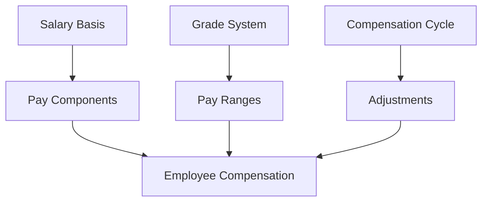
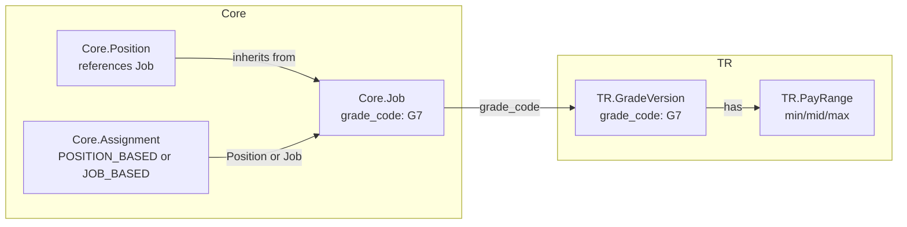
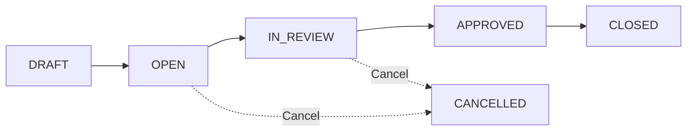
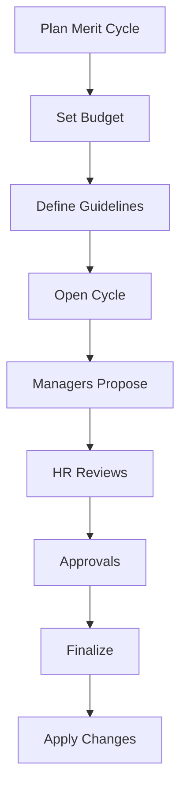

# Compensation Management Guide

**Version**: 1.0  
**Last Updated**: 2025-12-08  
**Audience**: HR Administrators, Compensation Managers  
**Reading Time**: 35-40 minutes

---

## 📋 Overview

This guide helps you understand and manage employee compensation in xTalent, from setting up salary structures to running annual merit reviews.

### What You'll Learn
- How compensation is structured (salary basis, components, grades)
- How to set up and configure compensation plans
- How to manage compensation cycles and adjustments
- How calculation rules work (tax, proration, dependencies)
- Best practices for compensation management

### Prerequisites
- Basic understanding of HR compensation concepts
- Access to Total Rewards module
- HR Administrator or Compensation Manager role

---

## 🎯 Section 1: Compensation Fundamentals

### 1.1 Core Concepts

**Compensation** in xTalent is built on four foundational concepts:

1. **Salary Basis**: The template that defines HOW employees are paid (monthly, hourly, etc.)
2. **Pay Components**: The WHAT - individual elements like base salary, allowances, bonuses
3. **Grade System**: The WHERE - salary ranges and career progression paths
4. **Compensation Cycles**: The WHEN - timing of reviews and adjustments



### 1.2 Salary Basis

A **Salary Basis** is a template that standardizes how compensation is structured.

**Key Characteristics**:
- **Frequency**: How often employees are paid (monthly, biweekly, hourly)
- **Currency**: The currency for this basis (VND, USD, SGD)
- **Components**: Which pay elements are included
- **Rules**: Country-specific calculation rules

**Example**:
```yaml
Vietnam Monthly Salary Basis:
  Code: MONTHLY_VN
  Frequency: Monthly
  Currency: VND
  Components:
    - Base Salary (mandatory)
    - Lunch Allowance (optional)
    - Transportation Allowance (optional)
  Rules:
    - 26 working days per month
    - 208 standard hours per month
    - Proration by calendar days
```

**When to Use**:
- Create separate bases for different countries
- Create separate bases for different employee types (full-time vs hourly)
- Use one basis per legal entity when possible

### 1.3 Pay Components

**Pay Components** are the building blocks of total compensation.

**Component Types**:

| Type | Description | Examples | Taxable? |
|------|-------------|----------|----------|
| **BASE** | Core salary | Base Salary, Hourly Wage | Yes |
| **ALLOWANCE** | Regular supplements | Lunch, Transportation, Housing | Varies |
| **BONUS** | Performance pay | Annual Bonus, Spot Bonus | Yes |
| **EQUITY** | Stock compensation | RSU, Stock Options | Yes (on vest) |
| **DEDUCTION** | Reductions | Loan Repayment, Garnishment | No |
| **OVERTIME** | Extra hours pay | OT 1.5x, Weekend OT 2x | Yes |

**Tax Treatment**:

```yaml
Example 1: Fully Taxable (Base Salary)
  Component: Base Salary
  Tax Treatment: FULLY_TAXABLE
  Subject to SI: Yes
  
Example 2: Partially Exempt (Lunch Allowance - Vietnam)
  Component: Lunch Allowance
  Tax Treatment: PARTIALLY_EXEMPT
  Tax Exempt Threshold: 730,000 VND/month
  Subject to SI: No
  
Example 3: Fully Exempt (Employer SI Contribution)
  Component: Employer SI
  Tax Treatment: TAX_EXEMPT
  Subject to SI: No
```

### 1.4 Grade System

The **Grade System** defines career levels and salary ranges.

**Components**:
1. **Grades**: Career levels (G1, G2, G3... or Junior, Mid, Senior)
2. **Career Ladders**: Progression paths (Technical, Management, Specialist)
3. **Pay Ranges**: Min-Mid-Max salary for each grade
4. **Steps**: Incremental increases within a grade

**Example Structure**:

```yaml
Technical Career Ladder:
  G1 - Junior Engineer:
    Pay Range: 15M - 20M - 25M VND
    Steps: Entry (15M), Mid (17.5M), Senior (20M)
  
  G2 - Engineer:
    Pay Range: 20M - 25M - 30M VND
    Steps: Entry (20M), Mid (22.5M), Senior (25M)
  
  G3 - Senior Engineer:
    Pay Range: 25M - 32M - 40M VND
    Steps: Entry (25M), Mid (28.5M), Senior (32M)
```

**Pay Range Concepts**:
- **Minimum**: Entry point for new hires or promotions
- **Midpoint**: Market rate for fully competent performers
- **Maximum**: Top of range for exceptional long-tenure employees
- **Range Spread**: (Max - Min) / Mid × 100 (typically 30-50%)

---

## 🔗 Integration with Core Module

### Overview

The Total Rewards module is tightly integrated with the **Core Module** for grade assignment and compensation management. Understanding this integration is essential for proper compensation setup.

### Grade Assignment from Core

> [!IMPORTANT]
> **TR.GradeVersion is the Single Source of Truth**
> 
> Core.JobGrade is deprecated. All grade references from Core module use `grade_code`
> which maps to TR.GradeVersion.

**Data Flow**:



**Position-Based Staffing**:
```
Core.Assignment → Core.Position → Core.Job → grade_code → TR.GradeVersion → TR.PayRange
```

**Job-Based Staffing**:
```
Core.Assignment → Core.Job → grade_code → TR.GradeVersion → TR.PayRange
```

### Pay Range Scope Resolution

Pay ranges can be defined at multiple scopes. The system uses the **most specific scope** available:

**Position-Based Priority**:
1. **POSITION** (specific position)
2. **BUSINESS_UNIT** (department/division)
3. **LEGAL_ENTITY** (company)
4. **GLOBAL** (default)

**Job-Based Priority**:
1. **BUSINESS_UNIT** (from Assignment)
2. **LEGAL_ENTITY** (from Assignment)
3. **GLOBAL** (default)

**Example**:

```yaml
# Global default range
PayRange:
  grade_code: "G7"
  scope_type: GLOBAL
  scope_uuid: NULL
  min: 100M VND
  mid: 130M VND
  max: 160M VND

# Vietnam-specific override
PayRange:
  grade_code: "G7"
  scope_type: LEGAL_ENTITY
  scope_uuid: VNG_VN_UUID
  min: 100M VND
  mid: 130M VND
  max: 160M VND

# Engineering BU override (higher market rate)
PayRange:
  grade_code: "G7"
  scope_type: BUSINESS_UNIT
  scope_uuid: BU_ENGINEERING_UUID
  min: 110M VND
  mid: 140M VND
  max: 170M VND

# Critical position override
PayRange:
  grade_code: "G7"
  scope_type: POSITION
  scope_uuid: POS_ARCHITECT_001_UUID
  min: 140M VND
  mid: 170M VND
  max: 200M VND
```

**Resolution Example**:

```yaml
# Position-Based Employee
Employee: Alice
  Assignment → Position: POS_ARCHITECT_001
  Position → Job: Senior Architect (Grade G7)

Pay Range Resolution:
  1. Check POSITION scope (POS_ARCHITECT_001 + G7) → Found!
  2. Use: 140M - 170M - 200M VND
  (Skips BU, LE, Global checks)

# Job-Based Employee
Employee: Bob
  Assignment → Job: Senior Engineer (Grade G7)
  Business Unit: Engineering

Pay Range Resolution:
  1. Check BU scope (BU_ENGINEERING + G7) → Found!
  2. Use: 110M - 140M - 170M VND
  (Skips LE, Global checks)
```

### Career Ladders and Job Hierarchy

**Core.Job Hierarchy** vs **TR.GradeLadder**:

| Aspect | Core.Job Hierarchy | TR.GradeLadder |
|--------|-------------------|----------------|
| **Purpose** | Job inheritance, attribute sharing | Career progression path |
| **Structure** | Parent-child tree | Ordered grade sequence |
| **Example** | Software Engineer → Backend Engineer → Senior Backend Engineer | G1 → G2 → G3 → G4 → G5 |
| **Use Case** | Job catalog organization | Compensation planning, promotions |

**They are complementary**:
- **Job hierarchy** organizes job definitions and enables inheritance
- **Grade ladder** defines compensation progression and career paths

**Example**:

```yaml
# Core Module: Job Hierarchy
Job: Software Engineer (Parent)
  ├─ Backend Engineer (Child)
  │   ├─ Junior Backend Engineer (grade_code: G1)
  │   ├─ Mid Backend Engineer (grade_code: G2)
  │   └─ Senior Backend Engineer (grade_code: G3)
  └─ Frontend Engineer (Child)
      ├─ Junior Frontend Engineer (grade_code: G1)
      └─ Senior Frontend Engineer (grade_code: G3)

# TR Module: Career Ladder
Technical Ladder:
  G1 (Junior) → G2 (Mid) → G3 (Senior) → G4 (Principal) → G5 (Distinguished)
  
# An employee can progress:
# - Within job hierarchy: Junior Backend → Mid Backend → Senior Backend
# - Along grade ladder: G1 → G2 → G3
# - Or laterally: Senior Backend (G3) → Senior Frontend (G3)
```

### Staffing Model Impact on Compensation

**Position-Based Model**:
- ✅ Can use position-specific pay ranges
- ✅ Tighter budget control (position-level)
- ✅ Easier pay equity management (same position = same range)
- ⚠️ Less flexibility in salary negotiations
- ⚠️ Requires position approval before hiring

**Job-Based Model**:
- ✅ More flexibility in salary negotiations
- ✅ Faster hiring (no position approval)
- ✅ Easier reorganizations
- ⚠️ Less budget control (headcount-level)
- ⚠️ Requires careful pay equity management

### Common Integration Workflows

**New Hire Compensation Setup**:
1. Core: Create Assignment (to Position or Job)
2. Core: Get grade_code from Job
3. TR: Get applicable PayRange (based on scope)
4. TR: Validate offer amount within range
5. TR: Create EmployeeCompensation record

**Promotion with Grade Change**:
1. Core: End current Assignment
2. Core: Create new Assignment (new Job with higher grade)
3. TR: Get new grade's PayRange
4. TR: Calculate new salary (typically 10-15% increase)
5. TR: Create CompensationAdjustment record

**Annual Merit Review**:
1. TR: Create CompensationCycle
2. Core: Get eligible employees (from Assignments)
3. TR: For each employee:
   - Get current grade from Core.Job
   - Get applicable PayRange
   - Calculate compa-ratio
   - Apply merit matrix
   - Propose adjustment
4. TR: Execute approved adjustments

### Cross-References

**For More Details**:
- [Core Job & Position Guide](../../CO/01-concept/03-job-position-guide.md) - Job and position management
- [Core Staffing Models Guide](../../CO/01-concept/08-staffing-models-guide.md) - Position-based vs job-based
- [CO-TR Integration Guide (Conceptual)](../../00-integration/CO-TR-integration/01-conceptual-guide.md) - Business user perspective
- [CO-TR Integration Guide (Technical)](../../00-integration/CO-TR-integration/02-technical-guide.md) - Developer perspective
- [New Hire Setup Guide](../../00-integration/CO-TR-integration/03-new-hire-setup.md) - Step-by-step workflow
- [Promotion Process Guide](../../00-integration/CO-TR-integration/04-promotion-process.md) - Promotion workflows
- [Merit Review Process Guide](../../00-integration/CO-TR-integration/05-merit-review-process.md) - Merit review cycles

---

### 1.5 Compensation Cycles

**Compensation Cycles** are structured review periods for salary adjustments.

**Cycle Types**:

| Type | Purpose | Frequency | Typical Timing |
|------|---------|-----------|----------------|
| **Merit Review** | Performance-based increases | Annual | January/April |
| **Promotion** | Grade/level changes | Ongoing | As needed |
| **Market Adjustment** | Competitive positioning | Annual | Mid-year |
| **New Hire** | Initial compensation | Ongoing | At hire |
| **Equity Correction** | Fix pay inequities | Ad-hoc | As identified |

**Cycle Workflow**:



---

## 🔧 Section 2: Setting Up Compensation

### 2.1 Creating a Salary Basis

**Step-by-Step**:

1. **Navigate**: Total Rewards → Configuration → Salary Basis
2. **Click**: "New Salary Basis"
3. **Enter Details**:
   ```yaml
   Code: MONTHLY_VN_2025
   Name: Vietnam Monthly Salary 2025
   Frequency: MONTHLY
   Currency: VND
   Effective Start Date: 2025-01-01
   ```
4. **Configure Metadata**:
   ```yaml
   Country: VN
   Working Days/Month: 26
   Standard Hours/Month: 208
   Overtime Multiplier: 1.5
   ```
5. **Add Components** (see next section)
6. **Save and Activate**

**Best Practices**:
- ✅ DO: Include country code in basis code (MONTHLY_VN, HOURLY_US)
- ✅ DO: Version salary bases by year for changes
- ✅ DO: Document working days/hours in metadata
- ❌ DON'T: Mix multiple currencies in one basis
- ❌ DON'T: Change frequency of active basis (create new version)

### 2.2 Defining Pay Components

**Step-by-Step**:

1. **Navigate**: Total Rewards → Configuration → Pay Components
2. **Click**: "New Component"
3. **Basic Information**:
   ```yaml
   Code: BASE_SALARY
   Name: Base Salary
   Type: BASE
   Frequency: MONTHLY
   ```
4. **Tax Configuration**:
   ```yaml
   Taxable: Yes
   Tax Treatment: FULLY_TAXABLE
   Subject to SI: Yes
   SI Calculation Basis: CAPPED
   ```
5. **Proration Rules**:
   ```yaml
   Prorated: Yes
   Proration Method: CALENDAR_DAYS
   ```
6. **Calculation Method**:
   ```yaml
   Calculation Method: FIXED
   # Or FORMULA, PERCENTAGE, RATE_TABLE
   ```

**Common Components Setup**:

```yaml
# Vietnam Standard Components

1. Base Salary:
   Type: BASE
   Taxable: Yes (Fully)
   SI: Yes (Capped at 36M VND)
   Prorated: Yes (Calendar Days)

2. Lunch Allowance:
   Type: ALLOWANCE
   Taxable: Partially (730K exempt)
   SI: No
   Prorated: Yes (Working Days)
   
3. Transportation Allowance:
   Type: ALLOWANCE
   Taxable: Yes (Fully)
   SI: No
   Prorated: Yes (Working Days)

4. Housing Allowance:
   Type: ALLOWANCE
   Taxable: Yes (Fully)
   SI: No
   Prorated: No (Full month or nothing)
```

### 2.3 Building Grade Structures

**Step-by-Step**:

1. **Define Career Ladders**:
   ```yaml
   Technical Ladder:
     Code: TECH_LADDER
     Type: TECHNICAL
     Grades: G1, G2, G3, G4, G5
   
   Management Ladder:
     Code: MGMT_LADDER
     Type: MANAGEMENT
     Grades: M1, M2, M3, M4, M5
   ```

2. **Create Grades**:
   ```yaml
   Grade G3:
     Code: G3
     Name: Senior Professional
     Job Level: 3
     Description: Experienced individual contributor
   ```

3. **Set Pay Ranges**:
   ```yaml
   G3 Pay Range (Vietnam):
     Scope: Legal Entity (VNG Corp)
     Currency: VND
     Min: 25,000,000
     Mid: 30,000,000
     Max: 35,000,000
     Range Spread: 33.3%
   ```

4. **Define Steps** (optional):
   ```yaml
   G3 Steps:
     Step 1 (Entry): 25M VND
     Step 2 (Mid): 27.5M VND
     Step 3 (Senior): 30M VND
   ```

**Grade Structure Best Practices**:
- ✅ DO: Keep grade structure simple (5-7 grades per ladder)
- ✅ DO: Ensure ~20-30% salary growth between grades
- ✅ DO: Review ranges annually for market competitiveness
- ✅ DO: Allow lateral movement between ladders
- ❌ DON'T: Create too many grades (causes compression)
- ❌ DON'T: Overlap ranges too much (reduces promotion impact)

### 2.4 Setting Pay Ranges

**Determining Pay Ranges**:

1. **Market Data**: Gather salary survey data for each grade
2. **Midpoint**: Set at market 50th percentile
3. **Minimum**: Typically 80-85% of midpoint
4. **Maximum**: Typically 115-125% of midpoint

**Example Calculation**:
```yaml
Market Data for G3 Senior Engineer (Vietnam):
  25th Percentile: 24M VND
  50th Percentile (Median): 30M VND
  75th Percentile: 36M VND

Proposed Pay Range:
  Midpoint: 30M VND (market median)
  Minimum: 25M VND (83% of mid)
  Maximum: 35M VND (117% of mid)
  Range Spread: 33.3%
```

**Multi-Scope Ranges**:

```yaml
# Global Range (USD)
G3 Global:
  Min: $80,000
  Mid: $100,000
  Max: $120,000

# Vietnam Override (VND)
G3 Vietnam:
  Min: 25,000,000 VND
  Mid: 30,000,000 VND
  Max: 35,000,000 VND

# Singapore Override (SGD)
G3 Singapore:
  Min: $90,000 SGD
  Mid: $110,000 SGD
  Max: $130,000 SGD
```

**System Logic**: More specific scope wins (Position > BU > Legal Entity > Global)

---

## 💼 Section 3: Managing Compensation

### 3.1 Running Annual Merit Reviews

**Merit Review Process**:



**Step 1: Create Compensation Plan**

```yaml
Merit Plan 2025:
  Code: MERIT_2025
  Type: MERIT
  Eligibility:
    Min Tenure: 6 months
    Min Performance: Meets Expectations
    Employment Status: Active
  Guidelines:
    Merit Matrix:
      - Performance: Exceeds, Compa-Ratio: <90%, Increase: 8-10%
      - Performance: Exceeds, Compa-Ratio: 90-110%, Increase: 6-8%
      - Performance: Meets, Compa-Ratio: <90%, Increase: 4-6%
      - Performance: Meets, Compa-Ratio: 90-110%, Increase: 3-5%
    Approval Thresholds:
      Manager: 0-5%
      Director: 5-10%
      VP: >10%
```

**Step 2: Create Compensation Cycle**

```yaml
Merit Cycle Q1 2025:
  Plan: MERIT_2025
  Code: MERIT_2025_Q1
  Period: 2025-01-01 to 2025-03-31
  Effective Date: 2025-04-01
  Budget: 5,000,000,000 VND
  Status: DRAFT
```

**Step 3: Allocate Budget**

```yaml
Budget Allocation:
  Engineering Department:
    Allocated: 2,000,000,000 VND
    Utilized: 0 VND
  
  Sales Department:
    Allocated: 1,500,000,000 VND
    Utilized: 0 VND
  
  Operations:
    Allocated: 1,500,000,000 VND
    Utilized: 0 VND
```

**Step 4: Open Cycle**

- Change status from DRAFT → OPEN
- Notify managers to submit proposals
- Set deadline for submissions

**Step 5: Manager Proposals**

Managers propose adjustments for their team:

```yaml
Example Adjustment:
  Employee: Nguyen Van A
  Current Salary: 30,000,000 VND
  Proposed Salary: 32,400,000 VND
  Increase: 2,400,000 VND (8%)
  Rationale: "Exceeded all KPIs, led 3 major projects"
  Performance Rating: Exceeds Expectations
  Compa-Ratio: 100% (at midpoint)
```

**Step 6: HR Review**

HR reviews for:
- ✅ Budget compliance
- ✅ Guideline adherence
- ✅ Pay equity
- ✅ Market competitiveness

**Step 7: Approvals**

Based on increase percentage:
- 0-5%: Manager approval only
- 5-10%: Director approval required
- >10%: VP approval required

**Step 8: Finalize and Apply**

- Close cycle (OPEN → CLOSED)
- System creates EmployeeCompensationSnapshot records
- Changes effective on specified date (e.g., April 1)

### 3.2 Processing Promotions

**Promotion Workflow**:

1. **Manager Initiates**:
   ```yaml
   Promotion Request:
     Employee: Tran Thi B
     Current Grade: G2 (Engineer)
     Proposed Grade: G3 (Senior Engineer)
     Effective Date: 2025-05-01
     Justification: "Consistently senior-level work, mentoring juniors"
   ```

2. **Determine New Salary**:
   ```yaml
   Current Compensation:
     Grade: G2
     Salary: 25,000,000 VND
     Compa-Ratio: 100% (at G2 midpoint)
   
   New Grade Range (G3):
     Min: 25,000,000 VND
     Mid: 30,000,000 VND
     Max: 35,000,000 VND
   
   Proposed Salary: 28,000,000 VND
   Rationale: 
     - Above G3 minimum (not entry level)
     - Below G3 midpoint (room to grow)
     - 12% increase (typical for promotion)
   ```

3. **Create Adjustment**:
   ```yaml
   Compensation Adjustment:
     Type: PROMOTION
     Current: 25,000,000 VND
     Proposed: 28,000,000 VND
     Increase: 3,000,000 VND (12%)
     New Grade: G3
   ```

4. **Approval and Execution**:
   - Director/VP approval required
   - Update Assignment (new grade)
   - Create CompensationSnapshot
   - Effective on promotion date

**Promotion Best Practices**:
- ✅ DO: Bring to at least minimum of new grade
- ✅ DO: Consider performance and compa-ratio
- ✅ DO: Typical promotion increase: 10-15%
- ❌ DON'T: Promote to maximum of new range
- ❌ DON'T: Promote without salary increase

### 3.3 Market Adjustments

**When to Use**:
- Annual market review shows pay below market
- Retention risk for critical talent
- New market data available

**Process**:

```yaml
Market Adjustment Example:
  Situation: Software Engineers 15% below market
  
  Analysis:
    Current G3 Range: 25M - 30M - 35M VND
    Market Data (2025): 30M - 35M - 42M VND
    Gap: -14.3% at midpoint
  
  Action:
    Update Pay Range:
      New Min: 30M VND
      New Mid: 35M VND
      New Max: 42M VND
    
    Adjust Current Employees:
      - Below new minimum → Increase to minimum
      - Between min-mid → 10% increase
      - Above mid → 5% increase (maintain compa-ratio)
```

### 3.4 Budget Tracking

**Real-Time Budget Monitoring**:

```yaml
Engineering Department Budget:
  Allocated: 2,000,000,000 VND
  Utilized: 1,750,000,000 VND
  Remaining: 250,000,000 VND
  Utilization: 87.5%
  
  Status: ⚠️ Warning (approaching limit)
  
  Breakdown:
    Approved Adjustments: 1,750,000,000 VND
    Pending Approvals: 300,000,000 VND
    Total Committed: 2,050,000,000 VND
    
  Action Required: 
    - Review pending proposals
    - Reduce some increases
    - Or request budget increase
```

**Budget Alerts**:
- 🟢 Green: <80% utilized
- 🟡 Yellow: 80-95% utilized
- 🔴 Red: >95% utilized
- ⛔ Block: >100% (cannot approve more)

---

## 🧮 Section 4: Calculation Rules

### 4.1 Tax Calculation

**Vietnam PIT (Personal Income Tax)**:

```yaml
Tax Calculation Flow:
  1. Gross Income: Sum all taxable components
  2. Deductions:
     - Personal: 11,000,000 VND/month
     - Dependents: 4,400,000 VND each
     - SI Contributions: Employee portion
  3. Taxable Income: Gross - Deductions
  4. Apply Progressive Tax Brackets
  5. Tax Amount: Sum of bracket taxes
```

**Tax Brackets (Vietnam 2025)**:

| Taxable Income (VND/month) | Rate | Quick Deduction |
|----------------------------|------|-----------------|
| 0 - 5M | 5% | 0 |
| 5M - 10M | 10% | 250K |
| 10M - 18M | 15% | 750K |
| 18M - 32M | 20% | 1,650K |
| 32M - 52M | 25% | 3,250K |
| 52M - 80M | 30% | 5,850K |
| >80M | 35% | 9,850K |

**Example Calculation**:

```yaml
Employee: Nguyen Van C
Gross Salary: 35,000,000 VND
Dependents: 2 (spouse + 1 child)

Step 1 - Gross Income:
  Base Salary: 30,000,000 VND
  Lunch Allowance: 2,000,000 VND (taxable: 1,270,000)
  Transportation: 3,000,000 VND
  Total Gross: 34,270,000 VND

Step 2 - Deductions:
  Personal: 11,000,000 VND
  Dependents: 8,800,000 VND (2 × 4,400,000)
  SI Employee: 3,150,000 VND (10.5% of capped 30M)
  Total Deductions: 22,950,000 VND

Step 3 - Taxable Income:
  34,270,000 - 22,950,000 = 11,320,000 VND

Step 4 - Tax Calculation:
  Bracket: 10M - 18M (15% rate)
  Tax = 11,320,000 × 15% - 750,000
  Tax = 1,698,000 - 750,000
  Tax = 948,000 VND
```

### 4.2 Social Insurance Calculation

**Vietnam SI Rates (2025)**:

| Type | Employee | Employer | Total | Cap |
|------|----------|----------|-------|-----|
| Social Insurance | 8% | 17.5% | 25.5% | 36M VND |
| Health Insurance | 1.5% | 3% | 4.5% | 36M VND |
| Unemployment | 1% | 1% | 2% | 83.2M VND |
| **Total** | **10.5%** | **21.5%** | **32%** | - |

**Calculation Example**:

```yaml
Employee Salary: 45,000,000 VND

SI Calculation:
  Base for SI/HI: min(45M, 36M) = 36,000,000 VND
  Base for UI: min(45M, 83.2M) = 45,000,000 VND
  
  Employee Contributions:
    SI: 36M × 8% = 2,880,000 VND
    HI: 36M × 1.5% = 540,000 VND
    UI: 45M × 1% = 450,000 VND
    Total: 3,870,000 VND
  
  Employer Contributions:
    SI: 36M × 17.5% = 6,300,000 VND
    HI: 36M × 3% = 1,080,000 VND
    UI: 45M × 1% = 450,000 VND
    Total: 7,830,000 VND
```

### 4.3 Proration Rules

**Proration Methods**:

1. **Calendar Days**: Total days / Days in month
2. **Working Days**: Working days / Standard working days
3. **None**: Full amount or nothing

**Example Scenarios**:

```yaml
Scenario 1: New Hire (Mid-Month)
  Employee: Hired on March 15, 2025
  Salary: 30,000,000 VND/month
  Days in March: 31
  Days Worked: 17 (Mar 15-31)
  
  Base Salary (Calendar Days):
    30,000,000 × (17/31) = 16,451,613 VND
  
  Lunch Allowance (Working Days):
    Standard: 26 days/month
    Worked: 11 days
    2,000,000 × (11/26) = 846,154 VND

Scenario 2: Unpaid Leave
  Employee: 5 days unpaid leave in March
  Salary: 30,000,000 VND/month
  
  Deduction (Calendar Days):
    30,000,000 × (5/31) = 4,838,710 VND
  
  Net Salary: 25,161,290 VND
```

### 4.4 Component Dependencies

**Calculation Order**:

Some components depend on others and must be calculated in sequence:

```yaml
Calculation Order Example:

1. Base Salary (independent)
   → 30,000,000 VND

2. Overtime (depends on Base)
   → Base ÷ 208 hours × 1.5 × OT hours
   → 30M ÷ 208 × 1.5 × 10 = 2,163,462 VND

3. Performance Bonus (depends on Base)
   → Base × Performance %
   → 30M × 10% = 3,000,000 VND

4. Total Taxable (depends on all above)
   → 30M + 2.16M + 3M = 35,160,000 VND

5. Tax (depends on Total Taxable)
   → Calculate using brackets
```

**Dependency Configuration**:

```yaml
ComponentDependency:
  Component: Overtime
  Depends On: Base Salary
  Calculation Order: 2
  
  Component: Performance Bonus
  Depends On: Base Salary
  Calculation Order: 2
  
  Component: Tax
  Depends On: [Base, Overtime, Bonus]
  Calculation Order: 5
```

---

## ✅ Section 5: Best Practices

### 5.1 Compensation Structure Design

**DO**:
- ✅ Keep grade structure simple (5-7 grades per ladder)
- ✅ Ensure meaningful differentiation between grades (20-30% growth)
- ✅ Use market data to set competitive ranges
- ✅ Review and update ranges annually
- ✅ Document all compensation policies clearly
- ✅ Maintain pay equity across similar roles

**DON'T**:
- ❌ Create too many grades (causes compression)
- ❌ Set ranges too narrow (limits flexibility)
- ❌ Ignore market data (leads to retention issues)
- ❌ Make ad-hoc exceptions without policy
- ❌ Change structures mid-year without communication

### 5.2 Merit Review Best Practices

**DO**:
- ✅ Use merit matrices for consistency
- ✅ Consider both performance AND position in range
- ✅ Set clear budget guidelines
- ✅ Communicate timeline and expectations early
- ✅ Review for pay equity before finalizing
- ✅ Provide manager training on guidelines

**DON'T**:
- ❌ Give same increase to everyone (not merit-based)
- ❌ Exceed budget without approval
- ❌ Rush the process (quality over speed)
- ❌ Ignore market competitiveness
- ❌ Forget to communicate results to employees

### 5.3 Promotion Management

**DO**:
- ✅ Require business justification
- ✅ Ensure employee meets new grade requirements
- ✅ Bring salary to at least minimum of new grade
- ✅ Consider timing (budget availability)
- ✅ Update job title and responsibilities
- ✅ Communicate expectations for new level

**DON'T**:
- ❌ Promote without salary increase
- ❌ Promote to maximum of new range
- ❌ Use promotion as retention tool only
- ❌ Skip approval process
- ❌ Promote too frequently (grade inflation)

### 5.4 Pay Equity

**Monitoring Pay Equity**:

```yaml
Pay Equity Analysis:
  Dimension: Gender
  Job: Software Engineer (G3)
  
  Male Employees (n=50):
    Average: 31,500,000 VND
    Median: 30,000,000 VND
  
  Female Employees (n=30):
    Average: 29,200,000 VND
    Median: 28,500,000 VND
  
  Gap: -7.3% (female vs male)
  
  Action:
    - Review individual cases
    - Identify legitimate factors (tenure, performance)
    - Address unexplained gaps
    - Create correction plan
```

**Best Practices**:
- ✅ Conduct annual pay equity audits
- ✅ Review by gender, ethnicity, age
- ✅ Control for legitimate factors (performance, tenure, location)
- ✅ Address gaps proactively
- ✅ Document analysis and actions

### 5.5 Communication

**What to Communicate**:

1. **To All Employees**:
   - Compensation philosophy
   - Grade structure overview
   - Merit review timeline
   - How compensation is determined

2. **To Managers**:
   - Detailed guidelines and matrices
   - Budget allocations
   - Approval thresholds
   - How to use the system

3. **To Individuals**:
   - Their current grade and salary
   - Position in pay range (compa-ratio)
   - Merit increase (amount and %)
   - Effective date

**Communication Best Practices**:
- ✅ Be transparent about process
- ✅ Provide context (market, budget, performance)
- ✅ Train managers on delivery
- ✅ Offer FAQ and support resources
- ❌ Don't share others' compensation
- ❌ Don't make promises you can't keep

---

## ⚠️ Common Pitfalls

### Pitfall 1: Inconsistent Component Configuration

❌ **Wrong**:
```yaml
# Different proration methods for same component
Vietnam Basis:
  Lunch Allowance: Proration = Calendar Days

Singapore Basis:
  Lunch Allowance: Proration = Working Days
```

✅ **Correct**:
```yaml
# Consistent proration across all bases
All Bases:
  Lunch Allowance: Proration = Working Days
  (Consistent with how allowance is earned)
```

### Pitfall 2: Ignoring Compa-Ratio

❌ **Wrong**:
```yaml
# Giving same % increase regardless of position in range
Employee A: Salary 25M (83% of mid) → +5% = 26.25M
Employee B: Salary 34M (113% of mid) → +5% = 35.7M
# Employee B now above maximum!
```

✅ **Correct**:
```yaml
# Consider compa-ratio in increase decisions
Employee A: 83% of mid → +8% (bring closer to mid)
Employee B: 113% of mid → +2% (already above mid)
```

### Pitfall 3: Poor Budget Planning

❌ **Wrong**:
```yaml
# Allocating budget without analysis
Total Budget: 5B VND
Engineering: 2B (40%)
Sales: 2B (40%)
Operations: 1B (20%)
# Ignores headcount and current pay levels
```

✅ **Correct**:
```yaml
# Budget based on headcount and target increase
Engineering: 100 employees, avg 30M, target 5% = 150M
Sales: 80 employees, avg 25M, target 6% = 120M
Operations: 120 employees, avg 20M, target 4% = 96M
Total: 366M VND needed
```

### Pitfall 4: Promotion Salary Errors

❌ **Wrong**:
```yaml
Promotion G2 → G3:
  Current: 25M (G2 max)
  New: 26M (G3 min)
  Increase: 4%
  # Too small for promotion!
```

✅ **Correct**:
```yaml
Promotion G2 → G3:
  Current: 25M (G2 max)
  New: 28M (G3 entry+)
  Increase: 12%
  # Meaningful promotion increase
```

---

## 🎓 Quick Reference

### Checklist: Setting Up New Salary Basis

- [ ] Define code with country/frequency (e.g., MONTHLY_VN)
- [ ] Set correct currency
- [ ] Configure working days/hours in metadata
- [ ] Add mandatory components (Base Salary)
- [ ] Add optional components (Allowances)
- [ ] Set calculation order for dependent components
- [ ] Configure proration rules
- [ ] Test with sample calculations
- [ ] Activate and assign to employees

### Checklist: Running Merit Review

- [ ] Create Compensation Plan with guidelines
- [ ] Create Compensation Cycle with dates
- [ ] Allocate budget by department/unit
- [ ] Open cycle for manager input
- [ ] Communicate timeline and guidelines to managers
- [ ] Monitor budget utilization
- [ ] Review proposals for equity and compliance
- [ ] Route for approvals
- [ ] Finalize and close cycle
- [ ] Communicate results to employees
- [ ] Verify changes in payroll

### Checklist: Processing Promotion

- [ ] Verify employee meets new grade requirements
- [ ] Determine appropriate new salary (min to mid of new grade)
- [ ] Calculate increase % (typically 10-15%)
- [ ] Create compensation adjustment
- [ ] Route for approval (Director/VP)
- [ ] Update assignment with new grade
- [ ] Update job title if needed
- [ ] Communicate to employee
- [ ] Verify effective date

### Key Formulas

```yaml
Compa-Ratio:
  Formula: (Employee Salary / Grade Midpoint) × 100
  Example: 27M / 30M × 100 = 90%
  
Range Spread:
  Formula: (Max - Min) / Mid × 100
  Example: (35M - 25M) / 30M × 100 = 33.3%
  
Increase Percentage:
  Formula: (New - Current) / Current × 100
  Example: (32.4M - 30M) / 30M × 100 = 8%
  
Proration (Calendar Days):
  Formula: Amount × (Days Worked / Days in Month)
  Example: 30M × (17 / 31) = 16.45M
  
Proration (Working Days):
  Formula: Amount × (Days Worked / Standard Days)
  Example: 2M × (11 / 26) = 846K
```

---

## 📚 Related Guides

- [Variable Pay Guide](./02-variable-pay-guide.md) - Bonuses, equity, commissions
- [Benefits Administration Guide](./03-benefits-administration-guide.md) - Benefit plans and enrollment
- [Tax Compliance Guide](./07-tax-compliance-guide.md) - Tax rules and reporting
- [Multi-Country Compensation Guide](./08-multi-country-compensation-guide.md) - Global compensation management
- [Eligibility Rules Guide](./09-eligibility-rules-guide.md) - Defining who is eligible for what

---

## 📖 Additional Resources

### Glossary References
- [Core Compensation Glossary](../00-ontology/glossary-core-compensation.md) - Detailed entity definitions
- [Calculation Rules Glossary](../00-ontology/glossary-calculation-rules.md) - Tax and SI rules

### Technical Documentation
- TR Ontology (tr-ontology.yaml) - Complete data model
- API Specification (coming soon) - Integration endpoints

---

**Document Version**: 1.0  
**Created**: 2025-12-08  
**Last Review**: 2025-12-08  
**Next Review**: 2026-01-08

**Feedback**: Please send feedback to [docs@xtalent.com]
