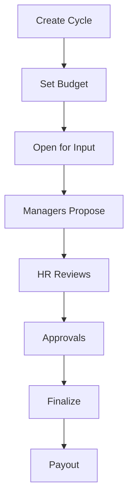

# Variable Pay Guide

**Version**: 1.0  
**Last Updated**: 2025-12-08  
**Audience**: HR Administrators, Managers  
**Reading Time**: 25-30 minutes

---

## 📋 Overview

This guide explains how to manage performance-based compensation including bonuses, equity grants, and sales commissions in xTalent.

### What You'll Learn
- How to set up and run bonus programs (STI, LTI, spot bonuses)
- How to manage equity compensation (RSU, stock options)
- How to configure sales commission plans
- How performance ratings integrate with variable pay
- Best practices for variable pay administration

### Prerequisites
- Understanding of compensation fundamentals
- HR Administrator or Manager role
- Access to Total Rewards module

---

## 🎯 Section 1: Variable Pay Overview

### 1.1 What is Variable Pay?

**Variable Pay** is compensation that varies based on performance, results, or other factors (vs fixed salary).

**Types of Variable Pay**:

| Type | Description | Typical Frequency | Example |
|------|-------------|-------------------|---------|
| **STI** (Short-Term Incentive) | Annual performance bonus | Annual | 15% of salary based on performance |
| **LTI** (Long-Term Incentive) | Multi-year retention incentive | 2-4 years | 30% of salary in RSU vesting over 3 years |
| **Spot Bonus** | Ad-hoc recognition award | As needed | 5M VND for exceptional project delivery |
| **Sales Commission** | Revenue-based compensation | Monthly/Quarterly | 5% of sales revenue |
| **Retention Bonus** | Retention incentive | One-time | 50M VND to retain critical talent |
| **Sign-On Bonus** | Joining incentive | One-time | 30M VND to attract new hire |

### 1.2 Variable Pay Philosophy

**Why Variable Pay?**

```yaml
Benefits:
  ✅ Aligns pay with performance
  ✅ Motivates high performers
  ✅ Attracts competitive talent
  ✅ Shares company success
  ✅ Provides flexibility (vs fixed costs)

Considerations:
  ⚠️ Requires clear metrics
  ⚠️ Can create competition
  ⚠️ Needs transparent communication
  ⚠️ Budget variability
```

**Variable Pay Mix**:

```yaml
Entry Level (G1-G2):
  Fixed: 90%
  Variable: 10% (STI only)

Mid Level (G3-G4):
  Fixed: 85%
  Variable: 15% (STI + small LTI)

Senior (G5-M2):
  Fixed: 75%
  Variable: 25% (STI + LTI)

Executive (M3+):
  Fixed: 60%
  Variable: 40% (STI + LTI + equity)
```

### 1.3 Key Concepts

**Target vs Actual**:

```yaml
Target Bonus:
  - What employee can earn at 100% performance
  - Example: 15% of annual salary

Actual Bonus:
  - What employee actually receives
  - Varies based on:
    * Individual performance (0-150%)
    * Company performance (80-120%)
    * Manager discretion

Example Calculation:
  Salary: 50,000,000 VND
  Target: 15%
  Target Bonus: 7,500,000 VND
  
  Performance: Exceeds (150% multiplier)
  Company: 110% achievement
  
  Actual Bonus: 7.5M × 1.5 × 1.1 = 12,375,000 VND
```

**Eligibility**:

```yaml
Common Eligibility Rules:
  - Minimum tenure (e.g., 6 months)
  - Employment status (Full-Time only)
  - Performance threshold (Meets or above)
  - Not on probation
  - Active on payout date
```

---

## 💰 Section 2: Bonus Programs

### 2.1 Creating a Bonus Plan

**Step-by-Step**:

1. **Navigate**: Total Rewards → Variable Pay → Bonus Plans
2. **Click**: "New Bonus Plan"
3. **Basic Information**:
   ```yaml
   Code: STI_2025
   Name: 2025 Short-Term Incentive
   Type: STI
   Effective Date: 2025-01-01
   ```

4. **Define Formula**:
   ```yaml
   Base: ANNUAL_SALARY
   Target %: 15%
   
   Performance Multipliers:
     OUTSTANDING: 1.5 (150%)
     EXCEEDS: 1.2 (120%)
     MEETS: 1.0 (100%)
     BELOW: 0.5 (50%)
     UNSATISFACTORY: 0.0 (0%)
   
   Company Multiplier Range:
     Minimum: 0.8 (80%)
     Maximum: 1.2 (120%)
   ```

5. **Set Eligibility**:
   ```yaml
   Minimum Tenure: 6 months
   Employment Types: Full-Time
   Grades: G3, G4, G5, M1, M2, M3
   Performance Minimum: MEETS
   Exclude Probation: Yes
   ```

6. **Save and Activate**

**Bonus Plan Types**:

```yaml
STI (Short-Term Incentive):
  Purpose: Annual performance reward
  Period: 1 year
  Payout: Cash
  Target: 10-20% of salary
  
LTI (Long-Term Incentive):
  Purpose: Multi-year retention
  Period: 2-4 years
  Payout: Cash + Equity
  Target: 20-40% of salary
  
Spot Bonus:
  Purpose: Ad-hoc recognition
  Period: Immediate
  Payout: Cash
  Amount: Fixed (e.g., 5M VND)
  
Retention Bonus:
  Purpose: Retain critical talent
  Period: 1-2 years (cliff vesting)
  Payout: Cash
  Amount: Negotiated
```

### 2.2 Running a Bonus Cycle

**Annual STI Cycle Workflow**:



**Step 1: Create Bonus Cycle**

```yaml
Cycle Setup:
  Plan: STI_2025
  Code: STI_2025_ANNUAL
  Performance Period: 2025-01-01 to 2025-12-31
  Payout Date: 2026-03-15
  Budget: 10,000,000,000 VND
  Status: DRAFT
```

**Step 2: Allocate Budget by Legal Entity**

```yaml
Budget Pools:
  Vietnam (VNG Corp):
    Budget: 5,000,000,000 VND
    Employees: 500
    Avg Target: 10M VND
  
  Singapore (VNG SG):
    Budget: 3,000,000,000 VND
    Employees: 200
    Avg Target: 15M VND
  
  US (VNG US):
    Budget: 2,000,000,000 VND
    Employees: 100
    Avg Target: 20M VND
```

**Step 3: Open Cycle**

- Change status: DRAFT → OPEN
- System identifies eligible employees
- Notify managers to submit proposals
- Set deadline (e.g., February 15, 2026)

**Step 4: Manager Proposals**

Managers propose bonuses for their team:

```yaml
Example Proposal:
  Employee: Nguyen Van A
  Salary: 50,000,000 VND
  Target %: 15%
  Target Bonus: 7,500,000 VND
  
  Performance Rating: EXCEEDS
  Performance Multiplier: 1.2
  
  Company Multiplier: 1.1 (110% achievement)
  
  Calculated Bonus: 7.5M × 1.2 × 1.1 = 9,900,000 VND
  Proposed Bonus: 10,000,000 VND (manager discretion)
  
  Justification: "Led 3 major projects, exceeded all KPIs"
```

**Step 5: HR Review**

HR reviews for:
- ✅ Budget compliance (pool utilization)
- ✅ Formula adherence
- ✅ Pay equity across departments
- ✅ Outlier analysis (too high/low)

**Step 6: Approvals**

```yaml
Approval Thresholds:
  < 10M VND: Manager approval only
  10-20M VND: Director approval
  > 20M VND: VP approval
  
Approval Workflow:
  Manager → Director → VP → CFO (if needed)
```

**Step 7: Finalize and Payout**

- Close cycle (OPEN → APPROVED)
- Generate payout file for payroll
- Communicate to employees
- Process payment on payout date

### 2.3 Budget Management

**Real-Time Budget Tracking**:

```yaml
Vietnam Pool Status:
  Allocated: 5,000,000,000 VND
  Proposed: 4,800,000,000 VND
  Approved: 4,500,000,000 VND
  Remaining: 500,000,000 VND
  Utilization: 90%
  
  Status: 🟢 Within Budget
```

**Budget Alerts**:

```yaml
🟢 Green (< 90%): Healthy, room for adjustments
🟡 Yellow (90-100%): Approaching limit, review carefully
🔴 Red (> 100%): Over budget, requires CFO approval
```

**Budget Reallocation**:

```yaml
Scenario: Engineering over budget, Sales under budget
  
  Engineering Pool:
    Allocated: 2B VND
    Needed: 2.2B VND
    Shortfall: 200M VND
  
  Sales Pool:
    Allocated: 1.5B VND
    Used: 1.2B VND
    Surplus: 300M VND
  
  Action: Reallocate 200M from Sales to Engineering
```

---

## 📈 Section 3: Equity Compensation

### 3.1 Equity Types

**RSU (Restricted Stock Units)**:

```yaml
What: Company stock granted to employee
Vesting: Time-based (typically 4 years)
Tax: Taxed as ordinary income on vest date
Exercise: No exercise needed (automatic)
Risk: Lower (always has value)

Example:
  Grant: 1,000 RSU
  FMV at Grant: 100,000 VND/unit
  Vesting: 25% per year over 4 years
  
  Year 1 Vest: 250 units
  FMV at Vest: 120,000 VND/unit
  Taxable Income: 250 × 120,000 = 30,000,000 VND
```

**Stock Options**:

```yaml
What: Right to buy company stock at fixed price
Vesting: Time-based (typically 4 years)
Tax: Taxed on exercise (gain = FMV - strike price)
Exercise: Must exercise to own stock
Risk: Higher (can be underwater if FMV < strike)

Example:
  Grant: 5,000 options
  Strike Price: 80,000 VND/unit
  FMV at Grant: 100,000 VND/unit
  Vesting: 25% per year over 4 years
  
  Year 3: 3,750 options vested
  FMV at Exercise: 150,000 VND/unit
  Exercise Cost: 3,750 × 80,000 = 300,000,000 VND
  Stock Value: 3,750 × 150,000 = 562,500,000 VND
  Taxable Gain: 262,500,000 VND
```

### 3.2 Creating Equity Grants

**Step-by-Step**:

1. **Navigate**: Total Rewards → Variable Pay → Equity Grants
2. **Click**: "New Grant"
3. **Grant Details**:
   ```yaml
   Employee: Select employee
   Grant Number: RSU-2025-001234 (auto-generated)
   Grant Date: 2025-01-01
   Unit Type: RSU
   Total Units: 1,000
   FMV at Grant: 100,000 VND/unit
   ```

4. **Vesting Schedule**:
   ```yaml
   Type: TIME_BASED
   Cliff: 12 months (1 year)
   Total Period: 48 months (4 years)
   Frequency: QUARTERLY
   
   Schedule:
     2026-01-01: 250 units (cliff)
     2026-04-01: 62.5 units
     2026-07-01: 62.5 units
     2026-10-01: 62.5 units
     ... (continues quarterly)
   ```

5. **Save**

**Vesting Schedule Patterns**:

```yaml
Standard 4-Year with 1-Year Cliff:
  Year 1: 0% (cliff)
  Year 2: 25% (cliff vests)
  Year 3: 25% (quarterly)
  Year 4: 25% (quarterly)
  Year 5: 25% (quarterly)

Accelerated 3-Year:
  Year 1: 33.33%
  Year 2: 33.33%
  Year 3: 33.33%

Front-Loaded:
  Year 1: 40%
  Year 2: 30%
  Year 3: 20%
  Year 4: 10%
```

### 3.3 Vesting Events

**Automatic Vesting**:

```yaml
System automatically creates vesting events based on schedule:
  
  2026-01-01 (Cliff):
    Event Type: CLIFF
    Units Vested: 250
    Status: SCHEDULED → VESTED
    Tax Event: Created (for RSU)
  
  2026-04-01 (Quarterly):
    Event Type: SCHEDULED
    Units Vested: 62.5
    Status: VESTED
```

**Accelerated Vesting**:

```yaml
Scenarios for Acceleration:
  1. Acquisition/IPO: All unvested units vest immediately
  2. Termination (Good Leaver): Accelerate 50-100%
  3. Death/Disability: Full acceleration
  4. Performance Achievement: Bonus acceleration

Example - Acquisition:
  Employee: Has 750 unvested units
  Event: Company acquired
  Action: Create accelerated vesting event
  
  Vesting Event:
    Event Type: ACCELERATED
    Reason: ACQUISITION
    Units: 750
    Vest Date: 2025-06-15 (acquisition date)
```

**Forfeiture**:

```yaml
Termination (Bad Leaver):
  Vested Units: Keep (already owned)
  Unvested Units: Forfeit
  
  Forfeiture Event:
    Event Type: FORFEIT
    Units: -500 (negative)
    Reason: TERMINATION
```

### 3.4 Option Exercise

**Exercise Workflow**:

```yaml
Step 1: Check Vested Options
  Employee: Has 2,000 vested options
  Strike Price: 80,000 VND
  Current FMV: 150,000 VND
  Potential Gain: (150K - 80K) × 2,000 = 140M VND

Step 2: Decide to Exercise
  Options to Exercise: 1,000
  Exercise Cost: 1,000 × 80,000 = 80,000,000 VND
  
Step 3: Create Exercise Transaction
  Transaction Type: EXERCISE
  Units: 1,000
  Price: 80,000 VND
  Cash Value: 80,000,000 VND
  Gain: 70,000,000 VND (taxable)

Step 4: Tax Withholding
  Taxable Gain: 70,000,000 VND
  Tax Rate: 20% (example)
  Tax Withheld: 14,000,000 VND
  
Step 5: Receive Stock
  Employee receives 1,000 shares
  Cost basis: 150,000 VND/share (for future capital gains)
```

---

## 💼 Section 4: Commission Plans

### 4.1 Commission Structures

**Flat Rate Commission**:

```yaml
Structure: Fixed % of revenue
Example: 5% of all sales

Calculation:
  Revenue: 100,000,000 VND
  Rate: 5%
  Commission: 5,000,000 VND
  
Pros: Simple, predictable
Cons: No incentive to exceed quota
```

**Tiered Commission**:

```yaml
Structure: Different rates at different levels
Example:
  Tier 1 (0-100% quota): 3% rate
  Tier 2 (100-120% quota): 5% rate
  Tier 3 (120%+ quota): 7% rate

Calculation:
  Quota: 100,000,000 VND
  Revenue: 130,000,000 VND
  Achievement: 130%
  
  Tier 1: 100M × 3% = 3,000,000 VND
  Tier 2: 20M × 5% = 1,000,000 VND
  Tier 3: 10M × 7% = 700,000 VND
  Total: 4,700,000 VND

Pros: Motivates exceeding quota
Cons: More complex
```

**Accelerator Commission**:

```yaml
Structure: Higher rate above quota
Example:
  Below 100%: 4% rate
  Above 100%: 6% rate

Calculation:
  Quota: 100,000,000 VND
  Revenue: 120,000,000 VND
  
  First 100M: 100M × 4% = 4,000,000 VND
  Above 100M: 20M × 6% = 1,200,000 VND
  Total: 5,200,000 VND

Pros: Strong incentive to exceed
Cons: Can be expensive
```

### 4.2 Setting Up Commission Plans

**Step-by-Step**:

1. **Create Commission Plan**:
   ```yaml
   Code: SALES_COMM_2025
   Name: 2025 Sales Commission
   Type: REVENUE_BASED
   Quota Type: INDIVIDUAL
   Payment Frequency: MONTHLY
   Calculation Method: ACCELERATOR
   ```

2. **Define Formula**:
   ```yaml
   Base Rate: 4%
   Quota Threshold: 100%
   Accelerator Rate: 6% (above quota)
   Cap: 50,000,000 VND/month
   ```

3. **Set Eligibility**:
   ```yaml
   Departments: Sales
   Employment Types: Full-Time
   Min Tenure: 1 month
   ```

4. **Create Tiers** (if tiered):
   ```yaml
   Tier 1:
     Min Achievement: 0%
     Max Achievement: 100%
     Rate: 4%
   
   Tier 2:
     Min Achievement: 100%
     Max Achievement: 120%
     Rate: 6%
   
   Tier 3:
     Min Achievement: 120%
     Max Achievement: NULL (unlimited)
     Rate: 8%
   ```

### 4.3 Commission Processing

**Monthly Commission Cycle**:

```yaml
Step 1: Import Sales Data
  - Revenue by salesperson
  - Deal close dates
  - Product categories

Step 2: Calculate Quotas
  - Individual quotas
  - Team quotas
  - Territory quotas

Step 3: Calculate Achievement
  Achievement % = (Actual Revenue / Quota) × 100

Step 4: Apply Commission Formula
  - Determine tier
  - Apply rate
  - Check cap

Step 5: Create Commission Transactions
  Employee: Tran Van B
  Revenue: 120,000,000 VND
  Quota: 100,000,000 VND
  Achievement: 120%
  
  Tier 1 (0-100%): 100M × 4% = 4,000,000
  Tier 2 (100-120%): 20M × 6% = 1,200,000
  Total Commission: 5,200,000 VND
  Status: PENDING

Step 6: Approval
  Manager reviews and approves
  Status: PENDING → APPROVED

Step 7: Payout
  Integrate with payroll
  Pay on next payroll cycle
  Status: APPROVED → PAID
```

**Commission Disputes**:

```yaml
Scenario: Employee disputes commission calculation
  
  Employee Claim: "I sold 150M but only got 5M commission"
  
  Investigation:
    - Check sales data import
    - Verify quota assignment
    - Review calculation logic
    - Check for adjustments/clawbacks
  
  Resolution:
    - Correct if error found
    - Create adjustment transaction
    - Communicate to employee
```

---

## 🎯 Section 5: Performance Integration

### 5.1 Performance Ratings

**Rating Scale**:

```yaml
OUTSTANDING (5):
  Description: Exceptional, far exceeds expectations
  Bonus Multiplier: 1.5 (150%)
  % of Population: 5-10%

EXCEEDS (4):
  Description: Consistently exceeds expectations
  Bonus Multiplier: 1.2 (120%)
  % of Population: 20-25%

MEETS (3):
  Description: Fully meets expectations
  Bonus Multiplier: 1.0 (100%)
  % of Population: 60-65%

BELOW (2):
  Description: Partially meets expectations
  Bonus Multiplier: 0.5 (50%)
  % of Population: 5-10%

UNSATISFACTORY (1):
  Description: Does not meet expectations
  Bonus Multiplier: 0.0 (0%)
  % of Population: 0-5%
```

### 5.2 Bonus Calculation with Performance

**Formula**:

```
Bonus = Salary × Target% × Performance Multiplier × Company Multiplier
```

**Example Calculations**:

```yaml
Employee A (OUTSTANDING):
  Salary: 60,000,000 VND
  Target: 15%
  Performance: OUTSTANDING (1.5x)
  Company: 110%
  
  Bonus: 60M × 15% × 1.5 × 1.1 = 14,850,000 VND

Employee B (MEETS):
  Salary: 50,000,000 VND
  Target: 15%
  Performance: MEETS (1.0x)
  Company: 110%
  
  Bonus: 50M × 15% × 1.0 × 1.1 = 8,250,000 VND

Employee C (BELOW):
  Salary: 40,000,000 VND
  Target: 15%
  Performance: BELOW (0.5x)
  Company: 110%
  
  Bonus: 40M × 15% × 0.5 × 1.1 = 3,300,000 VND
```

### 5.3 Company Performance Factor

**Company Multiplier Determination**:

```yaml
Company Performance Metrics:
  - Revenue vs Target: 105%
  - Profit vs Target: 110%
  - Customer Satisfaction: 95%
  - Employee Engagement: 100%
  
  Weighted Average: 105%
  
  Multiplier Mapping:
    < 80%: 0.8 (80%)
    80-90%: 0.9 (90%)
    90-100%: 1.0 (100%)
    100-110%: 1.1 (110%)
    > 110%: 1.2 (120%)
  
  Result: 1.1 (110% company multiplier)
```

---

## ✅ Best Practices

### 5.1 Bonus Program Design

**DO**:
- ✅ Set clear, measurable targets
- ✅ Communicate formula transparently
- ✅ Align with business objectives
- ✅ Review and adjust annually
- ✅ Consider pay equity across groups
- ✅ Budget conservatively (plan for high performance)

**DON'T**:
- ❌ Make formulas too complex
- ❌ Change rules mid-cycle
- ❌ Set unachievable targets
- ❌ Ignore company performance
- ❌ Forget to communicate clearly

### 5.2 Equity Grant Management

**DO**:
- ✅ Use standard vesting schedules (4-year, 1-year cliff)
- ✅ Set FMV at grant date (409A valuation)
- ✅ Communicate vesting schedule clearly
- ✅ Handle termination scenarios consistently
- ✅ Track tax events accurately

**DON'T**:
- ❌ Modify vesting after grant
- ❌ Forget to set expiry dates (options)
- ❌ Ignore tax implications
- ❌ Grant without board approval
- ❌ Over-promise equity value

### 5.3 Commission Plan Design

**DO**:
- ✅ Set realistic quotas (achievable by 60-70%)
- ✅ Use accelerators to motivate exceeding quota
- ✅ Cap commissions to control costs
- ✅ Pay frequently (monthly or quarterly)
- ✅ Integrate with CRM for automation

**DON'T**:
- ❌ Make quotas too easy (expensive) or too hard (demotivating)
- ❌ Change commission structure mid-period
- ❌ Forget to handle returns/cancellations
- ❌ Ignore team vs individual balance
- ❌ Over-complicate tier structure

---

## ⚠️ Common Pitfalls

### Pitfall 1: Unclear Eligibility

❌ **Wrong**:
```yaml
# Vague eligibility
Eligibility: "All employees"
# Results in disputes and budget overruns
```

✅ **Correct**:
```yaml
Eligibility:
  Employment Types: Full-Time
  Min Tenure: 6 months
  Performance Min: MEETS
  Exclude: Probation, Notice Period
  Active on: Payout Date
```

### Pitfall 2: Budget Mismanagement

❌ **Wrong**:
```yaml
# No budget control
Budget: 10B VND
Proposed: 12B VND
# Oops, 20% over budget!
```

✅ **Correct**:
```yaml
# Real-time tracking with alerts
Budget: 10B VND
Proposed: 9.5B VND
Utilization: 95% (Yellow alert)
Action: Review high outliers before approval
```

### Pitfall 3: Poor Communication

❌ **Wrong**:
```yaml
# Surprise bonus announcement
"You're getting 5M VND bonus!"
Employee: "Why not 10M? My colleague got 10M!"
```

✅ **Correct**:
```yaml
# Transparent communication
"Your bonus is 5M VND, calculated as:
 - Salary: 50M × Target 15% = 7.5M target
 - Performance: MEETS (1.0x)
 - Company: 90% (0.9x)
 - Result: 7.5M × 1.0 × 0.9 = 6.75M
 - Manager discretion: Rounded to 5M due to budget"
```

---

## 🎓 Quick Reference

### Checklist: Running Annual STI Cycle

- [ ] Create bonus plan (if new year)
- [ ] Create bonus cycle with dates and budget
- [ ] Allocate budget to legal entities/pools
- [ ] Set company performance multiplier
- [ ] Open cycle for manager input
- [ ] Communicate to managers (deadline, guidelines)
- [ ] Monitor budget utilization
- [ ] Review proposals for equity and outliers
- [ ] Route for approvals
- [ ] Finalize and close cycle
- [ ] Generate payout file
- [ ] Communicate to employees
- [ ] Process payment
- [ ] Archive cycle data

### Checklist: Granting Equity

- [ ] Obtain board approval (if required)
- [ ] Determine grant amount (units)
- [ ] Get 409A valuation (FMV)
- [ ] Create equity grant in system
- [ ] Set vesting schedule
- [ ] Generate grant agreement
- [ ] Employee signs agreement
- [ ] Communicate vesting schedule
- [ ] Set calendar reminders for vest dates
- [ ] Monitor vesting events
- [ ] Handle tax withholding (RSU)
- [ ] Update cap table

### Key Formulas

```yaml
Bonus Calculation:
  Formula: Salary × Target% × Perf Multiplier × Co Multiplier
  Example: 50M × 15% × 1.2 × 1.1 = 9.9M VND

Commission (Flat Rate):
  Formula: Revenue × Rate
  Example: 100M × 5% = 5M VND

Commission (Tiered):
  Formula: Sum of (Revenue in Tier × Tier Rate)
  Example: (100M × 3%) + (20M × 5%) = 4M VND

RSU Tax (on Vest):
  Formula: Units Vested × FMV at Vest
  Example: 250 × 120,000 = 30M VND (taxable income)

Option Gain (on Exercise):
  Formula: Units × (FMV - Strike Price)
  Example: 1,000 × (150,000 - 80,000) = 70M VND (taxable)
```

---

## 📚 Related Guides

- [Compensation Management Guide](./01-compensation-management-guide.md) - Base salary and grades
- [Eligibility Rules Guide](./09-eligibility-rules-guide.md) - Defining who is eligible
- [Tax Compliance Guide](./07-tax-compliance-guide.md) - Tax treatment of bonuses and equity

---

## 📖 Additional Resources

### Glossary References
- [Variable Pay Glossary](../00-ontology/glossary-variable-pay.md) - Detailed entity definitions

### Technical Documentation
- TR Ontology (tr-ontology.yaml) - Complete data model

---

**Document Version**: 1.0  
**Created**: 2025-12-08  
**Last Review**: 2025-12-08  
**Next Review**: 2026-01-08
