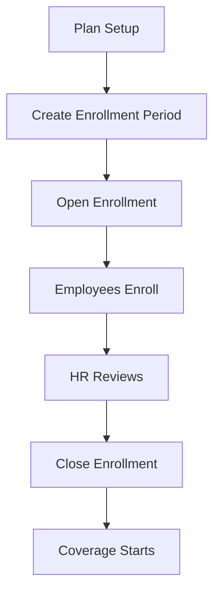

# Benefits Administration Guide

**Version**: 1.0  
**Last Updated**: 2025-12-08  
**Audience**: HR Benefits Administrators  
**Reading Time**: 35-40 minutes

---

## 📋 Overview

This guide explains how to administer employee benefit programs including health insurance, retirement plans, wellness programs, and expense reimbursements.

### What You'll Learn
- How to set up benefit plans with eligibility rules
- How to manage enrollment periods (open enrollment, new hire, life events)
- How to handle dependents and beneficiaries
- How to process reimbursements and healthcare claims
- Best practices for benefits administration

### Prerequisites
- Understanding of benefit plan types
- HR Benefits Administrator role
- Access to Total Rewards module

---

## 🎯 Section 1: Benefits Fundamentals

### 1.1 Benefit Plan Categories

| Category | Description | Examples | Typical Coverage |
|----------|-------------|----------|------------------|
| **MEDICAL** | Health insurance | Medical, hospitalization | Employee + Family |
| **DENTAL** | Dental care | Preventive, restorative | Employee + Family |
| **VISION** | Eye care | Exams, glasses, contacts | Employee + Family |
| **LIFE** | Life insurance | Term life, AD&D | Employee only |
| **DISABILITY** | Income protection | STD, LTD | Employee only |
| **RETIREMENT** | Retirement savings | 401(k), pension | Employee only |
| **WELLNESS** | Health programs | Gym, wellness coaching | Employee + Spouse |
| **PERK** | Lifestyle benefits | Commuter, meals | Employee only |

### 1.2 Coverage Tiers

```yaml
EMPLOYEE_ONLY:
  Who: Employee only
  Cost: Lowest
  Use: Life, Disability, Retirement

EMPLOYEE_SPOUSE:
  Who: Employee + Spouse/Partner
  Cost: Medium
  Use: Medical, Dental, Vision

EMPLOYEE_CHILDREN:
  Who: Employee + Children
  Cost: Medium-High
  Use: Medical, Dental, Vision

EMPLOYEE_FAMILY:
  Who: Employee + Spouse + Children
  Cost: Highest
  Use: Medical, Dental, Vision
```

### 1.3 Premium Cost Sharing

```yaml
EMPLOYEE:
  Employee pays: 100%
  Employer pays: 0%
  Example: Voluntary life insurance

EMPLOYER:
  Employee pays: 0%
  Employer pays: 100%
  Example: Basic life insurance

SHARED:
  Employee pays: 30%
  Employer pays: 70%
  Example: Medical insurance
```

---

## 🔧 Section 2: Plan Setup

### 2.1 Creating a Benefit Plan

**Step-by-Step**:

1. **Navigate**: Total Rewards → Benefits → Plans
2. **Click**: "New Benefit Plan"
3. **Basic Information**:
   ```yaml
   Code: MEDICAL_VN_2025
   Name: Vietnam Medical Insurance 2025
   Category: MEDICAL
   Provider: Bao Viet Insurance
   Sponsor: VNG Corporation
   Currency: VND
   ```

4. **Eligibility Rules**:
   ```yaml
   Employment Types: [FULL_TIME]
   Min Tenure: 3 months
   Grades: All
   Locations: [VN]
   Exclude Probation: Yes
   ```

5. **Coverage Options**:
   ```yaml
   Option 1: Employee Only
     Employee Cost: 500,000 VND/month
     Employer Cost: 1,500,000 VND/month
   
   Option 2: Employee + Family
     Employee Cost: 1,000,000 VND/month
     Employer Cost: 3,000,000 VND/month
   ```

6. **Effective Dates**:
   ```yaml
   Start: 2025-01-01
   End: 2025-12-31
   ```

### 2.2 Eligibility Profiles

**Using Shared Eligibility Profiles**:

```yaml
# Instead of defining eligibility in each plan,
# link to reusable profile

Profile: ELIG_FULL_TIME_3M
  Employment Types: [FULL_TIME]
  Min Tenure: 3 months
  Locations: [VN]

Plans Using This Profile:
  - Medical Insurance
  - Dental Insurance
  - Life Insurance
  - Retirement Plan
```

**Benefits**:
- ✅ Consistency across plans
- ✅ Easier to update (one place)
- ✅ Automatic membership updates

### 2.3 Plan Configuration Examples

**Medical Insurance (Vietnam)**:

```yaml
BenefitPlan:
  code: MEDICAL_VN_2025
  category: MEDICAL
  provider_name: "Bao Viet Insurance"
  eligibility_rule_json:
    employment_types: ["FULL_TIME"]
    min_tenure_months: 3
  coverage_options_json:
    options:
      - code: "EMP_ONLY"
        name: "Employee Only"
        cost_employee: 500000
        cost_employer: 1500000
      - code: "EMP_FAMILY"
        name: "Employee + Family"
        cost_employee: 1000000
        cost_employer: 3000000
  premium_type: SHARED
```

**Retirement Plan (401k)**:

```yaml
BenefitPlan:
  code: 401K_US_2025
  category: RETIREMENT
  provider_name: "Fidelity"
  eligibility_rule_json:
    employment_types: ["FULL_TIME"]
    min_tenure_months: 0  # Immediate
  coverage_options_json:
    options:
      - code: "TRADITIONAL"
        name: "Traditional 401(k)"
      - code: "ROTH"
        name: "Roth 401(k)"
  premium_type: EMPLOYEE
```

### 2.4 Configuring Benefit Options

**Coverage Tiers**:

```yaml
EMPLOYEE_ONLY:
  Description: Employee coverage only
  Typical Use: Life, Disability, Retirement
  Cost: Lowest
  
  Example:
    Plan: Basic Life Insurance
    Coverage: $50,000
    Employee Cost: 0 VND (employer-paid)
    Employer Cost: 50,000 VND/month

EMPLOYEE_SPOUSE:
  Description: Employee + Spouse/Domestic Partner
  Typical Use: Medical, Dental, Vision
  Cost: Medium
  
  Example:
    Plan: Medical Insurance
    Coverage: Employee + Spouse
    Employee Cost: 800,000 VND/month
    Employer Cost: 2,400,000 VND/month

EMPLOYEE_CHILDREN:
  Description: Employee + All Children
  Typical Use: Medical, Dental, Vision
  Cost: Medium-High
  
  Example:
    Plan: Dental Insurance
    Coverage: Employee + 2 Children
    Employee Cost: 600,000 VND/month
    Employer Cost: 1,800,000 VND/month

EMPLOYEE_FAMILY:
  Description: Employee + Spouse + All Children
  Typical Use: Medical, Dental, Vision
  Cost: Highest
  
  Example:
    Plan: Medical Insurance
    Coverage: Employee + Spouse + 2 Children
    Employee Cost: 1,200,000 VND/month
    Employer Cost: 3,600,000 VND/month
```

**Premium Calculation Methods**:

**Method 1: Fixed Premium**:

```yaml
# Simplest method - fixed cost per tier

BenefitOption:
  code: "MEDICAL_EMP_ONLY"
  coverage_tier: EMPLOYEE_ONLY
  cost_employee: 500,000 VND
  cost_employer: 1,500,000 VND
  total_premium: 2,000,000 VND
  
  # No formula needed, costs are fixed
```

**Method 2: Per-Dependent Formula**:

```yaml
# Cost increases with number of dependents

BenefitOption:
  code: "MEDICAL_FAMILY"
  coverage_tier: EMPLOYEE_FAMILY
  formula_json:
    base_cost: 2,000,000  # Employee
    per_spouse: 1,000,000
    per_child: 500,000
    employee_contribution_pct: 0.25
    employer_contribution_pct: 0.75

Calculation Example:
  Employee + Spouse + 2 Children:
    Base: 2,000,000
    Spouse: 1,000,000
    Children: 500,000 × 2 = 1,000,000
    Total: 4,000,000 VND
    
    Employee Pays: 4M × 25% = 1,000,000 VND
    Employer Pays: 4M × 75% = 3,000,000 VND
```

**Method 3: Age-Banded Premiums**:

```yaml
# Cost varies by employee age (common for life insurance)

BenefitOption:
  code: "LIFE_AGE_BANDED"
  formula_json:
    age_bands:
      - min_age: 18, max_age: 29, rate: 0.0005
      - min_age: 30, max_age: 39, rate: 0.0008
      - min_age: 40, max_age: 49, rate: 0.0015
      - min_age: 50, max_age: 59, rate: 0.0025
      - min_age: 60, max_age: 70, rate: 0.0040
    coverage_amount: 50000000  # 50M VND
    employee_contribution_pct: 0

Calculation Example:
  Employee Age 35:
    Rate: 0.0008
    Coverage: 50,000,000 VND
    Premium: 50M × 0.0008 = 40,000 VND/month
    Employee Pays: 0 (employer-paid)
    Employer Pays: 40,000 VND
```

**Method 4: Salary-Based Premiums**:

```yaml
# Cost based on employee salary (retirement plans)

BenefitOption:
  code: "401K_MATCH"
  formula_json:
    employee_contribution_pct: 0.06  # 6% of salary
    employer_match_pct: 0.50  # 50% match
    employer_match_max_pct: 0.03  # Up to 3% of salary

Calculation Example:
  Employee Salary: 50,000,000 VND/month
  
  Employee Contributes: 50M × 6% = 3,000,000 VND
  Employer Matches: 3M × 50% = 1,500,000 VND
  (Capped at 50M × 3% = 1,500,000 VND)
  
  Total Contribution: 4,500,000 VND/month
```

**Setting Up Options**:

```yaml
Step 1: Define Coverage Tiers
  - Determine which tiers to offer
  - Consider employee demographics
  - Review competitor offerings

Step 2: Calculate Costs
  - Get quotes from providers
  - Determine total premium
  - Decide employee/employer split

Step 3: Create Options in System
  Navigate: Benefits → Plans → [Select Plan] → Options
  
  For each tier:
    Code: MEDICAL_EMP_FAMILY
    Name: Employee + Family
    Coverage Tier: EMPLOYEE_FAMILY
    Employee Cost: 1,200,000 VND
    Employer Cost: 3,600,000 VND
    Currency: VND

Step 4: Configure Formulas (if needed)
  For dynamic pricing:
    Select: "Use Formula"
    Enter formula_json
    Test with sample employees

Step 5: Activate Options
  Review all options
  Test enrollment flow
  Activate for enrollment period
```

### 2.5 Plan Compliance and Regulations

**Vietnam Compliance**:

```yaml
Social Insurance (BHXH):
  Mandatory: Yes
  Coverage: All employees with 3+ month contracts
  Employer Contribution: 17.5% (SI) + 3% (HI) + 1% (UI)
  Employee Contribution: 8% (SI) + 1.5% (HI) + 1% (UI)
  Salary Cap: 36,000,000 VND/month (SI/HI)
  Salary Cap: 83,200,000 VND/month (UI)

Health Insurance (BHYT):
  Mandatory: Yes
  Coverage: All employees
  Rate: 4.5% of salary (3% employer, 1.5% employee)
  Benefits: Public healthcare access

Unemployment Insurance (BHTN):
  Mandatory: Yes
  Coverage: Vietnamese citizens only
  Rate: 2% of salary (1% employer, 1% employee)
  Max Benefit: 5 months of average salary
```

**US Compliance (ACA)**:

```yaml
Affordable Care Act:
  Employer Mandate: 50+ full-time employees
  Coverage Requirement: 95% of full-time employees
  Affordability: Premium ≤ 9.12% of household income
  Minimum Value: Plan covers ≥ 60% of costs
  
  Penalties:
    No Coverage: $2,970/employee/year (2024)
    Unaffordable: $4,460/employee/year

COBRA:
  Continuation Coverage: 18-36 months after termination
  Premium: 102% of total cost
  Qualifying Events: Termination, hours reduction, divorce, etc.

HIPAA:
  Privacy: Protect health information
  Portability: No pre-existing condition exclusions
  Special Enrollment: 30 days for life events
```

**GDPR/Data Privacy**:

```yaml
Personal Data Protection:
  - Dependent information (names, DOB, SSN)
  - Health information (claims, diagnoses)
  - Beneficiary details
  
  Requirements:
    ✅ Consent for data collection
    ✅ Encryption of sensitive data
    ✅ Access controls
    ✅ Data retention policies
    ✅ Right to be forgotten
    ✅ Breach notification (72 hours)

Best Practices:
  - Encrypt national IDs, SSNs
  - Mask data in reports
  - Audit access logs
  - Annual privacy training
  - Vendor data processing agreements
```

---

## 📅 Section 3: Enrollment Management

### 3.1 Enrollment Period Types

**Open Enrollment** (Annual):

```yaml
Purpose: Annual benefit selection/changes
Timing: November (for January coverage)
Duration: 3-4 weeks
Who: All eligible employees

Example:
  Code: OPEN_ENROLLMENT_2025
  Type: OPEN_ENROLLMENT
  Enrollment: 2024-11-01 to 2024-11-30
  Coverage: 2025-01-01 to 2025-12-31
  Auto-Enroll: No
```

**New Hire Enrollment**:

```yaml
Purpose: Benefits for new employees
Timing: Within 30 days of hire
Duration: 30 days from hire date
Who: New hires only

Example:
  Code: NEW_HIRE_2025_Q1
  Type: NEW_HIRE
  Enrollment: 2025-01-01 to 2025-03-31
  Coverage: Starts on hire date or 1st of month
  Auto-Enroll: Yes (default plans)
```

**Qualifying Life Event (QLE)**:

```yaml
Purpose: Mid-year changes due to life events
Timing: Within 30 days of event
Duration: 30 days from event date
Who: Employees with qualifying event

Qualifying Events:
  - Marriage
  - Divorce
  - Birth/Adoption
  - Death of dependent
  - Loss of other coverage
  - Change in employment status
```

### 3.2 Running Open Enrollment

**Workflow**:



**Step 1: Prepare Plans**

```yaml
Checklist:
  - [ ] Review/update all benefit plans
  - [ ] Confirm provider contracts
  - [ ] Update costs for new year
  - [ ] Review eligibility rules
  - [ ] Prepare communication materials
  - [ ] Train HR team
```

**Step 2: Create Enrollment Period**

```yaml
EnrollmentPeriod:
  code: "OPEN_ENROLLMENT_2025"
  name: "2025 Annual Open Enrollment"
  type: OPEN_ENROLLMENT
  enrollment_start: "2024-11-01"
  enrollment_end: "2024-11-30"
  coverage_start: "2025-01-01"
  coverage_end: "2025-12-31"
  eligible_plans: [ALL]
  reminder_schedule:
    - days_before_end: 14
    - days_before_end: 7
    - days_before_end: 1
  status: DRAFT
```

**Step 3: Open Enrollment**

- Change status: DRAFT → OPEN
- System sends notifications to all eligible employees
- Employees can access enrollment portal
- Reminders sent per schedule

**Step 4: Employee Enrollment**

```yaml
Employee Actions:
  1. Review current coverage
  2. Review available plans
  3. Add/remove dependents
  4. Select coverage options
  5. Review costs
  6. Submit enrollment
```

**Step 5: HR Review and Close**

```yaml
HR Tasks:
  - Monitor enrollment completion rate
  - Follow up with non-enrollees
  - Review dependent documentation
  - Verify eligibility
  - Close enrollment period
  - Generate enrollment reports
```

### 3.3 Life Event Enrollment

**Triggering a Life Event**:

```yaml
Step 1: Employee Reports Event
  Event Type: BIRTH
  Event Date: 2025-03-15
  Reported Date: 2025-03-20

Step 2: System Creates Life Event
  LifeEvent:
    employee_id: EMP_001
    event_type: BIRTH
    event_date: "2025-03-15"
    enrollment_deadline: "2025-04-14"  # 30 days
    status: PENDING

Step 3: Employee Uploads Documents
  Documents:
    - Birth Certificate (required)
  Status: PENDING → VERIFIED

Step 4: Special Enrollment Opens
  Employee can:
    - Add newborn as dependent
    - Upgrade coverage (EMP_ONLY → EMP_FAMILY)
    - Enroll in new plans

Step 5: Changes Effective
  Coverage starts: Event date (2025-03-15)
  Premium changes: Next payroll cycle
```

**Common Life Events**:

```yaml
MARRIAGE:
  Allows: Add spouse, change coverage tier
  Documents: Marriage certificate
  Effective: Event date

BIRTH/ADOPTION:
  Allows: Add child, change coverage tier
  Documents: Birth/adoption certificate
  Effective: Event date

DIVORCE:
  Allows: Remove spouse, change coverage tier
  Documents: Divorce decree
  Effective: Event date

DEATH_OF_DEPENDENT:
  Allows: Remove dependent, change coverage tier
  Documents: Death certificate
  Effective: Event date

LOSS_OF_COVERAGE:
  Allows: Enroll in employer plans
  Documents: Loss of coverage letter
  Effective: Loss date
```

### 3.4 Enrollment Decision Support

**Decision Support Tools**:

```yaml
Cost Comparison Tool:
  Purpose: Help employees compare total costs across options
  
  Example Output:
    Medical Insurance Options:
    
    Option 1: Employee Only
      Monthly Premium: 500,000 VND
      Annual Cost: 6,000,000 VND
      Coverage: You only
    
    Option 2: Employee + Family
      Monthly Premium: 1,200,000 VND
      Annual Cost: 14,400,000 VND
      Coverage: You + Spouse + 2 Children
      Additional Cost: 8,400,000 VND/year
      
    Recommendation: If family has medical needs, 
                    Option 2 saves money vs out-of-pocket
```

**Coverage Calculator**:

```yaml
Scenario Planning:
  Employee inputs:
    - Expected doctor visits: 4/year
    - Expected prescriptions: 12/year
    - Expected procedures: 1 (minor surgery)
  
  System calculates:
    Option 1 (High Deductible):
      Premium: 300,000 VND/month = 3,600,000/year
      Deductible: 5,000,000 VND
      Out-of-Pocket Max: 10,000,000 VND
      Estimated Total: 13,600,000 VND
    
    Option 2 (Low Deductible):
      Premium: 600,000 VND/month = 7,200,000/year
      Deductible: 1,000,000 VND
      Out-of-Pocket Max: 5,000,000 VND
      Estimated Total: 12,200,000 VND
    
    Recommendation: Option 2 saves 1,400,000 VND
```

**Life Event Impact Analysis**:

```yaml
Scenario: Employee Getting Married
  
  Current Coverage:
    Medical: Employee Only
    Cost: 500,000 VND/month
  
  After Marriage Options:
    Option A: Keep Employee Only
      Cost: 500,000 VND/month
      Spouse Coverage: None (must get own insurance)
    
    Option B: Upgrade to Employee + Spouse
      Cost: 800,000 VND/month
      Additional: 300,000 VND/month
      Spouse Coverage: Full medical
      
    Recommendation: If spouse has no other coverage,
                    Option B is cost-effective
```

### 3.5 Enrollment Reporting

**Enrollment Completion Report**:

```yaml
Open Enrollment 2025 - Status Report
Generated: 2024-11-25 (5 days before deadline)

Overall Status:
  Total Eligible: 500 employees
  Completed: 425 (85%)
  Pending: 75 (15%)
  Waived: 50 (10%)

By Department:
  Engineering:
    Eligible: 200
    Completed: 180 (90%)
    Pending: 20 (10%)
  
  Sales:
    Eligible: 150
    Completed: 120 (80%)
    Pending: 30 (20%) ⚠️ Below target
  
  Operations:
    Eligible: 150
    Completed: 125 (83%)
    Pending: 25 (17%)

Action Required:
  - Follow up with Sales department
  - Send final reminder to 75 pending employees
  - Deadline: 2024-11-30 (5 days)
```

**Plan Selection Report**:

```yaml
Medical Insurance - Plan Selection Summary

Total Enrollments: 450

By Coverage Tier:
  Employee Only: 180 (40%)
  Employee + Spouse: 120 (27%)
  Employee + Children: 80 (18%)
  Employee + Family: 70 (16%)

By Plan Option:
  Premium Plan: 200 (44%)
  Standard Plan: 180 (40%)
  Basic Plan: 70 (16%)

Cost Analysis:
  Total Monthly Premium: 900,000,000 VND
  Employee Contribution: 270,000,000 VND (30%)
  Employer Contribution: 630,000,000 VND (70%)
  
  Annual Cost: 10,800,000,000 VND
```

**Dependent Coverage Report**:

```yaml
Dependent Coverage Analysis

Total Dependents Covered: 320

By Relationship:
  Spouse: 150 (47%)
  Children: 160 (50%)
  Domestic Partner: 10 (3%)

By Age Group (Children):
  0-5 years: 40 (25%)
  6-12 years: 60 (38%)
  13-18 years: 40 (25%)
  19-26 years: 20 (13%)

Aging Out (Next 12 Months):
  Children turning 21: 5
  Children turning 26: 3
  Action: Notify employees 60 days before
```

**Waiver Report**:

```yaml
Coverage Waiver Analysis

Total Waivers: 50 employees

By Plan Category:
  Medical: 30 (60%)
  Dental: 40 (80%)
  Vision: 45 (90%)

Waiver Reasons:
  Covered by Spouse: 25 (50%)
  Government Coverage: 15 (30%)
  Private Insurance: 8 (16%)
  Other: 2 (4%)

Risk Analysis:
  - 30 employees waiving medical (monitor for adverse selection)
  - Ensure waiver forms signed
  - Verify alternative coverage documentation
```

---

## 👨‍👩‍👧‍👦 Section 4: Dependent Management

### 4.1 Adding Dependents

**Eligible Dependents**:

```yaml
SPOUSE:
  Relationship: Legal spouse
  Age Limit: None
  Documents: Marriage certificate
  Eligibility: Ongoing

DOMESTIC_PARTNER:
  Relationship: Registered partner
  Age Limit: None
  Documents: Partnership certificate
  Eligibility: Ongoing

CHILD:
  Relationship: Biological child
  Age Limit: 21 (VN), 26 (US)
  Documents: Birth certificate
  Eligibility: Until age limit

STEPCHILD:
  Relationship: Spouse's child
  Age Limit: 21 (VN), 26 (US)
  Documents: Birth cert + marriage cert
  Eligibility: Until age limit

ADOPTED_CHILD:
  Relationship: Legally adopted
  Age Limit: 21 (VN), 26 (US)
  Documents: Adoption papers
  Eligibility: Until age limit
```

**Student Extension**:

```yaml
# Children can remain eligible past age 21/26 if full-time student

Requirements:
  - Full-time student status
  - Proof of enrollment (each semester)
  - Age limit: 26 (extended)

Documents:
  - Enrollment verification
  - Student ID
  - School schedule
```

**Disabled Dependent**:

```yaml
# No age limit for disabled dependents

Requirements:
  - Disability certification
  - Dependent on employee for support
  - Annual recertification

Documents:
  - Medical certification
  - Disability determination letter
```

### 4.2 Dependent Verification

**Annual Verification**:

```yaml
Process:
  1. System flags dependents for verification
  2. Employee receives notification
  3. Employee uploads documents
  4. HR reviews and approves
  5. Ineligible dependents removed

Timeline:
  - Notification: 60 days before deadline
  - Reminder: 30 days before
  - Final reminder: 7 days before
  - Deadline: Typically December 31

Documents Required:
  - Birth certificates (children)
  - Marriage certificate (spouse)
  - School enrollment (students)
  - Disability certification (disabled)
```

### 4.3 Beneficiary Designation

**Life Insurance Beneficiaries**:

```yaml
PRIMARY Beneficiaries:
  - Must total 100%
  - Receive benefit if employee dies
  - Can be multiple people

Example:
  - Spouse: 100%
  OR
  - Spouse: 50%
  - Child 1: 25%
  - Child 2: 25%

CONTINGENT Beneficiaries:
  - Must total 100%
  - Receive if all PRIMARY deceased
  - Backup beneficiaries

Example:
  - Parent 1: 50%
  - Parent 2: 50%
```

**Irrevocable Beneficiaries**:

```yaml
# Cannot be changed without beneficiary consent

Use Cases:
  - Divorce settlements
  - Child support agreements
  - Estate planning

Restrictions:
  - Requires beneficiary signature to change
  - Typically court-ordered
```

---

## 💰 Section 5: Claims and Reimbursements

### 5.1 Reimbursement Types

**Medical Expense Reimbursement**:

```yaml
What: Out-of-pocket medical expenses
Examples:
  - Doctor visits
  - Prescriptions
  - Medical equipment
  - Therapy sessions

Limits:
  - Annual maximum: 10,000,000 VND
  - Per-claim maximum: 5,000,000 VND

Process:
  1. Employee pays provider
  2. Submits reimbursement request
  3. Attaches receipts
  4. Manager/HR approves
  5. Payment via payroll or bank transfer
```

**Wellness Reimbursement**:

```yaml
What: Wellness program expenses
Examples:
  - Gym membership
  - Fitness classes
  - Health coaching
  - Wellness apps

Limits:
  - Annual maximum: 3,000,000 VND
  - Requires pre-approval for >1M

Process:
  1. Employee enrolls in program
  2. Pays upfront
  3. Submits quarterly reimbursement
  4. Attaches proof of participation
  5. Payment processed
```

**Education Reimbursement**:

```yaml
What: Job-related education
Examples:
  - Certifications
  - Courses
  - Conferences
  - Books

Limits:
  - Annual maximum: 20,000,000 VND
  - Requires pre-approval
  - Repayment if leave within 1 year

Process:
  1. Employee requests pre-approval
  2. Manager approves
  3. Employee completes course
  4. Submits proof of completion
  5. Reimbursement processed
```

### 5.2 Healthcare Claims

**Claim Submission**:

```yaml
Step 1: Service Received
  Employee visits doctor/hospital
  Provider bills insurance company

Step 2: Claim Created
  HealthcareClaimHeader:
    employee_id: EMP_001
    enrollment_id: MEDICAL_ENROLLMENT
    service_date: "2025-03-15"
    provider_name: "Vinmec Hospital"
    amount: 50,000,000 VND
    status: SUBMITTED

Step 3: Claim Lines
  HealthcareClaimLine:
    - procedure_code: "99213"
      description: "Office visit"
      charge: 1,500,000 VND
    - procedure_code: "80053"
      description: "Blood test"
      charge: 800,000 VND

Step 4: Insurance Review
  Status: SUBMITTED → IN_REVIEW
  Insurer reviews claim
  Determines covered amount

Step 5: Approval
  Status: IN_REVIEW → APPROVED
  Approved Amount: 45,000,000 VND
  Employee Copay: 5,000,000 VND

Step 6: Payment
  Status: APPROVED → PAID
  Insurer pays provider: 45,000,000 VND
  Employee pays copay: 5,000,000 VND
```

**Claim Disputes**:

```yaml
Scenario: Claim rejected or partially approved

Employee Actions:
  1. Review rejection reason
  2. Gather additional documentation
  3. Submit appeal
  4. Status: REJECTED → APPEALED

HR Actions:
  1. Review appeal
  2. Contact insurance provider
  3. Provide additional evidence
  4. Follow up on resolution

Resolution:
  - Approved: Process payment
  - Denied: Explain to employee
  - Partial: Negotiate with provider
```

---

## 🔗 Section 6: Integration and Data Exchange

### 6.1 Payroll Integration

**Premium Deduction Flow**:

```yaml
Monthly Payroll Cycle:
  
  Step 1: Benefits System Exports Deductions
    File: benefits_deductions_202501.csv
    Format:
      employee_id, plan_code, deduction_amount, currency
      EMP_001, MEDICAL_FAMILY, 1200000, VND
      EMP_002, DENTAL_EMP, 200000, VND
  
  Step 2: Payroll System Imports
    - Validates employee IDs
    - Creates deduction records
    - Links to pay components
  
  Step 3: Payroll Processing
    - Deducts premiums from gross pay
    - Calculates tax impact (pre-tax vs post-tax)
    - Generates pay stubs
  
  Step 4: Reconciliation
    - Benefits system receives confirmation
    - Marks premiums as collected
    - Handles failed deductions
```

**Pre-Tax vs Post-Tax Benefits**:

```yaml
Pre-Tax Benefits (Section 125 - US):
  Plans: Medical, Dental, Vision, FSA, HSA
  Tax Treatment: Deducted before income tax
  
  Example:
    Gross Salary: 50,000,000 VND
    Medical Premium: 1,000,000 VND (pre-tax)
    Taxable Income: 49,000,000 VND
    Tax Savings: ~200,000 VND (at 20% rate)

Post-Tax Benefits:
  Plans: Supplemental Life, Disability (employee-paid)
  Tax Treatment: Deducted after income tax
  
  Example:
    Gross Salary: 50,000,000 VND
    Taxable Income: 50,000,000 VND
    After-Tax Deduction: 100,000 VND
```

**Employer Contribution Accounting**:

```yaml
Monthly Employer Cost:
  
  Medical Insurance:
    Employees Covered: 450
    Avg Employer Cost: 2,500,000 VND/employee
    Total: 1,125,000,000 VND
    GL Account: 6210 - Employee Benefits
  
  Retirement Match:
    Employees Participating: 300
    Avg Match: 1,500,000 VND/employee
    Total: 450,000,000 VND
    GL Account: 6220 - Retirement Benefits
  
  Total Monthly Cost: 1,575,000,000 VND
```

### 6.2 Insurance Provider Integration

**Enrollment File Export**:

```yaml
File Format: EDI 834 (US) or Custom CSV

Monthly Enrollment Changes:
  
  New Enrollments:
    employee_id, ssn, name, dob, coverage_tier, 
    effective_date, dependents
  
  Changes:
    employee_id, change_type, new_coverage_tier,
    effective_date, reason
  
  Terminations:
    employee_id, termination_date, reason
  
  Example:
    EMP_001, ADD, EMPLOYEE_FAMILY, 2025-01-01, BIRTH
    EMP_002, TERM, 2025-01-15, RESIGNATION
```

**Claims Data Import**:

```yaml
Weekly Claims Feed:
  
  File: claims_20250115.csv
  Format:
    claim_id, employee_id, service_date, provider,
    charge_amount, approved_amount, patient_responsibility
  
  Processing:
    1. Import to HealthcareClaimHeader/Line
    2. Match to enrollments
    3. Calculate employee copay
    4. Update claim status
    5. Notify employee
```

**Premium Billing Reconciliation**:

```yaml
Monthly Reconciliation:
  
  Provider Invoice:
    Total Premium Due: 900,000,000 VND
    Coverage Month: January 2025
  
  System Calculation:
    Total Enrollments: 450
    Total Premium: 900,000,000 VND
    
  Variance Analysis:
    Difference: 0 VND ✅
    
  If Variance:
    - Identify discrepancies
    - Check enrollment changes
    - Verify effective dates
    - Resolve with provider
```

### 6.3 HRIS Integration

**Employee Data Sync**:

```yaml
Daily Sync from Core HRIS:
  
  New Hires:
    - Trigger new hire enrollment
    - Create eligibility records
    - Send welcome email
  
  Job Changes:
    - Re-evaluate eligibility
    - Update coverage if needed
    - Notify employee of changes
  
  Terminations:
    - End coverage (last day of month)
    - Generate COBRA notice (US)
    - Calculate final premiums
  
  Life Events:
    - Marriage: Allow enrollment changes
    - Birth: Add dependent, upgrade coverage
    - Divorce: Remove spouse
```

**Dependent Verification Integration**:

```yaml
Annual Verification Process:
  
  Step 1: Export Dependent List
    File: dependents_for_verification.csv
    Includes: All active dependents
  
  Step 2: Third-Party Verification
    Provider: Verification vendor
    Process: Document review, age verification
  
  Step 3: Import Results
    File: verification_results.csv
    Status: VERIFIED, INELIGIBLE, PENDING
  
  Step 4: System Actions
    VERIFIED: No action
    INELIGIBLE: Remove from coverage, notify employee
    PENDING: Request additional documents
```

---

## ✅ Best Practices

### Plan Setup

**DO**:
- ✅ Review plans annually for competitiveness
- ✅ Use eligibility profiles for consistency
- ✅ Clearly define cost-sharing
- ✅ Document all plan rules
- ✅ Communicate changes early

**DON'T**:
- ❌ Change plans mid-year without cause
- ❌ Make eligibility too restrictive
- ❌ Forget to update provider information
- ❌ Ignore employee feedback

### Enrollment Management

**DO**:
- ✅ Start planning 3 months before open enrollment
- ✅ Send multiple reminders
- ✅ Provide decision support tools
- ✅ Offer enrollment assistance
- ✅ Follow up with non-enrollees

**DON'T**:
- ❌ Rush enrollment period (too short)
- ❌ Assume employees understand benefits
- ❌ Forget to verify dependent eligibility
- ❌ Miss enrollment deadlines

### Dependent Management

**DO**:
- ✅ Verify dependents annually
- ✅ Require documentation upfront
- ✅ Communicate age-out dates
- ✅ Handle student extensions properly
- ✅ Remove ineligible dependents promptly

**DON'T**:
- ❌ Skip verification (fraud risk)
- ❌ Forget to notify of age-out
- ❌ Allow coverage without documents
- ❌ Delay removal of ineligible dependents

---

## ⚠️ Common Pitfalls

### Pitfall 1: Missing Life Event Deadline

❌ **Wrong**:
```yaml
Employee reports birth on day 45
System: "Deadline was 30 days, too late"
Employee loses opportunity to add child
```

✅ **Correct**:
```yaml
System sends reminders:
  - Day 15: "You have 15 days left"
  - Day 25: "You have 5 days left"
  - Day 29: "Last day to enroll!"
Employee enrolls on day 28
```

### Pitfall 2: Dependent Age-Out

❌ **Wrong**:
```yaml
Child turns 21 on March 15
Coverage continues until December 31
Overpayment of premiums
```

✅ **Correct**:
```yaml
System flags child turning 21
Sends notification 60 days before
Coverage ends on 21st birthday
Premium adjusted automatically
```

---

## 🎓 Quick Reference

### Checklist: Open Enrollment

- [ ] Review/update all plans (3 months before)
- [ ] Confirm provider contracts
- [ ] Update costs and coverage
- [ ] Create enrollment period
- [ ] Prepare communication materials
- [ ] Train HR team
- [ ] Open enrollment (4 weeks)
- [ ] Send reminders (14, 7, 1 days before end)
- [ ] Monitor completion rate
- [ ] Follow up with non-enrollees
- [ ] Verify dependent documentation
- [ ] Close enrollment
- [ ] Generate reports
- [ ] Communicate confirmations

### Checklist: Life Event Processing

- [ ] Employee reports event
- [ ] Create life event record
- [ ] Request supporting documents
- [ ] Verify documents
- [ ] Approve life event
- [ ] Open special enrollment (30 days)
- [ ] Employee makes changes
- [ ] Review changes
- [ ] Update coverage
- [ ] Adjust premiums
- [ ] Communicate confirmation

### Key Timelines

```yaml
Open Enrollment:
  Planning: 3 months before
  Duration: 3-4 weeks
  Coverage Start: January 1

New Hire:
  Enrollment Window: 30 days from hire
  Coverage Start: Hire date or 1st of month

Life Event:
  Reporting Deadline: 30 days from event
  Enrollment Window: 30 days from report
  Coverage Start: Event date (retroactive)

Dependent Verification:
  Frequency: Annual
  Notification: 60 days before deadline
  Deadline: December 31
```

---

## 📚 Related Guides

- [Eligibility Rules Guide](./09-eligibility-rules-guide.md) - Defining plan eligibility
- [Tax Compliance Guide](./07-tax-compliance-guide.md) - Tax treatment of benefits

---

## 📖 Additional Resources

### Glossary References
- [Benefits Glossary](../00-ontology/glossary-benefits.md) - Detailed entity definitions

---

**Document Version**: 1.0  
**Created**: 2025-12-08  
**Last Review**: 2025-12-08  
**Next Review**: 2026-01-08
