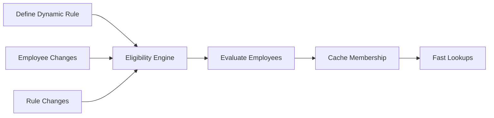

# Eligibility Rules Guide

**Version**: 2.1  
**Last Updated**: 2025-12-11  
**Module**: Total Rewards (TR)  
**Status**: 🔄 Migrating to Core Eligibility Architecture

---

> [!IMPORTANT]
> **Migration to Core Eligibility Engine (v2.1+)**
> 
> As of version 2.1, TR module is migrating from its own eligibility implementation to the **centralized Core Eligibility Engine**. This guide is being updated to reflect the new architecture.
> 
> **Key Changes**:
> - TR-specific `EligibilityProfile` → **DEPRECATED** - Use `Core.EligibilityProfile`
> - `eligibility_rule_json` fields → **DEPRECATED** - Use `default_eligibility_profile_id`
> - New **Hybrid Model**: Default eligibility at plan level + Override at option/tier level
> 
> **Primary Reference**: See [Core Eligibility Engine Guide](../../CO/01-concept/11-eligibility-engine-guide.md) for complete architecture documentation.

---
**Audience**: HR Administrators, System Administrators  
**Reading Time**: 20-25 minutes

---

## 📋 Overview

This guide explains how to use the **Eligibility Engine** to define who is eligible for benefits, absence policies, compensation plans, and other HR programs.

### What You'll Learn
- How the Eligibility Engine works (Dynamic Rules + Cached Membership)
- How to define eligibility rules using criteria builder
- How to manage and monitor membership
- How eligibility integrates with Benefits, Absence, and Compensation modules
- Best practices for rule design and maintenance

### Prerequisites
- Understanding of organizational structure (grades, departments, locations)
- HR Administrator or System Administrator role
- Access to Total Rewards or Time & Attendance modules

---

## 🎯 Section 1: Eligibility Engine Concepts

### 1.1 What is Eligibility?

**Eligibility** determines which employees qualify for specific HR programs, policies, or benefits.

**Examples**:
- Who can enroll in the Premium Health Plan?
- Who gets 15 days of annual leave vs 12 days?
- Who is eligible for Sales Commission?
- Who can access the Executive Dining Room?

**Traditional Approach** (Manual Assignment):
```yaml
❌ Old Way:
  - HR manually assigns each employee to benefit plans
  - Risk of forgetting to assign new hires
  - Hard to maintain as organization changes
  - No audit trail of "why" someone is eligible
```

**xTalent Approach** (Eligibility Engine):
```yaml
✅ New Way:
  - Define rules once: "All Sales Staff in Vietnam"
  - System automatically evaluates and assigns
  - Self-maintaining as employees change roles
  - Complete audit trail
```

### 1.2 The Hybrid Model

xTalent uses a **Hybrid Eligibility Model** combining the best of both worlds:



**Two Components**:

1. **EligibilityProfile** (The Rule Definition)
   - Defines WHO is eligible using dynamic criteria
   - Examples: "Grade G3+", "Sales Department", "Vietnam Location"
   - Stored as flexible JSON rules

2. **EligibilityMember** (The Cached Membership)
   - Stores the RESULT of rule evaluation
   - Lists which employees currently match the rule
   - Optimized for ultra-fast lookups (O(1) performance)

**Why Hybrid?**

| Aspect | Pure Dynamic | Pure Manual | Hybrid (xTalent) |
|--------|-------------|-------------|------------------|
| **Performance** | ❌ Slow (evaluate every time) | ✅ Fast | ✅ Fast (cached) |
| **Maintenance** | ✅ Zero (auto) | ❌ High (manual) | ✅ Low (auto) |
| **Flexibility** | ✅ Very flexible | ❌ Rigid | ✅ Very flexible |
| **Auditability** | ❌ Hard ("who was eligible yesterday?") | ✅ Easy | ✅ Easy (timestamped) |
| **Real-time** | ✅ Always current | ❌ Delayed | ✅ Near real-time (event-driven) |

### 1.3 How It Works

**Step-by-Step Flow**:

```yaml
1. Admin Creates Rule:
   Profile: "Sales Commission Eligibility"
   Rule: department = "Sales" AND employment_type = "Full-Time"

2. Eligibility Engine Evaluates:
   - Scans all employees
   - Checks who matches the rule
   - Finds: Employee A, Employee B, Employee C

3. System Caches Membership:
   EligibilityMember:
     - Employee A → Sales Commission Eligibility [Start: 2025-01-01]
     - Employee B → Sales Commission Eligibility [Start: 2025-01-01]
     - Employee C → Sales Commission Eligibility [Start: 2025-01-01]

4. When Employee D Joins Sales:
   - Event triggered: "Employee D changed department"
   - Engine re-evaluates Employee D
   - Adds to membership: Employee D → Sales Commission [Start: 2025-03-15]

5. When Checking Eligibility (e.g., in Payroll):
   - Query: "Is Employee A eligible for Sales Commission?"
   - Lookup in EligibilityMember table
   - Answer: Yes (O(1) performance, instant)
```

**Evaluation Triggers**:

The Eligibility Engine re-evaluates automatically when:

| Trigger | Example | Action |
|---------|---------|--------|
| **Employee Change** | Promotion, transfer, hire | Re-evaluate that employee |
| **Rule Change** | Admin updates criteria | Re-evaluate all employees for that rule |
| **Scheduled Sync** | Nightly batch job | Re-evaluate all (catch-all) |
| **Manual Refresh** | Admin clicks "Recalculate" | Re-evaluate on demand |

### 1.4 Key Entities

**EligibilityProfile**:
```yaml
Definition: The rule that defines eligibility criteria
Attributes:
  - code: Unique identifier (e.g., ELIG_PREMIUM_HEALTH)
  - name: Display name
  - domain: Which module uses this (BENEFITS, ABSENCE, COMPENSATION)
  - rule_json: The dynamic criteria
  - is_active: Whether rule is currently in use

Example:
  code: "ELIG_SENIOR_LEAVE"
  name: "Senior Employee Leave Eligibility"
  domain: ABSENCE
  rule_json:
    min_tenure_months: 36  # 3 years
    grades: ["G4", "G5", "M3", "M4", "M5"]
  is_active: true
```

**EligibilityMember**:
```yaml
Definition: Cached list of employees who match a profile
Attributes:
  - profile_id: FK to EligibilityProfile
  - employee_id: FK to Employee
  - start_date: When eligibility began
  - end_date: When eligibility ended (NULL if active)
  - last_evaluated_at: Last evaluation timestamp

Example:
  profile_id: "ELIG_SENIOR_LEAVE_UUID"
  employee_id: "EMP_001_UUID"
  start_date: "2025-01-01"
  end_date: null  # Still eligible
  last_evaluated_at: "2025-12-08 10:00:00"
```

---

## 🔧 Section 2: Defining Eligibility Rules

### 2.1 Rule Criteria Builder

**Available Criteria**:

| Criterion | Type | Example | Use Case |
|-----------|------|---------|----------|
| **grades** | List | `["G3", "G4", "G5"]` | Grade-based eligibility |
| **job_levels** | List | `[3, 4, 5]` | Level-based (alternative to grades) |
| **employment_types** | List | `["FULL_TIME"]` | Exclude contractors/interns |
| **locations** | List | `["VN", "SG"]` | Country-specific benefits |
| **departments** | List | `["Sales", "Marketing"]` | Department-specific programs |
| **business_units** | List | `["BU_TECH_UUID"]` | BU-specific policies |
| **min_tenure_months** | Integer | `6` | Minimum service requirement |
| **max_tenure_months** | Integer | `36` | Probation or temporary programs |
| **performance_rating** | Enum | `["EXCEEDS", "OUTSTANDING"]` | Performance-based rewards |
| **age_min** | Integer | `18` | Age restrictions |
| **age_max** | Integer | `65` | Age-based benefits |
| **custom_rules** | Array | Complex logic | Advanced scenarios |

### 2.2 Creating Simple Rules

**Example 1: Full-Time Employees in Vietnam**

```yaml
Use Case: Vietnam Medical Insurance
Profile:
  code: "ELIG_VN_MEDICAL"
  name: "Vietnam Medical Insurance Eligibility"
  domain: BENEFITS
  rule_json:
    employment_types: ["FULL_TIME"]
    locations: ["VN"]
    min_tenure_months: 3

Result: All full-time employees in Vietnam with 3+ months tenure
```

**Example 2: Senior Staff Leave**

```yaml
Use Case: 15 Days Annual Leave (vs 12 for juniors)
Profile:
  code: "ELIG_SENIOR_LEAVE"
  name: "Senior Employee Leave"
  domain: ABSENCE
  rule_json:
    grades: ["G4", "G5", "M3", "M4", "M5"]
    employment_types: ["FULL_TIME"]

Result: All full-time employees in senior grades
```

**Example 3: Sales Commission**

```yaml
Use Case: Sales Commission Plan
Profile:
  code: "ELIG_SALES_COMMISSION"
  name: "Sales Commission Eligibility"
  domain: COMPENSATION
  rule_json:
    departments: ["Sales"]
    employment_types: ["FULL_TIME"]
    min_tenure_months: 1

Result: Sales staff with 1+ month tenure
```

### 2.3 Advanced Rules with Logical Operators

**AND Logic** (All conditions must be true):

```yaml
Example: Executive Dining Room Access
Profile:
  code: "ELIG_EXEC_DINING"
  name: "Executive Dining Room"
  domain: CORE
  rule_json:
    grades: ["M4", "M5"]  # AND
    locations: ["VN"]     # AND
    business_units: ["BU_HQ_UUID"]  # AND

Result: Only M4/M5 in Vietnam HQ
```

**OR Logic** (Using multiple profiles):

```yaml
# Instead of complex OR in one rule, create separate profiles

Profile 1: High Performers
  code: "ELIG_BONUS_HIGH_PERF"
  rule_json:
    performance_rating: ["EXCEEDS", "OUTSTANDING"]

Profile 2: Critical Roles
  code: "ELIG_BONUS_CRITICAL"
  rule_json:
    job_codes: ["SOFT_ENG_SENIOR", "DATA_SCIENTIST"]

# Link both profiles to the same bonus plan
# Result: High performers OR critical roles get bonus
```

**Custom Rules** (Complex Logic):

```yaml
Example: Maternity Leave (Female + Tenure)
Profile:
  code: "ELIG_MATERNITY"
  name: "Maternity Leave Eligibility"
  domain: ABSENCE
  rule_json:
    min_tenure_months: 12
    custom_rules:
      - field: "gender"
        operator: "="
        value: "F"
      - field: "employment_type"
        operator: "IN"
        value: ["FULL_TIME", "PART_TIME"]

Result: Female employees with 12+ months tenure
```

### 2.4 Rule Testing

**Before Activating a Rule**:

1. **Preview Membership**:
   ```yaml
   Action: Click "Preview" button
   System Shows:
     - Total employees matching: 45
     - Sample list: Employee A, Employee B, ...
     - Breakdown by department, location, grade
   ```

2. **Dry Run**:
   ```yaml
   Action: Click "Test Evaluation"
   System Simulates:
     - Evaluates all employees
     - Shows who would be added/removed
     - Highlights unexpected results
   ```

3. **Validate Edge Cases**:
   ```yaml
   Test Cases:
     ✅ New hire on day 1 (should not match if min_tenure > 0)
     ✅ Employee on probation (check employment_type)
     ✅ Transferred employee (check new department)
     ✅ Promoted employee (check new grade)
   ```

---

## 💼 Section 3: Managing Membership

### 3.1 Viewing Current Membership

**Navigate**: Eligibility → Profiles → [Select Profile] → Members

**View Options**:

```yaml
Current Members (Active):
  - Employee A (Start: 2025-01-01, Status: Active)
  - Employee B (Start: 2025-02-15, Status: Active)
  - Employee C (Start: 2024-06-01, Status: Active)
  Total: 45 active members

Historical Members (Ended):
  - Employee D (Start: 2024-01-01, End: 2024-12-31, Reason: Transferred)
  - Employee E (Start: 2023-01-01, End: 2024-06-30, Reason: Resigned)

Filters:
  - By Department
  - By Location
  - By Grade
  - By Start Date
```

### 3.2 Manual Overrides (Exceptions)

**When to Use**:
- Executive decision to include/exclude specific employee
- Temporary exception for special case
- Grandfathering (employee keeps eligibility after rule change)

**How to Override**:

```yaml
Scenario: CEO wants to include Employee X in Executive Program
  even though they don't meet grade requirement

Action:
  1. Navigate to Profile: "ELIG_EXEC_PROGRAM"
  2. Click "Add Exception"
  3. Select Employee: Employee X
  4. Reason: "CEO Approval - High Potential"
  5. Effective Date: 2025-01-01
  6. Expiration: 2025-12-31 (or NULL for permanent)

Result:
  - Employee X added to EligibilityMember
  - Marked as "MANUAL_OVERRIDE" (not auto-evaluated)
  - Will NOT be removed by rule changes
  - Requires manual removal
```

**Best Practices for Overrides**:
- ✅ DO: Document reason clearly
- ✅ DO: Set expiration date when possible
- ✅ DO: Review overrides quarterly
- ❌ DON'T: Use overrides as primary method (defeats purpose)
- ❌ DON'T: Create too many exceptions (fix the rule instead)

### 3.3 Recalculation

**Automatic Recalculation**:

```yaml
Triggered By:
  1. Employee Data Change:
     - Promotion (grade change)
     - Transfer (department/location change)
     - Hire/Termination
     - Tenure milestone (e.g., 6 months)
  
  2. Rule Change:
     - Admin updates rule_json
     - Admin activates/deactivates profile
  
  3. Scheduled Job:
     - Nightly sync (default: 2:00 AM)
     - Catches any missed events
```

**Manual Recalculation**:

```yaml
When to Use:
  - After bulk employee import
  - After fixing data quality issues
  - Testing new rule changes
  - Troubleshooting eligibility issues

How to Trigger:
  1. Navigate to Profile
  2. Click "Recalculate Membership"
  3. Confirm action
  4. System queues evaluation job
  5. Monitor progress in Job Status

Result:
  - All employees re-evaluated
  - Membership updated
  - Audit log created
```

### 3.4 Audit Trail

**Tracking Changes**:

```yaml
Audit Log Example:
  Employee: Nguyen Van A
  Profile: ELIG_SENIOR_LEAVE
  
  History:
    - 2025-01-01: ADDED (Reason: Promoted to G4)
    - 2025-06-15: REMOVED (Reason: Transferred to contractor)
    - 2025-09-01: ADDED (Reason: Converted back to full-time)

  Details:
    - Who made change: System (auto) or Admin (manual)
    - What changed: Grade G3→G4, Employment Type FT→CT→FT
    - When: Timestamps for each change
```

**Reporting**:

```yaml
Common Reports:
  1. Membership Changes (Last 30 Days):
     - Who was added
     - Who was removed
     - Reasons for changes
  
  2. Current Membership Breakdown:
     - By department
     - By location
     - By grade
  
  3. Override Report:
     - All manual overrides
     - Expiring overrides (next 30 days)
     - Overrides by approver
```

---

## 🔗 Section 4: Integration with Modules

### 4.1 Benefits Integration

**How It Works**:

```yaml
Benefit Plan Setup:
  Plan: Premium Health Insurance
  Eligibility Profile: ELIG_PREMIUM_HEALTH
  
  Profile Rule:
    grades: ["G4", "G5", "M3", "M4", "M5"]
    employment_types: ["FULL_TIME"]
    locations: ["VN", "SG"]

Employee Experience:
  1. Employee A (G4, Full-Time, Vietnam) logs in
  2. Opens Benefits Enrollment
  3. System queries: "What profiles does Employee A belong to?"
  4. Finds: ELIG_PREMIUM_HEALTH (via EligibilityMember)
  5. Shows: Premium Health Insurance plan
  6. Employee can enroll
```

**Multiple Plans**:

```yaml
Employee B (G2, Full-Time, Vietnam):
  Eligible For:
    - Basic Health Insurance (ELIG_BASIC_HEALTH)
    - Dental Insurance (ELIG_DENTAL_ALL)
    - Life Insurance (ELIG_LIFE_ALL)
  
  NOT Eligible For:
    - Premium Health Insurance (requires G4+)
    - Executive Physical Exam (requires M3+)

UI Shows:
  ✅ Available Plans (3)
  ❌ Not Eligible Plans (2) - grayed out with reason
```

### 4.2 Absence Integration

**Leave Policy Eligibility**:

```yaml
Leave Policy: Senior Annual Leave (15 days)
Eligibility Profile: ELIG_SENIOR_LEAVE

Profile Rule:
  min_tenure_months: 36  # 3 years
  grades: ["G4", "G5", "M3", "M4", "M5"]

Leave Policy: Standard Annual Leave (12 days)
Eligibility Profile: ELIG_STANDARD_LEAVE

Profile Rule:
  employment_types: ["FULL_TIME"]
  # No grade restriction (everyone eligible)

Employee Scenario:
  Employee C:
    - Tenure: 40 months
    - Grade: G5
    - Eligible For: ELIG_SENIOR_LEAVE ✅
    - Gets: 15 days annual leave
  
  Employee D:
    - Tenure: 10 months
    - Grade: G3
    - Eligible For: ELIG_STANDARD_LEAVE ✅
    - Gets: 12 days annual leave
```

**Absence Request Validation**:

```yaml
When Employee Requests Leave:
  1. System checks: "Is employee eligible for this leave type?"
  2. Queries EligibilityMember for leave policy's profile
  3. If found: Allow request
  4. If not found: Block with message "Not eligible for this leave type"
```

### 4.3 Compensation Integration

**Variable Pay Eligibility**:

```yaml
Bonus Plan: Annual STI
Eligibility Profile: ELIG_STI_2025

Profile Rule:
  employment_types: ["FULL_TIME"]
  min_tenure_months: 6
  performance_rating: ["MEETS", "EXCEEDS", "OUTSTANDING"]
  # Excludes: Contractors, new hires <6mo, poor performers

Bonus Allocation:
  - System queries EligibilityMember
  - Gets list of eligible employees
  - Manager proposes bonus amounts
  - Only eligible employees can receive bonus
```

**Commission Plans**:

```yaml
Commission Plan: Sales Commission
Eligibility Profile: ELIG_SALES_COMMISSION

Profile Rule:
  departments: ["Sales"]
  employment_types: ["FULL_TIME"]
  min_tenure_months: 1

Payroll Integration:
  - Payroll runs monthly
  - Queries: "Who is eligible for sales commission?"
  - Reads EligibilityMember (fast lookup)
  - Calculates commission for eligible employees only
```

### 4.4 Cross-Module Scenarios

**Scenario 1: New Hire Onboarding**

```yaml
Day 1 (Hire Date):
  - Employee E hired as G3, Full-Time, Sales, Vietnam
  - Eligibility Engine evaluates Employee E
  - Adds to:
    ✅ ELIG_BASIC_HEALTH (immediate)
    ✅ ELIG_STANDARD_LEAVE (immediate)
    ❌ ELIG_SALES_COMMISSION (requires 1 month tenure)
  
  Employee E Can:
    - Enroll in Basic Health Insurance
    - Request annual leave (12 days)
    - Cannot receive commission yet

Day 30 (1 Month Tenure):
  - Nightly job detects tenure milestone
  - Re-evaluates Employee E
  - Adds to:
    ✅ ELIG_SALES_COMMISSION
  
  Employee E Can Now:
    - Receive sales commission
```

**Scenario 2: Promotion**

```yaml
Before Promotion:
  Employee F: G3, 2 years tenure
  Eligible For:
    - ELIG_BASIC_HEALTH
    - ELIG_STANDARD_LEAVE (12 days)
    - ELIG_SALES_COMMISSION

After Promotion to G4:
  - Event: "Employee F promoted to G4"
  - Eligibility Engine re-evaluates
  - Adds to:
    ✅ ELIG_PREMIUM_HEALTH (new)
    ✅ ELIG_SENIOR_LEAVE (new - 15 days)
  - Removes from:
    ❌ ELIG_BASIC_HEALTH (no longer needed)
  
  Employee F Can Now:
    - Enroll in Premium Health (upgrade)
    - Get 15 days leave (vs 12)
    - Keep sales commission
```

**Scenario 3: Transfer**

```yaml
Transfer: Employee G moves from Sales to Engineering
  
  Before:
    Department: Sales
    Eligible For:
      - ELIG_SALES_COMMISSION ✅
      - ELIG_BASIC_HEALTH ✅
  
  After:
    Department: Engineering
    Eligible For:
      - ELIG_BASIC_HEALTH ✅ (unchanged)
      - ELIG_SALES_COMMISSION ❌ (removed)
  
  Impact:
    - Commission stops from transfer date
    - Health insurance continues (not department-specific)
    - Audit log shows removal reason: "Department change"
```

---

## ✅ Best Practices

### 5.1 Rule Design

**DO**:
- ✅ Keep rules simple and understandable
- ✅ Use descriptive profile codes and names
- ✅ Test rules before activating
- ✅ Document business rationale in description
- ✅ Review rules annually for relevance
- ✅ Use consistent criteria across similar programs

**DON'T**:
- ❌ Create overly complex rules (split into multiple profiles)
- ❌ Use custom_rules unless absolutely necessary
- ❌ Hardcode employee IDs in rules (use overrides instead)
- ❌ Create duplicate rules for same population
- ❌ Forget to set effective dates

### 5.2 Performance Optimization

**DO**:
- ✅ Use indexed fields (grade, department, location)
- ✅ Rely on cached membership for lookups
- ✅ Schedule recalculation during off-hours
- ✅ Monitor evaluation job performance

**DON'T**:
- ❌ Query rule_json directly in real-time
- ❌ Trigger manual recalculation during business hours
- ❌ Create too many profiles (consolidate when possible)

### 5.3 Governance

**Approval Process**:

```yaml
Recommended Workflow:
  1. HR Analyst: Creates draft profile
  2. HR Manager: Reviews and approves rule logic
  3. System Admin: Activates profile
  4. Compliance: Audits quarterly

Change Control:
  - Document reason for rule changes
  - Notify affected employees of eligibility changes
  - Grandfather existing members when appropriate
```

**Regular Reviews**:

```yaml
Quarterly Review Checklist:
  - [ ] Review all active profiles
  - [ ] Check for unused profiles (deactivate)
  - [ ] Review manual overrides (remove expired)
  - [ ] Validate membership counts (spot check)
  - [ ] Update rules based on policy changes
  - [ ] Document any changes made
```

---

## ⚠️ Common Pitfalls

### Pitfall 1: Too Many Manual Overrides

❌ **Wrong**:
```yaml
Profile: ELIG_EXEC_PROGRAM
Rule: grades = ["M5"]
Manual Overrides: 50 employees (mostly M4)

# Defeats purpose of dynamic rules!
```

✅ **Correct**:
```yaml
# Fix the rule instead
Profile: ELIG_EXEC_PROGRAM
Rule: grades = ["M4", "M5"]
Manual Overrides: 2 employees (special cases only)
```

### Pitfall 2: Forgetting Tenure Requirements

❌ **Wrong**:
```yaml
# New hires immediately eligible for everything
Profile: ELIG_PREMIUM_HEALTH
Rule:
  grades: ["G4", "G5"]
  # Missing: min_tenure_months

Result: New hire on day 1 gets premium health
```

✅ **Correct**:
```yaml
Profile: ELIG_PREMIUM_HEALTH
Rule:
  grades: ["G4", "G5"]
  min_tenure_months: 3  # Probation period
```

### Pitfall 3: Not Testing Before Activation

❌ **Wrong**:
```yaml
1. Create rule
2. Activate immediately
3. Discover 500 employees suddenly eligible
4. Panic!
```

✅ **Correct**:
```yaml
1. Create rule
2. Preview membership (expect ~50)
3. Test evaluation
4. Review sample employees
5. Activate with confidence
```

### Pitfall 4: Ignoring Audit Trail

❌ **Wrong**:
```yaml
Employee: "Why did my leave days change from 15 to 12?"
HR: "I don't know, let me check..."
# No visibility into eligibility changes
```

✅ **Correct**:
```yaml
Employee: "Why did my leave days change?"
HR: Checks Audit Log
  - 2025-06-15: Removed from ELIG_SENIOR_LEAVE
  - Reason: Grade changed from G4 to G3 (demotion)
  - Triggered by: Assignment update
HR: "You were demoted to G3, which has 12 days leave"
```

---

## 🎓 Quick Reference

### Checklist: Creating New Eligibility Profile

- [ ] Define business requirement clearly
- [ ] Choose appropriate domain (BENEFITS, ABSENCE, COMPENSATION)
- [ ] Design rule criteria (grades, departments, tenure, etc.)
- [ ] Create profile with descriptive code/name
- [ ] Enter rule_json
- [ ] Preview membership (validate count)
- [ ] Test evaluation (check edge cases)
- [ ] Document business rationale
- [ ] Get approval from stakeholders
- [ ] Activate profile
- [ ] Link to relevant plans/policies
- [ ] Monitor first evaluation results
- [ ] Communicate to affected employees

### Checklist: Quarterly Eligibility Review

- [ ] Review all active profiles
- [ ] Identify unused profiles (deactivate)
- [ ] Check manual overrides (remove expired)
- [ ] Validate membership counts
- [ ] Spot-check sample employees
- [ ] Review evaluation job performance
- [ ] Update rules based on policy changes
- [ ] Document review findings
- [ ] Plan rule improvements for next quarter

### Common Rule Patterns

```yaml
# Pattern 1: Grade-Based
rule_json:
  grades: ["G4", "G5"]
  employment_types: ["FULL_TIME"]

# Pattern 2: Tenure-Based
rule_json:
  min_tenure_months: 12
  employment_types: ["FULL_TIME"]

# Pattern 3: Department-Based
rule_json:
  departments: ["Sales", "Marketing"]
  employment_types: ["FULL_TIME"]

# Pattern 4: Location-Based
rule_json:
  locations: ["VN"]
  employment_types: ["FULL_TIME"]

# Pattern 5: Combined
rule_json:
  grades: ["G3", "G4", "G5"]
  locations: ["VN", "SG"]
  min_tenure_months: 6
  employment_types: ["FULL_TIME"]
```

---

## 📚 Related Guides

- [Compensation Management Guide](./01-compensation-management-guide.md) - Compensation plans and cycles
- [Benefits Administration Guide](./03-benefits-administration-guide.md) - Benefit plan setup
- [Variable Pay Guide](./02-variable-pay-guide.md) - Bonus and commission eligibility

---

## 📖 Additional Resources

### Technical Documentation
- Core Ontology - EligibilityProfile and EligibilityMember entities
- [Eligibility Strategy ADR](../../eligibility-strategy.md) - Architecture decision record

### Support
- For questions: [support@xtalent.com]
- For feedback: [docs@xtalent.com]

---

**Document Version**: 1.0  
**Created**: 2025-12-08  
**Last Review**: 2025-12-08  
**Next Review**: 2026-01-08
