# Total Rewards Module - Conceptual Guide

> **Module**: Total Rewards (TR)  
> **Version**: 1.0  
> **Last Updated**: 2026-01-06

---

## Mục lục

1. [Compensation Structure](#1-compensation-structure)
2. [Job Architecture](#2-job-architecture)
3. [Policy & Cycles](#3-policy--cycles)
4. [Incentive Programs](#4-incentive-programs)
5. [Benefits Administration](#5-benefits-administration)
6. [Offer Management](#6-offer-management)
7. [Calculation Rules](#7-calculation-rules)
8. [Best Practices](#8-best-practices)

---

## 1. Compensation Structure

### 1.1 Tổng quan

Compensation Structure định nghĩa cách tổ chức lương cho doanh nghiệp:

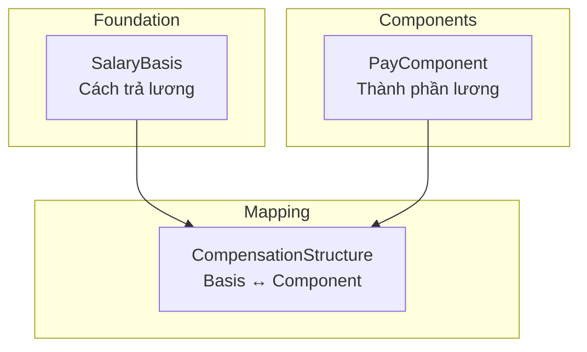

### 1.2 SalaryBasis

**Định nghĩa**: Cách trả lương (monthly, hourly, annual) và currency.

| Frequency | Period | Phổ biến tại |
|-----------|--------|--------------| 
| MONTHLY | 30 days | Vietnam, EU, APAC |
| HOURLY | Per hour | US, Retail |
| ANNUAL | 365 days | Executive |

**Lifecycle:**
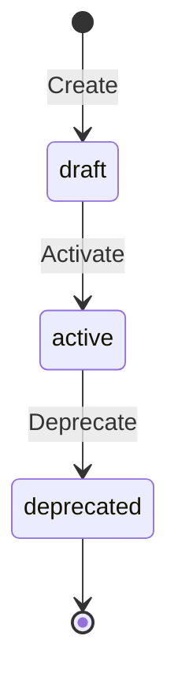

**Key Attributes:**

| Attribute | Mô tả | Ví dụ |
|-----------|-------|-------|
| code | Unique identifier | LUONG_THANG_VN |
| frequency | Pay frequency | MONTHLY |
| currency | ISO 4217 | VND |
| allowComponents | Có components? | true |

### 1.3 PayComponent

**Định nghĩa**: Building blocks của compensation - lương cơ bản, phụ cấp, thưởng.

**Component Types:**

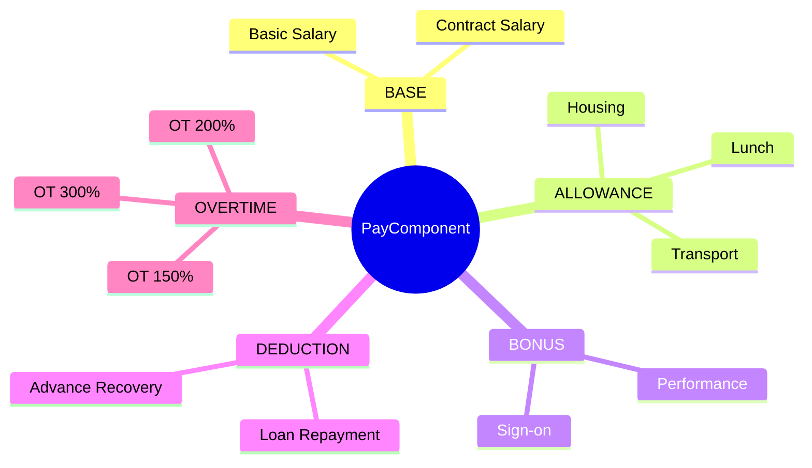

**Tax Treatment:**

| Treatment | Mô tả | Ví dụ |
|-----------|-------|-------|
| FULLY_TAXABLE | Chịu thuế 100% | Basic Salary |
| TAX_EXEMPT | Miễn thuế | |
| PARTIALLY_EXEMPT | Miễn đến ngưỡng | Lunch ≤730K |

**Calculation Methods:**

| Method | Mô tả | Ví dụ |
|--------|-------|-------|
| FIXED | Số cố định | 5,000,000 VND |
| FORMULA | Công thức | `base * 0.1` |
| PERCENTAGE | Phần trăm | 10% of base |
| HOURLY | Theo giờ | 100,000/hour |

---

## 2. Job Architecture

### 2.1 Tổng quan

Job Architecture định nghĩa cấu trúc cấp bậc và lộ trình nghề nghiệp:

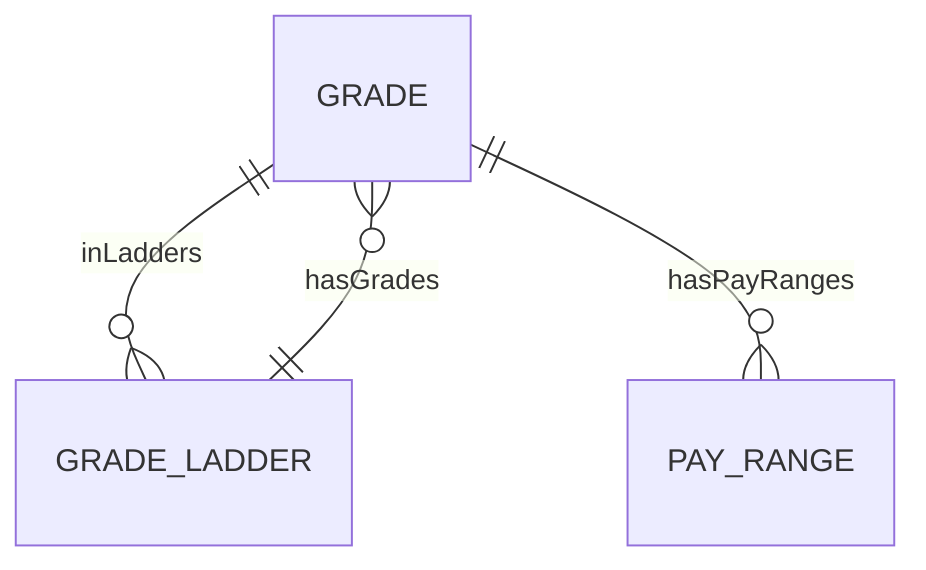

### 2.2 Grade

**Định nghĩa**: Cấp bậc nghề nghiệp với SCD-2 versioning.

**Grade Structure Example:**

| Grade | Name | Job Level | Track |
|-------|------|-----------|-------|
| G1 | Junior Engineer | 1 | Technical |
| G2 | Engineer | 2 | Technical |
| G3 | Senior Engineer | 4 | Technical |
| M1 | Team Lead | 5 | Management |
| M2 | Manager | 7 | Management |

**SCD-2 Versioning:**

| Field | Purpose |
|-------|---------|
| effectiveStartDate | Version start |
| effectiveEndDate | Version end (null = current) |
| versionNumber | Số version |
| isCurrentVersion | Quick filter |

### 2.3 GradeLadder

**Định nghĩa**: Lộ trình nghề nghiệp qua các grades.

**Ladder Types:**

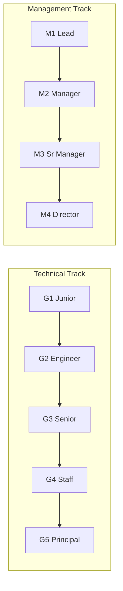

### 2.4 PayRange

**Định nghĩa**: Khung lương min/mid/max cho mỗi grade.

**Range Structure:**

| Position | Description | Use Case |
|----------|-------------|----------|
| **Min** | Entry/below market | New hires |
| **Mid** | Market rate (target) | Experienced |
| **Max** | Above market | Top performers |

**Compa-ratio:**
```
Compa-ratio = Actual Salary / Midpoint × 100%
```

| Range | Interpretation |
|-------|----------------|
| < 80% | Below range |
| 80-90% | Approaching mid |
| 90-110% | At midpoint |
| 110-120% | Above mid |
| > 120% | Above range |

**Scope Types:**

| Scope | Description | Example |
|-------|-------------|---------|
| GLOBAL | All entities | Company-wide |
| LEGAL_ENTITY | Specific LE | VNG Vietnam |
| BUSINESS_UNIT | Specific BU | Engineering |
| POSITION | Specific role | Sr. Developer |

---

## 3. Policy & Cycles

### 3.1 CompensationPlan

**Định nghĩa**: Chính sách điều chỉnh lương.

**Plan Types:**

| Type | Description | Frequency |
|------|-------------|-----------|
| MERIT | Performance-based | Annual |
| PROMOTION | Level change | As needed |
| MARKET_ADJUSTMENT | Market alignment | Annual |
| NEW_HIRE | Starting salary | On hire |
| EQUITY_CORRECTION | Fix pay gaps | As needed |
| AD_HOC | One-off | As needed |

**Lifecycle:**
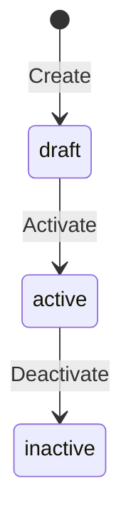

### 3.2 Compensation Cycle

**Định nghĩa**: Chu kỳ thực hiện compensation plan.

**Cycle Workflow:**

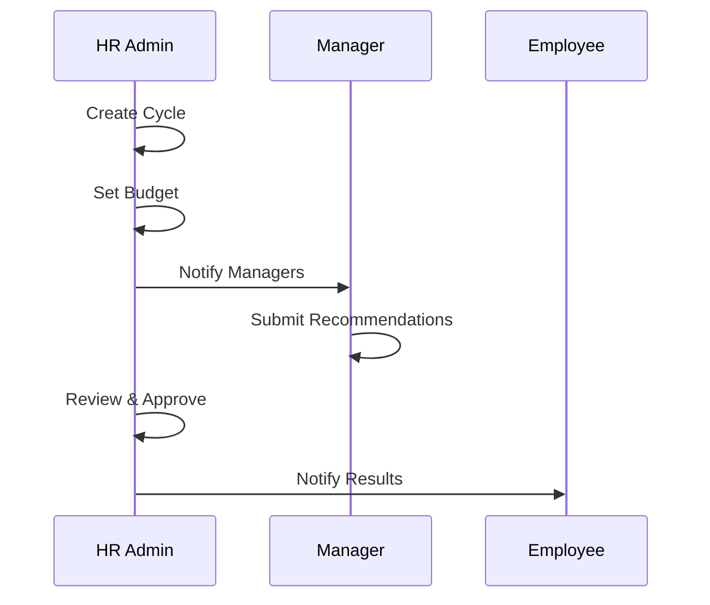

**Cycle Statuses:**

| Status | Description |
|--------|-------------|
| DRAFT | Being configured |
| OPEN | Accepting recommendations |
| IN_REVIEW | Under review |
| APPROVED | Finalized |
| CLOSED | Completed |

---

## 4. Incentive Programs

### 4.1 IncentivePlan

**Định nghĩa**: Chương trình thưởng và equity.

**Incentive Types:**

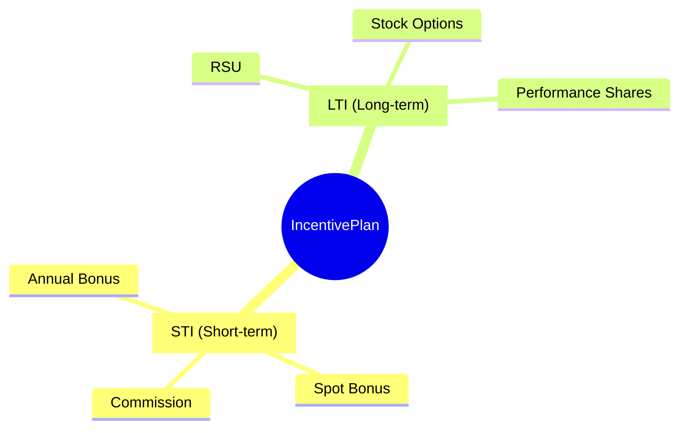

### 4.2 Equity Programs

**Grant Types:**

| Type | Description | Tax Event |
|------|-------------|-----------|
| **RSU** | Stock units vest over time | On vesting |
| **Stock Option** | Right to buy at strike price | On exercise |
| **ESPP** | Discounted stock purchase | On sale |

**Vesting Schedules:**

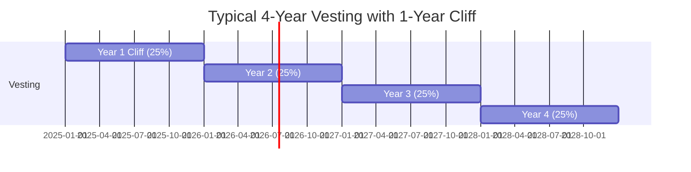

---

## 5. Benefits Administration

### 5.1 BenefitPlan

**Định nghĩa**: Gói phúc lợi cho nhân viên.

**Plan Categories:**

| Category | Description | Example |
|----------|-------------|---------|
| MEDICAL | Health insurance | Bảo Việt Premium |
| DENTAL | Dental coverage | VBI Dental |
| VISION | Eye care | Basic Vision |
| LIFE | Life insurance | 24x salary |
| RETIREMENT | Pension plans | 401k, EPF |
| WELLNESS | Health programs | Gym membership |

**Lifecycle:**
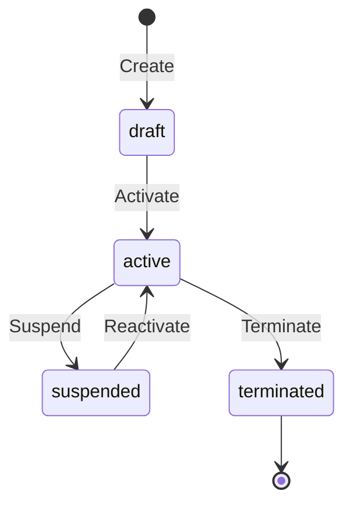

### 5.2 EligibilityProfile

**Định nghĩa**: Điều kiện để nhân viên đủ điều kiện tham gia.

**Rule Structure:**

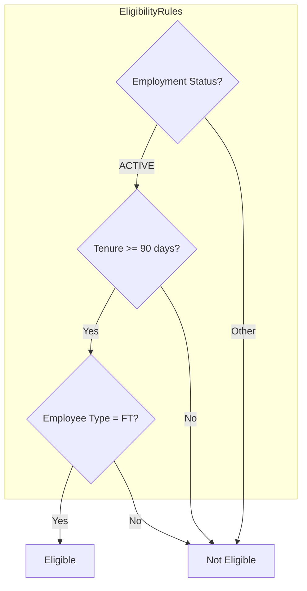

**Common Criteria:**

| Criterion | Operator | Example |
|-----------|----------|---------|
| employmentStatus | equals | ACTIVE |
| tenure | >= | 90 days |
| employeeType | in | [FULLTIME] |
| grade | in | [G3, G4, G5] |
| location | equals | Vietnam |

---

## 6. Offer Management

### 6.1 OfferTemplate

**Định nghĩa**: Khuôn mẫu cho offer packages.

**Template Components:**

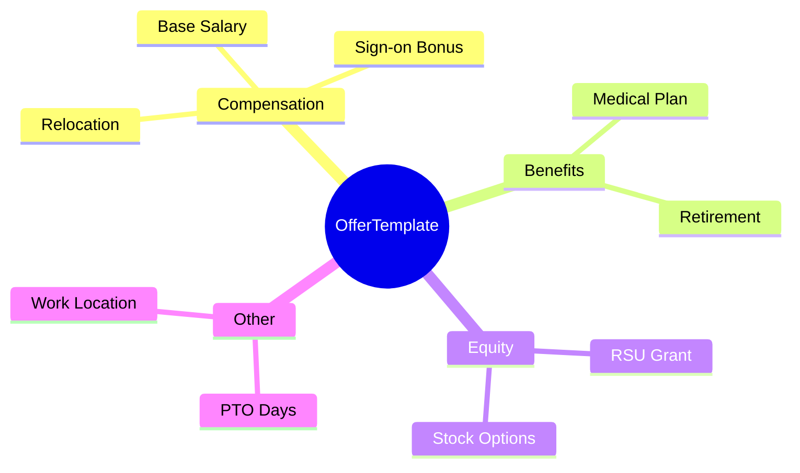

**Template Configuration Example:**

```json
{
  "compensation": [
    {"componentCode": "BASIC_SALARY", "amount": null},
    {"componentCode": "SIGN_ON_BONUS", "amount": 10000000}
  ],
  "benefits": [
    {"planCode": "MED_PREMIUM", "optionCode": "EMPLOYEE_FAMILY"}
  ],
  "equity": {
    "grantType": "RSU",
    "units": null,
    "vestingSchedule": "4Y_1Y_CLIFF"
  }
}
```

---

## 7. Calculation Rules

### 7.1 CalculationRule

**Định nghĩa**: Quy tắc tính toán cho tax, SI, OT, proration.

**Rule Categories:**

| Category | Description | Example |
|----------|-------------|---------|
| TAX | Income tax | VN_PIT_2025 |
| SOCIAL_INSURANCE | SI contributions | VN_SI_2025 |
| OVERTIME | OT multipliers | VN_OT_2019 |
| PRORATION | Partial period | CALENDAR_DAYS |
| ROUNDING | Amount rounding | ROUND_VND_1000 |

**Lifecycle:**
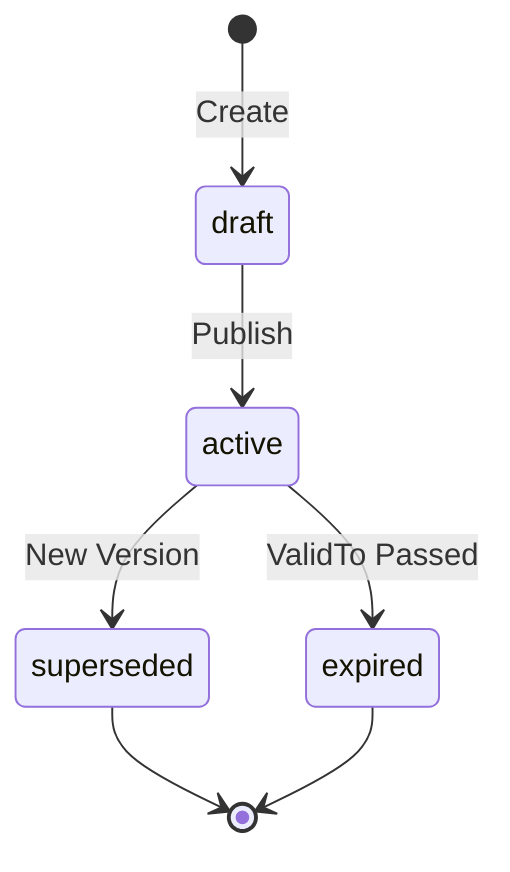

### 7.2 Vietnam Statutory Rules

**Social Insurance (BHXH):**

| Type | Employee | Employer | Ceiling |
|------|----------|----------|---------| 
| BHXH | 8% | 17.5% | 36,000,000 |
| BHYT | 1.5% | 3% | 36,000,000 |
| BHTN | 1% | 1% | 36,000,000 |
| **Total** | **10.5%** | **21.5%** | - |

**Personal Income Tax (PIT):**

| Bracket | Taxable Income | Rate |
|---------|----------------|------|
| 1 | 0 - 5M | 5% |
| 2 | 5 - 10M | 10% |
| 3 | 10 - 18M | 15% |
| 4 | 18 - 32M | 20% |
| 5 | 32 - 52M | 25% |
| 6 | 52 - 80M | 30% |
| 7 | > 80M | 35% |

**Exemptions:**
- Personal: 11,000,000 VND/month
- Dependent: 4,400,000 VND/person/month

### 7.3 CountryConfig

**Định nghĩa**: Cấu hình theo quốc gia.

| Country | Currency | Tax System | SI System | Work Days/Month |
|---------|----------|------------|-----------|-----------------|
| VN | VND | Progressive | Mandatory | 26 |
| SG | SGD | Progressive | CPF | 22 |
| US | USD | Progressive | FICA | 22 |

---

## 8. Best Practices

### 8.1 Configuration Guidelines

1. **Salary Basis Naming**: Use descriptive codes
   - `LUONG_THANG_VN`, `HOURLY_US`, `ANNUAL_EXEC`
   
2. **Component Strategy**: Modular, reusable components
   - Shared across multiple bases
   - Clear tax treatment

3. **Grade Structure**: Consistent across ladders
   - Same level = similar responsibility
   - Pay ranges align with market

### 8.2 Compliance Checklist

- [ ] Calculation rules updated cho năm hiện tại
- [ ] Tax brackets và exemptions chính xác
- [ ] SI contribution ceilings updated
- [ ] Benefit eligibility rules documented
- [ ] Offer templates compliant with labor law

### 8.3 Integration with Payroll

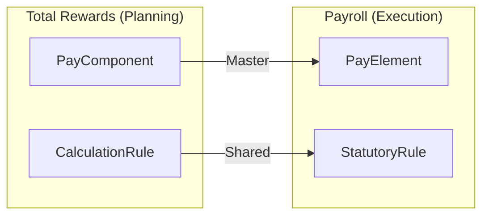

**Key Points:**
- `PayComponent` (TR) = planning/design
- `PayElement` (PR) = execution/calculation
- Calculation rules shared between modules

---

## Appendix

### A. Related Documents

- [Concept Overview](./TR-concept-overview.md)
- [Ontology Index](../00-ontology/_index.onto.md)
- [Payroll Conceptual Guide](../../PR/01-concept/PR-conceptual-guide.md)

### B. Entity Quick Reference

| Entity | Classification | Primary Purpose |
|--------|---------------|-----------------|
| SalaryBasis | AGGREGATE_ROOT | Pay frequency & currency |
| PayComponent | AGGREGATE_ROOT | Compensation elements |
| Grade | AGGREGATE_ROOT | Job levels |
| GradeLadder | AGGREGATE_ROOT | Career paths |
| PayRange | ENTITY | Salary bands |
| CompensationPlan | AGGREGATE_ROOT | Review policies |
| IncentivePlan | AGGREGATE_ROOT | Bonus/equity programs |
| BenefitPlan | AGGREGATE_ROOT | Benefits packages |
| EligibilityProfile | ENTITY | Eligibility rules |
| OfferTemplate | AGGREGATE_ROOT | Offer packages |
| CalculationRule | AGGREGATE_ROOT | Calculation logic |
| CountryConfig | REFERENCE_DATA | Country settings |
