# Context Map L1: System Context
# Total Rewards — xTalent HCM

> **C4 Level 1 — System Context Diagram**
> **Module**: Total Rewards (TR)
> **Solution**: xTalent HCM (6 SEA countries: VN, TH, ID, SG, MY, PH)
> **Date**: 2026-03-26
> **Version**: 1.0.0

---

## C4 System Context Diagram (Mermaid)

```mermaid
C4Context
  title System Context — xTalent Total Rewards

  Person(worker, "Worker (Self-Service)", "Views own salary, enrolls benefits, redeems points, disputes commission")
  Person(manager, "People Manager", "Proposes salary changes, approves bonuses, sends recognition")
  Person(hrAdmin, "HR Administrator", "Configures all TR modules, manages enrollment windows, monitors compliance")
  Person(financeApprover, "Finance Approver", "Approves budgets, FX overrides, garnishments, bonus pools")
  Person(taxAdmin, "Tax Administrator", "Configures tax brackets, files returns, manages dual-path e-filing")
  Person(complianceOfficer, "Compliance Officer", "Generates compliance reports, reviews anomalies, scoped audit access")
  Person(hiringManager, "Hiring Manager", "Creates candidate offers, submits for approval")
  Person(candidate, "Candidate", "Reviews, accepts, declines, or counter-offers job offers")
  Person(externalAuditor, "External Auditor", "Read-only scoped access to audit records per Legal Entity")
  Person(salesOps, "Sales Operations", "Configures commission plans, imports CRM transactions, resolves disputes")

  System(trSystem, "xTalent Total Rewards", "Multi-country TR platform: compensation, variable pay, benefits, recognition, offer management, tax, audit. 6 SEA countries.")

  System_Ext(coModule, "CO Module (xTalent Core)", "Master data: Worker, WorkingRelationship, Grade, LegalEntity, BusinessUnit, Job")
  System_Ext(payrollModule, "Payroll Module (xTalent)", "Downstream payroll execution, net pay calculation")
  System_Ext(pmModule, "PM Module (xTalent)", "Performance ratings consumed by Variable Pay for bonus modifiers")
  System_Ext(crmSystem, "CRM System", "Salesforce / HubSpot — SalesTransaction source for commission calculation")
  System_Ext(taxAuthority, "Tax Authority API", "Country-specific e-filing: VN HTKK, TH RD, SG IRAS, etc.")
  System_Ext(benefitsCarriers, "Benefits Carriers", "Insurance carriers receiving EDI 834 enrollment files")
  System_Ext(eSignProviders, "E-Signature Providers", "DocuSign, HelloSign — multi-provider abstraction for offer letters")
  System_Ext(fxProviders, "FX Rate Providers", "OANDA, Reuters, Central Bank — daily FX rates for multi-currency")
  System_Ext(equityPlatform, "Equity Platform", "External RSU/Options administration (Phase 2)")

  Rel(worker, trSystem, "Self-service: view salary, elect benefits, dispute commission, redeem points")
  Rel(manager, trSystem, "Submit merit proposals, approve bonuses, send recognition")
  Rel(hrAdmin, trSystem, "Full admin: configure plans, cycles, enrollment, compliance")
  Rel(financeApprover, trSystem, "Approve budgets, FX overrides, bonus pools")
  Rel(taxAdmin, trSystem, "Configure tax brackets, file returns")
  Rel(complianceOfficer, trSystem, "Generate reports, review anomalies (read-only)")
  Rel(hiringManager, trSystem, "Create and submit candidate offers")
  Rel(candidate, trSystem, "Accept, decline, counter-offer")
  Rel(externalAuditor, trSystem, "Read-only audit access (scoped per Legal Entity)")
  Rel(salesOps, trSystem, "Setup commission plans, import sales transactions, resolve disputes")

  Rel(trSystem, coModule, "Reads Worker, WorkingRelationship, Grade, LegalEntity, BusinessUnit (upstream)")
  Rel(coModule, trSystem, "Publishes: WorkerCreated, WorkingRelationshipChanged, GradeChanged")
  Rel(trSystem, payrollModule, "Publishes salary changes and taxable items via Kafka + daily batch (downstream)")
  Rel(pmModule, trSystem, "Provides performance ratings for bonus calculation")
  Rel(crmSystem, trSystem, "Streams SalesTransactions for commission calculation (Kafka / REST)")
  Rel(trSystem, taxAuthority, "Dual-path: API e-filing (primary) + file export (always ready)")
  Rel(trSystem, benefitsCarriers, "EDI 834 enrollment files via webhook + 15-min polling fallback")
  Rel(trSystem, eSignProviders, "Offer letter e-signature via webhook + 15-min polling fallback")
  Rel(fxProviders, trSystem, "Daily FX rates (pull; OANDA, Reuters, Central Bank)")
  Rel(trSystem, equityPlatform, "RSU/Options administration (Phase 2)")
```

---

## System Summary

| Item | Detail |
|------|--------|
| System Name | xTalent Total Rewards |
| Countries | VN, TH, ID, SG, MY, PH (Phase 1: VN focus) |
| Human Actors | 10 (Worker, Manager, HR Admin, Finance, Tax Admin, Compliance, Hiring Manager, Candidate, Auditor, Sales Ops) |
| Internal Systems | CO Module (upstream), Payroll Module (downstream), PM Module |
| External Systems | CRM, Tax Authority API, Benefits Carriers, E-Signature Providers, FX Providers, Equity Platform |
| Async Bus | Apache Kafka — all inter-BC events and Payroll bridge |
| Sync APIs | REST/OpenAPI — CalculationEnginePort, CompensationPort, BenefitsEnrollmentPort |
| Special Protocols | EDI 834 (Benefits Carriers), Dual-path e-filing (Tax Authority) |

---

## Key Integration Constraints

| Constraint | Detail |
|-----------|--------|
| Commission dashboard latency | < 5 seconds (Kafka streaming, not batch) |
| Payroll bridge SLA | Max 15-minute delay; alert cascade |
| Tax authority dual-path | Both API and file paths always prepared simultaneously |
| Benefits carrier sync | Webhook primary; 15-min polling fallback after 3 failures |
| E-signature | Multi-provider abstraction; webhook primary; 15-min polling fallback |
| Audit immutability | All audit records append-only, no DELETE/UPDATE ever |
| PII data locality | Per-country storage for sensitive data; central aggregation for reporting |

---

*C4 Level 1 — System Context — Total Rewards / xTalent HCM*
*2026-03-26*
