# Context Map L2: Container Diagram (Bounded Contexts)
# Total Rewards — xTalent HCM

> **C4 Level 2 — Container Diagram with DDD Annotations**
> **Module**: Total Rewards (TR)
> **Date**: 2026-03-26
> **Version**: 1.0.0

---

## C4 Container Diagram (Mermaid)

```mermaid
C4Container
  title Container Diagram — xTalent Total Rewards (Bounded Contexts)

  Person(hrAdmin, "HR Admin / Finance / Comp Manager / Tax Admin", "Various TR admin actors")
  Person(worker, "Worker / Manager / Sales Ops / Hiring Manager", "Self-service and operational actors")

  System_Boundary(tr, "xTalent Total Rewards Platform") {

    Container(bc01, "BC-01: Compensation Management", "Domain Service", "Salary structure, merit cycles, pay ranges, deductions. SCD Type 2 salary history.")
    Container(bc02, "BC-02: Calculation Engine", "Domain Service + Plugin Registry", "Versioned rules for SI/CPF, proration, FX, min wage. CountryContributionEngine plugins per country.")
    Container(bc03, "BC-03: Variable Pay", "Domain Service", "Bonus plans, commission calculation (real-time <5s), LTI/equity vesting.")
    Container(bc04, "BC-04: Benefits Administration", "Domain Service", "Benefit plan enrollment, EDI 834 carrier sync, dependent management, flex credits.")
    Container(bc05, "BC-05: Recognition", "Domain Service", "Peer recognition, FIFO point balance, perks catalog, social feed, milestone automation.")
    Container(bc06, "BC-06: Offer Management", "Domain Service", "Candidate offer lifecycle, e-signature multi-provider abstraction, min wage validation.")
    Container(bc07, "BC-07: TR Statement", "Domain Service", "Annual total rewards snapshot aggregation, PDF generation, 7-year immutable archival.")
    Container(bc08, "BC-08: Taxable Bridge", "Anti-Corruption Layer / Cross-cutting", "Captures taxable events from all BCs. Idempotency key dedup. Bridges to Payroll exactly-once.")
    Container(bc09, "BC-09: Tax & Compliance", "Domain Service", "Tax bracket configuration (SCD Type 2), worker tax profile, dual-path e-filing.")
    Container(bc10, "BC-10: Audit & Observability", "Infrastructure Service", "Immutable append-only audit trail. Anomaly detection. Compliance reporting. Write-once storage.")

  }

  System_Ext(coModule, "CO Module", "Worker, WorkingRelationship, Grade, LegalEntity, BusinessUnit")
  System_Ext(payrollModule, "Payroll Module", "Payroll execution downstream")
  System_Ext(pmModule, "PM Module", "Performance ratings")
  System_Ext(crmSystem, "CRM System", "SalesTransactions")
  System_Ext(taxAuthority, "Tax Authority API", "e-filing endpoints")
  System_Ext(benefitsCarriers, "Benefits Carriers", "EDI 834")
  System_Ext(eSignProviders, "E-Signature Providers", "DocuSign, HelloSign")
  System_Ext(fxProviders, "FX Rate Providers", "OANDA, Reuters")

  %% --- Upstream: CO Module feeds all BCs ---
  Rel(coModule, bc01, "WorkerCreated, WorkingRelationshipChanged, GradeChanged", "Kafka async")
  Rel(coModule, bc03, "WorkerCreated, WorkingRelationshipChanged", "Kafka async")
  Rel(coModule, bc04, "WorkerCreated, QualifyingLifeEvent", "Kafka async")
  Rel(coModule, bc06, "LegalEntity data", "REST query")

  %% --- BC-01 → BC-02: Customer/Supplier ---
  Rel(bc01, bc02, "CalculationEnginePort: proration, FX conversion, min wage check", "Sync REST [Customer/Supplier]")

  %% --- BC-03 → BC-02: Customer/Supplier ---
  Rel(bc03, bc02, "CalculationEnginePort: formula execution, FX conversion", "Sync REST [Customer/Supplier]")

  %% --- BC-04 → BC-02: Customer/Supplier ---
  Rel(bc04, bc02, "CalculationEnginePort: deduction amount calculation", "Sync REST [Customer/Supplier]")

  %% --- BC-06 → BC-02: Customer/Supplier ---
  Rel(bc06, bc02, "MinWagePort: min wage validation at offer creation", "Sync REST [Customer/Supplier]")

  %% --- BC-09 → BC-02: Customer/Supplier ---
  Rel(bc09, bc02, "Taxable income calculation rule lookup", "Sync REST [Customer/Supplier]")

  %% --- Taxable Bridge: Published Language pattern ---
  Rel(bc01, bc08, "SalaryChanged, DeductionCreated", "Kafka async [Published Language]")
  Rel(bc03, bc08, "BonusApproved, EquityVested, TaxableRewardCreated", "Kafka async [Published Language]")
  Rel(bc04, bc08, "BenefitInKindCreated", "Kafka async [Published Language]")
  Rel(bc05, bc08, "TaxableRecognitionCreated", "Kafka async [Published Language]")

  %% --- BC-08 → Payroll + BC-09 ---
  Rel(bc08, payrollModule, "TaxableItemCreated, PayrollBridgeProcessed (Kafka + daily batch reconciliation)", "Kafka async [Published Language] | SLA 15min")
  Rel(bc08, bc09, "Taxable items for tax calculation", "Sync REST read [Customer/Supplier]")

  %% --- TR Statement: ACL read-only aggregation ---
  Rel(bc07, bc01, "Read compensation data", "REST read [Anti-Corruption Layer]")
  Rel(bc07, bc03, "Read variable pay data", "REST read [Anti-Corruption Layer]")
  Rel(bc07, bc04, "Read benefits data", "REST read [Anti-Corruption Layer]")
  Rel(bc07, bc05, "Read recognition/points data", "REST read [Anti-Corruption Layer]")

  %% --- PM Module → BC-03 ---
  Rel(pmModule, bc03, "PerformanceRatingPublished — bonus modifier input", "Kafka async")

  %% --- BC-03 → CRM: real-time commission ---
  Rel(crmSystem, bc03, "SalesTransaction events / import API", "Kafka streaming [real-time <5s] OR REST import")

  %% --- BC-09 → Tax Authority: dual-path ---
  Rel(bc09, taxAuthority, "e-filing (primary API path + file path simultaneously)", "HTTP API + File [Dual-path]")

  %% --- BC-04 → Benefits Carriers ---
  Rel(bc04, benefitsCarriers, "Enrollment files EDI 834", "EDI 834 [webhook primary + 15min polling fallback]")

  %% --- BC-06 → E-Signature ---
  Rel(bc06, eSignProviders, "Offer letter signature", "Webhook [multi-provider abstraction + 15min polling]")

  %% --- FX Providers → BC-02 ---
  Rel(fxProviders, bc02, "Daily FX rates", "REST pull (OANDA, Reuters, Central Bank)")

  %% --- All BCs → BC-10: Observer ---
  Rel(bc01, bc10, "All entity changes", "Kafka async [Observer]")
  Rel(bc02, bc10, "Rule version changes", "Kafka async [Observer]")
  Rel(bc03, bc10, "Bonus/commission changes", "Kafka async [Observer]")
  Rel(bc04, bc10, "Enrollment changes", "Kafka async [Observer]")
  Rel(bc05, bc10, "Recognition activity", "Kafka async [Observer]")
  Rel(bc06, bc10, "Offer lifecycle events", "Kafka async [Observer]")
  Rel(bc08, bc10, "Bridge events", "Kafka async [Observer]")
  Rel(bc09, bc10, "Tax events", "Kafka async [Observer]")

  %% --- HR Admin / Workers interact with BCs ---
  Rel(hrAdmin, bc01, "Manage compensation cycles, pay ranges")
  Rel(hrAdmin, bc04, "Configure benefit plans, open enrollment")
  Rel(worker, bc01, "View salary (self-service)")
  Rel(worker, bc04, "Elect benefits, add dependents")
  Rel(worker, bc05, "Send recognition, redeem points")
  Rel(worker, bc07, "View total rewards statement")
```

---

## DDD Relationship Summary

| Source BC | Target BC | DDD Relationship Type | Communication |
|-----------|-----------|----------------------|---------------|
| CO Module | BC-01, 03, 04, 06 | Upstream / Downstream | Kafka events + REST query |
| BC-01 | BC-02 | Customer / Supplier | Sync REST (CalculationEnginePort) |
| BC-03 | BC-02 | Customer / Supplier | Sync REST (FormulaEngine) |
| BC-04 | BC-02 | Customer / Supplier | Sync REST (deduction calc) |
| BC-06 | BC-02 | Customer / Supplier | Sync REST (MinWagePort) |
| BC-09 | BC-02 | Customer / Supplier | Sync REST (taxable income calc) |
| BC-01 | BC-08 | Published Language | Kafka async |
| BC-03 | BC-08 | Published Language | Kafka async |
| BC-04 | BC-08 | Published Language | Kafka async |
| BC-05 | BC-08 | Published Language | Kafka async |
| BC-08 | Payroll Module | Published Language | Kafka async + daily batch |
| BC-08 | BC-09 | Customer / Supplier | Sync REST read |
| BC-07 | BC-01, 03, 04, 05 | Anti-Corruption Layer | Read-only REST aggregation |
| All BCs | BC-10 | Observer | Kafka async (append-only) |
| BC-06 | CO Module | Conformist | Publishes OfferAccepted → onboarding trigger |

---

## Kafka Topics (Canonical)

| Topic | Producer | Key Consumers |
|-------|----------|---------------|
| `tr.salary-changed.v1` | BC-01 | BC-08, Payroll |
| `tr.compensation-approved.v1` | BC-01 | BC-08, BC-10 |
| `tr.compensation-cycle-opened.v1` | BC-01 | Notification Service |
| `tr.calculation-rule-versioned.v1` | BC-02 | BC-10 |
| `tr.fx-rate-updated.v1` | BC-02 | BC-03, BC-10 |
| `tr.sales-transactions.v1` | CRM / BC-03 | BC-03 (commission engine) |
| `tr.commission-recalculated.v1` | BC-03 | Dashboard (real-time) |
| `tr.bonus-approved.v1` | BC-03 | BC-08, BC-10 |
| `tr.equity-vested.v1` | BC-03 | BC-08, BC-10 |
| `tr.benefit-enrolled.v1` | BC-04 | BC-08, BC-10 |
| `tr.taxable-recognition-created.v1` | BC-05 | BC-08, BC-10 |
| `tr.offer-accepted.v1` | BC-06 | CO Module, BC-10 |
| `tr.taxable-items.v1` | BC-08 | Payroll, BC-09 |
| `tr.payroll-bridge-processed.v1` | BC-08 | Payroll, BC-10 |
| `tr.tax-calculated.v1` | BC-09 | BC-10 |
| `tr.audit-records.v1` | BC-10 | Compliance reporting |

---

## BC Type Annotations

| BC | Type | Rationale |
|----|------|-----------|
| BC-01 Compensation | Domain Service | Core domain — salary lifecycle management |
| BC-02 Calculation Engine | Domain Service + Plugin Registry | Engine pattern; CountryContributionEngine plugins per country |
| BC-03 Variable Pay | Domain Service | Core domain — bonus, commission, equity |
| BC-04 Benefits Admin | Domain Service | Supporting domain — enrollment lifecycle |
| BC-05 Recognition | Domain Service | Supporting domain — points and social recognition |
| BC-06 Offer Management | Domain Service | Supporting domain — candidate offer workflow |
| BC-07 TR Statement | Domain Service | Supporting domain — read-only aggregation, PDF generation |
| BC-08 Taxable Bridge | Anti-Corruption Layer | Cross-cutting concern — translates taxable events for Payroll |
| BC-09 Tax & Compliance | Domain Service | Supporting domain — regulatory PIT and filing |
| BC-10 Audit & Observability | Infrastructure Service | Cross-cutting — immutable event capture, no business logic |

---

*C4 Level 2 — Container Diagram — Total Rewards / xTalent HCM*
*2026-03-26*
