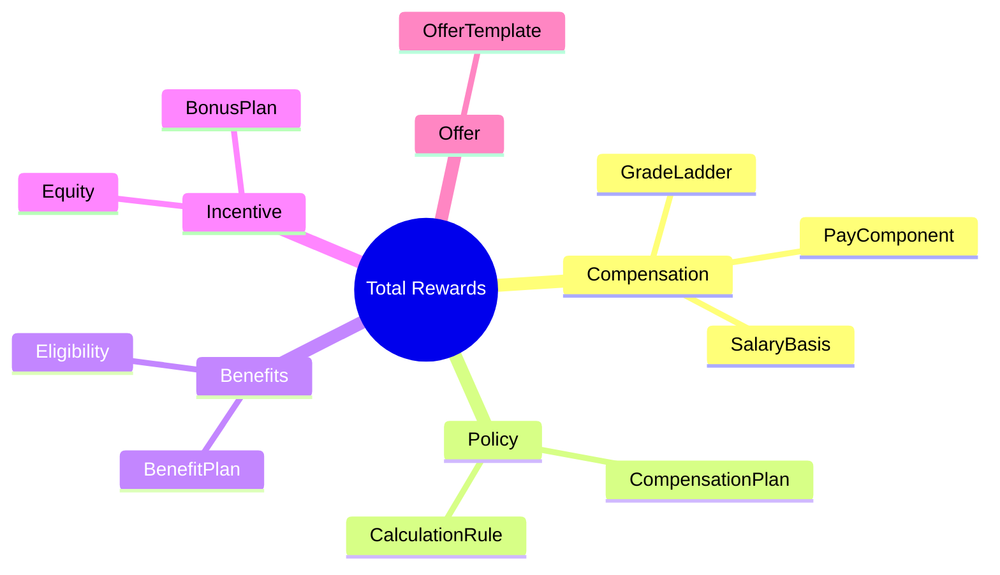
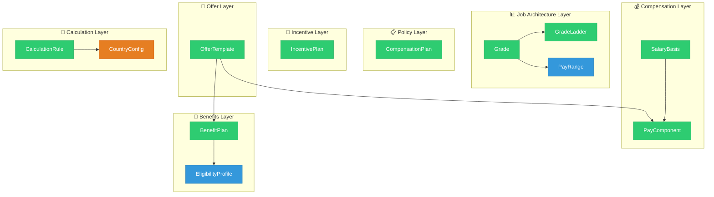
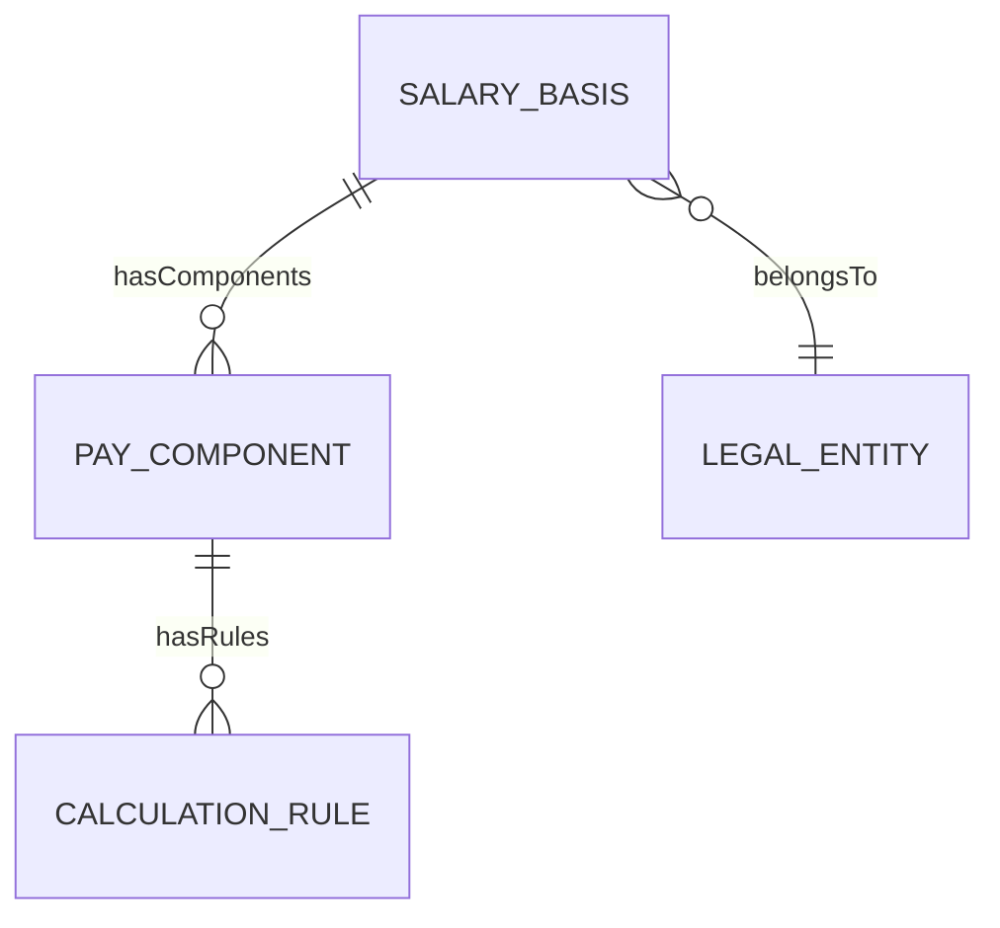
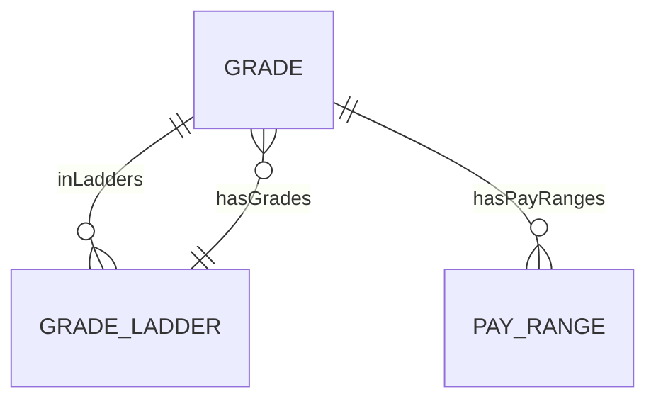
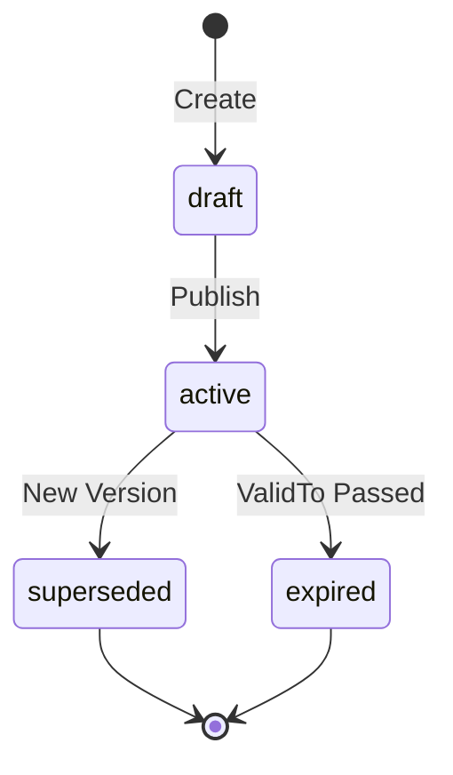
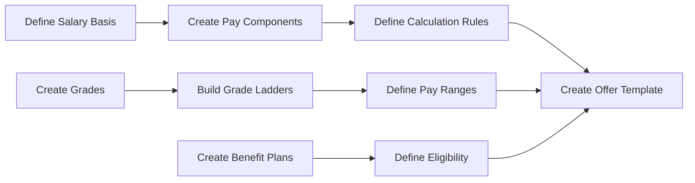
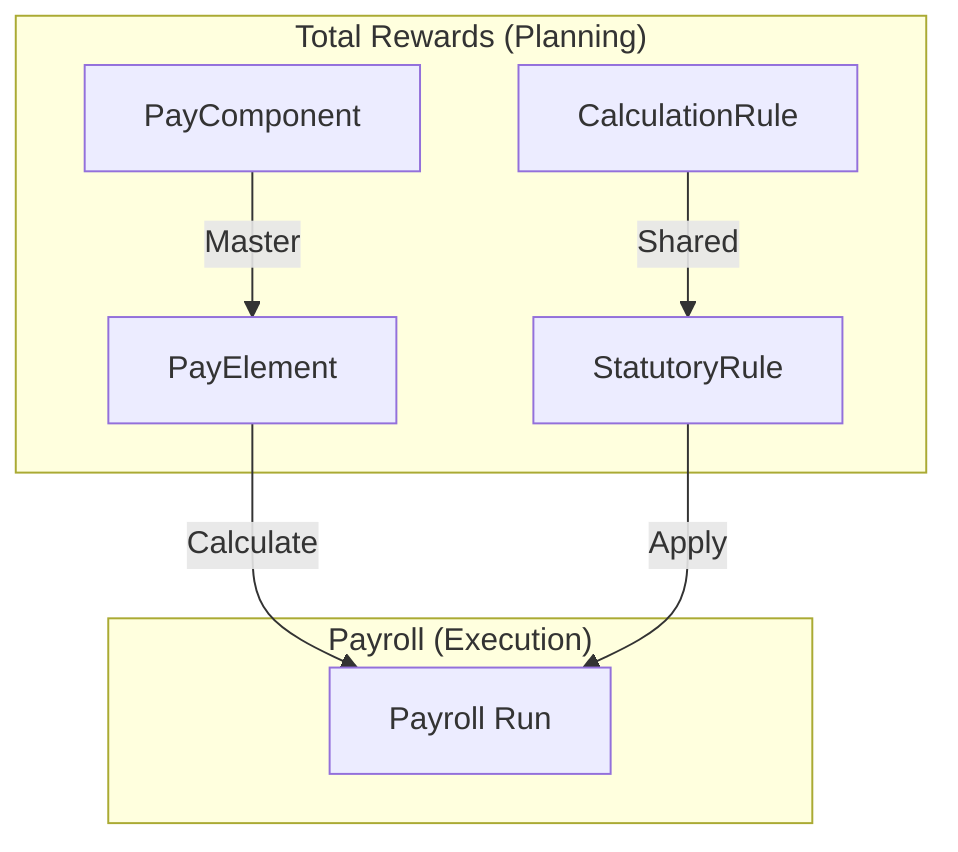

# Total Rewards Module - Concept Overview

> **Module**: Total Rewards (TR)  
> **Version**: 1.0  
> **Last Updated**: 2026-01-06

---

## 1. Giới thiệu

Total Rewards Module cung cấp khả năng quản lý toàn diện hệ thống đãi ngộ, từ việc cấu hình cấu trúc lương, job architecture, đến benefits và recognition programs.

### 1.1 Mục tiêu Module

### 1.2 Phạm vi

**Trong phạm vi (In Scope):**
- Cấu hình compensation structures (Salary Basis, Pay Components)
- Job architecture (Grades, Ladders, Pay Ranges)
- Benefits plans và eligibility profiles
- Incentive programs (Bonus, Equity)
- Calculation rules (Tax, SI, OT)
- Offer templates

**Ngoài phạm vi (Out of Scope):**
- Payroll processing (runtime calculation)
- Transaction data (snapshots, enrollments)
- Workflow instances (approval transactions)

---

## 2. Kiến trúc Tổng quan

### 2.1 Domain Model

**Chú thích màu sắc:**
- 🟢 **AGGREGATE_ROOT**: SalaryBasis, PayComponent, Grade, GradeLadder, CompensationPlan, IncentivePlan, BenefitPlan, OfferTemplate, CalculationRule
- 🔵 **ENTITY**: PayRange, EligibilityProfile
- 🟠 **REFERENCE_DATA**: CountryConfig

### 2.2 Entity Classification

| Classification | Entities | Mô tả |
|---------------|----------|-------|
| **AGGREGATE_ROOT** | SalaryBasis, PayComponent, Grade, GradeLadder, CompensationPlan, IncentivePlan, BenefitPlan, OfferTemplate, CalculationRule | Entities chính, có lifecycle riêng |
| **ENTITY** | PayRange, EligibilityProfile | Entities phụ thuộc |
| **REFERENCE_DATA** | CountryConfig | Dữ liệu tham chiếu |

---

## 3. Các Khái niệm Chính

### 3.1 Compensation Structure

| Concept | Định nghĩa | Ví dụ |
|---------|-----------|-------|
| **Salary Basis** | Cách trả lương (monthly, hourly) | LUONG_THANG_VN |
| **Pay Component** | Thành phần lương (BASE, ALLOWANCE) | Basic Salary, Lunch Allowance |

### 3.2 Job Architecture

| Concept | Định nghĩa | Ví dụ |
|---------|-----------|-------|
| **Grade** | Cấp bậc nghề nghiệp | G1, G2, G3, M1, M2 |
| **Grade Ladder** | Lộ trình nghề nghiệp | Engineering, Management |
| **Pay Range** | Khung lương min/mid/max | Min 25M, Mid 35M, Max 45M |

### 3.3 Calculation Rules

**Rule Categories:**

| Category | Mô tả | Ví dụ Vietnam |
|----------|-------|---------------|
| TAX | Thuế TNCN | VN_PIT_2025 |
| SOCIAL_INSURANCE | BHXH, BHYT, BHTN | VN_SI_2025 |
| OVERTIME | Hệ số làm thêm | VN_OT_2019 |
| PRORATION | Tính theo ngày | CALENDAR_DAYS |

---

## 4. Data Flow

### 4.1 Configuration Flow

### 4.2 Integration with Payroll

---

## 5. Vietnam-Specific Configuration

### 5.1 Statutory Rates

| Loại | Employee | Employer | Ceiling |
|------|----------|----------|---------| 
| BHXH | 8% | 17.5% | 36,000,000 VND |
| BHYT | 1.5% | 3% | 36,000,000 VND |
| BHTN | 1% | 1% | 36,000,000 VND |
| **Tổng** | **10.5%** | **21.5%** | - |

### 5.2 Personal Income Tax (PIT)

| Bậc | Thu nhập chịu thuế | Thuế suất |
|-----|-------------------|-----------| 
| 1 | 0 - 5 triệu | 5% |
| 2 | 5 - 10 triệu | 10% |
| 3 | 10 - 18 triệu | 15% |
| 4 | 18 - 32 triệu | 20% |
| 5 | 32 - 52 triệu | 25% |
| 6 | 52 - 80 triệu | 30% |
| 7 | Trên 80 triệu | 35% |

**Exemptions:**
- Personal: 11,000,000 VND/tháng
- Dependent: 4,400,000 VND/người/tháng

---

## 6. Entities Reference

Xem chi tiết tại:
- [Ontology Index](../00-ontology/_index.onto.md)
- [Full Concept Overview](./01-concept-overview.md)
- [Payroll Module](../../PR/01-concept/PR-concept-overview.md)
