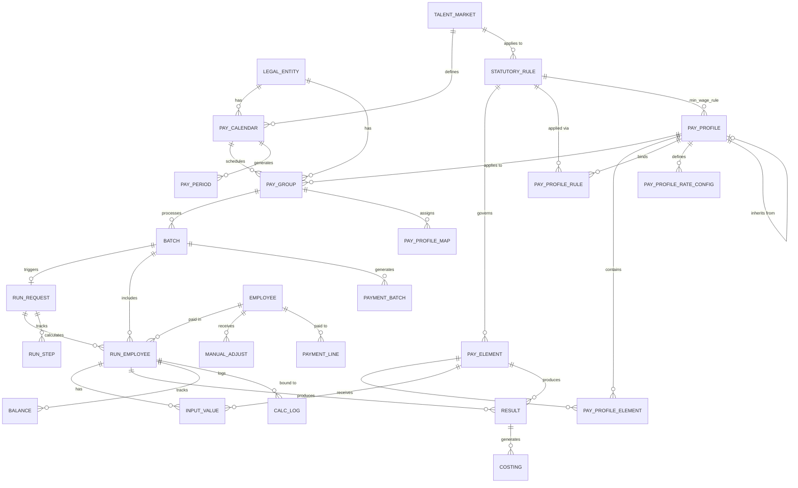
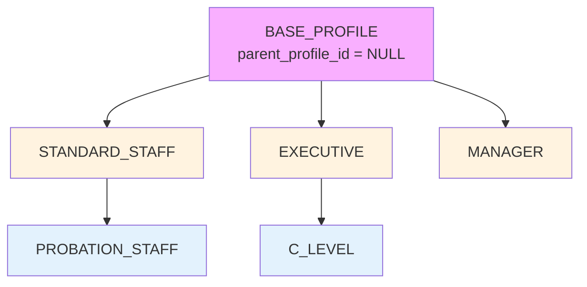

# Payroll V4 — Model Overview

**Version**: 5.Payroll.V4.dbml  
**Last Updated**: 27Mar2026  
**Type**: Architecture Overview

---

## Executive Summary

Payroll V4 là một database model được thiết kế cho enterprise-grade payroll processing với các đặc điểm:

- **38 tables** trong **7 schemas** (5 domain schemas + 2 support)
- **Bounded Context aligned**: Mỗi schema map 1:1 với bounded context
- **SCD-2 versioning**: 11 tables track configuration history
- **Multi-tenant**: `legal_entity_id` partition key trên mọi aggregate root
- **Multi-country**: `country_code`, `config_scope_id` cho scalability
- **Engine separation**: Orchestration (pay_mgmt) tách biệt với Calculation (pay_engine)

---

## 1. Architecture Layers

```
╔══════════════════════════════════════════════════════════════════════╗
║                        PAYROLL MODULE (PR)                           ║
╠══════════════════════════════════════════════════════════════════════╣
║                                                                      ║
║  ┌─────────────────────────────────────────────────────────────────┐ ║
║  │  CONFIGURATION LAYER (pay_master)                               │ ║
║  │  PayProfile · PayElement · StatutoryRule · PayCalendar         │ ║
║  │  Rate Configs · Balance Definitions · GL Mapping               │ ║
║  └────────────────────────────┬────────────────────────────────────┘ ║
║                               │ Provides config to                   ║
║  ┌────────────────────────────▼────────────────────────────────────┐ ║
║  │  ORCHESTRATION LAYER (pay_mgmt)                                 │ ║
║  │  PayPeriod · Batch · ManualAdjust                              │ ║
║  │  Period lifecycle · Approval workflow                          │ ║
║  └────────────────────────────┬────────────────────────────────────┘ ║
║                               │ Delegates to                         ║
║  ┌────────────────────────────▼────────────────────────────────────┐ ║
║  │  CALCULATION LAYER (pay_engine)                                 │ ║
║  │  RunRequest · RunEmployee · InputValue · Result · Balance      │ ║
║  │  Calculation pipeline · Retro deltas · Costing                 │ ║
║  └────────────────────────────┬────────────────────────────────────┘ ║
║                               │ Produces                             ║
║  ┌────────────────────────────▼────────────────────────────────────┐ ║
║  │  OUTPUT LAYER (pay_bank, pay_gateway, pay_audit)               │ ║
║  │  BankPayment · InterfaceFiles · AuditLog                       │ ║
║  └─────────────────────────────────────────────────────────────────┘ ║
╚══════════════════════════════════════════════════════════════════════╝
```

---

## 2. Bounded Context Mapping

Mỗi schema trong V4 maps trực tiếp với bounded context từ domain design:

| Schema | Bounded Context | Responsibility | Aggregate Roots |
|--------|-----------------|----------------|-----------------|
| **pay_master** | BC-01: Pay Master | Configuration: who, how, when, what formula | PayGroup, PayProfile, PayElement, PayCalendar |
| **pay_master** (subset) | BC-02: Statutory Rules | Versioned regulatory rates, brackets | StatutoryRule |
| **pay_mgmt** | BC-03: Payroll Execution (Orchestration) | Period lifecycle, batch management, approval | PayPeriod, Batch |
| **pay_engine** | BC-03: Payroll Execution (Calculation) | Gross-to-net computation, results | RunRequest, RunEmployee, Result |
| **pay_bank** | BC-04: Payment Output | Bank files, payment instructions | PaymentBatch, PaymentLine |
| **pay_gateway** | BC-04: Payment Output (Integration) | Inbound/outbound interfaces | InterfaceDef, InterfaceJob |
| **pay_audit** | BC-07: Audit Trail | Immutable audit records | AuditLog |

**Note**: BC-05 (Statutory Reporting) và BC-06 (Worker Self-Service) không có tables riêng trong V4 — chúng consume data từ BC-03/BC-04.

---

## 3. Schema Overview

### 3.1 pay_master (17 tables)

**Purpose**: Configuration layer — định nghĩa mọi thứ cần để tính lương

```
pay_master
├── STRUCTURE (4 tables)
│   ├── pay_frequency          # MONTHLY, BIWEEKLY, WEEKLY
│   ├── pay_calendar           # Lịch lương theo Legal Entity
│   ├── pay_group              # Nhóm nhân viên cùng payroll config
│   └── pay_profile_map        # Assignment: Employee → PayGroup/Profile
│
├── CORE AGGREGATES (3 tables)
│   ├── pay_element            # Thành phần lương: BASE_SALARY, OT, BHXH, PIT...
│   ├── pay_profile            # Bundle cấu hình: elements + rules + policies
│   └── statutory_rule         # Luật định: thuế, BHXH, OT multipliers
│
├── PROFILE BINDINGS (2 tables)
│   ├── pay_profile_element    # PayElement → PayProfile (with overrides)
│   └── pay_profile_rule       # StatutoryRule → PayProfile (with order)
│
├── RATE CONFIGS (3 tables) — AQ-12, AQ-13
│   ├── pay_profile_rate_config    # Profile-level hourly rates
│   ├── worker_rate_override       # Worker-level rate exceptions
│   └── piece_rate_config          # Piece-rate (product × grade → rate)
│
├── SUPPORT CONFIGS (5 tables)
│   ├── balance_def            # YTD, QTD, LTD balance definitions
│   ├── costing_rule           # GL cost center allocation
│   ├── gl_mapping             # Element → GL account mapping
│   ├── validation_rule        # Pre-run validation rules
│   └── payslip_template       # Payslip format templates
│
└── POLICIES (3 tables)
    ├── pay_formula            # Reusable calculation formulas
    ├── pay_deduction_policy   # Deduction policies (loans, garnishments)
    └── pay_adjust_reason      # Adjustment reason codes
    └── termination_pay_config # Final pay elements by termination type
    └── pay_benefit_link       # Element ↔ Benefit policy mapping
```

### 3.2 pay_mgmt (3 tables)

**Purpose**: Orchestration layer — quản lý lifecycle của payroll processing

```
pay_mgmt
├── pay_period              # Kỳ lương explicit (FUTURE → OPEN → CLOSED)
├── batch                   # Payroll batch (REGULAR, RETRO, QUICKPAY...)
└── manual_adjust           # Manual adjustments (loans, corrections)
```

**Key Innovation (V4)**: 
- Tách từ `pay_run.batch` (V3) sang `pay_mgmt.batch`
- Added `period_id`, `engine_request_id`, expanded status codes
- Support QUICKPAY, TERMINATION batch types

### 3.3 pay_engine (12 tables)

**Purpose**: Calculation layer — thực hiện tính toán, lưu kết quả

```
pay_engine
├── EXECUTION (3 tables)
│   ├── run_request          # Engine interface: Management → Engine
│   ├── calculation_step     # Bước tính: INPUT_COLLECTION → NET_PAY
│   └── run_step             # Per-run step execution tracking
│
├── EMPLOYEE DATA (2 tables)
│   ├── run_employee         # Per-worker run record (status, amounts)
│   └── input_value          # Input values: hours, amounts, rates
│
├── RESULTS (3 tables)
│   ├── result               # Calculated amounts per element
│   ├── balance              # Period balance values
│   └── cumulative_balance   # YTD/QTD/LTD accumulated balances
│
├── RETRO & LOG (2 tables)
│   ├── retro_delta          # Retroactive adjustments delta
│   └── calc_log             # Detailed calculation log
│
└── SUPPORT (2 tables)
    ├── costing              # GL costing entries
    ├── element_dependency   # Calculation order graph
    └── input_source_config  # Automated input collection config
```

**Key Innovation (V4)**:
- Decoupled from orchestration
- Explicit engine interface (`run_request`)
- Step-by-step tracking (`run_step`)
- Cumulative balance persistence (performance optimization)

### 3.4 pay_gateway (4 tables)

**Purpose**: Integration layer — inbound/outbound file/API interfaces

```
pay_gateway
├── iface_def               # Interface definition (IN | OUT)
├── iface_job               # Job execution instance
├── iface_file              # File instance
└── iface_line              # Line-level processing status
```

### 3.5 pay_bank (3 tables)

**Purpose**: Payment layer — bank payment files and instructions

```
pay_bank
├── bank_account            # Company bank accounts per Legal Entity
├── payment_batch           # Payment file batch
└── payment_line            # Per-employee payment instruction
```

### 3.6 pay_audit (1 table)

**Purpose**: Audit trail — immutable log của mọi operations

```
pay_audit
└── audit_log               # Action log with reference to batch/employee
```

### 3.7 Supplemental Tables (4 tables)

**Location**: Root level (no schema)

```
├── import_job              # CSV import tracking
├── generated_file          # Output file management (payslip, tax reports)
├── bank_template           # Bank file format templates
└── tax_report_template     # Tax report format templates
```

---

## 4. High-Level ERD



---

## 5. Key Design Patterns

### 5.1 SCD-2 (Slowly Changing Dimension Type 2)

**Applied to**: 11 tables trong pay_master

```sql
-- Pattern fields
effective_start_date date NOT NULL
effective_end_date   date NULL
is_current_flag      boolean DEFAULT true
```

**Tables using SCD-2**:
- pay_calendar
- pay_element
- balance_def
- costing_rule
- statutory_rule
- pay_profile
- gl_mapping
- validation_rule
- payslip_template
- pay_profile_element
- pay_profile_rule

**Purpose**: 
- Track configuration version history
- Support retroactive adjustments (use version valid at period cut-off)
- Audit trail for compliance

### 5.2 Multi-Country Scoping

**Pattern**: 

```sql
-- Option 1: Country filter
country_code char(2) NULL  -- ISO 2-char: VN, SG, US. NULL = global

-- Option 2: Advanced scope hierarchy (Phase 2)
config_scope_id uuid NULL  -- FK to comp_core.config_scope
```

**Applied to**:
- `pay_element` — Same element code, different country instances
- `statutory_rule` — Country-specific tax/SI rules

**Indexes**:
```sql
(code, country_code)  -- Country-scoped lookup
(country_code)        -- Country filter
```

### 5.3 Engine Separation (V4 Innovation)

**Architecture**:

```
┌─────────────┐         ┌─────────────────┐
│  pay_mgmt   │         │  pay_engine     │
│             │         │                 │
│  batch      │────────►│  run_request    │
│             │  FK     │                 │
└─────────────┘         └─────────────────┘
```

**Interface Contract**:
- `pay_mgmt.batch.engine_request_id → pay_engine.run_request.id`
- Management creates request, Engine processes and updates status

**Benefits**:
- Orchestration can scale independently from calculation
- Engine can be deployed separately (microservice-ready)
- Clear separation of concerns: workflow vs computation

### 5.4 PayProfile Hierarchy



**Inheritance Rules**:
- Child inherits all parent's element bindings, rule bindings
- Child can override: `priority_order`, `default_amount`, `formula_json`
- Multiple inheritance NOT supported (single parent only)

### 5.5 Rate Configuration Layers (AQ-12)

**3-Layer Lookup Architecture**:

```
Worker needs rate for OT_WEEKDAY
        │
        ▼
┌─────────────────────────────┐
│ Layer 1: worker_rate_override│  ← Exception workers only
│ (worker_id, rate_dimension) │     ~50/1000 workers
└───────────┬─────────────────┘
            │ NOT FOUND
            ▼
┌─────────────────────────────┐
│ Layer 2: pay_profile_rate_config│ ← Group default
│ (profile_id, rate_dimension)│     All workers use this
└───────────┬─────────────────┘
            │ rate_type = MULTIPLIER
            ▼
┌─────────────────────────────┐
│ Layer 3: statutory_rule     │  ← Law-based OT multipliers
│ (rule_category=OVERTIME)    │     VN_OT_WEEKDAY = 1.5
└─────────────────────────────┘
```

**Formula**:
```
OT_WEEKDAY_PAY = ot_weekday_hours × lookupRate(worker, 'OT_WEEKDAY')

lookupRate(worker, dimension):
  1. Check worker_rate_override → return override_rate if exists
  2. Check pay_profile_rate_config:
     - if rate_type = FIXED → return base_rate_amount
     - if rate_type = MULTIPLIER → base_rate × statutory_rule(multiplier)
```

---

## 6. Migration Map (V3 → V4)

| V3 Table | V4 Schema | V4 Table | Changes |
|----------|-----------|----------|---------|
| pay_run.batch | pay_mgmt | batch | +period_id, +engine_request_id, +expanded status |
| pay_run.employee | pay_engine | run_employee | +request_id, +assignment_id, +variance fields |
| pay_run.input_value | pay_engine | input_value | FK updated |
| pay_run.result | pay_engine | result | FK updated |
| pay_run.balance | pay_engine | balance | FK updated |
| pay_run.retro_delta | pay_engine | retro_delta | FK updated |
| pay_run.calc_log | pay_engine | calc_log | FK updated |
| pay_run.costing | pay_engine | costing | FK updated |
| pay_run.manual_adjust | pay_mgmt | manual_adjust | FK updated |

**New Tables in V4**:
- pay_mgmt: `pay_period`
- pay_engine: `run_request`, `calculation_step`, `run_step`, `cumulative_balance`, `element_dependency`, `input_source_config`

---

## 7. Cross-Module Relationships

### Inbound (Dependencies)

| Module | Entity | Used In PR | Purpose |
|--------|--------|------------|---------|
| CO | legal_entity | pay_calendar, pay_group, pay_profile | Multi-tenant partition |
| CO | talent_market | pay_calendar, statutory_rule | Country context |
| CO | employee | run_employee, manual_adjust, payment_line | Worker identity |
| CO | assignment | run_employee | Multi-assignment support |
| eligibility | eligibility_profile | pay_element | Centralized eligibility rules |
| comp_core | config_scope | pay_element | Advanced scope hierarchy |

### Outbound (Consumers)

| PR Entity | Consumer | Purpose |
|-----------|----------|---------|
| pay_engine.result | Finance/GL | GL journal entries |
| pay_bank.payment_batch | Banking Systems | Payment files (VCB, BIDV...) |
| pay_engine.result | Statutory Reporting | BHXH D02-LT, PIT reports |
| pay_engine.balance | Worker Portal | YTD summary, payslip view |

---

## 8. Performance Considerations

### Indexing Strategy

**Critical indexes** (defined in DBML):

```sql
-- Country-scoped lookup
CREATE INDEX idx_element_country ON pay_master.pay_element(code, country_code);

-- Profile-element binding
CREATE INDEX idx_profile_element ON pay_master.pay_profile_element(profile_id, element_id);

-- Run request tracking
CREATE INDEX idx_run_request_status ON pay_engine.run_request(status_code, priority);

-- Employee run history
CREATE INDEX idx_run_employee_batch ON pay_engine.run_employee(batch_id, employee_id);

-- Cumulative balance lookup
CREATE INDEX idx_cum_balance ON pay_engine.cumulative_balance(employee_id, balance_def_id, balance_type, period_year);
```

### Partitioning Strategy

**Recommended partitions**:

1. `pay_engine.result` — by `period_year` (archive old periods)
2. `pay_engine.calc_log` — by `logged_at` (hot/warm/cold)
3. `pay_audit.audit_log` — by `log_time` (7-year retention)

### Caching Strategy

**Hot cache**:
- `statutory_rule` — lookup by effective date (invalidated by `StatutoryRuleUpdated` event)
- `pay_profile` + bindings — loaded into Drools working memory
- `compensation_snapshot` — immutable, cache-friendly

---

## 9. Glossary Highlights

| Term | DBML Table | Definition |
|------|------------|------------|
| **PayProfile** | `pay_master.pay_profile` | Central configuration bundle for worker groups |
| **PayElement** | `pay_master.pay_element` | Named component of pay/deduction with formula |
| **StatutoryRule** | `pay_master.statutory_rule` | Versioned regulatory rate/bracket/ceiling |
| **PayPeriod** | `pay_mgmt.pay_period` | Explicit payroll period with lifecycle |
| **Batch** | `pay_mgmt.batch` | Payroll execution instance (orchestration) |
| **RunRequest** | `pay_engine.run_request` | Engine interface contract |
| **RunEmployee** | `pay_engine.run_employee` | Per-worker calculation record |

---

*[Previous: README](./00-README.md) · [Next: Pay Master Schema →](./02-pay-master-schema.md)*