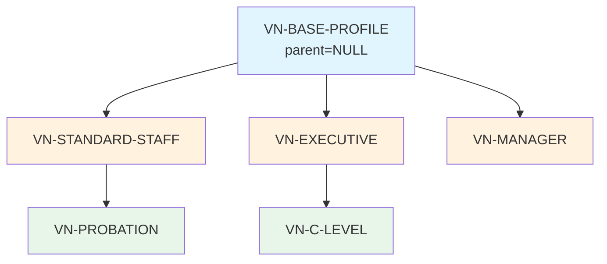
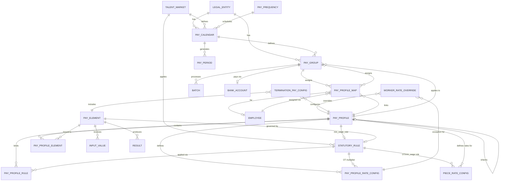

# Pay Master Schema — Configuration Layer

**Schema**: `pay_master`  
**Bounded Context**: BC-01 Pay Master, BC-02 Statutory Rules  
**Tables**: 17  
**Last Updated**: 27Mar2026

---

## Overview

`pay_master` là **configuration layer** của Payroll module — định nghĩa mọi thứ cần để tính lương: cấu trúc, elements, rules, profiles, rate configs.

**Key Characteristics**:
- **17 tables** — largest schema in PR
- **SCD-2 versioning** trên 11 tables → track config history
- **Multi-country scoping** via `country_code`, `config_scope_id`
- **Profile inheritance** via `parent_profile_id`
- **Explicit bindings** via join tables (`pay_profile_element`, `pay_profile_rule`)

---

## 1. Schema Structure

```
pay_master
│
├── STRUCTURE (4 tables)
│   ├── pay_frequency          # Reference: MONTHLY, BIWEEKLY, WEEKLY
│   ├── pay_calendar           # Aggregate Root: Payroll schedule
│   ├── pay_group              # Aggregate Root: Worker grouping
│   └── pay_profile_map        # Assignment: Worker → PayGroup/Profile
│
├── CORE AGGREGATES (3 tables)
│   ├── pay_element            # Aggregate Root: Pay component definition
│   ├── pay_profile            # Aggregate Root: Configuration bundle
│   └── statutory_rule         # Aggregate Root: Regulatory rules
│
├── PROFILE BINDINGS (2 tables)
│   ├── pay_profile_element    # Entity: PayElement → PayProfile binding
│   └── pay_profile_rule       # Entity: StatutoryRule → PayProfile binding
│
├── RATE CONFIGS (3 tables)
│   ├── pay_profile_rate_config    # VO: Profile-level hourly rates
│   ├── worker_rate_override       # VO: Worker-level exceptions
│   └── piece_rate_config          # VO: Piece-rate lookup
│
├── SUPPORT CONFIGS (5 tables)
│   ├── balance_def            # VO: YTD/QTD/LTD definitions
│   ├── costing_rule           # VO: GL cost center allocation
│   ├── gl_mapping             # VO: Element → GL account
│   ├── validation_rule        # VO: Pre-run validation
│   └── payslip_template       # VO: Payslip format
│
└── POLICIES (5 tables)
    ├── pay_formula            # VO: Reusable formulas
    ├── pay_deduction_policy   # VO: Deduction policies
    ├── pay_adjust_reason      # VO: Adjustment reasons
    ├── termination_pay_config # Entity: Final pay elements
    └── pay_benefit_link       # VO: Element ↔ Benefit mapping
```

---

## 2. Structure Layer

### 2.1 pay_frequency

**Type**: Reference Table  
**Purpose**: Define payroll frequency options

```sql
Table pay_master.pay_frequency {
  code        varchar(20) [pk]     -- MONTHLY, BIWEEKLY, SEMIMONTHLY, WEEKLY, DAILY
  name        varchar(50)
  period_days smallint             -- Standard work days per period
}
```

**Usage**:
- Referenced by `pay_calendar.frequency_code`
- Used in pro-rata calculation formulas

| Code | Period Days | Example |
|------|-------------|---------|
| MONTHLY | 22 | VN standard |
| BIWEEKLY | 10 | US bi-weekly |
| WEEKLY | 5 | Hourly workers |

---

### 2.2 pay_calendar

**Type**: Aggregate Root (SCD-2)  
**Purpose**: Define payroll schedule per Legal Entity

```sql
Table pay_master.pay_calendar {
  id                   uuid [pk]
  legal_entity_id      uuid [ref: > org_legal.entity.id]
  market_id            uuid [ref: > common.talent_market.id]
  code                 varchar(50) [unique]
  name                 varchar(255)
  description          text [null]
  frequency_code       varchar(20) [ref: > pay_master.pay_frequency.code]
  calendar_json        jsonb              -- Cut-off dates, pay dates pattern
  metadata             jsonb
  default_currency     char(3)            -- NEW JUL 2025
  
  -- SCD-2
  effective_start_date date
  effective_end_date   date [null]
  is_current_flag      boolean [default: true]
  
  created_at           timestamp [default: `now()`]
  updated_at           timestamp [null]
}
```

**Business Rules**:
- One calendar per Legal Entity (typically)
- Calendar generates `pay_period` records in `pay_mgmt`
- `calendar_json` contains: `[{period_seq, period_start, period_end, cutoff_date, pay_date}]`

**Example**:
```json
{
  "periods": [
    {"seq": 1, "start": "2025-01-01", "end": "2025-01-31", "cutoff": "2025-01-25", "pay_date": "2025-02-01"},
    {"seq": 2, "start": "2025-02-01", "end": "2025-02-28", "cutoff": "2025-02-25", "pay_date": "2025-03-01"}
  ],
  "standard_work_days": 22
}
```

---

### 2.3 pay_group

**Type**: Aggregate Root (SCD-2)  
**Purpose**: Group workers for payroll processing

```sql
Table pay_master.pay_group {
  id              uuid [pk]
  code            varchar(50) [unique]
  name            varchar(100)
  legal_entity_id uuid [ref: > org_legal.entity.id]
  market_id       uuid [ref: > common.talent_market.id]
  calendar_id     uuid [ref: > pay_master.pay_calendar.id]
  currency_code   char(3)
  bank_account_id uuid [ref: > pay_bank.bank_account.id, null]
  metadata        jsonb
  
  -- SCD-2
  effective_start_date date
  effective_end_date   date [null]
  is_current_flag      boolean [default: true]
}
```

**Business Rules**:
- One worker belongs to one PayGroup at a time
- PayGroup determines: calendar, currency, default bank account
- Workers in same PayGroup are processed together in a `batch`

**Example PayGroups**:
```
VN-STAFF-MONTHLY      → ~2000 employees, VND, VN-MONTHLY calendar
VN-EXECUTIVE-MONTHLY  → ~50 executives, VND, VN-MONTHLY calendar
SG-STAFF-MONTHLY      → ~100 employees, SGD, SG-MONTHLY calendar
```

---

### 2.4 pay_profile_map

**Type**: Entity (SCD-2)  
**Purpose**: Assign workers to PayGroup/Profile

```sql
Table pay_master.pay_profile_map {
  id              uuid [pk]
  pay_profile_id  uuid [ref: > pay_master.pay_profile.id]
  pay_group_id    uuid [ref: > pay_master.pay_group.id, null]
  employee_id     uuid [ref: > employment.employee.id, null]
  period_start    date
  period_end      date [null]
  
  -- SCD-2
  effective_start_date date
  effective_end_date   date [null]
  is_current_flag      boolean [default: true]
  
  metadata        jsonb [null]
  created_at      timestamp [default: `now()`]
  updated_at      timestamp [null]
}
```

**Assignment Logic**:
- **Option 1**: Assign to PayGroup (all members inherit PayGroup's profile)
- **Option 2**: Assign individual employee to profile (override)
- Effective dating supports mid-period transfers

---

## 3. Core Aggregates

### 3.1 pay_element

**Type**: Aggregate Root (SCD-2)  
**Purpose**: Define a pay component with formula

```sql
Table pay_master.pay_element {
  id              uuid [pk]
  code            varchar(50) [unique]
  name            varchar(100)
  classification  varchar(35)          -- EARNING | DEDUCTION | TAX | EMPLOYER_CONTRIBUTION | INFORMATIONAL
  unit            varchar(10)          -- AMOUNT | HOURS
  description     text [null]
  input_required  boolean [default:false]
  formula_json    jsonb [null]         -- Formula definition
  priority_order  smallint [null]      -- Deduction sequence
  taxable_flag    boolean [default:true]
  pre_tax_flag    boolean [default:true]
  statutory_rule_id uuid [ref: > pay_master.statutory_rule.id, null]
  eligibility_profile_id uuid [null, ref: > eligibility.eligibility_profile.id]
  
  -- Multi-country scoping (NEW 26Mar2026)
  country_code    char(2) [null]       -- NULL = global
  config_scope_id uuid [null]          -- FK to comp_core.config_scope
  
  gl_account_code varchar(50) [null]
  metadata        jsonb
  
  -- SCD-2
  effective_start_date date
  effective_end_date   date [null]
  is_current_flag      boolean [default: true]
  
  Indexes {
    (code)
    (code, country_code)               -- Country-scoped lookup
    (country_code)                     -- Country filter
    (config_scope_id)                  -- Scope group lookup
  }
}
```

**Classification Types**:

| Classification | Examples | Tax Treatment |
|----------------|----------|---------------|
| **EARNING** | BASE_SALARY, OVERTIME, BONUS | Taxable |
| **DEDUCTION** | LOAN_REPAYMENT, GARNISHMENT | Pre-tax or Post-tax |
| **TAX** | PIT, BHXH_EMPLOYEE, BHYT_EMPLOYEE | Statutory |
| **EMPLOYER_CONTRIBUTION** | BHXH_EMPLOYER, BHYT_EMPLOYER | GL tracking |
| **INFORMATIONAL** | LEAVE_DAYS, WORK_DAYS | Display only |

**Formula Lifecycle**:
```
DRAFT → PENDING_APPROVAL → APPROVED → ACTIVE → DEPRECATED
```

**Multi-Country Example**:
```
Element: OVERTIME_PAY
- country_code = NULL (global template)
- country_code = VN → VN OT rules (150%/200%/300%)
- country_code = SG → SG OT rules (1.5x for work >44h/week)
```

---

### 3.2 pay_profile

**Type**: Aggregate Root (SCD-2)  
**Purpose**: Central configuration bundle for worker groups

```sql
Table pay_master.pay_profile {
  id              uuid [pk]
  code            varchar(50) [unique]
  name            varchar(100)
  legal_entity_id uuid [ref: > org_legal.entity.id, null]
  market_id       uuid [ref: > common.talent_market.id, null]
  description     text [null]
  status_code     varchar(20) [default: 'ACTIVE']  -- ACTIVE | INACTIVE | DRAFT
  
  -- NEW 27Mar2026: Explicit configuration columns (Option C)
  parent_profile_id uuid [ref: > pay_master.pay_profile.id, null]  -- Inheritance
  pay_method      varchar(30) [not null, default: 'MONTHLY_SALARY']
  -- MONTHLY_SALARY | HOURLY | PIECE_RATE | GRADE_STEP | TASK_BASED
  grade_step_mode varchar(25) [null]               -- TABLE_LOOKUP | COEFFICIENT_FORMULA
  pay_scale_table_code varchar(50) [null]          -- FK to TR.grade_ladder.code
  proration_method varchar(20) [not null, default: 'WORK_DAYS']
  -- CALENDAR_DAYS | WORK_DAYS | NONE
  rounding_method  varchar(20) [not null, default: 'ROUND_HALF_UP']
  -- ROUND_HALF_UP | ROUND_DOWN | ROUND_UP | ROUND_NEAREST
  payment_method   varchar(20) [not null, default: 'BANK_TRANSFER']
  -- BANK_TRANSFER | CASH | CHECK | WALLET
  default_currency char(3) [null]
  min_wage_rule_id uuid [ref: > pay_master.statutory_rule.id, null]
  default_calendar_id uuid [ref: > pay_master.pay_calendar.id, null]
  
  metadata        jsonb [null]
  
  -- SCD-2
  effective_start_date date
  effective_end_date   date [null]
  is_current_flag      boolean [default: true]
  
  Indexes {
    (code)
    (pay_method)
    (parent_profile_id)
    (legal_entity_id, market_id)
    (min_wage_rule_id)
  }
}
```

**Pay Method Taxonomy**:

| Pay Method | Calculation | Config Required |
|------------|-------------|-----------------|
| **MONTHLY_SALARY** | Fixed monthly, pro-rated | proration_method |
| **HOURLY** | Hours × Rate (shift-based) | pay_profile_rate_config |
| **PIECE_RATE** | Units × Rate (product-based) | piece_rate_config |
| **GRADE_STEP** | Grade × Step lookup | pay_scale_table_code, grade_step_mode |
| **TASK_BASED** | Milestone triggers | TaskDefinition (in TR) |

**Profile Inheritance**:



**Inheritance Rules**:
- Child inherits parent's `pay_profile_element` and `pay_profile_rule` bindings
- Child can override: `priority_order`, `default_amount`, `override_formula_json`
- Changes to parent propagate to all active children

---

### 3.3 statutory_rule

**Type**: Aggregate Root (SCD-2)  
**Purpose**: Versioned regulatory rates, brackets, ceilings

```sql
Table pay_master.statutory_rule {
  id uuid [pk]
  code varchar(50) [unique]
  name varchar(255)
  market_id uuid [ref: > common.talent_market.id]
  
  -- NEW 27Mar2026: Enriched fields
  rule_category   varchar(30) [not null]
  -- TAX | SOCIAL_INSURANCE | OVERTIME | GROSS_TO_NET
  rule_type       varchar(30) [not null, default: 'FORMULA']
  -- FORMULA | LOOKUP_TABLE | CONDITIONAL | RATE_TABLE | PROGRESSIVE
  country_code    char(2) [null]
  jurisdiction    varchar(50) [null]       -- State/Province/City
  legal_reference text [null]              -- "Article 107, Labor Code 2019"
  
  description text [null]
  formula_json jsonb [null]                -- Rule data/logic
  valid_from date
  valid_to date [null]
  is_active boolean [default: true]
  
  -- SCD-2
  effective_start_date date
  effective_end_date   date [null]
  is_current_flag      boolean [default: true]
  
  Indexes {
    (code)
    (rule_category)
    (rule_category, country_code)
    (country_code)
    (code, is_current_flag)
  }
}
```

**Rule Categories**:

| Category | Examples | Usage |
|----------|----------|-------|
| **TAX** | VN_PIT_2025, SG_INCOME_TAX | PIT brackets, deductions |
| **SOCIAL_INSURANCE** | VN_SI_2025, SG_CPF_2025 | BHXH/BHYT/BHTN rates, ceilings |
| **OVERTIME** | VN_OT_MULT_2019 | OT multipliers (150%/200%/300%) |
| **GROSS_TO_NET** | VN_G2N_2025 | Full net pay pipeline |

**Example: VN_PIT_2025**:
```json
{
  "brackets": [
    {"min": 0, "max": 5000000, "rate": 0.05},
    {"min": 5000001, "max": 10000000, "rate": 0.10},
    {"min": 10000001, "max": 18000000, "rate": 0.15},
    {"min": 18000001, "max": 32000000, "rate": 0.20},
    {"min": 32000001, "max": 52000000, "rate": 0.25},
    {"min": 52000001, "max": 80000000, "rate": 0.30},
    {"min": 80000001, "max": null, "rate": 0.35}
  ],
  "personal_deduction": 11000000,
  "dependent_deduction": 4400000
}
```

---

## 4. Profile Bindings

### 4.1 pay_profile_element

**Type**: Entity  
**Purpose**: Bind PayElement to PayProfile with overrides

```sql
Table pay_master.pay_profile_element {
  id              uuid [pk]
  profile_id      uuid [ref: > pay_master.pay_profile.id, not null]
  element_id      uuid [ref: > pay_master.pay_element.id, not null]
  is_mandatory    boolean [default: false]
  priority_order  smallint [null]           -- Override element default
  default_amount  decimal(18,2) [null]      -- Profile-specific default
  override_formula_json jsonb [null]        -- Profile-specific formula
  is_active       boolean [default: true]
  
  effective_start_date date
  effective_end_date   date [null]
  
  Indexes {
    (profile_id, element_id) [unique]
    (profile_id, is_active)
    (element_id)
  }
}
```

**Use Case**:
```
Profile: VN-STANDARD-STAFF
Elements bound:
- BASE_SALARY (mandatory, priority 1)
- OVERTIME (mandatory, formula: standard OT formula)
- LUNCH_ALLOWANCE (optional, default_amount: 730000)
- BHXH_EMPLOYEE (mandatory, formula: SI formula)
- PIT (mandatory, formula: PIT formula)
```

---

### 4.2 pay_profile_rule

**Type**: Entity  
**Purpose**: Bind StatutoryRule to PayProfile with execution order

```sql
Table pay_master.pay_profile_rule {
  id              uuid [pk]
  profile_id      uuid [ref: > pay_master.pay_profile.id, not null]
  rule_id         uuid [ref: > pay_master.statutory_rule.id, not null]
  rule_scope      varchar(30) [not null]
  -- TAX | SOCIAL_INSURANCE | OVERTIME | GROSS_TO_NET
  execution_order smallint [default: 0]     -- 1=SI, 2=PIT, 3=Net
  override_params jsonb [null]
  is_active       boolean [default: true]
  
  effective_start_date date
  effective_end_date   date [null]
  
  Indexes {
    (profile_id, rule_id) [unique]
    (profile_id, rule_scope, execution_order)
    (rule_id)
  }
}
```

**Execution Order Example**:
```
Profile: VN-STANDARD-STAFF
Rules bound:
1. VN_SI_2025 (rule_scope=SOCIAL_INSURANCE, order=1)
2. VN_PIT_2025 (rule_scope=TAX, order=2)
3. VN_OT_MULT_2019 (rule_scope=OVERTIME, order=0 - pre-calc)
```

---

## 5. Rate Configs (AQ-12, AQ-13)

### 5.1 pay_profile_rate_config

**Type**: Value Object  
**Purpose**: Profile-level hourly rates for hourly/piece-rate workers

```sql
Table pay_master.pay_profile_rate_config {
  id              uuid [pk]
  pay_profile_id  uuid [ref: > pay_master.pay_profile.id, not null]
  
  rate_dimension  varchar(30) [not null]
  -- REGULAR | NIGHT | OT_WEEKDAY | OT_WEEKEND | OT_HOLIDAY | HAZARDOUS | SPECIALIZED
  
  rate_type       varchar(20) [not null, default: 'FIXED']
  -- FIXED | MULTIPLIER | FORMULA
  
  base_rate_amount decimal(15,4) [null]     -- VND/h or multiplier
  currency_code   char(3) [default: 'VND']
  formula_id      uuid [ref: > pay_master.pay_formula.id, null]
  
  statutory_rule_id uuid [ref: > pay_master.statutory_rule.id, null]
  
  description     text [null]
  is_active       boolean [default: true]
  
  effective_start_date date
  effective_end_date   date [null]
  
  Indexes {
    (pay_profile_id, rate_dimension) [unique]
    (pay_profile_id, rate_dimension, effective_start_date)
  }
}
```

**Example: HOURLY_PROFILE_FACTORY**:
```
REGULAR      → 50000 VND/h (FIXED)
NIGHT        → 65000 VND/h (FIXED, ≥130% per Labor Code)
OT_WEEKDAY   → 1.5 (MULTIPLIER × regular, statutory VN_OT_WEEKDAY)
OT_WEEKEND   → 2.0 (MULTIPLIER × regular, statutory VN_OT_WEEKEND)
OT_HOLIDAY   → 3.0 (MULTIPLIER × regular, statutory VN_OT_HOLIDAY)
```

---

### 5.2 worker_rate_override

**Type**: Value Object  
**Purpose**: Worker-level rate exceptions

```sql
Table pay_master.worker_rate_override {
  id              uuid [pk]
  worker_id       uuid [not null]           -- FK to person.worker
  pay_profile_id  uuid [ref: > pay_master.pay_profile.id, not null]
  
  rate_dimension  varchar(30) [not null]
  
  override_rate   decimal(15,4) [not null]  -- Absolute VND/h
  currency_code   char(3) [default: 'VND']
  
  reason_code     varchar(50) [null]
  -- SKILL_PREMIUM | SENIORITY | NEGOTIATED | PROBATION_DISCOUNT | GRADE_ADJUSTMENT
  reason_text     text [null]
  
  approved_by     uuid [null]
  approved_at     timestamp [null]
  
  is_active       boolean [default: true]
  
  effective_start_date date
  effective_end_date   date [null]
  
  Indexes {
    (worker_id, pay_profile_id, rate_dimension) [unique]
    (worker_id, pay_profile_id)
    (worker_id, is_active)
  }
}
```

**Use Case**:
- Senior technician: `override_rate = 60000` (vs profile default 50000)
- Probation worker: `override_rate = 42000` (PROBATION_DISCOUNT)
- Negotiated contractor: `override_rate = 150000`

---

### 5.3 piece_rate_config

**Type**: Value Object  
**Purpose**: Piece-rate lookup (product × quality_grade → rate)

```sql
Table pay_master.piece_rate_config {
  id              uuid [pk]
  pay_profile_id  uuid [ref: > pay_master.pay_profile.id, null]
  
  product_code    varchar(50) [not null]
  product_name    varchar(150) [null]
  
  quality_grade   varchar(30) [not null, default: 'STANDARD']
  -- STANDARD | GRADE_A | GRADE_B | GRADE_C | REJECT
  
  rate_per_unit   decimal(15,4) [not null]
  currency_code   char(3) [default: 'VND']
  
  quality_multiplier decimal(5,3) [null]
  -- NULL = use rate_per_unit directly
  -- Non-NULL = rate_per_unit × quality_multiplier
  
  unit_code       varchar(20) [default: 'PIECE']
  -- PIECE | KG | METER | PAIR | SET
  
  min_wage_rule_id uuid [ref: > pay_master.statutory_rule.id, null]
  ot_multiplier_rule_id uuid [ref: > pay_master.statutory_rule.id, null]
  
  is_active       boolean [default: true]
  
  effective_start_date date
  effective_end_date   date [null]
  
  Indexes {
    (pay_profile_id, product_code, quality_grade) [unique]
    (product_code, quality_grade)
  }
}
```

**Example**:
```
Product: SHIRT
- STANDARD: 15000 VND/pc
- GRADE_A: 18000 VND/pc (quality_multiplier = 1.2)
- GRADE_B: 15000 VND/pc (quality_multiplier = 1.0)
- GRADE_C: 12000 VND/pc (quality_multiplier = 0.8)
```

---

## 6. Support Configs

### 6.1 balance_def

**Purpose**: Define cumulative balance types

```sql
Table pay_master.balance_def {
  id              uuid [pk]
  code            varchar(50) [unique]
  name            varchar(100)
  balance_type    varchar(20)             -- RUN | QTD | YTD | LTD
  formula_json    jsonb [null]
  reset_freq_code varchar(20) [ref: > pay_master.pay_frequency.code, null]
  metadata        jsonb
  
  -- SCD-2
  effective_start_date date
  effective_end_date   date [null]
  is_current_flag      boolean [default: true]
}
```

**Standard Balances**:
- `GROSS_YTD` — Year-to-date gross earnings
- `TAX_YTD` — Year-to-date tax withheld
- `SI_EMPLOYEE_YTD` — Year-to-date SI employee contribution
- `NET_YTD` — Year-to-date net pay

---

### 6.2 termination_pay_config

**Purpose**: Final pay elements by termination type

```sql
Table pay_master.termination_pay_config {
  id              uuid [pk]
  pay_profile_id  uuid [ref: > pay_master.pay_profile.id, not null]
  
  termination_type varchar(30) [not null]
  -- RESIGNATION | MUTUAL_AGREEMENT | REDUCTION_IN_FORCE | END_OF_CONTRACT | DISMISSAL | RETIREMENT
  
  element_id       uuid [ref: > pay_master.pay_element.id, not null]
  
  is_mandatory    boolean [default: true]
  execution_order smallint [default: 0]
  formula_override_json jsonb [null]
  
  description     text [null]
  is_active       boolean [default: true]
  
  effective_start_date date
  effective_end_date   date [null]
  
  Indexes {
    (pay_profile_id, termination_type, element_id) [unique]
    (pay_profile_id, termination_type, execution_order)
  }
}
```

**Example**:
```
Termination: REDUCTION_IN_FORCE
Elements:
1. PRORATED_SALARY (order=1)
2. LEAVE_PAYOUT (order=2)
3. 13TH_MONTH_PRORATE (order=3)
4. SEVERANCE (order=4, formula: tenure_years × 0.5 × avg_salary)
```

---

## 7. ERD — Pay Master Schema



---

## 8. Key Business Rules

| Rule ID | Summary | Table(s) |
|---------|---------|----------|
| BR-001 | Base salary pro-ration by calendar days | pay_element, pay_profile |
| BR-002 | Base salary pro-ration by work days | pay_element, pay_profile |
| BR-003 | Element-level proration override | pay_element, pay_profile_element |
| BR-004-008 | OT premium configuration | statutory_rule, pay_profile_rate_config |
| BR-012 | Piece-rate table configuration | piece_rate_config |
| BR-013 | Hourly rate config | pay_profile_rate_config |
| BR-014-015 | Grade-Step modes | pay_profile (grade_step_mode) |
| BR-027 | SI basis inclusion flag | pay_element |
| BR-060 | Deduction priority order | pay_element, pay_profile_element |
| BR-070-073 | Minimum wage floor | pay_profile.min_wage_rule_id |

---

## 9. Query Patterns

### 9.1 Get Active Profile for Worker

```sql
SELECT pp.*
FROM pay_master.pay_profile pp
JOIN pay_master.pay_profile_map ppm ON pp.id = ppm.pay_profile_id
WHERE ppm.employee_id = :employee_id
  AND ppm.effective_start_date <= :period_date
  AND (ppm.effective_end_date IS NULL OR ppm.effective_end_date > :period_date)
  AND ppm.is_current_flag = true;
```

### 9.2 Get Elements for Profile

```sql
SELECT pe.*, ppe.is_mandatory, ppe.priority_order, ppe.default_amount
FROM pay_master.pay_element pe
JOIN pay_master.pay_profile_element ppe ON pe.id = ppe.element_id
WHERE ppe.profile_id = :profile_id
  AND ppe.is_active = true
  AND pe.is_current_flag = true
ORDER BY ppe.priority_order;
```

### 9.3 Get Statutory Rule by Effective Date

```sql
SELECT sr.*
FROM pay_master.statutory_rule sr
WHERE sr.code = :rule_code
  AND sr.valid_from <= :cutoff_date
  AND (sr.valid_to IS NULL OR sr.valid_to > :cutoff_date)
  AND sr.is_current_flag = true
  AND sr.is_active = true;
```

### 9.4 Lookup Rate (3-Layer)

```sql
-- Layer 1: Worker override
SELECT override_rate
FROM pay_master.worker_rate_override
WHERE worker_id = :worker_id
  AND pay_profile_id = :profile_id
  AND rate_dimension = :dimension
  AND is_active = true;

-- Layer 2: Profile default (if Layer 1 not found)
SELECT rate_type, base_rate_amount, statutory_rule_id
FROM pay_master.pay_profile_rate_config
WHERE pay_profile_id = :profile_id
  AND rate_dimension = :dimension
  AND is_active = true;

-- Layer 3: Statutory rule (if Layer 2 rate_type = MULTIPLIER)
SELECT formula_json->'multiplier' as multiplier
FROM pay_master.statutory_rule
WHERE id = :statutory_rule_id
  AND is_current_flag = true;
```

---

*[Previous: Model Overview](./01-model-overview.md) · [Next: Pay Mgmt Schema →](./03-pay-mgmt-schema.md)*