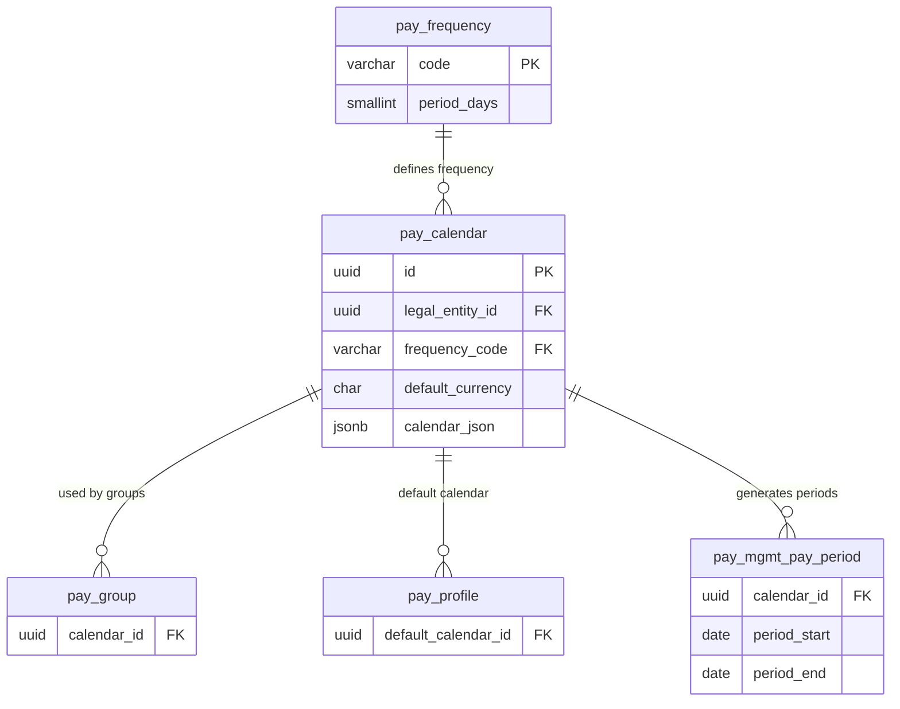

# pay_calendar — Lịch Lương (Pay Calendar)

> **Schema:** `pay_master.pay_calendar`
> **DDD Classification:** Aggregate Root
> **SCD-2:** `effective_start_date / effective_end_date / is_current_flag`
> **Changed:** JUL 2025 (initial + `default_currency` added)

---

## 1. Config những gì?

`pay_calendar` định nghĩa **lịch trình trả lương** của một Legal Entity: khi nào cut-off, khi nào trả lương, theo tần suất nào. Mỗi `pay_group` phải gắn vào 1 calendar.

> **Phân biệt:** `pay_frequency` = tần suất (template). `pay_calendar` = lịch cụ thể của LE (ngày cut-off, ngày pay, holidays xử lý ra sao).

### Nhóm 1 — Định danh & Phạm vi

| Field | Type | Ý nghĩa | Ví dụ |
|-------|------|---------|-------|
| `code` | varchar(50) UNIQUE | Mã lịch lương | `CAL_VN_HCM_MONTHLY`, `CAL_SG_BIWEEKLY` |
| `name` | varchar(255) | Tên hiển thị | `Lịch lương tháng – VN HCM 2024` |
| `legal_entity_id` | uuid FK | LE sở hữu calendar | FK → `org_legal.entity` |
| `market_id` | uuid FK | Market áp dụng | FK → `common.talent_market` |
| `description` | text | Mô tả thêm | Tùy chọn |

### Nhóm 2 — Cấu hình lịch

| Field | Type | Ý nghĩa | Ví dụ |
|-------|------|---------|-------|
| `frequency_code` | varchar(20) FK | Tần suất trả lương | `MONTHLY`, `BIWEEKLY` |
| `default_currency` | char(3) | Tiền tệ mặc định của lịch | `VND`, `USD` |
| `calendar_json` | jsonb | Chi tiết lịch: cut-off date, pay date, holiday rules | Xem cấu trúc bên dưới |
| `metadata` | jsonb | Thông tin bổ sung | Tùy chọn |

### Cấu trúc `calendar_json` — gợi ý schema

```jsonc
{
  // Ngày chốt dữ liệu (attendance, OT, adjustments)
  "cutoff_day_of_month": 25,        // ngày 25 hàng tháng
  "cutoff_time": "18:00",           // 18h00 ngày 25

  // Ngày trả lương
  "pay_day_of_month": 5,            // ngày 5 tháng sau
  "pay_day_adjustment": "PREV_WORKDAY", // nếu rơi cuối tuần: trả ngày LV trước

  // Xử lý tháng không đủ ngày (Feb 28/29, tháng 30 ngày)
  "short_month_rule": "LAST_DAY",   // LAST_DAY | FIXED

  // Ngày nghỉ ảnh hưởng pay_day
  "holiday_rule": "PREV_WORKDAY",   // PREV_WORKDAY | NEXT_WORKDAY | NO_ADJUST

  // Khoảng thời gian tính lương (period)
  "period_start_day": 1,            // ngày 1
  "period_end_day": "LAST",         // ngày cuối tháng

  // Preview các kỳ lương sắp tới (materialized vào pay_mgmt.pay_period)
  "generate_periods_ahead": 3       // tạo sẵn 3 kỳ tương lai
}
```

---

## 2. Business Rules

| BR | Mô tả |
|----|-------|
| **BR-PR-CAL01** | Mỗi LE có thể có nhiều calendars (ví dụ: văn phòng `MONTHLY` + nhà máy `BIWEEKLY`). Nhưng 1 `pay_group` chỉ gắn vào đúng 1 calendar tại 1 thời điểm. |
| **BR-PR-CAL02** | `default_currency` phải là ISO 4217 code hợp lệ, tham chiếu `common.currency.code`. Đây là currency mặc định cho toàn bộ pay_group gắn vào calendar này. |
| **BR-PR-CAL03** | Khi có cut-off ngày 25, dữ liệu attendance/OT sau ngày 25 sẽ được tính vào kỳ **tháng sau**. Payroll operator phải kiểm tra và confirm trước khi freeze period. |
| **BR-PR-CAL04** | SCD-2: Khi thay đổi `calendar_json` (ví dụ: dời pay_day từ 5 sang 3), tạo record mới thay vì update tại chỗ. Các kỳ lương lịch sử vẫn giữ nguyên cấu hình cũ. |
| **BR-PR-CAL05** | `pay_day_adjustment = PREV_WORKDAY` là rule phổ biến nhất tại VN — khi ngày 5 rơi vào thứ 7 hoặc chủ nhật → chuyển sang thứ 6 hoặc thứ 2. |

---

## 3. Quan hệ với các entity khác



---

## 4. Ví dụ thực tế (VN Context)

### Ví dụ 1: Lịch lương tháng chuẩn — văn phòng VN

```json
{
  "code": "CAL_VN_MONTHLY_STD",
  "name": "Lịch lương tháng – Văn phòng VN (Chuẩn)",
  "legal_entity_id": "<LE_VN_UUID>",
  "market_id": "<MARKET_VN_UUID>",
  "frequency_code": "MONTHLY",
  "default_currency": "VND",
  "calendar_json": {
    "cutoff_day_of_month": 25,
    "cutoff_time": "18:00",
    "pay_day_of_month": 5,
    "pay_day_adjustment": "PREV_WORKDAY",
    "short_month_rule": "LAST_DAY",
    "holiday_rule": "PREV_WORKDAY",
    "period_start_day": 1,
    "period_end_day": "LAST",
    "generate_periods_ahead": 3
  },
  "effective_start_date": "2024-01-01"
}
```

> **Timeline kỳ tháng 4/2026:**
> - Period: 01/04 → 30/04/2026
> - Cut-off: 25/04/2026 18:00 (chốt attendance, OT)
> - Pay day: 05/05/2026 (thứ 3 → không cần adjust)

---

### Ví dụ 2: Lịch 2 tuần — FDI manufacturing

```json
{
  "code": "CAL_VN_BIWEEKLY_FACTORY",
  "name": "Lịch lương 2 tuần – Nhà máy FDI",
  "frequency_code": "BIWEEKLY",
  "default_currency": "VND",
  "calendar_json": {
    "cutoff_day_of_week": 5,
    "cutoff_time": "22:00",
    "pay_day_offset": 3,
    "pay_day_adjustment": "NEXT_WORKDAY",
    "period_length_days": 14,
    "note": "Cut-off thứ 6 22h, trả lương thứ 4 tuần sau (offset 3 ngày làm việc)"
  },
  "effective_start_date": "2024-01-01"
}
```

---

### Ví dụ 3: Lịch lương tháng — Singapore subsidiary

```json
{
  "code": "CAL_SG_MONTHLY",
  "name": "Monthly Payroll Calendar — SG Entity",
  "legal_entity_id": "<LE_SG_UUID>",
  "market_id": "<MARKET_SG_UUID>",
  "frequency_code": "MONTHLY",
  "default_currency": "SGD",
  "calendar_json": {
    "cutoff_day_of_month": 20,
    "pay_day_of_month": "LAST",
    "pay_day_adjustment": "PREV_WORKDAY",
    "period_start_day": 1,
    "period_end_day": "LAST",
    "note": "SG: Pay on last working day of month per MOM guidelines"
  }
}
```

---

## 5. Query Patterns thường gặp

```sql
-- Lấy tất cả active calendars của 1 LE
SELECT code, name, frequency_code, default_currency
FROM pay_master.pay_calendar
WHERE legal_entity_id = :le_id
  AND is_current_flag = TRUE
ORDER BY code;

-- Calendar nào đang được pay_group dùng?
SELECT pc.code AS calendar_code, pg.code AS group_code, pg.name AS group_name
FROM pay_master.pay_calendar pc
JOIN pay_master.pay_group pg ON pg.calendar_id = pc.id
WHERE pc.is_current_flag = TRUE
  AND pg.is_current_flag = TRUE;

-- Tìm pay_day tháng tới (cần parse calendar_json)
SELECT code, name,
       calendar_json->>'pay_day_of_month' AS pay_day_config,
       calendar_json->>'pay_day_adjustment' AS adjustment_rule
FROM pay_master.pay_calendar
WHERE frequency_code = 'MONTHLY'
  AND is_current_flag = TRUE;
```

---

## 6. Design Notes

> [!IMPORTANT]
> **`calendar_json` không có DB schema validation.** Application layer phải validate structure khi save. Recommended: dùng JSON Schema validation ở service layer trước khi persist.

> [!NOTE]
> **Periods được materialized:** `pay_mgmt.pay_period` chứa các kỳ lương cụ thể (period_start, period_end, pay_date) được generate dựa trên `calendar_json`. Không tính lại mỗi lần — performance. `generate_periods_ahead` config số kỳ tạo sẵn.

> [!NOTE]
> **`default_calendar_id` trên `pay_profile`:** Profile có thể override calendar mặc định nếu 1 nhóm worker cần lịch riêng. Thứ tự ưu tiên: pay_group.calendar_id > pay_profile.default_calendar_id.
