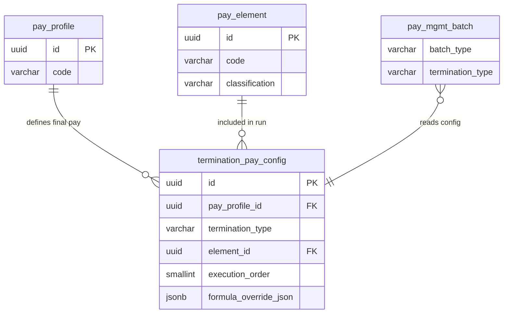

# termination_pay_config — Cấu hình Thanh toán Khi Chấm dứt HĐ (Final Pay)

> **Schema:** `pay_master.termination_pay_config`
> **DDD Classification:** Entity
> **SCD-2:** Partial — `effective_start_date / effective_end_date` cho versioning theo thời gian (không có `is_current_flag`)
> **Changed:** 27Mar2026 (NEW — AQ-10 Option D) | 13Apr2026 (Change 47: add `is_mandatory`, `description`, SCD-2 fields)


---

## 1. Config những gì?

`termination_pay_config` định nghĩa **danh sách elements nào được tính và theo thứ tự nào trong payroll run cuối cùng** khi employee nghỉ việc, phụ thuộc vào **loại chấm dứt hợp đồng**. Cùng 1 profile có thể có cấu hình final pay khác nhau cho RESIGNATION vs DISMISSAL vs RETIREMENT.

> **Context:** `pay_mgmt.batch` với `batch_type = TERMINATION` sẽ đọc `termination_pay_config` để biết tính elements nào, theo thứ tự nào, với formula nào.

### Fields

| Field | Type | Ý nghĩa | Ví dụ |
|-------|------|---------|-------|
| `pay_profile_id` | uuid FK NOT NULL | Profile áp dụng. Kết hợp với `termination_type` | FK → `pay_master.pay_profile` |
| `termination_type` | varchar(30) NOT NULL | Loại chấm dứt | Xem enum bên dưới |
| `element_id` | uuid FK NOT NULL | Element được tính trong final pay | FK → `pay_master.pay_element` |
| `is_mandatory` | boolean NOT NULL | Element bắt buộc phải tính? `false` = optional | `true` cho `BASIC_SALARY`, `false` cho `HAZARD_ALLOWANCE` |
| `execution_order` | smallint NOT NULL | Thứ tự tính element trong run | `1` = BASIC trước, `90` = PIT sau cùng |
| `formula_override_json` | jsonb | Override formula cho final pay run. `NULL` = dùng element default | `{"ref": "FML_SEVERANCE_VN"}` |
| `description` | text | Mô tả element trong context termination này | |
| `is_active` | boolean | Có đang dùng không? | `true` |
| `effective_start_date` | date | Ngày hiệu lực | `2024-01-01` |
| `effective_end_date` | date | Ngày hết hiệu lực, `NULL` = đang dùng | `null` |


---

## 2. Enum — `termination_type`

| Giá trị | Tiếng Việt | Entitlements điển hình | Căn cứ pháp lý |
|---------|-----------|----------------------|----------------|
| `RESIGNATION` | Tự nghỉ việc (NLĐ chủ động) | Lương tháng lẻ + phép tồn dư | BLLĐ Điều 48 |
| `MUTUAL_AGREEMENT` | Thỏa thuận chấm dứt HĐLĐ | Như resignation + có thể thêm ex-gratia | BLLĐ Điều 34(3) |
| `REDUCTION_IN_FORCE` | Cắt giảm nhân lực | Lương tháng lẻ + trợ cấp thôi việc + BHXH 1 lần | BLLĐ Điều 42, 46 |
| `END_OF_CONTRACT` | Hết hạn HĐLĐ | Lương tháng lẻ + trợ cấp hết hạn | BLLĐ Điều 48(2) |
| `DISMISSAL` | Sa thải (vi phạm kỷ luật) | Chỉ lương tháng lẻ — KHÔNG TRỢ CẤP | BLLĐ Điều 81 |
| `RETIREMENT` | Nghỉ hưu | Lương tháng lẻ + phụ cấp nghỉ hưu (nếu có) | BLLĐ Điều 169 |

---

## 3. Business Rules

| BR | Mô tả |
|----|-------|
| **BR-PR-TPC01** | Unique: `(pay_profile_id, termination_type, element_id)` — mỗi element chỉ xuất hiện 1 lần trong mỗi (profile × termination_type) config. |
| **BR-PR-TPC02** | `DISMISSAL` KHÔNG được có elements `SEVERANCE_PAY` hoặc `TERMINATION_ALLOWANCE`. Engine phải validate trước khi run. BLLĐ Điều 81 — sa thải kỷ luật không được nhận trợ cấp. |
| **BR-PR-TPC03** | `formula_override_json` dùng khi final pay cần tính khác formula thông thường. Ví dụ: lương tháng lẻ = `actual_days / calendar_days × monthly_salary` (thay vì `work_days / 26`). |
| **BR-PR-TPC04** | `execution_order` phải đảm bảo: EARNING elements (10–50) → DEDUCTION pre-tax (60–70) → TAX (90). Không được tính PIT trước khi có gross earning. |
| **BR-PR-TPC05** | `REDUCTION_IN_FORCE` tại VN phải bao gồm `SEVERANCE_ALLOWANCE` (trợ cấp thôi việc: 0.5 tháng/năm làm việc, tối đa 12 tháng lương) — BLLĐ Điều 46. Engine phải có formula tính theo số năm công tác. |
| **BR-PR-TPC06** | Trợ cấp thôi việc từ BHXH là khoản riêng, **không** đưa vào `termination_pay_config` — BHXH tự chi trả theo quy định riêng. Chỉ config phần công ty phải trả. |
| **BR-PR-TPC07** | Leave balance payout (tiền phép còn lại) = element `LEAVE_PAYOUT` trong termination run. Số ngày phép lấy từ `absence.leave_instant`, không phải input thủ công. |

---

## 4. Quan hệ với các entity khác



**Cross-module inputs khi run TERMINATION batch:**
```
pay_mgmt.batch (batch_type=TERMINATION, termination_type=RESIGNATION)
  → reads termination_pay_config for (pay_profile_id, 'RESIGNATION')
  → for each element (by execution_order):
      BASIC_SALARY_PRORATE:  lương ngày lẻ (actual_days / cal_days × monthly_salary)
      MEAL_ALLOWANCE_PRORATE: phụ cấp ngày lẻ
      LEAVE_PAYOUT:          ngày phép × (monthly_salary / 26)  ← từ absence module
      UNPAID_ADVANCE_DEDUCT:  trừ tạm ứng chưa hoàn  ← từ manual_adjust PENDING
      BHXH_EE_PRORATE:       BHXH ngày lẻ
      PIT_FINAL:             thuế TNCN quyết toán
```

---

## 5. Ví dụ thực tế (VN Context)

### Profile: `MONTHLY_OFFICE_VN` — 6 termination types

**RESIGNATION (tự xin nghỉ):**

| execution_order | element_code | formula_override_json | Ghi chú |
|:-:|-------------|:---:|---------|
| 10 | `BASIC_SALARY_PRORATE` | `{"ref": "FML_TERMINATION_PRORATE"}` | Lương ngày lẻ (actual/cal_days × monthly) |
| 20 | `MEAL_ALLOWANCE_PRORATE` | `{"ref": "FML_TERMINATION_PRORATE"}` | Phụ cấp ăn ngày lẻ |
| 25 | `TRANSPORT_ALLOWANCE_PRORATE` | `{"ref": "FML_TERMINATION_PRORATE"}` | Phụ cấp đi lại ngày lẻ |
| 30 | `LEAVE_PAYOUT` | `{"ref": "FML_LEAVE_PAYOUT_VN"}` | Ngày phép dư × daily rate |
| 60 | `BHXH_EE_PRORATE` | null | BHXH ngày lẻ (pre-tax) |
| 61 | `BHYT_EE_PRORATE` | null | BHYT ngày lẻ (pre-tax) |
| 90 | `PIT_FINAL` | `{"ref": "FML_PIT_TERMINATION"}` | Quyết toán thuế TNCN năm hiện tại |

---

**REDUCTION_IN_FORCE (cắt giảm):**

| execution_order | element_code | formula_override_json | Ghi chú |
|:-:|-------------|:---:|---------|
| 10–90 | (Same as RESIGNATION) | — | Tất cả elements của RESIGNATION + |
| 40 | `SEVERANCE_ALLOWANCE` | `{"ref": "FML_SEVERANCE_VN"}` | 0.5 × monthly × years_of_service (BLLĐ Điều 46) |
| 45 | `NOTICE_PAY` | null | Nếu công ty không báo trước đủ (BLLĐ Điều 42) |

---

**DISMISSAL (sa thải):**

| execution_order | element_code | formula_override_json | Ghi chú |
|:-:|-------------|:---:|---------|
| 10 | `BASIC_SALARY_PRORATE` | `{"ref": "FML_TERMINATION_PRORATE"}` | Chỉ trả lương ngày thực làm |
| 60 | `BHXH_EE_PRORATE` | null | |
| 90 | `PIT_FINAL` | null | |
| ❌ | `SEVERANCE_ALLOWANCE` | — | **KHÔNG CÓ** — BLLĐ Điều 81 |
| ❌ | `LEAVE_PAYOUT` | — | **KHÔNG CÓ** khi sa thải kỷ luật nặng |

---

**FML_SEVERANCE_VN (formula trong pay_formula):**
```json
{
  "lang": "MVEL",
  "content": "Math.min(years_of_service * 0.5 * monthly_salary, 12 * monthly_salary)",
  "params": {
    "years_of_service": "employment.tenure_years",
    "monthly_salary": "pay_engine.current_monthly_salary"
  },
  "note": "BLLĐ Điều 46: 0.5 tháng/năm, tối đa 12 tháng"
}
```

---

## 6. Query Patterns thường gặp

```sql
-- Elements cho 1 (profile, termination_type) — engine load khi run
SELECT pe.code, pe.name, pe.classification,
       tpc.execution_order, tpc.formula_override_json
FROM pay_master.termination_pay_config tpc
JOIN pay_master.pay_element pe ON pe.id = tpc.element_id
WHERE tpc.pay_profile_id = :profile_id
  AND tpc.termination_type = :term_type
  AND tpc.is_active = TRUE
  AND pe.is_current_flag = TRUE
ORDER BY tpc.execution_order;

-- So sánh entitlements giữa RESIGNATION và RIF
SELECT tpc.termination_type, pe.code, tpc.execution_order
FROM pay_master.termination_pay_config tpc
JOIN pay_master.pay_element pe ON pe.id = tpc.element_id
WHERE tpc.pay_profile_id = :profile_id
  AND tpc.termination_type IN ('RESIGNATION', 'REDUCTION_IN_FORCE')
  AND tpc.is_active = TRUE
ORDER BY tpc.termination_type, tpc.execution_order;

-- Profile nào chưa config DISMISSAL termination pay? (risk audit)
SELECT pp.code, pp.name
FROM pay_master.pay_profile pp
WHERE pp.status_code = 'ACTIVE' AND pp.is_current_flag = TRUE
  AND NOT EXISTS (
    SELECT 1 FROM pay_master.termination_pay_config tpc
    WHERE tpc.pay_profile_id = pp.id
      AND tpc.termination_type = 'DISMISSAL'
      AND tpc.is_active = TRUE
  );
```

---

## 7. Design Notes

> [!IMPORTANT]
> **DISMISSAL ≠ RESIGNATION về entitlements.** System-level rule: DISMISSAL config không được include `SEVERANCE_ALLOWANCE`, `TERMINATION_ALLOWANCE`, hoặc `LEAVE_PAYOUT` (trong trường hợp vi phạm nghiêm trọng). Validate tại application layer trước khi save, và tại engine layer trước khi run.

> [!NOTE]
> **Leave payout đến từ absence module.** `LEAVE_PAYOUT` element cần input `remaining_leave_days` từ `absence.leave_instant`. Engine phải pull (qua `input_source_config`) trước khi tính. Không để HR nhập thủ công — risk sai số.

> [!NOTE]
> **Severance từ BHXH vs công ty khác nhau.** `SEVERANCE_ALLOWANCE` trong table = phần công ty phải trả theo luật. Khoản từ BHXH (bảo hiểm thất nghiệp) do BHXH tự chi trả và không đi qua payroll. Tránh double-count.
